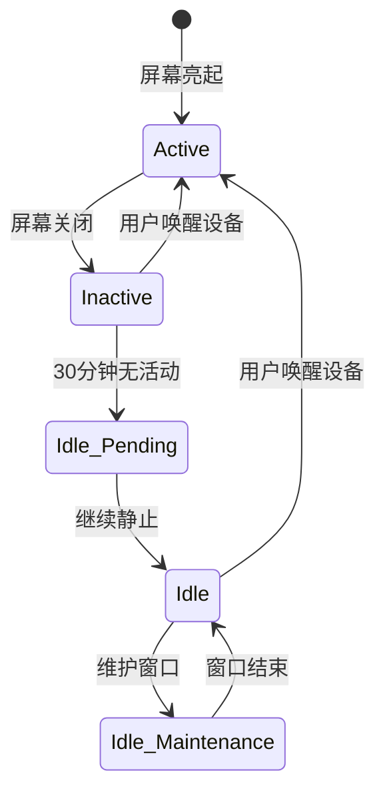

# App 保活 - 进阶篇

## 一、Android 后台限制演进史

### 1.1 限制时间线

理解保活，必须先理解 Google 为什么要限制后台——**省电、省内存、保护用户隐私**。

```
Android 4.x  野蛮生长期，各种保活黑科技横行
    ↓
Android 5.0  JobScheduler 登场，倡导统一调度（2014）
    ↓
Android 6.0  Doze 模式，设备静止时深度休眠（2015）
    ↓
Android 7.0  Doze on the Go，移动时也省电（2016）
    ↓
Android 8.0  后台服务限制，5秒必须转前台（2017）
    ↓
Android 9.0  App Standby Buckets，分桶管理（2018）
    ↓
Android 10   后台定位限制（2019）
    ↓
Android 11   前台服务类型强制声明（2020）
    ↓
Android 12   后台启动前台服务限制（2021）
    ↓
Android 13   通知权限需动态申请（2022）
    ↓
Android 14   前台服务类型权限细化（2023）
    ↓
Android 15   精确闹钟限制、前台服务时长限制（2024）
```

### 1.2 Doze 模式详解

**什么是 Doze？**

当设备未充电、屏幕关闭、静止不动一段时间后，系统进入 Doze 模式：

```
┌──────────────────────────────────────────────────┐
│                   Doze 模式                       │
├──────────────────────────────────────────────────┤
│  限制内容：                                        │
│  ❌ 网络访问被暂停                                 │
│  ❌ 忽略 Wake Lock                                │
│  ❌ AlarmManager 被推迟（非精确闹钟）              │
│  ❌ WiFi 扫描停止                                  │
│  ❌ JobScheduler 任务推迟                         │
│  ❌ 同步适配器（Sync Adapter）停止                │
├──────────────────────────────────────────────────┤
│  维护窗口：                                        │
│  系统会周期性退出 Doze，让 App 执行被推迟的操作     │
│  窗口时间越来越短，间隔越来越长                     │
└──────────────────────────────────────────────────┘
```

**Doze 状态机**：



### 1.3 App Standby Buckets（应用待机分组）

Android 9.0 引入，系统根据 App 使用频率分成不同"桶"：

| 桶 | 使用频率 | 限制程度 | JobScheduler 延迟 |
|---|---------|---------|------------------|
| **Active**（活跃） | 正在使用 | 无限制 | 无延迟 |
| **Working Set**（工作集） | 经常使用 | 轻微限制 | 最多 2 小时 |
| **Frequent**（常用） | 定期使用 | 中等限制 | 最多 8 小时 |
| **Rare**（罕用） | 很少使用 | 严格限制 | 最多 24 小时 |
| **Restricted**（受限） | 几乎不用 | 最严格 | 最多 24 小时 + 配额限制 |

**查看当前桶**：

```bash
adb shell am get-standby-bucket <package_name>
```

**设置桶（调试用）**：

```bash
adb shell am set-standby-bucket <package_name> <bucket>
# bucket: active, working_set, frequent, rare, restricted
```

### 1.4 Android 8.0 后台服务限制

**核心变化**：后台 App 不能随意启动后台服务。

```kotlin
// ❌ Android 8.0+ 这样会崩溃（从后台启动服务）
context.startService(Intent(context, MyService::class.java))

// ✅ 正确做法：启动前台服务
if (Build.VERSION.SDK_INT >= Build.VERSION_CODES.O) {
    context.startForegroundService(Intent(context, MyService::class.java))
} else {
    context.startService(Intent(context, MyService::class.java))
}
```

**关键要求**：`startForegroundService()` 启动的服务，**必须在 5 秒内调用 `startForeground()`**，否则系统会停止服务并抛出 ANR。

### 1.5 Android 12 前台服务启动限制

**核心变化**：后台 App 不能启动前台服务（有例外）。

**允许的例外情况**：

| 例外场景 | 说明 |
|---------|------|
| 收到高优先级 FCM 消息 | 推送触发 |
| 用户点击通知/Widget/Activity | 用户主动操作 |
| 精确闹钟（SCHEDULE_EXACT_ALARM） | 已获得权限 |
| 设备重启后的短时间内 | Boot Complete 广播 |
| App 有前台活动（最近几秒内） | 刚退到后台 |
| 系统组件绑定 | 被系统调用 |

**解决方案**：如果需要从后台启动任务，使用 WorkManager。

---

## 二、曾经的"黑科技"保活方案（已失效）

### 2.1 1 像素 Activity

**原理**：在锁屏时启动一个 1x1 像素的透明 Activity，让 App 变成"前台进程"。

```kotlin
// ⚠️ 此方案已被各厂商封杀，仅供了解原理
class KeepAliveActivity : Activity() {
    override fun onCreate(savedInstanceState: Bundle?) {
        super.onCreate(savedInstanceState)
        window.setGravity(Gravity.START or Gravity.TOP)
        val params = window.attributes
        params.width = 1
        params.height = 1
        params.x = 0
        params.y = 0
        window.attributes = params
    }
}
```

**为什么失效**：
- 厂商检测到 1x1 Activity 会直接杀掉
- Android 10+ 后台启动 Activity 受限
- 用户可以在"最近任务"看到异常

### 2.2 双进程守护

**原理**：启动两个进程，互相监听对方，一个被杀就拉起另一个。

```kotlin
// ⚠️ 此方案已被各厂商封杀，仅供了解原理

// 进程 A：监听进程 B
class ProcessA : Service() {
    override fun onStartCommand(intent: Intent?, flags: Int, startId: Int): Int {
        bindService(
            Intent(this, ProcessB::class.java),
            connectionToB,
            Context.BIND_IMPORTANT
        )
        return START_STICKY
    }
    
    private val connectionToB = object : ServiceConnection {
        override fun onServiceDisconnected(name: ComponentName?) {
            // B 挂了，重新绑定
            bindService(Intent(this@ProcessA, ProcessB::class.java), this, Context.BIND_IMPORTANT)
        }
        override fun onServiceConnected(name: ComponentName?, service: IBinder?) {}
    }
}
```

**为什么失效**：
- 厂商的杀进程策略会同时杀关联进程
- Android 8.0+ 后台服务限制
- 被检测到会被应用商店下架

### 2.3 Native 进程保活

**原理**：fork 一个 Native 进程，通过管道/Socket 与 Java 层通信，监听主进程状态。

**为什么失效**：
- 厂商会连 Native 进程一起杀
- SELinux 策略限制
- 电量消耗大，被用户投诉

### 2.4 账户同步（AccountManager）

**原理**：利用 Android 账户同步机制，系统会定期唤醒同步适配器。

**为什么不推荐**：
- Doze 模式下同步被推迟
- 配置复杂，需要 ContentProvider、Authenticator 等
- 用户可以手动关闭同步

---

## 三、合规保活方案

### 3.1 厂商推送通道

**最可靠的保活方式是不保活，而是用推送唤醒。**

| 厂商 | 推送服务 | 说明 |
|-----|---------|------|
| 华为 | HMS Push | 华为设备必接 |
| 小米 | MiPush | 小米设备必接 |
| OPPO | Push | OPPO/一加设备 |
| vivo | Push | vivo 设备 |
| 荣耀 | 华为 HMS 或自有通道 | 需要确认 |
| 魅族 | Flyme Push | 魅族设备 |
| Google | FCM | 海外必接 |

**统一推送示例（以小米推送为例）**：

```kotlin
// 1. 初始化（Application 中）
class App : Application() {
    override fun onCreate() {
        super.onCreate()
        // 注册小米推送
        if (shouldUseMiPush()) {
            MiPushClient.registerPush(this, APP_ID, APP_KEY)
        }
    }
    
    private fun shouldUseMiPush(): Boolean {
        // 判断是否是小米设备
        return Build.MANUFACTURER.equals("Xiaomi", ignoreCase = true)
    }
}

// 2. 接收消息
class MiPushReceiver : PushMessageReceiver() {
    override fun onReceivePassThroughMessage(context: Context, message: MiPushMessage) {
        // 透传消息，App 需要自己处理
        handleMessage(message.content)
    }
    
    override fun onNotificationMessageClicked(context: Context, message: MiPushMessage) {
        // 用户点击通知
    }
}
```

### 3.2 FCM 高优先级消息

FCM（Firebase Cloud Messaging）的高优先级消息可以唤醒 Doze 状态的设备：

```kotlin
// 服务端发送高优先级消息
{
    "message": {
        "token": "device_token",
        "android": {
            "priority": "high"  // 高优先级，可唤醒 Doze
        },
        "data": {
            "type": "new_message",
            "content": "你有新消息"
        }
    }
}

// 客户端接收
class MyFirebaseMessagingService : FirebaseMessagingService() {
    override fun onMessageReceived(message: RemoteMessage) {
        // 即使在 Doze 模式也能收到高优先级消息
        if (message.data.isNotEmpty()) {
            handleDataMessage(message.data)
        }
    }
}
```

**注意**：FCM 高优先级消息有配额限制，滥用会被降级。

### 3.3 WorkManager 深度使用

**长时间运行的任务**：

```kotlin
// 使用 CoroutineWorker 执行长时间任务
class LongRunningWorker(context: Context, params: WorkerParameters) 
    : CoroutineWorker(context, params) {
    
    override suspend fun doWork(): Result {
        // 设置前台服务信息（Android 12+ 必须）
        setForeground(createForegroundInfo())
        
        // 执行长时间任务
        return try {
            performLongTask()
            Result.success()
        } catch (e: Exception) {
            Result.retry()
        }
    }
    
    private fun createForegroundInfo(): ForegroundInfo {
        val notification = NotificationCompat.Builder(applicationContext, CHANNEL_ID)
            .setContentTitle("同步中")
            .setContentText("正在同步数据...")
            .setSmallIcon(R.drawable.ic_sync)
            .setOngoing(true)
            .build()
        
        return if (Build.VERSION.SDK_INT >= Build.VERSION_CODES.Q) {
            ForegroundInfo(NOTIFICATION_ID, notification, FOREGROUND_SERVICE_TYPE_DATA_SYNC)
        } else {
            ForegroundInfo(NOTIFICATION_ID, notification)
        }
    }
}

// 调度长时间任务
fun scheduleLongWork(context: Context) {
    val request = OneTimeWorkRequestBuilder<LongRunningWorker>()
        .setExpedited(OutOfQuotaPolicy.RUN_AS_NON_EXPEDITED_WORK_REQUEST)  // 加急任务
        .build()
    
    WorkManager.getInstance(context).enqueue(request)
}
```

### 3.4 精确闹钟（AlarmManager）

Android 12+ 需要特殊权限：

```xml
<!-- AndroidManifest.xml -->
<uses-permission android:name="android.permission.SCHEDULE_EXACT_ALARM" />
```

```kotlin
// 检查并请求权限
fun scheduleExactAlarm(context: Context) {
    val alarmManager = context.getSystemService(AlarmManager::class.java)
    
    // Android 12+ 检查权限
    if (Build.VERSION.SDK_INT >= Build.VERSION_CODES.S) {
        if (!alarmManager.canScheduleExactAlarms()) {
            // 引导用户去设置页面授权
            val intent = Intent(Settings.ACTION_REQUEST_SCHEDULE_EXACT_ALARM).apply {
                data = Uri.parse("package:${context.packageName}")
            }
            context.startActivity(intent)
            return
        }
    }
    
    // 设置精确闹钟
    val intent = Intent(context, AlarmReceiver::class.java)
    val pendingIntent = PendingIntent.getBroadcast(
        context, 0, intent,
        PendingIntent.FLAG_UPDATE_CURRENT or PendingIntent.FLAG_IMMUTABLE
    )
    
    // setExactAndAllowWhileIdle 在 Doze 模式下也能触发
    alarmManager.setExactAndAllowWhileIdle(
        AlarmManager.RTC_WAKEUP,
        System.currentTimeMillis() + 60_000,  // 1分钟后
        pendingIntent
    )
}
```

---

## 四、厂商适配指南

### 4.1 各厂商自启动/后台管理

每个厂商都有自己的"后台管理"或"自启动管理"：

| 厂商 | 设置路径 | 跳转方式 |
|-----|---------|---------|
| 华为 | 设置 → 应用 → 应用启动管理 | `HwSettingsContract` |
| 小米 | 设置 → 应用设置 → 应用管理 → 自启动 | 特定 Intent |
| OPPO | 设置 → 电池 → 自启动管理 | 特定 Intent |
| vivo | 设置 → 电池 → 后台高耗电 | 特定 Intent |
| 三星 | 设置 → 应用 → 电池优化 | 系统 Intent |

**引导用户设置**：

```kotlin
object AutoStartHelper {
    
    // 常见厂商的自启动设置 Intent
    private val MANUFACTURER_INTENTS = mapOf(
        "xiaomi" to listOf(
            Intent().setComponent(ComponentName(
                "com.miui.securitycenter",
                "com.miui.permcenter.autostart.AutoStartManagementActivity"
            ))
        ),
        "huawei" to listOf(
            Intent().setComponent(ComponentName(
                "com.huawei.systemmanager",
                "com.huawei.systemmanager.startupmgr.ui.StartupNormalAppListActivity"
            ))
        ),
        "oppo" to listOf(
            Intent().setComponent(ComponentName(
                "com.coloros.safecenter",
                "com.coloros.safecenter.permission.startup.StartupAppListActivity"
            ))
        ),
        // ... 其他厂商
    )
    
    fun openAutoStartSettings(context: Context): Boolean {
        val manufacturer = Build.MANUFACTURER.lowercase()
        val intents = MANUFACTURER_INTENTS[manufacturer] ?: return false
        
        for (intent in intents) {
            try {
                intent.addFlags(Intent.FLAG_ACTIVITY_NEW_TASK)
                if (intent.resolveActivity(context.packageManager) != null) {
                    context.startActivity(intent)
                    return true
                }
            } catch (e: Exception) {
                // 继续尝试下一个
            }
        }
        return false
    }
}
```

### 4.2 电池优化白名单

引导用户将 App 加入电池优化白名单：

```kotlin
fun requestIgnoreBatteryOptimizations(activity: Activity) {
    if (Build.VERSION.SDK_INT >= Build.VERSION_CODES.M) {
        val powerManager = activity.getSystemService(PowerManager::class.java)
        val packageName = activity.packageName
        
        if (!powerManager.isIgnoringBatteryOptimizations(packageName)) {
            // 方式1：直接请求（会弹系统对话框）
            val intent = Intent(Settings.ACTION_REQUEST_IGNORE_BATTERY_OPTIMIZATIONS).apply {
                data = Uri.parse("package:$packageName")
            }
            activity.startActivity(intent)
            
            // 方式2：跳转到设置页（用户手动选择）
            // val intent = Intent(Settings.ACTION_IGNORE_BATTERY_OPTIMIZATION_SETTINGS)
            // activity.startActivity(intent)
        }
    }
}
```

**AndroidManifest.xml 权限**：

```xml
<uses-permission android:name="android.permission.REQUEST_IGNORE_BATTERY_OPTIMIZATIONS" />
```

---

## 五、保活策略决策树

```
需要后台能力吗？
    │
    ├─ 否 → 不需要保活，简化实现
    │
    └─ 是 → 什么类型的后台需求？
            │
            ├─ 实时消息接收 → 使用厂商推送 + FCM
            │
            ├─ 后台音频播放 → 前台服务 (mediaPlayback)
            │
            ├─ 后台定位 → 前台服务 (location)
            │
            ├─ 定时任务 → WorkManager
            │
            ├─ 数据同步 → WorkManager + 厂商推送触发
            │
            └─ 长时间下载 → DownloadManager 或 前台服务
```

---

## 六、实战经验

### 6.1 即时通讯 App 保活策略

```kotlin
class IMApp {
    
    // 1. 初始化时注册各厂商推送
    fun initPush() {
        when {
            isHuaweiDevice() -> HMSPush.init()
            isXiaomiDevice() -> MiPush.init()
            isOppoDevice() -> OppoPush.init()
            // ... 其他厂商
            else -> FCM.init()  // 兜底
        }
    }
    
    // 2. 在 App 使用期间保持连接
    fun startConnectionService() {
        // 使用前台服务保持长连接
        val intent = Intent(context, ConnectionService::class.java)
        ContextCompat.startForegroundService(context, intent)
    }
    
    // 3. App 退到后台时切换策略
    fun onAppBackground() {
        // 停止前台服务，依赖推送
        stopConnectionService()
        
        // 设置 WorkManager 定时心跳（可选，作为推送的补充）
        scheduleHeartbeat()
    }
    
    // 4. 新消息推送到达时
    fun onPushReceived(message: PushMessage) {
        // 显示通知
        showNotification(message)
        
        // 如果需要，启动前台服务同步完整消息
        if (message.needSync) {
            startSyncService()
        }
    }
}
```

### 6.2 运动健康 App 保活策略

```kotlin
class HealthApp {
    
    // 使用前台服务持续采集数据
    fun startTracking() {
        val intent = Intent(context, TrackingService::class.java)
        ContextCompat.startForegroundService(context, intent)
    }
    
    // TrackingService.kt
    class TrackingService : Service() {
        override fun onStartCommand(intent: Intent?, flags: Int, startId: Int): Int {
            startForeground(NOTIFICATION_ID, createNotification())
            
            // 启动传感器监听
            startSensorListening()
            
            return START_STICKY
        }
        
        private fun createNotification(): Notification {
            return NotificationCompat.Builder(this, CHANNEL_ID)
                .setContentTitle("运动记录中")
                .setContentText("今日步数：${getCurrentSteps()}")
                .setSmallIcon(R.drawable.ic_running)
                .setOngoing(true)  // 不可滑动删除
                .addAction(R.drawable.ic_stop, "停止", stopPendingIntent)
                .build()
        }
    }
}
```

---

## 七、面试题检验

### Q1：Doze 模式下，哪些操作会被限制？如何绕过？

**答案**：

**被限制的操作**：
- 网络访问暂停
- 普通 AlarmManager 延迟
- JobScheduler 任务推迟
- Wake Lock 被忽略
- WiFi 扫描停止
- 同步适配器停止

**合规的绕过方式**：
1. **FCM 高优先级消息**：可以唤醒设备处理紧急消息
2. **setExactAndAllowWhileIdle()**：精确闘钟，但每 9 分钟最多触发一次
3. **setAlarmClock()**：闹钟类 App 专用，会在系统界面显示
4. **电池优化白名单**：用户手动授权后部分限制解除

**设计原因**：Doze 的本质是省电，所以只有真正紧急的场景才应该绕过，滥用绕过机制会导致被 Google Play 下架。

---

### Q2：为什么双进程守护方案在现在基本失效了？

**答案**：

**三个层面的封杀**：

1. **系统层面**：Android 8.0 后台服务限制，不能从后台随意启动服务
2. **厂商层面**：杀进程时会检测关联进程，一起杀掉
3. **市场层面**：被检测到会被应用商店下架，影响用户评价

**更深层的原因**：
- 双进程守护本质上是和系统"对抗"，这种博弈用户是输家（耗电、卡顿）
- Google 和厂商的立场是保护用户，所以会持续封杀对抗性方案
- 合规方案（推送、WorkManager）才是长久之计

---

### Q3：如何设计一个即时通讯 App 的消息推送/接收系统？

**答案**：

**分层架构**：

```
┌─────────────────────────────────────────────┐
│           用户在前台使用时                    │
│   使用前台服务保持 WebSocket 长连接           │
│   实时收发消息，延迟最低                       │
└─────────────────────────────────────────────┘
                    ↓ App 退到后台
┌─────────────────────────────────────────────┐
│           用户退到后台时                      │
│   断开长连接，依赖厂商推送通道                 │
│   华为设备用 HMS，小米用 MiPush...            │
│   海外用户用 FCM                              │
└─────────────────────────────────────────────┘
                    ↓ 收到推送
┌─────────────────────────────────────────────┐
│           收到推送消息时                      │
│   显示通知，用户点击后打开 App                │
│   如需同步完整消息，启动 WorkManager          │
└─────────────────────────────────────────────┘
```

**关键决策**：
- 不追求 App 常驻后台，而是让推送能触达
- 多厂商推送整合，覆盖国内所有设备
- 消息可靠性靠服务端保证（ACK 机制、离线消息存储）

---

### Q4：Android 12 对前台服务的启动有什么新限制？该怎么应对？

**答案**：

**限制内容**：后台 App 不能启动前台服务（ForegroundServiceStartNotAllowedException）。

**允许的例外场景**：
- 用户操作触发（点击通知、Activity、Widget）
- 高优先级 FCM 消息
- 精确闘钟触发
- 设备重启后短时间内
- 被系统组件绑定

**应对策略**：

1. **用户操作触发**：在用户点击操作时启动，而非静默启动
2. **推送触发**：使用 FCM 高优先级消息，触发后可以启动前台服务
3. **WorkManager**：不受限制，可以执行后台任务

```kotlin
// 推送触发启动前台服务
class MyFcmService : FirebaseMessagingService() {
    override fun onMessageReceived(message: RemoteMessage) {
        // 高优先级 FCM 消息触发时，允许启动前台服务
        startForegroundService(Intent(this, SyncService::class.java))
    }
}
```

---

_下一篇：[源码篇](./3-源码篇.md) - AMS 进程管理、OOM_ADJ 算法、LMK 原理_
