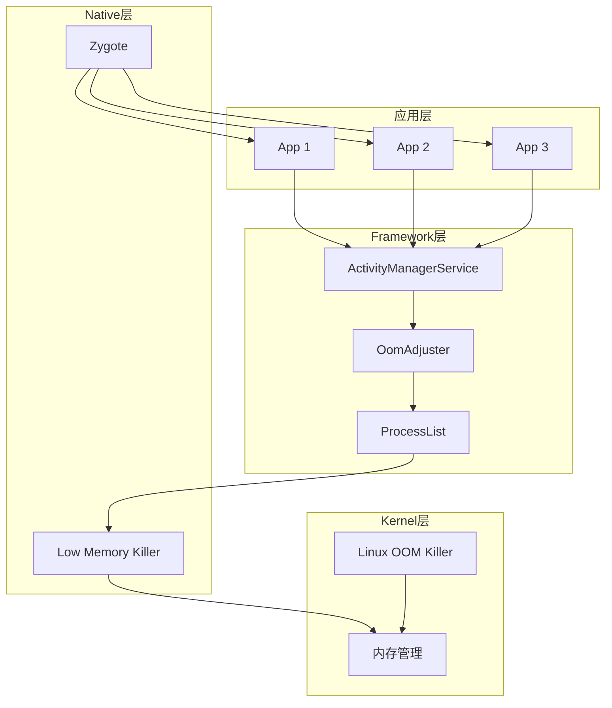
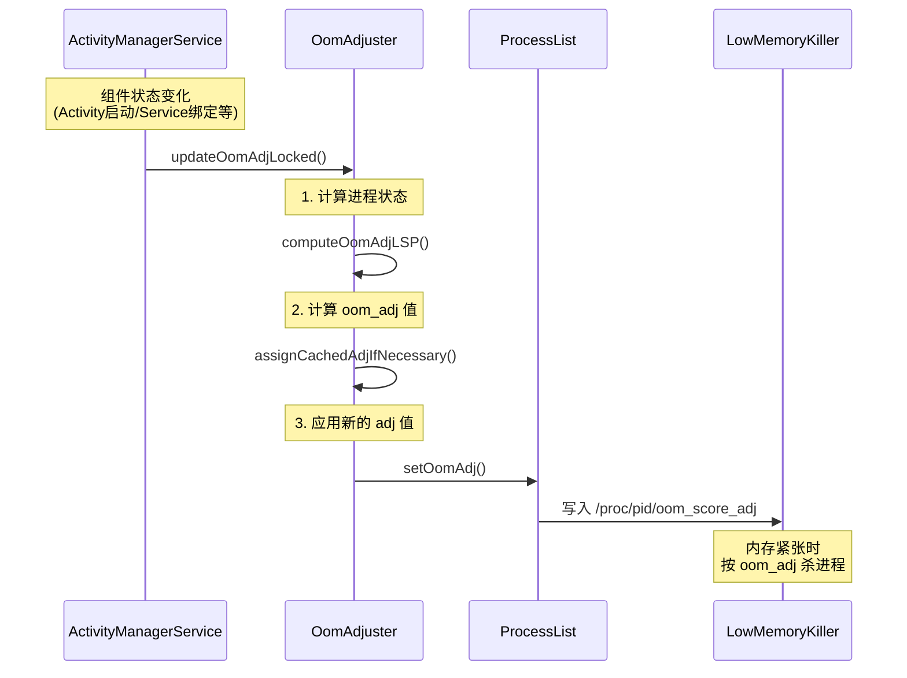
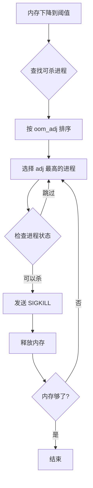

# App 保活 - 源码篇

## 一、Android 进程管理架构

### 1.1 整体架构图



**核心组件职责**：

| 组件 | 职责 |
|-----|------|
| **AMS** | 管理四大组件生命周期，协调进程优先级 |
| **OomAdjuster** | 计算每个进程的 oom_adj 值 |
| **ProcessList** | 维护进程列表，与 LMK 通信 |
| **LMK** | 内存不足时按优先级杀进程 |
| **Zygote** | 孵化新进程 |

### 1.2 一句话总结

**Android 进程管理的本质**：AMS 根据四大组件的状态计算每个进程的"重要程度"（oom_adj），然后告诉 LMK，内存紧张时 LMK 按这个排序杀进程。

---

## 二、OomAdjuster 源码分析

### 2.1 设计哲学

OomAdjuster 的设计遵循一个核心原则：**用户感知越强，优先级越高**。

```
用户正在操作 → 绝对不能杀（前台进程）
用户能看到   → 尽量不杀（可见进程）
用户能感知   → 谨慎杀（前台服务）
用户不知道   → 必要时可杀（后台服务）
完全无感     → 优先杀（缓存进程）
```

### 2.2 核心流程



### 2.3 关键源码解析

**OomAdjuster.java 核心方法**：

```java
// 路径：frameworks/base/services/core/java/com/android/server/am/OomAdjuster.java

/**
 * 计算并更新所有进程的 oom_adj
 * 这个方法会在任何可能影响进程优先级的事件发生时被调用
 */
void updateOomAdjLocked(String oomAdjReason) {
    // 1. 遍历所有需要更新的进程
    for (int i = mProcessList.getLruProcessList().size() - 1; i >= 0; i--) {
        ProcessRecord app = mProcessList.getLruProcessList().get(i);
        
        // 2. 计算新的 adj 值
        computeOomAdjLSP(app, ...);
        
        // 3. 应用更新
        applyOomAdjLSP(app, ...);
    }
}

/**
 * 核心计算逻辑：根据进程持有的组件计算 adj
 * 
 * 设计亮点：优先级确定是"最高者胜出"策略
 * 一个进程可能同时有 Activity、Service、ContentProvider
 * 取其中优先级最高的那个作为进程的 adj
 */
private boolean computeOomAdjLSP(ProcessRecord app, ...) {
    int adj;
    int procState;
    
    // 前台 Activity 所在进程
    if (app == mService.mTopApp) {
        adj = ProcessList.FOREGROUND_APP_ADJ;  // 0
        procState = PROCESS_STATE_TOP;
    }
    // 正在执行前台服务
    else if (app.hasForegroundServices()) {
        adj = ProcessList.PERCEPTIBLE_APP_ADJ;  // 200
        procState = PROCESS_STATE_FOREGROUND_SERVICE;
    }
    // 有可见 Activity（但不在最前面，比如被对话框遮挡）
    else if (app.hasVisibleActivities()) {
        adj = ProcessList.VISIBLE_APP_ADJ;  // 100
        procState = PROCESS_STATE_BOUND_TOP;
    }
    // 有正在运行的普通服务
    else if (app.hasRunningServices()) {
        adj = ProcessList.SERVICE_ADJ;  // 500
        procState = PROCESS_STATE_SERVICE;
    }
    // 缓存进程
    else {
        adj = ProcessList.CACHED_APP_MIN_ADJ;  // 900
        procState = PROCESS_STATE_CACHED_EMPTY;
    }
    
    // 还要考虑：
    // - 被其他进程绑定的情况
    // - ContentProvider 被使用的情况
    // - 进程组关系
    
    app.setCurrentAdj(adj);
    app.setCurProcState(procState);
    return true;
}
```

### 2.4 oom_adj 值定义

```java
// 路径：frameworks/base/services/core/java/com/android/server/am/ProcessList.java

// 系统进程，不可杀
static final int SYSTEM_ADJ = -900;
// 持久进程（如电话进程）
static final int PERSISTENT_PROC_ADJ = -800;
// 持久进程的服务
static final int PERSISTENT_SERVICE_ADJ = -700;

// 前台进程：正在与用户交互
static final int FOREGROUND_APP_ADJ = 0;
// 可见进程：用户可见但不在最前面
static final int VISIBLE_APP_ADJ = 100;
// 可感知进程：前台服务
static final int PERCEPTIBLE_APP_ADJ = 200;
// 低可感知进程：如后台播放音乐
static final int PERCEPTIBLE_LOW_APP_ADJ = 250;
// 备份进程
static final int BACKUP_APP_ADJ = 300;
// 重量级进程（游戏等）
static final int HEAVY_WEIGHT_APP_ADJ = 400;
// 服务进程
static final int SERVICE_ADJ = 500;
// 桌面进程
static final int HOME_APP_ADJ = 600;
// 上一个用户使用的 App
static final int PREVIOUS_APP_ADJ = 700;
// 服务中的缓存进程
static final int SERVICE_B_ADJ = 800;
// 缓存进程范围
static final int CACHED_APP_MIN_ADJ = 900;
static final int CACHED_APP_MAX_ADJ = 999;
```

### 2.5 设计亮点

**1. 细粒度的优先级划分**

不是简单的"前台/后台"二分法，而是根据用户感知程度细分多个级别。这样在内存紧张时，可以精确控制先杀谁。

**2. 动态更新机制**

任何组件状态变化都会触发重新计算，确保优先级始终反映最新状态。

**3. 绑定传递**

```java
// 如果进程 A 绑定了进程 B 的服务，且 A 优先级高
// 那么 B 的优先级会被"传递"提升
// 这就是为什么被前台 Activity 绑定的服务不容易被杀
if (client.getCurrentAdj() < app.getCurrentAdj()) {
    app.setAdjFromClient(client.getCurrentAdj());
}
```

---

## 三、LMK（Low Memory Killer）原理

### 3.1 LMK vs Linux OOM Killer

| 特性 | Linux OOM Killer | Android LMK |
|-----|-----------------|-------------|
| 触发时机 | 内存耗尽时 | 内存低于阈值时 |
| 响应速度 | 较慢（最后手段） | 较快（提前干预） |
| 选择策略 | 简单的内存占用排序 | 根据 oom_adj 精确控制 |
| 可定制性 | 低 | 高（可配置阈值） |

**为什么 Android 要自己实现 LMK？**

Linux OOM Killer 是最后的安全网，触发时系统已经很卡了。Android 设备对响应性要求高，需要提前释放内存，所以设计了 LMK 在内存达到阈值时就开始清理。

### 3.2 LMK 工作流程



### 3.3 内存阈值配置

```bash
# 查看当前 LMK 阈值配置
adb shell cat /sys/module/lowmemorykiller/parameters/minfree
# 输出示例：18432,23040,27648,32256,36864,46080
# 单位是 4KB 页，所以 18432 = 72MB

# 对应的 adj 值
adb shell cat /sys/module/lowmemorykiller/parameters/adj
# 输出示例：0,100,200,300,900,906
```

**阈值含义**：

| 阈值 (页数) | 内存 (MB) | 对应 adj | 行为 |
|-----------|----------|---------|------|
| 18432 | 72 | 0 | 开始杀前台进程（极端情况） |
| 23040 | 90 | 100 | 开始杀可见进程 |
| 27648 | 108 | 200 | 开始杀前台服务 |
| 32256 | 126 | 300 | 开始杀备份进程 |
| 36864 | 144 | 900 | 开始杀缓存进程 |
| 46080 | 180 | 906 | 积极清理缓存进程 |

### 3.4 从 LMK 到 lmkd

Android 9.0 开始，传统的内核 LMK 驱动逐渐被用户空间的 `lmkd` 守护进程取代：

```
┌─────────────────────────────────────────────────┐
│  传统 LMK（Android 8.x 及之前）                  │
│  • 在内核空间运行                                │
│  • 通过 /proc/pid/oom_score_adj 获取优先级       │
│  • 简单高效，但不够灵活                          │
└─────────────────────────────────────────────────┘
                        ↓
┌─────────────────────────────────────────────────┐
│  lmkd（Android 9.0+）                           │
│  • 在用户空间运行                                │
│  • 可以实现更复杂的策略                          │
│  • 支持 PSI（Pressure Stall Information）       │
│  • 更好地配合 cgroups v2                        │
└─────────────────────────────────────────────────┘
```

---

## 四、前台服务为什么能保活？

### 4.1 前台服务的本质

调用 `startForeground()` 后发生了什么？

```java
// Service.java
public final void startForeground(int id, Notification notification) {
    // 通知 AMS 这是一个前台服务
    mActivityManager.setServiceForeground(
        new ComponentName(this, mClassName), 
        mToken, 
        id,
        notification, 
        0,  // foregroundServiceType
        0   // FOREGROUND_SERVICE_TYPE_NONE
    );
}

// ActiveServices.java
void setServiceForegroundLocked(...) {
    // 1. 显示常驻通知
    r.postNotification();
    
    // 2. 标记为前台服务
    r.isForeground = true;
    
    // 3. 触发 oom_adj 重新计算
    // 关键：这会把进程的 adj 从 500(SERVICE_ADJ) 降到 200(PERCEPTIBLE_APP_ADJ)
    mAm.updateOomAdjLocked(r.app, OomAdjuster.OOM_ADJ_REASON_START_SERVICE);
}
```

### 4.2 oom_adj 变化

```
普通后台服务：
┌─────────────────────────────────┐
│  oom_adj = 500 (SERVICE_ADJ)   │
│  容易被杀                       │
└─────────────────────────────────┘

         ↓ startForeground()

前台服务：
┌─────────────────────────────────┐
│  oom_adj = 200 (PERCEPTIBLE)   │
│  优先级大幅提升                 │
│  只有在内存很紧张时才会被杀     │
└─────────────────────────────────┘
```

### 4.3 为什么必须显示通知？

这是一个**设计约束**，而非技术限制。

**Google 的设计哲学**：
- 如果一个 App 要在后台持续运行，用户有权知道
- 通知栏的常驻图标就是"告知用户"的方式
- 这样用户可以选择关闭不需要的后台服务

**如果没有通知会怎样？**
- Android 8.0+ 系统会在 5 秒后强制停止服务并抛出 ANR
- 这是 Google 强制执行的规则，没有绕过方式

---

## 五、为什么厂商能杀掉"保活"的 App？

### 5.1 厂商的"超级权限"

厂商的系统进程（如华为的"手机管家"）运行在 system 权限下，可以：

1. **修改 oom_adj**：直接把目标进程的 adj 设为最高
2. **发送 SIGKILL**：直接杀进程
3. **阻止重启**：记录被杀的包名，阻止其再次启动

```java
// 厂商系统进程可以做的事（伪代码）
void killApp(String packageName) {
    // 1. 找到所有相关进程
    List<ProcessRecord> processes = findProcessesByPackage(packageName);
    
    // 2. 包括关联进程（双进程守护也没用）
    for (ProcessRecord p : processes) {
        // 直接杀掉
        Process.killProcess(p.pid);
    }
    
    // 3. 加入黑名单，阻止重启
    addToKillList(packageName);
}
```

### 5.2 厂商白名单机制

厂商维护了一份"重要应用"白名单：

```
┌─────────────────────────────────────────┐
│  厂商白名单                              │
├─────────────────────────────────────────┤
│  • 微信、支付宝（用户量大，不敢杀）        │
│  • 自家应用（厂商自己的 App）             │
│  • 系统级应用（电话、短信）               │
│  • 用户手动设置的白名单应用               │
└─────────────────────────────────────────┘

进入白名单的 App：
• 不会被自动清理
• 可以自启动
• 后台限制更宽松
```

**这就是为什么微信"杀不死"**：
1. 用户量大，厂商默认白名单
2. 专门的厂商适配团队
3. 各厂商推送通道全接入

---

## 六、深度思考

### 6.1 如果让你设计进程管理系统，你会怎么做？

**核心挑战**：
- 内存有限，必须杀进程
- 要保证用户体验（重要 App 不能杀）
- 要省电（不能让 App 随便后台运行）

**可能的设计方向**：

```
方案1：用户优先级（Android 的做法）
• 根据用户交互计算优先级
• 优点：用户感知好
• 缺点：容易被 App "钻空子"

方案2：资源配额制
• 每个 App 分配固定的后台资源配额
• 优点：公平，防止滥用
• 缺点：某些 App 确实需要更多资源

方案3：用户授权制
• 明确告知用户后台行为，由用户决定
• 优点：透明
• 缺点：用户可能不懂技术，做出错误决定

Android 实际上是三种的结合：
• 默认按用户优先级管理
• 通过 Doze、Bucket 限制资源
• 通过权限让用户有控制权
```

### 6.2 保活的本质是什么？

**保活 = 提升 oom_adj 优先级**

所有保活方案的本质都是让系统认为这个进程"更重要"：

| 方案 | 原理 |
|-----|------|
| 前台服务 | adj 从 500 变成 200 |
| 1 像素 Activity | 让系统认为有"可见" Activity |
| 双进程守护 | 被杀后立刻重启 |
| 绑定系统服务 | 借助被绑定方的优先级 |

**终极真相**：只要系统想杀你，就一定能杀。保活只是提高存活概率，不是绝对保证。

### 6.3 推送 vs 保活

```
保活思路：让 App 一直活着，随时接收消息
         ↓
问题：耗电、耗内存、被厂商封杀
         ↓
换个思路：App 不用活着，消息来了再唤醒
         ↓
推送方案：厂商推送 + FCM
         ↓
优势：省电、可靠、不会被杀
```

**这也是为什么 Google 和厂商都在推广自己的推送服务**：推送是"官方保活"，既能保证消息送达，又不会让 App 乱跑。

---

## 七、面试题检验

### Q1：详细说明 oom_adj 的计算过程？

**答案**：

oom_adj 由 OomAdjuster 在 AMS 中计算，遵循"最高优先级胜出"原则：

**计算流程**：
1. **检查前台 Activity**：如果是 TopApp，adj = 0
2. **检查前台服务**：如果有正在运行的前台服务，adj = 200
3. **检查可见 Activity**：如果有可见但非前台的 Activity，adj = 100
4. **检查普通服务**：如果有运行中的服务，adj = 500
5. **检查绑定关系**：如果被高优先级进程绑定，adj 可能被提升
6. **缓存进程**：以上都不满足，adj = 900-999

**触发时机**：
- 组件生命周期变化（Activity onResume、Service onCreate 等）
- 绑定关系变化（bindService、unbindService）
- 系统主动更新（定时、内存变化时）

### Q2：lmkd 相比传统 LMK 有什么优势？

**答案**：

| 方面 | 传统 LMK（内核） | lmkd（用户空间） |
|-----|---------------|----------------|
| **运行位置** | 内核空间 | 用户空间 |
| **灵活性** | 低，修改需重新编译内核 | 高，可热更新 |
| **策略复杂度** | 简单的阈值判断 | 可实现复杂策略 |
| **信息获取** | 有限 | 可获取更多进程信息 |
| **PSI 支持** | 不支持 | 支持，更精确的内存压力感知 |
| **调试** | 困难 | 容易，可用 logcat 查看 |

**设计意义**：将 LMK 移到用户空间是 Android 架构演进的方向，让内存管理更灵活、可定制。

### Q3：为什么微信/支付宝"杀不死"？

**答案**：

**三个层面的原因**：

1. **厂商白名单**：
   - 微信/支付宝用户量巨大，杀了会被用户骂
   - 厂商默认将其加入白名单
   - 有专门的厂商适配团队维护关系

2. **技术实现**：
   - 接入所有厂商的推送通道
   - 合规使用前台服务（音视频通话）
   - 完善的进程重启机制

3. **生态优势**：
   - 用户主动设置为"允许自启动"
   - 用户主动加入电池优化白名单
   - 用户不会去杀这些"重要"App

**启示**：真正的"保活"是让用户觉得你的 App 值得活着，而不是和系统对抗。

---

## 八、总结

### 核心认知

1. **保活的本质是提升 oom_adj**，所有方案都是围绕这一点
2. **系统和厂商拥有绝对控制权**，任何对抗性方案终将失效
3. **推送是正道**，让 App 在需要时被唤醒，而不是一直活着
4. **用户体验至上**，为了保活而牺牲用户体验是本末倒置

### 技术选型建议

| 场景 | 推荐方案 | 不推荐方案 |
|-----|---------|-----------|
| 即时通讯 | 厂商推送 + FCM | 双进程守护 |
| 音乐播放 | 前台服务 (mediaPlayback) | 1 像素 Activity |
| 后台定位 | 前台服务 (location) | Native 进程 |
| 定时任务 | WorkManager | AlarmManager 轮询 |
| 数据同步 | WorkManager + 推送触发 | 后台常驻服务 |

### 最后的忠告

> 保活技术应该用来提供更好的服务，而不是做"流氓软件"。
> 
> 理解系统原理的目的是更好地适应规则，而不是对抗规则。
> 
> 当你需要"保活"时，先问问自己：用户真的需要我的 App 一直运行吗？

---

_本文档基于 Android 14 源码分析，部分实现细节可能在不同版本有差异_
