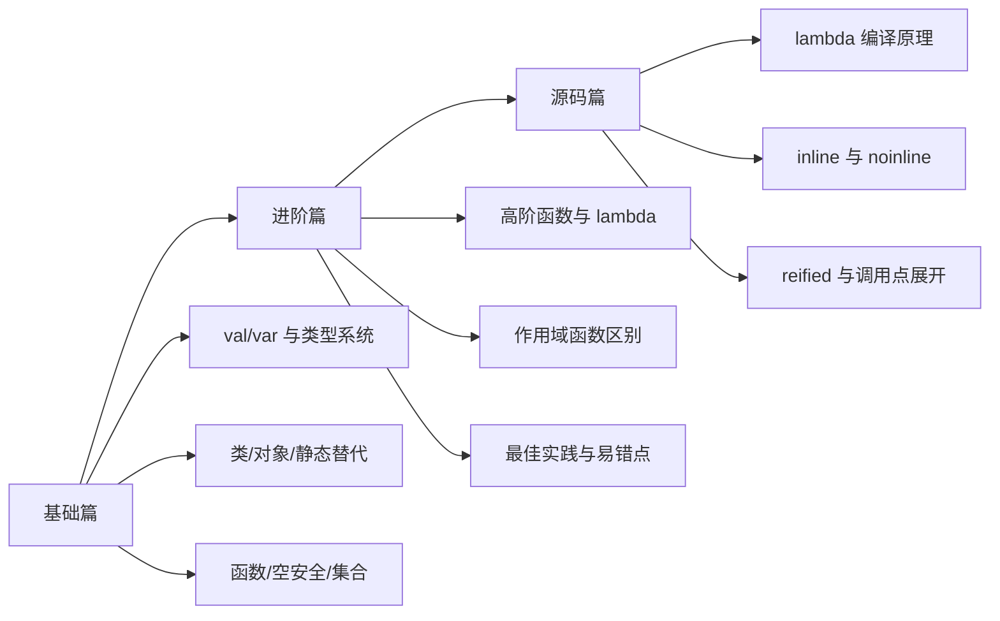

# Kotlin 语法（Kotlin Syntax）

> Kotlin 不是“Java 换个写法”，而是一套把空安全、函数式、扩展能力、编译期优化揉到一起的现代语言设计。

## 为什么要单独学 Kotlin 语法？

很多人学 Kotlin 时容易卡在两个层面：

1. **会写，但不懂为什么这么设计**。比如知道 `let` 里默认是 `it`，`apply` 里默认是 `this`，但说不清背后的语义差异。
2. **会用，但不会选最优写法**。比如知道 `inline`、`const val`、`object`、扩展函数，却不知道什么时候该用，什么时候会带来额外成本。
3. **能跑，但不清楚编译结果**。比如 lambda、匿名对象、`inline`、`reified` 到底是在生成额外类，还是在调用点展开。

一句话理解：

- Java 更像“工具箱”，你要自己拼很多样板代码。
- Kotlin 更像“成套装修”，很多常见坑和重复劳动，语言层就先帮你垫掉了。

## 文档结构

```text
Kotlin语法/
├── README.md
├── 1-基础篇.md
├── 2-进阶篇.md
└── 3-源码篇.md
```

## 学习路线



## 重要程度

| 知识点 | 重要程度 | 面试频率 | 说明 |
|-------|---------|---------|------|
| `val` / `var` | ⭐⭐⭐⭐⭐ | ⭐⭐⭐⭐⭐ | Kotlin 入门第一关 |
| 空安全 | ⭐⭐⭐⭐⭐ | ⭐⭐⭐⭐⭐ | Kotlin 设计哲学核心 |
| `object` / `companion object` | ⭐⭐⭐⭐⭐ | ⭐⭐⭐⭐ | “静态”问题高频出现 |
| 高阶函数 / lambda | ⭐⭐⭐⭐⭐ | ⭐⭐⭐⭐⭐ | Kotlin 真正拉开差距的地方 |
| `let` / `run` / `apply` / `also` | ⭐⭐⭐⭐⭐ | ⭐⭐⭐⭐ | 日常开发天天写，但很容易混 |
| `inline` / `reified` | ⭐⭐⭐⭐ | ⭐⭐⭐⭐⭐ | 高频进阶题，体现编译器理解 |
| 委托 / 扩展函数 | ⭐⭐⭐⭐ | ⭐⭐⭐⭐ | Kotlin 风格代码的关键 |

## 核心问题预览

### 基础篇

1. `val` 和 `var` 到底差在哪？`val` 是不是绝对不可变？
2. Kotlin 为什么没有真正的 `static` 关键字？
3. `?`、`?.`、`?:`、`!!` 分别在解决什么问题？
4. Kotlin 函数为什么默认支持命名参数和默认参数？

### 进阶篇

1. 高阶函数到底高在哪？为什么 Kotlin 这么推崇它？
2. 为什么 `apply` 用 `this`，`let` / `also` 用 `it`？
3. 什么时候该写扩展函数，什么时候该写普通工具类？
4. `data class`、密封类、委托属性分别适合什么场景？

### 源码篇

1. lambda 会不会生成额外对象？
2. `inline` 为什么可能在每个调用点都展开一份代码？
3. `noinline` / `crossinline` 分别在限制什么？
4. `reified` 为什么必须和 `inline` 一起用？

## 快速导航

- [1-基础篇](./1-基础篇.md)：先把 Kotlin 的语法地图和设计动机建立起来
- [2-进阶篇](./2-进阶篇.md)：重点看高阶函数、作用域函数、委托和最佳实践
- [3-源码篇](./3-源码篇.md)：理解编译结果、性能权衡和“为什么这么设计”

## Kotlin 在 Android 体系里的位置

```text
Activity / Fragment / ViewModel / Compose
                ↓
           Kotlin 语言层
    （空安全、lambda、协程、DSL、委托）
                ↓
       Jetpack / Kotlin 标准库 / JVM
```

很多 Android 技术之所以“写起来丝滑”，本质上不是框架突然变聪明了，而是 Kotlin 语言层先把表达能力拉高了。

## 技术演进

1. Java 在 Android 上长期稳定，但样板代码多、空指针多、函数式表达弱。
2. Kotlin 借鉴了 Scala、Groovy、C# 等语言的优点，但刻意控制复杂度，没有走“语法炫技大合集”的路线。
3. JetBrains 把它设计成**和 Java 互操作、可渐进迁移、编译到 JVM 字节码**的语言，所以 Android 团队能低成本接纳。
4. 到今天，Kotlin 已经不只是“推荐”，而是现代 Android 开发的主流默认语言。

---

_最后更新：2026-04-03_
