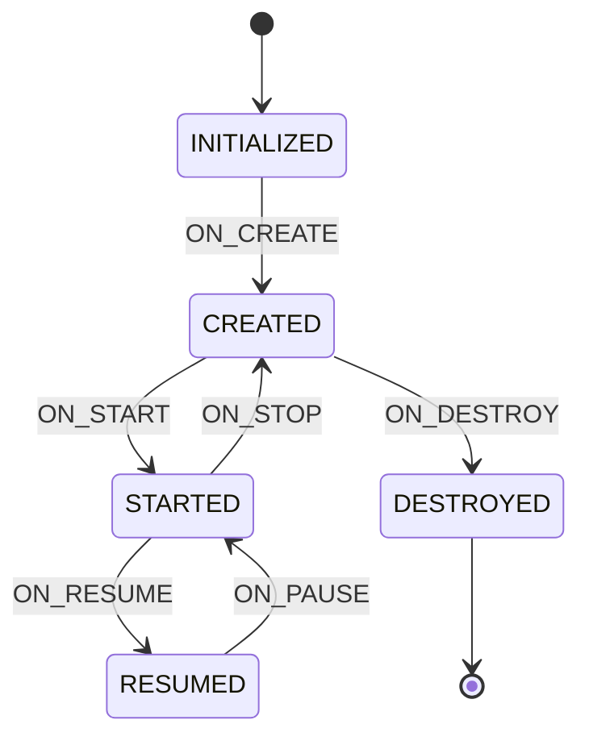

# Lifecycle（androidx.lifecycle.Lifecycle）

## 什么是 Lifecycle？

### 定义

Lifecycle 是 Android Jetpack 架构组件之一，它是一个持有组件（如 Activity、Fragment）生命周期状态信息的类，并允许其他对象观察此状态。Lifecycle 使用两个主要枚举来跟踪其关联组件的生命周期状态：**Event（事件）** 和 **State（状态）**。

### 通俗理解

想象 Lifecycle 是一个"生命周期广播站"。Activity 和 Fragment 就像是电台主播，它们会把自己的状态（比如"我开始了"、"我暂停了"、"我要结束了"）广播出去。而其他组件（比如播放器、位置监听器、网络请求）就像是收音机，它们可以"收听"这些广播，然后根据广播内容自动调整自己的行为——主播说暂停了，收音机就自动静音；主播说恢复了，收音机就继续播放。

这样做的好处是：每个组件只需要关心自己的事情，不用再手动在 Activity 的各个生命周期方法里写一大堆代码。

## 核心概念

### 1. Lifecycle 的核心组件

```
┌─────────────────────────────────────────────────────────────┐
│                     Lifecycle 架构                          │
├─────────────────────────────────────────────────────────────┤
│                                                             │
│   ┌─────────────────┐         ┌─────────────────┐          │
│   │ LifecycleOwner  │         │LifecycleObserver│          │
│   │   (生命周期拥有者)│◄────────│   (生命周期观察者) │          │
│   │                 │  观察    │                 │          │
│   │ Activity        │         │ 自定义组件       │          │
│   │ Fragment        │         │ LocationManager │          │
│   │ LifecycleService│         │ MediaPlayer     │          │
│   └────────┬────────┘         └─────────────────┘          │
│            │                                                │
│            │ 持有                                            │
│            ▼                                                │
│   ┌─────────────────┐                                       │
│   │    Lifecycle    │                                       │
│   │    (生命周期)    │                                       │
│   │                 │                                       │
│   │  State + Event  │                                       │
│   └─────────────────┘                                       │
│                                                             │
└─────────────────────────────────────────────────────────────┘
```

### 2. 生命周期状态与事件



### 3. State 和 Event 对应关系


| State（状态）     | 进入该状态的 Event            | 离开该状态的 Event              | 说明                 |
| ------------- | ----------------------- | ------------------------- | ------------------ |
| `INITIALIZED` | -                       | `ON_CREATE`               | 初始状态，Lifecycle 刚创建 |
| `CREATED`     | `ON_CREATE` / `ON_STOP` | `ON_START` / `ON_DESTROY` | 已创建但不可见            |
| `STARTED`     | `ON_START` / `ON_PAUSE` | `ON_RESUME` / `ON_STOP`   | 可见但无焦点             |
| `RESUMED`     | `ON_RESUME`             | `ON_PAUSE`                | 可见且有焦点，可交互         |
| `DESTROYED`   | `ON_DESTROY`            | -                         | 已销毁                |


## 工作原理

### 1. 传统方式的问题

在没有 Lifecycle 之前，我们通常这样管理组件：

```kotlin
// ❌ 传统方式：代码分散在各个生命周期方法中
class OldWayActivity : AppCompatActivity() {

    private lateinit var locationManager: MyLocationManager
    private lateinit var videoPlayer: MyVideoPlayer
    private lateinit var sensorManager: MySensorManager

    override fun onCreate(savedInstanceState: Bundle?) {
        super.onCreate(savedInstanceState)
        locationManager = MyLocationManager(this)
        videoPlayer = MyVideoPlayer(this)
        sensorManager = MySensorManager(this)
    }

    override fun onStart() {
        super.onStart()
        locationManager.start()  // 容易忘记
        sensorManager.start()
    }

    override fun onResume() {
        super.onResume()
        videoPlayer.resume()
    }

    override fun onPause() {
        super.onPause()
        videoPlayer.pause()
    }

    override fun onStop() {
        super.onStop()
        locationManager.stop()  // 容易忘记导致内存泄漏
        sensorManager.stop()
    }

    override fun onDestroy() {
        super.onDestroy()
        locationManager.release()
        videoPlayer.release()
        sensorManager.release()  // 容易忘记
    }
}
```

### 2. Lifecycle 的解决方案

```kotlin
// ✅ 使用 Lifecycle：组件自己管理生命周期
class ModernActivity : AppCompatActivity() {

    override fun onCreate(savedInstanceState: Bundle?) {
        super.onCreate(savedInstanceState)

        // 组件自己观察生命周期，自动管理
        lifecycle.addObserver(MyLocationManager(this))
        lifecycle.addObserver(MyVideoPlayer(this))
        lifecycle.addObserver(MySensorManager(this))

        // Activity 只负责业务逻辑，生命周期管理交给组件自己
    }
}
```

### 3. 内部实现原理

```
┌───────────────────────────────────────────────────────────────┐
│                    Lifecycle 内部机制                          │
├───────────────────────────────────────────────────────────────┤
│                                                               │
│  1. ComponentActivity 中嵌入了 LifecycleRegistry              │
│                                                               │
│  2. LifecycleRegistry 维护：                                  │
│     - 当前 State                                              │
│     - Observer 列表                                           │
│     - Event 分发逻辑                                          │
│                                                               │
│  3. 当生命周期变化时：                                         │
│     Activity.onStart()                                        │
│         ↓                                                     │
│     LifecycleRegistry.handleLifecycleEvent(ON_START)          │
│         ↓                                                     │
│     更新 State 为 STARTED                                     │
│         ↓                                                     │
│     遍历通知所有 Observer                                      │
│         ↓                                                     │
│     Observer.onStart() 被调用                                 │
│                                                               │
└───────────────────────────────────────────────────────────────┘
```

## 代码示例

### 基础用法

#### 方式一：实现 DefaultLifecycleObserver 接口（推荐）

```kotlin
import androidx.lifecycle.DefaultLifecycleObserver
import androidx.lifecycle.LifecycleOwner
import android.util.Log

/**
 * 自定义生命周期观察者
 * 实现 DefaultLifecycleObserver 接口，可以选择性地重写需要的方法
 */
class MyLifecycleObserver : DefaultLifecycleObserver {

    companion object {
        private const val TAG = "MyLifecycleObserver"
    }

    override fun onCreate(owner: LifecycleOwner) {
        Log.d(TAG, "onCreate: 组件已创建")
        // 初始化资源
    }

    override fun onStart(owner: LifecycleOwner) {
        Log.d(TAG, "onStart: 组件即将可见")
        // 开始监听
    }

    override fun onResume(owner: LifecycleOwner) {
        Log.d(TAG, "onResume: 组件获得焦点")
        // 开始动画或更新
    }

    override fun onPause(owner: LifecycleOwner) {
        Log.d(TAG, "onPause: 组件失去焦点")
        // 暂停动画或更新
    }

    override fun onStop(owner: LifecycleOwner) {
        Log.d(TAG, "onStop: 组件不可见")
        // 停止监听
    }

    override fun onDestroy(owner: LifecycleOwner) {
        Log.d(TAG, "onDestroy: 组件被销毁")
        // 释放资源
    }
}
```

#### 在 Activity 中使用

```kotlin
import android.os.Bundle
import androidx.appcompat.app.AppCompatActivity

class MainActivity : AppCompatActivity() {

    override fun onCreate(savedInstanceState: Bundle?) {
        super.onCreate(savedInstanceState)
        setContentView(R.layout.activity_main)

        // 添加生命周期观察者
        lifecycle.addObserver(MyLifecycleObserver())

        // Activity 现在干净整洁，只关注业务逻辑
    }
}
```

#### 方式二：使用 LifecycleEventObserver 接口

```kotlin
import androidx.lifecycle.Lifecycle
import androidx.lifecycle.LifecycleEventObserver
import androidx.lifecycle.LifecycleOwner
import android.util.Log

/**
 * 使用 LifecycleEventObserver 统一处理所有事件
 * 适合需要在一个方法中处理多个生命周期事件的场景
 */
class UnifiedLifecycleObserver : LifecycleEventObserver {

    companion object {
        private const val TAG = "UnifiedObserver"
    }

    override fun onStateChanged(source: LifecycleOwner, event: Lifecycle.Event) {
        when (event) {
            Lifecycle.Event.ON_CREATE -> {
                Log.d(TAG, "ON_CREATE")
            }
            Lifecycle.Event.ON_START -> {
                Log.d(TAG, "ON_START")
            }
            Lifecycle.Event.ON_RESUME -> {
                Log.d(TAG, "ON_RESUME")
            }
            Lifecycle.Event.ON_PAUSE -> {
                Log.d(TAG, "ON_PAUSE")
            }
            Lifecycle.Event.ON_STOP -> {
                Log.d(TAG, "ON_STOP")
            }
            Lifecycle.Event.ON_DESTROY -> {
                Log.d(TAG, "ON_DESTROY")
            }
            Lifecycle.Event.ON_ANY -> {
                Log.d(TAG, "ON_ANY: 任何事件都会触发")
            }
        }
    }
}
```

### 进阶用法

#### 1. 生命周期感知的位置管理器

```kotlin
import android.Manifest
import android.content.Context
import android.content.pm.PackageManager
import android.location.Location
import android.location.LocationListener
import android.location.LocationManager
import android.os.Bundle
import android.util.Log
import androidx.core.app.ActivityCompat
import androidx.lifecycle.DefaultLifecycleObserver
import androidx.lifecycle.LifecycleOwner

/**
 * 生命周期感知的位置管理器
 * 自动在合适的时机开始和停止位置监听，避免内存泄漏
 */
class LifecycleAwareLocationManager(
    private val context: Context,
    private val onLocationChanged: (Location) -> Unit
) : DefaultLifecycleObserver {

    companion object {
        private const val TAG = "LocationManager"
        private const val MIN_TIME_MS = 1000L
        private const val MIN_DISTANCE_M = 10f
    }

    private var locationManager: LocationManager? = null
    private var isListening = false

    private val locationListener = object : LocationListener {
        override fun onLocationChanged(location: Location) {
            Log.d(TAG, "位置更新: ${location.latitude}, ${location.longitude}")
            onLocationChanged(location)
        }

        override fun onStatusChanged(provider: String?, status: Int, extras: Bundle?) {}
        override fun onProviderEnabled(provider: String) {}
        override fun onProviderDisabled(provider: String) {}
    }

    override fun onCreate(owner: LifecycleOwner) {
        Log.d(TAG, "初始化位置管理器")
        locationManager = context.getSystemService(Context.LOCATION_SERVICE) as LocationManager
    }

    override fun onStart(owner: LifecycleOwner) {
        Log.d(TAG, "开始监听位置")
        startListening()
    }

    override fun onStop(owner: LifecycleOwner) {
        Log.d(TAG, "停止监听位置")
        stopListening()
    }

    override fun onDestroy(owner: LifecycleOwner) {
        Log.d(TAG, "释放位置管理器资源")
        locationManager = null
    }

    private fun startListening() {
        if (isListening) return

        if (ActivityCompat.checkSelfPermission(context, Manifest.permission.ACCESS_FINE_LOCATION)
            != PackageManager.PERMISSION_GRANTED) {
            Log.w(TAG, "没有位置权限")
            return
        }

        locationManager?.requestLocationUpdates(
            LocationManager.GPS_PROVIDER,
            MIN_TIME_MS,
            MIN_DISTANCE_M,
            locationListener
        )
        isListening = true
    }

    private fun stopListening() {
        if (!isListening) return
        locationManager?.removeUpdates(locationListener)
        isListening = false
    }
}
```

#### 在 Activity 中使用

```kotlin
class LocationActivity : AppCompatActivity() {

    private lateinit var binding: ActivityLocationBinding

    override fun onCreate(savedInstanceState: Bundle?) {
        super.onCreate(savedInstanceState)
        binding = ActivityLocationBinding.inflate(layoutInflater)
        setContentView(binding.root)

        // 添加生命周期感知的位置管理器
        val locationManager = LifecycleAwareLocationManager(this) { location ->
            // 更新 UI
            binding.textLocation.text = "经度: ${location.longitude}\n纬度: ${location.latitude}"
        }

        // 注册观察者 - 位置管理器会自动管理自己的生命周期
        lifecycle.addObserver(locationManager)
    }
}
```

#### 2. 生命周期感知的网络状态监听器

```kotlin
import android.content.Context
import android.net.ConnectivityManager
import android.net.Network
import android.net.NetworkCapabilities
import android.net.NetworkRequest
import android.util.Log
import androidx.lifecycle.DefaultLifecycleObserver
import androidx.lifecycle.LifecycleOwner

/**
 * 生命周期感知的网络状态监听器
 * 在 Activity 可见时监听网络变化，不可见时自动停止
 */
class LifecycleAwareNetworkMonitor(
    private val context: Context,
    private val onNetworkStateChanged: (Boolean) -> Unit
) : DefaultLifecycleObserver {

    companion object {
        private const val TAG = "NetworkMonitor"
    }

    private var connectivityManager: ConnectivityManager? = null
    private var isRegistered = false

    private val networkCallback = object : ConnectivityManager.NetworkCallback() {
        override fun onAvailable(network: Network) {
            Log.d(TAG, "网络已连接")
            onNetworkStateChanged(true)
        }

        override fun onLost(network: Network) {
            Log.d(TAG, "网络已断开")
            onNetworkStateChanged(false)
        }

        override fun onCapabilitiesChanged(network: Network, caps: NetworkCapabilities) {
            val hasInternet = caps.hasCapability(NetworkCapabilities.NET_CAPABILITY_INTERNET)
            Log.d(TAG, "网络能力变化: hasInternet=$hasInternet")
        }
    }

    override fun onCreate(owner: LifecycleOwner) {
        connectivityManager = context.getSystemService(Context.CONNECTIVITY_SERVICE)
            as ConnectivityManager
    }

    override fun onStart(owner: LifecycleOwner) {
        registerCallback()
    }

    override fun onStop(owner: LifecycleOwner) {
        unregisterCallback()
    }

    override fun onDestroy(owner: LifecycleOwner) {
        connectivityManager = null
    }

    private fun registerCallback() {
        if (isRegistered) return

        val request = NetworkRequest.Builder()
            .addCapability(NetworkCapabilities.NET_CAPABILITY_INTERNET)
            .build()

        connectivityManager?.registerNetworkCallback(request, networkCallback)
        isRegistered = true
        Log.d(TAG, "网络回调已注册")
    }

    private fun unregisterCallback() {
        if (!isRegistered) return

        try {
            connectivityManager?.unregisterNetworkCallback(networkCallback)
        } catch (e: Exception) {
            Log.e(TAG, "注销网络回调失败", e)
        }
        isRegistered = false
        Log.d(TAG, "网络回调已注销")
    }

    /**
     * 获取当前网络状态
     */
    fun isNetworkAvailable(): Boolean {
        val network = connectivityManager?.activeNetwork ?: return false
        val caps = connectivityManager?.getNetworkCapabilities(network) ?: return false
        return caps.hasCapability(NetworkCapabilities.NET_CAPABILITY_INTERNET)
    }
}
```

#### 3. 使用 lifecycleScope 进行协程管理

```kotlin
import android.os.Bundle
import android.util.Log
import androidx.appcompat.app.AppCompatActivity
import androidx.lifecycle.Lifecycle
import androidx.lifecycle.lifecycleScope
import androidx.lifecycle.repeatOnLifecycle
import kotlinx.coroutines.delay
import kotlinx.coroutines.flow.Flow
import kotlinx.coroutines.flow.flow
import kotlinx.coroutines.launch

class CoroutineLifecycleActivity : AppCompatActivity() {

    companion object {
        private const val TAG = "CoroutineLifecycle"
    }

    override fun onCreate(savedInstanceState: Bundle?) {
        super.onCreate(savedInstanceState)
        setContentView(R.layout.activity_coroutine)

        // 方式一：使用 lifecycleScope 启动协程
        // 协程会在 Activity onDestroy 时自动取消
        lifecycleScope.launch {
            Log.d(TAG, "协程启动")
            // 执行耗时操作
            val result = fetchData()
            Log.d(TAG, "数据获取完成: $result")
        }

        // 方式二：使用 repeatOnLifecycle 确保只在特定状态执行
        // 适合收集 Flow 数据
        lifecycleScope.launch {
            repeatOnLifecycle(Lifecycle.State.STARTED) {
                // 只在 STARTED 状态执行
                // 当 Activity 进入 STOPPED 状态时，这里的协程会被取消
                // 当 Activity 重新进入 STARTED 状态时，这里的协程会重新启动
                collectLocationUpdates().collect { location ->
                    Log.d(TAG, "收到位置更新: $location")
                }
            }
        }

        // 方式三：使用 launchWhenStarted（已弃用，但仍可用）
        // 推荐使用 repeatOnLifecycle 替代
    }

    private suspend fun fetchData(): String {
        delay(1000) // 模拟网络请求
        return "Hello, Lifecycle!"
    }

    private fun collectLocationUpdates(): Flow<String> = flow {
        while (true) {
            delay(2000)
            emit("Location: ${System.currentTimeMillis()}")
        }
    }
}
```

### 最佳实践

#### 1. 自定义 LifecycleOwner

```kotlin
import androidx.lifecycle.Lifecycle
import androidx.lifecycle.LifecycleOwner
import androidx.lifecycle.LifecycleRegistry

/**
 * 自定义 LifecycleOwner
 * 适用于需要在非 Activity/Fragment 中使用 Lifecycle 的场景
 * 例如：自定义 View、Service 等
 */
class CustomLifecycleOwner : LifecycleOwner {

    // 创建 LifecycleRegistry，传入 this 作为 LifecycleOwner
    private val lifecycleRegistry = LifecycleRegistry(this)

    override val lifecycle: Lifecycle
        get() = lifecycleRegistry

    /**
     * 手动触发生命周期事件
     */
    fun onCreate() {
        lifecycleRegistry.handleLifecycleEvent(Lifecycle.Event.ON_CREATE)
    }

    fun onStart() {
        lifecycleRegistry.handleLifecycleEvent(Lifecycle.Event.ON_START)
    }

    fun onResume() {
        lifecycleRegistry.handleLifecycleEvent(Lifecycle.Event.ON_RESUME)
    }

    fun onPause() {
        lifecycleRegistry.handleLifecycleEvent(Lifecycle.Event.ON_PAUSE)
    }

    fun onStop() {
        lifecycleRegistry.handleLifecycleEvent(Lifecycle.Event.ON_STOP)
    }

    fun onDestroy() {
        lifecycleRegistry.handleLifecycleEvent(Lifecycle.Event.ON_DESTROY)
    }
}
```

#### 2. 封装通用的生命周期感知组件基类

```kotlin
import androidx.lifecycle.DefaultLifecycleObserver
import androidx.lifecycle.Lifecycle
import androidx.lifecycle.LifecycleOwner
import android.util.Log

/**
 * 生命周期感知组件的基类
 * 提供通用的生命周期管理功能
 */
abstract class LifecycleAwareComponent(
    protected val tag: String = "LifecycleComponent"
) : DefaultLifecycleObserver {

    protected var currentState: Lifecycle.State = Lifecycle.State.INITIALIZED
        private set

    /**
     * 检查当前是否至少处于指定状态
     */
    fun isAtLeast(state: Lifecycle.State): Boolean {
        return currentState.isAtLeast(state)
    }

    /**
     * 只在指定状态下执行操作
     */
    inline fun runIfAtLeast(state: Lifecycle.State, action: () -> Unit) {
        if (isAtLeast(state)) {
            action()
        } else {
            Log.w(tag, "当前状态 $currentState 不满足要求 $state，跳过操作")
        }
    }

    override fun onCreate(owner: LifecycleOwner) {
        currentState = Lifecycle.State.CREATED
        Log.d(tag, "状态变为: CREATED")
        onCreated()
    }

    override fun onStart(owner: LifecycleOwner) {
        currentState = Lifecycle.State.STARTED
        Log.d(tag, "状态变为: STARTED")
        onStarted()
    }

    override fun onResume(owner: LifecycleOwner) {
        currentState = Lifecycle.State.RESUMED
        Log.d(tag, "状态变为: RESUMED")
        onResumed()
    }

    override fun onPause(owner: LifecycleOwner) {
        currentState = Lifecycle.State.STARTED
        Log.d(tag, "状态变为: STARTED (paused)")
        onPaused()
    }

    override fun onStop(owner: LifecycleOwner) {
        currentState = Lifecycle.State.CREATED
        Log.d(tag, "状态变为: CREATED (stopped)")
        onStopped()
    }

    override fun onDestroy(owner: LifecycleOwner) {
        currentState = Lifecycle.State.DESTROYED
        Log.d(tag, "状态变为: DESTROYED")
        onDestroyed()
    }

    // 子类可选重写的方法
    protected open fun onCreated() {}
    protected open fun onStarted() {}
    protected open fun onResumed() {}
    protected open fun onPaused() {}
    protected open fun onStopped() {}
    protected open fun onDestroyed() {}
}
```

#### 3. 使用示例

```kotlin
/**
 * 生命周期感知的媒体播放器
 * 继承自 LifecycleAwareComponent，自动管理播放器生命周期
 */
class LifecycleAwareMediaPlayer(
    private val mediaUrl: String
) : LifecycleAwareComponent("MediaPlayer") {

    private var mediaPlayer: MediaPlayer? = null
    private var isPrepared = false
    private var playbackPosition = 0

    override fun onCreated() {
        // 创建并准备播放器
        mediaPlayer = MediaPlayer().apply {
            setDataSource(mediaUrl)
            setOnPreparedListener {
                isPrepared = true
                // 如果当前已经是 RESUMED 状态，自动开始播放
                runIfAtLeast(Lifecycle.State.RESUMED) {
                    start()
                }
            }
            prepareAsync()
        }
    }

    override fun onResumed() {
        // 恢复播放
        if (isPrepared) {
            mediaPlayer?.apply {
                seekTo(playbackPosition)
                start()
            }
        }
    }

    override fun onPaused() {
        // 暂停播放并保存位置
        mediaPlayer?.let {
            playbackPosition = it.currentPosition
            it.pause()
        }
    }

    override fun onDestroyed() {
        // 释放资源
        mediaPlayer?.release()
        mediaPlayer = null
        isPrepared = false
    }
}
```

## 应用场景

### 1. 资源管理

- **位置监听**：在 Activity 可见时监听位置，不可见时停止
- **传感器监听**：加速度计、陀螺仪等传感器的生命周期管理
- **相机资源**：在合适的时机打开和关闭相机

### 2. 数据同步

- **网络请求**：在 Activity 销毁时自动取消未完成的请求
- **数据库操作**：确保在组件销毁前完成数据保存
- **实时数据流**：使用 Flow + repeatOnLifecycle 安全收集数据

### 3. UI 更新

- **动画控制**：在 onResume 时启动动画，onPause 时暂停
- **视频播放**：自动管理播放器的暂停和恢复
- **定时刷新**：在可见时刷新数据，不可见时停止

### 4. 第三方库集成

- **地图 SDK**：管理地图的生命周期
- **广告 SDK**：在合适的时机加载和显示广告
- **分析 SDK**：在页面可见时发送分析事件

## 与其他 Jetpack 组件的关系

```
┌─────────────────────────────────────────────────────────────────┐
│                    Jetpack 架构组件关系图                        │
├─────────────────────────────────────────────────────────────────┤
│                                                                 │
│                        ┌──────────────┐                         │
│                        │   Lifecycle  │ ◄── 基础组件             │
│                        └───────┬──────┘                         │
│                                │                                │
│              ┌─────────────────┼─────────────────┐              │
│              │                 │                 │              │
│              ▼                 ▼                 ▼              │
│     ┌──────────────┐  ┌──────────────┐  ┌──────────────┐       │
│     │  ViewModel   │  │   LiveData   │  │ LifecycleScope│       │
│     │ (UI 状态管理) │  │ (可观察数据)  │  │  (协程作用域)  │       │
│     └───────┬──────┘  └───────┬──────┘  └──────────────┘       │
│             │                 │                                 │
│             └────────┬────────┘                                 │
│                      │                                          │
│                      ▼                                          │
│             ┌──────────────────┐                                │
│             │ Activity/Fragment│                                │
│             │    (UI 层)       │                                │
│             └──────────────────┘                                │
│                                                                 │
└─────────────────────────────────────────────────────────────────┘
```

### 组件协作示例

```kotlin
import android.os.Bundle
import androidx.activity.viewModels
import androidx.appcompat.app.AppCompatActivity
import androidx.lifecycle.Lifecycle
import androidx.lifecycle.ViewModel
import androidx.lifecycle.lifecycleScope
import androidx.lifecycle.repeatOnLifecycle
import kotlinx.coroutines.flow.MutableStateFlow
import kotlinx.coroutines.flow.StateFlow
import kotlinx.coroutines.launch

/**
 * 展示 Lifecycle、ViewModel、Flow 的协作使用
 */
class JetpackIntegrationActivity : AppCompatActivity() {

    // ViewModel 自动感知 Activity 的生命周期
    private val viewModel: IntegrationViewModel by viewModels()

    override fun onCreate(savedInstanceState: Bundle?) {
        super.onCreate(savedInstanceState)
        setContentView(R.layout.activity_integration)

        // 使用 lifecycleScope + repeatOnLifecycle 安全收集 Flow
        lifecycleScope.launch {
            // 只在 STARTED 状态时收集，STOPPED 时自动停止
            repeatOnLifecycle(Lifecycle.State.STARTED) {
                viewModel.uiState.collect { state ->
                    // 更新 UI
                    updateUI(state)
                }
            }
        }

        // 触发数据加载
        viewModel.loadData()
    }

    private fun updateUI(state: UiState) {
        // 根据状态更新 UI
        when (state) {
            is UiState.Loading -> showLoading()
            is UiState.Success -> showData(state.data)
            is UiState.Error -> showError(state.message)
        }
    }

    private fun showLoading() { /* ... */ }
    private fun showData(data: String) { /* ... */ }
    private fun showError(message: String) { /* ... */ }
}

// UI 状态
sealed class UiState {
    object Loading : UiState()
    data class Success(val data: String) : UiState()
    data class Error(val message: String) : UiState()
}

// ViewModel
class IntegrationViewModel : ViewModel() {

    private val _uiState = MutableStateFlow<UiState>(UiState.Loading)
    val uiState: StateFlow<UiState> = _uiState

    fun loadData() {
        // ViewModel 内的协程使用 viewModelScope
        // viewModelScope 也是基于 Lifecycle 实现的
        viewModelScope.launch {
            _uiState.value = UiState.Loading
            try {
                // 模拟网络请求
                delay(1000)
                _uiState.value = UiState.Success("加载的数据")
            } catch (e: Exception) {
                _uiState.value = UiState.Error(e.message ?: "未知错误")
            }
        }
    }
}
```

## 优缺点分析

### 优点


| 优点         | 说明                                      |
| ---------- | --------------------------------------- |
| **解耦**     | 组件自己管理生命周期，不再依赖 Activity/Fragment 的回调方法 |
| **代码简洁**   | Activity/Fragment 代码更简洁，只关注业务逻辑         |
| **避免内存泄漏** | 组件可以在合适的时机自动释放资源                        |
| **可复用**    | 生命周期感知组件可以轻松在多个 Activity/Fragment 中复用   |
| **可测试**    | 组件与 Activity/Fragment 解耦，更容易编写单元测试      |
| **标准化**    | 提供统一的生命周期管理方式                           |


### 缺点


| 缺点         | 说明                       |
| ---------- | ------------------------ |
| **学习成本**   | 需要理解 State、Event 等概念     |
| **调试复杂**   | 事件分发机制增加了调试难度            |
| **过度设计风险** | 简单场景可能不需要使用 Lifecycle    |
| **依赖引入**   | 需要引入 Jetpack Lifecycle 库 |


## 性能考虑

### 1. Observer 管理

```kotlin
// ✅ 好的做法：在 onCreate 中添加一次 Observer
class GoodActivity : AppCompatActivity() {
    override fun onCreate(savedInstanceState: Bundle?) {
        super.onCreate(savedInstanceState)
        lifecycle.addObserver(MyObserver()) // 只添加一次
    }
}

// ❌ 不好的做法：重复添加 Observer
class BadActivity : AppCompatActivity() {
    override fun onResume() {
        super.onResume()
        lifecycle.addObserver(MyObserver()) // 每次 onResume 都会添加新的 Observer！
    }
}
```

### 2. 避免在生命周期回调中执行耗时操作

```kotlin
class OptimizedObserver : DefaultLifecycleObserver {

    override fun onStart(owner: LifecycleOwner) {
        // ❌ 不要在生命周期回调中执行耗时操作
        // val data = fetchDataFromNetwork() // 阻塞主线程

        // ✅ 使用协程异步执行
        if (owner is LifecycleOwner) {
            owner.lifecycleScope.launch {
                val data = withContext(Dispatchers.IO) {
                    fetchDataFromNetwork()
                }
                // 更新 UI
            }
        }
    }
}
```

### 3. 合理使用 repeatOnLifecycle

```kotlin
// ✅ 推荐：使用 repeatOnLifecycle 自动管理 Flow 收集
lifecycleScope.launch {
    repeatOnLifecycle(Lifecycle.State.STARTED) {
        viewModel.dataFlow.collect { data ->
            // 只在 STARTED 状态时收集
        }
    }
}

// ⚠️ 注意：直接使用 collect 可能导致内存泄漏
lifecycleScope.launch {
    // 这个协程会一直运行直到 Activity onDestroy
    // 即使 Activity 进入 STOPPED 状态，Flow 仍在收集
    viewModel.dataFlow.collect { data ->
        // 可能在 Activity 不可见时更新 UI
    }
}
```

## 兼容性说明

### API 级别要求

- Lifecycle 核心库：API 14+
- lifecycleScope：API 14+（需要协程支持）
- repeatOnLifecycle：Lifecycle 2.4.0+

### 依赖配置

```kotlin
// build.gradle.kts (Module)
dependencies {
    // Lifecycle 核心库
    implementation("androidx.lifecycle:lifecycle-runtime-ktx:2.7.0")

    // ViewModel 支持
    implementation("androidx.lifecycle:lifecycle-viewmodel-ktx:2.7.0")

    // LiveData 支持
    implementation("androidx.lifecycle:lifecycle-livedata-ktx:2.7.0")

    // 用于 Java 8+ 的 DefaultLifecycleObserver
    implementation("androidx.lifecycle:lifecycle-common-java8:2.7.0")

    // 可选：用于 Service 的 Lifecycle 支持
    implementation("androidx.lifecycle:lifecycle-service:2.7.0")

    // 可选：用于 ProcessLifecycleOwner（应用级别生命周期）
    implementation("androidx.lifecycle:lifecycle-process:2.7.0")
}
```

### 版本历史


| 版本    | 重要变化                          |
| ----- | ----------------------------- |
| 1.0.0 | 初始版本，基于注解的 Observer           |
| 2.0.0 | 使用 Java 8 接口替代注解              |
| 2.2.0 | 引入 lifecycleScope             |
| 2.4.0 | 引入 repeatOnLifecycle          |
| 2.6.0 | Lifecycle 2.6+ 使用 Kotlin 协程重构 |
| 2.7.0 | 性能优化和 bug 修复                  |


## 常见问题

### Q1: 什么时候应该使用 Lifecycle？

**答**：当你的组件需要根据 Activity/Fragment 的生命周期状态执行不同操作时，就应该考虑使用 Lifecycle。例如：

- 需要在可见时监听数据，不可见时停止
- 需要在销毁时释放资源
- 需要在特定生命周期状态下执行操作

### Q2: DefaultLifecycleObserver 和 LifecycleEventObserver 有什么区别？

**答**：

- `DefaultLifecycleObserver`：提供独立的方法（onCreate、onStart 等），代码更清晰
- `LifecycleEventObserver`：所有事件通过一个方法处理，适合需要统一处理的场景

### Q3: 如何避免 Flow 收集时的内存泄漏？

**答**：使用 `repeatOnLifecycle` 代替直接收集：

```kotlin
// ✅ 推荐
lifecycleScope.launch {
    repeatOnLifecycle(Lifecycle.State.STARTED) {
        flow.collect { }
    }
}
```

## 相关技术

- **[[ViewModel]]**：配合 Lifecycle 管理 UI 状态，在配置变更时保持数据
- **[[LiveData]]**：生命周期感知的可观察数据持有者
- **[[Activity]]**：Android 四大组件之一，实现了 LifecycleOwner 接口
- **[[Fragment]]**：UI 模块化组件，也实现了 LifecycleOwner 接口
- **[[Coroutines]]**：Kotlin 协程，与 lifecycleScope 配合使用

## 总结

Lifecycle 是 Android Jetpack 架构组件的核心基础，它解决了传统开发中生命周期管理混乱的问题。通过使用 Lifecycle：

1. **组件解耦**：各个组件自己管理生命周期，不再依赖 Activity/Fragment 的回调
2. **代码简洁**：Activity/Fragment 代码更简洁，只关注业务逻辑
3. **避免泄漏**：组件能在合适的时机自动释放资源，避免内存泄漏
4. **便于复用**：生命周期感知组件可以轻松在多个页面复用
5. **标准化**：提供统一的生命周期管理方式

在现代 Android 开发中，推荐：

- 使用 `DefaultLifecycleObserver` 创建生命周期感知组件
- 配合 `ViewModel` 管理 UI 状态
- 使用 `lifecycleScope` + `repeatOnLifecycle` 安全收集 Flow
- 遵循生命周期最佳实践，避免内存泄漏

---

*本文档将持续更新，添加更多相关内容*