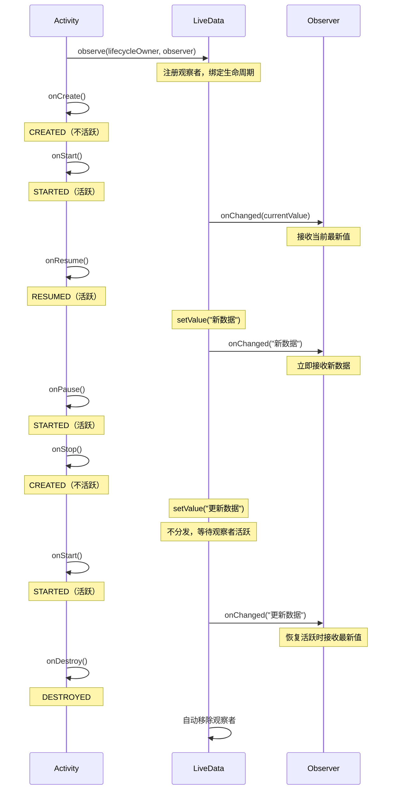

# LiveData（androidx.lifecycle.LiveData）

## 什么是 LiveData？

### 定义

LiveData 是 Android Jetpack 架构组件之一，是一种**可观察的数据持有者类**，具有生命周期感知能力。它的核心特性是：**只在观察者（Observer）处于活跃生命周期状态（STARTED 或 RESUMED）时才会通知数据更新**，从而避免内存泄漏和崩溃。

### 通俗理解

想象你订阅了一个新闻频道。传统订阅方式是：无论你是否在线（睡觉、工作），频道都会给你推送消息，堆积成千上万条未读。而 LiveData 就像一个智能订阅系统：只有当你打开手机（Activity 可见）时才会推送消息，你睡觉时不打扰你，醒来后自动给你最新的一条消息。

## 为什么需要 LiveData？

### 核心问题：传统数据更新的痛点

```
┌─────────────────────────────────────────────────────────────────────┐
│                     传统回调方式的问题                               │
├─────────────────────────────────────────────────────────────────────┤
│                                                                     │
│  场景：Activity 发起网络请求，请求返回时更新 UI                      │
│                                                                     │
│  ┌──────────────┐                      ┌──────────────┐             │
│  │   Activity   │                      │  网络请求    │             │
│  │   (可见)     │ ─── 发起请求 ───────► │              │             │
│  └──────────────┘                      └──────────────┘             │
│         │                                     │                     │
│         │ 用户按 Home 键                       │                     │
│         ▼                                     │                     │
│  ┌──────────────┐                             │                     │
│  │   Activity   │                             │                     │
│  │  (已停止)    │                             │ 3秒后请求完成        │
│  └──────────────┘                             │                     │
│         │                                     │                     │
│         │                                     ▼                     │
│         │         ┌──────────────────────────────────────┐          │
│         │         │  回调触发：callback.onSuccess(data)  │          │
│         │         │                                      │          │
│         │         │  尝试更新 UI：textView.text = data   │          │
│         │         │                                      │          │
│         │         │  💥 可能崩溃！Activity 已不可见      │          │
│         │         │  💥 可能内存泄漏！持有 Activity 引用  │          │
│         │         └──────────────────────────────────────┘          │
│                                                                     │
└─────────────────────────────────────────────────────────────────────┘
```

### LiveData 如何解决这些问题？

```
┌─────────────────────────────────────────────────────────────────────┐
│                     使用 LiveData 的情况                             │
├─────────────────────────────────────────────────────────────────────┤
│                                                                     │
│  ┌──────────────┐         ┌──────────────┐        ┌─────────────┐  │
│  │   Activity   │ observe │   LiveData   │ update │  ViewModel  │  │
│  │   (观察者)   │ ◄────── │   (被观察者)  │ ◄───── │  (数据源)   │  │
│  └──────────────┘         └──────────────┘        └─────────────┘  │
│         │                        │                       │          │
│         │ 用户按 Home 键          │                       │          │
│         ▼                        │                       │          │
│  ┌──────────────┐                │                       │          │
│  │   Activity   │   状态：       │                       │          │
│  │  (已停止)    │   STOPPED      │                       │          │
│  │   不活跃 ❌   │                │                       │          │
│  └──────────────┘                │                       │          │
│                                  │                       │          │
│                                  │      3秒后请求完成    │          │
│                                  │                       │          │
│                                  │  ┌─────────────────┐  │          │
│                                  │  │ setValue(data)  │◄─┘          │
│                                  │  └─────────────────┘             │
│                                  │          │                       │
│                                  │   检查观察者状态                  │
│                                  │   Activity 不活跃                │
│                                  │   ✅ 不通知！数据暂存            │
│                                  │                                  │
│         用户返回 App             │                                  │
│         ▼                        │                                  │
│  ┌──────────────┐                │                                  │
│  │   Activity   │   状态：       │                                  │
│  │  (已恢复)    │   RESUMED      │                                  │
│  │   活跃 ✅    │ ◄──────────────┘                                  │
│  └──────────────┘     │                                             │
│         │             │ 自动分发最新数据                             │
│         ▼             │                                             │
│  ┌───────────────────────────────────────────────────┐              │
│  │  onChanged(data) 被调用                           │              │
│  │  textView.text = data                            │              │
│  │  ✅ 安全更新 UI！                                 │              │
│  └───────────────────────────────────────────────────┘              │
│                                                                     │
└─────────────────────────────────────────────────────────────────────┘
```

### LiveData 的核心优势


| 特性         | 说明                        |
| ---------- | ------------------------- |
| **生命周期感知** | 自动管理订阅，观察者不活跃时不分发数据       |
| **避免内存泄漏** | 观察者绑定生命周期，自动清理不再需要的引用     |
| **避免崩溃**   | 不会向已停止的 Activity 分发数据     |
| **自动更新**   | 观察者从非活跃变为活跃时，自动接收最新数据     |
| **配置变更友好** | 配合 ViewModel 使用，屏幕旋转不丢失数据 |
| **数据共享**   | 可在多个观察者之间共享同一数据源          |


## LiveData 生命周期感知机制

### 观察者状态与数据分发

```
┌─────────────────────────────────────────────────────────────────────────────┐
│                    LiveData 与生命周期状态的关系                             │
├─────────────────────────────────────────────────────────────────────────────┤
│                                                                             │
│  Activity/Fragment 生命周期状态：                                           │
│                                                                             │
│  INITIALIZED ──► CREATED ──► STARTED ──► RESUMED                           │
│       │              │           │            │                             │
│       │              │           │            │                             │
│       ▼              ▼           ▼            ▼                             │
│    不活跃          不活跃       活跃 ✅      活跃 ✅                         │
│                                                                             │
│  ─────────────────────────────────────────────────────────────────────────  │
│                                                                             │
│  LiveData 只在以下状态分发数据：                                            │
│                                                                             │
│  ┌─────────────────────────────────────────────────────────────────────┐    │
│  │                         活跃状态                                    │    │
│  │                                                                     │    │
│  │     STARTED        RESUMED                                          │    │
│  │        ├──────────────┤                                             │    │
│  │        │              │                                             │    │
│  │        │   可接收数据  │                                             │    │
│  │        │   更新 UI ✅ │                                             │    │
│  │        │              │                                             │    │
│  └─────────────────────────────────────────────────────────────────────┘    │
│                                                                             │
│  不活跃状态（CREATED、INITIALIZED、DESTROYED）：                            │
│  - LiveData 不分发数据                                                      │
│  - 数据变化时只更新内部值                                                   │
│  - 观察者变为活跃时，自动接收最新值                                         │
│                                                                             │
└─────────────────────────────────────────────────────────────────────────────┘
```

### 完整生命周期流程



## 代码示例

### 基础用法

```java
// 1. 在 ViewModel 中定义 LiveData
class UserViewModel : ViewModel() {

    // MutableLiveData：可变的 LiveData，用于内部修改
    private val _userName = MutableLiveData<String>()

    // LiveData：对外暴露不可变版本，防止外部直接修改
    val userName: LiveData<String> = _userName

    // 私有的 MutableLiveData
    private val _isLoading = MutableLiveData<Boolean>(false)
    val isLoading: LiveData<Boolean> = _isLoading

    fun updateUserName(name: String) {
        // 在主线程中使用 value
        _userName.value = name
    }

    fun loadUserFromNetwork() {
        _isLoading.value = true
        viewModelScope.launch {
            delay(1000) // 模拟网络请求
            _userName.value = "张三"
            _isLoading.value = false
        }
    }

    fun updateFromBackground() {
        viewModelScope.launch(Dispatchers.IO) {
            // 在后台线程中使用 postValue
            _userName.postValue("后台更新的数据")
        }
    }
}

// 2. 在 Activity 中观察 LiveData
class UserActivity : AppCompatActivity() {

    private val viewModel: UserViewModel by viewModels()

    override fun onCreate(savedInstanceState: Bundle?) {
        super.onCreate(savedInstanceState)
        setContentView(R.layout.activity_user)

        // 观察 LiveData，使用 this 作为 LifecycleOwner
        viewModel.userName.observe(this) { name ->
            // 这个回调只在 Activity 处于 STARTED 或 RESUMED 状态时触发
            binding.textUserName.text = name
        }

        viewModel.isLoading.observe(this) { isLoading ->
            binding.progressBar.isVisible = isLoading
        }

        binding.btnLoad.setOnClickListener {
            viewModel.loadUserFromNetwork()
        }
    }
}
```

### 在 Fragment 中使用

```kotlin
class ProfileFragment : Fragment() {

    private val viewModel: ProfileViewModel by viewModels()

    override fun onViewCreated(view: View, savedInstanceState: Bundle?) {
        super.onViewCreated(view, savedInstanceState)

        // ⚠️ 重要：在 Fragment 中必须使用 viewLifecycleOwner
        // 不要使用 this！
        viewModel.profile.observe(viewLifecycleOwner) { profile ->
            binding.textName.text = profile.name
            binding.textEmail.text = profile.email
        }
    }
}

// 为什么要用 viewLifecycleOwner？
// Fragment 可能被保留在返回栈中，此时 Fragment 存活但 View 被销毁
// 使用 viewLifecycleOwner 确保观察者与 View 生命周期绑定
```

### MutableLiveData vs LiveData

```kotlin
class CounterViewModel : ViewModel() {

    // ❌ 错误：直接暴露 MutableLiveData
    // 外部可以随意修改，违反单向数据流
    val count1 = MutableLiveData<Int>(0)

    // ✅ 正确：私有 MutableLiveData + 公开 LiveData
    private val _count2 = MutableLiveData<Int>(0)
    val count2: LiveData<Int> = _count2  // 外部只能观察，不能修改

    fun increment() {
        _count2.value = (_count2.value ?: 0) + 1
    }
}

// 在 Activity 中
class CounterActivity : AppCompatActivity() {
    private val viewModel: CounterViewModel by viewModels()

    fun wrongUsage() {
        // ❌ 这样做违反了单向数据流原则
        viewModel.count1.value = 100
    }

    fun correctUsage() {
        // ✅ 通过 ViewModel 的方法修改数据
        viewModel.increment()

        // 观察数据变化
        viewModel.count2.observe(this) { count ->
            binding.textCount.text = count.toString()
        }
    }
}
```

### setValue() vs postValue()

```kotlin
class DataViewModel : ViewModel() {

    private val _data = MutableLiveData<String>()
    val data: LiveData<String> = _data

    // 主线程中使用 setValue
    fun updateOnMainThread() {
        // ✅ 直接赋值，同步更新
        _data.value = "主线程数据"
    }

    // 后台线程中使用 postValue
    fun updateFromBackground() {
        viewModelScope.launch(Dispatchers.IO) {
            // ❌ 错误：在非主线程使用 value 会崩溃
            // _data.value = "这会崩溃！"

            // ✅ 正确：使用 postValue，内部会切换到主线程
            _data.postValue("后台线程数据")
        }
    }

    // postValue 的合并行为
    fun demonstratePostValueMerge() {
        viewModelScope.launch(Dispatchers.IO) {
            // 快速连续调用 postValue
            _data.postValue("数据1")
            _data.postValue("数据2")
            _data.postValue("数据3")
            // 观察者可能只收到 "数据3"
            // 因为 postValue 会合并，只分发最后一次的值
        }
    }
}
```

### LiveData 转换操作

```kotlin
class TransformViewModel : ViewModel() {

    private val _userId = MutableLiveData<String>()

    // map：一对一转换
    val userIdDisplay: LiveData<String> = _userId.map { id ->
        "用户ID: $id"
    }

    // switchMap：根据输入值切换到不同的 LiveData
    val userDetails: LiveData<User> = _userId.switchMap { userId ->
        // 返回一个新的 LiveData
        repository.getUserLiveData(userId)
    }

    fun setUserId(id: String) {
        _userId.value = id
    }
}

// 使用示例
class UserDetailActivity : AppCompatActivity() {

    private val viewModel: TransformViewModel by viewModels()

    override fun onCreate(savedInstanceState: Bundle?) {
        super.onCreate(savedInstanceState)

        // 观察转换后的数据
        viewModel.userIdDisplay.observe(this) { displayText ->
            binding.textUserId.text = displayText
        }

        viewModel.userDetails.observe(this) { user ->
            binding.textUserName.text = user.name
        }

        // 设置 userId，会自动触发 switchMap
        viewModel.setUserId("user_123")
    }
}
```

### MediatorLiveData：合并多个数据源

```kotlin
class MergeViewModel : ViewModel() {

    private val _source1 = MutableLiveData<String>()
    private val _source2 = MutableLiveData<Int>()

    // MediatorLiveData：监听多个 LiveData 源
    val combined = MediatorLiveData<String>().apply {
        // 添加第一个数据源
        addSource(_source1) { str ->
            value = "字符串: $str, 数字: ${_source2.value ?: 0}"
        }
        // 添加第二个数据源
        addSource(_source2) { num ->
            value = "字符串: ${_source1.value ?: ""}, 数字: $num"
        }
    }

    fun updateSource1(str: String) {
        _source1.value = str
    }

    fun updateSource2(num: Int) {
        _source2.value = num
    }
}

// 实际应用：搜索过滤
class SearchViewModel : ViewModel() {

    private val _searchQuery = MutableLiveData<String>("")
    private val _allItems = MutableLiveData<List<Item>>()

    // 根据搜索词过滤结果
    val filteredItems = MediatorLiveData<List<Item>>().apply {
        fun updateFilter() {
            val query = _searchQuery.value ?: ""
            val items = _allItems.value ?: emptyList()
            value = if (query.isEmpty()) {
                items
            } else {
                items.filter { it.name.contains(query, ignoreCase = true) }
            }
        }

        addSource(_searchQuery) { updateFilter() }
        addSource(_allItems) { updateFilter() }
    }

    fun search(query: String) {
        _searchQuery.value = query
    }

    fun loadItems(items: List<Item>) {
        _allItems.value = items
    }
}
```

### 自定义 LiveData

```kotlin
// 自定义 LiveData：监听系统状态
class NetworkLiveData(context: Context) : LiveData<Boolean>() {

    private val connectivityManager =
        context.getSystemService(Context.CONNECTIVITY_SERVICE) as ConnectivityManager

    private val networkCallback = object : ConnectivityManager.NetworkCallback() {
        override fun onAvailable(network: Network) {
            postValue(true)  // 网络可用
        }

        override fun onLost(network: Network) {
            postValue(false)  // 网络断开
        }
    }

    // 当有活跃观察者时调用
    override fun onActive() {
        super.onActive()
        // 开始监听网络状态
        val request = NetworkRequest.Builder()
            .addCapability(NetworkCapabilities.NET_CAPABILITY_INTERNET)
            .build()
        connectivityManager.registerNetworkCallback(request, networkCallback)
    }

    // 当没有活跃观察者时调用
    override fun onInactive() {
        super.onInactive()
        // 停止监听，释放资源
        connectivityManager.unregisterNetworkCallback(networkCallback)
    }
}

// 使用自定义 LiveData
class MainActivity : AppCompatActivity() {

    private val networkLiveData by lazy { NetworkLiveData(applicationContext) }

    override fun onCreate(savedInstanceState: Bundle?) {
        super.onCreate(savedInstanceState)

        networkLiveData.observe(this) { isConnected ->
            if (isConnected) {
                showSnackbar("网络已连接")
            } else {
                showSnackbar("网络已断开")
            }
        }
    }
}
```

### observeForever：无生命周期观察

```kotlin
class DataManager {

    private val _status = MutableLiveData<String>()
    val status: LiveData<String> = _status

    private val observer = Observer<String> { status ->
        Log.d("DataManager", "状态更新: $status")
    }

    fun startObserving() {
        // ⚠️ observeForever 不绑定生命周期
        // 必须手动移除观察者！
        _status.observeForever(observer)
    }

    fun stopObserving() {
        // 必须手动移除，否则会内存泄漏！
        _status.removeObserver(observer)
    }

    fun updateStatus(newStatus: String) {
        _status.value = newStatus
    }
}

// 在 ViewModel 中使用 observeForever
class MyViewModel : ViewModel() {

    private val repository = DataManager()
    private val observer = Observer<String> { status ->
        // 处理状态变化
    }

    init {
        repository.status.observeForever(observer)
    }

    override fun onCleared() {
        super.onCleared()
        // ViewModel 销毁时移除观察者
        repository.status.removeObserver(observer)
    }
}
```

## 底层实现原理

### 核心数据结构

```
┌─────────────────────────────────────────────────────────────────────────────┐
│                        LiveData 核心组件关系                                 │
├─────────────────────────────────────────────────────────────────────────────┤
│                                                                             │
│                          ┌─────────────────────────┐                        │
│                          │       LiveData<T>       │                        │
│                          ├─────────────────────────┤                        │
│                          │ - mData: T              │  存储的数据值           │
│                          │ - mVersion: int         │  数据版本号             │
│                          │ - mObservers: Map       │  观察者映射表           │
│                          └───────────┬─────────────┘                        │
│                                      │                                      │
│                         ┌────────────┴────────────┐                         │
│                         │                         │                         │
│                         ▼                         ▼                         │
│    ┌──────────────────────────────┐  ┌──────────────────────────────┐       │
│    │   ObserverWrapper           │  │   ObserverWrapper           │       │
│    ├──────────────────────────────┤  ├──────────────────────────────┤       │
│    │ - mObserver: Observer<T>    │  │ - mObserver: Observer<T>    │       │
│    │ - mLastVersion: int         │  │ - mLastVersion: int         │       │
│    │ - mActive: boolean          │  │ - mActive: boolean          │       │
│    └──────────────────────────────┘  └──────────────────────────────┘       │
│              │                                   │                          │
│              │                                   │                          │
│              ▼                                   ▼                          │
│    ┌──────────────────────────────┐  ┌──────────────────────────────┐       │
│    │  LifecycleBoundObserver     │  │  AlwaysActiveObserver       │       │
│    │  (绑定生命周期)              │  │  (observeForever)           │       │
│    ├──────────────────────────────┤  ├──────────────────────────────┤       │
│    │ - mOwner: LifecycleOwner    │  │  始终活跃                     │       │
│    │ 监听生命周期变化             │  │  不自动移除                   │       │
│    └──────────────────────────────┘  └──────────────────────────────┘       │
│                                                                             │
└─────────────────────────────────────────────────────────────────────────────┘
```

### 版本机制详解

```
┌─────────────────────────────────────────────────────────────────────────────┐
│                        版本机制：防止重复分发                                │
├─────────────────────────────────────────────────────────────────────────────┤
│                                                                             │
│  LiveData 内部维护两个版本号：                                               │
│  - mVersion：LiveData 当前数据的版本                                        │
│  - mLastVersion：每个观察者最后接收的数据版本                                │
│                                                                             │
│  ┌─────────────────────────────────────────────────────────────────────┐    │
│  │  初始状态                                                           │    │
│  │                                                                     │    │
│  │  LiveData.mVersion = -1 (START_VERSION)                            │    │
│  │  Observer.mLastVersion = -1                                        │    │
│  └─────────────────────────────────────────────────────────────────────┘    │
│                              │                                              │
│                              ▼                                              │
│  ┌─────────────────────────────────────────────────────────────────────┐    │
│  │  第一次 setValue("A")                                               │    │
│  │                                                                     │    │
│  │  LiveData.mVersion = 0                                             │    │
│  │  Observer.mLastVersion = -1                                        │    │
│  │                                                                     │    │
│  │  判断：mLastVersion < mVersion ?  →  -1 < 0  →  true               │    │
│  │  结果：分发数据 ✅                                                   │    │
│  │  更新：Observer.mLastVersion = 0                                   │    │
│  └─────────────────────────────────────────────────────────────────────┘    │
│                              │                                              │
│                              ▼                                              │
│  ┌─────────────────────────────────────────────────────────────────────┐    │
│  │  Activity 旋转重建，重新 observe                                    │    │
│  │                                                                     │    │
│  │  LiveData.mVersion = 0 (数据保留)                                  │    │
│  │  新 Observer.mLastVersion = -1 (新观察者)                          │    │
│  │                                                                     │    │
│  │  判断：mLastVersion < mVersion ?  →  -1 < 0  →  true               │    │
│  │  结果：分发最新数据（粘性事件）✅                                     │    │
│  └─────────────────────────────────────────────────────────────────────┘    │
│                              │                                              │
│                              ▼                                              │
│  ┌─────────────────────────────────────────────────────────────────────┐    │
│  │  观察者从不活跃变为活跃（无新数据）                                  │    │
│  │                                                                     │    │
│  │  LiveData.mVersion = 0                                             │    │
│  │  Observer.mLastVersion = 0                                         │    │
│  │                                                                     │    │
│  │  判断：mLastVersion < mVersion ?  →  0 < 0  →  false               │    │
│  │  结果：不分发（已经是最新）❌                                         │    │
│  └─────────────────────────────────────────────────────────────────────┘    │
│                                                                             │
└─────────────────────────────────────────────────────────────────────────────┘
```

### setValue 完整流程

```kotlin
// LiveData 源码（简化版）
public abstract class LiveData<T> {

    private Object mData;            // 存储的数据
    private int mVersion = -1;       // 数据版本号
    private final Map<Observer<T>, ObserverWrapper> mObservers = new LinkedHashMap<>();

    // 主线程设置值
    protected void setValue(T value) {
        // 1. 检查是否在主线程
        assertMainThread("setValue");

        // 2. 版本号自增
        mVersion++;

        // 3. 存储新值
        mData = value;

        // 4. 分发给所有观察者
        dispatchingValue(null);
    }

    // postValue 内部实现
    protected void postValue(T value) {
        // 1. 保存要发送的值
        mPendingData = value;

        // 2. 切换到主线程执行
        ArchTaskExecutor.getInstance().postToMainThread(() -> {
            // 3. 在主线程调用 setValue
            setValue(mPendingData);
        });
    }

    // 分发数据
    private void dispatchingValue(ObserverWrapper initiator) {
        // 遍历所有观察者
        for (ObserverWrapper wrapper : mObservers.values()) {
            considerNotify(wrapper);
        }
    }

    // 考虑是否通知观察者
    private void considerNotify(ObserverWrapper observer) {
        // 1. 检查观察者是否活跃
        if (!observer.mActive) {
            return;  // 不活跃，不通知
        }

        // 2. 再次检查生命周期状态（双重检查）
        if (!observer.shouldBeActive()) {
            observer.activeStateChanged(false);
            return;
        }

        // 3. 版本检查：是否已经分发过
        if (observer.mLastVersion >= mVersion) {
            return;  // 已经是最新版本，不重复分发
        }

        // 4. 更新观察者的版本号
        observer.mLastVersion = mVersion;

        // 5. 调用观察者的回调
        observer.mObserver.onChanged((T) mData);
    }
}
```

### 生命周期绑定实现

```kotlin
// LifecycleBoundObserver 源码（简化版）
class LifecycleBoundObserver(
    private val owner: LifecycleOwner,
    private val observer: Observer<T>
) : ObserverWrapper(observer), LifecycleEventObserver {

    override fun shouldBeActive(): Boolean {
        // 只有 STARTED 或 RESUMED 才算活跃
        return owner.lifecycle.currentState.isAtLeast(Lifecycle.State.STARTED)
    }

    // 生命周期变化时的回调
    override fun onStateChanged(source: LifecycleOwner, event: Lifecycle.Event) {
        val currentState = owner.lifecycle.currentState

        // DESTROYED 时自动移除观察者
        if (currentState == Lifecycle.State.DESTROYED) {
            removeObserver(observer)
            return
        }

        // 计算是否活跃
        val wasActive = mActive
        val isNowActive = shouldBeActive()

        // 活跃状态变化时
        if (wasActive != isNowActive) {
            mActive = isNowActive
            if (isNowActive) {
                // 变为活跃，分发最新数据
                dispatchingValue(this)
            }
        }
    }
}
```

### observe() 完整流程

```
┌─────────────────────────────────────────────────────────────────────────────┐
│                        observe() 执行流程                                    │
├─────────────────────────────────────────────────────────────────────────────┤
│                                                                             │
│   liveData.observe(lifecycleOwner, observer)                               │
│                          │                                                  │
│                          ▼                                                  │
│   ┌─────────────────────────────────────────────────────────────────────┐   │
│   │  1. 检查是否在主线程                                                │   │
│   │     assertMainThread("observe")                                    │   │
│   └─────────────────────────────────────────────────────────────────────┘   │
│                          │                                                  │
│                          ▼                                                  │
│   ┌─────────────────────────────────────────────────────────────────────┐   │
│   │  2. 检查 LifecycleOwner 状态                                       │   │
│   │     if (owner.lifecycle.currentState == DESTROYED) return          │   │
│   │     // 已销毁的不注册                                               │   │
│   └─────────────────────────────────────────────────────────────────────┘   │
│                          │                                                  │
│                          ▼                                                  │
│   ┌─────────────────────────────────────────────────────────────────────┐   │
│   │  3. 包装 Observer                                                   │   │
│   │     wrapper = LifecycleBoundObserver(owner, observer)              │   │
│   └─────────────────────────────────────────────────────────────────────┘   │
│                          │                                                  │
│                          ▼                                                  │
│   ┌─────────────────────────────────────────────────────────────────────┐   │
│   │  4. 存入观察者映射表                                                │   │
│   │     existing = mObservers.putIfAbsent(observer, wrapper)           │   │
│   │     // 如果已存在，检查是否绑定同一个 owner                         │   │
│   └─────────────────────────────────────────────────────────────────────┘   │
│                          │                                                  │
│                          ▼                                                  │
│   ┌─────────────────────────────────────────────────────────────────────┐   │
│   │  5. 向 Lifecycle 注册监听                                          │   │
│   │     owner.lifecycle.addObserver(wrapper)                           │   │
│   │     // wrapper 实现了 LifecycleEventObserver                       │   │
│   └─────────────────────────────────────────────────────────────────────┘   │
│                          │                                                  │
│                          ▼                                                  │
│   ┌─────────────────────────────────────────────────────────────────────┐   │
│   │  6. Lifecycle 同步当前状态给 wrapper                                │   │
│   │     // 如果当前是 STARTED/RESUMED，会立即触发                       │   │
│   │     // onStateChanged → activeStateChanged → dispatchingValue      │   │
│   │     // 然后分发当前最新数据给这个新观察者                            │   │
│   └─────────────────────────────────────────────────────────────────────┘   │
│                                                                             │
└─────────────────────────────────────────────────────────────────────────────┘
```

## 粘性事件问题与解决方案

### 什么是粘性事件？

```
┌─────────────────────────────────────────────────────────────────────────────┐
│                        LiveData 的粘性事件问题                               │
├─────────────────────────────────────────────────────────────────────────────┤
│                                                                             │
│  场景：使用 LiveData 发送一次性事件（如 Toast、导航）                        │
│                                                                             │
│  时间线：                                                                   │
│  ─────────────────────────────────────────────────────────────────────────  │
│                                                                             │
│  1. ViewModel 发送事件                                                      │
│     liveData.value = Event("登录成功")                                      │
│                          │                                                  │
│  2. Activity 观察并处理                                                     │
│     → 显示 Toast: "登录成功" ✅                                             │
│                          │                                                  │
│  3. 用户旋转屏幕                                                            │
│     Activity 销毁重建                                                       │
│     重新调用 observe()                                                      │
│                          │                                                  │
│  4. 新观察者收到"旧"数据                                                    │
│     → 又显示 Toast: "登录成功" ❌                                           │
│                                                                             │
│  ─────────────────────────────────────────────────────────────────────────  │
│                                                                             │
│  原因：新观察者的 mLastVersion = -1 < LiveData.mVersion = 0                │
│        所以会重新分发数据                                                    │
│                                                                             │
└─────────────────────────────────────────────────────────────────────────────┘
```

### 解决方案一：Event 包装类

```kotlin
/**
 * 用于包装一次性事件的类
 * 确保事件只被消费一次
 */
open class Event<out T>(private val content: T) {

    private var hasBeenHandled = false

    /**
     * 获取内容，只能获取一次
     * @return 如果已被处理过返回 null，否则返回内容
     */
    fun getContentIfNotHandled(): T? {
        return if (hasBeenHandled) {
            null
        } else {
            hasBeenHandled = true
            content
        }
    }

    /**
     * 获取内容，无论是否已处理（用于某些特殊场景）
     */
    fun peekContent(): T = content
}

// 在 ViewModel 中使用
class LoginViewModel : ViewModel() {

    private val _toastMessage = MutableLiveData<Event<String>>()
    val toastMessage: LiveData<Event<String>> = _toastMessage

    private val _navigateToHome = MutableLiveData<Event<Unit>>()
    val navigateToHome: LiveData<Event<Unit>> = _navigateToHome

    fun login(username: String, password: String) {
        viewModelScope.launch {
            try {
                repository.login(username, password)
                _toastMessage.value = Event("登录成功")
                _navigateToHome.value = Event(Unit)
            } catch (e: Exception) {
                _toastMessage.value = Event("登录失败：${e.message}")
            }
        }
    }
}

// 在 Activity 中使用
class LoginActivity : AppCompatActivity() {

    private val viewModel: LoginViewModel by viewModels()

    override fun onCreate(savedInstanceState: Bundle?) {
        super.onCreate(savedInstanceState)

        viewModel.toastMessage.observe(this) { event ->
            // getContentIfNotHandled() 确保只处理一次
            event.getContentIfNotHandled()?.let { message ->
                Toast.makeText(this, message, Toast.LENGTH_SHORT).show()
            }
        }

        viewModel.navigateToHome.observe(this) { event ->
            event.getContentIfNotHandled()?.let {
                startActivity(Intent(this, HomeActivity::class.java))
                finish()
            }
        }
    }
}
```

### 解决方案二：EventObserver 扩展

```kotlin
/**
 * 简化 Event 观察的 Observer
 */
class EventObserver<T>(private val onEventUnhandledContent: (T) -> Unit) : Observer<Event<T>> {
    override fun onChanged(event: Event<T>) {
        event.getContentIfNotHandled()?.let { value ->
            onEventUnhandledContent(value)
        }
    }
}

// 使用更简洁
class LoginActivity : AppCompatActivity() {

    private val viewModel: LoginViewModel by viewModels()

    override fun onCreate(savedInstanceState: Bundle?) {
        super.onCreate(savedInstanceState)

        // 使用 EventObserver，代码更简洁
        viewModel.toastMessage.observe(this, EventObserver { message ->
            Toast.makeText(this, message, Toast.LENGTH_SHORT).show()
        })

        viewModel.navigateToHome.observe(this, EventObserver {
            startActivity(Intent(this, HomeActivity::class.java))
            finish()
        })
    }
}
```

### 解决方案三：SingleLiveEvent（官方示例）

```kotlin
/**
 * 只分发给一个观察者的 LiveData
 * 适用于事件（如导航、显示 Snackbar）
 */
class SingleLiveEvent<T> : MutableLiveData<T>() {

    private val pending = AtomicBoolean(false)

    override fun observe(owner: LifecycleOwner, observer: Observer<in T>) {
        if (hasActiveObservers()) {
            Log.w(TAG, "Multiple observers registered but only one will be notified of changes.")
        }

        // 包装观察者，添加标记检查
        super.observe(owner) { t ->
            // 只有在标记为 true 时才通知
            if (pending.compareAndSet(true, false)) {
                observer.onChanged(t)
            }
        }
    }

    override fun setValue(t: T?) {
        pending.set(true)  // 设置标记
        super.setValue(t)
    }

    fun call() {
        value = null  // 用于无参数的事件
    }

    companion object {
        private const val TAG = "SingleLiveEvent"
    }
}

// 使用
class MyViewModel : ViewModel() {

    private val _showDialog = SingleLiveEvent<String>()
    val showDialog: LiveData<String> = _showDialog

    fun triggerDialog() {
        _showDialog.value = "确定要删除吗？"
    }
}
```

### 解决方案四：使用 Channel / SharedFlow（推荐）

```kotlin
// 使用 Kotlin Channel 处理一次性事件
class ModernViewModel : ViewModel() {

    // 使用 Channel 发送一次性事件
    private val _events = Channel<UiEvent>(Channel.BUFFERED)
    val events: Flow<UiEvent> = _events.receiveAsFlow()

    sealed class UiEvent {
        data class ShowToast(val message: String) : UiEvent()
        data class Navigate(val destination: String) : UiEvent()
        object ShowLoading : UiEvent()
    }

    fun login() {
        viewModelScope.launch {
            _events.send(UiEvent.ShowLoading)
            try {
                repository.login()
                _events.send(UiEvent.ShowToast("登录成功"))
                _events.send(UiEvent.Navigate("home"))
            } catch (e: Exception) {
                _events.send(UiEvent.ShowToast("登录失败"))
            }
        }
    }
}

// 在 Activity 中收集
class ModernActivity : AppCompatActivity() {

    private val viewModel: ModernViewModel by viewModels()

    override fun onCreate(savedInstanceState: Bundle?) {
        super.onCreate(savedInstanceState)

        // 收集事件
        lifecycleScope.launch {
            repeatOnLifecycle(Lifecycle.State.STARTED) {
                viewModel.events.collect { event ->
                    when (event) {
                        is ModernViewModel.UiEvent.ShowToast -> {
                            Toast.makeText(this@ModernActivity, event.message, Toast.LENGTH_SHORT).show()
                        }
                        is ModernViewModel.UiEvent.Navigate -> {
                            // 导航
                        }
                        ModernViewModel.UiEvent.ShowLoading -> {
                            // 显示加载
                        }
                    }
                }
            }
        }
    }
}
```

## LiveData vs Flow/StateFlow

### 对比分析


| 特性           | LiveData        | StateFlow               | SharedFlow              |
| ------------ | --------------- | ----------------------- | ----------------------- |
| **生命周期感知**   | ✅ 内置            | ❌ 需配合 repeatOnLifecycle | ❌ 需配合 repeatOnLifecycle |
| **初始值**      | 可选              | 必须                      | 可选                      |
| **多个观察者**    | ✅ 支持            | ✅ 支持                    | ✅ 支持                    |
| **数据回放（粘性）** | ✅ 总是回放最新值       | ✅ 可配置                   | ✅ 可配置 replay            |
| **后台线程发送**   | postValue (有合并) | emit (挂起，无合并)           | emit (挂起，无合并)           |
| **操作符**      | map, switchMap  | 全部 Flow 操作符             | 全部 Flow 操作符             |
| **使用场景**     | 简单 UI 状态        | UI 状态                   | 事件流                     |


### 互相转换

```kotlin
class ConversionViewModel : ViewModel() {

    // Flow → LiveData
    val usersFromFlow: LiveData<List<User>> = repository.getUsersFlow()
        .asLiveData(viewModelScope.coroutineContext)

    // LiveData → Flow
    val userData: LiveData<User> = MutableLiveData()
    val userFlow: Flow<User> = userData.asFlow()

    // StateFlow 作为 LiveData 替代
    private val _state = MutableStateFlow<UiState>(UiState.Loading)
    val state: StateFlow<UiState> = _state.asStateFlow()

    // 在 ViewModel 中处理 Flow
    init {
        viewModelScope.launch {
            repository.getUsersFlow()
                .map { users -> users.filter { it.isActive } }
                .catch { e -> emit(emptyList()) }
                .collect { users ->
                    // 处理数据
                }
        }
    }
}
```

### 迁移建议

```kotlin
// 从 LiveData 迁移到 StateFlow 的模式

// Before: LiveData
class OldViewModel : ViewModel() {
    private val _data = MutableLiveData<String>()
    val data: LiveData<String> = _data

    fun update(value: String) {
        _data.value = value
    }
}

// After: StateFlow
class NewViewModel : ViewModel() {
    private val _data = MutableStateFlow("")
    val data: StateFlow<String> = _data.asStateFlow()

    fun update(value: String) {
        _data.value = value
    }
}

// Activity 中的变化
class MyActivity : AppCompatActivity() {

    // Before: LiveData
    fun observeLiveData() {
        viewModel.data.observe(this) { value ->
            // 更新 UI
        }
    }

    // After: StateFlow
    fun collectStateFlow() {
        lifecycleScope.launch {
            repeatOnLifecycle(Lifecycle.State.STARTED) {
                viewModel.data.collect { value ->
                    // 更新 UI
                }
            }
        }
    }
}
```

## 常见问题与解决方案

### 1. 数据倒灌（粘性事件）

```kotlin
// 问题描述：新观察者会收到旧数据
// 见上文"粘性事件问题与解决方案"章节

// 推荐方案：根据场景选择
// - 状态数据（需要粘性）：直接用 LiveData
// - 事件数据（不需要粘性）：用 Event 包装类或 Channel
```

### 2. Fragment 中使用错误的 LifecycleOwner

```kotlin
class BadFragment : Fragment() {

    override fun onViewCreated(view: View, savedInstanceState: Bundle?) {
        super.onViewCreated(view, savedInstanceState)

        // ❌ 错误：使用 this (Fragment 的生命周期)
        // Fragment 在返回栈中保留时，View 销毁但 Fragment 存活
        // 导致重复订阅，每次返回都新增一个观察者
        viewModel.data.observe(this) { data ->
            binding.text.text = data  // binding 可能已销毁！
        }
    }
}

class GoodFragment : Fragment() {

    override fun onViewCreated(view: View, savedInstanceState: Bundle?) {
        super.onViewCreated(view, savedInstanceState)

        // ✅ 正确：使用 viewLifecycleOwner
        // View 销毁时观察者自动移除
        viewModel.data.observe(viewLifecycleOwner) { data ->
            binding.text.text = data
        }
    }
}
```

### 3. 后台线程更新数据

```kotlin
class ThreadViewModel : ViewModel() {

    private val _data = MutableLiveData<String>()

    fun loadData() {
        viewModelScope.launch(Dispatchers.IO) {
            val result = heavyComputation()

            // ❌ 错误：在 IO 线程使用 value
            // _data.value = result  // 会崩溃！

            // ✅ 正确方式 1：使用 postValue
            _data.postValue(result)

            // ✅ 正确方式 2：切换到主线程
            withContext(Dispatchers.Main) {
                _data.value = result
            }
        }
    }
}
```

### 4. postValue 数据丢失

```kotlin
class PostValueViewModel : ViewModel() {

    private val _counter = MutableLiveData<Int>()
    val counter: LiveData<Int> = _counter

    fun problematicIncrement() {
        viewModelScope.launch(Dispatchers.Default) {
            repeat(100) {
                // ❌ 可能丢失数据！
                // postValue 会合并，快速连续调用时只有最后一次生效
                _counter.postValue(it)
            }
            // 观察者可能只收到 99，中间的值丢失
        }
    }

    fun safeIncrement() {
        viewModelScope.launch(Dispatchers.Default) {
            repeat(100) {
                // ✅ 切换到主线程，确保每次都更新
                withContext(Dispatchers.Main) {
                    _counter.value = it
                }
            }
        }
    }
}
```

### 5. 初始值为 null 的处理

```kotlin
class NullableViewModel : ViewModel() {

    // LiveData 的 value 默认为 null
    private val _user = MutableLiveData<User>()
    val user: LiveData<User> = _user

    fun processUser() {
        // ❌ 可能空指针
        val name = _user.value!!.name

        // ✅ 安全处理
        _user.value?.let { user ->
            val name = user.name
        }
    }
}

// 使用 requireValue 扩展（确定有值时）
fun <T> LiveData<T>.requireValue(): T = value
    ?: throw IllegalStateException("LiveData value is null")
```

## 最佳实践

### 1. 封装 MutableLiveData

```kotlin
// ✅ 推荐模式：私有 Mutable，公开 LiveData
class BestPracticeViewModel : ViewModel() {

    // 私有的可变版本
    private val _uiState = MutableLiveData<UiState>()
    // 公开的不可变版本
    val uiState: LiveData<UiState> = _uiState

    // 只能通过方法修改
    fun loadData() {
        _uiState.value = UiState.Loading
        viewModelScope.launch {
            _uiState.value = try {
                UiState.Success(repository.getData())
            } catch (e: Exception) {
                UiState.Error(e.message)
            }
        }
    }
}
```

### 2. 使用密封类管理状态

```kotlin
sealed class UiState<out T> {
    object Loading : UiState<Nothing>()
    data class Success<T>(val data: T) : UiState<T>()
    data class Error(val message: String?) : UiState<Nothing>()
}

class StateViewModel : ViewModel() {

    private val _state = MutableLiveData<UiState<List<Item>>>()
    val state: LiveData<UiState<List<Item>>> = _state

    fun loadItems() {
        _state.value = UiState.Loading
        viewModelScope.launch {
            _state.value = try {
                val items = repository.getItems()
                UiState.Success(items)
            } catch (e: Exception) {
                UiState.Error(e.message)
            }
        }
    }
}

// 在 UI 中使用
class ItemsActivity : AppCompatActivity() {

    override fun onCreate(savedInstanceState: Bundle?) {
        super.onCreate(savedInstanceState)

        viewModel.state.observe(this) { state ->
            when (state) {
                is UiState.Loading -> {
                    binding.progressBar.isVisible = true
                    binding.recyclerView.isVisible = false
                    binding.errorView.isVisible = false
                }
                is UiState.Success -> {
                    binding.progressBar.isVisible = false
                    binding.recyclerView.isVisible = true
                    binding.errorView.isVisible = false
                    adapter.submitList(state.data)
                }
                is UiState.Error -> {
                    binding.progressBar.isVisible = false
                    binding.recyclerView.isVisible = false
                    binding.errorView.isVisible = true
                    binding.errorText.text = state.message
                }
            }
        }
    }
}
```

### 3. 分离状态和事件

```kotlin
class SeparatedViewModel : ViewModel() {

    // 状态：使用 LiveData/StateFlow（需要粘性）
    private val _uiState = MutableLiveData<UiState>()
    val uiState: LiveData<UiState> = _uiState

    // 事件：使用 Channel/SharedFlow（不需要粘性）
    private val _events = Channel<UiEvent>(Channel.BUFFERED)
    val events = _events.receiveAsFlow()

    sealed class UiState {
        object Idle : UiState()
        object Loading : UiState()
        data class Content(val items: List<Item>) : UiState()
    }

    sealed class UiEvent {
        data class ShowToast(val message: String) : UiEvent()
        data class Navigate(val route: String) : UiEvent()
    }

    fun loadData() {
        _uiState.value = UiState.Loading
        viewModelScope.launch {
            try {
                val items = repository.getItems()
                _uiState.value = UiState.Content(items)
            } catch (e: Exception) {
                _uiState.value = UiState.Idle
                _events.send(UiEvent.ShowToast("加载失败"))
            }
        }
    }

    fun onItemClick(item: Item) {
        viewModelScope.launch {
            _events.send(UiEvent.Navigate("detail/${item.id}"))
        }
    }
}
```

### 4. 使用 distinctUntilChanged 避免重复更新

```kotlin
class DistinctViewModel : ViewModel() {

    private val _searchQuery = MutableLiveData<String>()

    // 使用 distinctUntilChanged 过滤重复值
    val searchQuery: LiveData<String> = _searchQuery.distinctUntilChanged()

    // 或者配合 map
    val searchResults: LiveData<List<Item>> = _searchQuery
        .distinctUntilChanged()
        .switchMap { query ->
            repository.search(query).asLiveData()
        }
}
```

## 依赖配置

```kotlin
// build.gradle.kts (Module)
dependencies {
    // LiveData 核心
    implementation("androidx.lifecycle:lifecycle-livedata-ktx:2.7.0")

    // ViewModel（通常一起使用）
    implementation("androidx.lifecycle:lifecycle-viewmodel-ktx:2.7.0")

    // LiveData 与 Flow 互操作
    implementation("androidx.lifecycle:lifecycle-livedata-ktx:2.7.0")

    // 协程支持
    implementation("org.jetbrains.kotlinx:kotlinx-coroutines-android:1.7.3")

    // Activity KTX
    implementation("androidx.activity:activity-ktx:1.8.2")

    // Fragment KTX
    implementation("androidx.fragment:fragment-ktx:1.6.2")

    // Lifecycle Runtime（repeatOnLifecycle）
    implementation("androidx.lifecycle:lifecycle-runtime-ktx:2.7.0")
}
```

## 相关技术

- **[[ViewModel]]**：LiveData 的最佳搭档，提供生命周期感知的数据存储
- **[[Lifecycle]]**：LiveData 生命周期感知的基础
- **[[Flow/StateFlow]]**：Kotlin 协程的响应式流，LiveData 的现代替代方案
- **[[DataBinding]]**：可直接在 XML 中绑定 LiveData
- **[[Room]]**：数据库框架，支持返回 LiveData 类型
- **[[WorkManager]]**：后台任务框架，支持返回 LiveData 观察任务状态
- **[[Paging]]**：分页库，使用 LiveData 传递分页数据

## 总结

LiveData 是 Android 架构组件中的核心类，提供了生命周期感知的数据观察能力。

### 核心要点

1. **生命周期感知**：只在观察者活跃（STARTED/RESUMED）时分发数据
2. **自动管理**：观察者生命周期结束时自动移除，避免内存泄漏
3. **数据一致性**：新观察者注册时自动接收最新数据
4. **线程安全**：setValue 用于主线程，postValue 用于后台线程

### 使用建议

1. **配合 ViewModel 使用**：将 LiveData 放在 ViewModel 中，实现 UI 与数据分离
2. **封装 MutableLiveData**：对外暴露不可变的 LiveData
3. **Fragment 使用 viewLifecycleOwner**：避免重复订阅问题
4. **区分状态和事件**：状态用 LiveData，一次性事件用 Event 包装或 Channel
5. **考虑迁移到 Flow**：新项目可优先考虑 StateFlow/SharedFlow

---

*本文档持续更新，添加更多相关内容*