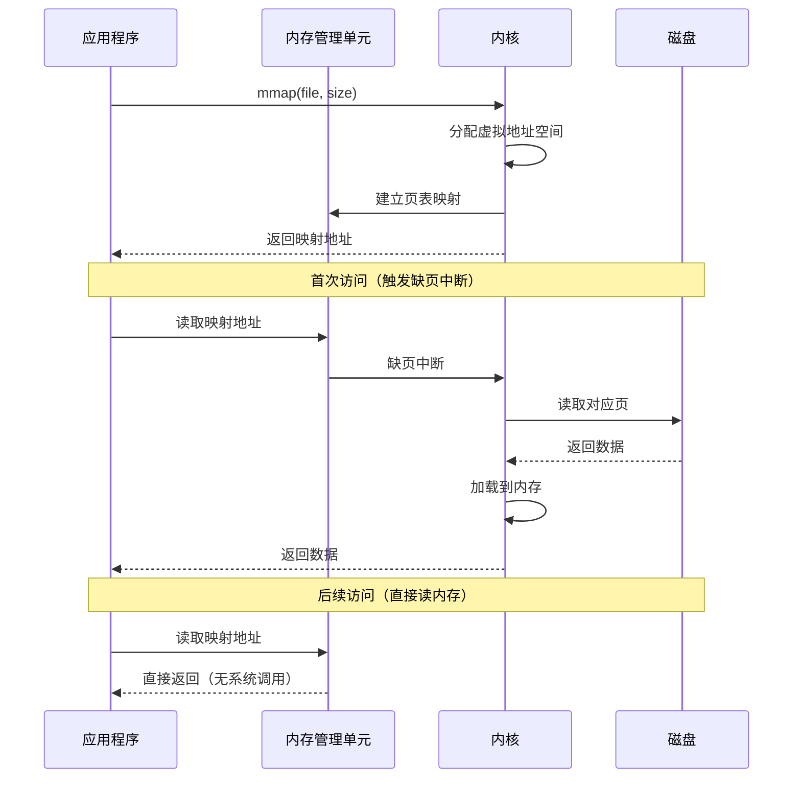
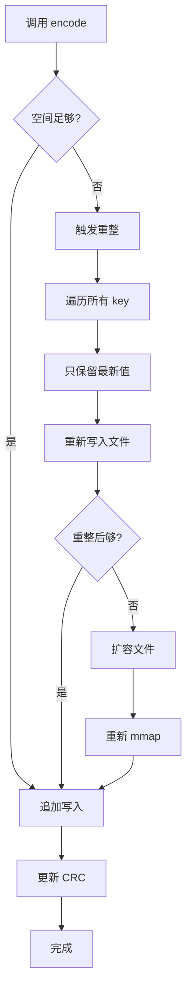
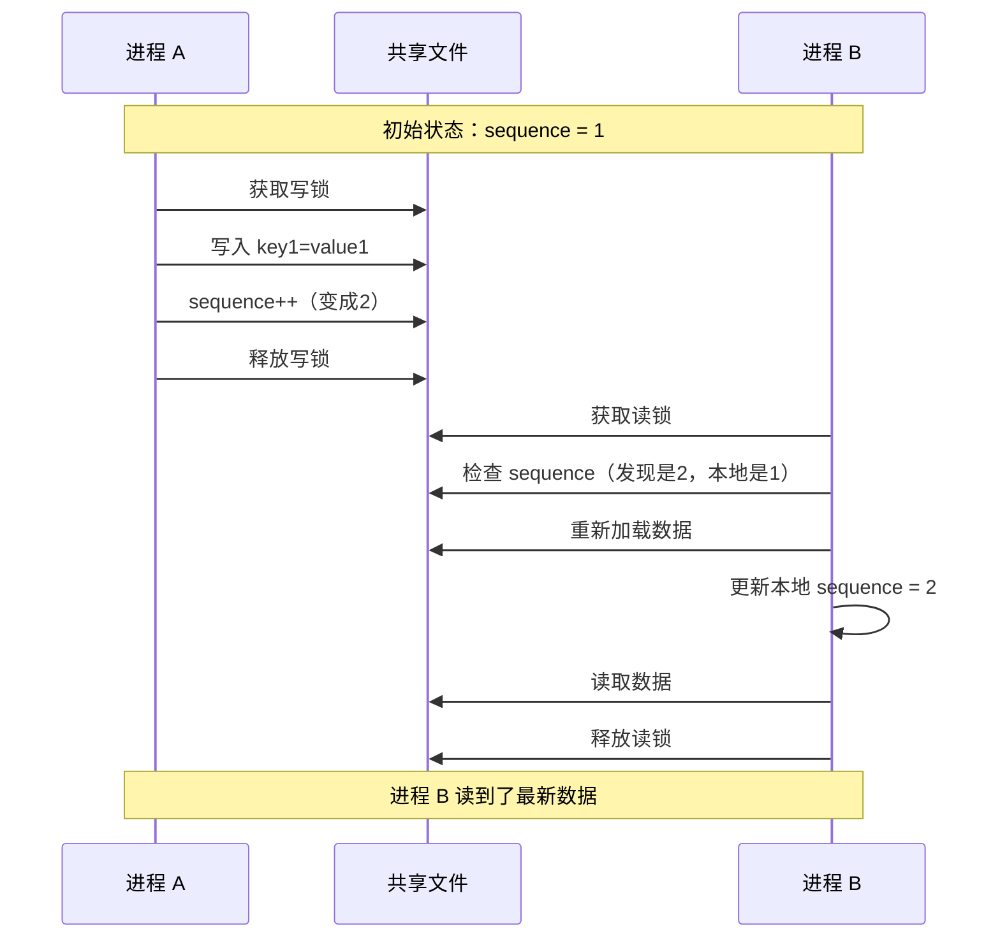

# MMKV 源码篇

## mmap 原理深入

### 什么是 mmap？

mmap（Memory-Mapped File）是一种内存映射文件的方法，它将文件内容直接映射到进程的虚拟地址空间。

> **大白话解释**：
> 
> 想象你在看书，有两种方式：
> 1. **传统读写**：每次想看哪一页，就让图书管理员（操作系统）帮你复印一份（系统调用 + 数据拷贝）
> 2. **mmap**：直接把书放在你桌上，想看哪页翻哪页（直接访问内存）
> 
> mmap 省去了"复印"这一步，所以快。

### 传统 I/O vs mmap

```
┌─────────────────────────────────────────────────────────────────┐
│                    传统 I/O 读写流程                             │
├─────────────────────────────────────────────────────────────────┤
│                                                                 │
│  应用程序          内核空间            磁盘                      │
│                                                                 │
│  ┌────────┐       ┌────────┐       ┌────────┐                   │
│  │用户缓冲│◄──────│内核缓冲│◄──────│  文件  │                   │
│  │  区    │ 拷贝② │  区    │ 拷贝① │        │                   │
│  └────────┘       └────────┘       └────────┘                   │
│                                                                 │
│  问题：两次拷贝、两次系统调用                                    │
│                                                                 │
└─────────────────────────────────────────────────────────────────┘

┌─────────────────────────────────────────────────────────────────┐
│                    mmap 读写流程                                 │
├─────────────────────────────────────────────────────────────────┤
│                                                                 │
│  应用程序          内核空间            磁盘                      │
│                                                                 │
│  ┌────────┐                        ┌────────┐                   │
│  │虚拟内存│─────────────────直接映射│  文件  │                   │
│  │        │      页表映射           │        │                   │
│  └────────┘                        └────────┘                   │
│                                                                 │
│  优点：零拷贝、直接访问、自动同步                                │
│                                                                 │
└─────────────────────────────────────────────────────────────────┘
```

### mmap 的工作原理



### mmap 的优势

| 优势 | 说明 |
|-----|------|
| **零拷贝** | 数据直接从磁盘到用户空间，无需内核缓冲区中转 |
| **减少系统调用** | 读写就像访问内存，不需要 read/write 系统调用 |
| **自动同步** | 操作系统负责将脏页写回磁盘，App 崩溃也不丢数据 |
| **共享内存** | 多进程可以映射同一文件，实现高效 IPC |
| **按需加载** | 通过缺页中断按需加载，不需要一次性加载整个文件 |

### mmap 在 MMKV 中的应用

```cpp
// MMKV 源码简化版（C++）
class MMKV {
private:
    void *m_ptr;      // mmap 返回的内存地址
    size_t m_size;    // 映射大小
    int m_fd;         // 文件描述符
    
public:
    bool open(const string &path) {
        // 1. 打开文件
        m_fd = ::open(path.c_str(), O_RDWR | O_CREAT, S_IRWXU);
        
        // 2. 获取文件大小，不够则扩展
        struct stat st;
        fstat(m_fd, &st);
        m_size = st.st_size;
        if (m_size < DEFAULT_SIZE) {
            ftruncate(m_fd, DEFAULT_SIZE);  // 扩展文件
            m_size = DEFAULT_SIZE;
        }
        
        // 3. 建立内存映射
        m_ptr = mmap(nullptr,           // 让系统选择地址
                     m_size,            // 映射大小
                     PROT_READ | PROT_WRITE,  // 可读可写
                     MAP_SHARED,        // 共享映射（多进程可见）
                     m_fd,              // 文件描述符
                     0);                // 偏移量
        
        return m_ptr != MAP_FAILED;
    }
    
    // 写入就是直接操作内存
    void write(const void *data, size_t len, size_t offset) {
        memcpy((char *)m_ptr + offset, data, len);
        // 不需要 write() 系统调用！
    }
    
    // 读取也是直接访问内存
    void read(void *buffer, size_t len, size_t offset) {
        memcpy(buffer, (char *)m_ptr + offset, len);
        // 不需要 read() 系统调用！
    }
};
```

## MMKV 写入流程

### 增量更新原理

MMKV 最大的优化之一就是**增量更新**：只追加新数据，不全量重写。

```
┌─────────────────────────────────────────────────────────────────┐
│                    MMKV 增量更新原理                             │
├─────────────────────────────────────────────────────────────────┤
│                                                                 │
│  初始状态：                                                      │
│  ┌────────────────────────────────────────────────────────────┐ │
│  │ Header │ Key1=Value1 │ Key2=Value2 │        空闲空间       │ │
│  └────────────────────────────────────────────────────────────┘ │
│                                                                 │
│  修改 Key1 的值：                                                │
│  ┌────────────────────────────────────────────────────────────┐ │
│  │ Header │ Key1=Value1 │ Key2=Value2 │ Key1=NewValue │ 空闲  │ │
│  └────────────────────────────────────────────────────────────┘ │
│                 ↑ 旧值不删除           ↑ 追加新值                │
│                                                                 │
│  读取时：从后往前找，Key1 的最新值是 NewValue                    │
│                                                                 │
└─────────────────────────────────────────────────────────────────┘
```

### 为什么不删除旧值？

删除旧值意味着：
1. 要移动后面的数据（O(n) 操作）
2. 或者留下空洞，导致碎片化
3. 都需要额外的开销

追加的优势：
1. 写入是 O(1) 操作
2. 顺序写入，对磁盘友好
3. 利用 mmap，自动异步落盘

### 写入流程详解



### 核心写入代码分析

```cpp
// 简化版写入逻辑
bool MMKV::setDataForKey(const MMBuffer &data, const string &key) {
    // 1. 计算需要的空间
    size_t needed = computeItemSize(key, data);
    
    // 2. 检查空间是否足够
    if (m_actualSize + needed > m_size) {
        // 空间不够，先尝试重整
        bool result = fullWriteback();
        
        if (m_actualSize + needed > m_size) {
            // 重整后还不够，扩容
            size_t newSize = m_size * 2;  // 翻倍扩容
            while (m_actualSize + needed > newSize) {
                newSize *= 2;
            }
            
            // 扩展文件
            ftruncate(m_fd, newSize);
            
            // 重新映射
            munmap(m_ptr, m_size);
            m_ptr = mmap(nullptr, newSize, PROT_READ | PROT_WRITE, 
                        MAP_SHARED, m_fd, 0);
            m_size = newSize;
        }
    }
    
    // 3. 追加写入
    appendDataWithKey(data, key);
    
    // 4. 更新内存字典（方便快速查找）
    m_dict[key] = data;
    
    // 5. 更新 CRC 校验
    updateCRC();
    
    return true;
}

// 追加写入的实现
void MMKV::appendDataWithKey(const MMBuffer &data, const string &key) {
    // 使用 ProtoBuf 编码
    // Key 的编码：长度 + 内容
    // Value 的编码：长度 + 内容
    
    size_t keyLength = key.size();
    
    // 写入 key 长度（变长编码）
    writeVarint32(keyLength);
    // 写入 key 内容
    write(key.data(), keyLength);
    
    // 写入 value 长度
    writeVarint32(data.size());
    // 写入 value 内容
    write(data.data(), data.size());
    
    m_actualSize += computeItemSize(key, data);
}
```

### 重整（Compaction）机制

当追加数据导致文件过大时，MMKV 会触发重整：

```cpp
// 重整：清理重复 key，只保留最新值
bool MMKV::fullWriteback() {
    // 1. 创建临时缓冲区
    MMBuffer buffer(m_size);
    size_t offset = 0;
    
    // 2. 遍历内存字典，写入最新值
    for (auto &pair : m_dict) {
        const string &key = pair.first;
        const MMBuffer &value = pair.second;
        
        // 编码并写入
        offset += encodeItem(buffer.ptr() + offset, key, value);
    }
    
    // 3. 清空原文件，写入重整后的数据
    memcpy(m_ptr + HEADER_SIZE, buffer.ptr(), offset);
    m_actualSize = HEADER_SIZE + offset;
    
    // 4. 截断文件（可选，释放多余空间）
    // ftruncate(m_fd, m_actualSize);
    
    return true;
}
```

## ProtoBuf 编码

### 为什么用 ProtoBuf？

| 对比 | XML | JSON | ProtoBuf |
|-----|-----|------|----------|
| 格式 | 文本 | 文本 | 二进制 |
| 大小 | 大 | 中 | 小（1/3 ~ 1/10） |
| 解析速度 | 慢 | 中 | 快（20~100x） |
| 可读性 | 好 | 好 | 差 |

MMKV 使用 ProtoBuf 的简化版编码，只用了其中的 Varint（变长整数）编码。

### Varint 编码原理

```
┌─────────────────────────────────────────────────────────────────┐
│                    Varint 变长整数编码                           │
├─────────────────────────────────────────────────────────────────┤
│                                                                 │
│  原理：每个字节的最高位表示"是否还有后续字节"                     │
│        1 = 还有后续字节                                          │
│        0 = 这是最后一个字节                                      │
│                                                                 │
│  示例：编码数字 300                                              │
│                                                                 │
│  300 = 256 + 44 = 0b100101100                                   │
│                                                                 │
│  第1字节：0b10101100 = 0xAC （最高位1，还有后续）                 │
│  第2字节：0b00000010 = 0x02 （最高位0，结束）                     │
│                                                                 │
│  编码结果：[0xAC, 0x02]（2字节，比固定4字节省一半）               │
│                                                                 │
│  小数字优势：                                                    │
│  • 0-127：1 字节                                                 │
│  • 128-16383：2 字节                                            │
│  • 大多数配置值都是小数字，所以省空间                            │
│                                                                 │
└─────────────────────────────────────────────────────────────────┘
```

### MMKV 数据格式

```
┌─────────────────────────────────────────────────────────────────┐
│                    MMKV 文件格式                                 │
├─────────────────────────────────────────────────────────────────┤
│                                                                 │
│  ┌────────────────────────────────────────────────────────────┐ │
│  │                       文件头 (Fixed Size)                   │ │
│  │  ┌──────────┬──────────┬──────────┬──────────────────────┐ │ │
│  │  │ 数据大小  │ 序列号   │ CRC校验  │      保留字段        │ │ │
│  │  │ (4 bytes)│ (4 bytes)│ (4 bytes)│                      │ │ │
│  │  └──────────┴──────────┴──────────┴──────────────────────┘ │ │
│  └────────────────────────────────────────────────────────────┘ │
│                                                                 │
│  ┌────────────────────────────────────────────────────────────┐ │
│  │                       数据区 (Variable Size)                │ │
│  │                                                            │ │
│  │  ┌─────────────────────────────────────────────────────┐   │ │
│  │  │ Item 1                                              │   │ │
│  │  │ ┌──────────────┬───────────┬────────────┬─────────┐│   │ │
│  │  │ │ Key 长度     │ Key 内容  │ Value 长度 │ Value   ││   │ │
│  │  │ │ (Varint)     │ (bytes)   │ (Varint)   │ (bytes) ││   │ │
│  │  │ └──────────────┴───────────┴────────────┴─────────┘│   │ │
│  │  └─────────────────────────────────────────────────────┘   │ │
│  │                                                            │ │
│  │  ┌─────────────────────────────────────────────────────┐   │ │
│  │  │ Item 2                                              │   │ │
│  │  │ ...                                                 │   │ │
│  │  └─────────────────────────────────────────────────────┘   │ │
│  │                                                            │ │
│  │  ┌─────────────────────────────────────────────────────┐   │ │
│  │  │ Item N                                              │   │ │
│  │  │ ...                                                 │   │ │
│  │  └─────────────────────────────────────────────────────┘   │ │
│  │                                                            │ │
│  └────────────────────────────────────────────────────────────┘ │
│                                                                 │
└─────────────────────────────────────────────────────────────────┘
```

## 多进程同步源码分析

### 文件锁机制

```cpp
// 简化版文件锁实现
class FileLock {
private:
    int m_fd;
    bool m_isLocked;
    
public:
    // 获取共享锁（读锁，多个进程可以同时持有）
    bool lock_shared() {
        struct flock fl;
        fl.l_type = F_RDLCK;      // 读锁
        fl.l_whence = SEEK_SET;
        fl.l_start = 0;
        fl.l_len = 0;             // 0 表示锁定整个文件
        
        return fcntl(m_fd, F_SETLKW, &fl) == 0;  // 阻塞获取
    }
    
    // 获取排他锁（写锁，只有一个进程可以持有）
    bool lock_exclusive() {
        struct flock fl;
        fl.l_type = F_WRLCK;      // 写锁
        fl.l_whence = SEEK_SET;
        fl.l_start = 0;
        fl.l_len = 0;
        
        return fcntl(m_fd, F_SETLKW, &fl) == 0;
    }
    
    // 释放锁
    void unlock() {
        struct flock fl;
        fl.l_type = F_UNLCK;
        fl.l_whence = SEEK_SET;
        fl.l_start = 0;
        fl.l_len = 0;
        
        fcntl(m_fd, F_SETLK, &fl);
    }
};
```

### 序列号同步机制

```cpp
// 多进程数据同步
class MMKV {
private:
    uint32_t m_sequence;     // 本地序列号
    uint32_t *m_actualSequence;  // 文件中的序列号（mmap 映射）
    
public:
    // 检查是否需要重新加载
    bool checkReloadData() {
        // 比较本地序列号和文件序列号
        if (m_sequence != *m_actualSequence) {
            // 其他进程修改了数据，需要重新加载
            loadFromFile();
            m_sequence = *m_actualSequence;
            return true;
        }
        return false;
    }
    
    // 写入数据
    bool setDataForKey(const string &key, const MMBuffer &data) {
        // 1. 获取写锁
        m_fileLock.lock_exclusive();
        
        // 2. 检查是否需要重新加载
        checkReloadData();
        
        // 3. 写入数据
        appendDataWithKey(data, key);
        
        // 4. 更新序列号
        (*m_actualSequence)++;
        m_sequence = *m_actualSequence;
        
        // 5. 释放锁
        m_fileLock.unlock();
        
        return true;
    }
    
    // 读取数据
    MMBuffer getDataForKey(const string &key) {
        // 1. 获取读锁
        m_fileLock.lock_shared();
        
        // 2. 检查是否需要重新加载
        checkReloadData();
        
        // 3. 从内存字典读取
        auto it = m_dict.find(key);
        MMBuffer result = (it != m_dict.end()) ? it->second : MMBuffer();
        
        // 4. 释放锁
        m_fileLock.unlock();
        
        return result;
    }
};
```

### 多进程同步流程



## 设计亮点分析

### 1. 空间换时间的追加策略

**传统思路**：修改数据就地更新，保持文件紧凑。

**MMKV 思路**：追加新数据，定期重整。

```kotlin
// 设计权衡
// 
// 优点：
// 1. 写入是 O(1)，极快
// 2. 顺序写入，SSD 友好
// 3. 实现简单，bug 少
//
// 缺点：
// 1. 文件会有冗余数据
// 2. 需要定期重整
//
// 权衡：
// - 配置数据通常很小（几 KB 到几 MB）
// - 写入频率远高于重整频率
// - 用少量空间换取极致写入性能，值得！
```

### 2. 内存字典加速读取

```cpp
// MMKV 同时维护两份数据：
// 1. 文件数据（mmap 映射）—— 持久化
// 2. 内存字典（std::map）—— 快速查找

class MMKV {
    // 文件数据
    void *m_ptr;
    
    // 内存字典：key -> value 的映射
    std::unordered_map<string, MMBuffer> m_dict;
    
    // 读取：直接从字典查，O(1)
    MMBuffer get(const string &key) {
        return m_dict[key];
    }
    
    // 写入：更新字典 + 追加文件
    void set(const string &key, const MMBuffer &value) {
        m_dict[key] = value;
        appendToFile(key, value);
    }
};
```

### 3. CRC 校验保证数据完整性

```cpp
// CRC32 校验
// - 每次写入后更新 CRC
// - 读取时验证 CRC
// - 发现损坏可以尝试恢复

uint32_t calculateCRC(const void *data, size_t len) {
    // 使用 CRC32 算法计算校验和
    return crc32(0, (const Bytef *)data, (uInt)len);
}

bool verifyCRC() {
    uint32_t stored = *m_crcDigest;  // 存储的 CRC
    uint32_t calculated = calculateCRC(m_ptr + HEADER_SIZE, m_actualSize);
    
    if (stored != calculated) {
        // CRC 不匹配，数据可能损坏
        return false;
    }
    return true;
}
```

### 4. 智能扩容策略

```cpp
// 扩容策略：翻倍扩容
// 
// 为什么翻倍？
// 1. 摊还分析：多次操作的平均成本是 O(1)
// 2. 避免频繁扩容：每次扩容都需要重新 mmap
// 3. 空间预留：为后续写入留出空间

size_t calculateNewSize(size_t currentSize, size_t needed) {
    size_t newSize = currentSize;
    
    // 翻倍扩容，直到够用
    while (newSize < needed) {
        newSize *= 2;
    }
    
    // 最小 4KB（一页），最大限制根据需求设定
    return max(newSize, 4096UL);
}
```

## 面试深度问题

### 源码理解题

**Q1：mmap 为什么比传统 I/O 快？**

> **答案**：三个层面的优化：
> 
> 1. **减少数据拷贝**
>    - 传统 I/O：磁盘 → 内核缓冲 → 用户缓冲（两次拷贝）
>    - mmap：磁盘 → 用户空间（零拷贝，通过页表映射）
> 
> 2. **减少系统调用**
>    - 传统 I/O：每次 read/write 都是系统调用
>    - mmap：建立映射后，读写就是普通内存操作
> 
> 3. **利用操作系统优化**
>    - 页缓存（Page Cache）
>    - 预读（Read-ahead）
>    - 延迟写入（Write-back）

**Q2：MMKV 的追加写入会不会导致文件无限增长？**

> **答案**：不会，MMKV 有重整机制：
> 
> 1. **触发条件**：
>    - 空间不足时自动触发
>    - 可以手动调用 `trim()` 触发
> 
> 2. **重整过程**：
>    - 遍历内存字典（只有最新值）
>    - 重新编码写入文件
>    - 旧数据被覆盖
> 
> 3. **重整后的效果**：
>    - 文件大小 = 实际数据大小
>    - 没有冗余数据
> 
> 4. **性能影响**：
>    - 重整是低频操作（空间不足才触发）
>    - 重整期间持有写锁，会阻塞其他写操作

**Q3：mmap 文件崩溃会丢数据吗？**

> **答案**：几乎不会，但有极端情况：
> 
> **安全的情况**：
> - App 崩溃：不丢数据。mmap 的数据由内核管理，App 崩溃后内核会继续同步到磁盘
> - 系统正常关机：不丢数据。系统会先同步所有脏页
> 
> **可能丢数据的极端情况**：
> - 突然断电（硬件故障）：最后几秒的写入可能丢失
> - 这是所有基于内存缓存的方案都有的问题
> 
> **MMKV 的保护措施**：
> - CRC 校验检测损坏
> - 可以配置 `MMKV.ASYNC_SYNC` 或 `MMKV.SYNC_SYNC` 控制同步策略
> - 关键数据可以调用 `sync()` 强制同步

**Q4：MMKV 多进程写入会不会冲突？**

> **答案**：不会，MMKV 使用文件锁保证互斥：
> 
> 1. **写操作**：获取排他锁（F_WRLCK），同一时刻只有一个进程能写
> 2. **读操作**：获取共享锁（F_RDLCK），多个进程可以同时读
> 3. **序列号机制**：检测数据变更，读取前自动重新加载
> 
> **潜在问题**：
> - 频繁的多进程写入可能有锁竞争
> - 建议：写入密集的场景用单进程，读取密集可以多进程

**Q5：如果让你设计一个类似的存储系统，你会怎么做？有什么可以改进的地方？**

> **答案**：可能的改进方向：
> 
> **1. 异步 API**
> - 当前 MMKV 是同步 API，可以提供协程版本
> - 虽然写入很快，但批量操作时异步更友好
> 
> **2. 类型安全**
> - 当前需要手动指定类型（decodeInt、decodeString）
> - 可以用泛型或代码生成实现类型安全
> 
> **3. 数据分片**
> - 单个文件过大影响重整性能
> - 可以按 key 哈希分片到多个文件
> 
> **4. 压缩支持**
> - 对于大数据，可以支持可选的压缩
> - LZ4 等快速压缩算法，在空间和性能间平衡
> 
> **5. 订阅机制**
> - 支持监听 key 变化
> - 类似 LiveData 的响应式能力

---

## 总结

MMKV 的核心设计思想：

```
┌─────────────────────────────────────────────────────────────────┐
│                    MMKV 设计哲学总结                             │
├─────────────────────────────────────────────────────────────────┤
│                                                                 │
│  1. 用 mmap 换取零拷贝的读写性能                                 │
│                                                                 │
│  2. 用追加写入换取 O(1) 的写入速度                               │
│                                                                 │
│  3. 用内存字典换取 O(1) 的读取速度                               │
│                                                                 │
│  4. 用 ProtoBuf 编码换取紧凑的存储空间                           │
│                                                                 │
│  5. 用文件锁 + 序列号换取多进程安全                              │
│                                                                 │
│  6. 用 CRC 校验换取数据完整性                                    │
│                                                                 │
│  核心思想：在配置存储这个场景下，做出最优的权衡取舍               │
│                                                                 │
└─────────────────────────────────────────────────────────────────┘
```

---

_相关阅读：[1-基础篇](./1-基础篇.md) | [2-进阶篇](./2-进阶篇.md)_
