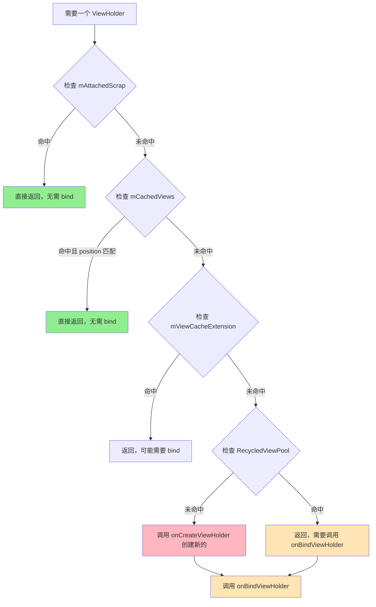

# RecyclerView 列表优化实战

## 前言：为什么这篇文档不一样？

市面上大多数 RecyclerView 优化文章都在告诉你「用 DiffUtil」「减少布局层级」「设置 setHasFixedSize」，但很少解释**为什么这样做有效**。

这篇文档的目标是：**让你理解原理，而不是背诵技巧**。

当你理解了 RecyclerView 的缓存机制、渲染流程、以及 Android 的帧调度机制后，你自然就知道该怎么优化，面试时也能讲出深度。

---

## 一、先搞懂原理：RecyclerView 的四级缓存

> **核心观点**：所有 RecyclerView 优化，本质上都是在**提高缓存命中率**或**减少单次操作耗时**。不理解缓存机制，优化就是瞎搞。

### 1.1 四级缓存全景图

```
┌─────────────────────────────────────────────────────────────────────────────┐
│                        RecyclerView 四级缓存机制                              │
├─────────────────────────────────────────────────────────────────────────────┤
│                                                                             │
│   滑动方向 ↓                                                                 │
│                                                                             │
│   ┌─────────────────────────────────────────────────────────────────────┐   │
│   │  屏幕可见区域                                                         │   │
│   │  ┌─────┐ ┌─────┐ ┌─────┐ ┌─────┐ ┌─────┐                           │   │
│   │  │Item0│ │Item1│ │Item2│ │Item3│ │Item4│  ← 正在显示的 ViewHolder    │   │
│   │  └─────┘ └─────┘ └─────┘ └─────┘ └─────┘                           │   │
│   └─────────────────────────────────────────────────────────────────────┘   │
│                                                                             │
│   ════════════════════════════════════════════════════════════════════════  │
│                                                                             │
│   第一级：mAttachedScrap / mChangedScrap                                    │
│   ┌─────────────────────────────────────────────────────────────────────┐   │
│   │  存放：屏幕内正在显示但需要重新布局的 ViewHolder                          │   │
│   │  特点：不需要重新 bind，直接复用                                         │   │
│   │  场景：notifyItemChanged 时，原位置的 ViewHolder 会先放这里              │   │
│   └─────────────────────────────────────────────────────────────────────┘   │
│                                                                             │
│   第二级：mCachedViews（默认大小 2）                                          │
│   ┌─────────────────────────────────────────────────────────────────────┐   │
│   │  存放：刚滑出屏幕的 ViewHolder                                          │   │
│   │  特点：按 position 缓存，不需要重新 bind                                 │   │
│   │  场景：用户来回滑动时，刚滑出去的 Item 滑回来可以直接复用                   │   │
│   │  ┌─────┐ ┌─────┐                                                      │   │
│   │  │pos=5│ │pos=6│  ← 记住了 position，回来时秒恢复                       │   │
│   │  └─────┘ └─────┘                                                      │   │
│   └─────────────────────────────────────────────────────────────────────┘   │
│                                                                             │
│   第三级：mViewCacheExtension（可选，开发者自定义）                            │
│   ┌─────────────────────────────────────────────────────────────────────┐   │
│   │  存放：开发者自定义的缓存逻辑                                            │   │
│   │  场景：特殊业务需求，比如某些 Item 需要长期缓存                            │   │
│   └─────────────────────────────────────────────────────────────────────┘   │
│                                                                             │
│   第四级：RecycledViewPool（默认每种 viewType 缓存 5 个）                     │
│   ┌─────────────────────────────────────────────────────────────────────┐   │
│   │  存放：彻底离开屏幕、不再按 position 缓存的 ViewHolder                    │   │
│   │  特点：按 viewType 分池，需要重新 bind                                   │   │
│   │  场景：快速滑动时，大量 ViewHolder 会进入这里                             │   │
│   │                                                                       │   │
│   │  viewType=0 池：┌─────┐┌─────┐┌─────┐┌─────┐┌─────┐                   │   │
│   │                 │ VH  ││ VH  ││ VH  ││ VH  ││ VH  │ (最多5个)          │   │
│   │                 └─────┘└─────┘└─────┘└─────┘└─────┘                   │   │
│   │  viewType=1 池：┌─────┐┌─────┐                                        │   │
│   │                 │ VH  ││ VH  │                                        │   │
│   │                 └─────┘└─────┘                                        │   │
│   └─────────────────────────────────────────────────────────────────────┘   │
│                                                                             │
│   ════════════════════════════════════════════════════════════════════════  │
│                                                                             │
│   缓存全 MISS → 调用 onCreateViewHolder() 创建新的                           │
│                                                                             │
└─────────────────────────────────────────────────────────────────────────────┘
```

### 1.2 缓存查找流程



### 1.3 关键洞察：为什么理解缓存很重要？

| 缓存级别 | 命中时 | 未命中时 | 优化方向 |
|---------|--------|---------|---------|
| mCachedViews | 0ms（直接用） | 继续找下一级 | 增大 `setItemViewCacheSize` |
| RecycledViewPool | ~2ms（需要 bind） | 需要 create | 增大池大小、共享池、减少 viewType |
| 全部 MISS | - | ~5-10ms（create + bind） | 预加载、异步 inflate |

**核心结论**：
- **mCachedViews 命中** = 用户来回滑动时的极致体验
- **RecycledViewPool 命中** = 快速滑动时的基本保障
- **全部 MISS** = 卡顿的根源

---

## 二、问题一：onCreateViewHolder 耗时过长

### 2.1 问题现象

快速滑动列表时掉帧，Systrace 里看到大量 `inflate` 调用，每次 5-10ms。

### 2.2 为什么会慢？

`onCreateViewHolder` 做了三件事，每件都很耗时：

```
┌─────────────────────────────────────────────────────────────────┐
│              onCreateViewHolder 内部耗时分解                      │
├─────────────────────────────────────────────────────────────────┤
│                                                                 │
│  1. XML 解析（IO 操作）                                          │
│     ├── 读取 XML 文件                                           │
│     ├── 解析 XML 结构                                           │
│     └── 耗时：1-3ms                                             │
│                                                                 │
│  2. 反射创建 View（CPU 操作）                                     │
│     ├── Class.forName("android.widget.TextView")               │
│     ├── Constructor.newInstance()                              │
│     ├── 每个 View 都要反射一次                                   │
│     └── 耗时：1-2ms（取决于 View 数量）                           │
│                                                                 │
│  3. 测量和布局（CPU 操作）                                        │
│     ├── 递归调用 measure()                                      │
│     ├── 递归调用 layout()                                       │
│     ├── 嵌套越深，递归越多                                       │
│     └── 耗时：1-5ms（取决于布局复杂度）                           │
│                                                                 │
│  总耗时：3-10ms（复杂布局可能更长）                                │
│  16.6ms 的帧时间，一次 create 就占了大半！                         │
│                                                                 │
└─────────────────────────────────────────────────────────────────┘
```

### 2.3 为什么布局层级深会更慢？

**关键原理：测量次数的指数增长**

不同布局的测量特性：

| 布局 | 子 View 测量次数 | 原因 |
|-----|----------------|------|
| FrameLayout | 1 次 | 子 View 之间无依赖 |
| LinearLayout（无 weight） | 1 次 | 简单线性排列 |
| LinearLayout（有 weight） | 2 次 | 第一次测量总大小，第二次分配权重 |
| RelativeLayout | 2 次 | 横向依赖测一次，纵向依赖测一次 |

**嵌套的代价**：

```
假设 3 层 RelativeLayout 嵌套：

                    RelativeLayout (层1)
                   /                    \
          RelativeLayout              RelativeLayout
             (层2)                       (层2)
            /      \                    /      \
       TextView  TextView          TextView  TextView
          (层3)     (层3)             (层3)     (层3)

测量次数计算：
- 层1 测量 2 次
- 每次测量层1，层2 要测量 2 次 → 2 × 2 = 4 次
- 每次测量层2，层3 要测量 2 次 → 4 × 2 = 8 次

总测量次数 = 2^n（n 是嵌套层数）

3 层嵌套 = 8 次测量
5 层嵌套 = 32 次测量
7 层嵌套 = 128 次测量！
```

### 2.4 优化方案一：减少布局层级

```xml
<!-- ❌ 问题写法：3 层嵌套，商品卡片常见的错误 -->
<LinearLayout
    android:layout_width="match_parent"
    android:layout_height="wrap_content"
    android:orientation="horizontal"
    android:padding="12dp">
    
    <!-- 左侧图片 -->
    <ImageView
        android:id="@+id/iv_cover"
        android:layout_width="100dp"
        android:layout_height="100dp"
        android:scaleType="centerCrop"/>
    
    <!-- 右侧信息区域 - 第二层嵌套 -->
    <LinearLayout
        android:layout_width="0dp"
        android:layout_height="wrap_content"
        android:layout_weight="1"
        android:layout_marginStart="12dp"
        android:orientation="vertical">
        
        <TextView
            android:id="@+id/tv_title"
            android:layout_width="match_parent"
            android:layout_height="wrap_content"
            android:maxLines="2"
            android:textSize="16sp"/>
        
        <!-- 价格和销量 - 第三层嵌套 -->
        <LinearLayout
            android:layout_width="match_parent"
            android:layout_height="wrap_content"
            android:layout_marginTop="8dp"
            android:orientation="horizontal">
            
            <TextView
                android:id="@+id/tv_price"
                android:layout_width="wrap_content"
                android:layout_height="wrap_content"
                android:textColor="#FF5000"
                android:textSize="18sp"/>
            
            <TextView
                android:id="@+id/tv_sales"
                android:layout_width="wrap_content"
                android:layout_height="wrap_content"
                android:layout_marginStart="8dp"
                android:textColor="#999999"
                android:textSize="12sp"/>
        </LinearLayout>
    </LinearLayout>
</LinearLayout>

<!-- 
问题分析：
1. 最外层 LinearLayout 有 weight，子 View 要测量 2 次
2. 3 层嵌套，测量次数指数增长
3. 测量耗时可能达到 3-5ms
-->
```

```xml
<!-- ✅ 优化写法：ConstraintLayout 扁平化，只有 1 层 -->
<androidx.constraintlayout.widget.ConstraintLayout
    android:layout_width="match_parent"
    android:layout_height="wrap_content"
    android:padding="12dp">

    <!-- 
    为什么 ConstraintLayout 更快？
    1. 所有子 View 都是直接子节点，没有嵌套
    2. 使用约束求解器（Cassowary 算法），一次遍历完成布局计算
    3. 不会像 RelativeLayout 那样横向纵向各测一次
    -->

    <ImageView
        android:id="@+id/iv_cover"
        android:layout_width="100dp"
        android:layout_height="100dp"
        android:scaleType="centerCrop"
        app:layout_constraintStart_toStartOf="parent"
        app:layout_constraintTop_toTopOf="parent"/>

    <TextView
        android:id="@+id/tv_title"
        android:layout_width="0dp"
        android:layout_height="wrap_content"
        android:maxLines="2"
        android:textSize="16sp"
        android:layout_marginStart="12dp"
        app:layout_constraintStart_toEndOf="@id/iv_cover"
        app:layout_constraintEnd_toEndOf="parent"
        app:layout_constraintTop_toTopOf="parent"/>

    <TextView
        android:id="@+id/tv_price"
        android:layout_width="wrap_content"
        android:layout_height="wrap_content"
        android:textColor="#FF5000"
        android:textSize="18sp"
        android:layout_marginStart="12dp"
        android:layout_marginTop="8dp"
        app:layout_constraintStart_toEndOf="@id/iv_cover"
        app:layout_constraintTop_toBottomOf="@id/tv_title"/>

    <TextView
        android:id="@+id/tv_sales"
        android:layout_width="wrap_content"
        android:layout_height="wrap_content"
        android:textColor="#999999"
        android:textSize="12sp"
        android:layout_marginStart="8dp"
        app:layout_constraintStart_toEndOf="@id/tv_price"
        app:layout_constraintBaseline_toBaselineOf="@id/tv_price"/>

</androidx.constraintlayout.widget.ConstraintLayout>

<!-- 
优化效果：
1. 布局层级从 3 层降到 1 层
2. 测量次数从指数级降到线性级
3. inflate 耗时从 5ms 降到 2ms 左右
-->
```

### 2.5 优化方案二：预热 RecycledViewPool

**原理**：在用户还没开始滑动时，提前在后台线程创建好 ViewHolder，放入缓存池。等用户滑动时，直接从池里拿，不需要现场 create。

```kotlin
/**
 * RecycledViewPool 预热器
 * 
 * 原理：利用 IdleHandler 在主线程空闲时预创建 ViewHolder
 * 为什么用 IdleHandler？因为 ViewHolder 的创建必须在主线程（涉及 View 操作），
 * 但我们不想阻塞用户操作，所以选择在主线程空闲时执行
 */
class RecycledViewPoolPreloader(
    private val recyclerView: RecyclerView
) {
    
    /**
     * 预热指定类型的 ViewHolder
     * 
     * @param viewType ViewHolder 的类型，对应 adapter.getItemViewType() 的返回值
     * @param count 预创建的数量，建议设置为一屏能显示的数量 + 2
     */
    fun preload(viewType: Int, count: Int) {
        val adapter = recyclerView.adapter ?: return
        val pool = recyclerView.recycledViewPool
        
        // 先设置池的最大容量，否则预创建的 ViewHolder 可能放不进去
        // 默认每种 viewType 只缓存 5 个，复杂列表建议调大
        pool.setMaxRecycledViews(viewType, count)
        
        var created = 0
        
        // 使用 IdleHandler 在主线程空闲时执行
        // 这样不会阻塞用户的其他操作（如点击、输入）
        Looper.myQueue().addIdleHandler {
            if (created < count) {
                // 创建 ViewHolder 并放入缓存池
                val holder = adapter.createViewHolder(recyclerView, viewType)
                pool.putRecycledView(holder)
                created++
                
                // 返回 true 表示下次空闲时继续执行
                // 返回 false 表示执行完毕，移除 IdleHandler
                true
            } else {
                false
            }
        }
    }
}

// 使用示例
class ProductListActivity : AppCompatActivity() {
    
    override fun onCreate(savedInstanceState: Bundle?) {
        super.onCreate(savedInstanceState)
        setContentView(R.layout.activity_product_list)
        
        val recyclerView = findViewById<RecyclerView>(R.id.recycler_view)
        recyclerView.adapter = ProductAdapter()
        recyclerView.layoutManager = LinearLayoutManager(this)
        
        // 在 Activity 创建后预热缓存池
        // TYPE_PRODUCT = 0 是商品卡片类型，预创建 10 个
        RecycledViewPoolPreloader(recyclerView).preload(
            viewType = ProductAdapter.TYPE_PRODUCT,
            count = 10
        )
    }
}
```

### 2.6 优化方案三：AsyncLayoutInflater 异步创建

**原理**：XML inflate 涉及 IO 操作，可以放到后台线程执行。但注意 View 的后续操作必须回到主线程。

```kotlin
/**
 * 支持异步预加载的 Adapter 基类
 * 
 * 原理：
 * 1. 使用 AsyncLayoutInflater 在后台线程解析 XML
 * 2. 解析完成后将 View 缓存起来
 * 3. onCreateViewHolder 时优先从缓存取，没有再同步创建
 * 
 * 为什么比直接用 AsyncLayoutInflater 更好？
 * 因为我们可以提前预加载，而不是等到需要时才异步加载（那时候可能已经来不及了）
 */
abstract class AsyncPreloadAdapter<VH : RecyclerView.ViewHolder> : RecyclerView.Adapter<VH>() {
    
    // 线程安全的 View 缓存队列
    // 为什么用 ConcurrentLinkedQueue？因为生产者（后台线程）和消费者（主线程）不同
    private val viewCache = ConcurrentLinkedQueue<View>()
    
    // 记录正在预加载的数量，避免重复预加载
    private val preloadingCount = AtomicInteger(0)
    
    /**
     * 子类实现：返回 Item 布局的资源 ID
     */
    @LayoutRes
    abstract fun getItemLayoutRes(viewType: Int): Int
    
    /**
     * 子类实现：根据 View 创建 ViewHolder
     */
    abstract fun createViewHolderFromView(view: View, viewType: Int): VH
    
    /**
     * 预加载指定数量的 View
     * 
     * @param context 用于创建 LayoutInflater
     * @param viewType View 类型
     * @param count 预加载数量
     */
    fun preInflate(context: Context, viewType: Int, count: Int) {
        val inflater = AsyncLayoutInflater(context)
        val layoutRes = getItemLayoutRes(viewType)
        
        repeat(count) {
            preloadingCount.incrementAndGet()
            
            // AsyncLayoutInflater.inflate() 会在后台线程执行 XML 解析
            // 完成后回调到主线程
            inflater.inflate(layoutRes, null) { view, _, _ ->
                // 这个回调在主线程执行
                viewCache.offer(view)
                preloadingCount.decrementAndGet()
            }
        }
    }
    
    /**
     * 重写 onCreateViewHolder，优先使用缓存的 View
     */
    override fun onCreateViewHolder(parent: ViewGroup, viewType: Int): VH {
        // 优先从缓存队列取 View
        // poll() 是非阻塞的，队列空时返回 null
        val cachedView = viewCache.poll()
        
        val view = if (cachedView != null) {
            // 命中缓存！省去了 XML 解析的时间
            // 但需要重新设置 LayoutParams，因为异步 inflate 时 parent 是 null
            cachedView.layoutParams = RecyclerView.LayoutParams(
                ViewGroup.LayoutParams.MATCH_PARENT,
                ViewGroup.LayoutParams.WRAP_CONTENT
            )
            cachedView
        } else {
            // 缓存未命中，回退到同步创建
            // 这种情况说明预加载数量不够，或者滑动太快
            LayoutInflater.from(parent.context).inflate(
                getItemLayoutRes(viewType), 
                parent, 
                false
            )
        }
        
        return createViewHolderFromView(view, viewType)
    }
}

// 使用示例
class ProductAdapter : AsyncPreloadAdapter<ProductAdapter.ProductViewHolder>() {
    
    private var products: List<Product> = emptyList()
    
    companion object {
        const val TYPE_PRODUCT = 0
    }
    
    override fun getItemLayoutRes(viewType: Int): Int = R.layout.item_product
    
    override fun createViewHolderFromView(view: View, viewType: Int): ProductViewHolder {
        return ProductViewHolder(view)
    }
    
    override fun getItemCount(): Int = products.size
    
    override fun onBindViewHolder(holder: ProductViewHolder, position: Int) {
        holder.bind(products[position])
    }
    
    class ProductViewHolder(view: View) : RecyclerView.ViewHolder(view) {
        private val ivCover: ImageView = view.findViewById(R.id.iv_cover)
        private val tvTitle: TextView = view.findViewById(R.id.tv_title)
        private val tvPrice: TextView = view.findViewById(R.id.tv_price)
        
        fun bind(product: Product) {
            tvTitle.text = product.title
            tvPrice.text = product.priceText
            // 图片加载见后面的优化
        }
    }
}

// 在 Activity 中预加载
class ProductListActivity : AppCompatActivity() {
    
    private lateinit var adapter: ProductAdapter
    
    override fun onCreate(savedInstanceState: Bundle?) {
        super.onCreate(savedInstanceState)
        setContentView(R.layout.activity_product_list)
        
        adapter = ProductAdapter()
        
        // 提前预加载 10 个 View
        // 最佳时机：在网络请求数据的同时预加载，这样数据回来时 View 已经准备好了
        adapter.preInflate(this, ProductAdapter.TYPE_PRODUCT, 10)
        
        val recyclerView = findViewById<RecyclerView>(R.id.recycler_view)
        recyclerView.adapter = adapter
    }
}
```

---

## 三、问题二：onBindViewHolder 耗时过长

### 3.1 为什么 bind 慢会导致卡顿？

```
┌─────────────────────────────────────────────────────────────────────────────┐
│                    一帧的时间预算：16.6ms                                     │
├─────────────────────────────────────────────────────────────────────────────┤
│                                                                             │
│   假设一屏显示 5 个 Item，快速滑动时每帧需要 bind 2-3 个新 Item               │
│                                                                             │
│   ┌──────────────────────────────────────────────────────────────────┐      │
│   │                        理想情况                                    │      │
│   │  ┌─────┐ ┌─────┐ ┌─────┐ ┌─────────────────────────────────┐     │      │
│   │  │bind │ │bind │ │bind │ │     还剩余的时间（做其他事情）      │     │      │
│   │  │ 2ms │ │ 2ms │ │ 2ms │ │         10.6ms                   │     │      │
│   │  └─────┘ └─────┘ └─────┘ └─────────────────────────────────┘     │      │
│   │  ←───────── 6ms ─────────→                                       │      │
│   └──────────────────────────────────────────────────────────────────┘      │
│                                                                             │
│   ┌──────────────────────────────────────────────────────────────────┐      │
│   │                        问题情况                                    │      │
│   │  ┌───────────┐ ┌───────────┐ ┌───────────┐                       │      │
│   │  │   bind    │ │   bind    │ │   bind    │ ← 超时！掉帧！         │      │
│   │  │   8ms     │ │   8ms     │ │   8ms     │                       │      │
│   │  └───────────┘ └───────────┘ └───────────┘                       │      │
│   │  ←─────────────────── 24ms ──────────────────→                   │      │
│   │                                               超出 16.6ms         │      │
│   └──────────────────────────────────────────────────────────────────┘      │
│                                                                             │
│   结论：每个 Item 的 bind 时间必须控制在 2-3ms 以内                          │
│                                                                             │
└─────────────────────────────────────────────────────────────────────────────┘
```

### 3.2 常见的 bind 耗时操作

```kotlin
// ❌ 问题代码：bind 中有多个耗时操作
override fun onBindViewHolder(holder: ProductViewHolder, position: Int) {
    val product = products[position]
    
    // 问题1：每次都创建新的 SimpleDateFormat（~0.5ms）
    // SimpleDateFormat 的构造函数会解析格式字符串，比较耗时
    val sdf = SimpleDateFormat("yyyy-MM-dd HH:mm", Locale.getDefault())
    holder.tvTime.text = sdf.format(product.createTime)
    
    // 问题2：复杂的字符串格式化（~0.3ms）
    holder.tvPrice.text = String.format("¥%.2f", product.price)
    
    // 问题3：构建 SpannableString（~1-2ms）
    // 如果文本较长，Span 操作会很耗时
    val spannable = SpannableStringBuilder()
    spannable.append(product.title)
    spannable.setSpan(
        ForegroundColorSpan(Color.RED),
        0, 
        minOf(2, product.title.length),
        Spannable.SPAN_EXCLUSIVE_EXCLUSIVE
    )
    spannable.append("\n")
    spannable.append(product.subtitle)
    spannable.setSpan(
        RelativeSizeSpan(0.8f),
        product.title.length + 1,
        spannable.length,
        Spannable.SPAN_EXCLUSIVE_EXCLUSIVE
    )
    holder.tvTitle.text = spannable
    
    // 问题4：每次都创建新的 OnClickListener（~0.1ms + 内存抖动）
    holder.itemView.setOnClickListener {
        onItemClick(position)
    }
    
    // 问题5：在主线程解码图片（绝对不能这么做！~10-100ms）
    // 这是最严重的错误，但新手经常犯
    val bitmap = BitmapFactory.decodeResource(resources, product.imageRes)
    holder.ivCover.setImageBitmap(bitmap)
}
```

### 3.3 优化方案一：对象复用，避免在 bind 中创建对象

```kotlin
/**
 * 优化后的 ViewHolder
 * 
 * 核心思想：把所有可复用的对象提升为成员变量
 * 这样在 bind 时直接使用，不需要每次创建
 */
class ProductViewHolder(view: View) : RecyclerView.ViewHolder(view) {
    
    private val ivCover: ImageView = view.findViewById(R.id.iv_cover)
    private val tvTitle: TextView = view.findViewById(R.id.tv_title)
    private val tvPrice: TextView = view.findViewById(R.id.tv_price)
    private val tvTime: TextView = view.findViewById(R.id.tv_time)
    
    // ✅ 复用 SimpleDateFormat
    // 为什么放在 ViewHolder 而不是 Adapter？
    // 因为 SimpleDateFormat 不是线程安全的，每个 ViewHolder 持有一个实例更安全
    private val dateFormat = SimpleDateFormat("yyyy-MM-dd HH:mm", Locale.getDefault())
    
    // ✅ 复用 SpannableStringBuilder
    // 为什么用 SpannableStringBuilder 而不是 SpannableString？
    // 因为 SpannableStringBuilder 可以 clear() 后重用，SpannableString 不行
    private val titleSpanBuilder = SpannableStringBuilder()
    
    // ✅ 复用 Span 对象
    // Span 对象本身也是可以复用的
    private val highlightSpan = ForegroundColorSpan(Color.RED)
    private val subtitleSizeSpan = RelativeSizeSpan(0.8f)
    
    // ✅ 复用点击监听器
    // 通过闭包捕获 Adapter 的回调，避免每次创建新的 listener
    private var onItemClickListener: ((Int) -> Unit)? = null
    
    init {
        // 只设置一次点击监听器
        itemView.setOnClickListener {
            // bindingAdapterPosition 是 ViewHolder 当前绑定的位置
            // 比 adapterPosition 更准确（考虑了 ConcatAdapter 的情况）
            onItemClickListener?.invoke(bindingAdapterPosition)
        }
    }
    
    /**
     * 绑定数据
     * 
     * @param product 商品数据
     * @param onItemClick 点击回调
     */
    fun bind(product: Product, onItemClick: (Int) -> Unit) {
        this.onItemClickListener = onItemClick
        
        // ✅ 复用 dateFormat
        tvTime.text = dateFormat.format(product.createTime)
        
        // ✅ 价格格式化（如果频繁调用，考虑用 StringBuilder 复用）
        tvPrice.text = "¥${product.price}"
        
        // ✅ 复用 SpannableStringBuilder
        titleSpanBuilder.clear()       // 清空内容
        titleSpanBuilder.clearSpans()  // 清空所有 Span
        
        titleSpanBuilder.append(product.title)
        titleSpanBuilder.setSpan(
            highlightSpan,  // 复用 Span 对象
            0,
            minOf(2, product.title.length),
            Spannable.SPAN_EXCLUSIVE_EXCLUSIVE
        )
        
        if (product.subtitle.isNotEmpty()) {
            titleSpanBuilder.append("\n")
            val subtitleStart = titleSpanBuilder.length
            titleSpanBuilder.append(product.subtitle)
            titleSpanBuilder.setSpan(
                subtitleSizeSpan,  // 复用 Span 对象
                subtitleStart,
                titleSpanBuilder.length,
                Spannable.SPAN_EXCLUSIVE_EXCLUSIVE
            )
        }
        
        tvTitle.text = titleSpanBuilder
    }
}
```

### 3.4 优化方案二：数据预处理（最推荐）

**核心思想**：把格式化、Span 构建等操作移到数据层，在后台线程完成。bind 时直接赋值，无需计算。

```kotlin
/**
 * 展示层数据模型（View Object）
 * 
 * 为什么要有单独的 VO？
 * 1. 网络层返回的 Product 是原始数据（price 是 Double，time 是 Long）
 * 2. UI 需要的是格式化后的数据（priceText 是 String，timeText 是 String）
 * 3. 格式化操作在后台线程完成，不占用主线程时间
 * 
 * 这就是「展示层与数据层分离」的设计模式
 */
data class ProductVO(
    val id: String,
    val coverUrl: String,
    val titleSpan: CharSequence,  // 已经处理好的 Spannable，bind 时直接赋值
    val priceText: String,        // 已格式化："¥99.00"
    val timeText: String,         // 已格式化："2024-01-15 14:30"
    val originalProduct: Product  // 保留原始数据，方便点击时使用
)

/**
 * 数据转换器
 * 
 * 在 Repository 或 ViewModel 中使用，运行在后台线程
 */
object ProductVOMapper {
    
    // 这些对象在转换时复用，因为转换是在单一后台线程执行的
    private val dateFormat = SimpleDateFormat("yyyy-MM-dd HH:mm", Locale.getDefault())
    private val priceFormat = DecimalFormat("¥#,##0.00")
    
    /**
     * 将原始数据列表转换为 VO 列表
     * 
     * 必须在后台线程调用！
     */
    fun List<Product>.toVO(): List<ProductVO> = map { product ->
        ProductVO(
            id = product.id,
            coverUrl = product.coverUrl,
            titleSpan = buildTitleSpan(product),  // 在后台线程构建 Span
            priceText = priceFormat.format(product.price),
            timeText = dateFormat.format(product.createTime),
            originalProduct = product
        )
    }
    
    private fun buildTitleSpan(product: Product): CharSequence {
        return buildSpannedString {
            // 使用 Kotlin 的 buildSpannedString DSL，更简洁
            color(Color.RED) {
                append(product.title.take(2))
            }
            append(product.title.drop(2))
            
            if (product.subtitle.isNotEmpty()) {
                append("\n")
                scale(0.8f) {
                    color(Color.GRAY) {
                        append(product.subtitle)
                    }
                }
            }
        }
    }
}

/**
 * ViewModel 中的数据流
 */
class ProductViewModel : ViewModel() {
    
    private val _products = MutableLiveData<List<ProductVO>>()
    val products: LiveData<List<ProductVO>> = _products
    
    fun loadProducts() {
        viewModelScope.launch {
            // 网络请求在 IO 线程
            val rawProducts = withContext(Dispatchers.IO) {
                repository.getProducts()
            }
            
            // 数据转换也在 IO 线程，不占用主线程
            val productVOs = withContext(Dispatchers.Default) {
                rawProducts.toVO()
            }
            
            // 只有最后的赋值在主线程
            _products.value = productVOs
        }
    }
}

/**
 * 优化后的 ViewHolder
 * 
 * bind 方法变得极其简单，只有赋值操作
 */
class ProductViewHolder(view: View) : RecyclerView.ViewHolder(view) {
    
    private val ivCover: ImageView = view.findViewById(R.id.iv_cover)
    private val tvTitle: TextView = view.findViewById(R.id.tv_title)
    private val tvPrice: TextView = view.findViewById(R.id.tv_price)
    private val tvTime: TextView = view.findViewById(R.id.tv_time)
    
    /**
     * bind 方法只有赋值，没有任何计算
     * 耗时：< 0.5ms
     */
    fun bind(productVO: ProductVO) {
        tvTitle.text = productVO.titleSpan     // 直接赋值，无需构建 Span
        tvPrice.text = productVO.priceText     // 直接赋值，无需格式化
        tvTime.text = productVO.timeText       // 直接赋值，无需格式化
        
        // 图片加载（见下一节）
        loadImage(productVO.coverUrl)
    }
    
    private fun loadImage(url: String) {
        // 见下一节的图片加载优化
    }
}
```

### 3.5 优化方案三：图片加载优化

```kotlin
/**
 * 图片加载的正确姿势
 * 
 * 常见错误：
 * 1. 在主线程解码图片
 * 2. 不指定目标尺寸，解码原图
 * 3. 不处理 ViewHolder 复用导致的图片错位
 * 4. 不在 View 回收时取消请求
 */
class ProductViewHolder(view: View) : RecyclerView.ViewHolder(view) {
    
    private val ivCover: ImageView = view.findViewById(R.id.iv_cover)
    
    fun bind(productVO: ProductVO) {
        loadImage(productVO.coverUrl)
    }
    
    private fun loadImage(url: String) {
        Glide.with(ivCover)
            // 加载网络图片
            .load(url)
            
            // ✅ 关键优化1：指定目标尺寸
            // 为什么重要？假设原图是 2000x2000，但 ImageView 只有 200x200
            // 不指定 override：解码 2000x2000 的 Bitmap，占用 16MB 内存
            // 指定 override：解码 200x200 的 Bitmap，占用 160KB 内存
            // 内存减少 100 倍！解码速度也快 10 倍以上
            .override(200, 200)
            
            // ✅ 关键优化2：设置占位图
            // 为什么重要？
            // 1. 用户体验：避免图片加载时显示空白
            // 2. 避免闪烁：复用的 ViewHolder 可能还显示着旧图片
            .placeholder(R.drawable.placeholder_product)
            
            // ✅ 关键优化3：设置错误图
            .error(R.drawable.error_product)
            
            // ✅ 可选优化：磁盘缓存策略
            // DATA：只缓存原始数据
            // RESOURCE：只缓存解码后的图片
            // ALL：都缓存（默认）
            // NONE：不缓存
            .diskCacheStrategy(DiskCacheStrategy.RESOURCE)
            
            // ✅ 可选优化：跳过内存缓存（不常用，特殊场景才需要）
            // .skipMemoryCache(true)
            
            .into(ivCover)
    }
}

/**
 * 在 Adapter 中处理 ViewHolder 回收
 * 
 * 为什么要在回收时 clear？
 * 
 * 场景：ViewHolder A 正在加载图片 X，加载需要 500ms
 *      200ms 后，用户快速滑动，ViewHolder A 被复用给 Item B
 *      ViewHolder A 开始加载图片 Y
 *      300ms 后，图片 X 加载完成，被设置到 ViewHolder A
 *      用户看到：Item B 显示的是图片 X（错了！）
 *      400ms 后，图片 Y 加载完成，覆盖为正确的图片 Y
 *      用户看到：图片闪烁（X → Y）
 * 
 * 解决方案：在 ViewHolder 回收时，取消之前的加载请求
 */
class ProductAdapter : RecyclerView.Adapter<ProductViewHolder>() {
    
    override fun onViewRecycled(holder: ProductViewHolder) {
        super.onViewRecycled(holder)
        
        // 取消该 ViewHolder 上所有未完成的 Glide 请求
        // 这样旧请求完成时不会设置到已经复用的 ViewHolder 上
        Glide.with(holder.itemView).clear(holder.ivCover)
    }
}
```

---

## 四、问题三：ItemType 过多导致缓存命中率低

### 4.1 问题分析

```
┌─────────────────────────────────────────────────────────────────────────────┐
│                     ItemType 过多的问题                                      │
├─────────────────────────────────────────────────────────────────────────────┤
│                                                                             │
│   假设首页有 10 种 ItemType：                                                │
│   - TYPE_BANNER = 0    (轮播图)                                             │
│   - TYPE_CATEGORY = 1  (分类入口)                                            │
│   - TYPE_FLASH_SALE = 2 (秒杀)                                              │
│   - TYPE_PRODUCT_SMALL = 3                                                  │
│   - TYPE_PRODUCT_MEDIUM = 4                                                 │
│   - TYPE_PRODUCT_LARGE = 5                                                  │
│   - TYPE_AD = 6                                                             │
│   - TYPE_ARTICLE = 7                                                        │
│   - TYPE_VIDEO = 8                                                          │
│   - TYPE_LIVE = 9                                                           │
│                                                                             │
│   RecycledViewPool 默认配置：每种 viewType 缓存 5 个                          │
│                                                                             │
│   问题1：缓存池被分散                                                        │
│   ┌──────────────────────────────────────────────────────────────────┐      │
│   │  TYPE_0: [VH][VH][  ][  ][  ]  ← 2个缓存                         │      │
│   │  TYPE_1: [VH][  ][  ][  ][  ]  ← 1个缓存                         │      │
│   │  TYPE_2: [  ][  ][  ][  ][  ]  ← 0个缓存（刚创建的还没回收）       │      │
│   │  TYPE_3: [VH][VH][VH][  ][  ]  ← 3个缓存                         │      │
│   │  ...                                                             │      │
│   └──────────────────────────────────────────────────────────────────┘      │
│                                                                             │
│   问题2：某些类型出现频率低，缓存浪费                                         │
│   - TYPE_BANNER 整个列表只有 1 个，但占了 1 个缓存池位置                      │
│   - TYPE_PRODUCT_SMALL 出现 100 次，但只能缓存 5 个                          │
│                                                                             │
│   问题3：快速滑动时，缓存 MISS 率高                                          │
│   - 连续滑过 10 种不同类型的 Item                                            │
│   - 每种类型都要 create，严重卡顿                                            │
│                                                                             │
└─────────────────────────────────────────────────────────────────────────────┘
```

### 4.2 优化方案一：合并相似的 ItemType

```kotlin
/**
 * 优化前：每种商品卡片都是独立的 viewType
 */
class OldProductAdapter : RecyclerView.Adapter<RecyclerView.ViewHolder>() {
    
    companion object {
        const val TYPE_PRODUCT_SMALL = 0   // 小卡片
        const val TYPE_PRODUCT_MEDIUM = 1  // 中卡片
        const val TYPE_PRODUCT_LARGE = 2   // 大卡片
    }
    
    override fun getItemViewType(position: Int): Int {
        return when (items[position].displaySize) {
            Size.SMALL -> TYPE_PRODUCT_SMALL
            Size.MEDIUM -> TYPE_PRODUCT_MEDIUM
            Size.LARGE -> TYPE_PRODUCT_LARGE
        }
    }
    
    // 需要创建 3 种 ViewHolder，缓存被分散
    override fun onCreateViewHolder(parent: ViewGroup, viewType: Int): RecyclerView.ViewHolder {
        return when (viewType) {
            TYPE_PRODUCT_SMALL -> SmallProductViewHolder(...)
            TYPE_PRODUCT_MEDIUM -> MediumProductViewHolder(...)
            TYPE_PRODUCT_LARGE -> LargeProductViewHolder(...)
            else -> throw IllegalArgumentException()
        }
    }
}

/**
 * 优化后：合并为一种 viewType，通过数据控制显示样式
 * 
 * 为什么能合并？
 * 这三种卡片的布局结构相同（都是 图片 + 标题 + 价格），只是尺寸不同
 * 我们可以在 bind 时动态调整尺寸，而不是用不同的布局文件
 */
class OptimizedProductAdapter : RecyclerView.Adapter<ProductViewHolder>() {
    
    companion object {
        // 只有一种 viewType
        const val TYPE_PRODUCT = 0
    }
    
    // 所有商品都返回同一种 viewType
    override fun getItemViewType(position: Int): Int = TYPE_PRODUCT
    
    // 只需要创建一种 ViewHolder
    override fun onCreateViewHolder(parent: ViewGroup, viewType: Int): ProductViewHolder {
        val view = LayoutInflater.from(parent.context)
            .inflate(R.layout.item_product, parent, false)
        return ProductViewHolder(view)
    }
    
    override fun onBindViewHolder(holder: ProductViewHolder, position: Int) {
        holder.bind(items[position])
    }
}

/**
 * ViewHolder 支持多种显示样式
 */
class ProductViewHolder(view: View) : RecyclerView.ViewHolder(view) {
    
    private val ivCover: ImageView = view.findViewById(R.id.iv_cover)
    private val tvTitle: TextView = view.findViewById(R.id.tv_title)
    
    // 预定义的尺寸参数
    private val smallSize = 80.dp
    private val mediumSize = 120.dp
    private val largeSize = 200.dp
    
    fun bind(product: ProductVO) {
        tvTitle.text = product.titleSpan
        
        // 根据数据动态调整尺寸
        val size = when (product.displaySize) {
            Size.SMALL -> smallSize
            Size.MEDIUM -> mediumSize
            Size.LARGE -> largeSize
        }
        
        // 动态修改 LayoutParams
        // 为什么这样做比用不同布局更高效？
        // 1. 只有一种 ViewHolder，缓存池利用率 100%
        // 2. 修改 LayoutParams 的开销远小于 inflate 新布局
        ivCover.layoutParams = ivCover.layoutParams.apply {
            width = size
            height = size
        }
        
        loadImage(product.coverUrl, size)
    }
    
    private fun loadImage(url: String, size: Int) {
        Glide.with(ivCover)
            .load(url)
            .override(size, size)  // 根据实际显示尺寸加载
            .into(ivCover)
    }
}

// dp 转 px 的扩展属性
private val Int.dp: Int
    get() = (this * Resources.getSystem().displayMetrics.density).toInt()
```

### 4.3 优化方案二：调整缓存池大小

```kotlin
/**
 * 根据业务特点配置缓存池
 * 
 * 配置原则：
 * 1. 高频出现的类型，增大缓存
 * 2. 低频出现的类型，减小缓存（甚至可以为 0，每次都 create）
 * 3. 总缓存数要考虑内存占用
 */
class HomeActivity : AppCompatActivity() {
    
    override fun onCreate(savedInstanceState: Bundle?) {
        super.onCreate(savedInstanceState)
        setContentView(R.layout.activity_home)
        
        val recyclerView = findViewById<RecyclerView>(R.id.recycler_view)
        
        // 获取缓存池（可以获取默认的，也可以创建新的）
        val pool = recyclerView.recycledViewPool
        
        // 根据业务配置每种类型的缓存数量
        pool.setMaxRecycledViews(TYPE_BANNER, 2)       // 轮播图：全页就 1-2 个，缓存 2 个够了
        pool.setMaxRecycledViews(TYPE_PRODUCT, 20)     // 商品卡片：最常见，多缓存
        pool.setMaxRecycledViews(TYPE_AD, 3)           // 广告：每隔 10 个出现一次，缓存 3 个
        pool.setMaxRecycledViews(TYPE_CATEGORY, 1)     // 分类入口：全页就 1 个
        
        // 设置 Adapter
        recyclerView.adapter = HomeAdapter()
    }
}
```

### 4.4 优化方案三：多个 RecyclerView 共享缓存池

**场景**：首页有多个横向列表（推荐、热销、新品），每个都是独立的 RecyclerView，里面的 Item 都是商品卡片。

```kotlin
/**
 * 共享 RecycledViewPool
 * 
 * 为什么要共享？
 * 
 * 不共享时：
 * - 推荐列表有自己的缓存池，缓存 5 个商品 ViewHolder
 * - 热销列表有自己的缓存池，缓存 5 个商品 ViewHolder  
 * - 新品列表有自己的缓存池，缓存 5 个商品 ViewHolder
 * - 总共 15 个缓存，但每个列表只能用自己的 5 个
 * 
 * 共享后：
 * - 三个列表共享一个缓存池，缓存 15 个商品 ViewHolder
 * - 任何一个列表滑动时都能从共享池取，命中率更高
 */
class HomeFragment : Fragment() {
    
    // 共享的缓存池（可以是 Fragment 级别、Activity 级别、甚至 Application 级别）
    private val sharedPool = RecyclerView.RecycledViewPool().apply {
        // 设置共享池的容量
        setMaxRecycledViews(ProductAdapter.TYPE_PRODUCT, 15)
    }
    
    override fun onViewCreated(view: View, savedInstanceState: Bundle?) {
        super.onViewCreated(view, savedInstanceState)
        
        // 推荐列表
        val rvRecommend = view.findViewById<RecyclerView>(R.id.rv_recommend)
        rvRecommend.setRecycledViewPool(sharedPool)  // 使用共享池
        rvRecommend.adapter = ProductAdapter()
        
        // 热销列表
        val rvHotSale = view.findViewById<RecyclerView>(R.id.rv_hot_sale)
        rvHotSale.setRecycledViewPool(sharedPool)    // 使用共享池
        rvHotSale.adapter = ProductAdapter()
        
        // 新品列表
        val rvNewArrival = view.findViewById<RecyclerView>(R.id.rv_new_arrival)
        rvNewArrival.setRecycledViewPool(sharedPool) // 使用共享池
        rvNewArrival.adapter = ProductAdapter()
    }
}
```

---

## 五、问题四：嵌套 RecyclerView 性能问题

### 5.1 问题分析

```
┌─────────────────────────────────────────────────────────────────────────────┐
│                      嵌套 RecyclerView 的问题                                │
├─────────────────────────────────────────────────────────────────────────────┤
│                                                                             │
│   典型场景：首页 = 纵向 RecyclerView + 多个横向 RecyclerView                   │
│                                                                             │
│   ┌─────────────────────────────────────────────────────────────────┐       │
│   │  外层 RecyclerView (纵向滚动)                                     │       │
│   │  ┌───────────────────────────────────────────────────────────┐  │       │
│   │  │ Item 0: Banner                                            │  │       │
│   │  └───────────────────────────────────────────────────────────┘  │       │
│   │  ┌───────────────────────────────────────────────────────────┐  │       │
│   │  │ Item 1: 横向 RecyclerView (推荐商品)                        │  │       │
│   │  │ ┌─────┐ ┌─────┐ ┌─────┐ ┌─────┐ ┌─────┐ → 可横向滑动       │  │       │
│   │  │ │商品1│ │商品2│ │商品3│ │商品4│ │商品5│                    │  │       │
│   │  │ └─────┘ └─────┘ └─────┘ └─────┘ └─────┘                    │  │       │
│   │  └───────────────────────────────────────────────────────────┘  │       │
│   │  ┌───────────────────────────────────────────────────────────┐  │       │
│   │  │ Item 2: 横向 RecyclerView (热销商品)                        │  │       │
│   │  │ ┌─────┐ ┌─────┐ ┌─────┐ ┌─────┐ ┌─────┐ → 可横向滑动       │  │       │
│   │  │ │商品1│ │商品2│ │商品3│ │商品4│ │商品5│                    │  │       │
│   │  │ └─────┘ └─────┘ └─────┘ └─────┘ └─────┘                    │  │       │
│   │  └───────────────────────────────────────────────────────────┘  │       │
│   │  ...                                                           │       │
│   └─────────────────────────────────────────────────────────────────┘       │
│                                                                             │
│   问题1：内层 RecyclerView 的缓存池不共享                                    │
│   - 每个横向列表都有自己独立的缓存池                                         │
│   - 纵向滑动时，整个横向 RecyclerView 被回收                                 │
│   - 再次显示时，内层的缓存全部失效，需要重新 create                           │
│                                                                             │
│   问题2：内层滑动状态丢失                                                    │
│   - 用户把「推荐商品」滑到了第 3 个                                          │
│   - 向下滑动，「推荐商品」被回收                                             │
│   - 再向上滑回来，「推荐商品」重新显示，但从第 1 个开始（状态丢了）             │
│                                                                             │
│   问题3：滑动冲突                                                           │
│   - 纵向滑动和横向滑动可能产生冲突                                           │
│   - 斜着滑动时，不知道该响应哪个方向                                         │
│                                                                             │
└─────────────────────────────────────────────────────────────────────────────┘
```

### 5.2 完整解决方案

```kotlin
/**
 * 外层 Adapter：管理嵌套的横向 RecyclerView
 * 
 * 核心优化点：
 * 1. 所有内层 RecyclerView 共享一个缓存池
 * 2. 保存和恢复内层的滑动状态
 * 3. 设置预取数量优化性能
 */
class HomeAdapter : RecyclerView.Adapter<RecyclerView.ViewHolder>() {
    
    private var items: List<HomeSection> = emptyList()
    
    // ✅ 优化1：所有内层 RecyclerView 共享的缓存池
    // 为什么在 Adapter 层创建？因为需要所有 Item 共享同一个池
    private val innerRecyclerViewPool = RecyclerView.RecycledViewPool().apply {
        // 商品卡片是内层最常见的 Item，多缓存一些
        setMaxRecycledViews(ProductAdapter.TYPE_PRODUCT, 20)
    }
    
    // ✅ 优化2：保存每个位置的滑动状态
    // 为什么用 SparseArray？比 HashMap 更省内存，适合 key 是 Int 的场景
    private val scrollStates = SparseArray<Parcelable?>()
    
    companion object {
        const val TYPE_BANNER = 0
        const val TYPE_HORIZONTAL_LIST = 1
    }
    
    override fun getItemViewType(position: Int): Int {
        return when (items[position]) {
            is HomeSection.Banner -> TYPE_BANNER
            is HomeSection.HorizontalList -> TYPE_HORIZONTAL_LIST
        }
    }
    
    override fun onCreateViewHolder(parent: ViewGroup, viewType: Int): RecyclerView.ViewHolder {
        return when (viewType) {
            TYPE_BANNER -> BannerViewHolder(...)
            TYPE_HORIZONTAL_LIST -> {
                val view = LayoutInflater.from(parent.context)
                    .inflate(R.layout.item_horizontal_list, parent, false)
                HorizontalListViewHolder(view, innerRecyclerViewPool)
            }
            else -> throw IllegalArgumentException()
        }
    }
    
    override fun onBindViewHolder(holder: RecyclerView.ViewHolder, position: Int) {
        when (val item = items[position]) {
            is HomeSection.HorizontalList -> {
                (holder as HorizontalListViewHolder).bind(item.products)
                
                // ✅ 恢复滑动状态
                val savedState = scrollStates[position]
                if (savedState != null) {
                    holder.innerRecyclerView.layoutManager?.onRestoreInstanceState(savedState)
                } else {
                    // 没有保存的状态，滚动到开头
                    // 为什么要显式滚动？因为 ViewHolder 可能复用了其他位置的状态
                    holder.innerRecyclerView.scrollToPosition(0)
                }
            }
            // ... 其他类型
        }
    }
    
    override fun onViewRecycled(holder: RecyclerView.ViewHolder) {
        super.onViewRecycled(holder)
        
        // ✅ ViewHolder 被回收时，保存内层的滑动状态
        if (holder is HorizontalListViewHolder) {
            val position = holder.bindingAdapterPosition
            if (position != RecyclerView.NO_POSITION) {
                scrollStates.put(
                    position,
                    holder.innerRecyclerView.layoutManager?.onSaveInstanceState()
                )
            }
        }
    }
}

/**
 * 横向列表的 ViewHolder
 */
class HorizontalListViewHolder(
    view: View,
    sharedPool: RecyclerView.RecycledViewPool
) : RecyclerView.ViewHolder(view) {
    
    val innerRecyclerView: RecyclerView = view.findViewById(R.id.inner_recycler_view)
    private val innerAdapter = ProductAdapter()
    
    init {
        // ✅ 设置共享缓存池
        innerRecyclerView.setRecycledViewPool(sharedPool)
        
        // 设置横向布局
        val layoutManager = LinearLayoutManager(view.context, LinearLayoutManager.HORIZONTAL, false)
        
        // ✅ 优化3：设置预取数量
        // 为什么设置为 4？因为横向列表一屏通常显示 3-4 个 Item
        // 预取可以在滑动前提前加载即将显示的 Item
        layoutManager.initialPrefetchItemCount = 4
        
        innerRecyclerView.layoutManager = layoutManager
        innerRecyclerView.adapter = innerAdapter
        
        // ✅ 优化4：禁用内层的嵌套滚动
        // 为什么？内层是横向，外层是纵向，不会冲突
        // 禁用嵌套滚动可以减少事件分发的开销
        innerRecyclerView.isNestedScrollingEnabled = false
        
        // ✅ 优化5：设置固定大小（如果内层高度固定）
        innerRecyclerView.setHasFixedSize(true)
    }
    
    fun bind(products: List<ProductVO>) {
        innerAdapter.submitList(products)
    }
}
```

---

## 六、问题五：数据更新导致的性能问题

### 6.1 为什么 notifyDataSetChanged() 性能差？

```
┌─────────────────────────────────────────────────────────────────────────────┐
│               notifyDataSetChanged() 的问题                                  │
├─────────────────────────────────────────────────────────────────────────────┤
│                                                                             │
│   场景：列表有 100 个 Item，只更新了第 50 个的价格                            │
│                                                                             │
│   notifyDataSetChanged() 做了什么？                                         │
│   1. 把所有 ViewHolder 标记为 invalid（无效）                                │
│   2. 所有可见的 ViewHolder 都需要重新 bind                                   │
│   3. 触发完整的 layout 过程                                                 │
│   4. 无法播放 Item 变化动画                                                  │
│                                                                             │
│   假设屏幕显示 10 个 Item：                                                  │
│   ┌─────┐ ┌─────┐ ┌─────┐ ┌─────┐ ┌─────┐ ┌─────┐ ┌─────┐ ...             │
│   │bind │ │bind │ │bind │ │bind │ │bind │ │bind │ │bind │                 │
│   │ 2ms │ │ 2ms │ │ 2ms │ │ 2ms │ │ 2ms │ │ 2ms │ │ 2ms │                 │
│   └─────┘ └─────┘ └─────┘ └─────┘ └─────┘ └─────┘ └─────┘                 │
│                                                                             │
│   总耗时：10 × 2ms = 20ms > 16.6ms → 掉帧！                                  │
│                                                                             │
│   而实际上只需要更新 1 个 Item，耗时应该是 2ms                                │
│                                                                             │
└─────────────────────────────────────────────────────────────────────────────┘
```

### 6.2 使用 DiffUtil 进行增量更新

```kotlin
/**
 * DiffUtil 的原理
 * 
 * DiffUtil 使用 Eugene Myers 差分算法，计算两个列表的最小编辑距离
 * 输出：哪些 Item 是新增的、删除的、移动的、更新的
 * 
 * 优点：
 * 1. 只更新真正变化的 Item
 * 2. 自动播放增删改的动画
 * 3. 复用未变化的 ViewHolder（不需要重新 bind）
 */

/**
 * 定义 DiffUtil.Callback
 */
class ProductDiffCallback(
    private val oldList: List<ProductVO>,
    private val newList: List<ProductVO>
) : DiffUtil.Callback() {
    
    /**
     * 旧列表的大小
     */
    override fun getOldListSize(): Int = oldList.size
    
    /**
     * 新列表的大小
     */
    override fun getNewListSize(): Int = newList.size
    
    /**
     * 判断是否是同一个 Item
     * 
     * 通常通过唯一标识（如 id）判断
     * 这个方法决定 Item 是「移动」还是「增删」
     */
    override fun areItemsTheSame(oldItemPosition: Int, newItemPosition: Int): Boolean {
        return oldList[oldItemPosition].id == newList[newItemPosition].id
    }
    
    /**
     * 判断 Item 的内容是否相同
     * 
     * 只有当 areItemsTheSame 返回 true 时才会调用
     * 返回 false 表示需要调用 onBindViewHolder 更新内容
     * 返回 true 表示内容没变，不需要重新 bind
     */
    override fun areContentsTheSame(oldItemPosition: Int, newItemPosition: Int): Boolean {
        // 使用 data class 自动生成的 equals 方法
        return oldList[oldItemPosition] == newList[newItemPosition]
    }
    
    /**
     * 获取变化的 payload（可选）
     * 
     * 当 areContentsTheSame 返回 false 时调用
     * 可以返回具体变化的字段，用于局部更新
     * 
     * 例如：只有价格变了，返回 "price"，在 onBindViewHolder 中只更新价格
     */
    override fun getChangePayload(oldItemPosition: Int, newItemPosition: Int): Any? {
        val old = oldList[oldItemPosition]
        val new = newList[newItemPosition]
        
        val payload = mutableSetOf<String>()
        
        if (old.priceText != new.priceText) {
            payload.add("price")
        }
        if (old.coverUrl != new.coverUrl) {
            payload.add("cover")
        }
        if (old.titleSpan.toString() != new.titleSpan.toString()) {
            payload.add("title")
        }
        
        return if (payload.isNotEmpty()) payload else null
    }
}

/**
 * 在 Adapter 中使用 DiffUtil
 */
class ProductAdapter : RecyclerView.Adapter<ProductViewHolder>() {
    
    private var products: List<ProductVO> = emptyList()
    
    /**
     * 更新数据（使用 DiffUtil）
     */
    fun updateData(newProducts: List<ProductVO>) {
        // 计算差异（建议在后台线程执行，因为可能比较耗时）
        val diffResult = DiffUtil.calculateDiff(
            ProductDiffCallback(products, newProducts)
        )
        
        // 更新数据
        products = newProducts
        
        // 应用差异（自动调用适当的 notify 方法）
        diffResult.dispatchUpdatesTo(this)
    }
    
    override fun onBindViewHolder(holder: ProductViewHolder, position: Int) {
        holder.bind(products[position])
    }
    
    /**
     * 支持 payload 的局部更新
     */
    override fun onBindViewHolder(
        holder: ProductViewHolder,
        position: Int,
        payloads: MutableList<Any>
    ) {
        if (payloads.isEmpty()) {
            // 没有 payload，执行完整的 bind
            onBindViewHolder(holder, position)
        } else {
            // 有 payload，执行局部更新
            val product = products[position]
            
            @Suppress("UNCHECKED_CAST")
            val changes = payloads[0] as? Set<String> ?: return
            
            // 只更新变化的部分
            if ("price" in changes) {
                holder.updatePrice(product.priceText)
            }
            if ("cover" in changes) {
                holder.updateCover(product.coverUrl)
            }
            if ("title" in changes) {
                holder.updateTitle(product.titleSpan)
            }
        }
    }
}

/**
 * ViewHolder 支持局部更新
 */
class ProductViewHolder(view: View) : RecyclerView.ViewHolder(view) {
    
    private val ivCover: ImageView = view.findViewById(R.id.iv_cover)
    private val tvTitle: TextView = view.findViewById(R.id.tv_title)
    private val tvPrice: TextView = view.findViewById(R.id.tv_price)
    
    fun bind(product: ProductVO) {
        updateTitle(product.titleSpan)
        updatePrice(product.priceText)
        updateCover(product.coverUrl)
    }
    
    // 局部更新方法
    fun updateTitle(title: CharSequence) {
        tvTitle.text = title
    }
    
    fun updatePrice(price: String) {
        tvPrice.text = price
    }
    
    fun updateCover(url: String) {
        Glide.with(ivCover)
            .load(url)
            .override(200, 200)
            .into(ivCover)
    }
}
```

### 6.3 更简单的方式：ListAdapter

```kotlin
/**
 * ListAdapter 是 RecyclerView.Adapter 的封装
 * 
 * 优点：
 * 1. 内置 DiffUtil 支持
 * 2. 自动在后台线程计算差异
 * 3. 使用更简单，不需要手动调用 DiffUtil
 */
class ProductListAdapter : ListAdapter<ProductVO, ProductViewHolder>(ProductDiffCallback()) {
    
    /**
     * DiffUtil.ItemCallback 是简化版的 DiffUtil.Callback
     * 不需要处理列表大小，只关注单个 Item 的比较
     */
    class ProductDiffCallback : DiffUtil.ItemCallback<ProductVO>() {
        
        override fun areItemsTheSame(oldItem: ProductVO, newItem: ProductVO): Boolean {
            return oldItem.id == newItem.id
        }
        
        override fun areContentsTheSame(oldItem: ProductVO, newItem: ProductVO): Boolean {
            return oldItem == newItem
        }
        
        override fun getChangePayload(oldItem: ProductVO, newItem: ProductVO): Any? {
            // 同上，返回变化的字段
            val payload = mutableSetOf<String>()
            if (oldItem.priceText != newItem.priceText) payload.add("price")
            if (oldItem.coverUrl != newItem.coverUrl) payload.add("cover")
            return if (payload.isNotEmpty()) payload else null
        }
    }
    
    override fun onCreateViewHolder(parent: ViewGroup, viewType: Int): ProductViewHolder {
        val view = LayoutInflater.from(parent.context)
            .inflate(R.layout.item_product, parent, false)
        return ProductViewHolder(view)
    }
    
    override fun onBindViewHolder(holder: ProductViewHolder, position: Int) {
        holder.bind(getItem(position))
    }
}

// 使用：比手动调用 DiffUtil 简单多了
class ProductListActivity : AppCompatActivity() {
    
    private val adapter = ProductListAdapter()
    
    override fun onCreate(savedInstanceState: Bundle?) {
        super.onCreate(savedInstanceState)
        // ...
        recyclerView.adapter = adapter
    }
    
    private fun onDataLoaded(products: List<ProductVO>) {
        // 只需要调用 submitList，DiffUtil 计算会自动在后台执行
        adapter.submitList(products)
    }
}
```

---

## 七、性能检测工具

### 7.1 使用 Systrace 分析列表性能

```bash
# 1. 抓取 trace（需要连接设备）
# categories: gfx(图形) view(View系统) wm(WindowManager) sched(调度)
python systrace.py -o trace.html gfx view wm sched -a com.your.package

# 2. 操作 App（快速滑动列表）

# 3. 停止抓取（Ctrl+C）

# 4. 用 Chrome 打开 trace.html 分析
```

**Systrace 中的关键指标**：

```
┌─────────────────────────────────────────────────────────────────────────────┐
│                        Systrace 分析要点                                     │
├─────────────────────────────────────────────────────────────────────────────┤
│                                                                             │
│   1. 找到 UI Thread（主线程）                                                │
│   ┌─────────────────────────────────────────────────────────────────────┐   │
│   │  Choreographer#doFrame  ← 每帧的起点                                 │   │
│   │  ├── input              ← 处理输入事件                               │   │
│   │  ├── animation          ← 处理动画                                   │   │
│   │  ├── traversal          ← 布局和绘制                                 │   │
│   │  │   ├── measure        ← 测量（如果这里很长，说明布局层级深）         │   │
│   │  │   ├── layout         ← 布局                                      │   │
│   │  │   └── draw           ← 绘制                                      │   │
│   │  └── commit             ← 提交给 RenderThread                       │   │
│   └─────────────────────────────────────────────────────────────────────┘   │
│                                                                             │
│   2. 看每帧是否超过 16.6ms                                                   │
│   - 绿色：正常                                                              │
│   - 黄色：接近超时                                                          │
│   - 红色：超时，掉帧                                                        │
│                                                                             │
│   3. RecyclerView 相关的标记                                                │
│   - obtainViewHolderForPosition：获取 ViewHolder                           │
│   - tryGetViewHolderForPositionByDeadline：缓存查找                         │
│   - createViewHolder：创建 ViewHolder（如果频繁出现，说明缓存不够）           │
│   - bindViewHolder：绑定数据（如果很长，需要优化 bind 逻辑）                  │
│                                                                             │
└─────────────────────────────────────────────────────────────────────────────┘
```

### 7.2 使用 Layout Inspector 分析布局层级

1. Android Studio → Tools → Layout Inspector
2. 连接设备，选择进程
3. 查看布局树，关注：
   - 层级深度（建议不超过 5 层）
   - 测量/布局耗时
   - 过度绘制情况

### 7.3 代码中添加性能日志

```kotlin
/**
 * 在 Adapter 中添加性能监控
 * 
 * 开发阶段使用，发布时移除或禁用
 */
class ProductAdapter : RecyclerView.Adapter<ProductViewHolder>() {
    
    override fun onCreateViewHolder(parent: ViewGroup, viewType: Int): ProductViewHolder {
        val startTime = System.nanoTime()
        
        val holder = // ... 创建 ViewHolder
        
        val duration = (System.nanoTime() - startTime) / 1_000_000.0
        if (duration > 5) {  // 超过 5ms 警告
            Log.w("RecyclerView", "onCreateViewHolder 耗时过长: ${duration}ms")
        }
        
        return holder
    }
    
    override fun onBindViewHolder(holder: ProductViewHolder, position: Int) {
        val startTime = System.nanoTime()
        
        // ... 绑定数据
        
        val duration = (System.nanoTime() - startTime) / 1_000_000.0
        if (duration > 3) {  // 超过 3ms 警告
            Log.w("RecyclerView", "onBindViewHolder 耗时过长: ${duration}ms, position=$position")
        }
    }
}
```

---

## 八、优化效果验收

### 8.1 优化前后对比

| 指标 | 优化前 | 优化后 | 优化手段 |
|-----|-------|-------|---------|
| onCreateViewHolder 耗时 | 8-10ms | 2-3ms | 布局扁平化、预加载 |
| onBindViewHolder 耗时 | 5-8ms | 1-2ms | 数据预处理、对象复用 |
| 快速滑动掉帧率 | 15-20% | <2% | 综合优化 |
| 内存抖动 | 明显锯齿 | 平稳 | 避免在 bind 中创建对象 |
| 首屏加载时间 | 800ms | 400ms | 预加载、异步 inflate |

### 8.2 验收标准

- [ ] Systrace 中 90% 以上的帧在 16.6ms 内完成
- [ ] onBindViewHolder 平均耗时 < 3ms
- [ ] onCreateViewHolder 平均耗时 < 5ms
- [ ] Memory Profiler 中无明显内存抖动
- [ ] 快速滑动时无明显卡顿感

---

## 九、面试回答模板

> **面试官**：你在项目中做过哪些 RecyclerView 优化？
>
> **回答**：
>
> 我们首页是一个复杂的 Feed 流，有 8 种 ItemType，快速滑动时掉帧率达到 15%。
>
> **排查过程**：
> 1. 用 Systrace 抓取滑动过程，发现 `onBindViewHolder` 平均耗时 8ms，主要是 SpannableString 构建和图片加载
> 2. `onCreateViewHolder` 耗时 10ms，因为 Item 布局有 6 层嵌套
> 3. 缓存命中率低，因为 8 种 ItemType 把缓存池分散了
>
> **优化措施**：
> 1. **布局扁平化**：用 ConstraintLayout 重写 Item 布局，层级从 6 层降到 2 层，create 耗时从 10ms 降到 3ms
> 2. **数据预处理**：SpannableString、日期格式化等操作移到 ViewModel 的后台线程，bind 时直接赋值，bind 耗时从 8ms 降到 2ms
> 3. **合并 ItemType**：把 3 种商品卡片合并为 1 种，在 bind 时动态调整尺寸，提高缓存命中率
> 4. **预热缓存池**：在 Activity 创建时用 IdleHandler 预创建 10 个 ViewHolder
> 5. **图片优化**：Glide 指定 override 尺寸，在 onViewRecycled 时 clear
>
> **效果**：掉帧率从 15% 降到 2%，首屏加载时间减少 400ms。

---

_本文档将持续更新，添加更多实战经验_
