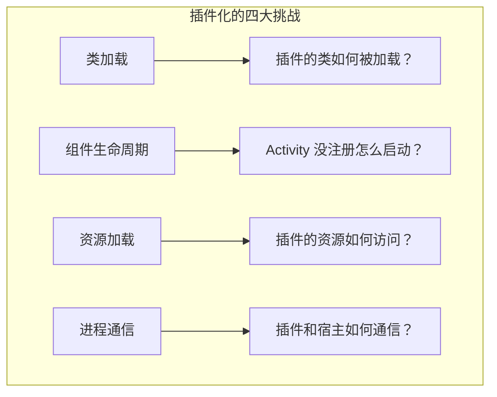
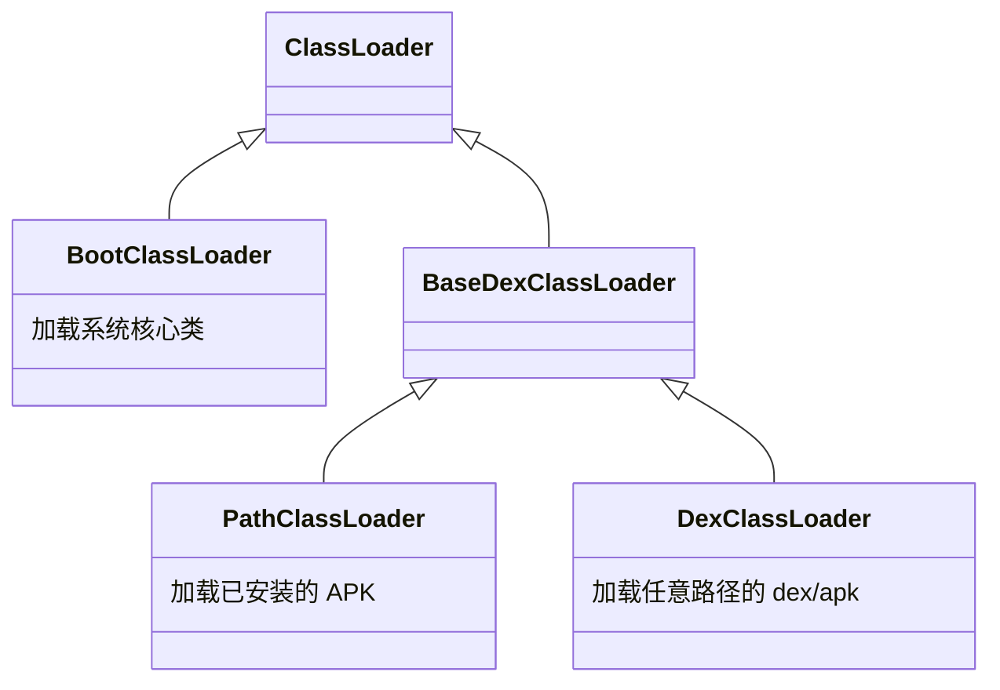
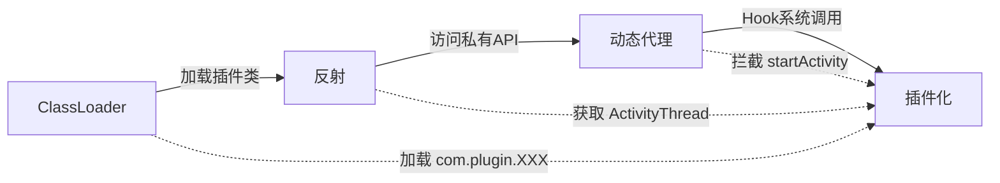
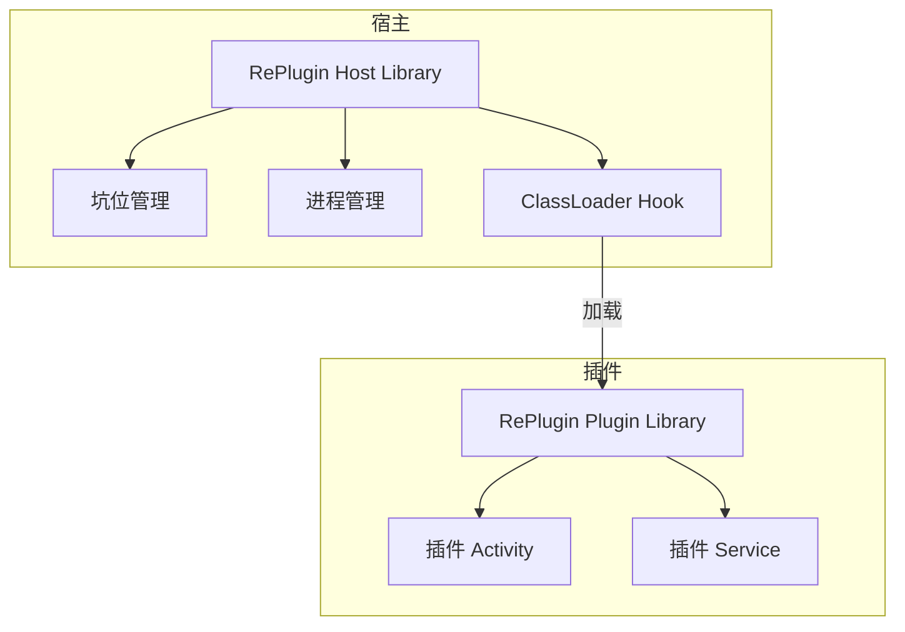
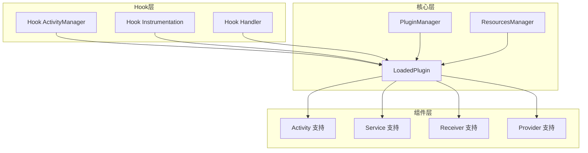
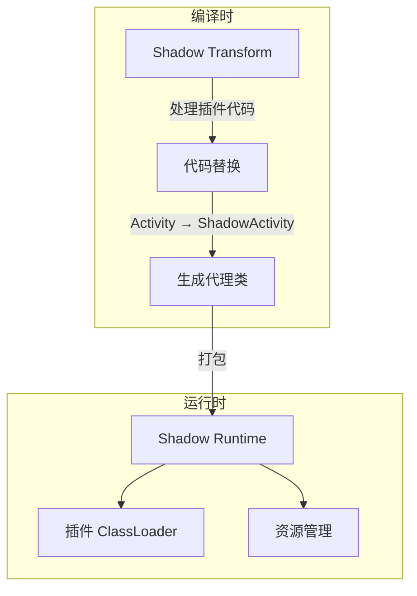
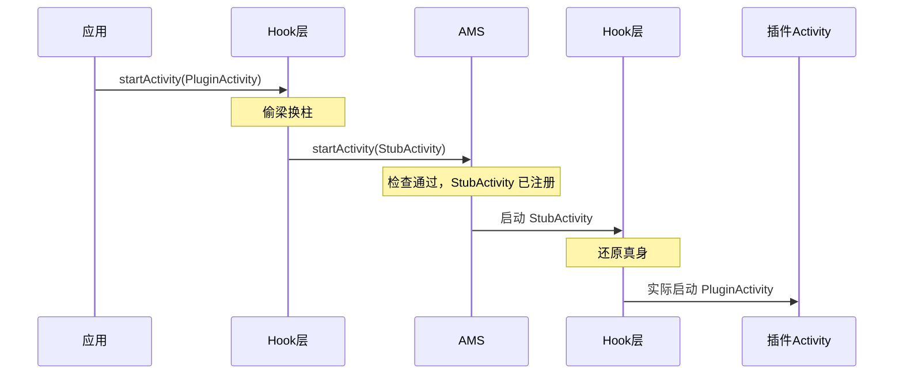

# 插件化基础篇

> 让 App 像浏览器一样，随时加载新"网页"

## 一、技术演进：插件化为什么会出现？

### 1.1 Android 应用的困境

想象你在开发一个超级 App（比如支付宝、微信），随着业务增长，你会遇到这些问题：

**问题一：App 越来越胖**
```
2015年：App 大小 20MB，用户勉强接受
2018年：App 大小 100MB，用户开始抱怨
2023年：App 大小 300MB+，用户：我手机内存不够了！
```

**问题二：65535 方法数限制**
```
Android 的 dex 文件有个硬限制：单个 dex 最多 65535 个方法
你的 App + 第三方库，很容易就超了
虽然有 MultiDex，但启动会变慢
```

**问题三：发版太慢**
```
发现 Bug → 修复 → 打包 → 提审 → 用户更新
最快也要 1-3 天，慢的话一周以上
紧急情况下，这个速度是不可接受的
```

**问题四：多团队协作地狱**
```
团队 A：我改了公共模块
团队 B：我也改了，合并冲突了
团队 C：你们都改了？我的代码被覆盖了！
```

### 1.2 插件化的解决思路

插件化的核心思想很简单：**把一个大 App 拆成 1 个宿主 + N 个插件**

```
传统 App：
┌─────────────────────────────────────┐
│              一个巨大的 APK           │
│  ┌─────┐ ┌─────┐ ┌─────┐ ┌─────┐   │
│  │首页  │ │支付  │ │社交  │ │游戏  │   │
│  └─────┘ └─────┘ └─────┘ └─────┘   │
└─────────────────────────────────────┘

插件化 App：
┌─────────────┐
│   宿主 APK   │  ← 只包含核心功能，体积小
│  ┌───────┐  │
│  │ 首页   │  │
│  └───────┘  │
└─────────────┘
      ↓ 动态加载
┌─────┐ ┌─────┐ ┌─────┐
│支付  │ │社交  │ │游戏  │  ← 按需下载的插件
└─────┘ └─────┘ └─────┘
```

### 1.3 插件化的发展历程

| 时期 | 代表框架 | 特点 |
|-----|---------|------|
| 2012-2014 | 早期探索 | 基于 Fragment 的伪插件化 |
| 2015 | DynamicLoadApk | 第一个开源框架，代理方案 |
| 2016 | DroidPlugin | 360 出品，Hook 方案 |
| 2017 | VirtualAPK、RePlugin | 滴滴、360，更成熟的方案 |
| 2019 | Shadow | 腾讯出品，零反射方案 |
| 2020+ | 逐渐式微 | Google 限制 + App Bundle 替代 |

> **为什么说"逐渐式微"？**
> - Android 9.0 开始限制私有 API 反射
> - Google Play 推出 App Bundle 动态下发
> - 国内应用商店也开始支持动态下发
> - 但在国内，插件化仍有大量应用场景

## 二、核心概念

### 2.1 术语解释

学插件化之前，先搞清楚这些术语：

| 术语 | 解释 | 类比 |
|-----|------|------|
| **宿主（Host）** | 主 App，提供插件运行环境 | 浏览器 |
| **插件（Plugin）** | 独立的功能模块，可动态加载 | 网页 |
| **占坑（Stub）** | 预先在 Manifest 注册的空壳组件 | 占座的书包 |
| **Hook** | 拦截系统调用，插入自定义逻辑 | 在路上设卡拦截 |
| **代理（Proxy）** | 用一个组件代替另一个组件工作 | 替身演员 |

### 2.2 插件化的核心挑战

为什么插件化这么难？因为 Android 系统有很多"规矩"：



**挑战一：类加载**
- 问题：Android 默认只加载 APK 内的类
- 解决：自定义 ClassLoader 加载插件的 dex

**挑战二：组件生命周期**
- 问题：四大组件必须在 Manifest 注册才能使用
- 解决：占坑 + Hook，欺骗系统

**挑战三：资源加载**
- 问题：插件的资源 ID 可能和宿主冲突
- 解决：创建独立的 AssetManager 或修改资源 ID

**挑战四：进程通信**
- 问题：插件可能运行在不同进程
- 解决：Binder 通信 + 进程管理

## 三、技术基础

### 3.1 ClassLoader：类加载器

这是插件化的**核心中的核心**，不懂 ClassLoader 就别学插件化。

**Android 的 ClassLoader 体系**：



**关键区别**：

| ClassLoader | 用途 | 能加载的路径 |
|-------------|------|-------------|
| PathClassLoader | 加载已安装的 App | 只能是 /data/app 下的 |
| DexClassLoader | 加载任意 dex | 任意路径（插件化的关键！） |

> **Android 8.0+ 的变化**：PathClassLoader 也能加载任意路径了，但为了兼容性，插件化框架通常还是用 DexClassLoader。

**加载插件类的基本代码**：

```kotlin
// 创建插件的 ClassLoader
// pluginPath: 插件 APK 的路径，如 /data/data/xxx/plugin.apk
// optimizedDir: dex 优化后的存放目录（Android 8.0 后可以传 null）
// libraryPath: 插件的 so 库路径
// parent: 父 ClassLoader，通常传宿主的 ClassLoader
val pluginClassLoader = DexClassLoader(
    pluginPath,
    optimizedDir,
    libraryPath,
    hostClassLoader  // 关键：设置宿主 ClassLoader 为 parent
)

// 加载插件中的类
val pluginClass = pluginClassLoader.loadClass("com.plugin.MainActivity")
```

### 3.2 反射：突破访问限制

反射是插件化的**瑞士军刀**，用来访问私有 API。

```kotlin
// 获取私有字段
fun getField(obj: Any, fieldName: String): Any? {
    val field = obj.javaClass.getDeclaredField(fieldName)
    field.isAccessible = true  // 突破 private 限制
    return field.get(obj)
}

// 调用私有方法
fun invokeMethod(obj: Any, methodName: String, vararg args: Any?): Any? {
    val method = obj.javaClass.getDeclaredMethod(methodName, *args.map { it?.javaClass }.toTypedArray())
    method.isAccessible = true
    return method.invoke(obj, *args)
}

// 实际应用：获取 ActivityThread 实例
// ActivityThread 是 App 进程的主线程管理类，但它是 @hide 的
val activityThreadClass = Class.forName("android.app.ActivityThread")
val currentActivityThreadMethod = activityThreadClass.getDeclaredMethod("currentActivityThread")
val activityThread = currentActivityThreadMethod.invoke(null)
```

> **Android 9.0+ 的限制**：Google 开始限制对私有 API 的反射访问，这也是为什么 Shadow 要做"零反射"方案。

### 3.3 动态代理：Hook 的基础

动态代理可以在**不修改原有代码**的情况下，拦截方法调用。

```kotlin
// 场景：拦截 startActivity 调用
// IActivityManager 是 AMS 的 Binder 代理接口

// 原始对象
val originalAms: IActivityManager = getOriginalAms()

// 创建代理对象
val proxyAms = Proxy.newProxyInstance(
    IActivityManager::class.java.classLoader,
    arrayOf(IActivityManager::class.java)
) { proxy, method, args ->
    // 拦截 startActivity 方法
    if (method.name == "startActivity") {
        // 在这里可以：
        // 1. 修改 Intent，把插件 Activity 替换成占坑 Activity
        // 2. 记录日志
        // 3. 做权限检查
        val intent = args?.find { it is Intent } as? Intent
        intent?.let { 
            // 替换成占坑 Activity
            replaceWithStubActivity(it) 
        }
    }
    // 调用原始方法
    method.invoke(originalAms, *args.orEmpty())
}

// 用代理对象替换原始对象
replaceAms(proxyAms)
```

### 3.4 三者的关系



## 四、主流框架介绍

### 4.1 框架对比总览

| 框架 | 公司 | 开源时间 | 核心方案 | 维护状态 |
|-----|------|---------|---------|---------|
| DynamicLoadApk | 任玉刚 | 2014 | 代理方案 | 停更 |
| DroidPlugin | 360 | 2015 | 大量 Hook | 停更 |
| Small | 个人 | 2015 | 少量 Hook | 停更 |
| VirtualAPK | 滴滴 | 2017 | Hook AMS | 停更 |
| RePlugin | 360 | 2017 | 最少 Hook | 活跃 |
| Shadow | 腾讯 | 2019 | 零反射 | 活跃 |

### 4.2 RePlugin：Hook 最少的方案

**设计理念**：能不 Hook 就不 Hook，用类加载方案解决大部分问题。

**核心特点**：
- 只 Hook 了一个点：ClassLoader
- 稳定性极高，兼容性好
- 360 手机卫士等亿级 App 验证

**架构图**：



**基本使用**：

```kotlin
// 1. 宿主 Application 初始化
class HostApplication : Application() {
    override fun attachBaseContext(base: Context) {
        super.attachBaseContext(base)
        // 初始化 RePlugin
        RePlugin.App.attachBaseContext(this)
    }
    
    override fun onCreate() {
        super.onCreate()
        RePlugin.App.onCreate()
    }
}

// 2. 安装插件
// pluginPath: 插件 APK 的本地路径
val pluginInfo = RePlugin.install(pluginPath)
if (pluginInfo != null) {
    // 安装成功，预加载插件（可选，加快后续启动速度）
    RePlugin.preload(pluginInfo)
}

// 3. 启动插件 Activity
// "plugin_name" 是插件的包名或别名
// "com.plugin.MainActivity" 是插件中 Activity 的全类名
val intent = RePlugin.createIntent("plugin_name", "com.plugin.MainActivity")
RePlugin.startActivity(context, intent)
```

### 4.3 VirtualAPK：Hook 方案的代表

**设计理念**：通过 Hook AMS 和 Instrumentation，实现完整的四大组件支持。

**核心特点**：
- 代码清晰，注释完善，适合学习
- 支持四大组件的完整生命周期
- 滴滴出行验证

**架构图**：



**基本使用**：

```kotlin
// 1. 宿主 Application 初始化
class HostApplication : Application() {
    override fun attachBaseContext(base: Context) {
        super.attachBaseContext(base)
        // 初始化 VirtualAPK
        PluginManager.getInstance(base).init()
    }
}

// 2. 加载插件
// pluginPath: 插件 APK 的本地路径
val pluginFile = File(pluginPath)
PluginManager.getInstance(context).loadPlugin(pluginFile)

// 3. 启动插件 Activity
// 直接用标准的 Intent 方式，VirtualAPK 会自动处理
val intent = Intent()
intent.setClassName("com.plugin.package", "com.plugin.MainActivity")
startActivity(intent)
```

### 4.4 Shadow：零反射的未来

**设计理念**：完全不使用反射访问私有 API，通过编译时处理实现插件化。

**核心特点**：
- 零反射，不受 Android 版本限制
- 编译时生成代理类
- 腾讯多款 App 验证

**为什么要零反射？**

```
Android 9.0 开始：
- 灰名单 API：警告，但能用
- 黑名单 API：直接抛异常

传统插件化框架大量使用反射访问私有 API
→ 每次 Android 升级都要适配
→ 随时可能被 Google 封杀

Shadow 的思路：
→ 既然不让反射，那就不反射
→ 用编译时处理代替运行时反射
```

**架构图**：



**核心思想**：

```kotlin
// 插件开发时，继承 Shadow 提供的基类
// 原本：class PluginActivity : Activity()
// Shadow：class PluginActivity : ShadowActivity()

// Shadow 在编译时会自动处理：
// 1. 把 Activity 的调用替换成 ShadowActivity
// 2. ShadowActivity 内部通过接口调用真正的 Activity
// 3. 真正的 Activity 是宿主提供的占坑 Activity

// 这样就完全不需要反射了！
```

### 4.5 如何选择？

| 场景 | 推荐 | 原因 |
|-----|------|------|
| 新项目，追求稳定 | Shadow | 零反射，面向未来 |
| 已有项目，快速接入 | RePlugin | 侵入性小，接入简单 |
| 学习原理 | VirtualAPK | 代码清晰，注释完善 |
| 需要完整四大组件 | VirtualAPK / Shadow | 支持最完整 |

## 五、Activity 插件化原理（入门版）

Activity 插件化是最复杂的，也是面试最常问的。这里先讲基本原理，详细内容在进阶篇。

### 5.1 核心问题

```
问题：插件的 Activity 没有在 Manifest 注册，怎么启动？

Android 系统规定：
1. startActivity() 时，AMS 会检查 Manifest
2. 如果 Activity 没注册，直接抛异常
3. 插件是动态下载的，不可能提前注册

怎么办？
```

### 5.2 解决方案：占坑 + 欺骗



**步骤详解**：

1. **占坑**：在宿主的 Manifest 预先注册一些空壳 Activity（StubActivity）
2. **欺骗 AMS**：启动插件 Activity 时，把 Intent 中的目标替换成 StubActivity
3. **还原真身**：AMS 检查通过后，在真正创建 Activity 前，把 StubActivity 换回插件 Activity

### 5.3 简化代码示例

```kotlin
// 第一步：在宿主 Manifest 注册占坑 Activity
// AndroidManifest.xml
// <activity android:name=".StubActivity" />

// 第二步：Hook startActivity，替换 Intent
// 这是简化版，实际框架的实现更复杂
class ActivityHook {
    
    fun hookStartActivity() {
        // 获取 ActivityManager 的代理对象
        // IActivityManager 是 AMS 在 App 进程的 Binder 代理
        val activityManagerClass = Class.forName("android.app.ActivityManager")
        val iActivityManagerSingletonField = activityManagerClass.getDeclaredField("IActivityManagerSingleton")
        iActivityManagerSingletonField.isAccessible = true
        val singleton = iActivityManagerSingletonField.get(null)
        
        // 获取原始的 IActivityManager
        val singletonClass = Class.forName("android.util.Singleton")
        val instanceField = singletonClass.getDeclaredField("mInstance")
        instanceField.isAccessible = true
        val originalAms = instanceField.get(singleton)
        
        // 创建代理
        val iActivityManagerInterface = Class.forName("android.app.IActivityManager")
        val proxyAms = Proxy.newProxyInstance(
            iActivityManagerInterface.classLoader,
            arrayOf(iActivityManagerInterface)
        ) { _, method, args ->
            if (method.name == "startActivity") {
                // 找到 Intent 参数
                args?.forEachIndexed { index, arg ->
                    if (arg is Intent) {
                        // 保存原始 Intent
                        val originalIntent = Intent(arg)
                        // 替换成占坑 Activity
                        arg.setClassName(context.packageName, "com.host.StubActivity")
                        // 把原始 Intent 存起来，后面要用
                        arg.putExtra("original_intent", originalIntent)
                    }
                }
            }
            method.invoke(originalAms, *args.orEmpty())
        }
        
        // 替换原始对象
        instanceField.set(singleton, proxyAms)
    }
}

// 第三步：Hook Handler，还原 Intent
// ActivityThread 内部用 Handler 处理 Activity 的创建
// 我们要在 Activity 创建前，把 Intent 换回来
class HandlerHook {
    
    fun hookHandler() {
        // 获取 ActivityThread
        val activityThreadClass = Class.forName("android.app.ActivityThread")
        val currentActivityThreadMethod = activityThreadClass.getDeclaredMethod("currentActivityThread")
        val activityThread = currentActivityThreadMethod.invoke(null)
        
        // 获取 mH（Handler）
        val mHField = activityThreadClass.getDeclaredField("mH")
        mHField.isAccessible = true
        val mH = mHField.get(activityThread) as Handler
        
        // 获取 mCallback
        val callbackField = Handler::class.java.getDeclaredField("mCallback")
        callbackField.isAccessible = true
        
        // 设置自定义 Callback
        callbackField.set(mH, Handler.Callback { msg ->
            // LAUNCH_ACTIVITY 消息
            if (msg.what == 100) {  // 实际值因版本而异
                // 从 msg.obj 中获取 Intent
                val intent = getIntentFromMessage(msg)
                // 还原原始 Intent
                val originalIntent = intent?.getParcelableExtra<Intent>("original_intent")
                if (originalIntent != null) {
                    // 把目标 Activity 换回插件的
                    intent.component = originalIntent.component
                }
            }
            false  // 返回 false，让原始 Handler 继续处理
        })
    }
}
```

> **注意**：上面的代码是简化版，实际的插件化框架要处理很多细节，比如不同 Android 版本的适配、多种启动模式、Intent 数据传递等。

## 六、横向对比

### 6.1 插件化 vs 热修复

| 对比项 | 插件化 | 热修复 |
|-------|-------|-------|
| 目的 | 动态添加功能 | 修复 Bug |
| 修改范围 | 整个模块 | 单个类/方法 |
| 用户感知 | 可能需要下载 | 无感知 |
| 技术复杂度 | 更高 | 相对简单 |
| 典型场景 | 电商 App 加载店铺插件 | 修复线上 Crash |

### 6.2 插件化 vs App Bundle

| 对比项 | 插件化 | App Bundle |
|-------|-------|-----------|
| 提供方 | 第三方框架 | Google 官方 |
| 分发方式 | 自己服务器 | Google Play |
| 国内可用性 | ✅ | ❌（需要 Google Play） |
| 技术风险 | 可能被系统限制 | 官方支持 |
| 灵活性 | 更高 | 受限于 Google 规则 |

### 6.3 各框架技术方案对比

| 框架 | 类加载方案 | Hook 点 | 资源方案 | 稳定性 |
|-----|-----------|---------|---------|-------|
| RePlugin | 自定义 ClassLoader | 仅 ClassLoader | 独立 AssetManager | ⭐⭐⭐⭐⭐ |
| VirtualAPK | 合并 dex | AMS + Instrumentation | 合并资源 | ⭐⭐⭐⭐ |
| Shadow | 自定义 ClassLoader | 零 Hook | 独立 AssetManager | ⭐⭐⭐⭐⭐ |
| DroidPlugin | 合并 dex | 大量 Hook | 独立 AssetManager | ⭐⭐⭐ |

## 七、边界认知

### 7.1 插件化的局限性

**技术层面**：
- Android 版本升级可能导致不兼容
- 私有 API 限制越来越严格
- 部分系统功能无法插件化（如 Widget、壁纸）

**业务层面**：
- 增加了架构复杂度
- 调试困难
- 插件管理成本

**政策层面**：
- Google Play 禁止动态下载可执行代码
- 国内部分应用商店也开始限制

### 7.2 什么情况下不该用插件化？

| 场景 | 建议 |
|-----|------|
| 小型 App | 不需要，增加复杂度 |
| 上架 Google Play | 不能用，违反政策 |
| 团队技术储备不足 | 谨慎使用，维护成本高 |
| 只需要修复 Bug | 用热修复更合适 |

### 7.3 替代方案

| 需求 | 替代方案 |
|-----|---------|
| 减小包体积 | App Bundle、按需下载资源 |
| 动态更新 | 热修复、H5/RN/Flutter |
| 多团队协作 | 组件化 + 私有 Maven |
| A/B 测试 | 远程配置 + Feature Flag |

## 八、面试检验

### 基础题（检验是否理解概念）

**Q1：什么是插件化？和热修复有什么区别？**

> **答案**：
> 
> 插件化是一种**动态加载技术**，可以在运行时加载未安装的 APK，实现功能的动态扩展。
> 
> 区别：
> - **目的不同**：插件化是添加新功能，热修复是修复 Bug
> - **粒度不同**：插件化是整个模块，热修复是单个类/方法
> - **复杂度不同**：插件化需要处理四大组件，热修复主要处理类加载

**Q2：插件化的核心技术有哪些？**

> **答案**：
> 
> 三大核心技术：
> 1. **ClassLoader**：加载插件的 dex 文件
> 2. **反射**：访问系统私有 API
> 3. **动态代理**：Hook 系统调用
> 
> 四大挑战：
> 1. 类加载：自定义 ClassLoader
> 2. 组件生命周期：占坑 + Hook
> 3. 资源加载：独立 AssetManager
> 4. 进程通信：Binder + 进程管理

**Q3：为什么插件的 Activity 可以启动？**

> **答案**：
> 
> 核心是"占坑 + 欺骗"：
> 1. 在宿主 Manifest 预先注册占坑 Activity
> 2. 启动插件 Activity 时，Hook startActivity，把目标替换成占坑 Activity
> 3. AMS 检查通过后，在创建 Activity 前，再把目标换回插件 Activity
> 
> 这样既骗过了 AMS 的检查，又能启动真正的插件 Activity。

**Q4：PathClassLoader 和 DexClassLoader 有什么区别？**

> **答案**：
> 
> 在 Android 8.0 之前：
> - PathClassLoader：只能加载已安装 APK 的 dex
> - DexClassLoader：可以加载任意路径的 dex
> 
> 在 Android 8.0 之后：
> - 两者功能基本一致，都可以加载任意路径
> - 但为了兼容性，插件化框架通常还是用 DexClassLoader

**Q5：主流插件化框架有哪些？各有什么特点？**

> **答案**：
> 
> | 框架 | 特点 |
> |-----|------|
> | RePlugin | Hook 最少，稳定性最高，360 出品 |
> | VirtualAPK | 代码清晰，适合学习，滴滴出品 |
> | Shadow | 零反射，面向未来，腾讯出品 |
> 
> 选择建议：
> - 追求稳定：RePlugin 或 Shadow
> - 学习原理：VirtualAPK
> - 面向未来：Shadow

---
_本文档将持续更新，添加更多相关内容_
