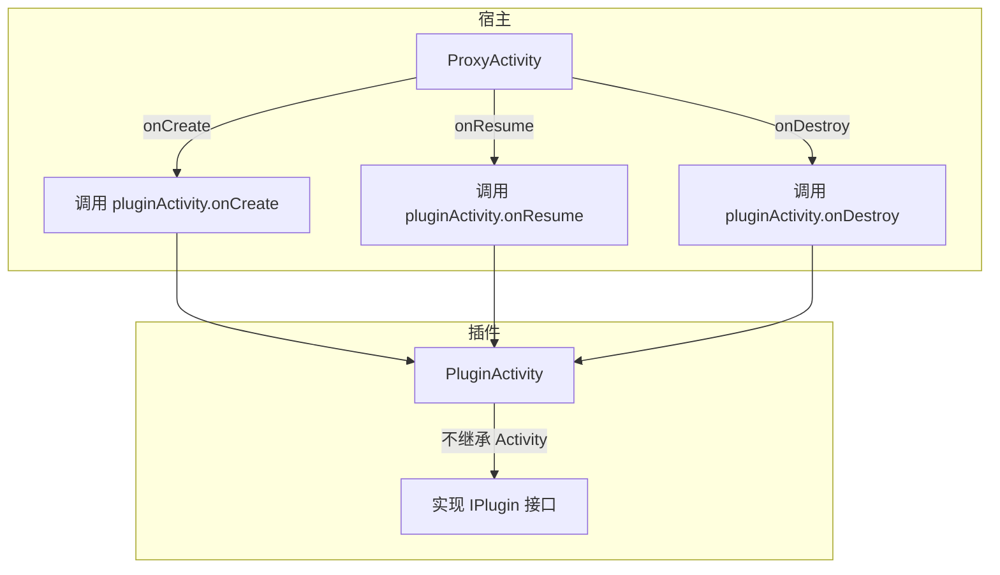
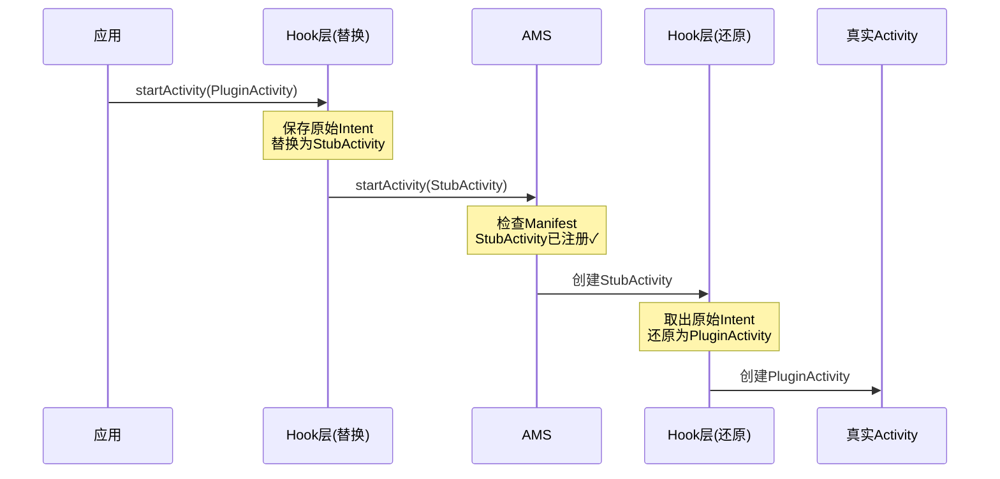
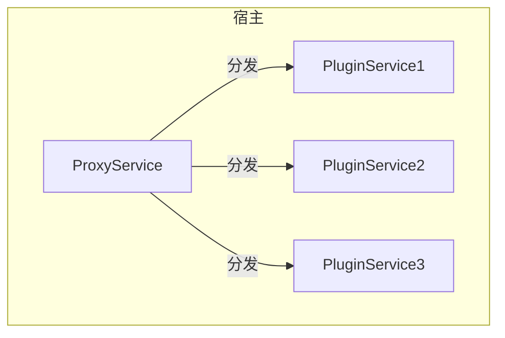

# 插件化进阶篇

> 四大组件插件化的完整方案 + 实战踩坑经验

## 一、Activity 插件化详解

Activity 插件化是最复杂的，因为 Activity 有复杂的生命周期和启动模式。

### 1.1 核心问题回顾

```
问题：插件 Activity 没有在 Manifest 注册，如何启动？

系统检查流程：
App 进程                           System 进程
    │                                  │
    │ startActivity(PluginActivity)    │
    │ ─────────────────────────────────>│
    │                                  │ 检查 Manifest
    │                                  │ 发现没注册
    │ <─────────────────────────────────│
    │ 抛出 ActivityNotFoundException   │
```

### 1.2 方案一：代理方案（ProxyActivity）

**核心思想**：用一个已注册的 ProxyActivity 代理所有插件 Activity 的生命周期。



**实现代码**：

```kotlin
// 1. 定义插件接口
// 插件 Activity 不能继承真正的 Activity，只能实现这个接口
interface IPluginActivity {
    fun attach(proxyActivity: Activity)
    fun onCreate(savedInstanceState: Bundle?)
    fun onResume()
    fun onPause()
    fun onDestroy()
    // ... 其他生命周期方法
}

// 2. 插件 Activity 实现（在插件中）
class PluginMainActivity : IPluginActivity {
    // 持有代理 Activity 的引用，用于调用系统 API
    private lateinit var proxy: Activity
    
    override fun attach(proxyActivity: Activity) {
        this.proxy = proxyActivity
    }
    
    override fun onCreate(savedInstanceState: Bundle?) {
        // 使用 proxy 来调用 setContentView 等方法
        proxy.setContentView(R.layout.activity_main)
    }
    
    override fun onResume() {
        // 业务逻辑
    }
    
    override fun onDestroy() {
        // 清理资源
    }
}

// 3. 代理 Activity（在宿主中，已注册）
class ProxyActivity : Activity() {
    private var pluginActivity: IPluginActivity? = null
    
    override fun onCreate(savedInstanceState: Bundle?) {
        super.onCreate(savedInstanceState)
        
        // 从 Intent 获取插件 Activity 类名
        val pluginClassName = intent.getStringExtra("plugin_class")
        
        // 用插件 ClassLoader 加载插件 Activity
        val pluginClass = pluginClassLoader.loadClass(pluginClassName)
        pluginActivity = pluginClass.newInstance() as IPluginActivity
        
        // 绑定代理
        pluginActivity?.attach(this)
        pluginActivity?.onCreate(savedInstanceState)
    }
    
    override fun onResume() {
        super.onResume()
        pluginActivity?.onResume()
    }
    
    override fun onDestroy() {
        pluginActivity?.onDestroy()
        super.onDestroy()
    }
}
```

**优缺点**：

| 优点 | 缺点 |
|-----|------|
| 实现简单 | 插件 Activity 不能继承 Activity |
| 不需要 Hook | 需要手动转发所有生命周期 |
| 兼容性好 | 插件开发体验差 |

> **代表框架**：DynamicLoadApk（2014年）

### 1.3 方案二：Hook AMS 方案

**核心思想**：Hook startActivity 流程，欺骗 AMS。



**Hook 点分析**：

| Hook 点 | 时机 | 作用 |
|--------|------|------|
| IActivityManager | startActivity 前 | 替换 Intent |
| ActivityThread.mH | handleLaunchActivity 前 | 还原 Intent |
| Instrumentation | newActivity 时 | 创建插件 Activity 实例 |

**完整实现**：

```kotlin
object ActivityHookManager {
    
    // Hook 点1：Hook IActivityManager，替换 Intent
    fun hookAMS(context: Context) {
        try {
            // 获取 ActivityManager 的 Singleton
            val activityManagerClass = Class.forName("android.app.ActivityManager")
            val singletonField = activityManagerClass.getDeclaredField("IActivityManagerSingleton")
            singletonField.isAccessible = true
            val singleton = singletonField.get(null)
            
            // 获取 Singleton 中的 mInstance（原始 IActivityManager）
            val singletonClass = Class.forName("android.util.Singleton")
            val mInstanceField = singletonClass.getDeclaredField("mInstance")
            mInstanceField.isAccessible = true
            val originalAms = mInstanceField.get(singleton)
            
            // 创建代理
            val iActivityManagerClass = Class.forName("android.app.IActivityManager")
            val proxy = Proxy.newProxyInstance(
                iActivityManagerClass.classLoader,
                arrayOf(iActivityManagerClass)
            ) { _, method, args ->
                if (method.name == "startActivity") {
                    // 找到 Intent 参数并替换
                    replaceIntentInArgs(context, args)
                }
                method.invoke(originalAms, *(args ?: emptyArray()))
            }
            
            // 替换原始对象
            mInstanceField.set(singleton, proxy)
        } catch (e: Exception) {
            e.printStackTrace()
        }
    }
    
    private fun replaceIntentInArgs(context: Context, args: Array<Any?>?) {
        args?.forEachIndexed { index, arg ->
            if (arg is Intent) {
                // 检查是否是插件 Activity
                val component = arg.component
                if (component != null && isPluginActivity(component.className)) {
                    // 保存原始 Intent
                    val originalIntent = Intent(arg)
                    // 替换为占坑 Activity
                    arg.setClassName(context.packageName, getStubActivity(arg))
                    // 存储原始 Intent
                    arg.putExtra(EXTRA_ORIGINAL_INTENT, originalIntent)
                }
            }
        }
    }
    
    // 根据启动模式选择不同的占坑 Activity
    private fun getStubActivity(intent: Intent): String {
        // 实际框架会根据 launchMode 选择不同的 Stub
        // standard -> StubActivity_Standard
        // singleTop -> StubActivity_SingleTop
        // singleTask -> StubActivity_SingleTask
        // singleInstance -> StubActivity_SingleInstance
        return "com.host.stub.StubActivity"
    }
    
    // Hook 点2：Hook Handler，还原 Intent
    fun hookHandler() {
        try {
            // 获取 ActivityThread
            val activityThreadClass = Class.forName("android.app.ActivityThread")
            val currentMethod = activityThreadClass.getDeclaredMethod("currentActivityThread")
            val activityThread = currentMethod.invoke(null)
            
            // 获取 mH
            val mHField = activityThreadClass.getDeclaredField("mH")
            mHField.isAccessible = true
            val mH = mHField.get(activityThread) as Handler
            
            // 设置 Callback
            val callbackField = Handler::class.java.getDeclaredField("mCallback")
            callbackField.isAccessible = true
            callbackField.set(mH, HookCallback(mH))
        } catch (e: Exception) {
            e.printStackTrace()
        }
    }
    
    private class HookCallback(private val originalHandler: Handler) : Handler.Callback {
        override fun handleMessage(msg: Message): Boolean {
            // Android 9.0+ 使用 EXECUTE_TRANSACTION
            when (msg.what) {
                159 -> handleExecuteTransaction(msg)  // EXECUTE_TRANSACTION
                100 -> handleLaunchActivity(msg)      // LAUNCH_ACTIVITY (旧版本)
            }
            return false
        }
        
        private fun handleLaunchActivity(msg: Message) {
            // 从 msg.obj 中获取 ActivityClientRecord
            val obj = msg.obj ?: return
            val intentField = obj.javaClass.getDeclaredField("intent")
            intentField.isAccessible = true
            val intent = intentField.get(obj) as? Intent ?: return
            
            // 还原原始 Intent
            restoreOriginalIntent(intent)
        }
        
        private fun handleExecuteTransaction(msg: Message) {
            // Android 9.0+ 的处理方式
            // ClientTransaction 中包含 LaunchActivityItem
            // 需要从中提取并还原 Intent
        }
        
        private fun restoreOriginalIntent(intent: Intent) {
            val originalIntent = intent.getParcelableExtra<Intent>(EXTRA_ORIGINAL_INTENT)
            if (originalIntent != null) {
                intent.component = originalIntent.component
            }
        }
    }
    
    // Hook 点3：Hook Instrumentation，创建插件 Activity 实例
    fun hookInstrumentation() {
        try {
            val activityThreadClass = Class.forName("android.app.ActivityThread")
            val currentMethod = activityThreadClass.getDeclaredMethod("currentActivityThread")
            val activityThread = currentMethod.invoke(null)
            
            val instrumentationField = activityThreadClass.getDeclaredField("mInstrumentation")
            instrumentationField.isAccessible = true
            val originalInstrumentation = instrumentationField.get(activityThread) as Instrumentation
            
            // 替换为自定义 Instrumentation
            val hookInstrumentation = HookInstrumentation(originalInstrumentation)
            instrumentationField.set(activityThread, hookInstrumentation)
        } catch (e: Exception) {
            e.printStackTrace()
        }
    }
    
    private class HookInstrumentation(
        private val original: Instrumentation
    ) : Instrumentation() {
        
        override fun newActivity(
            cl: ClassLoader,
            className: String,
            intent: Intent
        ): Activity {
            // 检查是否是插件 Activity
            val originalIntent = intent.getParcelableExtra<Intent>(EXTRA_ORIGINAL_INTENT)
            if (originalIntent != null) {
                val pluginClassName = originalIntent.component?.className
                if (pluginClassName != null) {
                    // 使用插件 ClassLoader 加载
                    val pluginClassLoader = getPluginClassLoader(originalIntent)
                    return pluginClassLoader.loadClass(pluginClassName)
                        .newInstance() as Activity
                }
            }
            return original.newActivity(cl, className, intent)
        }
    }
    
    private const val EXTRA_ORIGINAL_INTENT = "extra_original_intent"
}
```

**优缺点**：

| 优点 | 缺点 |
|-----|------|
| 插件 Activity 可以继承 Activity | 需要 Hook 多个点 |
| 开发体验好 | Android 版本适配复杂 |
| 支持完整生命周期 | 稳定性风险 |

> **代表框架**：VirtualAPK、DroidPlugin

### 1.4 方案三：Hook Instrumentation 方案

**核心思想**：只 Hook Instrumentation，简化 Hook 点。

```kotlin
class PluginInstrumentation(
    private val original: Instrumentation,
    private val context: Context
) : Instrumentation() {
    
    // Hook execStartActivity，替换 Intent
    fun execStartActivity(
        who: Context,
        contextThread: IBinder,
        token: IBinder,
        target: Activity?,
        intent: Intent,
        requestCode: Int,
        options: Bundle?
    ): ActivityResult? {
        // 替换 Intent
        if (isPluginActivity(intent)) {
            replaceWithStubIntent(intent)
        }
        
        // 调用原始方法（通过反射）
        return invokeOriginalExecStartActivity(
            who, contextThread, token, target, intent, requestCode, options
        )
    }
    
    // Hook newActivity，创建插件 Activity
    override fun newActivity(
        cl: ClassLoader,
        className: String,
        intent: Intent
    ): Activity {
        val originalIntent = intent.getParcelableExtra<Intent>(EXTRA_ORIGINAL_INTENT)
        if (originalIntent != null) {
            val pluginClassName = originalIntent.component?.className!!
            val pluginClassLoader = getPluginClassLoader(originalIntent)
            return pluginClassLoader.loadClass(pluginClassName).newInstance() as Activity
        }
        return original.newActivity(cl, className, intent)
    }
}
```

> **代表框架**：VirtualAPK（主要方案）

### 1.5 启动模式的处理

插件 Activity 可能有不同的启动模式，需要预埋多种占坑 Activity：

```xml
<!-- AndroidManifest.xml -->
<!-- Standard 模式的占坑 -->
<activity android:name=".stub.StubActivity_Standard_1" />
<activity android:name=".stub.StubActivity_Standard_2" />
<!-- ... 预埋多个，支持多个 Activity 同时存在 -->

<!-- SingleTop 模式的占坑 -->
<activity 
    android:name=".stub.StubActivity_SingleTop"
    android:launchMode="singleTop" />

<!-- SingleTask 模式的占坑 -->
<activity 
    android:name=".stub.StubActivity_SingleTask"
    android:launchMode="singleTask" />

<!-- SingleInstance 模式的占坑 -->
<activity 
    android:name=".stub.StubActivity_SingleInstance"
    android:launchMode="singleInstance" />
```

**坑位管理**：

```kotlin
object StubActivityManager {
    // 坑位池
    private val standardStubs = mutableListOf(
        "com.host.stub.StubActivity_Standard_1",
        "com.host.stub.StubActivity_Standard_2",
        // ...
    )
    
    // 已使用的坑位映射：插件Activity -> 占坑Activity
    private val usedStubs = mutableMapOf<String, String>()
    
    fun getStubActivity(pluginActivity: String, launchMode: Int): String {
        return when (launchMode) {
            ActivityInfo.LAUNCH_SINGLE_TOP -> "com.host.stub.StubActivity_SingleTop"
            ActivityInfo.LAUNCH_SINGLE_TASK -> "com.host.stub.StubActivity_SingleTask"
            ActivityInfo.LAUNCH_SINGLE_INSTANCE -> "com.host.stub.StubActivity_SingleInstance"
            else -> {
                // Standard 模式需要分配坑位
                usedStubs[pluginActivity] ?: run {
                    val stub = standardStubs.removeFirstOrNull()
                        ?: throw RuntimeException("No available stub activity")
                    usedStubs[pluginActivity] = stub
                    stub
                }
            }
        }
    }
    
    // Activity 销毁时回收坑位
    fun recycleStub(pluginActivity: String) {
        usedStubs.remove(pluginActivity)?.let {
            standardStubs.add(it)
        }
    }
}
```

## 二、Service 插件化

### 2.1 核心问题

Service 和 Activity 类似，也需要在 Manifest 注册。但 Service 有一些特殊性：

- Service 可以长时间运行
- 一个 Service 类只有一个实例
- Service 有 startService 和 bindService 两种启动方式

### 2.2 方案一：代理分发

**核心思想**：用一个 ProxyService 代理所有插件 Service。



**实现代码**：

```kotlin
// 代理 Service（在宿主中注册）
class ProxyService : Service() {
    // 管理所有插件 Service 实例
    private val pluginServices = mutableMapOf<String, Service>()
    
    override fun onStartCommand(intent: Intent?, flags: Int, startId: Int): Int {
        val pluginServiceName = intent?.getStringExtra("plugin_service")
        if (pluginServiceName != null) {
            // 获取或创建插件 Service
            val pluginService = getOrCreatePluginService(pluginServiceName)
            // 分发 onStartCommand
            pluginService.onStartCommand(intent, flags, startId)
        }
        return START_NOT_STICKY
    }
    
    override fun onBind(intent: Intent): IBinder? {
        val pluginServiceName = intent.getStringExtra("plugin_service")
        if (pluginServiceName != null) {
            val pluginService = getOrCreatePluginService(pluginServiceName)
            return pluginService.onBind(intent)
        }
        return null
    }
    
    private fun getOrCreatePluginService(className: String): Service {
        return pluginServices.getOrPut(className) {
            // 用插件 ClassLoader 加载并创建实例
            val pluginClass = pluginClassLoader.loadClass(className)
            val service = pluginClass.newInstance() as Service
            // 手动调用 attach 和 onCreate
            attachService(service)
            service.onCreate()
            service
        }
    }
    
    override fun onDestroy() {
        // 销毁所有插件 Service
        pluginServices.values.forEach { it.onDestroy() }
        pluginServices.clear()
        super.onDestroy()
    }
}

// 启动插件 Service
fun startPluginService(context: Context, pluginServiceClass: String) {
    val intent = Intent(context, ProxyService::class.java)
    intent.putExtra("plugin_service", pluginServiceClass)
    context.startService(intent)
}
```

### 2.3 方案二：占坑复用

**核心思想**：预埋多个占坑 Service，动态分配给插件 Service。

```xml
<!-- AndroidManifest.xml -->
<service android:name=".stub.StubService_1" />
<service android:name=".stub.StubService_2" />
<service android:name=".stub.StubService_3" />
<!-- 根据需要预埋更多 -->
```

```kotlin
object ServiceStubManager {
    private val stubPool = mutableListOf(
        "com.host.stub.StubService_1",
        "com.host.stub.StubService_2",
        "com.host.stub.StubService_3"
    )
    
    private val mapping = mutableMapOf<String, String>()
    
    fun getStubService(pluginService: String): String {
        return mapping.getOrPut(pluginService) {
            stubPool.removeFirstOrNull()
                ?: throw RuntimeException("No available stub service")
        }
    }
}
```

## 三、BroadcastReceiver 插件化

### 3.1 静态广播的问题

静态广播（在 Manifest 注册的）必须在安装时注册，插件无法使用。

### 3.2 解决方案：静态转动态

**核心思想**：解析插件 Manifest，把静态广播转为动态注册。

```kotlin
object ReceiverManager {
    private val receivers = mutableListOf<BroadcastReceiver>()
    
    fun registerPluginReceivers(context: Context, pluginApkPath: String) {
        // 解析插件的 AndroidManifest.xml
        val packageManager = context.packageManager
        val packageInfo = packageManager.getPackageArchiveInfo(
            pluginApkPath,
            PackageManager.GET_RECEIVERS
        )
        
        packageInfo?.receivers?.forEach { receiverInfo ->
            // 用插件 ClassLoader 加载 Receiver
            val receiverClass = pluginClassLoader.loadClass(receiverInfo.name)
            val receiver = receiverClass.newInstance() as BroadcastReceiver
            
            // 获取 IntentFilter
            val intentFilter = getIntentFilter(receiverInfo)
            
            // 动态注册
            context.registerReceiver(receiver, intentFilter)
            receivers.add(receiver)
        }
    }
    
    fun unregisterAll(context: Context) {
        receivers.forEach { context.unregisterReceiver(it) }
        receivers.clear()
    }
}
```

### 3.3 注意事项

| 问题 | 说明 |
|-----|------|
| 隐式广播限制 | Android 8.0+ 限制了大部分隐式广播的静态注册 |
| 进程问题 | 动态注册的广播只在注册的进程中有效 |
| 生命周期 | 需要在合适的时机注册和注销 |

## 四、ContentProvider 插件化

### 4.1 核心问题

ContentProvider 在 App 启动时就会被创建，而且通过 URI 访问，需要特殊处理。

### 4.2 解决方案：占坑 + URI 重定向

```kotlin
// 占坑 ContentProvider
class StubContentProvider : ContentProvider() {
    
    override fun query(
        uri: Uri,
        projection: Array<String>?,
        selection: String?,
        selectionArgs: Array<String>?,
        sortOrder: String?
    ): Cursor? {
        // 解析 URI，找到真正的插件 Provider
        val pluginProvider = getPluginProvider(uri)
        // 转换 URI
        val pluginUri = convertUri(uri)
        // 分发查询
        return pluginProvider?.query(pluginUri, projection, selection, selectionArgs, sortOrder)
    }
    
    override fun insert(uri: Uri, values: ContentValues?): Uri? {
        val pluginProvider = getPluginProvider(uri)
        val pluginUri = convertUri(uri)
        return pluginProvider?.insert(pluginUri, values)
    }
    
    // ... 其他方法类似
    
    private fun getPluginProvider(uri: Uri): ContentProvider? {
        // 从 URI 中解析插件信息
        // 例如：content://com.host.stub/plugin_name/real_path
        val pluginName = uri.pathSegments.firstOrNull() ?: return null
        return PluginManager.getProvider(pluginName)
    }
    
    private fun convertUri(uri: Uri): Uri {
        // 转换为插件的真实 URI
        // content://com.host.stub/plugin_name/real_path
        // -> content://com.plugin.provider/real_path
        return Uri.parse("content://com.plugin.provider/${uri.pathSegments.drop(1).joinToString("/")}")
    }
}
```

## 五、资源加载

### 5.1 资源加载的问题

```
问题1：插件的资源如何加载？
- 默认的 Resources 只能访问宿主的资源
- 插件的资源在独立的 APK 中

问题2：资源 ID 冲突
- 宿主和插件的资源 ID 可能相同
- 例如都有 R.layout.activity_main = 0x7f030001
```

### 5.2 方案一：独立 AssetManager

**核心思想**：为每个插件创建独立的 AssetManager 和 Resources。

```kotlin
object ResourcesManager {
    
    fun createPluginResources(context: Context, pluginApkPath: String): Resources {
        // 创建 AssetManager
        val assetManager = AssetManager::class.java.newInstance()
        
        // 添加插件 APK 路径
        // addAssetPath 是 @hide 方法，需要反射调用
        val addAssetPathMethod = AssetManager::class.java.getDeclaredMethod(
            "addAssetPath",
            String::class.java
        )
        addAssetPathMethod.isAccessible = true
        addAssetPathMethod.invoke(assetManager, pluginApkPath)
        
        // 创建 Resources
        return Resources(
            assetManager,
            context.resources.displayMetrics,
            context.resources.configuration
        )
    }
}

// 插件 Activity 使用独立的 Resources
class PluginActivity : Activity() {
    private lateinit var pluginResources: Resources
    
    override fun getResources(): Resources {
        return if (::pluginResources.isInitialized) {
            pluginResources
        } else {
            super.getResources()
        }
    }
    
    fun setPluginResources(resources: Resources) {
        this.pluginResources = resources
    }
}
```

### 5.3 方案二：合并资源

**核心思想**：把插件资源合并到宿主的 AssetManager 中。

```kotlin
object ResourcesMerger {
    
    fun mergePluginResources(context: Context, pluginApkPath: String) {
        // 获取宿主的 AssetManager
        val assetManager = context.resources.assets
        
        // 添加插件路径
        val addAssetPathMethod = AssetManager::class.java.getDeclaredMethod(
            "addAssetPath",
            String::class.java
        )
        addAssetPathMethod.isAccessible = true
        addAssetPathMethod.invoke(assetManager, pluginApkPath)
    }
}
```

**优缺点对比**：

| 方案 | 优点 | 缺点 |
|-----|------|------|
| 独立 AssetManager | 资源完全隔离，无冲突 | 需要处理 Context |
| 合并资源 | 实现简单 | 可能有资源 ID 冲突 |

### 5.4 资源 ID 冲突解决

**方案：修改插件的资源 ID 前缀**

```
正常的资源 ID 格式：0xPPTTNNNN
- PP：Package ID（宿主是 0x7f）
- TT：Type ID（layout、drawable 等）
- NNNN：Entry ID

解决方案：
- 修改插件的 Package ID
- 例如插件1用 0x71，插件2用 0x72
- 这样就不会和宿主的 0x7f 冲突
```

**Gradle 插件实现**：

```groovy
// 在插件项目的 build.gradle 中
android {
    aaptOptions {
        // 修改资源 ID 前缀
        additionalParameters '--package-id', '0x71'
    }
}
```

## 六、实战踩坑经验

### 6.1 常见问题及解决方案

| 问题 | 原因 | 解决方案 |
|-----|------|---------|
| ClassNotFoundException | ClassLoader 隔离 | 正确设置 parent ClassLoader |
| Resources$NotFoundException | 资源未加载 | 创建插件 Resources |
| Activity 启动失败 | 没有占坑或 Hook 失败 | 检查 Manifest 和 Hook 代码 |
| Service 无法绑定 | IBinder 跨进程问题 | 使用 AIDL 或代理方案 |
| 插件 Context 问题 | 使用了宿主 Context | 创建插件专属 Context |

### 6.2 Context 问题详解

```kotlin
// 问题：插件中获取的 Context 是宿主的
// 导致：getPackageName() 返回宿主包名，资源访问错误

// 解决：创建插件专属的 Context
class PluginContext(
    private val hostContext: Context,
    private val pluginResources: Resources,
    private val pluginClassLoader: ClassLoader,
    private val pluginPackageName: String
) : ContextWrapper(hostContext) {
    
    override fun getResources(): Resources = pluginResources
    
    override fun getClassLoader(): ClassLoader = pluginClassLoader
    
    override fun getPackageName(): String = pluginPackageName
    
    override fun getAssets(): AssetManager = pluginResources.assets
}
```

### 6.3 多进程问题

```kotlin
// 问题：插件可能需要运行在独立进程
// 但进程是在 Manifest 中声明的，插件无法动态声明

// 解决：预埋多进程占坑
// AndroidManifest.xml
// <activity android:name=".stub.StubActivity_Process1" android:process=":plugin1" />
// <activity android:name=".stub.StubActivity_Process2" android:process=":plugin2" />
// <service android:name=".stub.StubService_Process1" android:process=":plugin1" />

// 进程管理
object ProcessManager {
    private val processPool = mutableListOf(":plugin1", ":plugin2", ":plugin3")
    private val processMapping = mutableMapOf<String, String>()
    
    fun getProcess(pluginName: String): String {
        return processMapping.getOrPut(pluginName) {
            processPool.removeFirstOrNull()
                ?: throw RuntimeException("No available process")
        }
    }
}
```

### 6.4 Android 版本适配

| Android 版本 | 变化 | 适配方案 |
|-------------|------|---------|
| 7.0 | 私有目录访问限制 | 使用 FileProvider |
| 8.0 | 后台 Service 限制 | 使用 JobScheduler |
| 9.0 | 私有 API 限制 | 使用 Shadow 或绕过方案 |
| 10.0 | 分区存储 | 适配 Scoped Storage |
| 11.0 | 软件包可见性 | 声明 queries |

### 6.5 大厂实践经验

**360 RePlugin 经验**：
- Hook 越少越稳定
- 只 Hook ClassLoader，其他用类加载方案解决
- 亿级用户验证

**滴滴 VirtualAPK 经验**：
- 文档和注释很重要
- 开源后维护成本高
- 已停止维护，但代码值得学习

**腾讯 Shadow 经验**：
- 零反射是未来方向
- 编译时处理代替运行时 Hook
- 持续维护，推荐使用

## 七、边界认知

### 7.1 插件化的局限性

**技术局限**：

| 限制 | 说明 |
|-----|------|
| 系统组件 | Widget、壁纸、输入法等无法插件化 |
| 系统权限 | 插件无法申请新权限 |
| Native 层 | so 库的加载和版本管理复杂 |
| 多进程 | 进程数量受限于预埋 |

**业务局限**：

| 限制 | 说明 |
|-----|------|
| 调试困难 | 断点、日志都比较麻烦 |
| 包管理 | 插件版本管理复杂 |
| 安全风险 | 动态加载可能被恶意利用 |

### 7.2 什么时候不该用插件化？

| 场景 | 原因 | 替代方案 |
|-----|------|---------|
| 小型 App | 增加复杂度，得不偿失 | 正常开发 |
| 上架 Google Play | 违反政策 | App Bundle |
| 只需要修 Bug | 杀鸡用牛刀 | 热修复 |
| 团队技术储备不足 | 维护成本高 | 组件化 |

## 八、面试检验

### 进阶题（检验是否有实战能力）

**Q1：Activity 插件化有哪些方案？各有什么优缺点？**

> **答案**：
> 
> 三种主要方案：
> 
> 1. **代理方案**
>    - 原理：用 ProxyActivity 代理插件 Activity 的生命周期
>    - 优点：实现简单，兼容性好
>    - 缺点：插件 Activity 不能继承 Activity，开发体验差
> 
> 2. **Hook AMS 方案**
>    - 原理：Hook startActivity，欺骗 AMS
>    - 优点：插件 Activity 可以继承 Activity
>    - 缺点：Hook 点多，版本适配复杂
> 
> 3. **Hook Instrumentation 方案**
>    - 原理：只 Hook Instrumentation
>    - 优点：Hook 点少，相对稳定
>    - 缺点：仍需要版本适配

**Q2：如何解决资源 ID 冲突？**

> **答案**：
> 
> 两种方案：
> 
> 1. **独立 AssetManager**
>    - 为每个插件创建独立的 AssetManager 和 Resources
>    - 资源完全隔离，不会冲突
>    - 需要处理 Context 问题
> 
> 2. **修改资源 ID 前缀**
>    - 修改插件的 Package ID（默认是 0x7f）
>    - 例如插件用 0x71、0x72 等
>    - 通过 aapt 的 --package-id 参数实现

**Q3：插件化如何处理四大组件的生命周期？**

> **答案**：
> 
> | 组件 | 方案 |
> |-----|------|
> | Activity | 占坑 + Hook，欺骗 AMS |
> | Service | 代理分发或占坑复用 |
> | BroadcastReceiver | 静态转动态注册 |
> | ContentProvider | 占坑 + URI 重定向 |
> 
> 核心思想都是"欺骗系统"：让系统以为在操作已注册的组件，实际上操作的是插件组件。

**Q4：为什么 Shadow 要做零反射？**

> **答案**：
> 
> 1. **Android 9.0+ 的限制**
>    - Google 开始限制对私有 API 的反射访问
>    - 灰名单 API 会警告，黑名单 API 直接抛异常
> 
> 2. **传统方案的问题**
>    - 大量使用反射访问私有 API
>    - 每次 Android 升级都要适配
>    - 随时可能被 Google 封杀
> 
> 3. **Shadow 的解决方案**
>    - 编译时处理代替运行时反射
>    - 插件 Activity 继承 ShadowActivity
>    - 通过接口调用真正的 Activity
>    - 完全不依赖私有 API

**Q5：大型 App 的插件化架构是怎样的？**

> **答案**：
> 
> 以支付宝为例：
> 
> ```
> 宿主 App（核心框架）
> ├── 插件管理器（下载、安装、加载）
> ├── 路由系统（页面跳转）
> ├── 通信框架（插件间通信）
> └── 基础服务（网络、存储、日志）
> 
> 插件（业务模块）
> ├── 首页插件
> ├── 支付插件
> ├── 理财插件
> ├── 生活服务插件
> └── ...
> ```
> 
> 关键设计：
> - 插件按需下载，减小初始包体积
> - 插件独立开发、独立发布
> - 统一的路由和通信机制
> - 完善的插件版本管理

---
_本文档将持续更新，添加更多相关内容_
