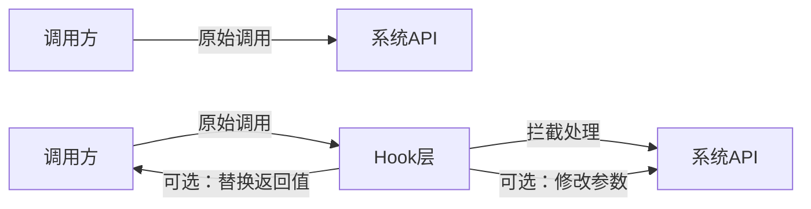
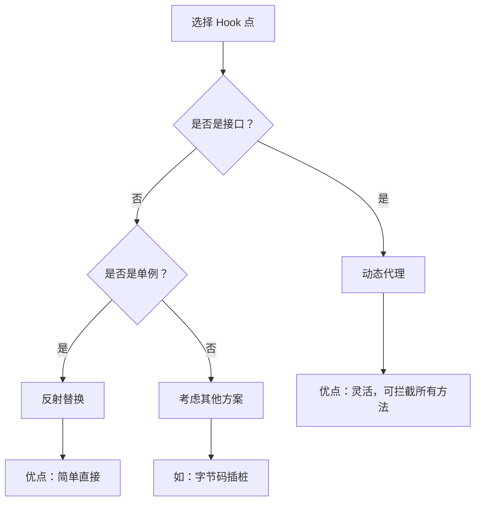
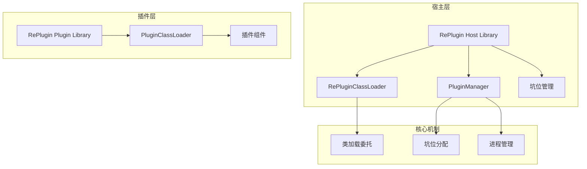
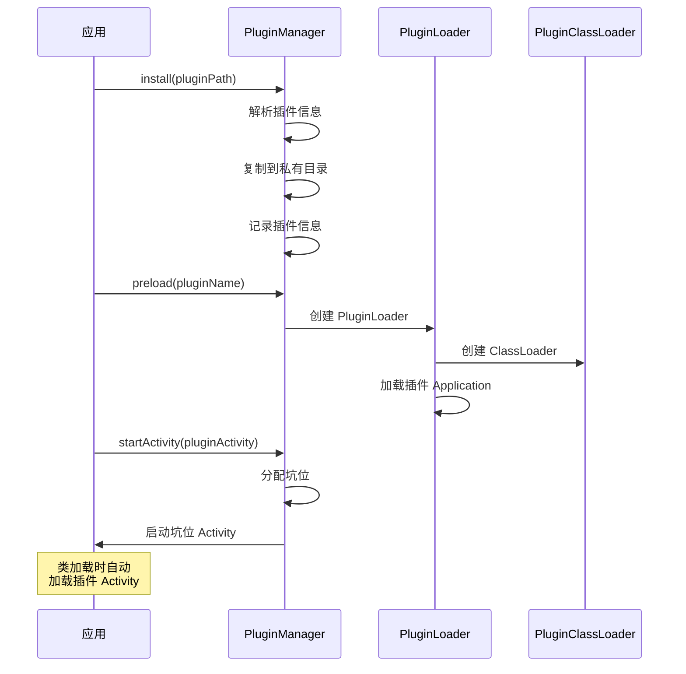
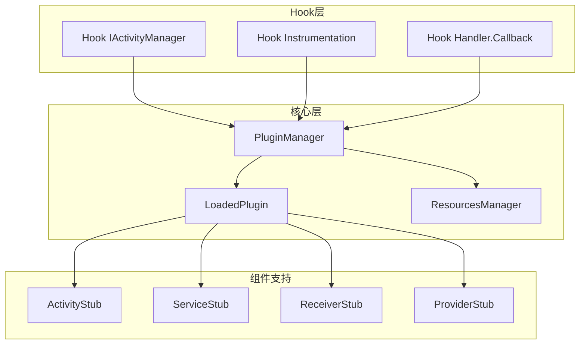
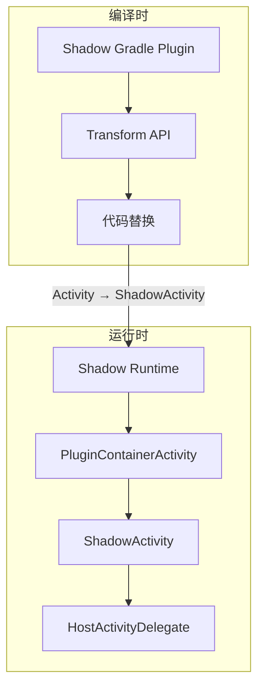

# 插件化源码篇

> 深入框架源码，理解设计哲学

## 一、Hook 机制详解

### 1.1 什么是 Hook？

**一句话理解**：Hook 就像在高速公路上设卡拦截，所有经过的车辆都要接受检查，你可以放行、修改、甚至替换。



### 1.2 Hook 的三种方式

| 方式 | 原理 | 适用场景 | 代表 |
|-----|------|---------|------|
| 静态代理 | 手动编写代理类 | 接口明确，方法少 | 简单场景 |
| 动态代理 | 运行时生成代理类 | 接口方法多 | Hook AMS |
| 反射替换 | 直接替换对象引用 | 非接口类型 | Hook Handler |

### 1.3 动态代理详解

**原理**：JDK 动态代理在运行时生成一个实现了指定接口的代理类。

```kotlin
// 动态代理的核心 API
val proxy = Proxy.newProxyInstance(
    classLoader,      // 类加载器
    interfaces,       // 要代理的接口数组
    invocationHandler // 调用处理器
)

// InvocationHandler 接口
interface InvocationHandler {
    fun invoke(
        proxy: Any,       // 代理对象本身
        method: Method,   // 被调用的方法
        args: Array<Any>? // 方法参数
    ): Any?
}
```

**实际应用：Hook IActivityManager**

```kotlin
// IActivityManager 是一个接口，适合用动态代理
class AMSInvocationHandler(
    private val original: Any  // 原始的 IActivityManager
) : InvocationHandler {
    
    override fun invoke(proxy: Any, method: Method, args: Array<Any>?): Any? {
        // 拦截 startActivity 方法
        if (method.name == "startActivity") {
            Log.d("Hook", "拦截到 startActivity 调用")
            
            // 修改参数
            args?.let { modifyIntent(it) }
            
            // 可以选择：
            // 1. 调用原始方法
            // 2. 返回自定义结果
            // 3. 抛出异常阻止调用
        }
        
        // 调用原始方法
        return method.invoke(original, *(args ?: emptyArray()))
    }
}
```

### 1.4 反射替换详解

**原理**：通过反射获取私有字段，直接替换对象引用。

```kotlin
// 反射替换的核心步骤
// 1. 获取目标类
val targetClass = Class.forName("android.app.ActivityThread")

// 2. 获取目标字段
val targetField = targetClass.getDeclaredField("mInstrumentation")
targetField.isAccessible = true  // 突破 private 限制

// 3. 获取目标对象
val activityThread = getActivityThread()

// 4. 获取原始值
val originalInstrumentation = targetField.get(activityThread)

// 5. 创建替换对象
val hookInstrumentation = HookInstrumentation(originalInstrumentation)

// 6. 替换
targetField.set(activityThread, hookInstrumentation)
```

### 1.5 Hook 点的选择原则



**好的 Hook 点特征**：
- 是单例或静态字段（容易获取和替换）
- 调用链的关键节点（一个点拦截多种情况）
- 接口类型（方便用动态代理）
- 稳定性好（不容易随版本变化）

## 二、RePlugin 源码分析

### 2.1 设计哲学

**核心理念**：能不 Hook 就不 Hook，用类加载方案解决问题。

```
传统方案：Hook 10+ 个点
RePlugin：只 Hook 1 个点（ClassLoader）

为什么？
- Hook 越多，兼容性越差
- Hook 越多，稳定性越低
- 类加载方案更优雅
```

### 2.2 架构总览



### 2.3 类加载方案

**核心思想**：替换 App 的 ClassLoader，在加载类时判断是否是插件类。

```kotlin
// RePlugin 的 ClassLoader 替换
// 位置：RePlugin.App.attachBaseContext()

class RePluginClassLoader(
    private val originalClassLoader: ClassLoader
) : ClassLoader(originalClassLoader.parent) {
    
    override fun loadClass(name: String, resolve: Boolean): Class<*> {
        // 1. 先尝试从插件加载
        val pluginClass = tryLoadFromPlugin(name)
        if (pluginClass != null) {
            return pluginClass
        }
        
        // 2. 从原始 ClassLoader 加载
        return originalClassLoader.loadClass(name)
    }
    
    private fun tryLoadFromPlugin(name: String): Class<*>? {
        // 遍历所有已加载的插件
        PluginManager.getLoadedPlugins().forEach { plugin ->
            try {
                return plugin.classLoader.loadClass(name)
            } catch (e: ClassNotFoundException) {
                // 这个插件没有这个类，继续找下一个
            }
        }
        return null
    }
}
```

### 2.4 坑位管理

**为什么需要坑位？**

```
问题：插件 Activity 没有在 Manifest 注册
解决：预先注册一批"占坑" Activity

但是：
- 不同启动模式需要不同的坑
- 不同进程需要不同的坑
- 多个 Activity 同时存在需要多个坑
```

**RePlugin 的坑位设计**：

```xml
<!-- AndroidManifest.xml 中预埋的坑位 -->
<!-- 主进程 Standard 模式 -->
<activity android:name=".loader.a.ActivityN1STPN0" />
<activity android:name=".loader.a.ActivityN1STPN1" />
<!-- ... -->

<!-- 主进程 SingleTop 模式 -->
<activity 
    android:name=".loader.a.ActivityN1STPN0" 
    android:launchMode="singleTop" />

<!-- 主进程 SingleTask 模式 -->
<activity 
    android:name=".loader.a.ActivityN1TKPN0" 
    android:launchMode="singleTask" />

<!-- 子进程的坑位 -->
<activity 
    android:name=".loader.a.ActivityP1STPN0" 
    android:process=":p1" />
```

**坑位分配算法**：

```kotlin
// 简化版坑位分配
object PitManager {
    // 坑位池：进程 -> 启动模式 -> 可用坑位列表
    private val pitPool = mutableMapOf<String, MutableMap<Int, MutableList<String>>>()
    
    // 已分配：插件Activity -> 坑位
    private val allocated = mutableMapOf<String, String>()
    
    fun allocatePit(
        pluginActivity: String,
        launchMode: Int,
        process: String
    ): String {
        // 检查是否已分配
        allocated[pluginActivity]?.let { return it }
        
        // 从池中获取
        val pit = pitPool[process]?.get(launchMode)?.removeFirstOrNull()
            ?: throw RuntimeException("No available pit")
        
        allocated[pluginActivity] = pit
        return pit
    }
    
    fun recyclePit(pluginActivity: String) {
        // Activity 销毁时回收坑位
        allocated.remove(pluginActivity)?.let { pit ->
            // 归还到池中
            returnToPool(pit)
        }
    }
}
```

### 2.5 插件加载流程



### 2.6 设计亮点

| 亮点 | 说明 |
|-----|------|
| 最少 Hook | 只 Hook ClassLoader，稳定性极高 |
| 坑位复用 | 坑位可回收，减少预埋数量 |
| 进程管理 | 支持多进程，进程可复用 |
| 热更新 | 支持插件热更新 |

## 三、VirtualAPK 源码分析

### 3.1 设计哲学

**核心理念**：通过 Hook 实现完整的四大组件支持，代码清晰易懂。

```
VirtualAPK 的目标：
- 让插件开发和普通开发一样
- 插件 Activity 可以继承 Activity
- 支持完整的生命周期
- 支持所有启动模式
```

### 3.2 架构总览



### 3.3 Hook 实现

**Hook IActivityManager**：

```kotlin
// 位置：VAInstrumentation.java
// 作用：拦截 startActivity，替换 Intent

class VAInstrumentation(
    private val original: Instrumentation
) : Instrumentation() {
    
    // 拦截 execStartActivity
    fun execStartActivity(
        who: Context,
        contextThread: IBinder,
        token: IBinder,
        target: Activity?,
        intent: Intent,
        requestCode: Int,
        options: Bundle?
    ): ActivityResult? {
        // 1. 检查是否是插件 Activity
        val component = intent.component
        if (component != null) {
            val plugin = PluginManager.getInstance(who)
                .getLoadedPlugin(component)
            
            if (plugin != null) {
                // 2. 替换为占坑 Activity
                intent.putExtra(EXTRA_TARGET_INTENT, intent.clone() as Intent)
                intent.component = ComponentName(
                    who.packageName,
                    getStubActivity(intent, plugin)
                )
            }
        }
        
        // 3. 调用原始方法
        return original.execStartActivity(
            who, contextThread, token, target, intent, requestCode, options
        )
    }
    
    // 拦截 newActivity
    override fun newActivity(
        cl: ClassLoader,
        className: String,
        intent: Intent
    ): Activity {
        // 1. 检查是否是占坑 Activity
        val targetIntent = intent.getParcelableExtra<Intent>(EXTRA_TARGET_INTENT)
        
        if (targetIntent != null) {
            // 2. 获取真正的插件 Activity 类名
            val targetClassName = targetIntent.component?.className
            
            // 3. 使用插件 ClassLoader 创建实例
            val plugin = PluginManager.getInstance(context)
                .getLoadedPlugin(targetIntent.component)
            
            return plugin.classLoader
                .loadClass(targetClassName)
                .newInstance() as Activity
        }
        
        return original.newActivity(cl, className, intent)
    }
}
```

### 3.4 LoadedPlugin 分析

**LoadedPlugin 是什么？**

```kotlin
// LoadedPlugin 代表一个已加载的插件
// 包含插件的所有信息和资源

class LoadedPlugin(
    private val hostContext: Context,
    private val apkFile: File
) {
    // 插件包信息
    lateinit var packageInfo: PackageInfo
    
    // 插件 ClassLoader
    lateinit var classLoader: DexClassLoader
    
    // 插件资源
    lateinit var resources: Resources
    
    // 插件 Application
    var application: Application? = null
    
    // 四大组件信息
    val activities = mutableMapOf<ComponentName, ActivityInfo>()
    val services = mutableMapOf<ComponentName, ServiceInfo>()
    val receivers = mutableMapOf<ComponentName, ActivityInfo>()
    val providers = mutableMapOf<String, ProviderInfo>()
    
    init {
        // 解析插件 APK
        parseApk()
        // 创建 ClassLoader
        createClassLoader()
        // 创建 Resources
        createResources()
        // 创建 Application
        createApplication()
    }
    
    private fun parseApk() {
        val pm = hostContext.packageManager
        packageInfo = pm.getPackageArchiveInfo(
            apkFile.absolutePath,
            PackageManager.GET_ACTIVITIES or
            PackageManager.GET_SERVICES or
            PackageManager.GET_RECEIVERS or
            PackageManager.GET_PROVIDERS
        )!!
        
        // 解析四大组件
        packageInfo.activities?.forEach {
            activities[ComponentName(packageInfo.packageName, it.name)] = it
        }
        // ... 其他组件类似
    }
    
    private fun createClassLoader() {
        classLoader = DexClassLoader(
            apkFile.absolutePath,
            hostContext.getDir("dex", Context.MODE_PRIVATE).absolutePath,
            apkFile.parent,
            hostContext.classLoader  // 宿主 ClassLoader 作为 parent
        )
    }
    
    private fun createResources() {
        val assetManager = AssetManager::class.java.newInstance()
        val addAssetPath = AssetManager::class.java
            .getDeclaredMethod("addAssetPath", String::class.java)
        addAssetPath.isAccessible = true
        addAssetPath.invoke(assetManager, apkFile.absolutePath)
        
        resources = Resources(
            assetManager,
            hostContext.resources.displayMetrics,
            hostContext.resources.configuration
        )
    }
}
```

### 3.5 资源处理

**VirtualAPK 的资源方案**：合并资源到宿主。

```kotlin
// 位置：ResourcesManager.java

object ResourcesManager {
    
    fun createResources(hostContext: Context, apkPath: String): Resources {
        // 方案1：合并到宿主（默认）
        return mergeResources(hostContext, apkPath)
        
        // 方案2：独立资源（可选）
        // return createStandaloneResources(hostContext, apkPath)
    }
    
    private fun mergeResources(context: Context, apkPath: String): Resources {
        // 获取宿主的 AssetManager
        val assetManager = context.resources.assets
        
        // 添加插件路径
        val addAssetPath = AssetManager::class.java
            .getDeclaredMethod("addAssetPath", String::class.java)
        addAssetPath.isAccessible = true
        addAssetPath.invoke(assetManager, apkPath)
        
        // 返回宿主的 Resources（已包含插件资源）
        return context.resources
    }
}
```

### 3.6 设计亮点

| 亮点 | 说明 |
|-----|------|
| 代码清晰 | 注释完善，适合学习 |
| 完整支持 | 四大组件都支持 |
| 资源合并 | 简化资源访问 |
| 文档完善 | Wiki 详细 |

## 四、Shadow 源码分析

### 4.1 设计哲学

**核心理念**：零反射，面向未来。

```
为什么要零反射？

Android 9.0 开始：
- 灰名单 API：警告日志
- 黑名单 API：直接崩溃

传统插件化框架：
- 大量反射私有 API
- 每次 Android 升级都要适配
- 随时可能被封杀

Shadow 的思路：
- 完全不用反射
- 编译时处理
- 一劳永逸
```

### 4.2 核心思想

**编译时替换**：把插件代码中的 Activity 替换成 ShadowActivity。

```kotlin
// 插件开发时写的代码
class PluginActivity : Activity() {
    override fun onCreate(savedInstanceState: Bundle?) {
        super.onCreate(savedInstanceState)
        setContentView(R.layout.activity_main)
    }
}

// Shadow 编译时自动转换成
class PluginActivity : ShadowActivity() {
    override fun onCreate(savedInstanceState: Bundle?) {
        super.onCreate(savedInstanceState)
        setContentView(R.layout.activity_main)
    }
}

// ShadowActivity 是 Shadow 提供的基类
// 它内部通过接口调用真正的 Activity
```

### 4.3 架构总览



### 4.4 编译时处理

**Transform 处理流程**：

```kotlin
// Shadow Gradle Plugin 的 Transform
class ShadowTransform : Transform() {
    
    override fun transform(transformInvocation: TransformInvocation) {
        transformInvocation.inputs.forEach { input ->
            input.directoryInputs.forEach { dirInput ->
                // 处理目录中的 class 文件
                processDirectory(dirInput.file)
            }
            input.jarInputs.forEach { jarInput ->
                // 处理 jar 中的 class 文件
                processJar(jarInput.file)
            }
        }
    }
    
    private fun processClass(classFile: File) {
        // 使用 ASM 修改字节码
        val reader = ClassReader(classFile.readBytes())
        val writer = ClassWriter(reader, ClassWriter.COMPUTE_MAXS)
        val visitor = ShadowClassVisitor(writer)
        reader.accept(visitor, 0)
        
        // 写回修改后的 class
        classFile.writeBytes(writer.toByteArray())
    }
}

// ASM ClassVisitor
class ShadowClassVisitor(cv: ClassVisitor) : ClassVisitor(ASM7, cv) {
    
    override fun visit(
        version: Int,
        access: Int,
        name: String,
        signature: String?,
        superName: String?,
        interfaces: Array<String>?
    ) {
        // 替换父类
        val newSuperName = when (superName) {
            "android/app/Activity" -> "com/tencent/shadow/core/runtime/ShadowActivity"
            "android/app/Service" -> "com/tencent/shadow/core/runtime/ShadowService"
            else -> superName
        }
        super.visit(version, access, name, signature, newSuperName, interfaces)
    }
}
```

### 4.5 运行时机制

**ShadowActivity 的实现**：

```kotlin
// ShadowActivity 是插件 Activity 的基类
// 它不是真正的 Activity，而是一个普通类

open class ShadowActivity : ShadowContext() {
    // 持有真正 Activity 的委托
    private var hostActivityDelegate: HostActivityDelegate? = null
    
    // 绑定真正的 Activity
    fun setHostActivityDelegate(delegate: HostActivityDelegate) {
        this.hostActivityDelegate = delegate
    }
    
    // 所有 Activity 方法都委托给真正的 Activity
    open fun onCreate(savedInstanceState: Bundle?) {
        // 空实现，子类重写
    }
    
    fun setContentView(layoutResId: Int) {
        hostActivityDelegate?.setContentView(layoutResId)
    }
    
    fun startActivity(intent: Intent) {
        hostActivityDelegate?.startActivity(intent)
    }
    
    fun finish() {
        hostActivityDelegate?.finish()
    }
    
    // ... 其他方法
}

// PluginContainerActivity 是真正的 Activity（在宿主注册）
class PluginContainerActivity : Activity(), HostActivityDelegate {
    private var pluginActivity: ShadowActivity? = null
    
    override fun onCreate(savedInstanceState: Bundle?) {
        super.onCreate(savedInstanceState)
        
        // 创建插件 Activity 实例
        val pluginClassName = intent.getStringExtra("plugin_activity")
        pluginActivity = pluginClassLoader
            .loadClass(pluginClassName)
            .newInstance() as ShadowActivity
        
        // 绑定委托
        pluginActivity?.setHostActivityDelegate(this)
        
        // 调用插件的 onCreate
        pluginActivity?.onCreate(savedInstanceState)
    }
    
    override fun onResume() {
        super.onResume()
        pluginActivity?.onResume()
    }
    
    // HostActivityDelegate 实现
    override fun setContentView(layoutResId: Int) {
        super.setContentView(layoutResId)
    }
}
```

### 4.6 设计亮点

| 亮点 | 说明 |
|-----|------|
| 零反射 | 不依赖私有 API，面向未来 |
| 编译时处理 | 运行时开销小 |
| 接口隔离 | 插件和宿主通过接口通信 |
| 持续维护 | 腾讯官方维护 |

## 五、自己动手实现

### 5.1 最简插件化框架

让我们实现一个最简单的插件化框架，理解核心原理。

```kotlin
// 1. 插件管理器
object SimplePluginManager {
    private val plugins = mutableMapOf<String, PluginInfo>()
    private lateinit var hostContext: Context
    
    fun init(context: Context) {
        hostContext = context.applicationContext
    }
    
    // 加载插件
    fun loadPlugin(pluginPath: String): PluginInfo {
        val pluginFile = File(pluginPath)
        
        // 创建 ClassLoader
        val classLoader = DexClassLoader(
            pluginFile.absolutePath,
            hostContext.getDir("dex", Context.MODE_PRIVATE).absolutePath,
            null,
            hostContext.classLoader
        )
        
        // 创建 Resources
        val resources = createResources(pluginFile.absolutePath)
        
        // 解析插件信息
        val packageInfo = hostContext.packageManager.getPackageArchiveInfo(
            pluginFile.absolutePath,
            PackageManager.GET_ACTIVITIES
        )!!
        
        val pluginInfo = PluginInfo(
            packageName = packageInfo.packageName,
            classLoader = classLoader,
            resources = resources,
            activities = packageInfo.activities?.map { it.name } ?: emptyList()
        )
        
        plugins[packageInfo.packageName] = pluginInfo
        return pluginInfo
    }
    
    private fun createResources(apkPath: String): Resources {
        val assetManager = AssetManager::class.java.newInstance()
        val addAssetPath = AssetManager::class.java
            .getDeclaredMethod("addAssetPath", String::class.java)
        addAssetPath.isAccessible = true
        addAssetPath.invoke(assetManager, apkPath)
        
        return Resources(
            assetManager,
            hostContext.resources.displayMetrics,
            hostContext.resources.configuration
        )
    }
    
    fun getPlugin(packageName: String) = plugins[packageName]
}

data class PluginInfo(
    val packageName: String,
    val classLoader: ClassLoader,
    val resources: Resources,
    val activities: List<String>
)

// 2. 代理 Activity（需要在宿主 Manifest 注册）
class ProxyActivity : Activity() {
    private var pluginActivity: Any? = null
    private var pluginResources: Resources? = null
    
    override fun onCreate(savedInstanceState: Bundle?) {
        super.onCreate(savedInstanceState)
        
        // 获取插件信息
        val pluginPackage = intent.getStringExtra("plugin_package")!!
        val pluginActivityName = intent.getStringExtra("plugin_activity")!!
        val pluginInfo = SimplePluginManager.getPlugin(pluginPackage)!!
        
        pluginResources = pluginInfo.resources
        
        // 加载插件 Activity 类
        val activityClass = pluginInfo.classLoader.loadClass(pluginActivityName)
        pluginActivity = activityClass.newInstance()
        
        // 调用 attach 方法（如果插件 Activity 实现了接口）
        if (pluginActivity is IPluginActivity) {
            (pluginActivity as IPluginActivity).attach(this)
            (pluginActivity as IPluginActivity).onCreate(savedInstanceState)
        }
    }
    
    override fun getResources(): Resources {
        return pluginResources ?: super.getResources()
    }
    
    override fun onResume() {
        super.onResume()
        (pluginActivity as? IPluginActivity)?.onResume()
    }
    
    override fun onDestroy() {
        (pluginActivity as? IPluginActivity)?.onDestroy()
        super.onDestroy()
    }
}

// 3. 插件 Activity 接口
interface IPluginActivity {
    fun attach(proxyActivity: Activity)
    fun onCreate(savedInstanceState: Bundle?)
    fun onResume()
    fun onDestroy()
}

// 4. 启动插件 Activity
fun startPluginActivity(
    context: Context,
    pluginPackage: String,
    pluginActivity: String
) {
    val intent = Intent(context, ProxyActivity::class.java)
    intent.putExtra("plugin_package", pluginPackage)
    intent.putExtra("plugin_activity", pluginActivity)
    context.startActivity(intent)
}
```

### 5.2 使用示例

```kotlin
// 在宿主 Application 中初始化
class HostApplication : Application() {
    override fun onCreate() {
        super.onCreate()
        SimplePluginManager.init(this)
    }
}

// 加载并启动插件
class MainActivity : Activity() {
    
    fun loadAndStartPlugin() {
        // 1. 加载插件（假设已下载到本地）
        val pluginPath = "${filesDir}/plugin.apk"
        val pluginInfo = SimplePluginManager.loadPlugin(pluginPath)
        
        // 2. 启动插件 Activity
        startPluginActivity(
            this,
            pluginInfo.packageName,
            "com.plugin.PluginMainActivity"
        )
    }
}

// 插件中的 Activity（需要实现 IPluginActivity）
class PluginMainActivity : IPluginActivity {
    private lateinit var proxy: Activity
    
    override fun attach(proxyActivity: Activity) {
        proxy = proxyActivity
    }
    
    override fun onCreate(savedInstanceState: Bundle?) {
        proxy.setContentView(R.layout.activity_plugin_main)
    }
    
    override fun onResume() {
        // 业务逻辑
    }
    
    override fun onDestroy() {
        // 清理资源
    }
}
```

## 六、深度问题思考

### 6.1 如果让你设计插件化框架，你会怎么做？

**思考维度**：

| 维度 | 考虑点 |
|-----|-------|
| 稳定性 | Hook 越少越好，优先类加载方案 |
| 兼容性 | 考虑 Android 版本差异 |
| 易用性 | 插件开发体验要好 |
| 性能 | 启动速度、内存占用 |
| 安全性 | 插件签名验证、权限控制 |

**我的设计**：

```
1. 类加载方案为主
   - 只 Hook ClassLoader
   - 稳定性最高

2. 编译时处理
   - 学习 Shadow 的思路
   - 减少运行时反射

3. 完善的插件管理
   - 版本管理
   - 增量更新
   - 回滚机制

4. 安全机制
   - 签名验证
   - 权限沙箱
```

### 6.2 插件化的未来在哪里？

**趋势分析**：

| 趋势 | 说明 |
|-----|------|
| 官方方案 | App Bundle、Dynamic Feature |
| 跨平台 | Flutter、React Native 自带热更新 |
| 限制加强 | Android 对私有 API 限制越来越严 |
| 国内特色 | 国内仍有大量需求 |

**结论**：
- 国际市场：逐渐被官方方案替代
- 国内市场：仍有存在价值，但需要持续适配

## 七、面试检验

### 源码篇深度题（检验是否理解设计本质）

**Q1：RePlugin 为什么只 Hook ClassLoader？**

> **答案**：
> 
> RePlugin 的设计哲学是"能不 Hook 就不 Hook"。
> 
> **为什么可以只 Hook ClassLoader？**
> 
> 1. **类加载是入口**：所有代码执行都需要先加载类
> 2. **在类加载时判断**：是插件类就用插件 ClassLoader 加载
> 3. **坑位机制配合**：Activity 等组件通过坑位解决注册问题
> 
> **好处**：
> - Hook 点少，稳定性高
> - 不依赖系统私有 API
> - 兼容性好

**Q2：Shadow 如何实现零反射？**

> **答案**：
> 
> Shadow 通过**编译时处理**实现零反射：
> 
> 1. **Gradle Transform**
>    - 在编译时扫描所有 class 文件
>    - 使用 ASM 修改字节码
> 
> 2. **父类替换**
>    - Activity → ShadowActivity
>    - Service → ShadowService
> 
> 3. **接口委托**
>    - ShadowActivity 通过接口调用真正的 Activity
>    - 真正的 Activity 是宿主提供的容器 Activity
> 
> **好处**：
> - 不依赖私有 API
> - 不受 Android 版本限制
> - 运行时开销小

**Q3：VirtualAPK 的 Hook 点有哪些？为什么要 Hook 这些点？**

> **答案**：
> 
> | Hook 点 | 作用 |
> |--------|------|
> | IActivityManager | 拦截 startActivity，替换 Intent |
> | Instrumentation | 拦截 Activity 创建，加载插件类 |
> | Handler.Callback | 拦截 Activity 启动消息，还原 Intent |
> 
> **为什么要 Hook 这些点？**
> 
> - IActivityManager：在 AMS 检查前替换 Intent
> - Instrumentation：在创建 Activity 实例时使用插件 ClassLoader
> - Handler.Callback：在 Activity 真正启动前还原真实 Intent

**Q4：如何解决插件化的资源 ID 冲突？**

> **答案**：
> 
> 两种方案：
> 
> 1. **独立 AssetManager**
>    - 为每个插件创建独立的 AssetManager
>    - 资源完全隔离，不会冲突
>    - 需要处理 Context 问题
> 
> 2. **修改资源 ID 前缀**
>    - 资源 ID 格式：0xPPTTNNNN
>    - PP 是 Package ID，默认 0x7f
>    - 修改插件的 PP 为 0x71、0x72 等
>    - 通过 aapt --package-id 参数实现

**Q5：插件化框架如何处理 Android 版本兼容性？**

> **答案**：
> 
> **主要挑战**：
> - 私有 API 变化
> - Hook 点变化
> - 安全限制加强
> 
> **解决方案**：
> 
> 1. **版本判断**
>    ```kotlin
>    if (Build.VERSION.SDK_INT >= Build.VERSION_CODES.P) {
>        // Android 9.0+ 的处理方式
>    } else {
>        // 旧版本的处理方式
>    }
>    ```
> 
> 2. **减少 Hook**
>    - 学习 RePlugin，只 Hook ClassLoader
>    - 学习 Shadow，零反射方案
> 
> 3. **绕过限制**
>    - 使用 FreeReflection 等库绕过私有 API 限制
>    - 但这不是长久之计

---
_本文档将持续更新，添加更多相关内容_
