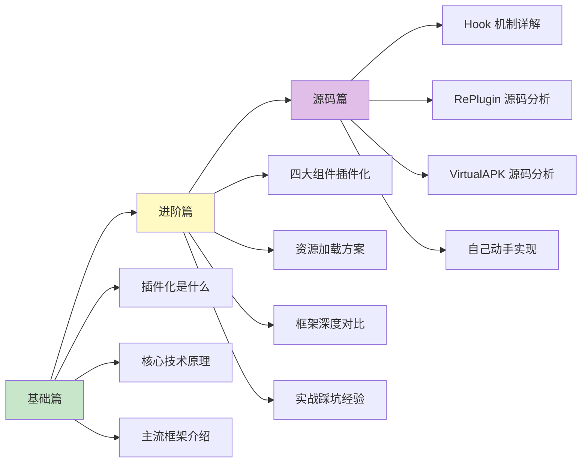

# 插件化（Plugin）知识体系

> 从入门到专家的完整学习路径 —— 让 App 像浏览器一样加载"网页"

## 为什么要学插件化？

想象一下，你的 App 就像一个**浏览器**：
- 浏览器本身很小，但可以访问无数网页
- 网页不需要重新安装浏览器就能更新
- 用户想看什么内容，随时加载

插件化就是让你的 App 具备这种能力——**主 App 像浏览器，插件像网页，随时加载、随时更新**。

### 插件化解决什么问题？

| 问题 | 传统方案 | 插件化方案 |
|-----|---------|-----------|
| App 体积越来越大 | 用户忍着下载 | 按需下载功能模块 |
| 功能更新要发版 | 等应用商店审核 | 动态下发插件 |
| 65535 方法数限制 | MultiDex（启动变慢） | 拆分到插件 |
| 多团队协作冲突 | 代码合并地狱 | 各团队独立开发插件 |
| A/B 测试困难 | 发多个版本 | 动态加载不同插件 |

## 插件化 vs 热修复 vs 组件化

这三个概念经常被混淆，一张表说清楚：

| 对比项 | 插件化 | 热修复 | 组件化 |
|-------|-------|-------|-------|
| **目的** | 动态添加新功能 | 修复线上 Bug | 代码解耦复用 |
| **粒度** | 整个功能模块 | 单个类/方法 | 业务模块 |
| **安装时机** | 运行时动态加载 | 运行时打补丁 | 编译时打包 |
| **典型场景** | 加载新的业务模块 | 紧急修复 Crash | 多团队协作开发 |
| **技术难度** | ⭐⭐⭐⭐⭐ | ⭐⭐⭐⭐ | ⭐⭐⭐ |
| **代表框架** | RePlugin、VirtualAPK | Tinker、Sophix | ARouter、CC |

**一句话总结**：
- 组件化是**编译时**的模块拆分
- 热修复是**运行时**的 Bug 修复
- 插件化是**运行时**的功能扩展

## 文档结构

```
Plugin/
├── README.md          # 本文件（目录索引）
├── 1-基础篇.md         # 初/中级开发者
├── 2-进阶篇.md         # 高级开发者
└── 3-源码篇.md         # 专家级
```

## 学习路线



## 各篇内容概览

### [1-基础篇](1-基础篇.md)

**适合人群**：Android 中级开发者、准备高级面试

| 知识点 | 内容 |
|-------|------|
| 技术演进 | 插件化为什么会出现？解决了什么问题？ |
| 核心概念 | 宿主、插件、占坑、Hook 等术语解释 |
| 技术基础 | ClassLoader、反射、动态代理 |
| 主流框架 | RePlugin、VirtualAPK、Shadow 等介绍 |
| 基本使用 | 以 RePlugin 为例的快速接入 |
| 横向对比 | 各框架简单对比 |

### [2-进阶篇](2-进阶篇.md)

**适合人群**：有插件化使用经验、准备专家级面试

| 知识点 | 内容 |
|-------|------|
| Activity 插件化 | 占坑方案、Hook AMS、Hook Instrumentation |
| Service 插件化 | 代理分发、占坑复用 |
| BroadcastReceiver 插件化 | 静态转动态、代理方案 |
| ContentProvider 插件化 | 占坑方案、URI 重定向 |
| 资源加载 | 资源冲突解决、AssetManager 方案 |
| 实战经验 | 大厂插件化实践、踩坑总结 |
| 边界认知 | 插件化的局限性和替代方案 |

### [3-源码篇](3-源码篇.md)

**适合人群**：准备 Android 专家级面试、想深入理解原理

| 知识点 | 内容 |
|-------|------|
| Hook 机制详解 | 静态代理、动态代理、反射 Hook |
| RePlugin 源码 | 类加载方案、坑位管理、进程管理 |
| VirtualAPK 源码 | Hook 方案、资源处理、四大组件 |
| Shadow 源码 | 零反射方案、编译时处理 |
| 自己动手实现 | 手写简易插件化框架 |
| 面试高频 | 专家级深度问题 |

## 面试覆盖程度

| 面试级别 | 需要掌握 |
|---------|---------|
| 中级 Android | 基础篇（了解概念和原理） |
| 高级 Android | 基础篇 + 进阶篇 |
| **Android 专家** | 基础篇 + 进阶篇 + 源码篇 |

## 快速查阅

### 主流框架速查

| 框架 | 公司 | Hook 方案 | 四大组件 | 资源隔离 | 稳定性 | 维护状态 |
|-----|------|----------|---------|---------|-------|---------|
| RePlugin | 360 | 最少 Hook | ✅ | ✅ | 高 | 活跃 |
| VirtualAPK | 滴滴 | Hook AMS | ✅ | ✅ | 高 | 停更 |
| Shadow | 腾讯 | 零反射 | ✅ | ✅ | 高 | 活跃 |
| DroidPlugin | 360 | 大量 Hook | ✅ | ✅ | 中 | 停更 |
| Small | 个人 | 少量 Hook | 部分 | ✅ | 中 | 停更 |

### 核心技术速查

| 技术点 | 核心原理 | 所在文档 |
|-------|---------|---------|
| 类加载 | 自定义 ClassLoader 加载插件 dex | 基础篇 |
| Activity 插件化 | 占坑 + Hook AMS/Instrumentation | 进阶篇 |
| 资源加载 | 创建插件 AssetManager + 合并资源 | 进阶篇 |
| 进程管理 | 预埋进程 + 进程复用 | 源码篇 |

### 常见问题速查

| 问题 | 原因 | 解决方案 | 所在文档 |
|-----|------|---------|---------|
| 插件 Activity 启动失败 | 没有在 Manifest 注册 | 使用占坑 Activity | 进阶篇 |
| 资源找不到 | 资源 ID 冲突 | 修改插件资源 ID 前缀 | 进阶篇 |
| 插件类找不到 | ClassLoader 隔离 | 正确设置 parent ClassLoader | 基础篇 |
| 插件 Context 问题 | 使用了宿主 Context | 使用插件专属 Context | 进阶篇 |

## 技术选型建议

| 场景 | 推荐方案 | 原因 |
|-----|---------|------|
| 追求稳定性 | RePlugin / Shadow | Hook 少，兼容性好 |
| 快速上手 | VirtualAPK | 文档完善，接入简单 |
| 长期维护 | Shadow | 腾讯维护，零反射方案 |
| 学习原理 | VirtualAPK | 代码清晰，注释完善 |
| 已有项目改造 | RePlugin | 侵入性最小 |

## 前置知识

学习插件化之前，建议先掌握：

| 知识点 | 重要程度 | 相关文档 |
|-------|---------|---------|
| ClassLoader | ⭐⭐⭐⭐⭐ | [ClassLoader](../ClassLoader/README.md) |
| 反射机制 | ⭐⭐⭐⭐⭐ | Java 基础 |
| 动态代理 | ⭐⭐⭐⭐ | Java 基础 |
| Binder 机制 | ⭐⭐⭐⭐ | [Binder](../Binder/README.md) |
| Activity 启动流程 | ⭐⭐⭐⭐ | [Activity](../Activity/README.md) |
| 热修复 | ⭐⭐⭐ | [HotFix](../HotFix/README.md) |

## 版本信息

本文档基于以下版本编写：

```kotlin
// build.gradle.kts (RePlugin)
dependencies {
    implementation("com.qihoo360.replugin:replugin-host-lib:2.3.4")
}

// build.gradle.kts (VirtualAPK - 宿主)
dependencies {
    implementation("com.didi.virtualapk:core:0.9.8")
}

// build.gradle.kts (Shadow)
dependencies {
    implementation("com.tencent.shadow.core:runtime:2.0.0")
}
```

---
_本文档将持续更新_
