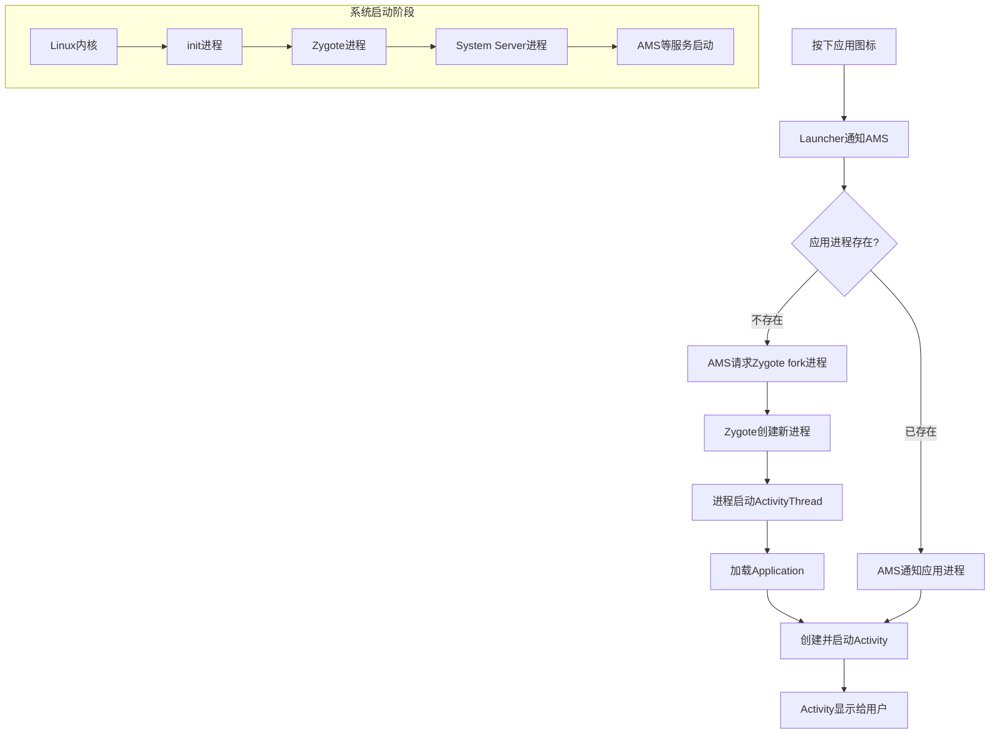
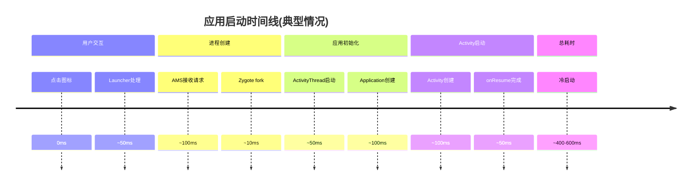

# Android进程启动流程 (Process Launch Flow)

## 1. 解决什么问题？

> 从按下手机图标到应用打开,这中间发生了什么？

**痛点**: 启动一个Android应用似乎很简单,点一下就打开了,但背后涉及复杂的系统架构和多进程协作。不理解这个流程,遇到启动慢、崩溃、ANR等问题时就不知道从哪下手。

**作用**: 掌握进程启动流程,可以帮助我们:
- 理解Android系统的工作原理
- 诊断应用启动性能问题
- 解决进程相关的崩溃和ANR
- 优化应用启动速度

## 2. 通俗理解

### 核心定义
Android进程启动流程是指从用户启动应用到应用完全运行起来,系统涉及的各个关键进程和它们之间的协作过程。

### 生活化比喻

想象一家**快餐店**的运作流程:

1. **init进程** = **开店经理**: 早上第一到店,打开店门,检查设备,启动烤炉(zygote)
2. **zygote进程** = **中央厨房**: 提前准备好所有食材和工具,当有订单时快速复制
3. **system server进程** = **前台收银台**: 接收顾客订单,协调各部门工作
4. **应用进程** = **快餐盒**: 从中央厨房快速复制一份"预制套餐"

**为什么这么设计?**
如果每个顾客来都要从头准备食材(启动一个全新的JVM),太慢了!不如提前准备好食材模板(zygote),来了订单直接复制一份(fork),这样几秒就能出餐。

## 3. 整体流程概览



## 4. 核心系统进程

### 4.1 init进程 (PID 1)
**是什么**: Linux内核启动后的第一个用户空间进程

**职责**:
- 解析 `init.rc` 配置文件
- 启动zygote等关键系统进程
- 监听和处理系统事件

### 4.2 zygote进程
**是什么**: 所有Java应用的"母亲进程"

**职责**:
- 预加载Android Framework的核心类(约3000个类)
- 预加载系统资源
- 通过fork快速创建应用进程

**关键特点**:
- 使用Copy-on-Write(写时复制)技术
- fork操作只需几百微秒
- 所有应用共享预加载的内存页(只读)

### 4.3 System Server进程
**是什么**: 由zygote fork而来,承载所有系统服务

**主要服务**:
- **AMS (ActivityManagerService)**: 管理应用生命周期、Activity栈
- **PMS (PackageManagerService)**: 管理应用安装和卸载
- **WMS (WindowManagerService)**: 管理窗口显示和交互
- 等等...

### 4.4 应用进程
**是什么**: 运行具体应用的进程

**启动方式**: 由zygote fork而来,继承预加载的类和资源

## 5. 从点击图标到应用启动的完整流程

### 5.1 用户交互阶段
```
用户点击图标 → Launcher发送Intent → AMS接收请求
```

**发生了什么**:
1. Launcher(桌面应用)识别用户点击的应用
2. Launcher通过Binder调用AMS的`startActivity()`
3. AMS检查应用是否已安装、权限是否足够

### 5.2 进程创建阶段
```
AMS发现进程不存在 → 请求Zygote fork → 创建新进程
```

**关键步骤**:
1. AMS调用`startProcessLocked()`
2. 通过Socket向Zygote发送请求
3. Zygote调用`fork()`创建子进程
4. 子进程继承zygote的内存空间(预加载的类和资源)

### 5.3 应用初始化阶段
```
进程启动 → ActivityThread.main() → Application初始化
```

**发生了什么**:
1. 新进程调用`ActivityThread.main()`
2. 创建`Application`对象并调用`onCreate()`
3. 设置Looper和Handler(处理主线程消息)

### 5.4 Activity启动阶段
```
AMS发送启动请求 → ApplicationThread处理 → Activity创建
```

**关键步骤**:
1. AMS通过Binder调用应用进程的`ApplicationThread`
2. 应用进程创建Activity实例
3. 调用`onCreate()` → `onStart()` → `onResume()`
4. Activity显示到屏幕上

**时间线**:


## 6. 冷启动 vs 热启动

| 启动类型 | 定义 | 耗时 | 原因 |
|---------|------|------|------|
| **冷启动** | 进程不存在,需要创建 | 400-600ms | 需要fork进程、加载类、初始化Application |
| **热启动** | 进程已存在,Activity被销毁 | 100-200ms | 只需创建Activity,跳过进程创建 |
| **温启动** | 进程已存在,但Activity不存在 | 200-300ms | 进程存在,但Activity需要重建 |

### 为什么冷启动慢?
就像**开一家新餐厅**:
- 找房子、装修(fork进程)
- 买食材、厨具(加载类和资源)
- 招聘员工、培训(初始化Application)
- 接待第一个客人(启动Activity)

### 为什么热启动快?
就像**餐厅重启营业**:
- 房子、厨具都在(进程已存在)
- 稍微准备一下(重建Activity)
- 马上接客

## 7. 关键问题

### Q1: 为什么所有应用都从zygote fork?
**答案**: 避免重复初始化JVM和加载Framework类。如果每个应用都从头启动JVM,启动时间可能需要几秒甚至十几秒。

### Q2: fork为什么这么快?
**答案**: 使用Copy-on-Write技术。fork只是复制父进程的页表,实际内存页在子进程需要写入时才真正复制。大部分应用启动时不会修改预加载的类,所以几乎是零拷贝。

### Q3: 应用进程和zygote的关系是什么?
**答案**: 父子关系。应用进程fork后会成为独立进程,与zygote没有直接通信关系。zygote继续等待新的fork请求。

## 8. 常见场景

### 场景1: 启动一个新应用
```
点击图标 → AMS请求 → Zygote fork新进程 → Application启动 → Activity启动
```

### 场景2: 从应用A跳转到应用B
```
应用A发送Intent → AMS检查B的进程 → 进程不存在则fork → 启动应用B的Activity
```

### 场景3: 应用被系统杀死后重新启动
```
系统回收进程 → 用户再次打开应用 → AMS重新请求fork → 重新初始化
```

## 9. 调试工具

### 常用命令
```bash
# 查看所有应用进程
adb shell ps

# 查看指定应用的进程信息
adb shell ps | grep com.example.app

# 查看进程启动日志
adb logcat | grep "ActivityManager"

# 启动应用并查看详细启动时间
adb shell am start -W com.example.app/.MainActivity
```

### 关键日志标签
- `ActivityManager`: AMS的日志
- `Zygote`: zygote进程的日志
- `ActivityThread`: 应用进程的日志

## 10. 面试题检验

### Q1: 简述Android应用的启动流程
**答案**: 用户点击图标 → Launcher通知AMS → AMS检查进程 → 如不存在则请求Zygote fork → Zygote创建新进程 → 进程启动ActivityThread → 创建Application → 启动Activity → 显示界面

**关键点**: 提到AMS、Zygote、ActivityThread、Application这几个核心组件

### Q2: 为什么应用启动需要zygote fork?不用zygote会怎样?
**答案**: zygote预加载了Framework的核心类和资源,通过fork可以继承这些内容,避免每个应用都重复初始化JVM和加载类。不用zygote的话,每个应用启动都需要初始化JVM和加载几千个类,启动时间会从几百毫秒变成几秒甚至更长。

**关键点**: 预加载、fork继承、避免重复初始化、启动时间对比

### Q3: 冷启动和热启动的区别是什么?哪个快?为什么?
**答案**: 冷启动是应用进程不存在,需要从zygote fork创建,耗时400-600ms;热启动是进程已存在,只需重建Activity,耗时100-200ms。热启动更快,因为跳过了进程创建、类加载、Application初始化等耗时步骤。

**关键点**: 进程是否存在、启动时间对比、跳过的步骤

### Q4: fork操作为什么这么快?用了什么技术?
**答案**: fork使用Copy-on-Write(写时复制)技术,只复制父进程的页表,实际内存页在子进程写入时才真正复制。因为应用启动时基本不修改预加载的类,所以几乎是零拷贝,只需几十到几百微秒。

**关键点**: Copy-on-Write、页表、零拷贝、微秒级耗时

### Q5: AMS在应用启动中起什么作用?
**答案**: AMS是应用启动的调度中心,负责接收启动请求、检查应用状态、协调进程创建、管理Activity生命周期、处理启动过程中的各种回调。

**关键点**: 调度中心、进程创建、生命周期管理

---
_本文档持续更新中,更多信息请查看进阶篇和源码篇_