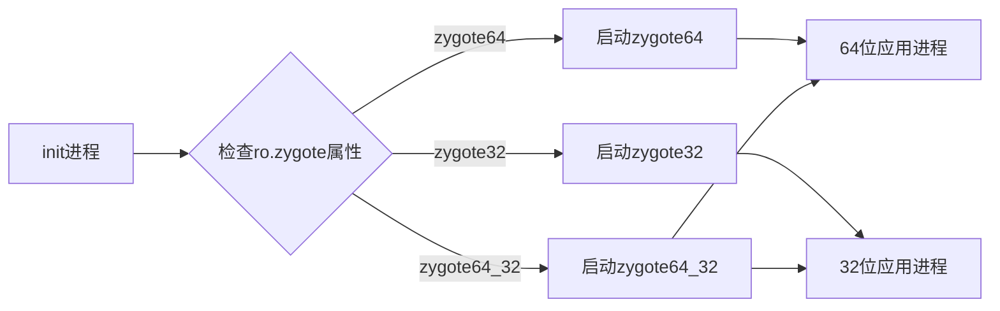
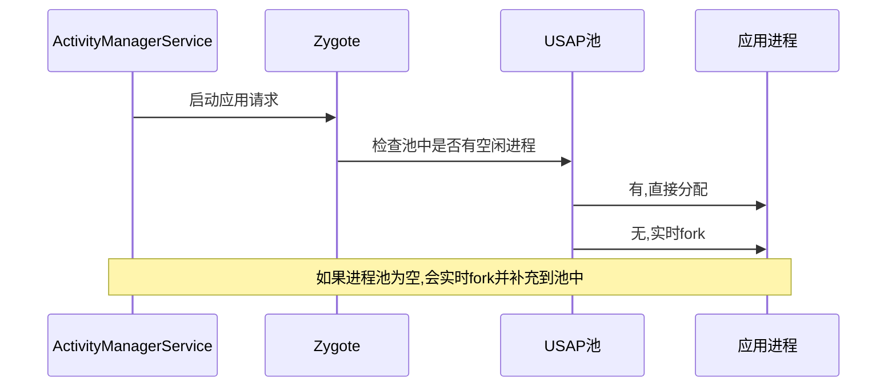
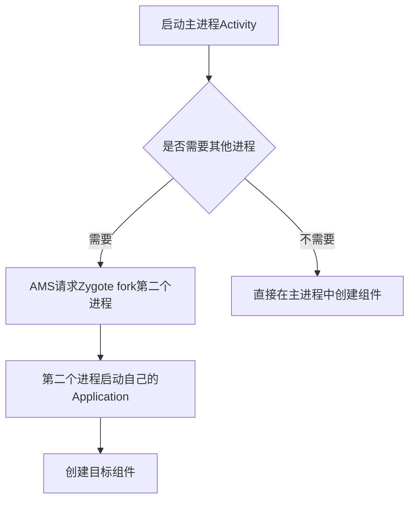

# Android进程启动流程 - 进阶篇

## 1. 高级特性

### 1.1 多架构Zygote支持

Android从5.0开始支持32位和64位架构混用,因此有多个zygote变体:

| zygote类型 | 配置文件 | 说明 |
|-----------|---------|------|
| **zygote32** | init.zygote32.rc | 只支持32位应用 |
| **zygote64** | init.zygote64.rc | 只支持64位应用 |
| **zygote32_64** | init.zygote32_64.rc | 主进程32位,可fork 64位应用 |
| **zygote64_32** | init.zygote64_32.rc | 主进程64位,可fork 32位应用 |

**工作原理**:


### 1.2 USAP(Unspecialized App Process)池

**是什么**: zygote预先fork一些"未特定化"的应用进程,放入池中等待使用

**解决的问题**: 进一步减少应用启动时间,连fork的几十微秒都省了

**工作流程**:


**适用场景**: 频繁启动小应用的场景(如通知、快捷方式)

**权衡**: 增加内存占用换取启动速度

### 1.3 App进程的预创建

**机制**: 系统可以根据预测提前fork一些可能启动的应用进程

**预测依据**:
- 用户使用习惯(常用应用)
- 时间规律(早上会打开的新闻应用)
- 应用关联(打开A可能会打开B)

**实现位置**: AMS中的`ProcessList`类

### 1.4 多进程应用的启动

当一个应用声明了多个进程时:
```xml
<activity android:name=".MainActivity"
    android:process=":remote" />
```

**启动流程**:


**注意**: 每个进程都有自己的Application实例,Application的`onCreate()`会被调用多次!

### 1.5 ContentProvider的特殊启动

**关键特性**: ContentProvider必须在`Application.onCreate()`之前初始化

**为什么**: 系统需要ContentProvider来获取应用信息(如应用图标、标签)

**启动顺序**:
```
1. Application.attachBaseContext()
2. ContentProvider.onCreate() (按AndroidManifest.xml中的顺序)
3. Application.onCreate()
```

**实战建议**: 不要在ContentProvider的`onCreate()`中做耗时操作,会拖慢启动!

## 2. 性能优化

### 2.1 启动性能问题诊断

#### 问题1: 启动慢,不知道卡在哪里

**诊断步骤**:

**方法1: 使用adb命令测量**
```bash
# 启动应用并获取详细时间
adb shell am start -W com.example.app/.MainActivity

# 输出解读:
# ThisTime: 最后一个Activity启动耗时
# TotalTime: 所有Activity启动总耗时
# WaitTime: AMS处理+启动总耗时(包含等待AMS调度)
```

**方法2: 使用Systrace**
```bash
# 采集trace
python systrace.py --time=10 -o trace.html sched freq idle am wm gfx view binder_driver hal dalvik camera input res

# 分析trace.html,关注以下时间点:
# - procStart: 进程开始创建
# - procStartRel: 进程创建相对时间
# - Activity启动的各个阶段
```

**方法3: Android Studio Profiler**
- CPU Profiler: 查看CPU使用情况
- Memory Profiler: 查看内存分配
- Network Profiler: 查看网络请求(启动时的网络请求会阻塞启动!)

#### 问题2: 启动时ANR

**常见原因**:
1. 主线程IO操作(文件读写、网络请求)
2. ContentProvider初始化耗时
3. Application.onCreate()做太多工作
4. Activity的`onCreate()`中初始化太多组件

**诊断**:
```bash
# 查看ANR日志
adb pull /data/anr/traces.txt

# 搜索你的应用包名,查看主线程在做什么
grep "com.example.app" traces.txt
```

#### 问题3: 启动时OOM

**原因**: zygote预加载了大量类,如果应用再加载太多类或分配大内存,可能触发OOM

**诊断**:
```bash
# 查看内存使用
adb shell dumpsys meminfo com.example.app
```

### 2.2 优化策略

#### 策略1: 减少Application初始化工作

❌ **不好的做法**:
```kotlin
class MyApplication : Application() {
    override fun onCreate() {
        super.onCreate()

        // 初始化SDK
        SDK1.init(this)
        SDK2.init(this)
        SDK3.init(this)

        // 加载配置
        loadConfig()

        // 建立连接
        connectToServer()

        // 加载数据库
        initDatabase()
    }
}
```

✅ **好的做法**:
```kotlin
class MyApplication : Application() {
    override fun onCreate() {
        super.onCreate()
        // 只做真正必要的初始化
        initCrashHandler()
        initLog()
    }
}

// 其他SDK延迟初始化
class MainActivity : AppCompatActivity() {
    override fun onCreate(savedInstanceState: Bundle?) {
        super.onCreate(savedInstanceState)
        setContentView(R.layout.activity_main)

        // 在后台线程初始化
        lifecycleScope.launch(Dispatchers.IO) {
            SDK1.init(applicationContext)
            SDK2.init(applicationContext)
        }
    }
}
```

#### 策略2: 异步初始化非关键组件

使用`WorkManager`或`Lifecycle`延迟初始化:

```kotlin
class MainActivity : AppCompatActivity() {
    override fun onCreate(savedInstanceState: Bundle?) {
        super.onCreate(savedInstanceState)

        // 使用Lifecycle延迟初始化
        lifecycle.addObserver(DelayedInitializer())
    }
}

class DelayedInitializer : DefaultLifecycleObserver {
    override fun onStart(owner: LifecycleOwner) {
        // Activity启动后再初始化
        CoroutineScope(Dispatchers.IO).launch {
            HeavySDK.init(applicationContext)
        }
    }
}
```

#### 策略3: 优化ContentProvider

**问题**: ContentProvider初始化会阻塞启动

**优化**:
1. 如果不需要ContentProvider,不要在AndroidManifest.xml中声明
2. 如果必须有,在`onCreate()`中只做最少的初始化

```kotlin
class MyContentProvider : ContentProvider() {
    override fun onCreate(): Boolean {
        // ❌ 不要在这里初始化SDK
        // HeavySDK.init(context)

        // ✅ 只做必要初始化
        initUriMatcher()
        return true
    }
}
```

#### 策略4: 使用启动优化工具

**工具1: Android Startup库**
```kotlin
// 自动化处理ContentProvider初始化顺序
<provider
    android:name="androidx.startup.InitializationProvider"
    android:authorities="${applicationId}.androidx-startup"
    android:exported="false"
    tools:node="merge" />
```

**工具2: Jetpack App Startup**
```kotlin
// 定义初始化器
class SDKInitializer : Initializer<SDK> {
    override fun create(context: Context): SDK {
        return SDK.init(context)
    }

    override fun dependencies(): List<Class<out Initializer<*>>> {
        return emptyList() // 无依赖
    }
}

// 在AndroidManifest.xml中声明
<provider
    android:name="androidx.startup.InitializationProvider"
    android:authorities="${applicationId}.androidx-startup"
    android:exported="false"
    tools:node="merge">
    <meta-data
        android:name="com.example.app.SDKInitializer"
        android:value="androidx.startup" />
</provider>
```

#### 策略5: 减少类加载

**原理**: 启动时加载的类越多,启动越慢

**优化方法**:
1. 避免在Application和Activity的`onCreate()`中创建不必要的对象
2. 使用懒加载
3. 减少依赖库

```kotlin
// ❌ 不好: 启动时创建所有单例
object Managers {
    val networkManager = NetworkManager()
    val databaseManager = DatabaseManager()
    val cacheManager = CacheManager()
}

// ✅ 好: 懒加载
object Managers {
    val networkManager by lazy { NetworkManager() }
    val databaseManager by lazy { DatabaseManager() }
    val cacheManager by lazy { CacheManager() }
}
```

### 2.3 启动速度优化实战案例

#### 案例: 某新闻应用启动从2秒优化到500ms

**问题诊断**:
```bash
adb shell am start -W com.news.app/.MainActivity
# TotalTime: 2034ms
```

**分析Systrace发现**:
- ContentProvider初始化: 800ms
- Application.onCreate(): 600ms
- Activity创建: 400ms
- setContentView: 234ms

**优化措施**:

**1. 优化ContentProvider**(节省800ms → 50ms)
```kotlin
// 之前: 在ContentProvider中初始化所有SDK
class SettingsProvider : ContentProvider() {
    override fun onCreate(): Boolean {
        AnalyticsSDK.init(context)
        PushSDK.init(context)
        AdSDK.init(context)
        return true
    }
}

// 之后: 只保留必要的ContentProvider逻辑
class SettingsProvider : ContentProvider() {
    override fun onCreate(): Boolean {
        // 只初始化URI匹配器
        initUriMatcher()
        return true
    }
}

// SDK移到Application中异步初始化
```

**2. 优化Application.onCreate()**(节省600ms → 100ms)
```kotlin
// 之前: 同步初始化所有SDK
class NewsApplication : Application() {
    override fun onCreate() {
        super.onCreate()
        ImageLoader.init(this)
        AnalyticsSDK.init(this)
        NetworkSDK.init(this)
        ConfigManager.load(this)
        DatabaseHelper.init(this)
    }
}

// 之后: 分级初始化
class NewsApplication : Application() {
    override fun onCreate() {
        super.onCreate()

        // 必须同步初始化的
        CrashHandler.init(this)

        // 可以延迟初始化的
        CoroutineScope(Dispatchers.IO).launch {
            ConfigManager.load(this@NewsApplication)
        }

        // 在需要时才初始化的
        GlobalScope.launch {
            AnalyticsSDK.init(this@NewsApplication)
        }
    }
}
```

**3. 优化Activity创建**(节省400ms → 200ms)
```kotlin
// 之前: 在onCreate中初始化所有View
class MainActivity : AppCompatActivity() {
    override fun onCreate(savedInstanceState: Bundle?) {
        super.onCreate(savedInstanceState)
        setContentView(R.layout.activity_main)

        // 初始化所有Fragment
        supportFragmentManager.beginTransaction()
            .add(R.id.container, NewsFragment())
            .add(R.id.container, VideoFragment())
            .add(R.id.container, CommentFragment())
            .commit()
    }
}

// 之后: 延迟加载Fragment
class MainActivity : AppCompatActivity() {
    override fun onCreate(savedInstanceState: Bundle?) {
        super.onCreate(savedInstanceState)
        setContentView(R.layout.activity_main)

        // 只加载主Fragment
        supportFragmentManager.beginTransaction()
            .add(R.id.container, NewsFragment())
            .commit()
    }

    // 其他Fragment延迟加载
}
```

**优化结果**:
```bash
adb shell am start -W com.news.app/.MainActivity
# TotalTime: 523ms
```

**总结**: 通过ContentProvider优化、异步初始化、懒加载,将启动时间从2秒降到0.5秒,提升了75%!

## 3. 实战经验

### 3.1 大型项目的启动优化清单

#### 阶段1: 诊断(1-2天)
- [ ] 使用`adb shell am start -W`测量启动时间
- [ ] 使用Systrace分析启动瓶颈
- [ ] 检查ContentProvider初始化耗时
- [ ] 检查Application.onCreate()耗时
- [ ] 检查Activity.onCreate()耗时

#### 阶段2: 快速优化(3-5天)
- [ ] 移除不必要的ContentProvider
- [ ] 简化ContentProvider的onCreate()
- [ ] 将SDK初始化移到后台线程
- [ ] 使用懒加载单例

#### 阶段3: 深度优化(1-2周)
- [ ] 使用Jetpack App Startup管理初始化
- [ ] 优化布局层级和加载速度
- [ ] 减少启动时的资源加载
- [ ] 使用启动预测预fork进程

#### 阶段4: 监控(持续)
- [ ] 建立启动时间监控体系
- [ ] 定期分析启动性能
- [ ] A/B测试优化方案

### 3.2 常见坑和解决方案

#### 坑1: 在Application中初始化太多东西

**现象**: 启动慢,内存占用高

**原因**: Application的`onCreate()`在主线程执行,阻塞启动

**解决方案**:
- 将非关键初始化移到后台线程
- 使用按需初始化

```kotlin
// 使用Kotlin的lazy按需初始化
class MyApplication : Application() {
    val heavyManager by lazy {
        HeavyManager(applicationContext)
    }
}
```

#### 坑2: ContentProvider导致的循环依赖

**现象**: 应用启动崩溃或卡死

**原因**: ContentProvider A依赖ContentProvider B,B又依赖A

**解决方案**:
- 使用Jetpack App Startup管理依赖顺序
- 移除不必要的ContentProvider

```kotlin
// 明确声明依赖关系
class SDK1Initializer : Initializer<SDK1> {
    override fun dependencies(): List<Class<out Initializer<*>>> {
        return listOf(SDK2Initializer::class.java) // 依赖SDK2
    }
}
```

#### 坑3: 多进程Application.onCreate()多次调用

**现象**: Application的onCreate()被调用多次,初始化重复

**原因**: 应用声明了多个进程,每个进程都有自己的Application

**解决方案**:
```kotlin
class MyApplication : Application() {
    override fun onCreate() {
        super.onCreate()

        // 只在主进程中初始化
        if (ProcessUtils.isMainProcess(this)) {
            initSDKs()
        }
    }
}

object ProcessUtils {
    fun isMainProcess(context: Context): Boolean {
        val pid = android.os.Process.myPid()
        val processName = getProcessName(context, pid)
        return context.packageName == processName
    }
}
```

#### 坑4: 启动时发起网络请求阻塞UI线程

**现象**: 启动时UI卡顿

**原因**: 在主线程中同步调用网络API

**解决方案**:
- 使用协程在后台线程
- 使用Retrofit的suspend函数

```kotlin
// ❌ 不好
class MainActivity : AppCompatActivity() {
    override fun onCreate(savedInstanceState: Bundle?) {
        super.onCreate(savedInstanceState)
        setContentView(R.layout.activity_main)

        // 主线程阻塞
        val data = ApiClient.getNewsList()
        updateUI(data)
    }
}

// ✅ 好
class MainActivity : AppCompatActivity() {
    override fun onCreate(savedInstanceState: Bundle?) {
        super.onCreate(savedInstanceState)
        setContentView(R.layout.activity_main)

        // 后台线程
        lifecycleScope.launch {
            val data = ApiClient.getNewsList()
            withContext(Dispatchers.Main) {
                updateUI(data)
            }
        }
    }
}
```

### 3.3 跨进程通信的最佳实践

#### 场景: 应用需要跨进程访问服务

**不好的做法**: 使用AIDL自己实现复杂的IPC

**好的做法**: 使用Jetpack的Process Phoenix库,或者考虑是否真的需要多进程

```kotlin
// 使用Process Phoenix管理多进程
object ProcessPhoenix {
    fun triggerRebirth(context: Context, nextIntent: Intent) {
        val intent = Intent(context, PhoenixActivity::class.java)
        intent.addFlags(Intent.FLAG_ACTIVITY_NEW_TASK)
        intent.putExtra(KEY_RESTART_INTENT, nextIntent)
        context.startActivity(intent)
        Process.killProcess(Process.myPid())
    }
}
```

**建议**: 除非必要,不要使用多进程。多进程会增加复杂度,增加内存占用,启动也会变慢。

### 3.4 启动性能监控方案

#### 方案1: 自定义启动时间统计

```kotlin
class StartupTracker {
    companion object {
        private val startTime = SystemClock.elapsedRealtime()

        fun mark(phase: String) {
            val elapsed = SystemClock.elapsedRealtime() - startTime
            Log.d("Startup", "$phase: ${elapsed}ms")
        }
    }
}

// 在关键位置打点
class MyApplication : Application() {
    override fun onCreate() {
        super.onCreate()
        StartupTracker.mark("Application.onCreate()")
    }
}

class MainActivity : AppCompatActivity() {
    override fun onCreate(savedInstanceState: Bundle?) {
        super.onCreate(savedInstanceState)
        StartupTracker.mark("Activity.onCreate()")
    }

    override fun onResume() {
        super.onResume()
        StartupTracker.mark("Activity.onResume() - 首帧绘制")
    }
}
```

#### 方案2: 使用Firebase Performance

```kotlin
// Firebase自动统计应用启动时间
// 只需要集成SDK即可,无需手动打点
implementation 'com.google.firebase:firebase-perf:20.0.0'
```

#### 方案3: 使用友盟/U-APM

```kotlin
// 国内常用的性能监控方案
implementation 'com.umeng.umsdk:apm:1.4.0'
```

## 4. 横向对比

### 4.1 Android vs iOS 应用启动

| 对比项 | Android | iOS |
|-------|---------|-----|
| **启动机制** | zygote fork进程 | 直接启动进程 |
| **预加载** | 预加载Framework类 | dyld动态链接 |
| **冷启动时间** | 400-600ms | 300-500ms |
| **热启动时间** | 100-200ms | 50-150ms |
| **优化难度** | 中等 | 较低(系统优化好) |

**Android优势**: zygote预加载让启动相对稳定
**iOS优势**: 系统层面的优化更深入

### 4.2 不同Android版本的启动优化

| 版本 | 关键优化 | 效果 |
|-----|---------|------|
| **Android 8.0** | 后台服务限制 | 减少后台进程,提升前台启动 |
| **Android 9.0** | ART性能优化 | 类加载速度提升 |
| **Android 10** | USAP池 | 预fork进程,进一步加速 |
| **Android 11** | 进程预测 | 预测用户行为,提前fork |
| **Android 12+** | 优化zygote预加载 | 减少预加载类数,降低内存占用 |

### 4.3 不同厂商的优化

| 厂商 | 优化方案 | 效果 |
|-----|---------|------|
| **小米** | MIUI优化,进程冻结 | 后台不占资源,启动更快 |
| **华为** | 方舟编译器 | 提前编译,启动更快 |
| **OPPO** | 启动预测 | 根据习惯预fork |
| **三星** | OneUI优化 | 内存管理优化 |

## 5. 边界认知

### 5.1 什么时候不需要优化启动速度?

- 后台服务: 用户感知不到启动时间
- 工具类应用: 偶尔使用,启动慢点可以接受
- 开发调试阶段: 先保证功能正确,再优化性能

### 5.2 过度优化的风险

- 代码复杂度增加: 过度使用异步和延迟加载会让代码难以维护
- 引入新Bug: 修改初始化顺序可能导致依赖问题
- 维护成本高: 复杂的启动逻辑需要专人维护

**建议**: 80-20原则 - 优化最耗时的20%部分,通常能获得80%的效果

### 5.3 不是所有应用都适合预fork

- 不常用的应用: 预fork会浪费内存
- 内存敏感的应用: 比如游戏应用,需要大内存
- 低端设备: 内存不足时预fork会被杀死

## 6. 面试题检验

### Q1: 如何诊断应用启动慢的问题?
**答案**: 使用`adb shell am start -W`测量总启动时间,使用Systrace分析各阶段耗时,检查ContentProvider初始化、Application.onCreate()、Activity创建等关键环节。重点关注主线程的耗时操作和网络请求。

**关键点**: adb命令、Systrace、关键环节定位

### Q2: ContentProvider为什么会影响启动速度?如何优化?
**答案**: ContentProvider的`onCreate()`必须在Application的`onCreate()`之前执行,且在主线程执行。如果有多个ContentProvider或初始化耗时,会直接拖慢启动。优化方法:移除不必要的ContentProvider,在`onCreate()`中只做最少初始化,使用Jetpack App Startup管理初始化顺序。

**关键点**: 启动顺序、主线程阻塞、Jetpack Startup

### Q3: 多进程应用的Application.onCreate()会被调用多次,如何避免重复初始化?
**答案**: 通过判断当前进程名称,只在主进程中执行初始化。可以使用`Process.myPid()`获取进程ID,再通过`ActivityManager`获取进程名称,与包名对比判断是否为主进程。

**关键点**: 进程名称判断、主进程过滤

### Q4: 有人说异步初始化可以无限提升启动速度,这种说法对吗?
**答案**: 不对。异步初始化有边界:必须等待的初始化(如配置加载)不能异步;异步初始化的资源可能在使用时还没准备好;过多的异步线程会导致线程切换开销。应该根据依赖关系和必需程度合理选择同步或异步。

**关键点**: 依赖关系、异步边界、使用时机

### Q5: 如何平衡启动速度优化和代码可维护性?
**答案**: 遵循80-20原则,优先优化最耗时的20%部分。使用成熟的工具(如Jetpack Startup)而不是自己实现复杂的异步逻辑。建立清晰的文档说明初始化顺序和依赖关系。避免过度优化导致代码难以理解。

**关键点**: 80-20原则、工具优先、文档化

---
_本文档持续更新中,更多源码级分析请查看源码篇_