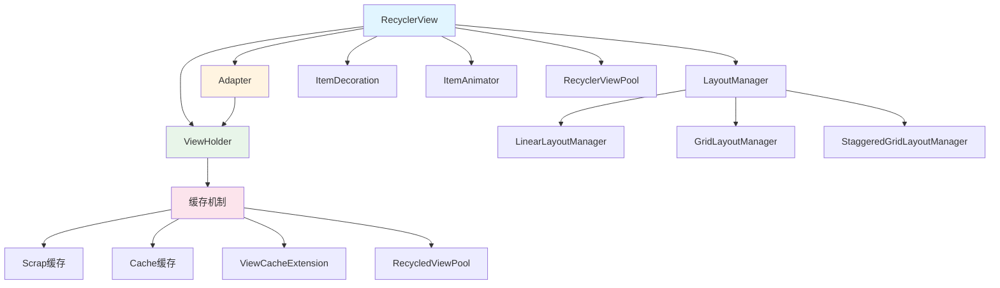
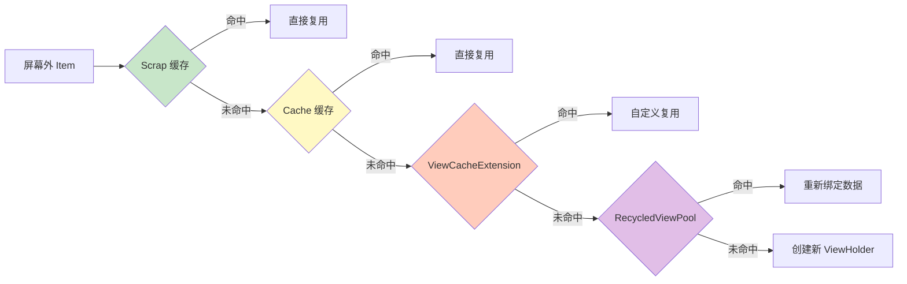
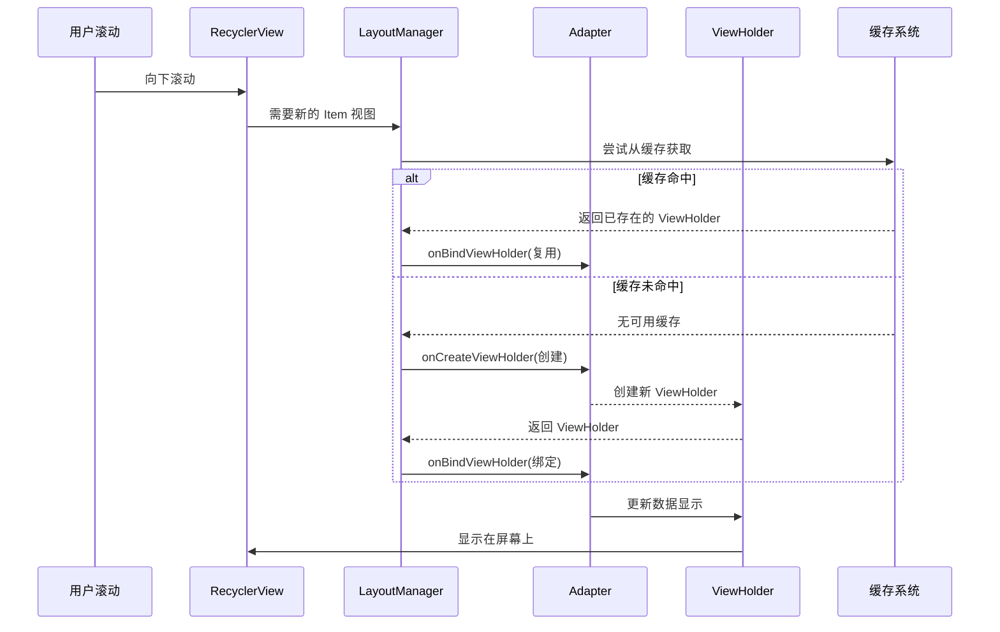

# RecyclerView（androidx.recyclerview.widget.RecyclerView）

## 什么是 RecyclerView？

### 定义

RecyclerView 是 Android Jetpack 提供的高级列表组件，用于高效展示大量数据集。它通过**视图复用机制**和**多级缓存策略**，极大地提升了列表滚动的性能和内存效率。RecyclerView 是 ListView 的增强版本，提供了更灵活的布局管理、动画支持和性能优化。

### 通俗理解

想象一个剧院有 1000 个观众，但只有 10 个座位。如何让所有人都能看到演出？

**传统方案（ListView）**：建造 1000 个座位，所有观众同时入座。问题是需要大量空间（内存），而且观众看完可能就不会再回来（不够灵活）。

**RecyclerView 方案**：只建 10 个座位，观众轮流入座。前面的观众看完后离开，后面的观众坐到同一个座位上。这样既节省空间，又能让所有人都看到演出。

- **座位** = ViewHolder（视图持有者）
- **观众** = 数据项
- **轮流入座** = 视图复用机制

## 核心组成部分

RecyclerView 由以下几个核心组件协同工作：



### 1. **RecyclerView（核心容器）**
负责数据展示和滚动处理的主容器。

### 2. **Adapter（数据适配器）**
连接数据源和 UI 的桥梁，负责创建和绑定 ViewHolder。

### 3. **ViewHolder（视图持有者）**
持有 Item 视图的引用，避免重复 findViewById，提升性能。

### 4. **LayoutManager（布局管理器）**
控制 Item 的布局方式（线性、网格、瀑布流等）。

### 5. **ItemDecoration（分割线装饰）**
为 Item 添加分割线、间距等装饰效果。

### 6. **ItemAnimator（动画管理器）**
处理 Item 的添加、删除、移动动画。

## 工作原理：视图复用机制

### RecyclerView 的四级缓存机制



### 缓存级别详解

| 缓存级别 | 容量 | 特点 | 是否需要重新绑定 |
| --- | --- | --- | --- |
| **Scrap** | 无限制 | 缓存即将显示或刚滚动出屏幕的 Item | ❌ 不需要 |
| **Cache** | 默认 2 个 | 缓存最近移出屏幕的 Item | ❌ 不需要 |
| **ViewCacheExtension** | 自定义 | 开发者自定义的缓存策略 | 取决于实现 |
| **RecycledViewPool** | 每种类型 5 个 | 按 ViewType 分类缓存 | ✅ 需要 |

### 视图复用流程图



## 代码示例

### 基础用法：完整实现

#### 1. 数据模型类

```kotlin
// User.kt
data class User(
    val id: Int,
    val name: String,
    val email: String,
    val avatar: String
)
```

#### 2. Item 布局文件

```xml
<!-- res/layout/item_user.xml -->
<?xml version="1.0" encoding="utf-8"?>
<androidx.cardview.widget.CardView 
    xmlns:android="http://schemas.android.com/apk/res/android"
    xmlns:app="http://schemas.android.com/apk/res-auto"
    xmlns:tools="http://schemas.android.com/tools"
    android:layout_width="match_parent"
    android:layout_height="wrap_content"
    android:layout_margin="8dp"
    app:cardCornerRadius="8dp"
    app:cardElevation="4dp">

    <androidx.constraintlayout.widget.ConstraintLayout
        android:layout_width="match_parent"
        android:layout_height="wrap_content"
        android:padding="16dp">

        <ImageView
            android:id="@+id/ivAvatar"
            android:layout_width="48dp"
            android:layout_height="48dp"
            android:contentDescription="@string/user_avatar"
            app:layout_constraintStart_toStartOf="parent"
            app:layout_constraintTop_toTopOf="parent"
            tools:src="@drawable/ic_person" />

        <TextView
            android:id="@+id/tvName"
            android:layout_width="0dp"
            android:layout_height="wrap_content"
            android:layout_marginStart="16dp"
            android:textColor="@android:color/black"
            android:textSize="16sp"
            android:textStyle="bold"
            app:layout_constraintEnd_toEndOf="parent"
            app:layout_constraintStart_toEndOf="@id/ivAvatar"
            app:layout_constraintTop_toTopOf="@id/ivAvatar"
            tools:text="张三" />

        <TextView
            android:id="@+id/tvEmail"
            android:layout_width="0dp"
            android:layout_height="wrap_content"
            android:layout_marginStart="16dp"
            android:layout_marginTop="4dp"
            android:textColor="@android:color/darker_gray"
            android:textSize="14sp"
            app:layout_constraintEnd_toEndOf="parent"
            app:layout_constraintStart_toEndOf="@id/ivAvatar"
            app:layout_constraintTop_toBottomOf="@id/tvName"
            tools:text="zhangsan@example.com" />

    </androidx.constraintlayout.widget.ConstraintLayout>

</androidx.cardview.widget.CardView>
```

#### 3. ViewHolder 实现

```kotlin
// UserViewHolder.kt
import android.view.View
import android.widget.ImageView
import android.widget.TextView
import androidx.recyclerview.widget.RecyclerView

class UserViewHolder(itemView: View) : RecyclerView.ViewHolder(itemView) {
    
    // 在 ViewHolder 中持有视图引用，避免重复 findViewById
    private val ivAvatar: ImageView = itemView.findViewById(R.id.ivAvatar)
    private val tvName: TextView = itemView.findViewById(R.id.tvName)
    private val tvEmail: TextView = itemView.findViewById(R.id.tvEmail)
    
    /**
     * 绑定数据到视图
     * @param user 用户数据
     * @param onItemClick Item 点击回调
     */
    fun bind(user: User, onItemClick: (User) -> Unit) {
        // 更新视图数据
        tvName.text = user.name
        tvEmail.text = user.email
        
        // 加载头像（这里使用 Glide 或 Coil 等图片加载库）
        // Glide.with(itemView.context).load(user.avatar).into(ivAvatar)
        
        // 设置点击事件
        itemView.setOnClickListener {
            onItemClick(user)
        }
    }
    
    /**
     * 解绑数据（可选，用于释放资源）
     * 当 ViewHolder 被回收时调用
     */
    fun unbind() {
        // 取消图片加载请求
        // Glide.with(itemView.context).clear(ivAvatar)
        
        // 移除点击监听
        itemView.setOnClickListener(null)
    }
}
```

#### 4. Adapter 实现（基础版）

```kotlin
// UserAdapter.kt
import android.view.LayoutInflater
import android.view.ViewGroup
import androidx.recyclerview.widget.RecyclerView

class UserAdapter(
    private var users: List<User>,
    private val onItemClick: (User) -> Unit
) : RecyclerView.Adapter<UserViewHolder>() {

    /**
     * 创建 ViewHolder
     * 此方法在 RecyclerView 需要新的 ViewHolder 时调用
     * 注意：这个方法调用频率较低，只在没有可复用的 ViewHolder 时才调用
     */
    override fun onCreateViewHolder(parent: ViewGroup, viewType: Int): UserViewHolder {
        val view = LayoutInflater.from(parent.context)
            .inflate(R.layout.item_user, parent, false)
        return UserViewHolder(view)
    }

    /**
     * 绑定数据到 ViewHolder
     * 此方法频繁调用，每次 Item 进入屏幕都会调用
     * 这里应该只做数据绑定，避免复杂操作
     */
    override fun onBindViewHolder(holder: UserViewHolder, position: Int) {
        val user = users[position]
        holder.bind(user, onItemClick)
    }

    /**
     * ViewHolder 被回收时调用（可选）
     * 用于释放资源，避免内存泄漏
     */
    override fun onViewRecycled(holder: UserViewHolder) {
        super.onViewRecycled(holder)
        holder.unbind()
    }

    /**
     * 返回数据项总数
     */
    override fun getItemCount(): Int = users.size

    /**
     * 更新数据（基础版本）
     */
    fun updateData(newUsers: List<User>) {
        users = newUsers
        notifyDataSetChanged() // ⚠️ 注意：这不是最优方案，后面会讲 DiffUtil
    }
}
```

#### 5. Activity 中使用

```kotlin
// MainActivity.kt
import android.os.Bundle
import android.widget.Toast
import androidx.appcompat.app.AppCompatActivity
import androidx.recyclerview.widget.LinearLayoutManager
import androidx.recyclerview.widget.RecyclerView

class MainActivity : AppCompatActivity() {

    private lateinit var recyclerView: RecyclerView
    private lateinit var adapter: UserAdapter

    override fun onCreate(savedInstanceState: Bundle?) {
        super.onCreate(savedInstanceState)
        setContentView(R.layout.activity_main)

        // 初始化 RecyclerView
        setupRecyclerView()

        // 加载数据
        loadUsers()
    }

    private fun setupRecyclerView() {
        recyclerView = findViewById(R.id.recyclerView)

        // 设置布局管理器（必须）
        recyclerView.layoutManager = LinearLayoutManager(this)

        // 创建并设置 Adapter
        adapter = UserAdapter(emptyList()) { user ->
            // Item 点击回调
            Toast.makeText(this, "点击了 ${user.name}", Toast.LENGTH_SHORT).show()
        }
        recyclerView.adapter = adapter

        // 可选：设置固定大小（如果 Item 大小固定，可以提升性能）
        recyclerView.setHasFixedSize(true)
    }

    private fun loadUsers() {
        // 模拟数据
        val users = List(100) { index ->
            User(
                id = index,
                name = "用户 $index",
                email = "user$index@example.com",
                avatar = "https://i.pravatar.cc/150?img=$index"
            )
        }
        adapter.updateData(users)
    }
}
```

#### 6. Activity 布局文件

```xml
<!-- res/layout/activity_main.xml -->
<?xml version="1.0" encoding="utf-8"?>
<androidx.constraintlayout.widget.ConstraintLayout 
    xmlns:android="http://schemas.android.com/apk/res/android"
    xmlns:app="http://schemas.android.com/apk/res-auto"
    android:layout_width="match_parent"
    android:layout_height="match_parent">

    <androidx.recyclerview.widget.RecyclerView
        android:id="@+id/recyclerView"
        android:layout_width="match_parent"
        android:layout_height="match_parent"
        app:layout_constraintBottom_toBottomOf="parent"
        app:layout_constraintEnd_toEndOf="parent"
        app:layout_constraintStart_toStartOf="parent"
        app:layout_constraintTop_toTopOf="parent" />

</androidx.constraintlayout.widget.ConstraintLayout>
```

### 进阶用法：DiffUtil 优化

DiffUtil 是 RecyclerView 提供的工具类，用于计算两个列表的差异，实现局部刷新而非全量刷新。

#### 1. DiffUtil.Callback 实现

```kotlin
// UserDiffCallback.kt
import androidx.recyclerview.widget.DiffUtil

class UserDiffCallback(
    private val oldList: List<User>,
    private val newList: List<User>
) : DiffUtil.Callback() {

    /**
     * 返回旧列表的大小
     */
    override fun getOldListSize(): Int = oldList.size

    /**
     * 返回新列表的大小
     */
    override fun getNewListSize(): Int = newList.size

    /**
     * 判断两个对象是否代表同一个 Item
     * 通常比较 ID
     */
    override fun areItemsTheSame(oldItemPosition: Int, newItemPosition: Int): Boolean {
        return oldList[oldItemPosition].id == newList[newItemPosition].id
    }

    /**
     * 判断两个 Item 的内容是否相同
     * 如果内容相同，则不需要刷新此 Item
     */
    override fun areContentsTheSame(oldItemPosition: Int, newItemPosition: Int): Boolean {
        val oldUser = oldList[oldItemPosition]
        val newUser = newList[newItemPosition]
        
        // 比较所有字段
        return oldUser.name == newUser.name &&
                oldUser.email == newUser.email &&
                oldUser.avatar == newUser.avatar
    }

    /**
     * 当 areItemsTheSame 返回 true，但 areContentsTheSame 返回 false 时调用
     * 返回变化的具体内容，用于 payload 局部刷新
     */
    override fun getChangePayload(oldItemPosition: Int, newItemPosition: Int): Any? {
        val oldUser = oldList[oldItemPosition]
        val newUser = newList[newItemPosition]
        
        // 返回变化的字段
        val changes = mutableMapOf<String, Any>()
        
        if (oldUser.name != newUser.name) {
            changes["name"] = newUser.name
        }
        if (oldUser.email != newUser.email) {
            changes["email"] = newUser.email
        }
        if (oldUser.avatar != newUser.avatar) {
            changes["avatar"] = newUser.avatar
        }
        
        return if (changes.isEmpty()) null else changes
    }
}
```

#### 2. 使用 ListAdapter（推荐）

更简单的方案是使用 `ListAdapter`，它内部已经集成了 DiffUtil。

```kotlin
// UserListAdapter.kt
import android.view.LayoutInflater
import android.view.ViewGroup
import androidx.recyclerview.widget.DiffUtil
import androidx.recyclerview.widget.ListAdapter

class UserListAdapter(
    private val onItemClick: (User) -> Unit
) : ListAdapter<User, UserViewHolder>(USER_COMPARATOR) {

    override fun onCreateViewHolder(parent: ViewGroup, viewType: Int): UserViewHolder {
        val view = LayoutInflater.from(parent.context)
            .inflate(R.layout.item_user, parent, false)
        return UserViewHolder(view)
    }

    override fun onBindViewHolder(holder: UserViewHolder, position: Int) {
        val user = getItem(position)
        holder.bind(user, onItemClick)
    }

    /**
     * 支持 Payload 的局部刷新
     */
    override fun onBindViewHolder(
        holder: UserViewHolder,
        position: Int,
        payloads: MutableList<Any>
    ) {
        if (payloads.isEmpty()) {
            // 完整刷新
            super.onBindViewHolder(holder, position, payloads)
        } else {
            // 局部刷新
            val user = getItem(position)
            @Suppress("UNCHECKED_CAST")
            val changes = payloads[0] as Map<String, Any>
            
            // 只更新变化的部分
            holder.bindPartial(user, changes)
        }
    }

    companion object {
        /**
         * DiffUtil.ItemCallback 用于比较 Item
         */
        private val USER_COMPARATOR = object : DiffUtil.ItemCallback<User>() {
            override fun areItemsTheSame(oldItem: User, newItem: User): Boolean {
                return oldItem.id == newItem.id
            }

            override fun areContentsTheSame(oldItem: User, newItem: User): Boolean {
                return oldItem == newItem // data class 自动实现了 equals
            }

            override fun getChangePayload(oldItem: User, newItem: User): Any? {
                val changes = mutableMapOf<String, Any>()
                
                if (oldItem.name != newItem.name) {
                    changes["name"] = newItem.name
                }
                if (oldItem.email != newItem.email) {
                    changes["email"] = newItem.email
                }
                if (oldItem.avatar != newItem.avatar) {
                    changes["avatar"] = newItem.avatar
                }
                
                return if (changes.isEmpty()) null else changes
            }
        }
    }
}
```

#### 3. ViewHolder 支持局部刷新

```kotlin
// 在 UserViewHolder 中添加局部更新方法
fun bindPartial(user: User, changes: Map<String, Any>) {
    changes.forEach { (key, value) ->
        when (key) {
            "name" -> tvName.text = value as String
            "email" -> tvEmail.text = value as String
            "avatar" -> {
                // 只更新头像
                // Glide.with(itemView.context).load(value).into(ivAvatar)
            }
        }
    }
}
```

#### 4. 使用 ListAdapter

```kotlin
// 在 Activity 中使用
class MainActivity : AppCompatActivity() {
    
    private lateinit var adapter: UserListAdapter
    
    private fun setupRecyclerView() {
        recyclerView = findViewById(R.id.recyclerView)
        recyclerView.layoutManager = LinearLayoutManager(this)
        
        adapter = UserListAdapter { user ->
            Toast.makeText(this, "点击了 ${user.name}", Toast.LENGTH_SHORT).show()
        }
        recyclerView.adapter = adapter
    }
    
    private fun loadUsers() {
        val users = List(100) { index ->
            User(
                id = index,
                name = "用户 $index",
                email = "user$index@example.com",
                avatar = "https://i.pravatar.cc/150?img=$index"
            )
        }
        
        // 使用 submitList 自动计算差异并刷新
        adapter.submitList(users)
    }
    
    private fun updateUser(userId: Int, newName: String) {
        // 获取当前列表
        val currentList = adapter.currentList.toMutableList()
        
        // 更新某个用户
        val index = currentList.indexOfFirst { it.id == userId }
        if (index != -1) {
            currentList[index] = currentList[index].copy(name = newName)
            
            // submitList 会自动使用 DiffUtil 计算差异
            // 只会刷新变化的 Item
            adapter.submitList(currentList)
        }
    }
}
```

### 多种 ViewType 实现

当列表中有不同类型的 Item 时，需要使用多 ViewType。

```kotlin
// 定义不同的数据类型
sealed class ListItem {
    data class Header(val title: String) : ListItem()
    data class UserItem(val user: User) : ListItem()
    data class Footer(val text: String) : ListItem()
}

// 多类型 Adapter
class MultiTypeAdapter : ListAdapter<ListItem, RecyclerView.ViewHolder>(DIFF_CALLBACK) {

    companion object {
        private const val VIEW_TYPE_HEADER = 0
        private const val VIEW_TYPE_USER = 1
        private const val VIEW_TYPE_FOOTER = 2
        
        private val DIFF_CALLBACK = object : DiffUtil.ItemCallback<ListItem>() {
            override fun areItemsTheSame(oldItem: ListItem, newItem: ListItem): Boolean {
                return when {
                    oldItem is ListItem.Header && newItem is ListItem.Header -> 
                        oldItem.title == newItem.title
                    oldItem is ListItem.UserItem && newItem is ListItem.UserItem -> 
                        oldItem.user.id == newItem.user.id
                    oldItem is ListItem.Footer && newItem is ListItem.Footer -> 
                        true
                    else -> false
                }
            }

            override fun areContentsTheSame(oldItem: ListItem, newItem: ListItem): Boolean {
                return oldItem == newItem
            }
        }
    }

    /**
     * 根据 position 返回不同的 ViewType
     */
    override fun getItemViewType(position: Int): Int {
        return when (getItem(position)) {
            is ListItem.Header -> VIEW_TYPE_HEADER
            is ListItem.UserItem -> VIEW_TYPE_USER
            is ListItem.Footer -> VIEW_TYPE_FOOTER
        }
    }

    /**
     * 根据 ViewType 创建不同的 ViewHolder
     */
    override fun onCreateViewHolder(parent: ViewGroup, viewType: Int): RecyclerView.ViewHolder {
        return when (viewType) {
            VIEW_TYPE_HEADER -> {
                val view = LayoutInflater.from(parent.context)
                    .inflate(R.layout.item_header, parent, false)
                HeaderViewHolder(view)
            }
            VIEW_TYPE_USER -> {
                val view = LayoutInflater.from(parent.context)
                    .inflate(R.layout.item_user, parent, false)
                UserViewHolder(view)
            }
            VIEW_TYPE_FOOTER -> {
                val view = LayoutInflater.from(parent.context)
                    .inflate(R.layout.item_footer, parent, false)
                FooterViewHolder(view)
            }
            else -> throw IllegalArgumentException("Unknown view type: $viewType")
        }
    }

    /**
     * 根据不同的 ViewHolder 类型绑定数据
     */
    override fun onBindViewHolder(holder: RecyclerView.ViewHolder, position: Int) {
        when (val item = getItem(position)) {
            is ListItem.Header -> (holder as HeaderViewHolder).bind(item)
            is ListItem.UserItem -> (holder as UserViewHolder).bind(item.user) {}
            is ListItem.Footer -> (holder as FooterViewHolder).bind(item)
        }
    }

    // 不同的 ViewHolder 实现
    class HeaderViewHolder(itemView: View) : RecyclerView.ViewHolder(itemView) {
        private val tvTitle: TextView = itemView.findViewById(R.id.tvTitle)
        
        fun bind(header: ListItem.Header) {
            tvTitle.text = header.title
        }
    }

    class FooterViewHolder(itemView: View) : RecyclerView.ViewHolder(itemView) {
        private val tvText: TextView = itemView.findViewById(R.id.tvText)
        
        fun bind(footer: ListItem.Footer) {
            tvText.text = footer.text
        }
    }
}
```

### 最佳实践：ViewBinding 集成

使用 ViewBinding 替代 findViewById，提升类型安全和性能。

```kotlin
// UserViewHolder with ViewBinding
import com.example.databinding.ItemUserBinding

class UserViewHolder(
    private val binding: ItemUserBinding
) : RecyclerView.ViewHolder(binding.root) {
    
    fun bind(user: User, onItemClick: (User) -> Unit) {
        binding.apply {
            tvName.text = user.name
            tvEmail.text = user.email
            
            // 使用图片加载库
            // Glide.with(root.context).load(user.avatar).into(ivAvatar)
            
            root.setOnClickListener { onItemClick(user) }
        }
    }
}

// Adapter with ViewBinding
class UserListAdapter(
    private val onItemClick: (User) -> Unit
) : ListAdapter<User, UserViewHolder>(USER_COMPARATOR) {

    override fun onCreateViewHolder(parent: ViewGroup, viewType: Int): UserViewHolder {
        val binding = ItemUserBinding.inflate(
            LayoutInflater.from(parent.context),
            parent,
            false
        )
        return UserViewHolder(binding)
    }

    override fun onBindViewHolder(holder: UserViewHolder, position: Int) {
        holder.bind(getItem(position), onItemClick)
    }

    companion object {
        private val USER_COMPARATOR = object : DiffUtil.ItemCallback<User>() {
            override fun areItemsTheSame(oldItem: User, newItem: User): Boolean =
                oldItem.id == newItem.id

            override fun areContentsTheSame(oldItem: User, newItem: User): Boolean =
                oldItem == newItem
        }
    }
}
```

## RecyclerView 性能优化详解

### 1. 缓存池优化

#### 1.1 设置固定大小

```kotlin
// 如果 Item 高度固定，设置此属性可以避免重复测量
recyclerView.setHasFixedSize(true)
```

**原理**：告诉 RecyclerView 每次数据变化时，RecyclerView 的大小不会改变，可以跳过测量步骤。

#### 1.2 自定义缓存池大小

```kotlin
// 增加 RecycledViewPool 的缓存容量
// 默认每种类型缓存 5 个，可以根据实际情况调整
recyclerView.recycledViewPool.setMaxRecycledViews(VIEW_TYPE_USER, 10)

// 多个 RecyclerView 共享缓存池（适用于嵌套 RecyclerView）
val sharedPool = RecyclerView.RecycledViewPool()
recyclerView1.setRecycledViewPool(sharedPool)
recyclerView2.setRecycledViewPool(sharedPool)
```

#### 1.3 设置初始预取数量

```kotlin
// 设置 LayoutManager 的预取数量
(recyclerView.layoutManager as? LinearLayoutManager)?.apply {
    initialPrefetchItemCount = 4 // 预加载 4 个 Item
}
```

### 2. ViewHolder 优化

#### 2.1 避免在 onBindViewHolder 中创建对象

```kotlin
// ❌ 错误示例：每次绑定都创建新对象
override fun onBindViewHolder(holder: UserViewHolder, position: Int) {
    val user = users[position]
    
    // 不要在这里创建监听器
    holder.itemView.setOnClickListener {
        Toast.makeText(holder.itemView.context, user.name, Toast.LENGTH_SHORT).show()
    }
}

// ✅ 正确示例：在创建时设置监听器
class UserViewHolder(itemView: View) : RecyclerView.ViewHolder(itemView) {
    
    private var currentUser: User? = null
    
    init {
        // 在 init 中设置监听器，只创建一次
        itemView.setOnClickListener {
            currentUser?.let { user ->
                // 处理点击事件
            }
        }
    }
    
    fun bind(user: User) {
        currentUser = user
        // 绑定数据
    }
}
```

#### 2.2 使用 ViewHolder 缓存 View 查找结果

```kotlin
// ✅ 在 ViewHolder 中缓存所有需要的 View
class UserViewHolder(itemView: View) : RecyclerView.ViewHolder(itemView) {
    // 一次性查找所有 View，避免重复 findViewById
    private val ivAvatar: ImageView = itemView.findViewById(R.id.ivAvatar)
    private val tvName: TextView = itemView.findViewById(R.id.tvName)
    private val tvEmail: TextView = itemView.findViewById(R.id.tvEmail)
}
```

### 3. DiffUtil 性能优化

#### 3.1 异步计算差异

```kotlin
class UserAdapter : RecyclerView.Adapter<UserViewHolder>() {
    
    private var users: List<User> = emptyList()
    
    /**
     * 在后台线程计算差异，避免阻塞主线程
     */
    fun updateDataAsync(newUsers: List<User>) {
        // 在后台线程计算差异
        lifecycleScope.launch(Dispatchers.Default) {
            val diffResult = DiffUtil.calculateDiff(
                UserDiffCallback(users, newUsers)
            )
            
            // 切换到主线程更新 UI
            withContext(Dispatchers.Main) {
                users = newUsers
                diffResult.dispatchUpdatesTo(this@UserAdapter)
            }
        }
    }
}
```

#### 3.2 使用 AsyncListDiffer

```kotlin
class UserAdapter : RecyclerView.Adapter<UserViewHolder>() {
    
    // AsyncListDiffer 会自动在后台线程计算差异
    private val differ = AsyncListDiffer(this, object : DiffUtil.ItemCallback<User>() {
        override fun areItemsTheSame(oldItem: User, newItem: User): Boolean =
            oldItem.id == newItem.id

        override fun areContentsTheSame(oldItem: User, newItem: User): Boolean =
            oldItem == newItem
    })
    
    fun submitList(newList: List<User>) {
        differ.submitList(newList) // 自动异步计算
    }
    
    override fun getItemCount(): Int = differ.currentList.size
    
    override fun onBindViewHolder(holder: UserViewHolder, position: Int) {
        holder.bind(differ.currentList[position])
    }
}
```

### 4. 布局优化

#### 4.1 减少布局层级

```xml
<!-- ❌ 层级过深 -->
<LinearLayout>
    <RelativeLayout>
        <LinearLayout>
            <TextView />
        </LinearLayout>
    </RelativeLayout>
</LinearLayout>

<!-- ✅ 使用 ConstraintLayout 扁平化布局 -->
<androidx.constraintlayout.widget.ConstraintLayout>
    <TextView />
</androidx.constraintlayout.widget.ConstraintLayout>
```

#### 4.2 使用 merge 标签

```xml
<!-- item_user.xml -->
<!-- 如果 Item 布局的根布局与父布局类型相同，使用 merge 减少层级 -->
<merge xmlns:android="http://schemas.android.com/apk/res/android">
    <TextView
        android:id="@+id/tvName"
        android:layout_width="wrap_content"
        android:layout_height="wrap_content" />
</merge>
```

#### 4.3 使用 ViewStub 延迟加载

```xml
<!-- 对于不常显示的内容，使用 ViewStub 延迟加载 -->
<ViewStub
    android:id="@+id/stubDetails"
    android:layout_width="match_parent"
    android:layout_height="wrap_content"
    android:layout="@layout/layout_user_details" />
```

```kotlin
// 需要时才加载
val viewStub = holder.itemView.findViewById<ViewStub>(R.id.stubDetails)
if (user.showDetails && viewStub != null) {
    viewStub.inflate() // 只加载一次
}
```

### 5. 图片加载优化

#### 5.1 使用图片加载库

```kotlin
// 使用 Glide 或 Coil 等库，自动处理缓存和内存管理
Glide.with(holder.itemView.context)
    .load(user.avatar)
    .placeholder(R.drawable.placeholder) // 占位图
    .error(R.drawable.error) // 错误图
    .centerCrop() // 裁剪方式
    .into(holder.ivAvatar)
```

#### 5.2 在 ViewHolder 回收时取消加载

```kotlin
override fun onViewRecycled(holder: UserViewHolder) {
    super.onViewRecycled(holder)
    // 取消图片加载请求，避免错位和内存泄漏
    Glide.with(holder.itemView.context).clear(holder.ivAvatar)
}
```

### 6. 避免过度绘制

#### 6.1 移除不必要的背景

```xml
<!-- 如果 Item 有背景，RecyclerView 就不需要背景 -->
<androidx.recyclerview.widget.RecyclerView
    android:background="@android:color/transparent" />
```

#### 6.2 使用开发者选项检测过度绘制

```
设置 -> 开发者选项 -> 调试 GPU 过度绘制 -> 显示过度绘制区域
```

### 7. 数据分页加载

#### 7.1 使用 Paging 3 库

```kotlin
// ViewModel
class UserViewModel : ViewModel() {
    
    val users: Flow<PagingData<User>> = Pager(
        config = PagingConfig(
            pageSize = 20,              // 每页加载 20 条
            enablePlaceholders = false,
            initialLoadSize = 40        // 首次加载 40 条
        ),
        pagingSourceFactory = { UserPagingSource() }
    ).flow.cachedIn(viewModelScope)
}

// Adapter
class UserPagingAdapter : PagingDataAdapter<User, UserViewHolder>(USER_COMPARATOR) {
    
    override fun onCreateViewHolder(parent: ViewGroup, viewType: Int): UserViewHolder {
        val binding = ItemUserBinding.inflate(
            LayoutInflater.from(parent.context),
            parent,
            false
        )
        return UserViewHolder(binding)
    }
    
    override fun onBindViewHolder(holder: UserViewHolder, position: Int) {
        getItem(position)?.let { user ->
            holder.bind(user)
        }
    }
    
    companion object {
        private val USER_COMPARATOR = object : DiffUtil.ItemCallback<User>() {
            override fun areItemsTheSame(oldItem: User, newItem: User): Boolean =
                oldItem.id == newItem.id
            override fun areContentsTheSame(oldItem: User, newItem: User): Boolean =
                oldItem == newItem
        }
    }
}

// Activity
class MainActivity : AppCompatActivity() {
    
    private val viewModel: UserViewModel by viewModels()
    private lateinit var adapter: UserPagingAdapter
    
    override fun onCreate(savedInstanceState: Bundle?) {
        super.onCreate(savedInstanceState)
        
        adapter = UserPagingAdapter()
        recyclerView.adapter = adapter
        
        lifecycleScope.launch {
            viewModel.users.collectLatest { pagingData ->
                adapter.submitData(pagingData)
            }
        }
    }
}
```

### 8. ItemDecoration 性能优化

#### 8.1 缓存计算结果

```kotlin
class SpaceItemDecoration(private val space: Int) : RecyclerView.ItemDecoration() {
    
    // 缓存 Rect 对象，避免频繁创建
    private val cachedRect = Rect()
    
    override fun getItemOffsets(
        outRect: Rect,
        view: View,
        parent: RecyclerView,
        state: RecyclerView.State
    ) {
        // 复用 cachedRect，避免创建新对象
        cachedRect.set(0, 0, space, space)
        outRect.set(cachedRect)
    }
}
```

### 9. 嵌套 RecyclerView 优化

#### 9.1 设置嵌套滚动

```kotlin
// 外层 RecyclerView
outerRecyclerView.apply {
    layoutManager = LinearLayoutManager(context)
    
    // 设置缓存池
    val sharedPool = RecyclerView.RecycledViewPool()
    setRecycledViewPool(sharedPool)
}

// 内层 RecyclerView（在 ViewHolder 中）
innerRecyclerView.apply {
    layoutManager = LinearLayoutManager(context, LinearLayoutManager.HORIZONTAL, false)
    
    // 共享缓存池
    setRecycledViewPool(outerRecyclerView.recycledViewPool)
    
    // 禁用嵌套滚动，提升性能
    isNestedScrollingEnabled = false
    
    // 设置固定大小
    setHasFixedSize(true)
}
```

### 10. 监听滚动状态优化

#### 10.1 避免在滚动时加载图片

```kotlin
recyclerView.addOnScrollListener(object : RecyclerView.OnScrollListener() {
    
    override fun onScrollStateChanged(recyclerView: RecyclerView, newState: Int) {
        when (newState) {
            RecyclerView.SCROLL_STATE_IDLE -> {
                // 滚动停止时恢复图片加载
                Glide.with(context).resumeRequests()
            }
            RecyclerView.SCROLL_STATE_DRAGGING,
            RecyclerView.SCROLL_STATE_SETTLING -> {
                // 滚动时暂停图片加载
                Glide.with(context).pauseRequests()
            }
        }
    }
})
```

### 性能优化总结表

| 优化项 | 方法 | 性能提升 | 实现难度 |
|-------|------|---------|---------|
| **使用 ViewHolder** | 缓存 View 引用 | ⭐⭐⭐⭐⭐ | 简单 |
| **DiffUtil** | 局部刷新 | ⭐⭐⭐⭐ | 简单 |
| **setHasFixedSize** | 避免重复测量 | ⭐⭐⭐ | 简单 |
| **ViewBinding** | 类型安全 + 性能 | ⭐⭐⭐ | 简单 |
| **图片加载优化** | 使用专业库 | ⭐⭐⭐⭐ | 简单 |
| **布局扁平化** | 减少层级 | ⭐⭐⭐ | 中等 |
| **缓存池调整** | 增加缓存容量 | ⭐⭐⭐ | 简单 |
| **Paging 3** | 分页加载 | ⭐⭐⭐⭐⭐ | 中等 |
| **异步 DiffUtil** | 后台计算差异 | ⭐⭐⭐⭐ | 简单 |
| **共享缓存池** | 嵌套 RV 优化 | ⭐⭐⭐ | 中等 |

## 应用场景

### 1. 聊天消息列表
```kotlin
// 消息类型：文本、图片、语音、视频等
sealed class ChatMessage {
    data class Text(val content: String) : ChatMessage()
    data class Image(val url: String) : ChatMessage()
    data class Voice(val url: String, val duration: Int) : ChatMessage()
}

// 多类型消息展示
class ChatAdapter : ListAdapter<ChatMessage, RecyclerView.ViewHolder>(DIFF_CALLBACK)
```

### 2. 商品列表
```kotlin
// 网格布局展示商品
recyclerView.layoutManager = GridLayoutManager(context, 2) // 2 列

// 搜索结果自动过滤
adapter.submitList(products.filter { it.name.contains(query) })
```

### 3. 动态 Feed 流
```kotlin
// 瀑布流布局
recyclerView.layoutManager = StaggeredGridLayoutManager(
    2, // 列数
    StaggeredGridLayoutManager.VERTICAL // 垂直滚动
)

// 分页加载
class FeedAdapter : PagingDataAdapter<Post, PostViewHolder>(POST_COMPARATOR)
```

### 4. 设置列表
```kotlin
// 分组设置项
sealed class SettingItem {
    data class Group(val title: String) : SettingItem()
    data class Item(val name: String, val value: String) : SettingItem()
}
```

## 优缺点分析

### 优点

| 优点 | 说明 |
|-----|------|
| **高性能** | 视图复用机制，即使有上万条数据也流畅滚动 |
| **灵活布局** | 支持线性、网格、瀑布流等多种布局 |
| **动画支持** | 内置添加、删除、移动动画 |
| **解耦设计** | Adapter、ViewHolder、LayoutManager 职责清晰 |
| **局部刷新** | DiffUtil 支持精准的局部刷新 |
| **扩展性强** | ItemDecoration、ItemAnimator 可自定义 |

### 缺点

| 缺点 | 说明 | 解决方案 |
|-----|------|---------|
| **学习曲线陡峭** | 概念多，初学者难以理解 | 使用 ListAdapter 简化开发 |
| **必须使用 Adapter** | 即使简单列表也需要写 Adapter | 封装通用 Adapter |
| **没有点击事件** | 需要手动在 ViewHolder 中实现 | 封装点击接口 |
| **嵌套滚动复杂** | 嵌套 RecyclerView 需要特殊处理 | 共享缓存池 + 禁用嵌套滚动 |

## 兼容性说明

### 最低版本要求

```gradle
dependencies {
    // RecyclerView
    implementation "androidx.recyclerview:recyclerview:1.3.2"
    
    // 如果需要使用 ListAdapter
    implementation "androidx.recyclerview:recyclerview:1.3.2"
    
    // 如果需要使用 Paging
    implementation "androidx.paging:paging-runtime:3.2.1"
}
```

- **最低 API 级别**：API 14 (Android 4.0)
- **推荐 API 级别**：API 21+ (Android 5.0+)

### 版本特性

| 版本 | 新特性 |
|-----|--------|
| **1.0.0** | 基础功能 |
| **1.1.0** | ListAdapter、AsyncListDiffer |
| **1.2.0** | ConcatAdapter（合并多个 Adapter） |
| **1.3.0** | 性能改进、API 优化 |

## 总结

### 核心要点

1. **RecyclerView 三件套**：RecyclerView + Adapter + ViewHolder 缺一不可
2. **性能关键**：视图复用 + 四级缓存机制是高性能的核心
3. **最佳实践**：使用 ListAdapter + DiffUtil 实现自动局部刷新
4. **布局灵活**：LayoutManager 决定布局方式（线性、网格、瀑布流）
5. **优化重点**：避免在 onBindViewHolder 中做耗时操作

### 开发建议

```kotlin
// ✅ 推荐的现代开发模式
class ModernAdapter : ListAdapter<Item, ViewHolder>(DIFF_CALLBACK) {
    
    // 使用 ViewBinding
    override fun onCreateViewHolder(parent: ViewGroup, viewType: Int): ViewHolder {
        val binding = ItemBinding.inflate(LayoutInflater.from(parent.context), parent, false)
        return ViewHolder(binding)
    }
    
    // 简洁的数据绑定
    override fun onBindViewHolder(holder: ViewHolder, position: Int) {
        holder.bind(getItem(position))
    }
    
    // DiffUtil 自动局部刷新
    companion object {
        private val DIFF_CALLBACK = object : DiffUtil.ItemCallback<Item>() {
            override fun areItemsTheSame(oldItem: Item, newItem: Item) = oldItem.id == newItem.id
            override fun areContentsTheSame(oldItem: Item, newItem: Item) = oldItem == newItem
        }
    }
}
```

### 性能优化口诀

```
复用机制是核心，ViewHolder 要缓存。
DiffUtil 局部刷，避免全量 notify。
布局层级要扁平，图片加载要异步。
分页加载是王道，滚动流畅用户爽。
```

### 常见问题速查

| 问题 | 解决方案 |
|-----|---------|
| 数据更新不显示 | 调用 `notifyDataSetChanged()` 或使用 `ListAdapter.submitList()` |
| 滚动卡顿 | 检查 `onBindViewHolder` 是否有耗时操作 |
| 图片错位 | 在 `onViewRecycled` 中取消图片加载 |
| Item 点击无响应 | 在 ViewHolder 中设置点击监听 |
| 添加分割线 | 使用 `addItemDecoration()` |
| 实现网格布局 | 使用 `GridLayoutManager` |
| 嵌套滚动冲突 | 设置 `isNestedScrollingEnabled = false` |

RecyclerView 是 Android 开发中最重要的组件之一，掌握其原理和优化技巧是成为高级 Android 开发者的必经之路。通过合理使用缓存机制、DiffUtil 和 Paging 库，可以轻松实现高性能的列表展示。

---
_本文档将持续更新，添加更多实战案例和优化技巧_