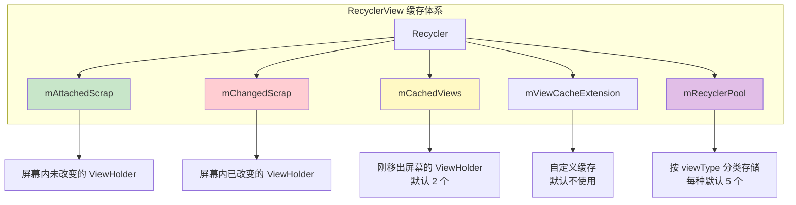

# RecyclerView 进阶篇

> 适合人群：有 RecyclerView 使用经验、准备高级面试
> 目标：深入理解缓存机制、掌握高级用法、能进行性能调优

## 四级缓存机制深入

### 缓存结构全景图



### 各级缓存详解

#### 第一级：Scrap（mAttachedScrap + mChangedScrap）

```kotlin
// 源码位置：RecyclerView.Recycler
ArrayList<ViewHolder> mAttachedScrap = new ArrayList<>();
ArrayList<ViewHolder> mChangedScrap = null;
```

| 类型 | 存储内容 | 触发场景 |
|-----|---------|---------|
| **mAttachedScrap** | 屏幕内未改变的 ViewHolder | `notifyItemMoved()`、布局重新计算 |
| **mChangedScrap** | 屏幕内已改变的 ViewHolder | `notifyItemChanged()` |

**特点**：
- 仅在 layout 过程中临时存储
- 复用时**不需要**重新绑定数据
- layout 结束后会清空或转移到其他缓存

#### 第二级：Cache（mCachedViews）

```kotlin
// 源码位置：RecyclerView.Recycler
final ArrayList<ViewHolder> mCachedViews = new ArrayList<>();
int mViewCacheMax = DEFAULT_CACHE_SIZE; // 默认值 = 2
```

**特点**：
- 默认缓存 **2 个** ViewHolder
- 按**位置（position）**匹配
- 复用时**不需要**重新绑定数据
- 适用于来回滑动的场景

```kotlin
// 修改 Cache 大小
recyclerView.setItemViewCacheSize(4)
```

#### 第三级：ViewCacheExtension（自定义缓存）

```kotlin
// 源码位置：RecyclerView.Recycler
private ViewCacheExtension mViewCacheExtension;

// 自定义实现
abstract class ViewCacheExtension {
    abstract fun getViewForPositionAndType(
        recycler: Recycler,
        position: Int,
        type: Int
    ): View?
}
```

**使用场景**：
- 某些 Item 需要特殊缓存策略
- 如：广告位、固定 Header

#### 第四级：RecycledViewPool

```kotlin
// 源码位置：RecyclerView.RecycledViewPool
public static class RecycledViewPool {
    private static final int DEFAULT_MAX_SCRAP = 5;

    // 按 viewType 分类存储
    SparseArray<ScrapData> mScrap = new SparseArray<>();
}
```

**特点**：
- 按 **viewType** 分类存储
- 每种类型默认最多 **5 个**
- 复用时**需要**重新绑定数据
- **可以跨 RecyclerView 共享**

```kotlin
// 修改某种 viewType 的缓存数量
recyclerView.recycledViewPool.setMaxRecycledViews(VIEW_TYPE_NORMAL, 10)

// 多个 RecyclerView 共享 Pool（如 ViewPager + RecyclerView）
val sharedPool = RecyclerView.RecycledViewPool()
recyclerView1.setRecycledViewPool(sharedPool)
recyclerView2.setRecycledViewPool(sharedPool)
```

### 缓存查找流程（源码级）

```kotlin
// 简化版源码流程
fun tryGetViewHolderForPositionByDeadline(position: Int): ViewHolder? {
    // 1. 从 mChangedScrap 查找（如果是 pre-layout）
    holder = getChangedScrapViewForPosition(position)

    // 2. 从 mAttachedScrap 和 mCachedViews 按 position 查找
    holder = getScrapOrHiddenOrCachedHolderForPosition(position)

    // 3. 从 mAttachedScrap 和 mCachedViews 按 id 查找（如果有 stable id）
    holder = getScrapOrCachedViewForId(id)

    // 4. 从 ViewCacheExtension 查找
    holder = mViewCacheExtension?.getViewForPositionAndType(position, type)

    // 5. 从 RecycledViewPool 查找
    holder = getRecycledViewPool().getRecycledView(type)

    // 6. 都没有，创建新的
    holder = mAdapter.createViewHolder(parent, type)

    return holder
}
```

### 缓存数量配置建议

| 场景 | Cache 大小 | Pool 大小 | 原因 |
|-----|-----------|----------|------|
| 普通列表 | 2（默认） | 5（默认） | 足够应对正常滑动 |
| 快速滑动列表 | 4-5 | 10-15 | 减少 create 次数 |
| ViewPager + RecyclerView | 2 | 共享 Pool，每种 10+ | 页面切换时复用 |
| 复杂 Item（多 viewType） | 2 | 每种 3-5 | 避免内存浪费 |

## 局部刷新与 Payload 机制

### 刷新方法对比

| 方法 | 效果 | 性能 |
|-----|------|------|
| `notifyDataSetChanged()` | 全量刷新 | ❌ 最差 |
| `notifyItemChanged(pos)` | 刷新单个 Item | ⚠️ 整个 Item 重绘 |
| `notifyItemChanged(pos, payload)` | 局部刷新 | ✅ 最优 |
| `submitList()` (ListAdapter) | 自动 Diff | ✅ 推荐 |

### Payload 机制详解

**什么是 Payload？**

Payload 是一个标记，告诉 Adapter "这个 Item 的哪部分变了"，从而只更新变化的部分。

```kotlin
// 定义 Payload 常量
object Payloads {
    const val UPDATE_LIKE_COUNT = "like_count"
    const val UPDATE_AVATAR = "avatar"
}

// 触发局部刷新
adapter.notifyItemChanged(position, Payloads.UPDATE_LIKE_COUNT)
```

**Adapter 中处理 Payload：**

```kotlin
class PostAdapter : ListAdapter<Post, PostViewHolder>(DIFF) {

    // 完整绑定（无 payload 或 payload 为空时调用）
    override fun onBindViewHolder(holder: PostViewHolder, position: Int) {
        holder.bindFull(getItem(position))
    }

    // 局部绑定（有 payload 时调用）
    override fun onBindViewHolder(
        holder: PostViewHolder,
        position: Int,
        payloads: MutableList<Any>
    ) {
        if (payloads.isEmpty()) {
            // 没有 payload，执行完整绑定
            onBindViewHolder(holder, position)
            return
        }

        // 有 payload，执行局部绑定
        val post = getItem(position)
        payloads.forEach { payload ->
            when (payload) {
                Payloads.UPDATE_LIKE_COUNT -> holder.updateLikeCount(post.likeCount)
                Payloads.UPDATE_AVATAR -> holder.updateAvatar(post.avatarUrl)
            }
        }
    }
}

class PostViewHolder(private val binding: ItemPostBinding) : RecyclerView.ViewHolder(binding.root) {

    fun bindFull(post: Post) {
        binding.tvTitle.text = post.title
        binding.tvContent.text = post.content
        binding.tvLikeCount.text = post.likeCount.toString()
        // 加载头像...
    }

    fun updateLikeCount(count: Int) {
        binding.tvLikeCount.text = count.toString()
    }

    fun updateAvatar(url: String) {
        // 只更新头像
    }
}
```

### DiffUtil 与 Payload 结合

```kotlin
private val DIFF = object : DiffUtil.ItemCallback<Post>() {
    override fun areItemsTheSame(oldItem: Post, newItem: Post) =
        oldItem.id == newItem.id

    override fun areContentsTheSame(oldItem: Post, newItem: Post) =
        oldItem == newItem

    // 返回 payload，告诉 Adapter 具体哪里变了
    override fun getChangePayload(oldItem: Post, newItem: Post): Any? {
        val payloads = mutableListOf<String>()

        if (oldItem.likeCount != newItem.likeCount) {
            payloads.add(Payloads.UPDATE_LIKE_COUNT)
        }
        if (oldItem.avatarUrl != newItem.avatarUrl) {
            payloads.add(Payloads.UPDATE_AVATAR)
        }

        return if (payloads.isNotEmpty()) payloads else null
    }
}
```

## ItemDecoration 详解

### 什么是 ItemDecoration？

ItemDecoration 用于给 Item 添加装饰（分割线、间距、背景等），**不修改 Item 布局本身**。

### 核心方法

```kotlin
abstract class ItemDecoration {
    // 1. 设置 Item 的偏移量（留出装饰空间）
    open fun getItemOffsets(
        outRect: Rect,           // 输出：上下左右偏移量
        view: View,              // 当前 Item
        parent: RecyclerView,    // RecyclerView
        state: RecyclerView.State
    ) {}

    // 2. 在 Item 下方绘制（先绘制，会被 Item 遮挡）
    open fun onDraw(
        c: Canvas,
        parent: RecyclerView,
        state: RecyclerView.State
    ) {}

    // 3. 在 Item 上方绘制（后绘制，会遮挡 Item）
    open fun onDrawOver(
        c: Canvas,
        parent: RecyclerView,
        state: RecyclerView.State
    ) {}
}
```

### 绘制顺序

```
1. onDraw()      → 绘制装饰背景
2. Item 绘制     → 绘制列表项
3. onDrawOver()  → 绘制装饰前景（如悬浮 Header）
```

### 实战：自定义分割线

```kotlin
class DividerDecoration(
    private val dividerHeight: Int = 1.dp,
    private val dividerColor: Int = Color.LTGRAY,
    private val marginStart: Int = 0,
    private val marginEnd: Int = 0
) : RecyclerView.ItemDecoration() {

    private val paint = Paint().apply {
        color = dividerColor
        style = Paint.Style.FILL
    }

    override fun getItemOffsets(
        outRect: Rect,
        view: View,
        parent: RecyclerView,
        state: RecyclerView.State
    ) {
        val position = parent.getChildAdapterPosition(view)
        // 最后一个 Item 不加分割线
        if (position < state.itemCount - 1) {
            outRect.bottom = dividerHeight
        }
    }

    override fun onDraw(c: Canvas, parent: RecyclerView, state: RecyclerView.State) {
        val left = parent.paddingLeft + marginStart
        val right = parent.width - parent.paddingRight - marginEnd

        for (i in 0 until parent.childCount - 1) {
            val child = parent.getChildAt(i)
            val params = child.layoutParams as RecyclerView.LayoutParams
            val top = child.bottom + params.bottomMargin
            val bottom = top + dividerHeight

            c.drawRect(left.toFloat(), top.toFloat(), right.toFloat(), bottom.toFloat(), paint)
        }
    }
}

// 使用
recyclerView.addItemDecoration(DividerDecoration(
    dividerHeight = 1.dp,
    dividerColor = Color.parseColor("#E0E0E0"),
    marginStart = 16.dp
))
```

### 实战：悬浮吸顶 Header

```kotlin
class StickyHeaderDecoration(
    private val adapter: StickyHeaderAdapter
) : RecyclerView.ItemDecoration() {

    interface StickyHeaderAdapter {
        fun getHeaderId(position: Int): Long
        fun onCreateHeaderViewHolder(parent: RecyclerView): RecyclerView.ViewHolder
        fun onBindHeaderViewHolder(holder: RecyclerView.ViewHolder, position: Int)
    }

    private var headerView: View? = null
    private var currentHeaderId: Long = -1

    override fun onDrawOver(c: Canvas, parent: RecyclerView, state: RecyclerView.State) {
        val topChild = parent.getChildAt(0) ?: return
        val topPosition = parent.getChildAdapterPosition(topChild)
        if (topPosition == RecyclerView.NO_POSITION) return

        val headerId = adapter.getHeaderId(topPosition)
        if (headerId != currentHeaderId) {
            currentHeaderId = headerId
            // 创建并绑定 Header
            val holder = adapter.onCreateHeaderViewHolder(parent)
            adapter.onBindHeaderViewHolder(holder, topPosition)
            headerView = holder.itemView
            // 测量布局
            measureAndLayoutHeader(parent, headerView!!)
        }

        headerView?.let { header ->
            // 计算 Header 的 Y 偏移（实现推动效果）
            val nextHeaderPosition = findNextHeaderPosition(topPosition)
            val offsetY = if (nextHeaderPosition != -1) {
                val nextChild = parent.findViewHolderForAdapterPosition(nextHeaderPosition)?.itemView
                nextChild?.let {
                    val nextHeaderTop = it.top
                    if (nextHeaderTop < header.height) {
                        (nextHeaderTop - header.height).toFloat()
                    } else 0f
                } ?: 0f
            } else 0f

            c.save()
            c.translate(0f, offsetY)
            header.draw(c)
            c.restore()
        }
    }

    private fun measureAndLayoutHeader(parent: RecyclerView, header: View) {
        val widthSpec = View.MeasureSpec.makeMeasureSpec(parent.width, View.MeasureSpec.EXACTLY)
        val heightSpec = View.MeasureSpec.makeMeasureSpec(0, View.MeasureSpec.UNSPECIFIED)
        header.measure(widthSpec, heightSpec)
        header.layout(0, 0, header.measuredWidth, header.measuredHeight)
    }

    private fun findNextHeaderPosition(currentPosition: Int): Int {
        val currentHeaderId = adapter.getHeaderId(currentPosition)
        for (i in currentPosition + 1 until adapter.itemCount) {
            if (adapter.getHeaderId(i) != currentHeaderId) {
                return i
            }
        }
        return -1
    }
}
```

## ItemAnimator 详解

### 默认动画

RecyclerView 默认使用 `DefaultItemAnimator`，提供以下动画：

| 操作 | 动画效果 |
|-----|---------|
| `notifyItemInserted()` | 淡入 + 下移 |
| `notifyItemRemoved()` | 淡出 + 上移 |
| `notifyItemChanged()` | 交叉淡化 |
| `notifyItemMoved()` | 位移动画 |

### 禁用动画

```kotlin
// 禁用所有动画
recyclerView.itemAnimator = null

// 禁用 change 动画（保留其他）
(recyclerView.itemAnimator as? DefaultItemAnimator)?.supportsChangeAnimations = false
```

### 自定义动画时长

```kotlin
recyclerView.itemAnimator?.apply {
    addDuration = 300
    removeDuration = 300
    moveDuration = 300
    changeDuration = 300
}
```

## SnapHelper 详解

### 什么是 SnapHelper？

SnapHelper 用于控制滑动停止时的对齐方式，常用于实现**分页效果**或**居中对齐**。

### 内置实现

| SnapHelper | 效果 | 使用场景 |
|-----------|------|---------|
| `LinearSnapHelper` | 居中对齐 | 横向滑动选择器 |
| `PagerSnapHelper` | 一次滑动一页 | 类似 ViewPager |

```kotlin
// 居中对齐
LinearSnapHelper().attachToRecyclerView(recyclerView)

// 分页效果
PagerSnapHelper().attachToRecyclerView(recyclerView)
```

### 自定义 SnapHelper

```kotlin
class StartSnapHelper : LinearSnapHelper() {

    override fun calculateDistanceToFinalSnap(
        layoutManager: RecyclerView.LayoutManager,
        targetView: View
    ): IntArray {
        val out = IntArray(2)
        if (layoutManager.canScrollHorizontally()) {
            out[0] = targetView.left - layoutManager.paddingLeft
        }
        if (layoutManager.canScrollVertically()) {
            out[1] = targetView.top - layoutManager.paddingTop
        }
        return out
    }

    override fun findSnapView(layoutManager: RecyclerView.LayoutManager): View? {
        if (layoutManager is LinearLayoutManager) {
            return layoutManager.findViewByPosition(
                layoutManager.findFirstVisibleItemPosition()
            )
        }
        return null
    }
}
```

## ConcatAdapter（多 Adapter 组合）

### 使用场景

- 列表有 Header/Footer
- 不同部分由不同团队维护
- 复用已有 Adapter

### 基本用法

```kotlin
// 添加依赖
implementation "androidx.recyclerview:recyclerview:1.2.0+"

// 组合多个 Adapter
val headerAdapter = HeaderAdapter()
val contentAdapter = ContentAdapter()
val footerAdapter = FooterAdapter()

val concatAdapter = ConcatAdapter(headerAdapter, contentAdapter, footerAdapter)
recyclerView.adapter = concatAdapter
```

### 配置选项

```kotlin
val config = ConcatAdapter.Config.Builder()
    .setIsolateViewTypes(true)  // 隔离 viewType，避免冲突
    .setStableIdMode(ConcatAdapter.Config.StableIdMode.NO_STABLE_IDS)
    .build()

val concatAdapter = ConcatAdapter(config, headerAdapter, contentAdapter)
```

## 性能优化进阶

### 1. Prefetch 预取机制

```kotlin
// 开启预取（默认开启）
(recyclerView.layoutManager as LinearLayoutManager).apply {
    isItemPrefetchEnabled = true
    initialPrefetchItemCount = 4  // 嵌套 RecyclerView 时设置
}
```

### 2. 共享 RecycledViewPool

```kotlin
// ViewPager2 + RecyclerView 场景
class ViewPagerAdapter : RecyclerView.Adapter<PageViewHolder>() {

    private val sharedPool = RecyclerView.RecycledViewPool()

    override fun onBindViewHolder(holder: PageViewHolder, position: Int) {
        holder.recyclerView.setRecycledViewPool(sharedPool)
    }
}
```

### 3. 避免嵌套滑动冲突

```kotlin
// 禁用内层 RecyclerView 的嵌套滑动
innerRecyclerView.isNestedScrollingEnabled = false

// 或者设置固定高度，避免滑动
innerRecyclerView.layoutParams.height = WRAP_CONTENT
innerRecyclerView.isNestedScrollingEnabled = false
```

### 4. 大图列表优化

```kotlin
// 滑动时暂停图片加载
recyclerView.addOnScrollListener(object : RecyclerView.OnScrollListener() {
    override fun onScrollStateChanged(recyclerView: RecyclerView, newState: Int) {
        when (newState) {
            RecyclerView.SCROLL_STATE_IDLE -> Glide.with(context).resumeRequests()
            else -> Glide.with(context).pauseRequests()
        }
    }
})

// 回收时取消加载
override fun onViewRecycled(holder: ViewHolder) {
    Glide.with(holder.itemView).clear(holder.imageView)
}
```

## 常见问题深入

### 图片错位问题

**原因**：异步加载 + 视图复用，旧请求的图片加载到了新 Item 上。

**解决方案**：

```kotlin
override fun onBindViewHolder(holder: ViewHolder, position: Int) {
    // 方案 1：设置 tag 校验
    holder.imageView.tag = position
    loadImage(url) { bitmap ->
        if (holder.imageView.tag == position) {
            holder.imageView.setImageBitmap(bitmap)
        }
    }

    // 方案 2：使用 Glide（自动处理）
    Glide.with(holder.itemView)
        .load(url)
        .into(holder.imageView)
}

override fun onViewRecycled(holder: ViewHolder) {
    // 回收时清除
    Glide.with(holder.itemView).clear(holder.imageView)
}
```

### IndexOutOfBoundsException

**原因**：数据源和 Adapter 不同步。

**解决方案**：

```kotlin
// ❌ 错误：直接修改数据源
dataList.removeAt(0)
adapter.notifyItemRemoved(0)

// ✅ 正确：使用 ListAdapter
adapter.submitList(newList.toList()) // 注意：必须是新 List 对象
```

## 总结

### 进阶知识点清单

| 知识点 | 掌握程度 |
|-------|---------|
| 四级缓存机制 | 理解原理 + 会配置 |
| Payload 局部刷新 | 会使用 + 结合 DiffUtil |
| ItemDecoration | 会自定义分割线和吸顶 |
| ItemAnimator | 会配置和禁用 |
| SnapHelper | 会使用内置 + 简单自定义 |
| ConcatAdapter | 会组合多 Adapter |
| 性能优化 | 预取、共享 Pool、图片优化 |

---

**上一篇**：[基础篇](1-基础篇.md)
**下一篇**：[源码篇](3-源码篇.md) - 绘制流程、LayoutManager 原理、嵌套滑动机制

---
_本文档将持续更新_
