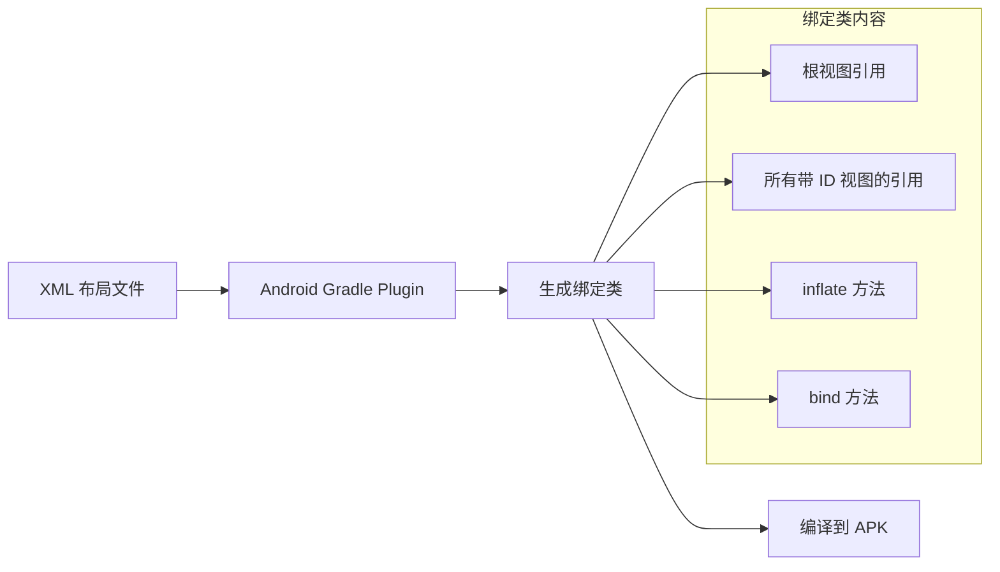
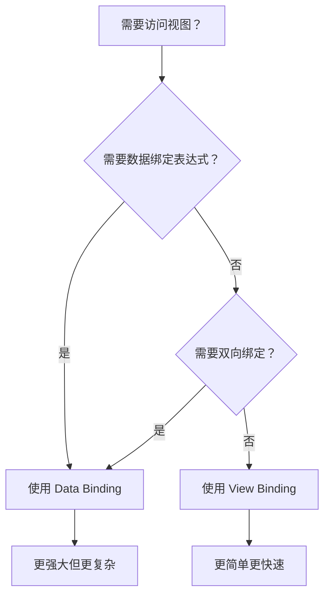

# View Binding（视图绑定）

## 什么是 View Binding？

### 定义
View Binding 是 Android Jetpack 提供的一种特性，它可以让你更轻松地编写与视图交互的代码。在模块中启用 View Binding 后，系统会为该模块中的每个 XML 布局文件生成一个绑定类。绑定类的实例包含对布局中具有 ID 的所有视图的直接引用。

### 通俗理解
想象你在一个大型仓库里找货物。传统的 `findViewById()` 就像是每次都要自己走到仓库里去找对应的货架，费时费力还容易找错。而 View Binding 就像是给你一张精确的货物清单，上面直接标注了每个货物的位置，你可以直接、准确地取到想要的东西，既快速又不会出错。

## 为什么需要 View Binding？

### 传统方式的问题

在 View Binding 出现之前，我们主要使用以下方式访问视图：

#### 1. findViewById（古老但仍在使用）
```kotlin
// 繁琐且不安全
val textView = findViewById<TextView>(R.id.textView)
val button = findViewById<Button>(R.id.button)
```

**问题：**
- 类型不安全：需要手动转换类型，容易出错
- 空指针风险：如果 ID 不存在或拼写错误，运行时才会崩溃
- 代码冗余：每个视图都需要单独查找
- 性能开销：每次调用都会遍历视图树

#### 2. Kotlin Synthetics（已废弃）
```kotlin
// 曾经的 Kotlin Android Extensions
import kotlinx.android.synthetic.main.activity_main.*

// 直接使用
textView.text = "Hello"
```

**问题：**
- 已被官方废弃
- 不支持跨模块引用
- 可能引用到错误布局的视图
- 与 Kotlin 1.8+ 不兼容

#### 3. ButterKnife（第三方库，已停止维护）
```kotlin
@BindView(R.id.textView)
lateinit var textView: TextView
```

**问题：**
- 已停止维护
- 依赖注解处理，增加编译时间
- 需要额外的库依赖

### View Binding 的优势

| 特性 | findViewById | Kotlin Synthetics | ButterKnife | View Binding |
|------|--------------|-------------------|-------------|--------------|
| 空安全 | ❌ | ❌ | ❌ | ✅ |
| 类型安全 | ❌ | ✅ | ✅ | ✅ |
| 编译时检查 | ❌ | ❌ | ✅ | ✅ |
| 官方支持 | ✅ | ❌ | ❌ | ✅ |
| 构建速度 | - | 快 | 慢 | 快 |
| 无需额外依赖 | ✅ | ❌ | ❌ | ✅ |

## 工作原理

### 生成绑定类的过程



### 命名规则

| 布局文件名 | 生成的绑定类名 |
|-----------|---------------|
| `activity_main.xml` | `ActivityMainBinding` |
| `fragment_home.xml` | `FragmentHomeBinding` |
| `item_user.xml` | `ItemUserBinding` |
| `layout_header.xml` | `LayoutHeaderBinding` |

**规则**：将布局文件名转换为 Pascal Case（大驼峰命名法），并添加 `Binding` 后缀。

### 绑定类结构示例

假设有以下布局文件：

```xml
<!-- activity_main.xml -->
<LinearLayout xmlns:android="http://schemas.android.com/apk/res/android"
    android:layout_width="match_parent"
    android:layout_height="match_parent"
    android:orientation="vertical">

    <TextView
        android:id="@+id/textTitle"
        android:layout_width="wrap_content"
        android:layout_height="wrap_content" />

    <Button
        android:id="@+id/buttonSubmit"
        android:layout_width="wrap_content"
        android:layout_height="wrap_content" />

    <!-- 没有 ID 的视图不会生成引用 -->
    <View
        android:layout_width="match_parent"
        android:layout_height="1dp" />

</LinearLayout>
```

系统会自动生成类似以下的绑定类：

```java
// 系统自动生成（简化版，实际实现更复杂）
public final class ActivityMainBinding implements ViewBinding {

    @NonNull
    private final LinearLayout rootView;

    @NonNull
    public final TextView textTitle;

    @NonNull
    public final Button buttonSubmit;

    private ActivityMainBinding(@NonNull LinearLayout rootView,
            @NonNull TextView textTitle, @NonNull Button buttonSubmit) {
        this.rootView = rootView;
        this.textTitle = textTitle;
        this.buttonSubmit = buttonSubmit;
    }

    @Override
    @NonNull
    public LinearLayout getRoot() {
        return rootView;
    }

    @NonNull
    public static ActivityMainBinding inflate(@NonNull LayoutInflater inflater) {
        return inflate(inflater, null, false);
    }

    @NonNull
    public static ActivityMainBinding inflate(@NonNull LayoutInflater inflater,
            @Nullable ViewGroup parent, boolean attachToParent) {
        View root = inflater.inflate(R.layout.activity_main, parent, false);
        if (attachToParent) {
            parent.addView(root);
        }
        return bind(root);
    }

    @NonNull
    public static ActivityMainBinding bind(@NonNull View rootView) {
        // 查找并绑定所有视图
        TextView textTitle = rootView.findViewById(R.id.textTitle);
        Button buttonSubmit = rootView.findViewById(R.id.buttonSubmit);
        return new ActivityMainBinding((LinearLayout) rootView, textTitle, buttonSubmit);
    }
}
```

## 配置与启用

### 启用 View Binding

在模块级 `build.gradle.kts` 中添加：

```kotlin
// build.gradle.kts (Module)
android {
    // ...

    buildFeatures {
        viewBinding = true
    }
}
```

或者在 `build.gradle`（Groovy）中：

```groovy
// build.gradle (Module)
android {
    // ...

    buildFeatures {
        viewBinding true
    }
}
```

### 忽略特定布局文件

如果某个布局文件不需要生成绑定类，可以在根视图添加 `tools:viewBindingIgnore="true"`：

```xml
<LinearLayout xmlns:android="http://schemas.android.com/apk/res/android"
    xmlns:tools="http://schemas.android.com/tools"
    tools:viewBindingIgnore="true"
    android:layout_width="match_parent"
    android:layout_height="match_parent">

    <!-- 此布局不会生成绑定类 -->

</LinearLayout>
```

## 代码示例

### 在 Activity 中使用

```kotlin
class MainActivity : AppCompatActivity() {

    // 声明绑定对象
    private lateinit var binding: ActivityMainBinding

    override fun onCreate(savedInstanceState: Bundle?) {
        super.onCreate(savedInstanceState)

        // 初始化绑定
        binding = ActivityMainBinding.inflate(layoutInflater)

        // 设置内容视图为根视图
        setContentView(binding.root)

        // 直接访问视图，无需 findViewById
        binding.textTitle.text = "欢迎使用 View Binding"

        binding.buttonSubmit.setOnClickListener {
            handleSubmit()
        }
    }

    private fun handleSubmit() {
        // 访问其他视图
        val inputText = binding.editInput.text.toString()
        binding.textResult.text = "你输入了：$inputText"
    }
}
```

### 在 Fragment 中使用

```kotlin
class HomeFragment : Fragment() {

    // 使用可空类型，因为 Fragment 的生命周期特殊
    private var _binding: FragmentHomeBinding? = null

    // 非空的便捷访问属性
    private val binding get() = _binding!!

    override fun onCreateView(
        inflater: LayoutInflater,
        container: ViewGroup?,
        savedInstanceState: Bundle?
    ): View {
        // 初始化绑定
        _binding = FragmentHomeBinding.inflate(inflater, container, false)
        return binding.root
    }

    override fun onViewCreated(view: View, savedInstanceState: Bundle?) {
        super.onViewCreated(view, savedInstanceState)

        // 安全地使用绑定
        binding.textWelcome.text = "Hello Fragment!"
        binding.buttonAction.setOnClickListener {
            performAction()
        }
    }

    override fun onDestroyView() {
        super.onDestroyView()
        // 重要：清除绑定引用，避免内存泄漏
        _binding = null
    }

    private fun performAction() {
        binding.textResult.text = "Action performed!"
    }
}
```

### 在 RecyclerView Adapter 中使用

```kotlin
class UserAdapter(
    private val users: List<User>,
    private val onItemClick: (User) -> Unit
) : RecyclerView.Adapter<UserAdapter.UserViewHolder>() {

    // ViewHolder 持有绑定对象
    class UserViewHolder(
        private val binding: ItemUserBinding
    ) : RecyclerView.ViewHolder(binding.root) {

        fun bind(user: User, onItemClick: (User) -> Unit) {
            binding.textName.text = user.name
            binding.textEmail.text = user.email
            binding.imageAvatar.load(user.avatarUrl)

            binding.root.setOnClickListener {
                onItemClick(user)
            }
        }
    }

    override fun onCreateViewHolder(parent: ViewGroup, viewType: Int): UserViewHolder {
        // 使用 inflate 方法创建绑定
        val binding = ItemUserBinding.inflate(
            LayoutInflater.from(parent.context),
            parent,
            false
        )
        return UserViewHolder(binding)
    }

    override fun onBindViewHolder(holder: UserViewHolder, position: Int) {
        holder.bind(users[position], onItemClick)
    }

    override fun getItemCount(): Int = users.size
}
```

### 使用 include 布局

当布局中包含 `<include>` 标签时：

```xml
<!-- activity_main.xml -->
<LinearLayout xmlns:android="http://schemas.android.com/apk/res/android"
    android:layout_width="match_parent"
    android:layout_height="match_parent"
    android:orientation="vertical">

    <!-- 必须给 include 添加 ID 才能在绑定类中访问 -->
    <include
        android:id="@+id/layoutHeader"
        layout="@layout/layout_header" />

    <TextView
        android:id="@+id/textContent"
        android:layout_width="wrap_content"
        android:layout_height="wrap_content" />

</LinearLayout>
```

```xml
<!-- layout_header.xml -->
<LinearLayout xmlns:android="http://schemas.android.com/apk/res/android"
    android:layout_width="match_parent"
    android:layout_height="wrap_content"
    android:orientation="horizontal">

    <ImageView
        android:id="@+id/imageLogo"
        android:layout_width="48dp"
        android:layout_height="48dp" />

    <TextView
        android:id="@+id/textTitle"
        android:layout_width="wrap_content"
        android:layout_height="wrap_content" />

</LinearLayout>
```

```kotlin
class MainActivity : AppCompatActivity() {

    private lateinit var binding: ActivityMainBinding

    override fun onCreate(savedInstanceState: Bundle?) {
        super.onCreate(savedInstanceState)
        binding = ActivityMainBinding.inflate(layoutInflater)
        setContentView(binding.root)

        // 访问 include 布局中的视图
        // layoutHeader 的类型是 LayoutHeaderBinding
        binding.layoutHeader.textTitle.text = "应用标题"
        binding.layoutHeader.imageLogo.setImageResource(R.drawable.logo)

        // 访问主布局中的视图
        binding.textContent.text = "主要内容"
    }
}
```

### 使用 merge 布局

当使用 `<merge>` 标签时，需要使用 `bind()` 方法：

```xml
<!-- layout_toolbar.xml -->
<merge xmlns:android="http://schemas.android.com/apk/res/android">

    <ImageButton
        android:id="@+id/buttonBack"
        android:layout_width="48dp"
        android:layout_height="48dp" />

    <TextView
        android:id="@+id/textToolbarTitle"
        android:layout_width="wrap_content"
        android:layout_height="wrap_content" />

</merge>
```

```kotlin
class CustomToolbar @JvmOverloads constructor(
    context: Context,
    attrs: AttributeSet? = null,
    defStyleAttr: Int = 0
) : LinearLayout(context, attrs, defStyleAttr) {

    private val binding: LayoutToolbarBinding

    init {
        // 先填充布局
        LayoutInflater.from(context).inflate(R.layout.layout_toolbar, this, true)

        // 使用 bind() 方法绑定
        binding = LayoutToolbarBinding.bind(this)

        // 使用绑定访问视图
        binding.buttonBack.setOnClickListener {
            // 返回逻辑
        }
    }

    fun setTitle(title: String) {
        binding.textToolbarTitle.text = title
    }
}
```

### 在 Dialog 中使用

```kotlin
class CustomDialog(context: Context) : Dialog(context) {

    private lateinit var binding: DialogCustomBinding

    override fun onCreate(savedInstanceState: Bundle?) {
        super.onCreate(savedInstanceState)

        binding = DialogCustomBinding.inflate(layoutInflater)
        setContentView(binding.root)

        binding.textDialogTitle.text = "提示"
        binding.textDialogMessage.text = "这是一个自定义对话框"

        binding.buttonConfirm.setOnClickListener {
            // 确认逻辑
            dismiss()
        }

        binding.buttonCancel.setOnClickListener {
            dismiss()
        }
    }
}
```

### 在 ViewHolder 中使用优化写法

```kotlin
class OptimizedAdapter(
    private val items: List<Item>
) : RecyclerView.Adapter<OptimizedAdapter.ItemViewHolder>() {

    // 使用内联绑定的 ViewHolder
    inner class ItemViewHolder(
        val binding: ItemLayoutBinding
    ) : RecyclerView.ViewHolder(binding.root)

    override fun onCreateViewHolder(parent: ViewGroup, viewType: Int): ItemViewHolder {
        return ItemViewHolder(
            ItemLayoutBinding.inflate(
                LayoutInflater.from(parent.context),
                parent,
                false
            )
        )
    }

    override fun onBindViewHolder(holder: ItemViewHolder, position: Int) {
        val item = items[position]

        // 使用 with 或 apply 简化代码
        with(holder.binding) {
            textTitle.text = item.title
            textDescription.text = item.description
            imageIcon.setImageResource(item.iconRes)

            root.setOnClickListener {
                // 点击处理
            }
        }
    }

    override fun getItemCount(): Int = items.size
}
```

## 最佳实践

### 1. Fragment 中正确处理绑定生命周期

```kotlin
class BestPracticeFragment : Fragment() {

    private var _binding: FragmentBestPracticeBinding? = null
    private val binding get() = _binding!!

    override fun onCreateView(
        inflater: LayoutInflater,
        container: ViewGroup?,
        savedInstanceState: Bundle?
    ): View {
        _binding = FragmentBestPracticeBinding.inflate(inflater, container, false)
        return binding.root
    }

    override fun onDestroyView() {
        super.onDestroyView()
        // 必须清除引用！Fragment 的视图可能被销毁但实例保留
        _binding = null
    }
}
```

### 2. 使用委托简化 Fragment 绑定

```kotlin
// 自定义委托类
class AutoClearedValue<T : Any>(val fragment: Fragment) : ReadWriteProperty<Fragment, T> {

    private var _value: T? = null

    init {
        fragment.lifecycle.addObserver(object : DefaultLifecycleObserver {
            override fun onCreate(owner: LifecycleOwner) {
                fragment.viewLifecycleOwnerLiveData.observe(fragment) { viewLifecycleOwner ->
                    viewLifecycleOwner?.lifecycle?.addObserver(object : DefaultLifecycleObserver {
                        override fun onDestroy(owner: LifecycleOwner) {
                            _value = null
                        }
                    })
                }
            }
        })
    }

    override fun getValue(thisRef: Fragment, property: KProperty<*>): T {
        return _value ?: throw IllegalStateException(
            "should never call auto-cleared-value get when it might not be available"
        )
    }

    override fun setValue(thisRef: Fragment, property: KProperty<*>, value: T) {
        _value = value
    }
}

// 使用扩展函数
fun <T : Any> Fragment.autoCleared() = AutoClearedValue<T>(this)

// 在 Fragment 中使用
class SimpleFragment : Fragment() {

    // 自动在 onDestroyView 时清除
    private var binding by autoCleared<FragmentSimpleBinding>()

    override fun onCreateView(
        inflater: LayoutInflater,
        container: ViewGroup?,
        savedInstanceState: Bundle?
    ): View {
        binding = FragmentSimpleBinding.inflate(inflater, container, false)
        return binding.root
    }
}
```

### 3. 封装基类简化使用

```kotlin
// 基类 Activity
abstract class BaseActivity<VB : ViewBinding> : AppCompatActivity() {

    protected lateinit var binding: VB
        private set

    abstract fun inflateBinding(layoutInflater: LayoutInflater): VB

    override fun onCreate(savedInstanceState: Bundle?) {
        super.onCreate(savedInstanceState)
        binding = inflateBinding(layoutInflater)
        setContentView(binding.root)
    }
}

// 使用基类
class HomeActivity : BaseActivity<ActivityHomeBinding>() {

    override fun inflateBinding(layoutInflater: LayoutInflater): ActivityHomeBinding {
        return ActivityHomeBinding.inflate(layoutInflater)
    }

    override fun onCreate(savedInstanceState: Bundle?) {
        super.onCreate(savedInstanceState)

        // 直接使用 binding
        binding.textWelcome.text = "Welcome!"
    }
}
```

```kotlin
// 基类 Fragment
abstract class BaseFragment<VB : ViewBinding> : Fragment() {

    private var _binding: VB? = null
    protected val binding get() = _binding!!

    abstract fun inflateBinding(inflater: LayoutInflater, container: ViewGroup?): VB

    override fun onCreateView(
        inflater: LayoutInflater,
        container: ViewGroup?,
        savedInstanceState: Bundle?
    ): View {
        _binding = inflateBinding(inflater, container)
        return binding.root
    }

    override fun onDestroyView() {
        super.onDestroyView()
        _binding = null
    }
}

// 使用基类
class ProfileFragment : BaseFragment<FragmentProfileBinding>() {

    override fun inflateBinding(
        inflater: LayoutInflater,
        container: ViewGroup?
    ): FragmentProfileBinding {
        return FragmentProfileBinding.inflate(inflater, container, false)
    }

    override fun onViewCreated(view: View, savedInstanceState: Bundle?) {
        super.onViewCreated(view, savedInstanceState)

        binding.textUserName.text = "用户名"
    }
}
```

### 4. 配合 ViewModel 使用

```kotlin
class UserFragment : Fragment() {

    private var _binding: FragmentUserBinding? = null
    private val binding get() = _binding!!

    private val viewModel: UserViewModel by viewModels()

    override fun onCreateView(
        inflater: LayoutInflater,
        container: ViewGroup?,
        savedInstanceState: Bundle?
    ): View {
        _binding = FragmentUserBinding.inflate(inflater, container, false)
        return binding.root
    }

    override fun onViewCreated(view: View, savedInstanceState: Bundle?) {
        super.onViewCreated(view, savedInstanceState)

        // 观察 ViewModel 数据
        viewModel.user.observe(viewLifecycleOwner) { user ->
            binding.textName.text = user.name
            binding.textEmail.text = user.email
        }

        viewModel.loading.observe(viewLifecycleOwner) { isLoading ->
            binding.progressBar.isVisible = isLoading
            binding.contentGroup.isVisible = !isLoading
        }

        // 绑定点击事件
        binding.buttonRefresh.setOnClickListener {
            viewModel.refreshUser()
        }
    }

    override fun onDestroyView() {
        super.onDestroyView()
        _binding = null
    }
}
```

## View Binding vs Data Binding

| 特性 | View Binding | Data Binding |
|------|-------------|--------------|
| 编译速度 | 快 | 较慢 |
| 功能范围 | 仅视图引用 | 数据绑定、表达式、双向绑定 |
| 学习曲线 | 简单 | 较复杂 |
| 布局标签 | 无需修改 | 需要 `<layout>` 标签 |
| 空安全 | ✅ | ✅ |
| 类型安全 | ✅ | ✅ |
| 表达式支持 | ❌ | ✅ |
| 双向绑定 | ❌ | ✅ |
| 适用场景 | 简单视图访问 | 复杂数据绑定场景 |

### 选择建议



**推荐**：
- 如果只需要替代 `findViewById()`，使用 **View Binding**
- 如果需要在布局中绑定数据、使用表达式或双向绑定，使用 **Data Binding**
- 两者可以在同一项目中共存

## 常见问题与解决方案

### 1. 绑定类未生成

**问题**：启用 View Binding 后，找不到生成的绑定类

**解决方案**：
```kotlin
// 1. 确保在正确的模块启用了 View Binding
android {
    buildFeatures {
        viewBinding = true
    }
}

// 2. 同步 Gradle 并重新构建项目
// Build -> Rebuild Project

// 3. 检查布局文件是否有语法错误

// 4. 确保导入正确的包
import com.yourpackage.databinding.ActivityMainBinding
```

### 2. Fragment 内存泄漏

**问题**：Fragment 的绑定对象导致内存泄漏

**解决方案**：
```kotlin
class CorrectFragment : Fragment() {

    // 使用可空类型
    private var _binding: FragmentCorrectBinding? = null
    private val binding get() = _binding!!

    override fun onCreateView(
        inflater: LayoutInflater,
        container: ViewGroup?,
        savedInstanceState: Bundle?
    ): View {
        _binding = FragmentCorrectBinding.inflate(inflater, container, false)
        return binding.root
    }

    // 关键：在 onDestroyView 中清除引用
    override fun onDestroyView() {
        super.onDestroyView()
        _binding = null
    }
}
```

### 3. include 布局没有 ID

**问题**：无法访问 include 布局中的视图

**解决方案**：
```xml
<!-- 错误：没有 ID -->
<include layout="@layout/layout_header" />

<!-- 正确：添加 ID -->
<include
    android:id="@+id/header"
    layout="@layout/layout_header" />
```

### 4. 使用 merge 标签的布局

**问题**：`<merge>` 布局没有生成 `inflate()` 方法

**解决方案**：
```kotlin
// merge 布局需要使用 bind() 方法
class CustomView @JvmOverloads constructor(
    context: Context,
    attrs: AttributeSet? = null
) : FrameLayout(context, attrs) {

    private val binding: LayoutMergeBinding

    init {
        // 先填充布局
        LayoutInflater.from(context).inflate(R.layout.layout_merge, this, true)
        // 再绑定
        binding = LayoutMergeBinding.bind(this)
    }
}
```

### 5. 可空视图处理

当布局中有视图设置了 `tools:viewBindingType` 或视图 ID 在某些配置中不存在时：

```kotlin
// 对于可能不存在的视图，使用安全调用
binding.optionalView?.let { view ->
    view.text = "Optional content"
}

// 或使用 Elvis 操作符
binding.optionalView?.visibility = View.VISIBLE ?: return
```

## 性能考虑

### 1. 编译时间

View Binding 在编译时生成代码，对构建时间的影响很小（比 Data Binding 快得多）。

### 2. 运行时性能

```kotlin
// View Binding 内部使用 findViewById，但只在 inflate/bind 时调用一次
// 之后的访问都是直接引用，没有额外开销

// 等效于手写的优化代码：
class ManualBinding(view: View) {
    val textTitle: TextView = view.findViewById(R.id.textTitle)
    val buttonSubmit: Button = view.findViewById(R.id.buttonSubmit)
}
```

### 3. 内存占用

- 每个绑定实例持有对所有带 ID 视图的引用
- 在 Fragment 中需要及时清除引用避免泄漏
- 相比 `findViewById` 每次查找，内存占用略高但可接受

## 兼容性说明

### 版本要求

- **Android Gradle Plugin**：3.6.0 及以上
- **Android Studio**：3.6 及以上
- **Gradle**：5.6.4 及以上

### 依赖配置

```kotlin
// build.gradle.kts (Project)
plugins {
    id("com.android.application") version "8.2.0" apply false
    id("org.jetbrains.kotlin.android") version "1.9.22" apply false
}

// build.gradle.kts (Module)
android {
    compileSdk = 34

    buildFeatures {
        viewBinding = true
    }
}
```

### 与其他技术的兼容性

| 技术 | 兼容性 | 说明 |
|------|--------|------|
| Kotlin | ✅ | 完全兼容 |
| Java | ✅ | 完全兼容 |
| Jetpack Compose | ✅ | 可以在同一项目中使用 |
| Data Binding | ✅ | 可以共存 |
| Navigation Component | ✅ | 完全兼容 |
| LiveData/ViewModel | ✅ | 推荐配合使用 |

## 迁移指南

### 从 findViewById 迁移

```kotlin
// 迁移前
class OldActivity : AppCompatActivity() {

    private lateinit var textTitle: TextView
    private lateinit var buttonSubmit: Button

    override fun onCreate(savedInstanceState: Bundle?) {
        super.onCreate(savedInstanceState)
        setContentView(R.layout.activity_old)

        textTitle = findViewById(R.id.textTitle)
        buttonSubmit = findViewById(R.id.buttonSubmit)

        textTitle.text = "Hello"
        buttonSubmit.setOnClickListener { /* ... */ }
    }
}

// 迁移后
class NewActivity : AppCompatActivity() {

    private lateinit var binding: ActivityNewBinding

    override fun onCreate(savedInstanceState: Bundle?) {
        super.onCreate(savedInstanceState)
        binding = ActivityNewBinding.inflate(layoutInflater)
        setContentView(binding.root)

        binding.textTitle.text = "Hello"
        binding.buttonSubmit.setOnClickListener { /* ... */ }
    }
}
```

### 从 Kotlin Synthetics 迁移

```kotlin
// 迁移前（Kotlin Synthetics - 已废弃）
import kotlinx.android.synthetic.main.activity_old.*

class OldActivity : AppCompatActivity() {
    override fun onCreate(savedInstanceState: Bundle?) {
        super.onCreate(savedInstanceState)
        setContentView(R.layout.activity_old)

        textTitle.text = "Hello"
        buttonSubmit.setOnClickListener { /* ... */ }
    }
}

// 迁移后
class NewActivity : AppCompatActivity() {

    private lateinit var binding: ActivityNewBinding

    override fun onCreate(savedInstanceState: Bundle?) {
        super.onCreate(savedInstanceState)
        binding = ActivityNewBinding.inflate(layoutInflater)
        setContentView(binding.root)

        binding.textTitle.text = "Hello"
        binding.buttonSubmit.setOnClickListener { /* ... */ }
    }
}
```

## 总结

View Binding 是 Android 官方推荐的视图访问方式，相比传统的 `findViewById()` 和已废弃的 Kotlin Synthetics，它提供了：

1. **类型安全**：编译时检查，避免类型转换错误
2. **空安全**：生成的绑定类保证非空引用（除非使用可选配置）
3. **简洁高效**：减少样板代码，提高开发效率
4. **性能优良**：编译时生成，运行时开销小
5. **官方支持**：由 Google 官方维护，长期稳定

### 使用建议

- **新项目**：直接使用 View Binding
- **现有项目**：逐步迁移，优先迁移新功能模块
- **复杂场景**：配合 ViewModel 和 LiveData 使用
- **Fragment**：务必在 `onDestroyView()` 中清除绑定引用
- **自定义 View**：使用 `bind()` 方法处理 `<merge>` 布局

View Binding 是现代 Android 开发的基础工具之一，掌握它将显著提升开发效率和代码质量。

---
_本文档持续更新，添加更多相关内容_
