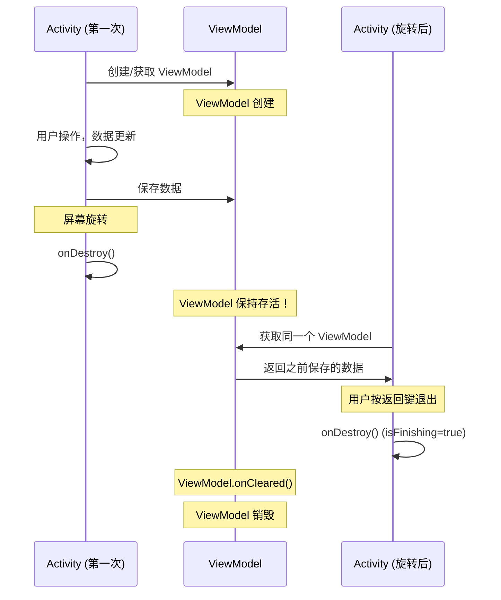

# ViewModel（androidx.lifecycle.ViewModel）

## 什么是 ViewModel？

### 定义

ViewModel 是 Android Jetpack 架构组件之一，专门用于以生命周期感知的方式存储和管理 UI 相关数据。ViewModel 的核心特性是：**在配置变更（如屏幕旋转）时不会被销毁**，从而保留其中的数据。

### 通俗理解

想象你在填写一个表单，突然需要旋转手机查看横屏效果。如果没有 ViewModel，旋转后 Activity 重建，表单数据全部丢失，用户需要重新填写。而有了 ViewModel，就像把表单数据暂存在一个"保险箱"里，Activity 重建后直接从保险箱取出，数据完好无损。

## 为什么需要 ViewModel？

### 核心问题：配置变更导致数据丢失

```
┌─────────────────────────────────────────────────────────────────┐
│                     没有 ViewModel 的情况                        │
├─────────────────────────────────────────────────────────────────┤
│                                                                 │
│  Activity (竖屏)           屏幕旋转          Activity (横屏)     │
│  ┌─────────────┐                            ┌─────────────┐     │
│  │ userData    │   ────────────────────►    │ userData    │     │
│  │ = "张三"    │        onDestroy()         │ = null ❌   │     │
│  │             │        onCreate()          │             │     │
│  └─────────────┘                            └─────────────┘     │
│                                                                 │
│  数据随 Activity 销毁而丢失！                                     │
└─────────────────────────────────────────────────────────────────┘
```

```
┌─────────────────────────────────────────────────────────────────┐
│                     使用 ViewModel 的情况                        │
├─────────────────────────────────────────────────────────────────┤
│                                                                 │
│                     ┌─────────────────┐                         │
│                     │    ViewModel    │                         │
│                     │  userData="张三" │                         │
│                     └────────┬────────┘                         │
│                              │                                  │
│         ┌────────────────────┼────────────────────┐             │
│         │                    │                    │             │
│         ▼                    │                    ▼             │
│  Activity (竖屏)           屏幕旋转          Activity (横屏)     │
│  ┌─────────────┐                            ┌─────────────┐     │
│  │ 引用        │   ────────────────────►    │ 引用        │     │
│  │ ViewModel   │        Activity 重建       │ 同一个      │     │
│  │             │        ViewModel 保留      │ ViewModel   │     │
│  └─────────────┘                            └─────────────┘     │
│                                                                 │
│  数据安全保留！✅                                                 │
└─────────────────────────────────────────────────────────────────┘
```

### 传统解决方案的问题


| 方案                        | 问题                        |
| ------------------------- | ------------------------- |
| `onSaveInstanceState()`   | 只能保存少量数据，需要序列化/反序列化，有大小限制 |
| `setRetainInstance(true)` | 仅 Fragment 可用，API 已废弃     |
| 静态变量                      | 内存泄漏风险，难以管理生命周期           |
| 持久化存储                     | 性能开销大，不适合临时 UI 状态         |


### ViewModel 的优势


| 特性         | 说明                                  |
| ---------- | ----------------------------------- |
| **生命周期感知** | 自动在正确的时机清理资源                        |
| **配置变更存活** | 屏幕旋转、语言切换等不丢失数据                     |
| **数据共享**   | Activity 与 Fragment、Fragment 之间共享数据 |
| **职责分离**   | UI 控制器专注 UI，ViewModel 管理数据          |
| **可测试性**   | 业务逻辑与 UI 分离，便于单元测试                  |


## ViewModel 生命周期

### 生命周期对比图



### ViewModel 存活范围

```
┌──────────────────────────────────────────────────────────────────────┐
│                       ViewModel 生命周期范围                          │
├──────────────────────────────────────────────────────────────────────┤
│                                                                      │
│  Activity 生命周期：                                                  │
│  onCreate ──► onStart ──► onResume ──► onPause ──► onStop            │
│       │                                                │             │
│       │          屏幕旋转                              │             │
│       │         ◄────────                             │             │
│       │              │                                │             │
│       ▼              ▼                                ▼             │
│  onCreate ──► onStart ──► onResume ──► onPause ──► onStop           │
│                                                        │             │
│                                                        │             │
│                                            用户按返回键退出           │
│                                                        │             │
│                                                        ▼             │
│                                                    onDestroy         │
│                                                        │             │
│  ┌─────────────────────────────────────────────────────┼───────────┐ │
│  │                    ViewModel 存活区间               │           │ │
│  │ ════════════════════════════════════════════════════╪═══════════│ │
│  │                                              onCleared() 调用   │ │
│  └─────────────────────────────────────────────────────────────────┘ │
│                                                                      │
└──────────────────────────────────────────────────────────────────────┘
```

### 关键时间点


| 事件                        | ViewModel 状态                       |
| ------------------------- | ---------------------------------- |
| Activity 首次创建             | ViewModel 创建（如果不存在）                |
| 配置变更（旋转等）                 | ViewModel **保持存活**                 |
| Activity 正常销毁（finish/返回键） | `onCleared()` 调用，ViewModel 销毁      |
| 进程被杀死                     | ViewModel 销毁（需配合 SavedStateHandle） |


## 代码示例

### 基础用法

```kotlin
// 1. 定义 ViewModel
class UserViewModel : ViewModel() {

    // 使用 MutableLiveData 存储可变数据
    private val _userName = MutableLiveData<String>()
    val userName: LiveData<String> = _userName

    private val _loading = MutableLiveData<Boolean>()
    val loading: LiveData<Boolean> = _loading

    fun updateUserName(name: String) {
        _userName.value = name
    }

    fun loadUser() {
        viewModelScope.launch {
            _loading.value = true
            // 模拟网络请求
            delay(1000)
            _userName.value = "张三"
            _loading.value = false
        }
    }

    // ViewModel 被清理时调用
    override fun onCleared() {
        super.onCleared()
        // 清理资源：取消网络请求、关闭数据库连接等
        Log.d("UserViewModel", "ViewModel is being cleared")
    }
}

// 2. 在 Activity 中使用
class UserActivity : AppCompatActivity() {

    // 使用 by viewModels() 委托创建 ViewModel
    private val viewModel: UserViewModel by viewModels()

    override fun onCreate(savedInstanceState: Bundle?) {
        super.onCreate(savedInstanceState)
        setContentView(R.layout.activity_user)

        // 观察数据变化
        viewModel.userName.observe(this) { name ->
            binding.textUserName.text = name
        }

        viewModel.loading.observe(this) { isLoading ->
            binding.progressBar.isVisible = isLoading
        }

        // 触发数据加载
        viewModel.loadUser()
    }
}
```

### 在 Fragment 中使用

```kotlin
class ProfileFragment : Fragment() {

    // Fragment 作用域的 ViewModel
    private val viewModel: ProfileViewModel by viewModels()

    // 与 Activity 共享的 ViewModel
    private val sharedViewModel: SharedViewModel by activityViewModels()

    override fun onViewCreated(view: View, savedInstanceState: Bundle?) {
        super.onViewCreated(view, savedInstanceState)

        // 使用 viewLifecycleOwner 而不是 this
        viewModel.profile.observe(viewLifecycleOwner) { profile ->
            binding.textName.text = profile.name
        }

        sharedViewModel.selectedItem.observe(viewLifecycleOwner) { item ->
            // 处理共享数据
        }
    }
}
```

### 带构造参数的 ViewModel

```kotlin
// 1. 需要依赖的 ViewModel
class ProductViewModel(
    private val productId: String,
    private val repository: ProductRepository
) : ViewModel() {

    private val _product = MutableLiveData<Product>()
    val product: LiveData<Product> = _product

    init {
        loadProduct()
    }

    private fun loadProduct() {
        viewModelScope.launch {
            _product.value = repository.getProduct(productId)
        }
    }
}

// 2. 自定义 ViewModelProvider.Factory
class ProductViewModelFactory(
    private val productId: String,
    private val repository: ProductRepository
) : ViewModelProvider.Factory {

    override fun <T : ViewModel> create(modelClass: Class<T>): T {
        if (modelClass.isAssignableFrom(ProductViewModel::class.java)) {
            @Suppress("UNCHECKED_CAST")
            return ProductViewModel(productId, repository) as T
        }
        throw IllegalArgumentException("Unknown ViewModel class")
    }
}

// 3. 在 Activity/Fragment 中使用
class ProductActivity : AppCompatActivity() {

    private val viewModel: ProductViewModel by viewModels {
        ProductViewModelFactory(
            productId = intent.getStringExtra("product_id") ?: "",
            repository = ProductRepository()
        )
    }
}
```

### 使用 SavedStateHandle（进程恢复）

```kotlin
// SavedStateHandle 可以在进程被杀死后恢复数据
class SearchViewModel(
    private val savedStateHandle: SavedStateHandle
) : ViewModel() {

    // 直接从 SavedStateHandle 获取 LiveData
    val searchQuery: LiveData<String> = savedStateHandle.getLiveData("query", "")

    fun setSearchQuery(query: String) {
        savedStateHandle["query"] = query
    }

    // 也可以获取普通值
    fun getCurrentQuery(): String {
        return savedStateHandle["query"] ?: ""
    }
}

// 使用时，系统会自动注入 SavedStateHandle
class SearchActivity : AppCompatActivity() {

    // 无需自定义 Factory，系统自动处理
    private val viewModel: SearchViewModel by viewModels()
}
```

### Fragment 之间共享数据

```kotlin
// 共享的 ViewModel
class SharedViewModel : ViewModel() {

    private val _selectedItem = MutableLiveData<Item>()
    val selectedItem: LiveData<Item> = _selectedItem

    fun selectItem(item: Item) {
        _selectedItem.value = item
    }
}

// 列表 Fragment
class ListFragment : Fragment() {

    // 获取 Activity 作用域的 ViewModel
    private val sharedViewModel: SharedViewModel by activityViewModels()

    override fun onViewCreated(view: View, savedInstanceState: Bundle?) {
        super.onViewCreated(view, savedInstanceState)

        adapter.setOnItemClickListener { item ->
            // 更新共享数据
            sharedViewModel.selectItem(item)
        }
    }
}

// 详情 Fragment
class DetailFragment : Fragment() {

    private val sharedViewModel: SharedViewModel by activityViewModels()

    override fun onViewCreated(view: View, savedInstanceState: Bundle?) {
        super.onViewCreated(view, savedInstanceState)

        // 观察共享数据
        sharedViewModel.selectedItem.observe(viewLifecycleOwner) { item ->
            binding.textTitle.text = item.title
            binding.textContent.text = item.content
        }
    }
}
```

## 底层实现原理

> 这部分用大白话讲清楚 ViewModel 是如何实现的，为什么它能在屏幕旋转时保留数据。

### 先搞清楚一个核心问题

**问题：AActivity 和 BActivity 都用 `UserViewModel`，为什么它们拿到的不是同一个 ViewModel？**

答案很简单：**每个 Activity 都有自己独立的"抽屉"（ViewModelStore），ViewModel 是放在抽屉里的**。

```
┌─────────────────────────────────────────────────────────────────────────────┐
│                     为什么不同 Activity 的 ViewModel 不共享？                │
├─────────────────────────────────────────────────────────────────────────────┤
│                                                                             │
│   AActivity                              BActivity                          │
│   ┌──────────────────────┐               ┌──────────────────────┐           │
│   │                      │               │                      │           │
│   │   ViewModelStore     │               │   ViewModelStore     │           │
│   │   (A的抽屉)          │               │   (B的抽屉)          │           │
│   │   ┌────────────────┐ │               │   ┌────────────────┐ │           │
│   │   │ key: "UserVM"  │ │               │   │ key: "UserVM"  │ │           │
│   │   │ val: 实例1     │ │               │   │ val: 实例2     │ │           │
│   │   │ data="张三"    │ │               │   │ data="李四"    │ │           │
│   │   └────────────────┘ │               │   └────────────────┘ │           │
│   │                      │               │                      │           │
│   └──────────────────────┘               └──────────────────────┘           │
│                                                                             │
│   虽然 key 都是 "UserViewModel"，但它们在不同的抽屉里！                      │
│   所以是两个完全独立的 ViewModel 实例。                                      │
│                                                                             │
└─────────────────────────────────────────────────────────────────────────────┘
```

**大白话总结**：

- `ViewModelStore` 就是一个 HashMap（可以理解为抽屉）
- key 是 ViewModel 的类名，value 是 ViewModel 实例
- **每个 Activity 有自己独立的 ViewModelStore**
- 所以即使 key 相同，不同 Activity 拿到的也是不同的实例

---

### 第一步：理解 ViewModelStore（抽屉）

```kotlin
// ViewModelStore 源码超级简单，就是一个 HashMap 的封装
public class ViewModelStore {
    // 就是一个 HashMap，key 是字符串，value 是 ViewModel
    private final HashMap<String, ViewModel> mMap = new HashMap<>();

    // 放入 ViewModel
    final void put(String key, ViewModel viewModel) {
        mMap.put(key, viewModel);
    }

    // 取出 ViewModel
    final ViewModel get(String key) {
        return mMap.get(key);
    }

    // 清空所有 ViewModel（Activity 真正销毁时调用）
    public final void clear() {
        for (ViewModel vm : mMap.values()) {
            vm.onCleared();  // 通知 ViewModel 要被清理了
        }
        mMap.clear();
    }
}
```

**大白话**：ViewModelStore 就是一个装 ViewModel 的容器，没啥复杂的。

---

### 第二步：ViewModel 是怎么被创建和获取的？

当你写 `by viewModels()` 时，背后发生了什么？

```
┌─────────────────────────────────────────────────────────────────────────────┐
│                       获取 ViewModel 的流程（大白话版）                       │
├─────────────────────────────────────────────────────────────────────────────┤
│                                                                             │
│   你的代码：val viewModel: UserViewModel by viewModels()                    │
│                           │                                                 │
│                           ▼                                                 │
│   ┌─────────────────────────────────────────────────────────────────────┐   │
│   │  第一步：找到这个 Activity 的抽屉（ViewModelStore）                  │   │
│   │         activity.getViewModelStore()                                │   │
│   └─────────────────────────────────────────────────────────────────────┘   │
│                           │                                                 │
│                           ▼                                                 │
│   ┌─────────────────────────────────────────────────────────────────────┐   │
│   │  第二步：用类名作为 key，去抽屉里找                                  │   │
│   │         key = "UserViewModel"                                       │   │
│   │         viewModel = store.get(key)                                  │   │
│   └─────────────────────────────────────────────────────────────────────┘   │
│                           │                                                 │
│               ┌───────────┴───────────┐                                     │
│               │                       │                                     │
│               ▼                       ▼                                     │
│         找到了！                  没找到！                                   │
│         直接返回                  ┌─────────────────────────────────────┐   │
│                                  │ 第三步：创建新的 ViewModel          │   │
│                                  │        new UserViewModel()          │   │
│                                  │                                     │   │
│                                  │ 第四步：放进抽屉里                  │   │
│                                  │        store.put(key, viewModel)   │   │
│                                  │                                     │   │
│                                  │ 第五步：返回这个新创建的            │   │
│                                  └─────────────────────────────────────┘   │
│                                                                             │
└─────────────────────────────────────────────────────────────────────────────┘
```

对应的源码：

```kotlin
// ViewModelProvider 的核心逻辑
public <T extends ViewModel> T get(Class<T> modelClass) {
    // 用类名生成 key
    String key = "androidx.lifecycle.ViewModelProvider.DefaultKey:"
                 + modelClass.getCanonicalName();

    // 先从抽屉里找
    ViewModel viewModel = store.get(key);

    if (viewModel != null) {
        // 找到了，直接返回（这就是为什么同一个 Activity 多次获取是同一个实例）
        return (T) viewModel;
    }

    // 没找到，创建一个新的
    viewModel = factory.create(modelClass);

    // 放进抽屉
    store.put(key, viewModel);

    return (T) viewModel;
}
```

---

### 第三步：核心问题 —— 屏幕旋转时 ViewModel 为什么不丢？

这是最核心的部分！Android 系统提供了一对方法来处理配置变更：


| 方法                                   | 谁调用的           | 什么时候调用                | 干什么用        |
| ------------------------------------ | -------------- | --------------------- | ----------- |
| `onRetainNonConfigurationInstance()` | **Android 系统** | Activity 因配置变更**销毁前** | 让你返回需要保留的对象 |
| `getLastNonConfigurationInstance()`  | **你的代码**       | 新 Activity **创建后**    | 获取之前保留的对象   |


**大白话**：

- 屏幕旋转时，系统会销毁旧 Activity，创建新 Activity
- 销毁前，系统问旧 Activity："有什么东西要保留吗？" → 调用 `onRetainNonConfigurationInstance()`
- 旧 Activity 说："有！我的 ViewModelStore（抽屉）要保留！" → 返回 ViewModelStore
- 系统把这个抽屉暂时存起来
- 新 Activity 创建后，调用 `getLastNonConfigurationInstance()` 拿回这个抽屉
- 所以新 Activity 的抽屉和旧 Activity 是**同一个**，里面的 ViewModel 自然还在！

```
┌─────────────────────────────────────────────────────────────────────────────┐
│                      屏幕旋转时的完整流程（时间线）                           │
├─────────────────────────────────────────────────────────────────────────────┤
│                                                                             │
│  时间 ──────────────────────────────────────────────────────────────────►   │
│                                                                             │
│  ┌─────────┐                                           ┌─────────┐         │
│  │旧Activity│                                           │新Activity│         │
│  └────┬────┘                                           └────┬────┘         │
│       │                                                     │              │
│       │ ① 用户旋转屏幕                                       │              │
│       │                                                     │              │
│       │ ② 系统检测到配置变更，准备销毁旧 Activity             │              │
│       │                                                     │              │
│       │ ③ 系统调用 onRetainNonConfigurationInstance()       │              │
│       │   ┌─────────────────────────────────────────┐       │              │
│       │   │ "有东西要保留吗？"                        │       │              │
│       │   │                                         │       │              │
│       │   │ 旧Activity: "有！我的ViewModelStore！"  │       │              │
│       │   │                                         │       │              │
│       │   │ 返回: { viewModelStore: 抽屉 }          │       │              │
│       │   └─────────────────────────────────────────┘       │              │
│       │                     │                               │              │
│       │                     ▼                               │              │
│       │         ┌─────────────────────┐                     │              │
│       │         │   系统暂存区         │                     │              │
│       │         │  (保管这个抽屉)     │                     │              │
│       │         └─────────────────────┘                     │              │
│       │                     │                               │              │
│       │ ④ 旧 Activity 销毁 (onDestroy)                      │              │
│       │   但是！isChangingConfigurations() == true          │              │
│       │   所以不会清空 ViewModelStore                        │              │
│       ×                     │                               │              │
│                             │                               │              │
│                             │     ⑤ 新 Activity 创建        │              │
│                             │                               │              │
│                             │     ⑥ 新 Activity 需要 ViewModel              │
│                             │        调用 getViewModelStore()               │
│                             │                               │              │
│                             │     ⑦ 内部调用 getLastNonConfigurationInstance()
│                             │        ┌─────────────────────────────────────┐
│                             │        │ "之前有保留什么东西吗？"             │
│                             │        │                                     │
│                             └───────►│ 系统: "有！给你之前那个抽屉！"       │
│                                      │                                     │
│                                      │ 返回: { viewModelStore: 同一个抽屉 }│
│                                      └─────────────────────────────────────┘
│                                                             │              │
│                                      ⑧ 新 Activity 拿到的是同一个抽屉      │
│                                         里面的 ViewModel 还在！            │
│                                                             │              │
│                                                             ▼              │
│                                                      数据完好无损 ✅       │
│                                                                             │
└─────────────────────────────────────────────────────────────────────────────┘
```

---

### 第四步：看看源码是怎么实现的

```kotlin
// ComponentActivity 的实现（简化版，但逻辑完整）
public class ComponentActivity extends Activity {

    // 这个 Activity 的抽屉
    private ViewModelStore mViewModelStore;

    // 获取抽屉（这个方法在你调用 by viewModels() 时会被触发）
    public ViewModelStore getViewModelStore() {
        if (mViewModelStore == null) {
            // 先看看系统有没有帮我们保留之前的抽屉
            NonConfigurationInstances nc =
                (NonConfigurationInstances) getLastNonConfigurationInstance();

            if (nc != null && nc.viewModelStore != null) {
                // 太好了！系统保留了之前的抽屉，直接用！
                mViewModelStore = nc.viewModelStore;
            } else {
                // 没有保留的，创建一个新抽屉
                mViewModelStore = new ViewModelStore();
            }
        }
        return mViewModelStore;
    }

    // 系统在配置变更时会调用这个方法
    // 注意：这个方法是系统调用的！不是你调用的！
    @Override
    public final Object onRetainNonConfigurationInstance() {
        // 把抽屉包装一下返回给系统
        NonConfigurationInstances nci = new NonConfigurationInstances();
        nci.viewModelStore = mViewModelStore;
        return nci;  // 系统会帮我们保管这个
    }

    // Activity 销毁时
    @Override
    protected void onDestroy() {
        super.onDestroy();

        // 关键判断！
        if (isChangingConfigurations()) {
            // 是配置变更导致的销毁（比如旋转屏幕）
            // 不清空抽屉！因为待会新 Activity 还要用！
        } else {
            // 是真正的销毁（比如用户按返回键）
            // 清空抽屉，调用所有 ViewModel 的 onCleared()
            if (mViewModelStore != null) {
                mViewModelStore.clear();
            }
        }
    }
}
```

---

### 整体流程图（一图看懂）

```
┌─────────────────────────────────────────────────────────────────────────────┐
│                        ViewModel 存活机制全景图                              │
├─────────────────────────────────────────────────────────────────────────────┤
│                                                                             │
│                           【正常使用时】                                     │
│                                                                             │
│   Activity                ViewModelStore              ViewModel             │
│      │                         │                          │                 │
│      │── by viewModels() ─────►│                          │                 │
│      │                         │                          │                 │
│      │   getViewModelStore()   │                          │                 │
│      │◄────────────────────────│                          │                 │
│      │                         │                          │                 │
│      │   store.get("UserVM")   │                          │                 │
│      │────────────────────────►│── 没有？创建！ ──────────►│                 │
│      │                         │                          │                 │
│      │◄────────────────────────│◄─────────────────────────│                 │
│      │      返回 ViewModel     │   store.put() 存进抽屉   │                 │
│      │                         │                          │                 │
│                                                                             │
├─────────────────────────────────────────────────────────────────────────────┤
│                                                                             │
│                          【屏幕旋转时】                                      │
│                                                                             │
│   旧Activity                  系统                    新Activity            │
│      │                         │                          │                 │
│      │◄── "要保留什么？" ──────│                          │                 │
│      │    onRetainNonConfig... │                          │                 │
│      │                         │                          │                 │
│      │── 返回 ViewModelStore ─►│                          │                 │
│      │                         │                          │                 │
│      ×   旧Activity销毁        │── 暂存 ViewModelStore ──►│                 │
│          (不清空抽屉！)        │                          │                 │
│                                │                          │                 │
│                                │   新Activity创建         │                 │
│                                │                          │◄────────────────│
│                                │                          │                 │
│                                │◄── getLastNonConfig... ──│                 │
│                                │    "之前保留了什么？"     │                 │
│                                │                          │                 │
│                                │── 返回 ViewModelStore ──►│                 │
│                                │                          │                 │
│                                │    新Activity 拿到同一个抽屉               │
│                                │    ViewModel 还在！✅                      │
│                                                                             │
├─────────────────────────────────────────────────────────────────────────────┤
│                                                                             │
│                        【用户按返回键退出时】                                │
│                                                                             │
│   Activity                ViewModelStore              ViewModel             │
│      │                         │                          │                 │
│      │   onDestroy()           │                          │                 │
│      │   isChangingConfig = false（不是配置变更）         │                 │
│      │                         │                          │                 │
│      │── store.clear() ───────►│── onCleared() ──────────►│                 │
│      │                         │                          │                 │
│      ×                         ×     清空抽屉              ×  ViewModel销毁 │
│                                                                             │
└─────────────────────────────────────────────────────────────────────────────┘
```

---

### 总结：三个核心要点


| 要点                        | 说明                                             |
| ------------------------- | ---------------------------------------------- |
| **每个 Activity 有独立的抽屉**    | 所以 AActivity 和 BActivity 的 ViewModel 不共享       |
| **抽屉在配置变更时被系统保管**         | `onRetainNonConfigurationInstance()` 返回抽屉给系统暂存 |
| **新 Activity 从系统取回同一个抽屉** | `getLastNonConfigurationInstance()` 取回之前的抽屉    |


**一句话总结**：ViewModel 能在屏幕旋转时存活，是因为它所在的"抽屉"（ViewModelStore）被系统暂时保管了，新 Activity 创建后又拿回了同一个抽屉。

## ViewModel 作用域

### 不同作用域对比

```
┌─────────────────────────────────────────────────────────────────────────────┐
│                       ViewModel 作用域示意图                                 │
├─────────────────────────────────────────────────────────────────────────────┤
│                                                                             │
│  ┌─────────────────────────────────────────────────────────────────────┐    │
│  │                         Activity 作用域                              │    │
│  │  ┌─────────────────┐                                                │    │
│  │  │ SharedViewModel │  ◄──── by activityViewModels()                │    │
│  │  └─────────────────┘                                                │    │
│  │           │                                                         │    │
│  │           │ 共享                                                    │    │
│  │           │                                                         │    │
│  │  ┌────────┴─────────────────────────────────────┐                   │    │
│  │  │                                              │                   │    │
│  │  ▼                                              ▼                   │    │
│  │  ┌─────────────────────────┐  ┌─────────────────────────┐          │    │
│  │  │    Fragment A 作用域    │  │    Fragment B 作用域    │          │    │
│  │  │  ┌───────────────────┐  │  │  ┌───────────────────┐  │          │    │
│  │  │  │ FragmentAViewModel│  │  │  │ FragmentBViewModel│  │          │    │
│  │  │  └───────────────────┘  │  │  └───────────────────┘  │          │    │
│  │  │   ▲                     │  │   ▲                     │          │    │
│  │  │   │ by viewModels()    │  │   │ by viewModels()    │          │    │
│  │  └───┼─────────────────────┘  └───┼─────────────────────┘          │    │
│  │      │                            │                                │    │
│  │      │ 独立                       │ 独立                           │    │
│  │      │                            │                                │    │
│  └──────┴────────────────────────────┴────────────────────────────────┘    │
│                                                                             │
└─────────────────────────────────────────────────────────────────────────────┘
```

### 使用方式

```kotlin
// 1. Activity 作用域 - Activity 和其所有 Fragment 共享
class MyFragment : Fragment() {
    private val sharedViewModel: SharedViewModel by activityViewModels()
}

// 2. Fragment 作用域 - 仅当前 Fragment 使用
class MyFragment : Fragment() {
    private val viewModel: MyViewModel by viewModels()
}

// 3. 父 Fragment 作用域 - 与父 Fragment 共享
class ChildFragment : Fragment() {
    private val parentViewModel: ParentViewModel by viewModels(
        ownerProducer = { requireParentFragment() }
    )
}

// 4. Navigation 作用域 - NavGraph 内共享
class MyFragment : Fragment() {
    private val navViewModel: NavViewModel by navGraphViewModels(R.id.nav_graph)
}
```

## 常见问题与解决方案

### 1. ViewModel 中如何获取 Context？

```kotlin
// ❌ 错误：直接持有 Activity/Context 引用会导致内存泄漏
class BadViewModel(private val context: Context) : ViewModel()

// ✅ 正确：使用 AndroidViewModel
class GoodViewModel(application: Application) : AndroidViewModel(application) {

    fun doSomething() {
        // 使用 Application Context（不会泄漏）
        val context = getApplication<Application>()
        val sharedPrefs = context.getSharedPreferences("prefs", Context.MODE_PRIVATE)
    }
}
```

### 2. ViewModel 在进程被杀死后数据丢失

```kotlin
// 使用 SavedStateHandle 保存关键数据
class SearchViewModel(
    private val savedStateHandle: SavedStateHandle
) : ViewModel() {

    // 自动保存和恢复
    var searchQuery: String
        get() = savedStateHandle["query"] ?: ""
        set(value) { savedStateHandle["query"] = value }

    // 或者使用 LiveData
    val searchQueryLiveData: LiveData<String> =
        savedStateHandle.getLiveData("query", "")
}
```

### 3. ViewModel 创建时机问题

```kotlin
// ❌ 错误：在 onCreate 之前访问
class BadActivity : AppCompatActivity() {
    private val viewModel: MyViewModel by viewModels()

    // 这里访问会崩溃，因为 Activity 还没有关联 ViewModelStore
    private val data = viewModel.getData()
}

// ✅ 正确：在 onCreate 或之后访问
class GoodActivity : AppCompatActivity() {
    private val viewModel: MyViewModel by viewModels()

    override fun onCreate(savedInstanceState: Bundle?) {
        super.onCreate(savedInstanceState)
        // 这里访问是安全的
        viewModel.loadData()
    }
}
```

### 4. Fragment 中观察 LiveData 的正确方式

```kotlin
class MyFragment : Fragment() {

    private val viewModel: MyViewModel by viewModels()

    override fun onViewCreated(view: View, savedInstanceState: Bundle?) {
        super.onViewCreated(view, savedInstanceState)

        // ✅ 正确：使用 viewLifecycleOwner
        // Fragment 视图销毁时自动取消订阅
        viewModel.data.observe(viewLifecycleOwner) { data ->
            // 更新 UI
        }

        // ❌ 错误：使用 this (Fragment 本身)
        // Fragment 返回栈中保留时，视图销毁但 Fragment 存活
        // 会导致重复订阅
        // viewModel.data.observe(this) { data -> }
    }
}
```

## 最佳实践

### 1. ViewModel 职责

```kotlin
// ViewModel 应该做的事情
class GoodViewModel(
    private val userRepository: UserRepository
) : ViewModel() {

    // ✅ 持有 UI 状态
    private val _uiState = MutableStateFlow<UiState>(UiState.Loading)
    val uiState: StateFlow<UiState> = _uiState.asStateFlow()

    // ✅ 处理业务逻辑
    fun loadUser(userId: String) {
        viewModelScope.launch {
            _uiState.value = UiState.Loading
            try {
                val user = userRepository.getUser(userId)
                _uiState.value = UiState.Success(user)
            } catch (e: Exception) {
                _uiState.value = UiState.Error(e.message)
            }
        }
    }

    // ✅ 暴露 UI 事件
    private val _events = Channel<UiEvent>()
    val events = _events.receiveAsFlow()

    fun onButtonClick() {
        viewModelScope.launch {
            _events.send(UiEvent.NavigateToDetail)
        }
    }
}

// ViewModel 不应该做的事情
class BadViewModel : ViewModel() {
    // ❌ 直接持有 View 引用
    lateinit var textView: TextView

    // ❌ 直接操作 UI
    fun updateUI() {
        textView.text = "Hello"
    }

    // ❌ 持有 Activity/Fragment 引用
    lateinit var activity: Activity
}
```

### 2. 状态管理模式

```kotlin
// 推荐：使用密封类管理 UI 状态
sealed class UiState<out T> {
    object Loading : UiState<Nothing>()
    data class Success<T>(val data: T) : UiState<T>()
    data class Error(val message: String) : UiState<Nothing>()
}

class UserViewModel(
    private val repository: UserRepository
) : ViewModel() {

    private val _state = MutableStateFlow<UiState<User>>(UiState.Loading)
    val state: StateFlow<UiState<User>> = _state.asStateFlow()

    fun loadUser(id: String) {
        viewModelScope.launch {
            _state.value = UiState.Loading
            repository.getUser(id)
                .onSuccess { user -> _state.value = UiState.Success(user) }
                .onFailure { e -> _state.value = UiState.Error(e.message ?: "Unknown error") }
        }
    }
}

// 在 UI 层使用
class UserFragment : Fragment() {

    private val viewModel: UserViewModel by viewModels()

    override fun onViewCreated(view: View, savedInstanceState: Bundle?) {
        super.onViewCreated(view, savedInstanceState)

        viewLifecycleOwner.lifecycleScope.launch {
            viewModel.state.collect { state ->
                when (state) {
                    is UiState.Loading -> showLoading()
                    is UiState.Success -> showUser(state.data)
                    is UiState.Error -> showError(state.message)
                }
            }
        }
    }
}
```

### 3. 依赖注入（Hilt）

```kotlin
// 使用 Hilt 简化 ViewModel 依赖注入
@HiltViewModel
class UserViewModel @Inject constructor(
    private val getUserUseCase: GetUserUseCase,
    private val savedStateHandle: SavedStateHandle
) : ViewModel() {

    private val userId: String = savedStateHandle["userId"] ?: ""

    // ...
}

// 在 Activity/Fragment 中无需手动创建 Factory
@AndroidEntryPoint
class UserActivity : AppCompatActivity() {

    // Hilt 自动处理依赖注入
    private val viewModel: UserViewModel by viewModels()
}
```

## 依赖配置

```kotlin
// build.gradle.kts (Module)
dependencies {
    // ViewModel
    implementation("androidx.lifecycle:lifecycle-viewmodel-ktx:2.7.0")

    // LiveData
    implementation("androidx.lifecycle:lifecycle-livedata-ktx:2.7.0")

    // SavedStateHandle
    implementation("androidx.lifecycle:lifecycle-viewmodel-savedstate:2.7.0")

    // Activity KTX (by viewModels())
    implementation("androidx.activity:activity-ktx:1.8.2")

    // Fragment KTX (by viewModels(), by activityViewModels())
    implementation("androidx.fragment:fragment-ktx:1.6.2")

    // Coroutines (viewModelScope)
    implementation("org.jetbrains.kotlinx:kotlinx-coroutines-android:1.7.3")

    // 可选：Hilt 依赖注入
    implementation("com.google.dagger:hilt-android:2.50")
    kapt("com.google.dagger:hilt-compiler:2.50")
}
```

## 相关技术

- **[[LiveData]]**：生命周期感知的可观察数据持有者，常与 ViewModel 配合使用
- **[[Flow/StateFlow]]**：Kotlin 协程的响应式流，ViewModel 中的现代替代方案
- **[[SavedStateHandle]]**：进程死亡后恢复 ViewModel 状态
- **[[Activity]]**/**[[Fragment]]**：ViewModel 的宿主组件
- **[[Hilt]]**：依赖注入框架，简化 ViewModel 的依赖管理
- **[[Repository]]**：数据仓库模式，ViewModel 获取数据的来源
- **[[Navigation]]**：支持 navGraphViewModels() 在导航图中共享 ViewModel

## 总结

ViewModel 是 Android 架构组件的核心，解决了 UI 数据在配置变更时丢失的问题。

### 核心要点

1. **生命周期**：ViewModel 在配置变更时保留，仅在 Activity/Fragment 真正销毁时清理
2. **存储机制**：通过 `ViewModelStore` + `onRetainNonConfigurationInstance()` 实现跨配置变更存活
3. **获取方式**：使用 `ViewModelProvider` 或 `by viewModels()` 委托获取
4. **作用域**：支持 Activity、Fragment、NavGraph 等多种作用域
5. **数据持有**：应持有 UI 状态数据，不应持有 View 或 Context 引用

### 最佳实践

1. 使用 `by viewModels()` 简化获取
2. 配合 LiveData/StateFlow 实现响应式 UI
3. 使用 SavedStateHandle 处理进程恢复
4. 使用 Hilt 进行依赖注入
5. Fragment 中使用 `viewLifecycleOwner` 观察数据

---

*本文档持续更新，添加更多相关内容*