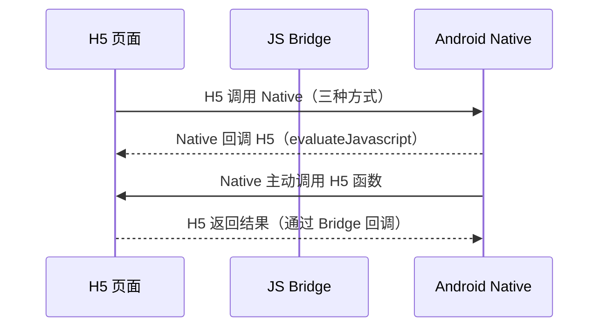
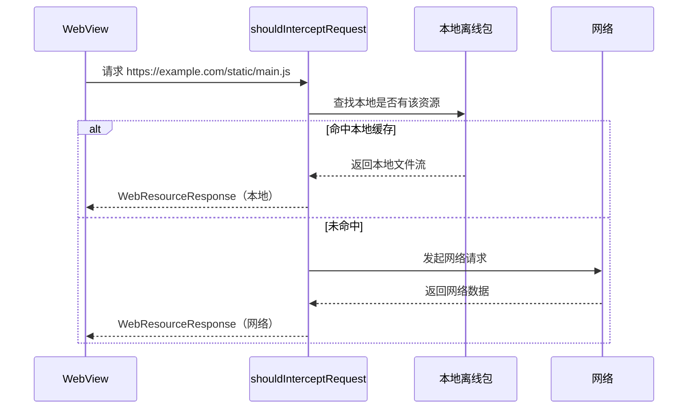

# WebView 进阶篇

> 目标：掌握 JS Bridge 双向通信设计、白屏优化、离线包方案、内存与安全进阶，能在大型项目中设计一套完整的 WebView 容器。

---

## 一、JS Bridge：Android 与 H5 双向通信

### 1.1 通信模型



### 1.2 H5 调用 Native 的三种方式

#### 方式一：addJavascriptInterface（最常用）

```kotlin
// Native 侧：注册 Bridge 对象
class JsBridge(private val context: Context) {

    @JavascriptInterface
    fun showToast(message: String) {
        // 注意：此方法运行在 JS 线程，不是主线程，不能直接操作 UI
        Handler(Looper.getMainLooper()).post {
            Toast.makeText(context, message, Toast.LENGTH_SHORT).show()
        }
    }

    @JavascriptInterface
    fun getDeviceInfo(): String {
        // 返回 JSON 字符串给 H5
        return JSONObject().apply {
            put("platform", "android")
            put("version", Build.VERSION.SDK_INT)
            put("model", Build.MODEL)
        }.toString()
    }
}

webView.addJavascriptInterface(JsBridge(context), "NativeBridge")
```

```javascript
// H5 侧调用
const info = window.NativeBridge.getDeviceInfo()
console.log(JSON.parse(info).platform) // "android"
```

**优点**：调用简单，同步返回值  
**缺点**：有安全风险（必须严格用 `@JavascriptInterface`），方法命名固定不灵活

---

#### 方式二：URL Scheme 拦截（兼容性最好）

```kotlin
// Native 侧：在 shouldOverrideUrlLoading 里拦截自定义 scheme
override fun shouldOverrideUrlLoading(view: WebView, request: WebResourceRequest): Boolean {
    val url = request.url
    if (url.scheme == "jsbridge") {
        // jsbridge://methodName?params=xxx&callbackId=yyy
        val method = url.host          // 方法名
        val params = url.getQueryParameter("params")   // 参数
        val callbackId = url.getQueryParameter("callbackId")
        handleBridgeCall(method, params, callbackId)
        return true
    }
    return false
}

private fun handleBridgeCall(method: String?, params: String?, callbackId: String?) {
    val result = when (method) {
        "getToken" -> getToken()
        "vibrate" -> { vibrate(); "" }
        else -> ""
    }
    // 回调结果给 H5
    callbackId?.let { id ->
        webView.evaluateJavascript("window.__bridgeCallback('$id', '$result')", null)
    }
}
```

```javascript
// H5 侧：封装 Bridge 调用
function callNative(method, params) {
  return new Promise((resolve) => {
    const callbackId = `cb_${Date.now()}`
    window.__bridgeCallback = (id, result) => {
      if (id === callbackId) resolve(result)
    }
    location.href = `jsbridge://${method}?params=${encodeURIComponent(JSON.stringify(params))}&callbackId=${callbackId}`
  })
}

// 使用
callNative('getToken', {}).then(token => console.log(token))
```

**优点**：兼容性好，iOS/Android 通用  
**缺点**：URL 长度有限制，频繁调用时会被合并（location.href 连续赋值，前面的会被丢弃）

---

#### 方式三：evaluateJavascript（Native 主动调用 H5）

```kotlin
// Native 调用 H5 已定义的函数，并接收返回值
// 必须在主线程调用，API 19+
webView.evaluateJavascript(
    "window.onNativeEvent({type: 'login', token: '${token}'})"
) { result ->
    // result 是 JS 函数的返回值（JSON 字符串），null 表示无返回值
    Log.d("Bridge", "JS returned: $result")
}

// 老方法（不推荐，无法获取返回值，但兼容 API 19 以下）
webView.loadUrl("javascript:window.onNativeEvent({type:'login'})")
```

---

### 1.3 生产级 JS Bridge 设计

一个完整的 Bridge 需要解决：**异步回调管理** + **参数序列化** + **安全校验** + **错误处理**。

```kotlin
object JsBridgeDispatcher {

    // 白名单：只有这些域名可以调用 Bridge
    private val allowedHosts = setOf("example.com", "h5.example.com")

    // Bridge 方法注册表
    private val handlers = mapOf<String, BridgeHandler>(
        "getToken" to GetTokenHandler(),
        "showToast" to ShowToastHandler(),
        "openNativePage" to OpenNativePageHandler()
    )

    fun dispatch(webView: WebView, method: String, params: String?, callbackId: String?) {
        // 1. 安全校验：校验调用来源
        val host = Uri.parse(webView.url ?: "").host
        if (host !in allowedHosts) {
            callback(webView, callbackId, BridgeResult.error("Unauthorized host"))
            return
        }
        // 2. 查找 handler
        val handler = handlers[method]
        if (handler == null) {
            callback(webView, callbackId, BridgeResult.error("Unknown method: $method"))
            return
        }
        // 3. 执行（在主线程）
        handler.handle(params) { result ->
            callback(webView, callbackId, result)
        }
    }

    private fun callback(webView: WebView, callbackId: String?, result: BridgeResult) {
        callbackId ?: return
        val json = result.toJson()
        // evaluateJavascript 必须在主线程
        webView.post {
            webView.evaluateJavascript(
                "window.__nativeBridgeCallback('$callbackId', $json)", null
            )
        }
    }
}

data class BridgeResult(val code: Int, val data: String = "", val msg: String = "") {
    fun toJson() = "{\"code\":$code,\"data\":\"$data\",\"msg\":\"$msg\"}"
    companion object {
        fun success(data: String = "") = BridgeResult(0, data)
        fun error(msg: String) = BridgeResult(-1, msg = msg)
    }
}

interface BridgeHandler {
    fun handle(params: String?, callback: (BridgeResult) -> Unit)
}
```

---

## 二、性能优化：消灭白屏

白屏是 WebView 最大的用户体验痛点。白屏的本质是：**网络慢 + 初始化慢 + 渲染慢** 三者叠加。

```mermaid
gantt
    title WebView 加载时间线（未优化）
    dateFormat  X
    axisFormat %s ms

    section 用户感知
    用户点击         :0, 10
    白屏等待         :10, 800
    页面可见         :800, 1000

    section 技术分解
    WebView 初始化    :0, 200
    DNS 解析          :200, 350
    TCP 连接          :350, 450
    HTML 下载         :450, 600
    JS/CSS 解析执行   :600, 800
    首屏渲染          :800, 1000
```



### 2.1 预创建 WebView（减少初始化耗时 ~200ms）

WebView 第一次创建时需要初始化 Chromium 内核，耗时约 200-500ms。

```kotlin
object WebViewPool {

    private var cachedWebView: WebView? = null

    // 在 Application.onCreate 或首页加载完毕后预热
    fun preload(context: Context) {
        if (cachedWebView != null) return
        // 在子线程预创建，避免阻塞主线程
        Thread {
            Handler(Looper.getMainLooper()).post {
                // WebView 必须在主线程创建
                cachedWebView = WebView(context.applicationContext).apply {
                    // 预加载一个空白页，触发内核初始化
                    loadUrl("about:blank")
                }
            }
        }.start()
    }

    // 取出复用（取出后缓存置空，下次重新预创建）
    fun acquire(context: Context): WebView {
        return cachedWebView?.also { cachedWebView = null }
            ?: WebView(context.applicationContext)
    }

    fun release(webView: WebView) {
        // 使用完毕后，如果页面干净可以放回池子
        webView.loadUrl("about:blank")
        cachedWebView = webView
    }
}
```

### 2.2 DNS 预解析（减少 DNS 耗时 ~100-300ms）

```kotlin
// 在用户可能打开 WebView 之前（如 App 启动时），提前解析常用域名
class MyApplication : Application() {
    override fun onCreate() {
        super.onCreate()
        // WebView DNS 预热：触发系统 DNS 缓存
        Thread {
            try {
                InetAddress.getByName("example.com")      // 主域名
                InetAddress.getByName("cdn.example.com")  // CDN 域名
            } catch (e: Exception) { /* 忽略，预热失败不影响正常流程 */ }
        }.start()
    }
}
```

### 2.3 离线包方案（减少网络耗时，首屏提速 60-80%）

离线包：把 H5 的 JS/CSS/图片等静态资源打包，随 App 发布或提前下载到本地，加载时拦截网络请求返回本地文件。



```kotlin
class OfflineWebViewClient(
    private val offlinePackage: OfflinePackage
) : WebViewClient() {

    override fun shouldInterceptRequest(
        view: WebView,
        request: WebResourceRequest
    ): WebResourceResponse? {
        val url = request.url.toString()

        // 只拦截静态资源（JS/CSS/图片），不拦截 API 请求
        if (!isStaticResource(url)) return null

        val localFile = offlinePackage.getLocalFile(url) ?: return null

        // 命中离线包，返回本地文件
        return WebResourceResponse(
            getMimeType(url),     // 根据后缀判断 MIME
            "UTF-8",
            localFile.inputStream()
        )
    }

    private fun isStaticResource(url: String): Boolean {
        return url.contains("/static/") ||
               url.endsWith(".js") ||
               url.endsWith(".css") ||
               url.endsWith(".png")
    }

    private fun getMimeType(url: String) = when {
        url.endsWith(".js")  -> "application/javascript"
        url.endsWith(".css") -> "text/css"
        url.endsWith(".png") -> "image/png"
        url.endsWith(".jpg") -> "image/jpeg"
        else                 -> "text/plain"
    }
}
```

### 2.4 并行加载（WebView 初始化与数据请求同步进行）

```kotlin
// 传统串行（慢）：先初始化 WebView → 再加载 URL → 等待 HTML → 等待接口数据
// 并行优化：WebView 初始化 与 接口预请求 同时进行

class WebViewActivity : AppCompatActivity() {

    private var prefetchedData: String? = null

    override fun onCreate(savedInstanceState: Bundle?) {
        super.onCreate(savedInstanceState)

        // 1. 立即发起接口预请求（不等 WebView 初始化完成）
        lifecycleScope.launch(Dispatchers.IO) {
            prefetchedData = fetchPageData()  // 提前拉接口
        }

        // 2. 同时初始化 WebView
        val webView = WebViewPool.acquire(this)
        webView.webViewClient = object : WebViewClient() {
            override fun onPageFinished(view: WebView, url: String) {
                // 3. 页面加载完后，把预取的数据注入进去
                prefetchedData?.let { data ->
                    view.evaluateJavascript(
                        "window.__prefetchedData = $data", null
                    )
                }
            }
        }
        webView.loadUrl(targetUrl)
    }
}
```

---

## 三、内存优化

### 3.1 独立进程隔离（推荐大型项目）

WebView 内存占用大（通常 50-100MB+），且 Chromium 本身存在内存泄漏风险。将 WebView 放在独立进程，关闭 WebView 页面时直接 `Process.killProcess`，内存瞬间释放。

```xml
<!-- AndroidManifest.xml -->
<activity
    android:name=".WebViewActivity"
    android:process=":web" />
<!-- 独立进程名以 : 开头，属于 App 私有子进程 -->
```

```kotlin
// 关闭 WebView 页面时，直接杀掉 web 进程，内存立刻释放
class WebViewActivity : AppCompatActivity() {
    override fun onDestroy() {
        super.onDestroy()
        // 杀掉自己所在进程，彻底释放 WebView 占用的内存
        Process.killProcess(Process.myPid())
    }
}
```

> **注意**：独立进程意味着 WebView 和主进程不共享内存，无法直接访问主进程的单例、SharedPreferences 等数据，需通过 Binder/AIDL/Bundle 通信。

### 3.2 及时释放 WebView

```kotlin
// 页面不可见时暂停 WebView，节省 CPU 和网络
override fun onPause() {
    super.onPause()
    webView?.onPause()          // 暂停 JS 定时器、动画等
    webView?.pauseTimers()      // 暂停所有 WebView 的 layout/parsing/JavaScriptTimers
}

override fun onResume() {
    super.onResume()
    webView?.onResume()
    webView?.resumeTimers()
}
```

---

## 四、安全进阶

### 4.1 防止 Intent Scheme 攻击

H5 可以通过 `intent://` scheme 启动任意 App 组件，若不加限制，恶意页面可能打开内部 Activity 或传递恶意参数。

```kotlin
override fun shouldOverrideUrlLoading(view: WebView, request: WebResourceRequest): Boolean {
    val url = request.url.toString()
    if (url.startsWith("intent://")) {
        try {
            val intent = Intent.parseUri(url, Intent.URI_INTENT_SCHEME)
            // 只允许启动有 BROWSABLE category 的 Activity，拒绝内部组件
            if (intent.hasCategory(Intent.CATEGORY_BROWSABLE)) {
                intent.addCategory(Intent.CATEGORY_DEFAULT)
                startActivity(intent)
            }
        } catch (e: URISyntaxException) {
            // 解析失败，忽略
        }
        return true
    }
    return false
}
```

### 4.2 HTTPS 证书校验

```kotlin
override fun onReceivedSslError(view: WebView, handler: SslErrorHandler, error: SslError) {
    // ❌ 错误做法：直接 handler.proceed() 忽略证书错误，会导致中间人攻击
    // handler.proceed()

    // ✅ 正确做法：提示用户证书有问题，不自动通过
    AlertDialog.Builder(this)
        .setTitle("证书错误")
        .setMessage("该页面的安全证书存在问题，是否继续？")
        .setPositiveButton("继续") { _, _ -> handler.proceed() }  // 用户主动确认
        .setNegativeButton("取消") { _, _ -> handler.cancel() }
        .show()
}
```

---

## 五、横向对比：WebView 容器方案选型

| 方案 | 性能 | 更新方式 | 离线支持 | 适用场景 |
|------|------|----------|----------|----------|
| **系统 WebView** | 一般 | 随系统升级 | 需自行实现 | 轻量内嵌 H5 |
| **腾讯 X5 内核** | 较好 | App 发布时更新 | 需自行实现 | 国内 App，解决碎片化 |
| **微信 WKWebView** | 好 | - | - | 微信小程序容器 |
| **离线包 + 系统 WebView** | 好 | 增量下载 | 原生支持 | 中大型 App H5 容器 |
| **Flutter WebView** | 一般 | - | - | Flutter App 内嵌 H5 |

**X5 内核的核心价值**：
- 解决 Android 4.x 机型 WebView 内核版本低、兼容性差的问题（现在 4.x 机型已基本消失，价值降低）
- X5 支持视频播放、文件预览等增强能力
- 国内用户如果安装了微信/QQ，X5 内核可以直接复用，无需额外下载

---

## 六、面试检验

**Q1：如何设计一个安全的 JS Bridge？**

> **结论**：白名单 + 注解 + 参数校验三重防护。
> **原理**：① 用 `@JavascriptInterface` 限制可被调用的方法；② Bridge 内部校验当前 WebView 的 URL host 是否在白名单内；③ 对传入参数做类型和范围校验，拒绝异常参数。

**Q2：白屏问题如何排查和优化？**

> **排查**：① 网络慢（抓包确认）；② WebView 初始化慢（用 TraceView 确认）；③ JS 执行慢（Chrome DevTools 远程调试）；④ 渲染进程崩溃（检查 onRenderProcessGone）。
> **优化**：预创建 WebView + DNS 预解析 + 离线包 + 并行加载接口数据，组合使用可将首屏时间从 2-3s 降到 500ms 以内。

**Q3：离线包方案的核心原理是什么？**

> 重写 `shouldInterceptRequest`，在每次 WebView 请求资源时拦截，判断本地是否有对应文件，有则返回 `WebResourceResponse`（本地文件流），无则放行走网络。关键是 URL 到本地路径的映射规则设计，以及离线包的版本管理和增量更新策略。

**Q4：WebView 独立进程有什么优缺点？**

> **优点**：① WebView 崩溃不影响主进程；② 关闭页面时 kill 进程可彻底释放内存；③ 主进程不受 WebView 内存占用拖累。
> **缺点**：① 进程间通信复杂，共享数据需要序列化；② 首次启动需要额外的进程创建耗时；③ 多进程增加 App 总内存占用（每个进程都有独立的虚拟机）。

**Q5：URL Scheme 和 addJavascriptInterface 哪种 JS Bridge 方案更好？**

>  