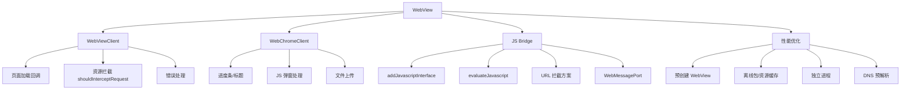

# WebView 学习导航

> WebView 是 Android 中内嵌网页的核心组件，掌握它意味着能让你的 App 和 Web 页面无缝融合。

---

## 重要程度

| 维度 | 评级 | 说明 |
|------|------|------|
| **面试频率** | ⭐⭐⭐⭐⭐ | 混合开发必考，几乎每家公司都问 |
| **实战价值** | ⭐⭐⭐⭐⭐ | App 内嵌 H5、小程序容器核心技术 |
| **优化难度** | ⭐⭐⭐⭐ | 白屏优化、JS Bridge 设计有相当难度 |
| **安全风险** | ⭐⭐⭐⭐⭐ | 不注意安全配置，极易引入高危漏洞 |

---

## 学习路线

```
基础篇 → 进阶篇 → 源码篇
  ↓         ↓         ↓
会用      用好      看透本质
```

### 第一步：基础篇（1-基础篇.md）
- WebView 是什么，解决什么问题
- 基本配置和加载方式
- WebViewClient / WebChromeClient 区别
- 常见坑和安全注意事项

### 第二步：进阶篇（2-进阶篇.md）
- JS Bridge：Android 与 H5 双向通信
- 性能优化：白屏优化、资源预加载、离线包
- 内存泄漏：最常踩的坑
- 多进程 WebView：进程隔离策略

### 第三步：源码篇（3-源码篇.md）
- WebView 渲染架构：Chromium 如何工作
- WebViewClient 生命周期源码追踪
- JS Bridge 底层通信机制
- X5 内核 vs 系统 WebView 选型

---

## 核心问题预览

**基础级**
- WebViewClient 和 WebChromeClient 分别负责什么？
- 如何防止 WebView 导致的内存泄漏？
- `addJavascriptInterface` 有什么安全风险？

**进阶级**
- 如何设计一个安全可靠的 JS Bridge？
- WebView 白屏问题有哪几种原因，如何排查？
- 离线包方案的原理是什么，如何拦截资源？

**专家级**
- WebView 多进程模式下进程崩溃如何处理？
- Chromium 渲染管线和 Android View 渲染有什么区别？
- 如何设计一个支持秒开的 WebView 容器？

---

## 技术关联图



---

_本文档将持续更新，添加更多相关内容_
