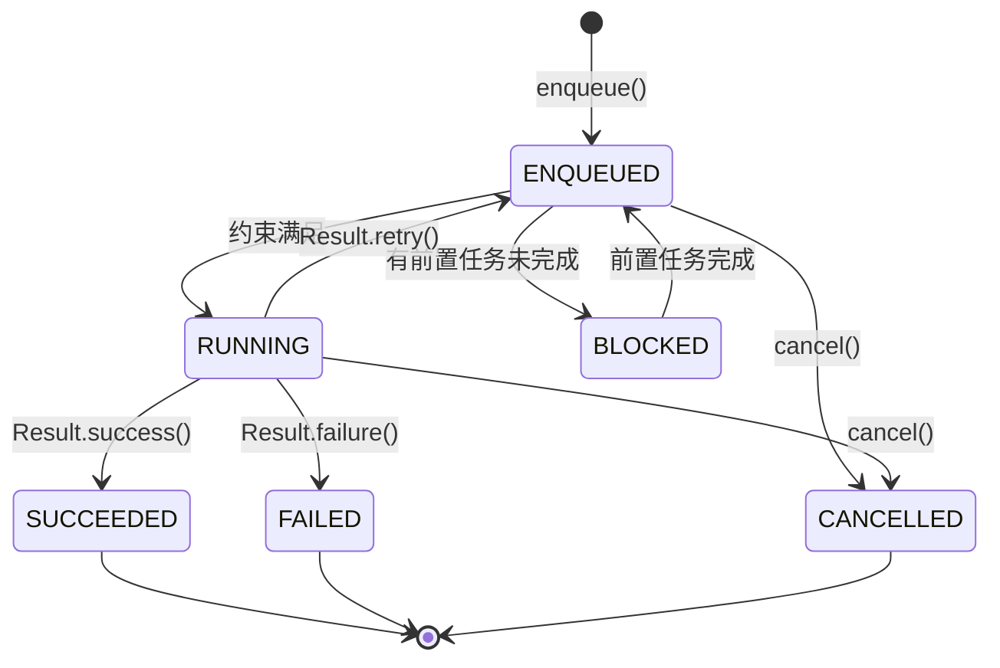

# WorkManager 基础篇

## 技术演进：为什么需要 WorkManager？

### 痛点：Android 后台任务的混乱历史

想象一下这个场景：你的 App 需要在后台上传用户的照片到服务器，你可能会这样想：

> "简单！开个 Service 不就行了？"

然而，现实是残酷的：

```
┌─────────────────────────────────────────────────────────────────────────────┐
│                    Android 后台任务的"悲惨"演进史                            │
├─────────────────────────────────────────────────────────────────────────────┤
│                                                                             │
│  Android 4.x      Android 6.0       Android 8.0       Android 12+          │
│  ┌──────────┐    ┌──────────┐      ┌──────────┐      ┌──────────┐         │
│  │ 随便后台 │    │ Doze 模式│      │ 后台限制 │      │ 更严格   │         │
│  │ 想怎样   │ => │ 省电优化 │  =>  │ Service  │  =>  │ 前台服务 │         │
│  │ 怎样     │    │          │      │ 不能随便 │      │ 也受限   │         │
│  └──────────┘    └──────────┘      └──────────┘      └──────────┘         │
│       │               │                 │                 │                │
│       └───────────────┴─────────────────┴─────────────────┘                │
│                               │                                            │
│                   开发者的头发越来越少 👨‍🦲                                 │
│                                                                             │
└─────────────────────────────────────────────────────────────────────────────┘
```

### 以前的方案都有什么问题？

| 方案 | 问题 |
|-----|------|
| **Service** | Android 8.0+ 后台 Service 几分钟就被杀；前台 Service 需要通知栏 |
| **AlarmManager** | Doze 模式下不靠谱；代码复杂；没有约束条件支持 |
| **JobScheduler** | 只支持 API 21+；不持久化；API 复杂 |
| **GCM/FCM JobDispatcher** | 依赖 Google Play Services；已废弃 |

开发者的日常：

```kotlin
// 以前的代码：各种 API 版本判断，心态炸裂 💥
if (Build.VERSION.SDK_INT >= Build.VERSION_CODES.O) {
    // 用 JobScheduler
} else if (Build.VERSION.SDK_INT >= Build.VERSION_CODES.LOLLIPOP) {
    // 也用 JobScheduler，但参数不同
} else {
    // 用 AlarmManager + BroadcastReceiver
}
// 还要处理 Doze 模式、电池优化、厂商定制...
```

### WorkManager 的诞生

2018 年，Google 推出了 WorkManager，目标很明确：

> **一个 API，搞定所有后台任务！自动适配各个 Android 版本，保证任务可靠执行。**

## 核心概念：用大白话说清楚

### 什么是 WorkManager？

**一句话定义**：WorkManager 是一个用于调度**可延迟、可靠执行**的后台任务的库。

**大白话理解**：

把 WorkManager 想象成一个"靠谱的外卖小哥"🛵：

- 你下单后（enqueue 任务），不管你睡着了还是手机关机重启
- 外卖小哥都会在**条件合适**的时候把餐送到（执行任务）
- 如果路上遇到堵车（约束条件不满足），他会等到路通了再送
- 他还会记住你的订单（任务持久化），即使他中途换班（App 被杀）也不会忘记

```
┌─────────────────────────────────────────────────────────────────────────────┐
│                    WorkManager 工作流程（外卖版）                            │
├─────────────────────────────────────────────────────────────────────────────┤
│                                                                             │
│   1. 下单                2. 等待条件             3. 配送                    │
│   ┌─────────┐           ┌─────────┐            ┌─────────┐                 │
│   │ 用户    │  enqueue  │ 等红灯  │  条件满足  │ 送达    │                 │
│   │ 下单 📱 │ ────────► │ 🚦      │ ─────────► │ 🎉      │                 │
│   └─────────┘           └─────────┘            └─────────┘                 │
│                                                                             │
│   对应代码：                                                                │
│   WorkManager           Constraints          Worker.doWork()               │
│   .enqueue()            (网络、电量等)        (执行具体任务)                │
│                                                                             │
└─────────────────────────────────────────────────────────────────────────────┘
```

### 四大核心组件

| 组件 | 作用 | 类比 |
|-----|------|------|
| **Worker** | 定义具体要做什么（任务内容） | 外卖要送什么菜 |
| **WorkRequest** | 定义怎么做（一次性/周期性、约束条件） | 订单详情（地址、时间要求） |
| **WorkManager** | 调度和管理任务 | 外卖平台调度系统 |
| **WorkInfo** | 任务的状态信息 | 订单状态（配送中/已送达） |

### WorkManager 的特点

```
┌─────────────────────────────────────────────────────────────────────────────┐
│                        WorkManager vs 其他方案                               │
├─────────────────────────────────────────────────────────────────────────────┤
│                                                                             │
│  特性              WorkManager    Service    AlarmManager   JobScheduler    │
│  ─────────────────────────────────────────────────────────────────────────  │
│  保证执行              ✅            ❌           ⚠️             ⚠️          │
│  设备重启后恢复        ✅            ❌           ✅             ❌          │
│  约束条件              ✅            ❌           ❌             ✅          │
│  链式任务              ✅            ❌           ❌             ❌          │
│  兼容性 (API 14+)      ✅            ✅           ✅             ❌ (21+)    │
│  电池友好              ✅            ❌           ⚠️             ✅          │
│                                                                             │
└─────────────────────────────────────────────────────────────────────────────┘
```

## 基本用法：快速上手

### 1. 添加依赖

```kotlin
// build.gradle.kts (Module)
dependencies {
    // WorkManager 核心
    val workVersion = "2.9.0"
    implementation("androidx.work:work-runtime-ktx:$workVersion")
    
    // 可选：支持协程
    // 已包含在 work-runtime-ktx 中
    
    // 可选：支持 RxJava
    // implementation("androidx.work:work-rxjava3:$workVersion")
    
    // 可选：测试支持
    // androidTestImplementation("androidx.work:work-testing:$workVersion")
}
```

### 2. 定义 Worker（做什么）

```kotlin
/**
 * 上传图片的 Worker
 * Worker 是执行具体任务的地方，运行在后台线程
 */
class UploadWorker(
    context: Context,
    params: WorkerParameters
) : Worker(context, params) {
    
    override fun doWork(): Result {
        // 1. 获取输入数据
        val imageUri = inputData.getString("image_uri") ?: return Result.failure()
        
        return try {
            // 2. 执行具体任务（这里是模拟上传）
            Log.d("UploadWorker", "开始上传: $imageUri")
            uploadImage(imageUri)
            Log.d("UploadWorker", "上传成功")
            
            // 3. 返回成功，可以携带输出数据
            val outputData = workDataOf("upload_url" to "https://example.com/image.jpg")
            Result.success(outputData)
            
        } catch (e: Exception) {
            Log.e("UploadWorker", "上传失败", e)
            // 返回重试（WorkManager 会稍后重试）
            Result.retry()
        }
    }
    
    private fun uploadImage(uri: String) {
        // 模拟网络请求，实际项目中用 OkHttp/Retrofit
        Thread.sleep(2000)
    }
}
```

**doWork() 返回值说明**：

| 返回值 | 含义 | 使用场景 |
|-------|------|---------|
| `Result.success()` | 任务成功完成 | 正常完成 |
| `Result.success(outputData)` | 成功并携带数据 | 需要传递结果给下个任务 |
| `Result.failure()` | 任务失败，不重试 | 参数错误等不可恢复的失败 |
| `Result.failure(outputData)` | 失败并携带错误信息 | 需要知道失败原因 |
| `Result.retry()` | 任务需要重试 | 网络临时失败等可恢复的错误 |

### 3. 创建 WorkRequest（怎么做）

```kotlin
// 一次性任务
val uploadRequest = OneTimeWorkRequestBuilder<UploadWorker>()
    .setInputData(workDataOf("image_uri" to "/storage/photo.jpg"))
    .build()

// 周期性任务（最小间隔 15 分钟）
val syncRequest = PeriodicWorkRequestBuilder<SyncWorker>(
    repeatInterval = 1,
    repeatIntervalTimeUnit = TimeUnit.HOURS
).build()
```

### 4. 提交任务（入队）

```kotlin
// 获取 WorkManager 实例并提交任务
WorkManager.getInstance(context).enqueue(uploadRequest)
```

### 5. 完整示例

```kotlin
class MainActivity : AppCompatActivity() {
    
    override fun onCreate(savedInstanceState: Bundle?) {
        super.onCreate(savedInstanceState)
        setContentView(R.layout.activity_main)
        
        findViewById<Button>(R.id.btnUpload).setOnClickListener {
            startUploadWork()
        }
    }
    
    private fun startUploadWork() {
        // 1. 准备输入数据
        val inputData = workDataOf(
            "image_uri" to "/storage/photo.jpg",
            "user_id" to 12345
        )
        
        // 2. 创建任务请求
        val uploadRequest = OneTimeWorkRequestBuilder<UploadWorker>()
            .setInputData(inputData)
            .addTag("upload")  // 添加标签，方便后续查询/取消
            .build()
        
        // 3. 提交任务
        WorkManager.getInstance(this).enqueue(uploadRequest)
        
        // 4. 观察任务状态
        WorkManager.getInstance(this)
            .getWorkInfoByIdLiveData(uploadRequest.id)
            .observe(this) { workInfo ->
                when (workInfo?.state) {
                    WorkInfo.State.ENQUEUED -> Log.d("Main", "任务已入队")
                    WorkInfo.State.RUNNING -> Log.d("Main", "任务执行中...")
                    WorkInfo.State.SUCCEEDED -> {
                        val url = workInfo.outputData.getString("upload_url")
                        Log.d("Main", "上传成功: $url")
                    }
                    WorkInfo.State.FAILED -> Log.d("Main", "上传失败")
                    WorkInfo.State.CANCELLED -> Log.d("Main", "任务已取消")
                    else -> {}
                }
            }
    }
}
```

## 约束条件：让任务在合适的时机执行

WorkManager 最强大的特性之一就是**约束条件**，可以指定任务在什么条件下才执行。

### 支持的约束条件

| 约束 | 说明 | 典型场景 |
|-----|------|---------|
| `setRequiredNetworkType()` | 网络类型要求 | 大文件上传需要 WiFi |
| `setRequiresBatteryNotLow()` | 电量不低 | 耗电任务 |
| `setRequiresCharging()` | 充电中 | 数据备份 |
| `setRequiresDeviceIdle()` | 设备空闲 | 大型清理任务 |
| `setRequiresStorageNotLow()` | 存储空间充足 | 下载任务 |

### 使用示例

```kotlin
// 定义约束条件：需要 WiFi + 充电中
val constraints = Constraints.Builder()
    .setRequiredNetworkType(NetworkType.UNMETERED)  // WiFi
    .setRequiresCharging(true)                       // 充电中
    .setRequiresBatteryNotLow(true)                  // 电量不低
    .build()

// 创建带约束的任务
val uploadRequest = OneTimeWorkRequestBuilder<UploadWorker>()
    .setConstraints(constraints)
    .setInputData(workDataOf("image_uri" to "/storage/photo.jpg"))
    .build()

WorkManager.getInstance(context).enqueue(uploadRequest)
// 任务会等到所有约束条件都满足时才执行
```

### 网络类型详解

```kotlin
enum class NetworkType {
    NOT_REQUIRED,    // 不需要网络
    CONNECTED,       // 需要网络（任意类型）
    UNMETERED,       // 需要不计费网络（通常是 WiFi）
    NOT_ROAMING,     // 不能是漫游网络
    METERED          // 需要计费网络（移动数据）- API 26+
}
```

## 任务状态与观察

### 任务状态流转



### 观察任务状态

```kotlin
// 方式一：通过 ID 观察单个任务
WorkManager.getInstance(context)
    .getWorkInfoByIdLiveData(workRequest.id)
    .observe(lifecycleOwner) { workInfo ->
        // 处理状态变化
    }

// 方式二：通过标签观察一组任务
WorkManager.getInstance(context)
    .getWorkInfosByTagLiveData("upload")
    .observe(lifecycleOwner) { workInfoList ->
        workInfoList.forEach { workInfo ->
            // 处理每个任务的状态
        }
    }

// 方式三：通过唯一任务名观察
WorkManager.getInstance(context)
    .getWorkInfosForUniqueWorkLiveData("unique_sync")
    .observe(lifecycleOwner) { workInfoList ->
        // 处理状态
    }
```

### 取消任务

```kotlin
// 通过 ID 取消
WorkManager.getInstance(context).cancelWorkById(workRequest.id)

// 通过标签取消（取消所有带此标签的任务）
WorkManager.getInstance(context).cancelAllWorkByTag("upload")

// 通过唯一任务名取消
WorkManager.getInstance(context).cancelUniqueWork("unique_sync")

// 取消所有任务（慎用！）
WorkManager.getInstance(context).cancelAllWork()
```

## Worker 类型

除了基础的 `Worker`，WorkManager 还提供了几种特殊的 Worker：

### 1. CoroutineWorker（推荐）

使用协程，代码更简洁，更好地处理并发：

```kotlin
class DownloadWorker(
    context: Context,
    params: WorkerParameters
) : CoroutineWorker(context, params) {
    
    // 默认运行在 Dispatchers.Default
    override suspend fun doWork(): Result {
        val url = inputData.getString("url") ?: return Result.failure()
        
        return try {
            // 可以直接使用挂起函数
            val result = downloadFile(url)
            Result.success(workDataOf("file_path" to result))
        } catch (e: Exception) {
            Result.retry()
        }
    }
    
    private suspend fun downloadFile(url: String): String {
        // 切换到 IO 调度器执行网络请求
        return withContext(Dispatchers.IO) {
            // 实际的下载逻辑
            delay(3000)  // 模拟下载
            "/storage/downloaded_file.zip"
        }
    }
}
```

### 2. RxWorker

如果项目用 RxJava：

```kotlin
class RxUploadWorker(
    context: Context,
    params: WorkerParameters
) : RxWorker(context, params) {
    
    override fun createWork(): Single<Result> {
        return Single.fromCallable {
            // 执行任务
            Thread.sleep(2000)
            Result.success()
        }
    }
}
```

### 3. ListenableWorker

最底层的 Worker，完全自定义线程：

```kotlin
class CustomWorker(
    context: Context,
    params: WorkerParameters
) : ListenableWorker(context, params) {
    
    override fun startWork(): ListenableFuture<Result> {
        return CallbackToFutureAdapter.getFuture { completer ->
            // 在自定义线程中执行
            MyExecutor.execute {
                try {
                    doSomething()
                    completer.set(Result.success())
                } catch (e: Exception) {
                    completer.set(Result.failure())
                }
            }
        }
    }
}
```

### Worker 类型选择

| Worker 类型 | 线程模型 | 适用场景 |
|------------|---------|---------|
| `Worker` | 后台线程（同步） | 简单任务 |
| `CoroutineWorker` | 协程（挂起） | 推荐！现代 Android 开发 |
| `RxWorker` | RxJava | RxJava 项目 |
| `ListenableWorker` | 完全自定义 | 需要特殊线程控制 |

## 常见问题与陷阱

### 1. 任务不执行？检查约束条件！

```kotlin
// ❌ 常见错误：约束条件太严格，永远满足不了
val constraints = Constraints.Builder()
    .setRequiredNetworkType(NetworkType.UNMETERED)  // WiFi
    .setRequiresCharging(true)                       // 充电
    .setRequiresDeviceIdle(true)                     // 设备空闲
    .build()
// 用户边充电边玩手机？那设备就不算"空闲"，任务不会执行

// ✅ 合理设置约束
val constraints = Constraints.Builder()
    .setRequiredNetworkType(NetworkType.CONNECTED)  // 有网就行
    .build()
```

### 2. 输入数据大小限制

```kotlin
// ❌ 错误：Data 大小限制为 10KB
val bigData = workDataOf("huge_string" to veryLongString)  // 可能超过限制

// ✅ 正确：大数据应该存文件，只传路径
val data = workDataOf("file_path" to "/path/to/data.json")
```

### 3. Worker 中不要做 UI 操作

```kotlin
class BadWorker(context: Context, params: WorkerParameters) : Worker(context, params) {
    
    override fun doWork(): Result {
        // ❌ 错误：Worker 运行在后台线程，不能操作 UI
        // textView.text = "完成"  // 会崩溃！
        
        // ✅ 正确：通过 LiveData/Flow 通知 UI 层
        return Result.success(workDataOf("message" to "完成"))
    }
}
```

### 4. 周期性任务的最小间隔

```kotlin
// ❌ 错误：最小间隔是 15 分钟，设置更小会被自动调整为 15 分钟
val request = PeriodicWorkRequestBuilder<SyncWorker>(
    repeatInterval = 5,  // 会被调整为 15
    repeatIntervalTimeUnit = TimeUnit.MINUTES
).build()

// ✅ 如果需要更频繁的任务，考虑其他方案（AlarmManager 或前台服务）
```

### 5. 应用被强制停止后任务不会执行

WorkManager 的任务在以下情况会丢失：

- 用户在设置中强制停止应用
- 应用被卸载

这是 Android 系统的安全设计，无法绕过。

## 深度思考：App 被杀后任务真的能执行吗？

这是开发中最常见的疑问，也是面试高频问题。答案是：**看情况**。

### 官方设计：能执行

根据 Google 官方设计，WorkManager 任务在 App 被杀后**确实能继续执行**：

1. **任务持久化**：enqueue 时任务信息存入 SQLite 数据库
2. **系统级调度**：底层通过 `JobScheduler`（API 23+）或 `AlarmManager` 触发
3. **进程唤醒**：条件满足时，系统会唤醒 App 进程执行任务

```
┌─────────────────────────────────────────────────────────────────┐
│                    WorkManager 持久化机制                        │
├─────────────────────────────────────────────────────────────────┤
│                                                                 │
│   App 进程状态：  运行中 ──► 被杀 💀 ──► 系统唤醒 🔔 ──► 执行    │
│                                                                 │
│   任务数据：      ════════════════════════════════════════       │
│                   │     SQLite 数据库持久化存储      │           │
│                   │     不随进程消亡而丢失           │           │
│                                                                 │
└─────────────────────────────────────────────────────────────────┘
```

| 场景 | 原生 Android |
|------|-------------|
| 按返回键退出 | ✅ 能执行 |
| 系统回收内存 | ✅ 能执行 |
| 从最近任务划掉 | ✅ 能执行 |
| 设备重启 | ✅ 能执行 |
| 设置中强制停止 | ❌ 不能 |

### 现实情况：国产 ROM 大概率不行

**这是实际开发中必须了解的**：在国产手机上，WorkManager 经常"失效"！

| 厂商 | ROM | 问题 |
|-----|-----|------|
| **小米** | MIUI/HyperOS | 划掉最近任务 = 强制停止，任务全部取消 |
| **华为** | EMUI/HarmonyOS | 激进电池优化，非白名单应用被拦截 |
| **OPPO** | ColorOS | 自启动默认关闭，后台任务被延迟数小时 |
| **VIVO** | OriginOS | 类似 OPPO，需手动加白名单 |

**核心问题**：国产 ROM 把「用户划掉最近任务」当作「强制停止」处理，而原生 Android 只是关闭 Activity。

### 解决方案

**用户侧（需引导用户操作）**：
1. 开启**自启动权限**
2. 关闭**电池优化**（设置为"无限制"）
3. **锁定后台任务**（下拉卡片加锁）

**开发侧**：

```kotlin
// 引导用户关闭电池优化
fun requestIgnoreBatteryOptimization(context: Context) {
    if (Build.VERSION.SDK_INT >= Build.VERSION_CODES.M) {
        val powerManager = context.getSystemService(Context.POWER_SERVICE) as PowerManager
        if (!powerManager.isIgnoringBatteryOptimizations(context.packageName)) {
            val intent = Intent(Settings.ACTION_REQUEST_IGNORE_BATTERY_OPTIMIZATIONS)
            intent.data = Uri.parse("package:${context.packageName}")
            context.startActivity(intent)
        }
    }
}
```

> **总结**：开发时不能只考虑原生 Android，国产 ROM 的"魔改"行为在国内市场是必须面对的现实。

## 深度思考：系统如何防止任务滥用？

你可能会想：如果每个 App 都用 WorkManager 设置 15 分钟的周期任务，手机上几百个 App 岂不是一直在后台跑？

答案是：**Google 不允许这样**。系统有一套 **App Standby Buckets（应用待机分组）** 机制来限制。

### App Standby Buckets 机制

系统根据你**使用 App 的频率**，把它分到不同的"桶"里，不同桶的任务执行频率**天差地别**：

| 分组 | 条件 | 实际可执行频率 |
|-----|------|---------------|
| **Active（活跃）** | 正在使用 | 基本无限制（Android 16 后：每 60 分钟最多 20 分钟） |
| **Working Set（工作集）** | 经常使用 | 每 **2-4 小时** 最多执行 10 分钟 |
| **Frequent（常用）** | 偶尔使用 | 每 **8-12 小时** 最多执行 10 分钟 |
| **Rare（少用）** | 很少使用 | 每 **24 小时** 最多执行 10 分钟 |
| **Restricted（受限）** | 几乎不用 | 每天 **1 次**，最多 10 分钟 |

### 实际效果示例

```
你设置的：      PeriodicWorkRequest(15, TimeUnit.MINUTES)  // 想 15 分钟执行

实际执行：
├── 你正在用这个 App        → 可能真的 15 分钟执行
├── 你今天用过这个 App       → 可能 2-4 小时才执行一次
├── 你这周用过一两次         → 可能 8-12 小时才执行一次
└── 你装了但几乎没用过       → 可能一天才执行一次
```

### 其他系统级优化

| 机制 | 作用 |
|-----|------|
| **批量执行（Batching）** | 把多个 App 的任务攒在一起执行，减少 CPU 唤醒次数 |
| **Doze 模式** | 设备静止时，推迟非紧急任务到"维护窗口" |
| **Job Quota（Android 16+）** | 长时间任务消耗配额，超出后系统拒绝执行 |

### 关键认知

> **15 分钟只是"最小间隔"，不是"保证间隔"**。
> 
> WorkManager 保证的是"最终会执行"，不是"准时执行"。这就是为什么它叫"**可延迟**的后台任务"。

```kotlin
// 你以为的执行时间线：
// 0min → 15min → 30min → 45min → 60min ...  ❌

// 实际可能的执行时间线（不常用的 App）：
// 0min → ... → 6h → ... → 12h → ... → 24h   ✅
```

这个设计是合理的：用户不常用的 App，凭什么频繁消耗系统资源？

## 面试检验

### 基础概念题

**Q1：WorkManager 是什么？它和 Service 有什么区别？**

> **答案**：WorkManager 是 Jetpack 中用于调度可延迟、可靠执行的后台任务的组件。与 Service 的主要区别：
> 1. **生命周期**：Service 随 App 进程存活，WorkManager 任务在 App 退出后仍能执行
> 2. **系统限制**：Android 8.0+ 对后台 Service 有严格限制，WorkManager 不受影响
> 3. **约束条件**：WorkManager 支持网络、电量等约束，Service 没有
> 4. **持久化**：WorkManager 任务持久化到数据库，设备重启后恢复

**Q2：doWork() 返回 Result.retry() 会发生什么？**

> **答案**：任务会重新入队，WorkManager 会按照退避策略（默认指数退避）稍后重试。可以通过 `setBackoffCriteria()` 自定义退避策略。重试次数没有硬性限制，但可以在 Worker 中通过 `runAttemptCount` 检查重试次数，超过阈值返回 failure。

**Q3：Worker 运行在什么线程？可以做耗时操作吗？**

> **答案**：`Worker` 的 `doWork()` 运行在**后台线程**（WorkManager 管理的 Executor），可以做耗时操作。`CoroutineWorker` 的 `doWork()` 默认在 `Dispatchers.Default`。如果用 `ListenableWorker`，需要自己管理线程。

**Q4：WorkManager 支持哪些约束条件？**

> **答案**：
> - `setRequiredNetworkType()`：网络类型（无/任意/WiFi/非漫游）
> - `setRequiresBatteryNotLow()`：电量不低
> - `setRequiresCharging()`：充电中
> - `setRequiresDeviceIdle()`：设备空闲（API 23+）
> - `setRequiresStorageNotLow()`：存储空间充足

**Q5：如何在多个 Fragment 之间共享 Worker 的执行状态？**

> **答案**：通过 `getWorkInfoByIdLiveData()` 或 `getWorkInfosByTagLiveData()` 获取 LiveData，在各个 Fragment 中观察同一个 LiveData。也可以结合 SharedViewModel 来统一管理 WorkInfo 的观察。

---

_下一篇：[2-进阶篇](./2-进阶篇.md) - 链式任务、唯一任务、性能优化_
