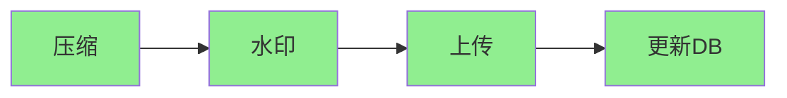

# WorkManager 进阶篇

## 链式任务：复杂工作流

### 为什么需要链式任务？

想象一个场景：用户上传图片，流程是这样的：

```
压缩图片 → 添加水印 → 上传到服务器 → 更新数据库
```

每一步都依赖上一步的结果，任何一步失败整个流程都应该停止。

### 链式任务的工作方式



```kotlin
// 定义各个 Worker（省略具体实现）
class CompressWorker(context: Context, params: WorkerParameters) : Worker(context, params) {
    override fun doWork(): Result {
        val inputPath = inputData.getString("input_path") ?: return Result.failure()
        // 压缩图片...
        val compressedPath = compressImage(inputPath)
        // 输出数据传递给下一个 Worker
        return Result.success(workDataOf("compressed_path" to compressedPath))
    }
    
    private fun compressImage(path: String): String {
        // 实际压缩逻辑
        return "${path}_compressed"
    }
}

class WatermarkWorker(context: Context, params: WorkerParameters) : Worker(context, params) {
    override fun doWork(): Result {
        // 自动接收上一个 Worker 的输出
        val compressedPath = inputData.getString("compressed_path") ?: return Result.failure()
        val watermarkedPath = addWatermark(compressedPath)
        return Result.success(workDataOf("watermarked_path" to watermarkedPath))
    }
    
    private fun addWatermark(path: String): String {
        return "${path}_watermarked"
    }
}

class UploadWorker(context: Context, params: WorkerParameters) : Worker(context, params) {
    override fun doWork(): Result {
        val watermarkedPath = inputData.getString("watermarked_path") ?: return Result.failure()
        val url = uploadToServer(watermarkedPath)
        return Result.success(workDataOf("remote_url" to url))
    }
    
    private fun uploadToServer(path: String): String {
        return "https://example.com/image.jpg"
    }
}
```

```kotlin
// 创建链式任务
val compressWork = OneTimeWorkRequestBuilder<CompressWorker>()
    .setInputData(workDataOf("input_path" to "/storage/photo.jpg"))
    .build()

val watermarkWork = OneTimeWorkRequestBuilder<WatermarkWorker>().build()
val uploadWork = OneTimeWorkRequestBuilder<UploadWorker>().build()

// 使用 then() 串联任务
WorkManager.getInstance(context)
    .beginWith(compressWork)          // 开始
    .then(watermarkWork)              // 然后
    .then(uploadWork)                 // 然后
    .enqueue()                        // 提交整个链
```

### 并行任务

有时候某些任务可以并行执行：

```
        ┌─ 压缩图片A ─┐
开始 ──►│             │──► 合并上传 ──► 结束
        └─ 压缩图片B ─┘
```

```kotlin
val compressA = OneTimeWorkRequestBuilder<CompressWorker>()
    .setInputData(workDataOf("input_path" to "/storage/a.jpg"))
    .build()

val compressB = OneTimeWorkRequestBuilder<CompressWorker>()
    .setInputData(workDataOf("input_path" to "/storage/b.jpg"))
    .build()

val upload = OneTimeWorkRequestBuilder<BatchUploadWorker>().build()

// beginWith 可以接收列表，实现并行
WorkManager.getInstance(context)
    .beginWith(listOf(compressA, compressB))  // 并行执行
    .then(upload)                              // 等所有压缩完成后执行
    .enqueue()
```

### 合并输出数据

当多个并行任务的输出需要合并时，使用 `InputMerger`：

```kotlin
// 数组合并器：把相同 key 的值合并成数组
val upload = OneTimeWorkRequestBuilder<BatchUploadWorker>()
    .setInputMerger(ArrayCreatingInputMerger::class.java)
    .build()

// 在 BatchUploadWorker 中
class BatchUploadWorker(context: Context, params: WorkerParameters) : Worker(context, params) {
    override fun doWork(): Result {
        // 获取合并后的数据（现在是数组）
        val paths = inputData.getStringArray("compressed_path")
        paths?.forEach { path ->
            // 上传每个文件
        }
        return Result.success()
    }
}
```

**InputMerger 类型**：

| 类型 | 行为 |
|-----|------|
| `OverwritingInputMerger` | 默认，后来的覆盖之前的 |
| `ArrayCreatingInputMerger` | 相同 key 合并成数组 |

## 唯一任务：避免重复执行

### 场景

用户快速点击"同步"按钮 5 次，你希望只执行 1 次同步，还是 5 次？

### 使用唯一任务

```kotlin
// 使用 enqueueUniqueWork 确保同名任务唯一
WorkManager.getInstance(context).enqueueUniqueWork(
    "sync_data",                              // 唯一任务名
    ExistingWorkPolicy.KEEP,                  // 冲突策略
    OneTimeWorkRequestBuilder<SyncWorker>().build()
)
```

### ExistingWorkPolicy 策略详解

```
┌─────────────────────────────────────────────────────────────────────────────┐
│                    ExistingWorkPolicy 策略对比                               │
├─────────────────────────────────────────────────────────────────────────────┤
│                                                                             │
│  假设：已有任务 A 正在执行，此时提交同名任务 B                                │
│                                                                             │
│  ┌──────────────┬────────────────────────────────────────────────────────┐  │
│  │   策略       │   行为                                                 │  │
│  ├──────────────┼────────────────────────────────────────────────────────┤  │
│  │   KEEP       │   保留 A，忽略 B                                       │  │
│  │              │   场景：防止重复同步                                    │  │
│  ├──────────────┼────────────────────────────────────────────────────────┤  │
│  │   REPLACE    │   取消 A，执行 B                                       │  │
│  │              │   场景：用户主动刷新，用最新的                          │  │
│  ├──────────────┼────────────────────────────────────────────────────────┤  │
│  │   APPEND     │   等 A 完成后，再执行 B（串行）                         │  │
│  │              │   场景：日志上传（不能丢）                              │  │
│  ├──────────────┼────────────────────────────────────────────────────────┤  │
│  │   APPEND_OR  │   如果 A 成功完成，执行 B                              │  │
│  │   _REPLACE   │   如果 A 失败/取消，用 B 替换                          │  │
│  │              │   场景：智能重试                                       │  │
│  └──────────────┴────────────────────────────────────────────────────────┘  │
│                                                                             │
└─────────────────────────────────────────────────────────────────────────────┘
```

### 周期性唯一任务

```kotlin
// 周期性唯一任务使用 enqueueUniquePeriodicWork
WorkManager.getInstance(context).enqueueUniquePeriodicWork(
    "hourly_sync",
    ExistingPeriodicWorkPolicy.KEEP,  // 或 UPDATE/CANCEL_AND_REENQUEUE
    PeriodicWorkRequestBuilder<SyncWorker>(1, TimeUnit.HOURS).build()
)
```

## 周期性任务

### 基本用法

```kotlin
val periodicWork = PeriodicWorkRequestBuilder<SyncWorker>(
    repeatInterval = 1,
    repeatIntervalTimeUnit = TimeUnit.HOURS
).build()

WorkManager.getInstance(context).enqueue(periodicWork)
```

### 最小间隔限制

> **重要**：周期性任务的最小间隔是 **15 分钟**（`PeriodicWorkRequest.MIN_PERIODIC_INTERVAL_MILLIS`）

```kotlin
// ❌ 以下设置会被自动调整为 15 分钟
PeriodicWorkRequestBuilder<Worker>(5, TimeUnit.MINUTES)  // 实际是 15 分钟

// ✅ 正确：使用合理的间隔
PeriodicWorkRequestBuilder<Worker>(1, TimeUnit.HOURS)
```

**为什么是 15 分钟？**

- 电池优化：频繁唤醒设备消耗电量
- 系统限制：与 JobScheduler 对齐
- 如果需要更频繁的执行，考虑 `AlarmManager` 或前台服务

### 弹性执行窗口

周期性任务默认有一个"弹性窗口"，让系统可以智能调度：

```kotlin
val periodicWork = PeriodicWorkRequestBuilder<SyncWorker>(
    repeatInterval = 1,
    repeatIntervalTimeUnit = TimeUnit.HOURS,
    flexTimeInterval = 15,  // 在最后 15 分钟内执行
    flexTimeIntervalUnit = TimeUnit.MINUTES
).build()
```

```
┌─────────────────────────────────────────────────────────────────┐
│                    周期性任务弹性窗口                            │
├─────────────────────────────────────────────────────────────────┤
│                                                                 │
│   ◄────────── repeatInterval (1小时) ─────────────►             │
│                                                                 │
│   │                                    │ flexInterval │         │
│   │         等待期                      │  (执行窗口)  │         │
│   │         (45分钟)                    │  (15分钟)    │         │
│   ├────────────────────────────────────┼──────────────┤         │
│   │                                    │ 可能执行 ✓   │         │
│                                                                 │
│   系统会在执行窗口内选择最优时机执行（比如与其他任务合并）        │
│                                                                 │
└─────────────────────────────────────────────────────────────────┘
```

## 数据传递

### 输入/输出数据

```kotlin
// 输入数据
val inputData = workDataOf(
    "key_string" to "value",
    "key_int" to 123,
    "key_array" to arrayOf("a", "b", "c")
)

val request = OneTimeWorkRequestBuilder<MyWorker>()
    .setInputData(inputData)
    .build()

// 在 Worker 中获取
class MyWorker(context: Context, params: WorkerParameters) : Worker(context, params) {
    override fun doWork(): Result {
        val str = inputData.getString("key_string")
        val num = inputData.getInt("key_int", 0)
        val arr = inputData.getStringArray("key_array")
        
        // 输出数据
        return Result.success(workDataOf("result" to "done"))
    }
}
```

### 数据限制

| 限制 | 值 |
|-----|-----|
| 单个 Data 最大大小 | **10 KB** |
| 支持的类型 | 基本类型、String、数组 |
| 不支持 | 对象、Parcelable、Serializable |

**大数据怎么办？**

```kotlin
// ✅ 存文件，只传路径
val data = workDataOf("file_path" to "/data/data/com.app/files/temp.json")

// ✅ 存数据库，只传 ID
val data = workDataOf("record_id" to 12345L)

// ✅ 使用 SharedPreferences（小数据）
val data = workDataOf("pref_key" to "my_data_key")
```

## 进度更新

从 WorkManager 2.3.0 开始支持实时进度更新：

```kotlin
class DownloadWorker(
    context: Context,
    params: WorkerParameters
) : CoroutineWorker(context, params) {
    
    override suspend fun doWork(): Result {
        val totalBytes = 100
        
        for (progress in 0..totalBytes) {
            // 模拟下载
            delay(100)
            
            // 更新进度
            setProgress(workDataOf("progress" to progress))
        }
        
        return Result.success()
    }
}

// 在 UI 中观察进度
WorkManager.getInstance(context)
    .getWorkInfoByIdLiveData(request.id)
    .observe(lifecycleOwner) { workInfo ->
        if (workInfo != null) {
            val progress = workInfo.progress.getInt("progress", 0)
            progressBar.progress = progress
        }
    }
```

## 退避策略

当任务返回 `Result.retry()` 时，WorkManager 使用退避策略决定重试时机：

```kotlin
val request = OneTimeWorkRequestBuilder<UploadWorker>()
    .setBackoffCriteria(
        BackoffPolicy.EXPONENTIAL,  // 指数退避
        30,                          // 初始退避时间
        TimeUnit.SECONDS
    )
    .build()
```

### 退避策略对比

```
┌─────────────────────────────────────────────────────────────────────────────┐
│                        退避策略对比                                          │
├─────────────────────────────────────────────────────────────────────────────┤
│                                                                             │
│  LINEAR（线性）            EXPONENTIAL（指数，默认）                         │
│                                                                             │
│  重试1: 30秒后             重试1: 30秒后                                     │
│  重试2: 60秒后             重试2: 60秒后 (30*2)                              │
│  重试3: 90秒后             重试3: 120秒后 (30*4)                             │
│  重试4: 120秒后            重试4: 240秒后 (30*8)                             │
│  ...                       ...                                              │
│                                                                             │
│  适用：网络波动             适用：服务器过载                                  │
│                                                                             │
└─────────────────────────────────────────────────────────────────────────────┘
```

### 手动控制重试次数

```kotlin
class SmartRetryWorker(context: Context, params: WorkerParameters) : Worker(context, params) {
    
    companion object {
        const val MAX_RETRY_COUNT = 3
    }
    
    override fun doWork(): Result {
        // runAttemptCount 从 0 开始
        if (runAttemptCount >= MAX_RETRY_COUNT) {
            Log.e("Worker", "已达到最大重试次数，放弃")
            return Result.failure()
        }
        
        return try {
            doActualWork()
            Result.success()
        } catch (e: Exception) {
            Log.w("Worker", "第 ${runAttemptCount + 1} 次尝试失败")
            Result.retry()
        }
    }
    
    private fun doActualWork() {
        // 实际工作逻辑
    }
}
```

## 延迟执行

```kotlin
val request = OneTimeWorkRequestBuilder<ReminderWorker>()
    .setInitialDelay(10, TimeUnit.MINUTES)  // 10 分钟后执行
    .build()
```

**注意**：延迟时间是**最小延迟**，实际执行时间可能更晚（取决于约束条件和系统调度）。

## 标签管理

```kotlin
val request = OneTimeWorkRequestBuilder<UploadWorker>()
    .addTag("upload")
    .addTag("image")
    .addTag("user_123")
    .build()

// 通过标签查询
WorkManager.getInstance(context)
    .getWorkInfosByTagLiveData("upload")
    .observe(lifecycleOwner) { workInfoList ->
        // 获取所有带 "upload" 标签的任务状态
    }

// 通过标签取消
WorkManager.getInstance(context).cancelAllWorkByTag("user_123")
```

## 实战场景

### 场景一：图片压缩上传

```kotlin
class ImageUploadManager(private val context: Context) {
    
    fun uploadImages(imagePaths: List<String>) {
        // 1. 创建压缩任务（并行）
        val compressWorks = imagePaths.mapIndexed { index, path ->
            OneTimeWorkRequestBuilder<CompressWorker>()
                .setInputData(workDataOf(
                    "input_path" to path,
                    "index" to index
                ))
                .addTag("compress")
                .build()
        }
        
        // 2. 创建上传任务
        val uploadWork = OneTimeWorkRequestBuilder<BatchUploadWorker>()
            .setInputMerger(ArrayCreatingInputMerger::class)
            .setConstraints(Constraints.Builder()
                .setRequiredNetworkType(NetworkType.CONNECTED)
                .build())
            .addTag("upload")
            .build()
        
        // 3. 串联执行
        WorkManager.getInstance(context)
            .beginWith(compressWorks)  // 并行压缩
            .then(uploadWork)          // 然后上传
            .enqueue()
    }
}
```

### 场景二：定期数据同步

```kotlin
class SyncScheduler(private val context: Context) {
    
    fun scheduleSync() {
        val constraints = Constraints.Builder()
            .setRequiredNetworkType(NetworkType.CONNECTED)
            .setRequiresBatteryNotLow(true)
            .build()
        
        val syncWork = PeriodicWorkRequestBuilder<DataSyncWorker>(
            repeatInterval = 6,
            repeatIntervalTimeUnit = TimeUnit.HOURS,
            flexTimeInterval = 30,
            flexTimeIntervalUnit = TimeUnit.MINUTES
        )
            .setConstraints(constraints)
            .setBackoffCriteria(BackoffPolicy.EXPONENTIAL, 30, TimeUnit.SECONDS)
            .addTag("sync")
            .build()
        
        // 使用唯一任务避免重复调度
        WorkManager.getInstance(context).enqueueUniquePeriodicWork(
            "data_sync",
            ExistingPeriodicWorkPolicy.KEEP,
            syncWork
        )
    }
    
    fun cancelSync() {
        WorkManager.getInstance(context).cancelUniqueWork("data_sync")
    }
}
```

### 场景三：日志上传（不丢失）

```kotlin
class LogUploader(private val context: Context) {
    
    fun uploadLog(logFile: String) {
        val uploadWork = OneTimeWorkRequestBuilder<LogUploadWorker>()
            .setInputData(workDataOf("log_file" to logFile))
            .setConstraints(Constraints.Builder()
                .setRequiredNetworkType(NetworkType.CONNECTED)
                .build())
            .setBackoffCriteria(BackoffPolicy.EXPONENTIAL, 1, TimeUnit.MINUTES)
            .build()
        
        // APPEND 策略：即使有同名任务，也要追加执行，保证日志不丢
        WorkManager.getInstance(context).enqueueUniqueWork(
            "log_upload",
            ExistingWorkPolicy.APPEND,
            uploadWork
        )
    }
}
```

## 横向对比

### WorkManager vs 其他后台方案

| 方案 | 保证执行 | 约束条件 | 链式任务 | 最适合 |
|-----|---------|---------|---------|-------|
| **WorkManager** | ✅ | ✅ | ✅ | 可延迟、需保证的任务 |
| **Foreground Service** | ✅ | ❌ | ❌ | 用户可感知的长时间任务 |
| **AlarmManager** | ⚠️ | ❌ | ❌ | 精确时间触发（闹钟） |
| **Coroutines** | ❌ | ❌ | ✅ | 简单异步操作 |
| **JobScheduler** | ⚠️ | ✅ | ❌ | API 21+ 的系统级任务 |

### 什么时候不用 WorkManager？

```
❌ 不适合 WorkManager 的场景：

1. 需要精确时间执行
   → 用 AlarmManager（如：每天早上 8:00 提醒）

2. 需要立即执行、不能延迟
   → 用 Foreground Service（如：音乐播放、导航）

3. 简单的异步操作
   → 用协程（如：网络请求后更新 UI）

4. 需要与用户持续交互
   → 用 Service（如：聊天应用的消息监听）

5. 执行时间 < 10 秒的简单任务
   → 可能协程更简单
```

## 性能优化

### 1. 合理设置约束条件

```kotlin
// ❌ 约束太松：任务频繁执行，浪费电量
val noConstraints = Constraints.Builder().build()

// ❌ 约束太紧：任务可能永远无法执行
val tooStrict = Constraints.Builder()
    .setRequiredNetworkType(NetworkType.UNMETERED)
    .setRequiresCharging(true)
    .setRequiresDeviceIdle(true)
    .build()

// ✅ 合理：根据任务特点设置
val reasonable = Constraints.Builder()
    .setRequiredNetworkType(NetworkType.CONNECTED)  // 有网就行
    .setRequiresBatteryNotLow(true)                  // 电量别太低
    .build()
```

### 2. 使用 CoroutineWorker

```kotlin
// ✅ 推荐：使用协程，代码更简洁，资源管理更好
class EfficientWorker(context: Context, params: WorkerParameters) 
    : CoroutineWorker(context, params) {
    
    override suspend fun doWork(): Result {
        return withContext(Dispatchers.IO) {
            // 自动管理线程切换
            Result.success()
        }
    }
}
```

### 3. 避免创建过多小任务

```kotlin
// ❌ 不好：1000 张图片创建 1000 个任务
images.forEach { image ->
    val work = OneTimeWorkRequestBuilder<UploadWorker>()
        .setInputData(workDataOf("path" to image))
        .build()
    WorkManager.getInstance(context).enqueue(work)
}

// ✅ 好：批量处理
val work = OneTimeWorkRequestBuilder<BatchUploadWorker>()
    .setInputData(workDataOf("paths" to images.toTypedArray()))
    .build()
WorkManager.getInstance(context).enqueue(work)
```

### 4. 及时取消不需要的任务

```kotlin
// 用户取消上传时
WorkManager.getInstance(context).cancelAllWorkByTag("upload_$userId")
```

## 面试检验

### 进阶问题

**Q1：链式任务中，如果中间某个任务失败了，后续任务会怎样？**

> **答案**：后续任务会被标记为 `FAILED`，不会执行。WorkManager 的链式任务有"失败传播"机制：任何一个任务失败，整个链就失败。如果需要某个任务失败后继续执行后续任务，可以在 Worker 中 catch 异常后返回 `Result.success()`，通过 outputData 传递错误信息。

**Q2：ExistingWorkPolicy.APPEND 和 APPEND_OR_REPLACE 有什么区别？**

> **答案**：
> - `APPEND`：新任务追加到现有任务后面，不管现有任务成功还是失败
> - `APPEND_OR_REPLACE`：如果现有任务成功完成，追加新任务；如果失败/取消，用新任务替换
> 
> 典型场景：日志上传用 APPEND（不能丢），数据同步用 APPEND_OR_REPLACE（失败了用新的）。

**Q3：周期性任务的最小间隔是多少？为什么？**

> **答案**：最小间隔是 15 分钟（`PeriodicWorkRequest.MIN_PERIODIC_INTERVAL_MILLIS`）。原因是：
> 1. 电池优化：频繁唤醒设备消耗电量
> 2. 与 JobScheduler 对齐：WorkManager 底层可能使用 JobScheduler
> 3. Android 系统限制：Doze 模式等省电机制的要求
> 
> 如果需要更频繁执行，考虑 AlarmManager（精确时间）或 Foreground Service。

**Q4：Worker 中如何处理大数据？Data 有什么限制？**

> **答案**：Data 大小限制为 10KB。处理大数据的方式：
> 1. 存文件，只传文件路径
> 2. 存数据库，只传记录 ID
> 3. 使用 SharedPreferences（适合小数据）
> 4. 使用 ContentProvider URI
> 
> 不支持直接传递对象、Parcelable、Serializable。

**Q5：如何实现任务的优先级？WorkManager 支持优先级吗？**

> **答案**：WorkManager 从 2.7.0 开始支持优先级，通过 `setExpedited()` 标记紧急任务：
> ```kotlin
> val request = OneTimeWorkRequestBuilder<UrgentWorker>()
>     .setExpedited(OutOfQuotaPolicy.RUN_AS_NON_EXPEDITED_WORK_REQUEST)
>     .build()
> ```
> 紧急任务会尽快执行，但受系统配额限制。在 Android 12+ 上，紧急任务会显示前台服务通知。

**Q6：如何在 Worker 中取消任务？**

> **答案**：Worker 本身不能直接取消，但可以：
> 1. 在外部调用 `WorkManager.cancelWorkById(id)`
> 2. 在 Worker 中检查 `isStopped` 属性，提前结束
> ```kotlin
> override suspend fun doWork(): Result {
>     for (item in items) {
>         if (isStopped) return Result.failure()  // 被取消了
>         process(item)
>     }
>     return Result.success()
> }
> ```

**Q7：WorkManager 在应用被强制停止后还能执行任务吗？**

> **答案**：不能。如果用户在设置中强制停止应用，所有 WorkManager 任务都会被取消。这是 Android 系统的安全设计，无法绑过。但正常退出应用（按返回键、系统回收）时，任务会继续执行。

---

_下一篇：[3-源码篇](./3-源码篇.md) - 架构设计、调度机制、源码分析_
