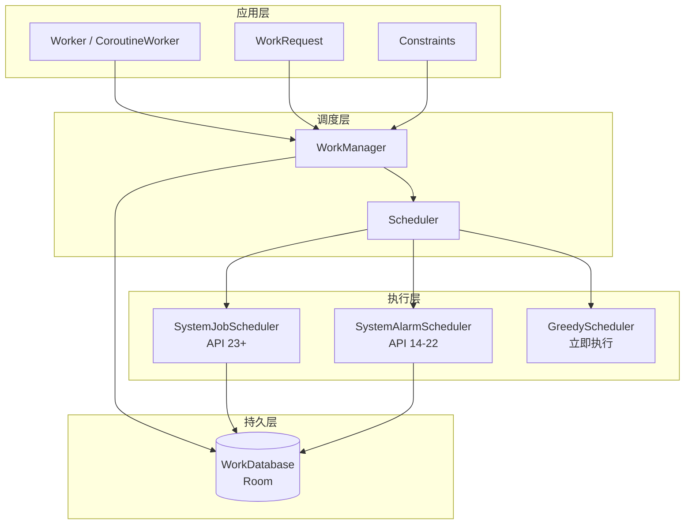
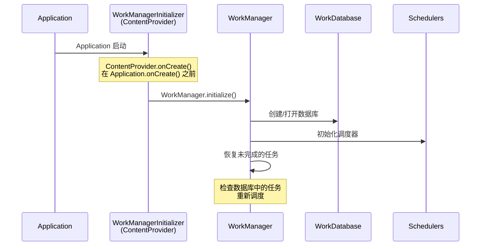
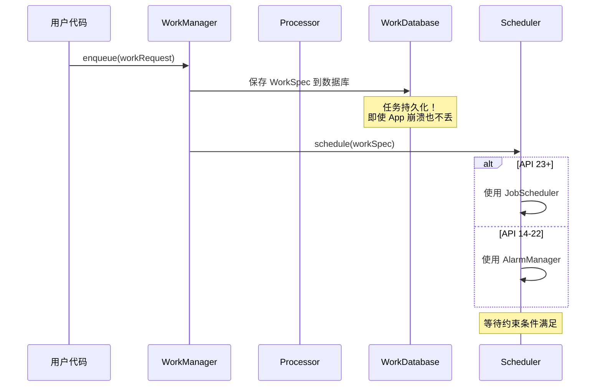
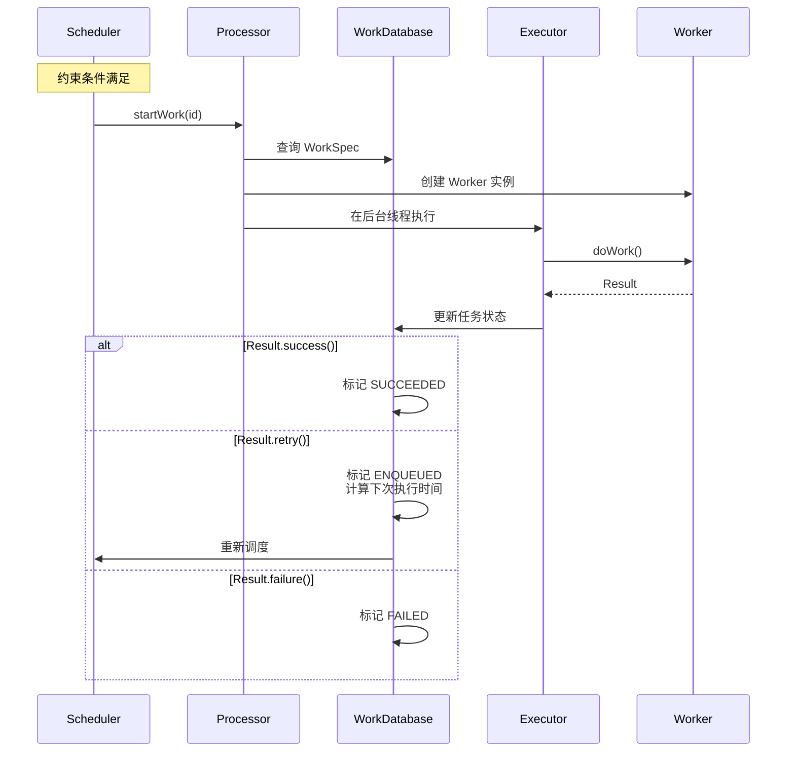
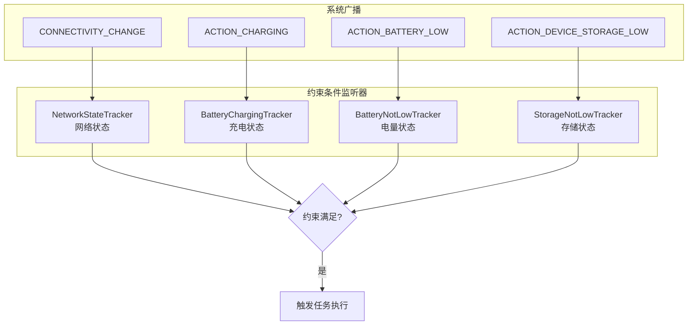
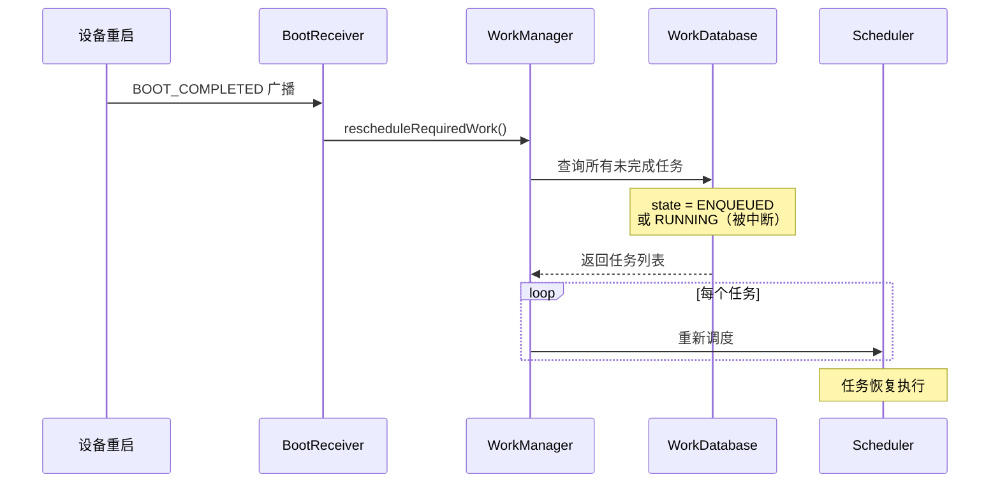

# WorkManager 源码篇

## 设计哲学

### 核心设计目标

```
┌─────────────────────────────────────────────────────────────────────────────┐
│                    WorkManager 设计哲学                                      │
├─────────────────────────────────────────────────────────────────────────────┤
│                                                                             │
│   1. 保证执行（Guaranteed Execution）                                       │
│      └── 任务持久化到数据库，即使应用退出也能恢复                             │
│                                                                             │
│   2. 向后兼容（Backward Compatible）                                        │
│      └── 一套 API 适配 API 14 ~ 最新版本                                    │
│                                                                             │
│   3. 电池友好（Battery Friendly）                                           │
│      └── 智能调度，合并任务，遵守 Doze 模式                                  │
│                                                                             │
│   4. 约束驱动（Constraint-Driven）                                          │
│      └── 任务在合适的条件下执行，不浪费资源                                  │
│                                                                             │
└─────────────────────────────────────────────────────────────────────────────┘
```

### 架构分层



## 核心流程分析

### 1. 初始化流程

**一句话总结**：WorkManager 通过 ContentProvider 自动初始化，无需手动调用。



**关键源码**：

```kotlin
// WorkManagerInitializer.java（简化版）
public class WorkManagerInitializer extends ContentProvider {
    @Override
    public boolean onCreate() {
        // ContentProvider 在 Application 之前初始化
        // 这就是为什么不需要手动初始化 WorkManager
        WorkManager.initialize(getContext(), new Configuration.Builder().build());
        return true;
    }
}
```

**设计亮点**：利用 ContentProvider 的特性（在 Application.onCreate() 之前执行）实现自动初始化，对开发者透明。

### 2. 任务入队流程

**一句话总结**：任务先持久化到数据库，再交给调度器调度。



**关键源码**：

```kotlin
// WorkManagerImpl.java（简化版）
public Operation enqueue(WorkRequest workRequest) {
    return new WorkContinuationImpl(this, workRequest).enqueue();
}

// WorkContinuationImpl.java
public Operation enqueue() {
    // 1. 将任务信息写入数据库
    workDatabase.workSpecDao().insertWorkSpec(workSpec);
    
    // 2. 交给调度器
    Schedulers.schedule(configuration, workDatabase, schedulers);
    
    return operation;
}
```

### 3. 任务执行流程

**一句话总结**：约束满足后，Processor 从数据库取出任务，在 Executor 中执行。



**关键源码**：

```kotlin
// Processor.java（简化版）
public boolean startWork(String id) {
    WorkSpec workSpec = workDatabase.workSpecDao().getWorkSpec(id);
    
    // 创建 Worker 实例
    Worker worker = workerFactory.createWorker(
        appContext, 
        workSpec.workerClassName,
        workerParameters
    );
    
    // 在 Executor 中执行
    executor.execute(() -> {
        Result result = worker.doWork();
        
        // 根据结果更新数据库
        if (result == Result.success()) {
            workDatabase.workSpecDao().setState(SUCCEEDED, id);
        } else if (result == Result.retry()) {
            workDatabase.workSpecDao().setState(ENQUEUED, id);
            // 重新调度
            Schedulers.schedule(...);
        } else {
            workDatabase.workSpecDao().setState(FAILED, id);
        }
    });
    
    return true;
}
```

## 调度机制深度分析

### 调度器选择策略

```
┌─────────────────────────────────────────────────────────────────────────────┐
│                    调度器选择策略                                            │
├─────────────────────────────────────────────────────────────────────────────┤
│                                                                             │
│   API Level        调度器                   原因                             │
│   ─────────────────────────────────────────────────────────────────────────  │
│   API 23+          JobScheduler             原生支持，最优                   │
│   API 14-22        AlarmManager +           JobScheduler 不可用             │
│                    BroadcastReceiver                                        │
│                                                                             │
│   所有版本         GreedyScheduler          无约束条件时                     │
│                    (立即执行)                直接执行更快                     │
│                                                                             │
└─────────────────────────────────────────────────────────────────────────────┘
```

**关键源码**：

```kotlin
// Schedulers.java（简化版）
public static Scheduler[] createSchedulers(Context context) {
    List<Scheduler> schedulers = new ArrayList<>();
    
    // 1. 优先使用 JobScheduler (API 23+)
    if (Build.VERSION.SDK_INT >= Build.VERSION_CODES.M) {
        schedulers.add(new SystemJobScheduler(context));
    } else {
        // 2. 降级使用 AlarmManager
        schedulers.add(new SystemAlarmScheduler(context));
    }
    
    // 3. GreedyScheduler 总是添加（处理无约束的即时任务）
    schedulers.add(new GreedyScheduler(context));
    
    return schedulers.toArray(new Scheduler[0]);
}
```

### 约束条件监听

**设计哲学**：不轮询，用广播监听系统状态变化。



**关键源码**：

```kotlin
// ConstraintController.java（简化版）
abstract class ConstraintController<T> {
    
    // 当约束状态变化时调用
    void onConstraintChanged(T newValue) {
        // 检查是否所有约束都满足
        if (areAllConstraintsMet(workSpec)) {
            // 通知可以执行任务
            callback.onConstraintMet(workSpecId);
        }
    }
}

// NetworkStateTracker.java（简化版）
class NetworkStateTracker extends ConstraintTracker<NetworkState> {
    
    @Override
    public void startTracking() {
        // 注册网络状态广播接收器
        IntentFilter filter = new IntentFilter(ConnectivityManager.CONNECTIVITY_ACTION);
        context.registerReceiver(broadcastReceiver, filter);
    }
    
    private BroadcastReceiver broadcastReceiver = new BroadcastReceiver() {
        @Override
        public void onReceive(Context context, Intent intent) {
            // 网络状态变化，通知约束控制器
            setState(getActiveNetworkState());
        }
    };
}
```

## 持久化策略

### 数据库设计

WorkManager 使用 Room 数据库存储任务信息：

```
┌─────────────────────────────────────────────────────────────────────────────┐
│                    WorkDatabase 表结构                                       │
├─────────────────────────────────────────────────────────────────────────────┤
│                                                                             │
│  ┌─────────────────────────────────────────────────────────────────┐        │
│  │ WorkSpec 表（核心表）                                           │        │
│  ├─────────────────────────────────────────────────────────────────┤        │
│  │ id              VARCHAR PRIMARY KEY   任务唯一标识               │        │
│  │ state           INTEGER               任务状态                   │        │
│  │ worker_class    VARCHAR               Worker 类名                │        │
│  │ input           BLOB                  输入数据                   │        │
│  │ output          BLOB                  输出数据                   │        │
│  │ constraints     VARCHAR               约束条件（JSON）           │        │
│  │ run_attempt     INTEGER               已尝试次数                 │        │
│  │ backoff_policy  INTEGER               退避策略                   │        │
│  │ period_start    INTEGER               周期开始时间               │        │
│  │ interval        INTEGER               周期间隔                   │        │
│  │ flex_interval   INTEGER               弹性间隔                   │        │
│  │ ...                                                              │        │
│  └─────────────────────────────────────────────────────────────────┘        │
│                                                                             │
│  ┌─────────────────────────────────────────────────────────────────┐        │
│  │ Dependency 表（任务依赖关系）                                    │        │
│  ├─────────────────────────────────────────────────────────────────┤        │
│  │ work_spec_id    VARCHAR   任务 ID                                │        │
│  │ prerequisite_id VARCHAR   前置任务 ID                            │        │
│  └─────────────────────────────────────────────────────────────────┘        │
│                                                                             │
│  ┌─────────────────────────────────────────────────────────────────┐        │
│  │ WorkTag 表（任务标签）                                           │        │
│  ├─────────────────────────────────────────────────────────────────┤        │
│  │ tag             VARCHAR   标签                                   │        │
│  │ work_spec_id    VARCHAR   任务 ID                                │        │
│  └─────────────────────────────────────────────────────────────────┘        │
│                                                                             │
└─────────────────────────────────────────────────────────────────────────────┘
```

### 任务恢复机制



**关键源码**：

```kotlin
// RescheduleReceiver.java
public class RescheduleReceiver extends BroadcastReceiver {
    @Override
    public void onReceive(Context context, Intent intent) {
        if (Intent.ACTION_BOOT_COMPLETED.equals(intent.getAction())) {
            // 设备重启后，重新调度所有未完成的任务
            WorkManagerImpl.getInstance(context).rescheduleEligibleWork();
        }
    }
}

// WorkManagerImpl.java
public void rescheduleEligibleWork() {
    // 查询数据库中所有需要重新调度的任务
    List<WorkSpec> eligibleWorkSpecs = workDatabase.workSpecDao()
        .getEligibleWorkForScheduling();
    
    // 重新调度
    for (WorkSpec workSpec : eligibleWorkSpecs) {
        schedulers.schedule(workSpec);
    }
}
```

## 源码洞察

### 1. 优雅的初始化设计

**利用 ContentProvider 自动初始化**是 WorkManager 的一个设计亮点：

```kotlin
// 用户不需要写这些代码
// WorkManager.initialize(this, Configuration.Builder().build())

// 因为 WorkManagerInitializer 是一个 ContentProvider
// AndroidManifest.xml 中声明后，系统会自动调用 onCreate()
```

**可借鉴之处**：
- 需要早期初始化的库可以用 ContentProvider
- 对开发者透明，减少样板代码

### 2. 策略模式的调度器设计

WorkManager 使用策略模式，根据 API 版本选择不同的调度器：

```kotlin
interface Scheduler {
    void schedule(WorkSpec workSpec);
    void cancel(String workSpecId);
}

class SystemJobScheduler implements Scheduler { /* API 23+ */ }
class SystemAlarmScheduler implements Scheduler { /* API 14-22 */ }
class GreedyScheduler implements Scheduler { /* 立即执行 */ }
```

**可借鉴之处**：
- 策略模式隔离平台差异
- 易于扩展新的调度方式

### 3. 观察者模式的状态管理

WorkManager 使用 LiveData 暴露任务状态，天然支持生命周期：

```kotlin
// 内部使用 LiveData + Room 实现状态变化通知
@Dao
interface WorkSpecDao {
    @Query("SELECT * FROM workspec WHERE id = :id")
    fun getWorkStatusPojoLiveData(id: String): LiveData<WorkInfo>
}
```

**可借鉴之处**：
- Room + LiveData 实现数据库变化自动通知
- 生命周期安全，不会内存泄漏

### 4. 链式任务的图结构

链式任务在数据库中用 `Dependency` 表存储依赖关系，本质是一个有向无环图（DAG）：

```
A → B → D
    ↘   ↗
      C

Dependency 表：
| work_spec_id | prerequisite_id |
|--------------|-----------------|
| B            | A               |
| C            | B               |
| D            | B               |
| D            | C               |
```

**可借鉴之处**：
- 用关系表存储图结构
- 拓扑排序确定执行顺序

## 常见源码问题

### Q1：WorkManager 是如何保证任务一定会执行的？

**答案**：通过三个机制保证：

1. **持久化**：任务信息存储到 Room 数据库，应用退出后不丢失
2. **重启恢复**：注册 `BOOT_COMPLETED` 广播，设备重启后重新调度
3. **系统调度**：使用 JobScheduler/AlarmManager 等系统服务，不依赖 App 进程

```
应用退出 → 数据库保留 → 系统服务触发 → 重新启动 App → 执行任务
设备重启 → BOOT_COMPLETED → 查询数据库 → 重新调度
```

### Q2：WorkManager 在不同 Android 版本上的底层实现有什么不同？

**答案**：

| API 版本 | 底层实现 | 特点 |
|---------|---------|------|
| API 23+ | JobScheduler | 原生支持约束条件，最优 |
| API 14-22 | AlarmManager + BroadcastReceiver | 兼容实现，功能等价 |

选择逻辑：
```kotlin
if (SDK >= 23) {
    使用 SystemJobScheduler
} else {
    使用 SystemAlarmScheduler（AlarmManager + BroadcastReceiver 组合）
}
```

### Q3：约束条件是如何监听的？

**答案**：WorkManager 为每种约束条件注册对应的系统广播接收器：

| 约束 | 监听广播 |
|-----|---------|
| 网络 | `CONNECTIVITY_ACTION` |
| 充电 | `ACTION_POWER_CONNECTED/DISCONNECTED` |
| 电量 | `ACTION_BATTERY_LOW/OKAY` |
| 存储 | `ACTION_DEVICE_STORAGE_LOW/OKAY` |
| 空闲 | 使用 `UsageStatsManager` 或 PowerManager |

当广播触发时，检查所有约束是否满足，满足则执行任务。

### Q4：WorkManager 的任务重试机制是怎样的？

**答案**：

1. Worker 返回 `Result.retry()` 后，任务状态变为 `ENQUEUED`
2. 根据 `BackoffPolicy` 计算下次执行时间：
   - `LINEAR`：`initialDelay * runAttemptCount`
   - `EXPONENTIAL`：`initialDelay * 2^(runAttemptCount-1)`
3. 将计算出的时间存入数据库
4. 重新调度任务

```kotlin
// 计算退避时间（简化版）
long backoffDelay = backoffPolicy == EXPONENTIAL
    ? (long) Math.pow(2, runAttemptCount - 1) * initialDelay
    : initialDelay * runAttemptCount;

// 设置下次执行时间
nextScheduleTime = System.currentTimeMillis() + backoffDelay;
```

### Q5：链式任务的依赖关系是如何管理的？

**答案**：

1. 依赖关系存储在 `Dependency` 表中
2. 任务入队时，检查是否有未完成的前置任务
3. 如果有，设置状态为 `BLOCKED`
4. 前置任务完成后，检查后续任务是否可以执行
5. 使用拓扑排序确保执行顺序正确

```kotlin
// 伪代码
fun onWorkCompleted(workSpecId: String) {
    // 找到所有依赖这个任务的后续任务
    val dependents = dependencyDao.getDependents(workSpecId)
    
    for (dependent in dependents) {
        // 检查所有前置任务是否都完成了
        if (allPrerequisitesCompleted(dependent)) {
            // 将状态从 BLOCKED 改为 ENQUEUED
            workSpecDao.setState(ENQUEUED, dependent)
            // 调度执行
            scheduler.schedule(dependent)
        }
    }
}
```

## 延伸思考

### 如果让你设计 WorkManager，你会怎么做？

**核心问题**：
1. 如何保证应用退出后任务还能执行？
2. 如何适配不同 Android 版本？
3. 如何高效监听约束条件？

**参考方案**：
1. **持久化**：必须有持久化存储（数据库/文件）
2. **系统服务**：必须借助系统服务（JobScheduler/AlarmManager）
3. **广播监听**：约束条件用广播监听，不用轮询

**Google 的选择**：
- 数据库选 Room（SQLite）：成熟稳定，支持 LiveData
- 调度选 JobScheduler：系统原生，电池友好
- 向后兼容用 AlarmManager：覆盖旧版本

### WorkManager 的局限性

1. **最小周期 15 分钟**：无法实现更高频的定时任务
2. **不适合精确时间**：调度有延迟，不适合闹钟类需求
3. **强制停止后失效**：用户在设置中强制停止应用，任务会丢失
4. **执行时机不确定**：取决于系统调度，可能有延迟

---

## 面试检验

### 源码级问题

**Q1：WorkManager 是如何实现自动初始化的？**

> **答案**：通过 `WorkManagerInitializer` 这个 ContentProvider。ContentProvider 的 `onCreate()` 会在 `Application.onCreate()` 之前被系统调用，WorkManager 利用这个特性在 `WorkManagerInitializer.onCreate()` 中完成初始化，对开发者完全透明。如果需要自定义配置，可以在 Manifest 中移除默认的 Initializer，手动调用 `WorkManager.initialize()`。

**Q2：WorkManager 的任务信息存储在哪里？**

> **答案**：存储在 Room 数据库中，数据库名为 `androidx.work.workdb`。核心表包括：
> - `WorkSpec`：存储任务的所有信息（Worker 类名、状态、约束、退避策略等）
> - `Dependency`：存储任务之间的依赖关系
> - `WorkTag`：存储任务的标签
> - `WorkName`：存储唯一任务名
> 
> 使用 Room 的好处是可以方便地用 LiveData 观察数据变化。

**Q3：描述一下任务从入队到执行的完整流程。**

> **答案**：
> 1. **入队**：调用 `enqueue()`，任务信息写入 WorkDatabase
> 2. **调度**：Scheduler 根据约束条件决定执行时机
>    - 无约束：GreedyScheduler 立即执行
>    - 有约束：JobScheduler/AlarmManager 等待条件满足
> 3. **约束监听**：通过系统广播监听网络、电量等状态变化
> 4. **触发执行**：约束满足后，调度器通知 Processor
> 5. **执行**：Processor 创建 Worker 实例，在 Executor 中调用 `doWork()`
> 6. **结果处理**：根据 Result 更新数据库状态，必要时重新调度

**Q4：WorkManager 如何处理设备重启后的任务恢复？**

> **答案**：WorkManager 注册了 `RescheduleReceiver` 来接收 `BOOT_COMPLETED` 广播。设备重启后：
> 1. 系统发送 `BOOT_COMPLETED`
> 2. `RescheduleReceiver.onReceive()` 被调用
> 3. 调用 `WorkManager.rescheduleEligibleWork()`
> 4. 从数据库查询所有状态为 `ENQUEUED` 或 `RUNNING`（被中断）的任务
> 5. 重新提交给 Scheduler 调度

**Q5：CoroutineWorker 和 Worker 在实现上有什么区别？**

> **答案**：
> - `Worker`：`doWork()` 是普通方法，在 WorkManager 的 Executor 线程中同步执行
> - `CoroutineWorker`：`doWork()` 是挂起函数，默认在 `Dispatchers.Default` 中执行，可以使用协程特性
> 
> 实现上，`CoroutineWorker` 继承自 `ListenableWorker`，内部使用 `CoroutineScope` 管理协程生命周期。当任务被取消时，协程也会被取消（通过 `Job.cancel()`）。

---

_本篇完。建议结合实际项目阅读 WorkManager 源码，加深理解。_
