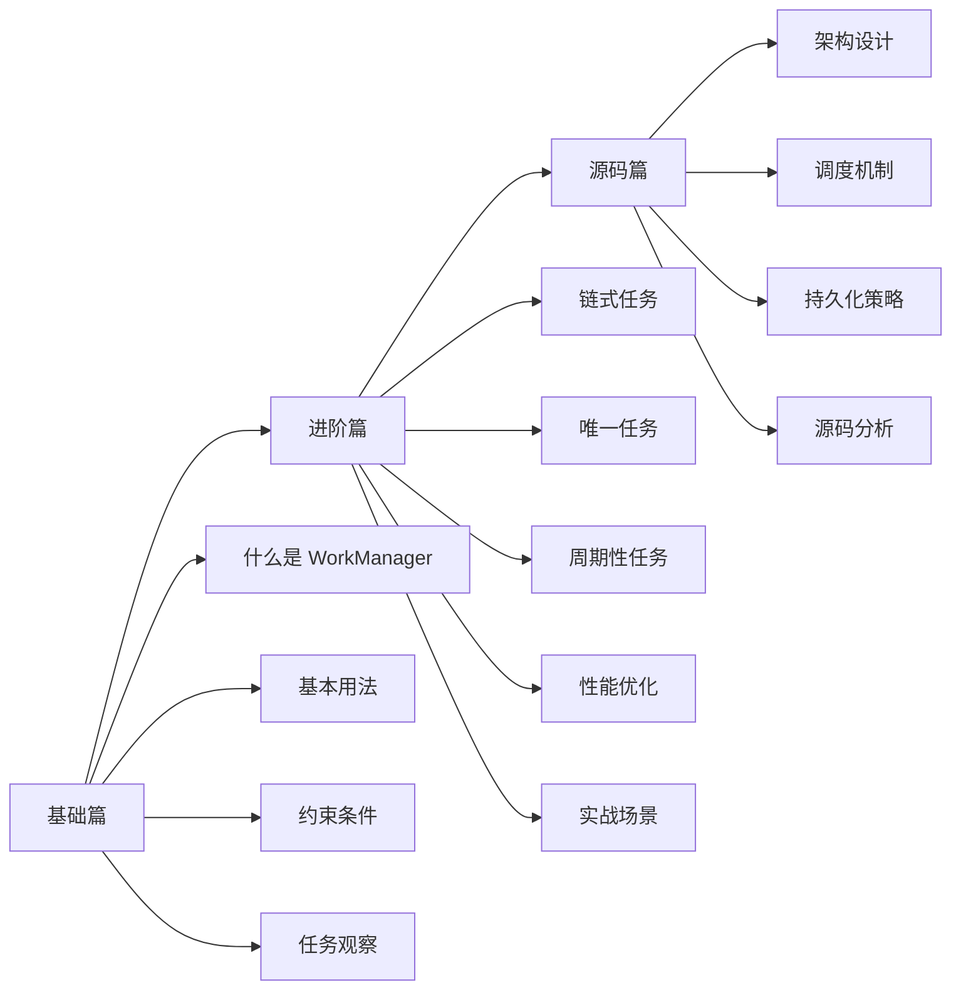

# WorkManager 学习指南

## 概述

WorkManager 是 Android Jetpack 中用于管理**可延迟、可靠执行**的后台任务的组件。它是目前 Android 官方推荐的后台任务解决方案，能够根据设备状态智能调度任务，即使应用退出或设备重启也能保证任务执行。

## 核心能力

```
┌─────────────────────────────────────────────────────────────────────────────┐
│                        WorkManager 核心能力                                  │
├─────────────────────────────────────────────────────────────────────────────┤
│                                                                             │
│  ┌─────────────────┐  ┌─────────────────┐  ┌─────────────────┐             │
│  │   保证执行 ✅    │  │   约束条件 ⚡   │  │   链式任务 🔗   │             │
│  │                 │  │                 │  │                 │             │
│  │ 应用退出后继续   │  │ 网络、电量、    │  │ 顺序执行        │             │
│  │ 设备重启后恢复   │  │ 存储空间等      │  │ 并行执行        │             │
│  └─────────────────┘  └─────────────────┘  └─────────────────┘             │
│                                                                             │
│  ┌─────────────────┐  ┌─────────────────┐  ┌─────────────────┐             │
│  │   任务调度 📅    │  │   进度观察 👀   │  │   向后兼容 📱   │             │
│  │                 │  │                 │  │                 │             │
│  │ 一次性任务       │  │ LiveData 观察   │  │ API 14+ 支持    │             │
│  │ 周期性任务       │  │ 实时进度更新    │  │ 自动选择最优实现│             │
│  └─────────────────┘  └─────────────────┘  └─────────────────┘             │
│                                                                             │
└─────────────────────────────────────────────────────────────────────────────┘
```

## 学习路线



## 重要程度

| 知识点 | 重要程度 | 面试频率 | 说明 |
|-------|---------|---------|------|
| 基本概念与使用 | ⭐⭐⭐⭐⭐ | 高 | 必须掌握 |
| 约束条件 | ⭐⭐⭐⭐⭐ | 高 | 核心特性 |
| Worker 类型 | ⭐⭐⭐⭐ | 中 | 常用知识 |
| 链式任务 | ⭐⭐⭐⭐ | 中 | 复杂场景必备 |
| 唯一任务 | ⭐⭐⭐⭐ | 中 | 避免重复执行 |
| 周期性任务 | ⭐⭐⭐ | 中 | 定时任务场景 |
| 进度更新 | ⭐⭐⭐ | 低 | 特定场景使用 |
| 与其他方案对比 | ⭐⭐⭐⭐ | 高 | 面试常问 |
| 源码原理 | ⭐⭐⭐ | 中 | 深度理解 |

## 核心问题预览

### 基础篇必知必会

1. WorkManager 是什么？它和 Service、AlarmManager 有什么区别？
2. WorkManager 的四个核心类是什么？各自的职责是什么？
3. 如何定义一个 Worker？doWork() 的返回值有哪些含义？
4. 什么是约束条件？WorkManager 支持哪些约束？
5. WorkRequest 有哪两种类型？分别用于什么场景？

### 进阶篇深度问题

1. 链式任务是如何工作的？如何处理依赖关系？
2. 唯一任务有什么用？ExistingWorkPolicy 的几种策略有什么区别？
3. 周期性任务的最小间隔是多少？为什么有这个限制？
4. Worker 中如何传递数据？数据大小有什么限制？
5. 如何在 Worker 中使用协程？CoroutineWorker 有什么优势？

### 源码篇专家级问题

1. WorkManager 是如何保证任务在应用退出后仍能执行的？
2. WorkManager 在不同 Android 版本上的调度策略有什么不同？
3. 任务持久化是如何实现的？用的什么数据库？
4. WorkManager 的初始化过程是怎样的？ContentProvider 起什么作用？
5. 约束条件是如何监听的？当条件满足时如何触发任务执行？

## 文档目录

| 文档 | 内容 | 目标读者 |
|-----|------|---------|
| [1-基础篇](./1-基础篇.md) | 概念理解、基本用法、常见问题 | 入门开发者 |
| [2-进阶篇](./2-进阶篇.md) | 高级特性、性能优化、实战经验 | 中级开发者 |
| [3-源码篇](./3-源码篇.md) | 设计哲学、源码分析、深度原理 | 高级开发者 |

## 适用场景速查

```
✅ 适合用 WorkManager：
├── 日志上传、数据同步
├── 图片/文件压缩上传
├── 定期清理缓存
├── 周期性数据备份
└── 需要保证执行的后台任务

❌ 不适合用 WorkManager：
├── 需要精确时间执行（用 AlarmManager）
├── 需要立即执行且不能延迟（用 Foreground Service）
├── 简单的异步操作（用协程/RxJava）
└── 需要与用户持续交互（用 Service）
```

---

_建议按照 基础篇 → 进阶篇 → 源码篇 的顺序学习_
