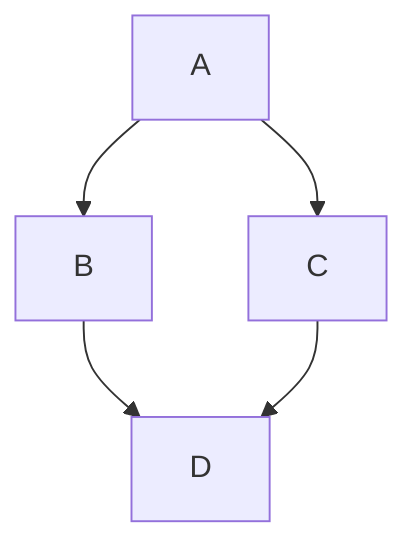
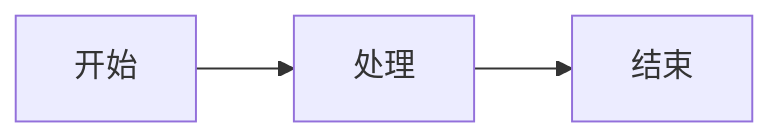
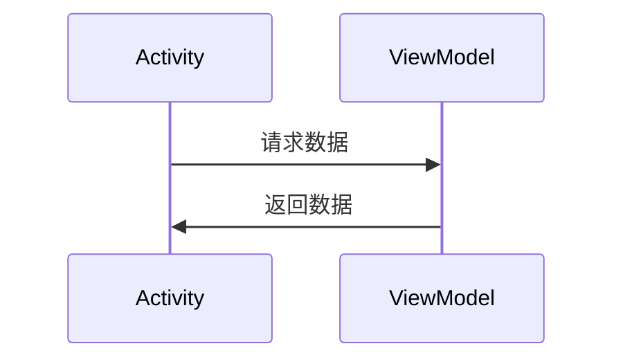
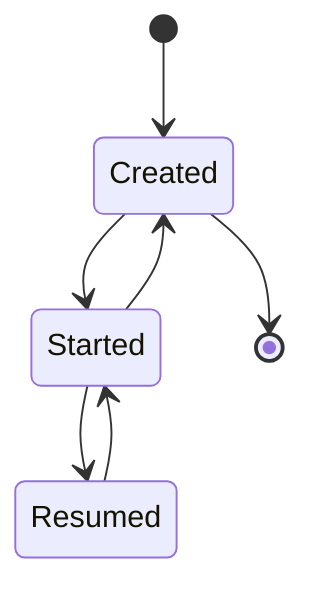

# Mermaid 测试文档

## 1. 代码高亮测试

```kotlin
fun main() {
    println("Hello, World!")
}
```

```js
public class Test {
    public static void main(String[] args) {
        System.out.println("Hello");
    }
}
```

```python
def main():
    print("Hello, World!")

if __name__ == "__main__":
    main()
```

```javascript typescript
function greet(name) {
    console.log(`Hello, ${name}!`);
}
greet("World");
```

```typescript
interface User {
    name: string;
    age: number;
}

const user: User = { name: "张三", age: 25 };
console.log(user.name);
```

```swift
func greet(_ name: String) -> String {
    return "Hello, \(name)!"
}
print(greet("World"))
```

```go
package main

import "fmt"

func main() {
    fmt.Println("Hello, World!")
}
```

```rust
fn main() {
    println!("Hello, World!");
}
```

```c
#include <stdio.h>

int main() {
    printf("Hello, World!\n");
    return 0;
}
```

```cpp
#include <iostream>

int main() {
    std::cout << "Hello, World!" << std::endl;
    return 0;
}
```

```csharp
using System;

class Program {
    static void Main() {
        Console.WriteLine("Hello, World!");
    }
}
```

```ruby
def greet(name)
    puts "Hello, #{name}!"
end

greet("World")
```

```php
<?php
function greet($name) {
    echo "Hello, $name!";
}
greet("World");
?>
```

```sql
SELECT id, name, age
FROM users
WHERE age > 18
ORDER BY name ASC;
```

```bash
#!/bin/bash
echo "Hello, World!"
for i in {1..5}; do
    echo "Count: $i"
done
```

```yaml
# 配置文件示例
server:
  port: 8080
  host: localhost
database:
  name: mydb
  user: admin
```

```json
{
    "name": "项目名称",
    "version": "1.0.0",
    "dependencies": {
        "lodash": "^4.17.21"
    }
}
```

```xml
<?xml version="1.0" encoding="UTF-8"?>
<LinearLayout xmlns:android="http://schemas.android.com/apk/res/android"
    android:layout_width="match_parent"
    android:layout_height="match_parent">
    <TextView android:text="Hello" />
</LinearLayout>
```

```groovy
// Gradle 构建脚本
dependencies {
    implementation 'androidx.core:core-ktx:1.12.0'
    implementation 'androidx.lifecycle:lifecycle-viewmodel-ktx:2.7.0'
}
```

```dart
void main() {
    var greeting = 'Hello, World!';
    print(greeting);
}
```

```scala
object Hello {
    def main(args: Array[String]): Unit = {
        println("Hello, World!")
    }
}
```

## 2. Mermaid 流程图测试





## 3. Mermaid 时序图测试



## 4. Mermaid 状态图测试



## 5. 普通文本

这是普通文本，用来对比。
