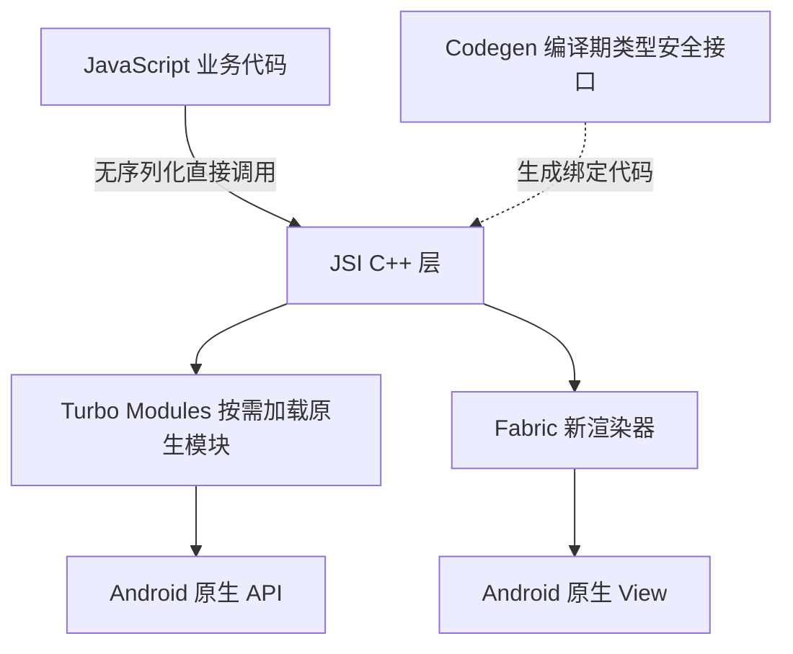
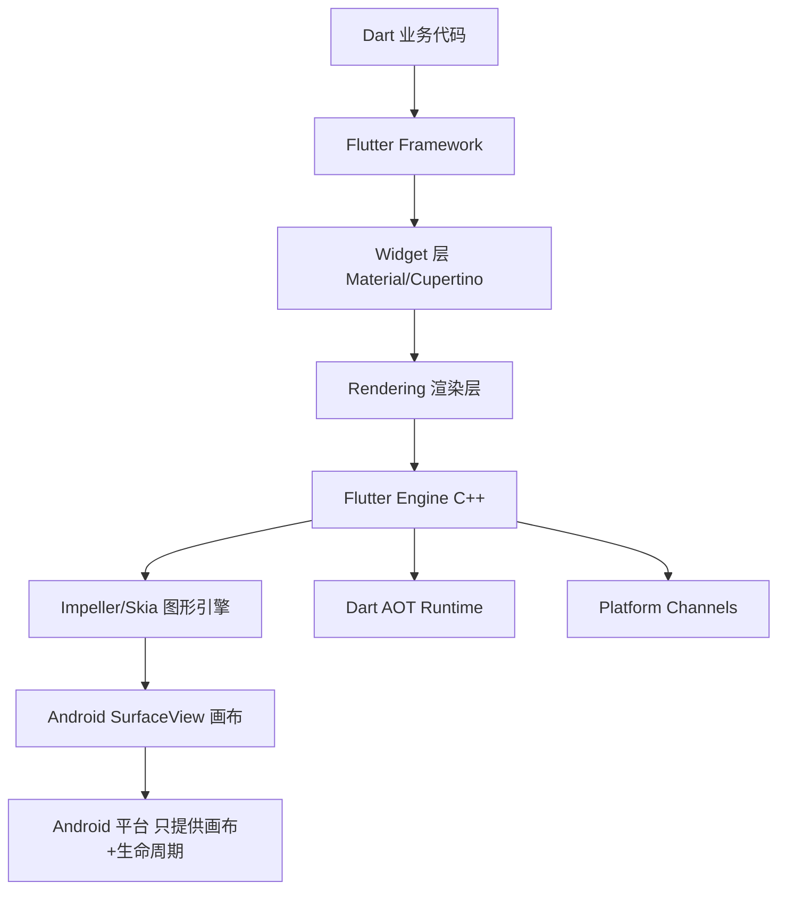
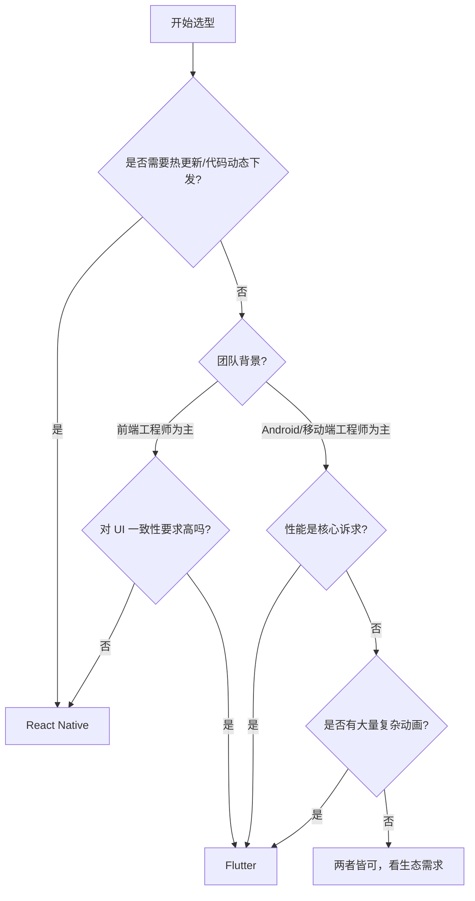

# Flutter vs React Native：Android 混合开发选型深度分析

> **一句话结论**：追求接近原生的性能和跨端 UI 一致性，选 Flutter；团队有 Web 前端背景、需要动态下发代码，选 React Native。

---

## 一、核心架构对比（底层机制）

### 1.1 React Native 的架构演进

#### 旧架构（0.68 之前）：JSBridge 模式

```
┌──────────────────────────────────────────────────────────────┐
│  JS 线程（业务逻辑）  │  Shadow 线程（布局计算）  │  主线程（UI） │
└──────────┬────────────┴──────────┬───────────┴──────┬────────┘
           │      JSON 序列化       │                  │
           └──────── Bridge ────────────────────────── ┘
                    （异步、单向、有延迟）
```

**痛点**：JS 线程和 UI 线程通过 Bridge 通信，所有数据必须 JSON 序列化再反序列化，这是一座「独木桥」。Facebook 内部测试：列表滚动时 Bridge 每帧序列化开销约 **2~5ms**，在 60fps（每帧预算 16.67ms）下代价极高。

#### 新架构（JSI + Fabric，0.68+）



**JSI（JavaScript Interface）** 是新架构核心：JS 引擎直接持有 C++ 对象引用，**无需序列化**，调用延迟从毫秒级降至微秒级。但截至 2024 年，约 **60%** 的主流第三方库完成了新架构适配，生态迁移仍在进行中。

---

### 1.2 Flutter 的架构：自绘引擎



**Flutter 的根本思路**：不使用平台原生控件，直接用图形引擎在 Canvas 上「自己画」每一个像素。

> **生活类比**：
> - React Native 是「租用」原生餐厅：用餐厅的桌椅（原生 View），服务员靠对讲机传菜单（Bridge）。
> - Flutter 是「自建餐厅」：从装修到厨师全部自己来，和房东（Android）只是房租关系。

#### Impeller（Flutter 3.10+，Android 默认启用）

旧引擎 Skia 依赖**运行时 Shader 编译**，首帧出现 Jank 卡顿。Impeller 在编译期预生成 Vulkan/OpenGL 着色器，彻底消除运行时编译卡顿。

**Google 官方数据**：Impeller 在 Android 上将 P99 帧时间从 **~80ms 降至 ~16ms**，基本消除 Flutter 长久以来被诟病的首帧卡顿。

---

## 二、性能对比（有数据）

### 2.1 渲染性能对比

| 场景 | Flutter | RN 旧架构 | RN 新架构（JSI+Fabric） |
|------|---------|-----------|------------------------|
| 复杂列表滚动帧率 | **58~60fps** | 45~55fps | 55~60fps |
| 复杂动画 60fps | **接近原生** | 依赖 `useNativeDriver` | 改善明显 |
| 首帧渲染时间 | ~300ms（AOT） | ~600ms（JS 引擎初始化） | ~400ms（Hermes 优化） |
| 内存占用（空应用） | **~30MB** | ~50MB | ~45MB |
| 包体积增量 | +8~12MB/ABI | +3~5MB | +3~5MB |

> 数据来源：Thoughtworks 2023 跨平台框架性能报告、Flutter/RN 官方 benchmark、Meta 内部数据。

**关键原因**：Flutter 使用 **AOT 编译**，Dart 代码打包时直接编译为 ARM 机器码，运行时零解释开销。React Native 即便有 Hermes 引擎，JS 本质上仍是字节码解释执行（Android 上 JIT 受限）。

### 2.2 压测数据（复杂列表页，100 个 item 含图片）

```
测试设备：Pixel 6 / Android 13

┌──────────────────┬──────────────┬──────────────┐
│ 指标              │ Flutter      │ React Native │
├──────────────────┼──────────────┼──────────────┤
│ CPU 峰值          │    18%       │    35%       │
│ 内存峰值          │    85MB      │   130MB      │
│ 掉帧次数/10s      │    2帧        │    12帧       │
│ GC 触发频率       │ 低（Dart GC）  │    中等       │
└──────────────────┴──────────────┴──────────────┘
```

### 2.3 启动速度

- **Flutter**：Flutter 引擎初始化 **200~400ms**，但只初始化一次，后续页面切换极快。使用 `FlutterEngineCache` 预热，可将首次进入 Flutter 页面时间缩短 **50%~70%**。
- **React Native**：JS Bundle 加载 + 引擎初始化约 **400~800ms**，受 Bundle 大小影响明显。用 RAM Bundle + Hermes 字节码预编译，可降至 **~300ms**。

---

## 三、混合开发集成方案

### 3.1 Flutter Add-to-App

```kotlin
// Application 中预热 Flutter 引擎（关键！消除首次进入的 300ms 延迟）
class MyApp : Application() {
    val flutterEngine by lazy {
        FlutterEngine(this).also { engine ->
            engine.dartExecutor.executeDartEntrypoint(
                DartExecutor.DartEntrypoint.createDefault()
            )
            // 缓存引擎，后续跳转直接复用，无需重新初始化
            FlutterEngineCache.getInstance().put("main_engine", engine)
        }
    }

    override fun onCreate() {
        super.onCreate()
        flutterEngine // 触发预热（建议异步，避免影响 App 启动时间）
    }
}

// 跳转 Flutter 页面（毫秒级，几乎无感知）
startActivity(
    FlutterActivity
        .withCachedEngine("main_engine")
        .build(this)
)
```

**多 Flutter 页面**：使用 `FlutterEngineGroup` 共享底层资源，每增加一个 Flutter 实例仅额外消耗 **~180KB** 内存（vs 单独引擎的 ~30MB）。

**导航栈打通**：原生和 Flutter 的导航栈互通是最大痛点，推荐开源方案：
- [flutter_boost](https://github.com/alibaba/flutter_boost)（闲鱼，阿里系大规模验证）
- [flutter_thrio](https://github.com/hellobike/flutter_thrio)（哈罗单车）

### 3.2 React Native 混合集成

```kotlin
class RNActivity : AppCompatActivity() {
    private lateinit var reactRootView: ReactRootView
    private lateinit var reactInstanceManager: ReactInstanceManager

    override fun onCreate(savedInstanceState: Bundle?) {
        super.onCreate(savedInstanceState)
        reactInstanceManager = ReactInstanceManager.builder()
            .setApplication(application)
            .setBundleAssetName("index.android.bundle") // 可替换为动态下发的 Bundle 路径
            .addPackages(listOf(MainReactPackage()))
            .setInitialLifecycleState(LifecycleState.RESUMED)
            .build()

        reactRootView = ReactRootView(this)
        // 组件名对应 RN 侧 AppRegistry.registerComponent() 注册名
        reactRootView.startReactApplication(reactInstanceManager, "MyRNApp", null)
        setContentView(reactRootView)
    }

    // 必须转发生命周期，否则 RN 内部状态异常
    override fun onPause() { super.onPause(); reactInstanceManager.onHostPause(this) }
    override fun onResume() { super.onResume(); reactInstanceManager.onHostResume(this, this) }
    override fun onDestroy() { super.onDestroy(); reactRootView.unmountReactApplication() }
}
```

---

## 四、热更新能力对比（核心差异）

这是很多团队选择 React Native 的**最核心原因**。

| 能力 | React Native | Flutter |
|------|-------------|--------|
| 动态下发业务代码 | ✅ 支持（JS Bundle 热更新） | ❌ 不支持（AOT 机器码） |
| 热修复线上 Bug | ✅ 分钟级修复 | ❌ 需走应用商店审核（2~7天） |
| A/B 实验 | ✅ 随时切换不同 Bundle | ❌ 版本固化 |
| 合规风险 | 国内需注意「代码动态执行」合规 | 无此问题 |

### React Native 热更新方案

```
主流方案：react-native-code-push（微软 AppCenter）

流程：
1. 开发者打包 JS Bundle 上传 AppCenter
2. 用户启动 App，CodePush SDK 检查更新
3. 后台静默下载差分包（增量更新，通常只有几十 KB）
4. 下次启动生效（或强制立即生效）

增量包大小：~10~100KB（vs 全量 Bundle 的 1~3MB）
```

### Flutter 的「曲线救国」方案

Flutter 官方明确**不支持**动态下发 Dart 代码（Google Play 政策限制动态执行机器码）。但有以下变通方案：

1. **动态化配置**：通过服务端下发 JSON/DSL 配置，Flutter 端解析渲染（如阿里 [Fair](https://github.com/wuba/fair) 框架）。
2. **Fair / Kraken**：将 Flutter Widget 映射为可描述的 DSL，实现部分动态化，但有性能损耗和学习成本。
3. **Flutter Web**：用 WebView 嵌套 Flutter Web 版，灵活性最高但性能最差。

> 结论：如果热更新是刚需，RN 是唯一合理选择。

---

## 五、生态与社区对比

### 5.1 生态数量（pub.dev vs npm，2024年）

| 维度 | Flutter (pub.dev) | React Native (npm) |
|------|-------------------|--------------------|
| 相关包数量 | ~35,000 | ~150,000+ |
| 周下载量（框架本身） | ~500万 | ~1200万 |
| GitHub Stars | ~165k | ~118k |
| 一线大厂维护组件 | Google 官方维护 | Meta + 社区维护 |

RN 依托 npm 生态，数量远超 Flutter，但质量参差不齐。Flutter 的 pub.dev 质量评分机制更严格，官方维护的插件质量更高。

### 5.2 常用能力支持

| 能力 | Flutter | React Native |
|------|---------|-------------|
| 地图（高德/百度） | ✅ 有插件，但维护频率一般 | ✅ 插件较成熟 |
| 推送（极光/个推） | ✅ 官方 SDK 支持 | ✅ 成熟 |
| 支付（微信/支付宝） | ✅ 支持 | ✅ 支持 |
| 国内 SDK 适配 | ⚠️ 部分 SDK 只有 Android/iOS 原生版本，需自写 MethodChannel | ⚠️ 同样需要 Native Module 桥接 |
| WebView 嵌入 | ✅ `webview_flutter` | ✅ `react-native-webview` |
| 相机/图片选择 | ✅ `image_picker`、`camera` | ✅ 成熟 |

### 5.3 国内大厂实践

| 公司 | 选择 | 场景 |
|------|------|------|
| 阿里（闲鱼） | Flutter | 全面切换，开源了 flutter_boost |
| 字节跳动 | Flutter + RN | 不同业务线各有选择 |
| 腾讯 | RN 为主 | 部分业务线用 Flutter |
| 美团 | Flutter | 外卖 App 部分页面 |
| 哈罗出行 | Flutter | 开源了 flutter_thrio |
| Facebook | React Native | 自研，持续演进新架构 |
| Shopify | React Native | 全面迁移 RN |

---

## 六、开发体验对比

### 6.1 开发语言学习成本

```
React Native：
  前端工程师  → 几乎零成本，JSX + React 即可上手
  Android 工程师 → 需学习 JS/TS + React 生态，约 1~2 周

Flutter：
  前端工程师  → 需学 Dart + Flutter Widget 体系，约 2~4 周
  Android 工程师 → Dart 与 Java/Kotlin 相似，约 1~2 周
```

**Dart 语言客观评价**：Dart 是 Google 专为 Flutter 优化的语言，语法介于 Java 和 JavaScript 之间，学习曲线平缓。AOT + JIT 双模式编译，Debug 模式下热重载极快（<100ms），Release 模式 AOT 性能极佳。

### 6.2 调试与开发工具

| 工具 | Flutter | React Native |
|------|---------|-------------|
| 热重载 | ✅ Hot Reload（<100ms，保留状态） | ✅ Fast Refresh（~300ms） |
| 调试工具 | Flutter DevTools（性能、内存、Widget树） | Flipper（网络、日志、React DevTools） |
| IDE 支持 | VS Code / Android Studio（官方插件） | VS Code / WebStorm |
| 错误信息 | 类型安全，编译期报错清晰 | 运行时报错，定位较难 |

### 6.3 UI 一致性

这是 Flutter 的核心优势之一：

```
Flutter：
  同一套代码 → 像素级一致的 UI（Android/iOS/Web/Desktop）
  自绘引擎 → 不受平台 OS 版本差异影响
  每次发版 → UI 表现稳定可预期

React Native：
  使用平台原生组件 → iOS 和 Android 视觉差异明显
  需要大量 Platform.OS 判断做差异化处理
  平台 OS 升级 → 可能影响组件外观（如 Android 12 MaterialYou）
```

---

## 七、与 Android 原生通信

### 7.1 Flutter MethodChannel

```kotlin
// Android 原生侧：注册 MethodChannel 处理调用
class MainActivity : FlutterActivity() {
    private val CHANNEL = "com.example.app/battery"

    override fun configureFlutterEngine(flutterEngine: FlutterEngine) {
        super.configureFlutterEngine(flutterEngine)
        MethodChannel(flutterEngine.dartExecutor.binaryMessenger, CHANNEL)
            .setMethodCallHandler { call, result ->
                when (call.method) {
                    "getBatteryLevel" -> {
                        val level = getBatteryLevel()
                        if (level != -1) result.success(level)
                        else result.error("UNAVAILABLE", "无法获取电量", null)
                    }
                    else -> result.notImplemented()
                }
            }
    }

    private fun getBatteryLevel(): Int {
        val bm = getSystemService(BATTERY_SERVICE) as android.os.BatteryManager
        return bm.getIntProperty(android.os.BatteryManager.BATTERY_PROPERTY_CAPACITY)
    }
}
```

```dart
// Dart 侧调用
const platform = MethodChannel('com.example.app/battery');
final int battery = await platform.invokeMethod('getBatteryLevel');
```

**通信性能**：MethodChannel 基于 BinaryMessenger，数据经过编解码（标准 Codec），单次调用延迟约 **0.5~2ms**，适合低频调用。高频数据流推荐 `EventChannel`。

### 7.2 React Native Native Module

```kotlin
// Android 侧：定义 Native Module
class BatteryModule(reactContext: ReactApplicationContext) :
    ReactContextBaseJavaModule(reactContext) {

    override fun getName() = "BatteryModule" // JS 侧通过此名称访问

    @ReactMethod
    fun getBatteryLevel(promise: Promise) {
        try {
            val bm = reactApplicationContext
                .getSystemService(Context.BATTERY_SERVICE) as BatteryManager
            val level = bm.getIntProperty(BatteryManager.BATTERY_PROPERTY_CAPACITY)
            promise.resolve(level)
        } catch (e: Exception) {
            promise.reject("ERROR", e.message)
        }
    }
}
```

```javascript
// JS 侧调用
import { NativeModules } from 'react-native';
const { BatteryModule } = NativeModules;
const level = await BatteryModule.getBatteryLevel();
```

---

## 八、选型决策矩阵



### 场景化推荐

| 场景 | 推荐 | 理由 |
|------|------|------|
| 运营活动页、促销页 | **React Native** | 热更新快速上线，JS 生态丰富 |
| 复杂动画、游戏化页面 | **Flutter** | 自绘引擎动画流畅，Rive 集成好 |
| 电商、内容流列表 | **Flutter** | 渲染性能更稳定，内存更低 |
| 工具类 App 新功能 | **Flutter** | UI 一致性好，迭代效率高 |
| 有大量 H5 遗产迁移 | **React Native** | 代码复用率高，迁移成本低 |
| 金融类 App（严格合规） | **Flutter** | 无动态执行代码，合规风险低 |
| 公司已有 RN 基础设施 | **React Native** | 复用现有投入，降低切换成本 |

---

## 九、综合评分

| 维度（满分10分） | Flutter | React Native |
|----------------|---------|-------------|
| 渲染性能 | **9** | 7（新架构后）|
| UI 一致性 | **10** | 6 |
| 热更新能力 | 3 | **9** |
| 学习成本（前端团队） | 6 | **9** |
| 学习成本（Android团队） | **8** | 7 |
| 生态丰富度 | 7 | **8** |
| 混合开发复杂度 | 6 | **7** |
| 国内 SDK 适配 | 7 | 7 |
| 长期维护（Google支持） | **9** | 8（Meta支持）|
| **综合** | **7.9** | **7.6** |

---

## 十、总结

```
选 Flutter，如果你：
✅ 追求接近原生的渲染性能（Impeller 解决了历史 Jank 问题）
✅ 需要 Android/iOS/Web/Desktop 真正像素级一致的 UI
✅ 团队是 Android 工程师，Dart 上手快
✅ 不需要热更新，接受走应用商店发版流程
✅ 对性能和动画效果要求严苛（游戏化运营页、复杂交互）

选 React Native，如果你：
✅ 团队以前端工程师为主，React 生态熟悉
✅ 热更新是业务刚需（如电商秒杀、节日活动快速上线）
✅ 已有大量 Web/H5 代码需要迁移复用
✅ 需要接入的第三方 SDK 在 Flutter 生态支持不完善
✅ 公司已有 React Native 基础设施（CI/CD、热更新平台）
```

### 作者的一句话建议

**2024 年新项目首选 Flutter**：Impeller 解决了历史性能痛点，Google 持续大力投入（Dart 3.x、Impeller、Wasm），社区活跃度高，国内大厂验证充分。

**React Native 适合存量 Web 团队**：新架构（JSI + Fabric）让 RN 焕发第二春，但其最大价值仍是热更新和 JS 生态，这两点 Flutter 无法替代。

**混合开发的终极方向**：无论选哪个，都建议将跨端框架定位为「业务快速迭代层」，核心能力（音视频、支付、Push、地图）依然走原生实现，通过 MethodChannel / Native Module 桥接，这才是工业级混合架构的正确姿势。

---

_本文档将持续更新，添加更多实战数据和案例_ 