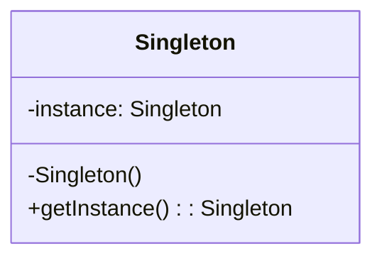

# 单例模式（Singleton Pattern）

> 核心目标：让一个类在整个进程里只有一个实例，并提供统一的访问入口。

## 一、它到底解决了什么问题？

项目里有些对象，天然就不适合到处 `new`：

- 数据库管理器
- 网络请求入口
- 本地缓存管理器
- 日志上报组件
- 全局配置中心

如果这些对象被随手创建，通常会带来几个问题：

1. **资源浪费**
   比如数据库连接、线程池、缓存对象反复创建，本来就很重。
2. **状态不一致**
   你以为大家共用一份配置，结果每个人手里一份副本，最后状态全乱了。
3. **管理困难**
   初始化时机、销毁时机、依赖传递都会变得很难控。

说白了，单例模式就像公司前台。
你不希望每个部门都自己招一个“前台”，而是全公司共用一个统一入口，这样资源集中、规则统一、行为可控。

## 二、单例模式的核心思想

它有两个关键点：

- **唯一实例**：这个类只能有一个对象
- **全局可访问**：外部能拿到这一个对象



## 三、常见实现方案

### 1. 饿汉式

类加载时直接创建实例。

```kotlin
class AppConfig private constructor() {
    companion object {
        val instance: AppConfig = AppConfig()
    }
}
```

**优点**：

- 写法简单
- 天然线程安全

**缺点**：

- 不管用不用，类加载时就创建
- 如果对象很重，可能造成不必要的资源占用

### 2. 懒汉式

第一次使用时再创建。

```kotlin
class CacheManager private constructor() {
    companion object {
        private var instance: CacheManager? = null

        fun getInstance(): CacheManager {
            if (instance == null) {
                instance = CacheManager()
            }
            return instance!!
        }
    }
}
```

**问题**：

- 单线程没事
- 多线程下可能创建出多个实例

这也是面试里最常见的追问点。

### 3. 双重检查锁（DCL）

这是 Java / Kotlin 里非常经典的线程安全懒加载方案。

```kotlin
class UserRepository private constructor() {
    companion object {
        @Volatile
        private var instance: UserRepository? = null

        fun getInstance(): UserRepository {
            return instance ?: synchronized(this) {
                instance ?: UserRepository().also { instance = it }
            }
        }
    }
}
```

**为什么要 `@Volatile`？**

因为对象创建不是一个绝对原子的动作，理论上可能发生指令重排。  
`@Volatile` 的作用，是保证不同线程看到的是正确、完整初始化后的实例。

### 4. Kotlin `object`

在 Kotlin 里，这是最推荐、最省心的单例写法。

```kotlin
object LoggerManager {
    fun log(message: String) {
        println("log = $message")
    }
}
```

**优点**：

- 语法最简洁
- 默认线程安全
- 语义清晰，一眼就知道它是单例

**局限**：

- 如果这个对象需要复杂依赖注入、测试替换、分环境初始化，就不能只图省事，还是要结合 DI 容器或工厂来设计

## 四、单例模式的优势

### 1. 控制全局唯一状态

当一个对象本来就应该全局唯一时，单例能明确表达设计意图。

### 2. 避免重复创建重资源对象

像数据库、线程池、网络客户端，这些对象创建成本高，单例能明显降低开销。

### 3. 统一访问入口

大家都从同一个地方拿对象，初始化逻辑、配置逻辑更容易集中管理。

## 五、单例模式的代价和边界

设计模式从来不是只有优点，没有代价。

### 1. 容易变成“全局变量升级版”

如果什么都做成单例，项目会越来越难维护。  
类和类之间表面上没传依赖，实际上是偷偷耦合在一起了。

### 2. 不利于测试

单例常常让替换实现变困难，单元测试里不太好注入假的对象。

### 3. 容易引发内存泄漏

这是 Android 面试里特别爱问的一点。

如果单例持有了 `Activity`、`Fragment`、`View` 这种短生命周期对象，它们本来应该回收，但因为被单例引用住，就回收不了。

## 六、Android 中哪些地方适合用单例？

### 1. 数据库实例

`RoomDatabase` 通常就是单例管理。

```kotlin
@Database(entities = [UserEntity::class], version = 1)
abstract class AppDatabase : RoomDatabase() {
    abstract fun userDao(): UserDao

    companion object {
        @Volatile
        private var instance: AppDatabase? = null

        fun getInstance(context: Context): AppDatabase {
            return instance ?: synchronized(this) {
                instance ?: Room.databaseBuilder(
                    context.applicationContext,
                    AppDatabase::class.java,
                    "app.db"
                ).build().also { instance = it }
            }
        }
    }
}
```

这里为什么一定要用 `applicationContext`？

- 数据库生命周期通常跟整个 App 一样长
- 如果你传的是 `Activity`，页面销毁后可能被数据库单例一直引用，造成泄漏

### 2. Retrofit / OkHttp 管理

网络客户端也很适合单例，因为：

- 内部有线程池、连接池、缓存
- 重复创建浪费资源
- 统一超时、拦截器、日志配置更方便

```kotlin
object NetworkProvider {
    private val okHttpClient = OkHttpClient.Builder()
        .retryOnConnectionFailure(true)
        .build()

    val retrofit: Retrofit = Retrofit.Builder()
        .baseUrl("https://api.example.com/")
        .client(okHttpClient)
        .addConverterFactory(GsonConverterFactory.create())
        .build()
}
```

### 3. Repository / 配置中心 / 缓存管理器

这些模块本质上都是“全局共享服务”，也非常适合单例思想。

## 七、Android 框架和源码里的典型案例

### 1. `Room.databaseBuilder(...)`

虽然 `Room` 本身不会强制你必须单例，但在真实项目里，`RoomDatabase` 几乎都会按单例管理。

**原因**：

- 数据库对象重
- 多实例可能带来状态管理复杂度
- 统一 DAO 入口更合理

### 2. `Retrofit` 的统一服务入口

很多项目会把 `Retrofit` 封装成单例提供者，再通过 `create(ApiService::class.java)` 生成接口代理。

这里单例不是为了“炫技”，而是为了统一配置：

- BaseUrl
- 拦截器
- 超时
- 证书
- 转换器

### 3. `Application` 级别组件

像埋点、崩溃收集、路由初始化、图片加载入口，这些都常常按应用级单例存在。

## 八、什么时候不建议用单例？

### 1. 业务状态本身不是全局唯一

比如页面级控制器、弹窗控制器、一次性任务对象，这些并不天然适合单例。

### 2. 需要强测试隔离

如果你希望测试时轻松替换实现，接口 + 依赖注入通常比硬编码单例更灵活。

### 3. 生命周期短于应用进程

像 `Activity` 级、`Fragment` 级对象，通常应该由对应宿主来持有，而不是上升成全局单例。

## 九、单例模式在面试里怎么答？

### 标准回答模板

> 单例模式的核心是保证一个类在系统中只有一个实例，并提供统一访问入口。  
> 它常用于数据库、网络客户端、配置中心这类全局共享对象，优点是节省资源、统一管理状态。  
> 但在 Android 里要注意两个问题：一是线程安全，二是不能在单例里持有 `Activity` 这类短生命周期对象，否则容易内存泄漏。  
> 实战里我比较常见的例子是 `RoomDatabase`、`Retrofit` 或 Repository 的全局管理。

### 面试高频追问

#### 1. 为什么双重检查要配合 `volatile`？

因为对象创建可能发生指令重排，`volatile` 能保证可见性和有序性，避免别的线程拿到“还没初始化完整”的对象。

#### 2. Kotlin `object` 和 Java 单例有什么区别？

`object` 是 Kotlin 语言层直接支持的单例写法，更简洁，也默认线程安全；Java 更多是靠私有构造 + 静态字段 + 同步策略来实现。

#### 3. 单例一定好吗？

不一定。它适合“全局唯一、重资源、共享状态”的对象；如果滥用，会让系统耦合度上升，还会增加测试难度。

## 十、总结

单例模式并不复杂，真正难的是边界感。

你要先判断一个对象是不是**真的应该全局唯一**，再去考虑线程安全、初始化时机、生命周期和测试替换。  
在 Android 里，单例最容易出彩的地方不是实现代码，而是你能不能顺手说出：

- 为什么数据库/网络层适合单例
- 为什么不能持有 `Activity`
- 为什么 `Application Context` 更安全
- 为什么大型项目里常常会把单例和依赖注入一起使用

当你能把这几个问题说顺，面试基本就不是“背定义”了，而是“讲设计”。

---
_本文档将持续更新，后续可继续补充与依赖注入、Service Locator、Repository 的关联分析_
