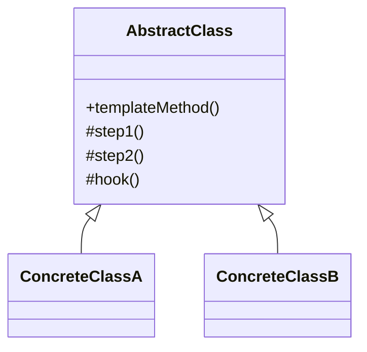

# 模板方法模式（Template Method Pattern）

> 核心目标：在父类里定义好一套固定流程，把其中可变的步骤延迟到子类实现。

## 一、它解决了什么问题？

很多业务流程看起来不一样，但骨架其实是一样的。

比如页面初始化流程，常常都是：

1. 初始化参数
2. 初始化 View
3. 初始化数据
4. 注册监听
5. 开始请求

不同页面差异在哪？

- 布局不同
- 数据源不同
- 监听逻辑不同

但大体步骤顺序是固定的。

如果每个页面都自己写一遍，问题会很明显：

- 重复代码多
- 流程顺序不统一
- 某些公共步骤容易漏掉

模板方法模式就是专门解决这类“流程骨架稳定，但局部实现可变”的问题。

它像什么？
像公司入职流程：

- 签合同
- 办工卡
- 配电脑
- 入职培训

整体顺序基本固定，但不同岗位拿到的设备、培训内容、系统权限会不一样。  
流程骨架不变，细节步骤可变，这就是模板方法模式。

## 二、核心思想

模板方法模式一般由父类定义一个总流程方法，里面按顺序调用若干步骤方法：

- 有些步骤父类直接实现
- 有些步骤交给子类实现
- 有些步骤提供默认空实现，子类可选覆盖



## 三、标准实现方案

```kotlin
abstract class BasePage {

    fun initPage() {
        initArgs()
        initView()
        initData()
        bindObserver()
    }

    open fun initArgs() {}

    abstract fun initView()

    abstract fun initData()

    open fun bindObserver() {}
}

class UserPage : BasePage() {
    override fun initView() {
        println("初始化用户页面 View")
    }

    override fun initData() {
        println("加载用户数据")
    }
}
```

调用：

```kotlin
val page = UserPage()
page.initPage()
```

这里 `initPage()` 就是模板方法。  
它把整体流程固定下来，而 `initView()`、`initData()` 等步骤交给子类定制。

## 四、模板方法模式的优势

### 1. 流程统一

父类可以把关键流程顺序固定住，避免子类各写各的。

### 2. 减少重复代码

公共逻辑放父类，变化逻辑放子类，复用性很高。

### 3. 便于约束规范

如果团队希望页面、任务、处理流程遵循统一模板，模板方法非常好用。

## 五、代价和边界

### 1. 对继承有依赖

模板方法本质上是一种基于继承的复用方式，所以要注意继承层次不要过深。

### 2. 父类设计不当会限制子类灵活性

如果父类把流程写得太死，子类可能很难扩展特殊场景。

### 3. 容易出现“上帝基类”

很多项目的 `BaseActivity`、`BaseFragment` 最后越来越大，就是因为把太多东西塞进父类了。

## 六、Android 中哪些地方特别适合？

### 1. `BaseActivity` / `BaseFragment`

这是 Android 里最常见的模板方法落地点之一。

比如你会定义：

```kotlin
abstract class BaseActivity : AppCompatActivity() {

    final override fun onCreate(savedInstanceState: Bundle?) {
        super.onCreate(savedInstanceState)
        setContentView(getLayoutResId())
        initView()
        initData()
        initListener()
    }

    abstract fun getLayoutResId(): Int
    abstract fun initView()
    abstract fun initData()
    open fun initListener() {}
}
```

这里：

- `onCreate()` 的主流程是固定的
- 子类只负责填空

这就是典型的模板方法模式。

### 2. 自定义 View 初始化流程

有些自定义组件会把初始化步骤固定下来：

- 读取属性
- 初始化画笔
- 计算尺寸
- 注册事件

然后把局部实现交给子类扩展。

### 3. 列表页 / 表单页基础框架

很多业务基类都会把以下流程统一掉：

- 初始化标题栏
- 处理加载态
- 处理空态/错误态
- 请求数据
- 刷新 UI

不同业务页只负责实现各自差异部分。

## 七、Android 框架和常见库里的案例

### 1. `Activity` 生命周期回调体系

从设计思想上看，`Activity` 本身就很有模板方法味道。

系统帮你定义好了整体生命周期骨架：

- `onCreate`
- `onStart`
- `onResume`
- `onPause`
- `onStop`
- `onDestroy`

而你是在这些既定阶段里填入自己的业务逻辑。

严格来说，这不是单一的模板方法类结构，但在理解框架设计时，这种“骨架固定、步骤开放”的思想非常典型。

### 2. `AsyncTask`

虽然现在不推荐新项目继续用，但它是很经典的模板方法案例：

- `onPreExecute()`
- `doInBackground()`
- `onProgressUpdate()`
- `onPostExecute()`

系统把异步任务执行流程骨架固定了，而你只需要填具体步骤。

### 3. 各类 Base 层封装

真实项目里最常见的模板方法案例，反而不是某个系统 API，而是团队自己抽出来的：

- `BaseActivity`
- `BaseFragment`
- `BaseDialog`
- `BaseRepositoryTask`

这些都非常适合在面试里作为“我项目里用过”的例子来讲。

## 八、模板方法模式和策略模式有什么区别？

这两个模式很容易被放在一起考。

### 模板方法模式

- 强调流程骨架固定
- 通过继承让子类实现局部步骤

### 策略模式

- 强调算法可替换
- 通过组合把不同策略注入进去

一句话区分：

> 模板方法是“父类定流程，子类来填空”；策略模式是“流程里某一步该怎么做，由外部传入不同算法”。

## 九、实战里怎么用才不容易出问题？

### 1. 父类只保留稳定流程

不要把经常变化的东西也硬塞进模板，否则父类会越来越难维护。

### 2. 尽量控制基类体积

如果 `BaseActivity` 已经几百上千行，就说明模板方法可能被滥用了。

### 3. 善用 Hook 方法

有些步骤不是所有子类都需要，这种时候可以提供 `open` 空实现，而不是强迫所有子类都重写。

### 4. 该用组合时别硬上继承

如果变化点很多、组合关系复杂，有时候策略模式或委托会比模板方法更适合。

## 十、面试里怎么答？

### 标准回答模板

> 模板方法模式的核心是在父类里定义好一个固定流程，把其中可变的步骤延迟到子类实现。  
> 它特别适合那些“主流程稳定、局部步骤差异化”的场景，比如页面初始化、异步任务处理、基类流程封装。  
> 在 Android 里很常见的例子有 `BaseActivity` / `BaseFragment` 的初始化模板，以及早期 `AsyncTask` 的执行流程。  
> 它的优点是统一流程、减少重复代码，但缺点是对继承依赖较强，如果父类设计不好，很容易形成庞大的基类。

### 面试高频追问

#### 1. 模板方法和策略模式怎么区分？

模板方法基于继承固定流程，策略模式基于组合切换算法。

#### 2. `BaseActivity` 为什么很适合模板方法？

因为页面初始化流程通常是固定的，但不同页面的具体实现细节不同。

#### 3. 模板方法模式有什么风险？

最大的风险是把父类做得过重，最后所有子类都被这个“大基类”绑死。

## 十一、总结

模板方法模式最适合解决的问题是：

> 大家做的事步骤差不多，但每一步的具体内容不一样。

在 Android 开发里，它非常适合这些场景：

- 页面初始化模板
- 自定义组件初始化流程
- 基类任务执行框架
- 老式异步任务处理流程

所以以后只要你看到“顺序固定、细节可变”的流程，就可以优先想到模板方法模式。

---
_本文档将持续更新，后续可继续补充模板方法与 Compose、委托模式、Base 层治理的边界分析_
