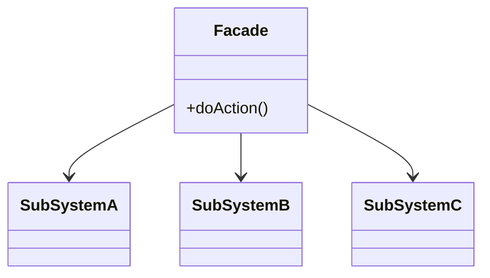

# 外观模式（Facade Pattern）

> 核心目标：为一组复杂的子系统提供一个统一、简单的对外入口，让调用方不用直接面对内部复杂细节。

## 一、它解决了什么问题？

很多系统不是“功能难”，而是“入口太乱”。

比如一个登录流程，背后可能要做：

- 参数校验
- 本地缓存读取
- 发起网络请求
- 保存用户信息
- 同步 token
- 刷新首页状态
- 上报埋点

如果调用方每次都自己一行一行调这些模块，问题会很快出现：

- 调用顺序容易错
- 细节暴露太多
- 上层代码又长又乱
- 子系统改了，上层也得跟着改

外观模式的思路就是：

> 复杂系统你们内部自己协调，对外只给我一个简单入口。

它像什么？
像酒店前台。

- 你不需要自己去找保洁、餐厅、停车场、行李员
- 你只需要找前台
- 前台再去调度内部各个系统

外观模式里的 Facade，就是这个“统一前台”。

## 二、核心思想

外观模式通常会有：

- **多个复杂子系统**
- **一个 Facade 门面类**
- **调用方只依赖 Facade**



Facade 的职责不是“替代所有子系统”，而是把常见调用路径整理成一个更友好的入口。

## 三、标准实现方案

### 1. 子系统

```kotlin
class AccountService {
    fun login(phone: String, code: String) {
        println("账号服务登录: $phone, $code")
    }
}

class UserStorage {
    fun saveUser() {
        println("保存用户信息到本地")
    }
}

class AnalyticsService {
    fun trackLogin() {
        println("上报登录埋点")
    }
}
```

### 2. 外观类

```kotlin
class LoginFacade(
    private val accountService: AccountService,
    private val userStorage: UserStorage,
    private val analyticsService: AnalyticsService
) {
    fun login(phone: String, code: String) {
        accountService.login(phone, code)
        userStorage.saveUser()
        analyticsService.trackLogin()
    }
}
```

### 3. 调用方式

```kotlin
val facade = LoginFacade(
    AccountService(),
    UserStorage(),
    AnalyticsService()
)

facade.login("13800000000", "1234")
```

对调用方来说，它只关心：

- 我调用 `login()`
- 复杂细节由 Facade 处理

## 四、外观模式的优势

### 1. 降低使用复杂度

上层不用了解每个子系统的调用顺序和细节。

### 2. 屏蔽内部变化

子系统内部实现变了，只要 Facade 接口不变，上层通常不用动。

### 3. 更适合做模块边界

对于组件化、模块化项目来说，Facade 特别适合做统一门面层。

## 五、代价和边界

### 1. 容易变成“大而全入口”

如果什么都往一个 Facade 里塞，它最后会变成另一个“超级类”。

### 2. 不是所有场景都要包一层 Facade

如果子系统本来就很简单，硬加 Facade 可能只是多一层转发。

### 3. 它不负责替代全部抽象设计

Facade 是简化入口，不是把底层架构问题全部解决掉。

## 六、Android 中哪些地方特别适合？

### 1. 登录门面

登录往往牵涉很多模块：

- 账号模块
- Token 管理
- 本地缓存
- 用户信息同步
- 埋点

这种场景特别适合做一个 `LoginFacade` 或 `AuthFacade`。

### 2. 图片加载统一入口

很多项目不会在业务层到处直接写 Glide / Coil 调用，而是封装一个统一入口：

```kotlin
object ImageFacade {
    fun loadAvatar(view: ImageView, url: String?) {
        // 内部统一 placeholder、错误图、裁剪策略
    }
}
```

这样做的好处是：

- 业务层调用简单
- 策略统一
- 将来替换底层库更容易

### 3. 路由 / 页面跳转封装

比如把复杂页面跳转参数收口到一个 `NavigatorFacade` 里，避免业务层到处拼 `Intent` / `Bundle`。

### 4. 组件化模块对外 API

在组件化项目里，一个模块通常不会把所有内部类都暴露出去，而是提供一个对外门面类。

这非常符合外观模式的思想。

## 七、Android 框架和常见库里的案例

### 1. 自定义 SDK 对外入口

很多 SDK 都会暴露一个总入口，比如：

- `init()`
- `trackEvent()`
- `login()`
- `upload()`

你看上去只调了一个简单方法，背后其实协调了很多模块。  
这就是很典型的外观模式。

### 2. 项目里的 `Navigator` / `RouterFacade`

真实项目中很常见：

- `Navigator.toUserDetail(context, userId)`
- `RouterService.openOrderPage(context, orderId)`

业务层不用自己关心 Intent key、参数组装、埋点前置，这其实就是外观模式非常实战的落地。

### 3. Repository 聚合入口

有些项目会把多个数据源统一收口到一个门面型 Repository：

- 本地数据库
- 网络接口
- 缓存层
- 配置中心

虽然它也可能混合了其他模式，但从“简化上层入口”的角度看，外观思想非常明显。

## 八、外观模式和适配器模式有什么区别？

这两个也经常被混淆。

### 外观模式

- 目的是“简化复杂子系统的使用方式”
- 重点是给一堆复杂能力提供统一入口

### 适配器模式

- 目的是“接口转换”
- 重点是把不兼容接口接起来

一句话记忆：

> 外观模式是在做“前台接待”，适配器模式是在做“接口翻译”。

## 九、实战里怎么判断该不该用外观模式？

### 1. 调用方是不是要面对很多子系统？

如果上层每次都要自己拼装多个模块调用顺序，Facade 很值得。

### 2. 你是否希望对子系统做统一编排？

如果一个业务流程涉及多个模块协同，Facade 是天然选择。

### 3. 模块边界是否需要更清晰？

如果你不想把内部实现细节全部暴露给上层，就很适合引入门面层。

## 十、面试里怎么答？

### 标准回答模板

> 外观模式的核心是为复杂子系统提供一个统一、简单的入口，降低调用方使用复杂度。  
> 它特别适合一个业务流程需要协调多个模块的场景，比如登录、路由跳转、图片加载统一封装。  
> 在 Android 项目里，常见做法是封装 `LoginFacade`、`Navigator`、`ImageFacade` 这类门面类，让业务层不用直接操作底层多个组件。  
> 它的优点是简化调用、隔离内部变化，但缺点是如果设计不好，Facade 很容易膨胀成一个大而全的入口类。

### 面试高频追问

#### 1. 外观模式和适配器模式有什么区别？

外观是简化入口，适配器是转换接口。  
一个解决“太复杂”，一个解决“对不上”。

#### 2. 外观模式和中间层封装是不是一回事？

很多工程实践里的中间层封装，本质上就是外观模式的落地版本，只是名字不一定这么叫。

#### 3. Facade 会不会变成上帝类？

会。  
所以门面层应该聚焦高频场景和稳定入口，而不是把所有逻辑都堆进去。

## 十一、总结

外观模式最适合解决的问题是：

> 内部系统挺复杂，但我不想让调用方也跟着复杂。

在 Android 开发里，它特别适合这些场景：

- 登录流程统一入口
- 图片加载统一封装
- 路由跳转门面
- 模块对外 API 聚合

所以以后只要你看到“底层很多模块协同，但上层只该看到一个简单入口”的场景，就可以优先想到外观模式。

---
_本文档将持续更新，后续可继续补充 Facade 与 Service Locator、Repository 聚合、组件化 API 设计的边界分析_
