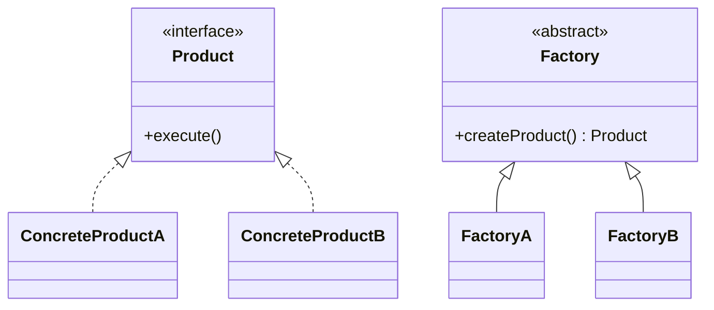

# 工厂方法模式（Factory Method Pattern）

> 核心目标：把“创建对象”这件事单独交给工厂，让使用方只关心“我要什么”，不用关心“它怎么被创建出来”。

## 一、它解决了什么问题？

很多项目代码一开始都长这样：

```kotlin
fun createLogger(type: String): Logger {
    return when (type) {
        "file" -> FileLogger()
        "console" -> ConsoleLogger()
        else -> ConsoleLogger()
    }
}
```

看起来没毛病，但一旦需求变复杂，问题就出来了：

- 创建逻辑到处散落
- `when` / `if else` 越写越长
- 新增一种实现时，老代码总要改
- 调用方不但要知道“用哪个对象”，还得知道“怎么创建”

这就像你去奶茶店，本来只需要说“我要一杯少糖奶茶”，结果你还得自己去后厨拿配方、选杯型、调温度、封口，流程全乱了。

工厂方法模式的本质，就是把“做奶茶”交给后厨，把“喝奶茶”留给顾客。

## 二、核心思想

工厂方法模式会把“对象创建职责”从业务代码里抽离出来：

- **产品接口**：定义对象的能力
- **具体产品**：不同的实现类
- **工厂接口/抽象工厂**：定义创建方法
- **具体工厂**：负责创建某一种具体产品



## 三、标准实现方案

### 1. 产品接口

```kotlin
interface ImageLoader {
    fun load(url: String)
}
```

### 2. 具体产品

```kotlin
class GlideImageLoader : ImageLoader {
    override fun load(url: String) {
        println("Glide 加载: $url")
    }
}

class CoilImageLoader : ImageLoader {
    override fun load(url: String) {
        println("Coil 加载: $url")
    }
}
```

### 3. 工厂接口和具体工厂

```kotlin
interface ImageLoaderFactory {
    fun create(): ImageLoader
}

class GlideFactory : ImageLoaderFactory {
    override fun create(): ImageLoader = GlideImageLoader()
}

class CoilFactory : ImageLoaderFactory {
    override fun create(): ImageLoader = CoilImageLoader()
}
```

### 4. 调用方

```kotlin
class ImageService(
    private val factory: ImageLoaderFactory
) {
    fun display(url: String) {
        val loader = factory.create()
        loader.load(url)
    }
}
```

调用方只知道自己依赖一个工厂，不需要知道具体对象怎么建出来。

## 四、工厂方法和简单工厂有什么区别？

这是面试里的高频题。

### 简单工厂

特点是一个工厂里写很多分支判断：

```kotlin
object PayFactory {
    fun create(type: String): PayStrategy {
        return when (type) {
            "ali" -> AliPayStrategy()
            "wx" -> WeChatPayStrategy()
            else -> error("unknown type")
        }
    }
}
```

**优点**：

- 简单直接
- 实现成本低

**缺点**：

- 每加一种类型都要修改原工厂
- 很容易变成一个庞大的分支中心

### 工厂方法

特点是“每种产品对应自己的工厂”。

**优点**：

- 更符合开闭原则
- 扩展时通常新增类，而不是改老类

**缺点**：

- 类会变多
- 对简单业务来说可能显得偏重

一句话区分：

> 简单工厂强调“集中创建”，工厂方法强调“把扩展点拆开”。

## 五、工厂方法模式的优势

### 1. 降低调用方和具体实现的耦合

调用方依赖的是工厂接口和产品接口，而不是具体类。

### 2. 创建逻辑更集中

对象初始化、参数校验、默认配置都可以收口到工厂里统一处理。

### 3. 扩展更自然

新增一种产品时，通常只需要新增一个具体产品 + 具体工厂，不用大改原有代码。

## 六、代价和边界

### 1. 类数量会增加

如果业务本来就很简单，强行上工厂方法，可能会有点“杀鸡用牛刀”。

### 2. 不一定适合变化极少的场景

如果对象就 2 种，未来也几乎不扩展，简单工厂甚至直接构造都可能更合适。

### 3. 工厂本身也需要被管理

当工厂越来越多时，通常还要结合注册表、依赖注入或抽象工厂继续治理。

## 七、Android 里哪些地方适合用工厂方法？

### 1. ViewModel 创建

`ViewModel` 往往不能直接无参 `new`，因为它可能依赖 Repository、UseCase 或 SavedState。

这时候就非常适合通过工厂来统一创建。

```kotlin
class UserViewModel(
    private val repository: UserRepository
) : ViewModel()

class UserViewModelFactory(
    private val repository: UserRepository
) : ViewModelProvider.Factory {
    override fun <T : ViewModel> create(modelClass: Class<T>): T {
        if (modelClass.isAssignableFrom(UserViewModel::class.java)) {
            @Suppress("UNCHECKED_CAST")
            return UserViewModel(repository) as T
        }
        error("Unknown ViewModel class")
    }
}
```

这里的核心价值，不只是“创建对象”，而是：

- 隐藏构建细节
- 统一注入依赖
- 避免 `Activity` / `Fragment` 自己拼装对象

### 2. Fragment / 页面创建封装

很多项目会写这种入口：

```kotlin
class UserFragment : Fragment() {
    companion object {
        fun newInstance(userId: String): UserFragment {
            return UserFragment().apply {
                arguments = bundleOf("user_id" to userId)
            }
        }
    }
}
```

严格来说，这更像是一种静态工厂方法，而不是完整的 GoF 工厂方法模式。  
但它体现的是同一个思想：**把对象创建规则封装起来**。

好处是：

- 参数更不容易漏传
- `Bundle` key 可以统一管理
- 页面创建语义更清晰

### 3. 不同实现的能力切换

比如图片加载、日志实现、推送厂商适配、埋点通道选择，都可以通过工厂返回不同实现。

## 八、Android 框架和常见库里的案例

### 1. `ViewModelProvider.Factory`

这是 Android Jetpack 里非常典型的工厂思想。

为什么系统不直接帮你 `new ViewModel()`？

因为不同 `ViewModel` 依赖不同，系统并不知道你要传什么参数。  
所以它把创建职责开放给工厂，你告诉系统“该怎么建”，系统负责“什么时候取”。

这就是非常标准的解耦。

### 2. `LayoutInflater.Factory2`

在 View 创建过程中，Android 允许你拦截某些 View 的创建逻辑。  
这背后也是工厂思想：把 View 实例化过程交给一个可扩展入口。

它非常适合做：

- 自定义换肤
- View 替换
- 自动埋点
- 全局字体替换

### 3. `FragmentFactory`

Jetpack 提供的 `FragmentFactory`，本质上也是把 Fragment 的实例化逻辑交出来，方便你做依赖注入和定制化创建。

这比“反射 + 默认构造”更灵活，也更现代。

## 九、实战里怎么判断该不该上工厂？

可以用这几个标准判断：

### 1. 创建逻辑是不是复杂？

如果对象创建前要做很多校验、组装、默认值设置，就适合工厂。

### 2. 调用方是不是不应该知道实现细节？

如果业务层只该关心“我要一个支付能力”，而不该知道具体是 `AliPayStrategy` 还是 `WeChatPayStrategy`，就适合工厂。

### 3. 实现类型是否经常扩展？

如果未来会不断加新实现，工厂方法比直接 `when` 更能抗变化。

## 十、面试里怎么答？

### 标准回答模板

> 工厂方法模式的核心，是把对象创建延迟到具体工厂中完成，让调用方依赖抽象而不是具体实现。  
> 它特别适合那些“对象创建逻辑复杂”或者“未来会扩展多种实现”的场景。  
> 在 Android 里比较典型的例子有 `ViewModelProvider.Factory`、`FragmentFactory`，它们都把实例创建从调用方里剥离了出来，既方便扩展，也方便依赖注入。

### 面试高频追问

#### 1. 工厂方法和抽象工厂有什么区别？

工厂方法通常关注“创建一个产品”；抽象工厂更像“创建一整套关联产品族”。

#### 2. 工厂方法一定比简单工厂好吗？

不一定。  
如果场景简单、类型固定，简单工厂更直接；如果扩展频繁，工厂方法更稳。

#### 3. 为什么 ViewModel 适合工厂创建？

因为很多 `ViewModel` 都有依赖，系统无法直接无参构造。  
用工厂可以把依赖注入、创建规则、类型判断集中起来管理。

## 十一、总结

工厂方法模式最重要的价值，不是“多写几个类”，而是把“对象创建”和“对象使用”拆开。

在 Android 里，这个模式特别适合解决下面这类问题：

- ViewModel 依赖怎么传
- Fragment 参数怎么统一封装
- 多种实现怎么切换
- 框架扩展点怎么开放

当你理解到这里，就会发现工厂方法不是书本里的模板，而是日常开发里非常实用的“解耦工具”。

---
_本文档将持续更新，后续可继续补充简单工厂、抽象工厂与依赖注入框架的横向对比_
