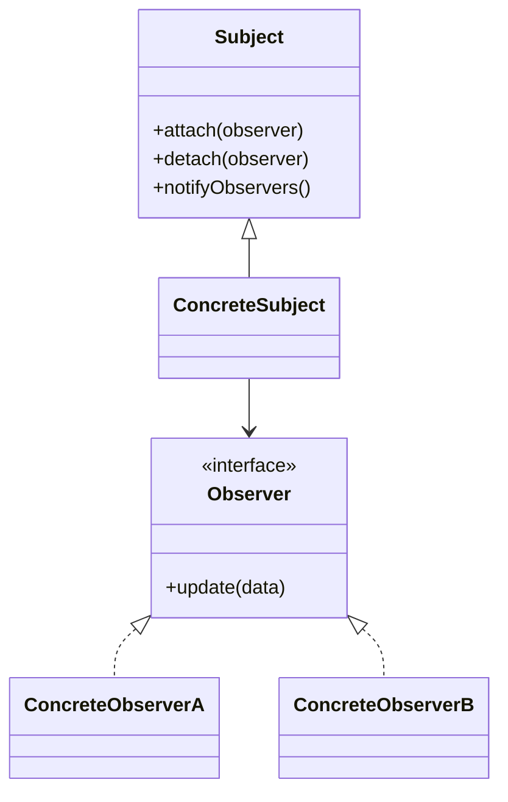

# 观察者模式（Observer Pattern）

> 核心目标：当一个对象状态发生变化时，自动通知所有依赖它的对象，让它们及时更新。

## 一、它解决了什么问题？

很多业务场景里，一个地方变了，另外很多地方都要跟着变：

- 登录状态变化后，首页、我的页、购物车都要刷新
- 下载进度变化后，通知栏、列表项、进度条都要更新
- 数据库数据更新后，页面要自动刷新显示
- 用户点击按钮后，多个监听逻辑要被触发

如果不用观察者模式，代码很容易变成这样：

- A 改了数据后，手动调用 B
- 然后再手动调用 C
- 再记得去通知 D

这样的问题很明显：

- A 要知道 B、C、D 的存在
- 耦合越来越重
- 新增一个监听方时，老代码还得改

这就像班主任在班里宣布“明天春游取消”。  
如果他要一个个打电话通知每个学生，效率低还容易漏；更合理的方式是发到班级群里，所有订阅消息的人都会自动收到。

观察者模式本质上就是这个“班级群通知机制”。

## 二、核心思想

观察者模式里通常有两个核心角色：

- **被观察者（Subject）**：状态变化的源头
- **观察者（Observer）**：依赖这个状态、需要被通知的人

当 Subject 状态变化时，会遍历所有 Observer，逐个通知。



## 三、标准实现方案

### 1. 观察者接口

```kotlin
interface Observer {
    fun update(value: String)
}
```

### 2. 被观察者

```kotlin
class UserCenter {
    private val observers = mutableListOf<Observer>()

    fun attach(observer: Observer) {
        observers += observer
    }

    fun detach(observer: Observer) {
        observers -= observer
    }

    fun loginSuccess(userName: String) {
        observers.forEach { it.update(userName) }
    }
}
```

### 3. 具体观察者

```kotlin
class HomePageObserver : Observer {
    override fun update(value: String) {
        println("首页收到登录成功通知: $value")
    }
}

class ProfileObserver : Observer {
    override fun update(value: String) {
        println("我的页面刷新用户信息: $value")
    }
}
```

### 4. 使用方式

```kotlin
val userCenter = UserCenter()
userCenter.attach(HomePageObserver())
userCenter.attach(ProfileObserver())
userCenter.loginSuccess("Tom")
```

这个例子虽然简单，但已经体现了核心价值：

- `UserCenter` 不需要知道页面细节
- 观察者可以自由新增、移除
- 状态变更和响应逻辑被解耦了

## 四、观察者模式的优势

### 1. 一对多通知天然顺手

一个状态源，多个订阅方，这正是观察者模式最擅长的场景。

### 2. 降低耦合

被观察者不需要直接依赖具体业务模块，它只负责“通知”。

### 3. 易扩展

新增一个观察者，通常不需要改被观察者核心逻辑。

## 五、代价和边界

### 1. 链路可能变隐蔽

看代码时，有时候你只看到“发了一个通知”，但不知道最终谁会响应，这会增加排查成本。

### 2. 容易造成泄漏

如果观察者注册后不及时移除，被观察者可能长期持有它，尤其在 Android 里很容易造成 `Activity` / `Fragment` 泄漏。

### 3. 过多通知会让系统难追踪

如果项目里到处都是事件通知，却没有清晰边界，最后会变成“谁都能发，谁都能收”，维护成本反而上升。

## 六、观察者模式、发布订阅、事件总线有什么区别？

这是面试高频追问。

### 观察者模式

- 观察者和被观察者通常是直接关联的
- 被观察者内部知道自己维护了一批观察者列表

### 发布订阅

- 往往通过中间件或事件中心解耦
- 发布者和订阅者彼此都不知道对方

### 事件总线

- 可以理解成一种更工程化的发布订阅实现
- 像早年的 `EventBus`，就是通过中央总线广播消息

一句话概括：

> 观察者模式更像“老师维护班级名单后逐个通知”，发布订阅更像“发广播到消息平台，谁订阅谁接收”。

## 七、Android 中哪些地方最常见？

### 1. `View.OnClickListener`

这其实就是最常见、最基础的观察者思想。

```kotlin
button.setOnClickListener {
    println("按钮被点击了")
}
```

这里：

- `button` 是事件源
- `OnClickListener` 是观察者
- 点击发生时，观察者被回调

你天天都在用，只是以前没从模式角度总结它。

### 2. `LiveData`

`LiveData` 是 Android 里非常标准的观察者应用。

```kotlin
viewModel.userInfo.observe(viewLifecycleOwner) { user ->
    binding.nameText.text = user.name
}
```

这里的角色非常清晰：

- `LiveData` 是被观察者
- UI 层是观察者
- 数据变化后，UI 自动收到更新

它比手写观察者更好的地方在于：

- 感知生命周期
- 避免页面销毁后继续回调
- 更适合页面状态驱动 UI

### 3. `Flow` / `StateFlow`

它们不完全等同于传统 GoF 观察者模式，但在思想上高度相关：

- 有数据源
- 有订阅者
- 数据变化会向下游传播

只是它们在现代 Kotlin 里做得更强：

- 支持协程
- 支持背压和取消
- 更适合异步数据流场景

### 4. `RecyclerView.AdapterDataObserver`

当 Adapter 数据发生变化时，RecyclerView 会收到通知并更新视图。  
这同样体现了观察者模式。

## 八、Android 框架和常见库里的案例

### 1. `LiveData.observe(...)`

这是最适合面试举例的观察者案例之一。  
它不只体现了观察者模式，还体现了 Android 对生命周期问题的治理。

你可以顺手讲出这两个点：

- 传统观察者如果忘记解绑，容易泄漏
- `LiveData` 通过生命周期感知降低了这类风险

### 2. 系统监听器体系

像这些接口，本质上都属于观察者思想：

- `TextWatcher`
- `OnGlobalLayoutListener`
- `OnScrollListener`
- `BroadcastReceiver`

它们本质上都是：

- 某个事件源发生变化
- 注册者收到通知并处理

### 3. `EventBus`

虽然更像发布订阅，但面试里经常会把它和观察者模式放在一起聊。  
你可以这么回答：

> 它们思想很接近，都是事件驱动通知；区别在于 EventBus 引入了中间总线，发送方和接收方解耦得更彻底。

## 九、实战里怎么用才不容易出问题？

### 1. 明确事件边界

不要把所有东西都做成“全局事件”。  
页面内局部状态，优先用局部观察；跨模块全局通知，再考虑事件总线或共享状态流。

### 2. 处理好注册和解绑

特别是传统监听器写法，一定要注意生命周期。

### 3. 让通知语义明确

不要只发一个模糊的 `update()`。  
最好让事件或数据模型有明确语义，否则后期很难维护。

## 十、面试里怎么答？

### 标准回答模板

> 观察者模式的核心是一对多依赖关系：当被观察者状态变化时，会自动通知所有观察者。  
> 它的优势是把状态变化和响应逻辑解耦，特别适合事件通知、状态订阅这类场景。  
> 在 Android 里很常见的例子有 `OnClickListener`、`LiveData.observe()`、`TextWatcher`、`RecyclerView.AdapterDataObserver`。  
> 不过它也有代价，比如通知链路可能变隐蔽，传统实现如果不及时解绑还会导致内存泄漏。

### 面试高频追问

#### 1. 观察者模式和发布订阅有什么区别？

观察者通常是被观察者直接维护观察者列表；发布订阅一般有中间消息中心，双方解耦更彻底。

#### 2. `LiveData` 为什么比手写监听更适合 Android？

因为它具备生命周期感知能力，能减少页面销毁后继续回调的问题。

#### 3. 观察者模式一定好吗？

不一定。  
如果滥用，会让事件链路过于分散，排查问题时反而更难定位。

## 十一、总结

观察者模式本质上是在解决一个很朴素的问题：

> 一个地方变了，怎么让相关的人自动知道？

在 Android 里，你几乎每天都在用它：

- 点击监听
- 文本变化监听
- 列表数据变化通知
- `LiveData` / `Flow` 状态订阅

真正拉开差距的，不是你会不会背定义，而是你能不能进一步讲出：

- 为什么观察者适合状态通知
- 为什么它容易引发泄漏
- 为什么 `LiveData` 是更 Android 化的观察者实现
- 为什么 EventBus 和它相似但不完全一样

当你能把这些讲清楚，面试官就会知道你不是在背书，而是在讲系统设计。

---
_本文档将持续更新，后续可继续补充与 Flow、SharedFlow、事件总线和响应式编程的关联分析_
