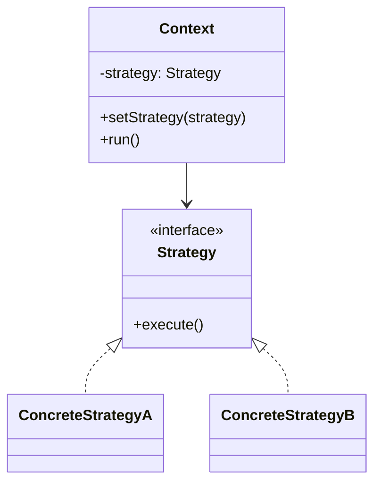

# 策略模式（Strategy Pattern）

> 核心目标：把一组可以互相替换的算法或行为封装起来，在运行时按需选择，而不是把所有分支逻辑堆在一个类里。

## 一、它解决了什么问题？

项目里最常见的一种“代码变臭”方式，就是 `if-else` 越长越离谱。

比如支付逻辑：

```kotlin
fun pay(type: String, amount: Int) {
    if (type == "ali") {
        println("走支付宝支付: $amount")
    } else if (type == "wx") {
        println("走微信支付: $amount")
    } else if (type == "card") {
        println("走银行卡支付: $amount")
    }
}
```

一开始你觉得简单，后面很快就会出问题：

- 新增一个支付方式，就得改原方法
- 每个分支逻辑越来越长
- 测试不方便
- 业务逻辑和选择逻辑混在一起

策略模式就是专门解决这种问题的。

它像什么？
像你打车时选择路线：

- 省钱路线
- 最快路线
- 避堵路线

路线本身都能把你送到目的地，只是算法不同。  
系统不应该把所有路线逻辑写死在一个超长方法里，而是应该把“不同策略”拆开，按需切换。

## 二、核心思想

策略模式会把不同算法封装成统一接口下的多个策略类：

- **策略接口**：定义统一行为
- **具体策略**：实现不同算法或处理方式
- **上下文（Context）**：持有某个策略，并在合适时机执行它



## 三、标准实现方案

### 1. 策略接口

```kotlin
interface PayStrategy {
    fun pay(amount: Int)
}
```

### 2. 具体策略

```kotlin
class AliPayStrategy : PayStrategy {
    override fun pay(amount: Int) {
        println("支付宝支付: $amount")
    }
}

class WeChatPayStrategy : PayStrategy {
    override fun pay(amount: Int) {
        println("微信支付: $amount")
    }
}

class BankCardPayStrategy : PayStrategy {
    override fun pay(amount: Int) {
        println("银行卡支付: $amount")
    }
}
```

### 3. 上下文

```kotlin
class PayManager(
    private var strategy: PayStrategy
) {
    fun setStrategy(value: PayStrategy) {
        strategy = value
    }

    fun pay(amount: Int) {
        strategy.pay(amount)
    }
}
```

### 4. 使用方式

```kotlin
val payManager = PayManager(AliPayStrategy())
payManager.pay(100)

payManager.setStrategy(WeChatPayStrategy())
payManager.pay(200)
```

这里的关键点是：

- `PayManager` 不关心具体怎么支付
- 不同支付方式都遵守同一个接口
- 运行时可以切换行为

## 四、策略模式的优势

### 1. 消灭大段条件分支

把不同算法拆出去后，主流程会清爽很多。

### 2. 扩展更容易

新增一种策略时，通常只需要新增一个实现类，不需要大改旧代码。

### 3. 更利于测试

每个策略都可以单独测，不需要在一个巨大的 `if-else` 里覆盖所有路径。

### 4. 更符合开闭原则

对扩展开放，对修改关闭，这是策略模式很典型的优点。

## 五、代价和边界

### 1. 类会变多

如果只是非常简单的两三个分支，硬拆成一堆策略类，反而显得重。

### 2. 调用方需要理解策略差异

策略模式不是“没有复杂度”，而是把复杂度从一个类里分散到多个策略类里。  
所以你仍然要清楚不同策略各自适合什么场景。

### 3. 选择策略本身也需要治理

实际项目里，往往还要搭配工厂模式、配置中心或注册表来决定用哪个策略。

## 六、Android 开发里哪些地方特别适合？

### 1. 图片压缩策略

同样是上传图片，不同场景对压缩要求完全不同：

- 头像上传：重视体积小
- 商品图上传：重视清晰度
- 聊天图发送：重视速度

这时候就可以把不同压缩逻辑做成不同策略。

```kotlin
interface CompressStrategy {
    fun compress(path: String): String
}

class AvatarCompressStrategy : CompressStrategy {
    override fun compress(path: String): String = "头像压缩后的路径"
}

class ProductImageCompressStrategy : CompressStrategy {
    override fun compress(path: String): String = "商品图压缩后的路径"
}
```

### 2. 登录方式切换

比如：

- 手机号验证码登录
- 密码登录
- 微信登录
- Google 登录

虽然入口不同，但都属于“登录策略”的不同实现。

### 3. 列表排序 / 过滤规则

商品列表可能支持：

- 按价格排序
- 按销量排序
- 按评分排序

如果把这些规则都写在一个方法里，后面会越来越臃肿。  
用策略拆开后，结构会干净很多。

### 4. 缓存读取策略

比如数据获取时可以选择：

- 只读本地
- 本地优先，网络兜底
- 强制网络刷新

这些都非常适合策略模式。

## 七、Android 框架和常见库里的案例

### 1. `DiffUtil.ItemCallback`

在 `RecyclerView` 里，你会实现：

- `areItemsTheSame`
- `areContentsTheSame`

本质上你是在定义“比较策略”。  
不同业务对象，比较规则不同，但都能挂进同一套刷新框架里。

### 2. `LayoutManager`

`RecyclerView` 的 `LinearLayoutManager`、`GridLayoutManager`、`StaggeredGridLayoutManager`，某种程度上也体现了策略思想。

因为它们都在解决同一个问题：

> Item 怎么布局？

只是不同布局算法被拆成了不同实现。

严格来说它不一定是教科书式策略模式，但在面试表达上，这样理解是完全有帮助的。

### 3. 图片加载库的磁盘缓存策略

像 `Glide` 里的 `DiskCacheStrategy`，本质上也是“针对缓存行为的策略选择”。

例如：

- 只缓存原图
- 只缓存转换结果
- 全部缓存
- 都不缓存

## 八、策略模式和工厂模式有什么关系？

这两个模式经常一起出现。

### 策略模式负责：

- 定义一组可替换行为
- 运行时执行其中某一个

### 工厂模式负责：

- 根据条件创建合适的策略对象

组合起来就很自然：

```kotlin
object PayStrategyFactory {
    fun create(type: String): PayStrategy {
        return when (type) {
            "ali" -> AliPayStrategy()
            "wx" -> WeChatPayStrategy()
            else -> BankCardPayStrategy()
        }
    }
}
```

可以这样理解：

> 策略模式解决“怎么做”，工厂模式解决“选谁做”。

## 九、实战里怎么判断该不该上策略模式？

### 1. 是否存在多个可互换算法？

如果只是一个固定流程，就没必要。

### 2. 这些分支是不是还会继续扩展？

如果未来会不断加实现，策略模式就很值。

### 3. 主流程是不是已经被分支逻辑污染了？

如果你发现一个方法里充满业务条件判断，策略模式往往就是很自然的重构方向。

## 十、面试里怎么答？

### 标准回答模板

> 策略模式的核心是把一组可替换的算法封装成独立策略类，并通过统一接口对外暴露。  
> 这样可以把大段条件分支拆开，让系统在运行时按需切换行为。  
> 在 Android 里，像登录方式切换、图片压缩策略、缓存读取策略、列表排序规则都很适合用策略模式。  
> 它的优点是扩展性好、测试方便，但缺点是类会变多，而且通常还需要额外机制决定具体使用哪种策略。

### 面试高频追问

#### 1. 策略模式和工厂模式有什么区别？

策略强调行为切换，工厂强调对象创建。  
两者经常配合使用，但关注点不同。

#### 2. 策略模式和状态模式像不像？

很像，结构上确实接近。  
区别在于策略模式更强调“由外部选择算法”，状态模式更强调“对象内部状态变化驱动行为变化”。

#### 3. 什么情况下不适合用策略模式？

如果分支很少、变化也不大，用简单 `if-else` 反而更直接，没必要为了模式而模式。

## 十一、总结

策略模式最适合解决的，不是“复杂对象怎么创建”，也不是“谁来通知谁”，而是：

> 同一个目标，有多种实现路径，而且这些路径将来还可能继续扩展。

在 Android 开发里，它特别适合拿来重构这些坏味道代码：

- 超长 `if-else`
- 不同业务规则硬塞在一个类里
- 登录、支付、压缩、排序、缓存等多实现切换逻辑

所以如果你以后看到“主流程固定，但内部算法很多变”的场景，就可以第一时间想到策略模式。

---
_本文档将持续更新，后续可继续补充与状态模式、模板方法模式以及 Kotlin 函数式策略写法的对比_
