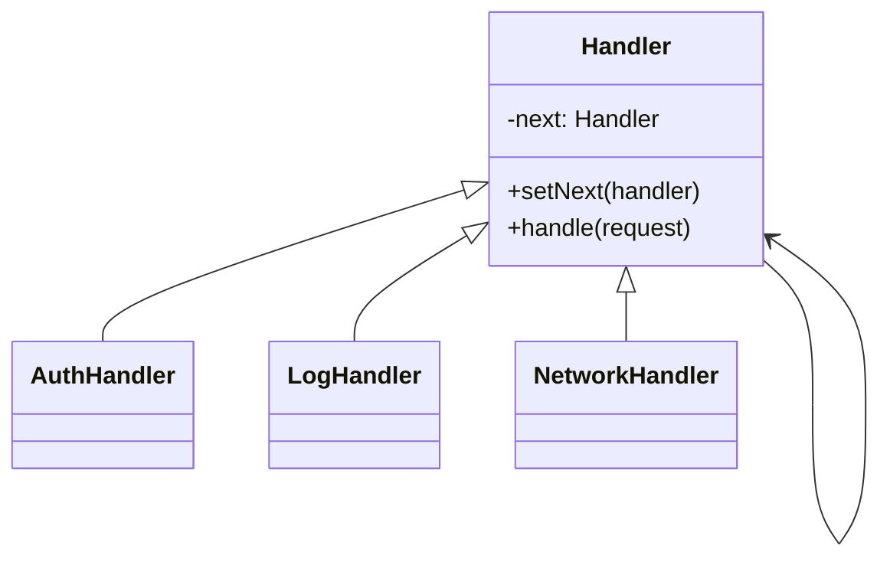

# 责任链模式（Chain of Responsibility Pattern）

> 核心目标：让多个处理者按顺序连接成一条链，请求沿着链依次传递，每个节点都可以选择处理、部分处理，或者继续往下传。

## 一、它解决了什么问题？

很多业务流程天然不是“一步做完”，而是要经过多层处理：

- 网络请求要先加公共参数，再鉴权，再打日志，再真正发请求
- 表单提交前要先校验手机号，再校验验证码，再校验密码强度
- 图片上传前要先压缩，再鉴黄，再加水印，再上传

如果把这些逻辑都塞进一个大方法里，问题会非常明显：

- 方法越来越长
- 各步骤强耦合
- 不好插拔扩展
- 很难复用某一段处理逻辑

责任链模式就是把这些步骤拆成一个个节点，像流水线一样串起来。

这就像机场安检：

- 先过身份证检查
- 再过行李安检
- 再过人工复核

每一关只关心自己这一层的职责，过了就放下一个节点继续处理。  
不需要让一个人从头到尾做完所有事情。

## 二、核心思想

责任链模式通常包含这些角色：

- **Request**：请求对象
- **Handler**：处理者抽象类或接口
- **ConcreteHandler**：具体处理节点
- **next**：指向下一个处理者



## 三、标准实现方案

### 1. 抽象处理者

```kotlin
abstract class Handler {
    private var next: Handler? = null

    fun setNext(handler: Handler): Handler {
        next = handler
        return handler
    }

    fun handle(request: String) {
        process(request)
        next?.handle(request)
    }

    protected abstract fun process(request: String)
}
```

### 2. 具体处理者

```kotlin
class LogHandler : Handler() {
    override fun process(request: String) {
        println("打印日志: $request")
    }
}

class AuthHandler : Handler() {
    override fun process(request: String) {
        println("校验 token: $request")
    }
}

class NetworkHandler : Handler() {
    override fun process(request: String) {
        println("真正发送请求: $request")
    }
}
```

### 3. 组装责任链

```kotlin
val logHandler = LogHandler()
val authHandler = AuthHandler()
val networkHandler = NetworkHandler()

logHandler
    .setNext(authHandler)
    .setNext(networkHandler)

logHandler.handle("/user/info")
```

这样做的效果是：

- 每个节点只负责一层逻辑
- 顺序可以灵活调整
- 节点可以自由新增或删除

## 四、责任链模式的优势

### 1. 职责拆分清晰

一个节点只做一件事，代码更容易维护。

### 2. 扩展性强

想加一个步骤，往链上插一个节点就行，不用大改原流程。

### 3. 节点可以复用

比如日志节点、鉴权节点、参数补充节点，经常能复用在多条链路里。

### 4. 顺序可配置

同样一组节点，不同场景可以按不同顺序组装。

## 五、代价和边界

### 1. 链路长了以后排查成本会上升

请求到底被谁处理了、在哪一层被拦截了，有时候要顺着整条链看。

### 2. 请求可能没人真正处理

如果链条设计不完整，或者最后没有兜底节点，请求可能一路传完却没人负责收尾。

### 3. 不适合特别简单的流程

如果逻辑只有一步两步，强行拆成责任链，收益未必高。

## 六、Android 中哪些场景特别适合？

### 1. 网络请求拦截链

这是 Android 最经典的责任链场景之一。

请求在发出去之前，可能要经过：

- 公共参数添加
- Token 校验
- 日志打印
- 重试策略
- 真正网络 I/O

把这些步骤按链组织起来，非常自然。

### 2. 表单校验链

注册页提交流程常常会写很多校验：

- 手机号是否合法
- 验证码是否为空
- 密码是否达标

如果都塞在一个点击事件里，很快会变乱。  
拆成责任链后，每个校验节点只负责一个规则。

### 3. 图片上传前处理链

例如：

- 检查文件是否存在
- 压缩图片
- 加水印
- 生成签名
- 上传服务器

每一步都可以是一个独立节点。

## 七、Android 框架和常见库里的案例

### 1. `OkHttp` 拦截器

这是责任链模式最经典、最值得在面试中讲的案例。

在 `OkHttp` 里，一个请求会沿着拦截器链逐层向下传递：

- 应用拦截器
- 重试与重定向拦截器
- Bridge 拦截器
- 缓存拦截器
- 连接拦截器
- 网络调用拦截器

每一层都能做自己的事，然后决定是否继续调用 `chain.proceed(request)`。

```kotlin
class TokenInterceptor : Interceptor {
    override fun intercept(chain: Interceptor.Chain): Response {
        val newRequest = chain.request()
            .newBuilder()
            .addHeader("token", "xxx")
            .build()

        return chain.proceed(newRequest)
    }
}
```

这里最关键的一行就是：

```kotlin
return chain.proceed(newRequest)
```

它的意思就是：

> 我这一层处理完了，把请求继续交给下一个节点。

这就是责任链的灵魂。

### 2. View 事件分发

`dispatchTouchEvent`、`onInterceptTouchEvent`、`onTouchEvent` 这一套，从“逐层传递和决定是否继续处理”的角度看，也有责任链的味道。

虽然它不一定是教科书里最标准的责任链实现，但在 Android 面试表达里，这个理解非常常见，也很实用。

### 3. 日志 / 埋点处理流水线

很多项目会把埋点上报前的流程拆成：

- 参数补齐
- 页面信息注入
- 用户信息注入
- 采样判断
- 最终发送

这也是典型责任链场景。

## 八、责任链和过滤器、拦截器有什么关系？

面试里经常会一起问。

### 责任链模式

- 是一种设计模式
- 强调“请求沿链传递，节点各自处理”

### 过滤器 / 拦截器

- 更像责任链模式在具体框架中的实现形态
- `Filter`、`Interceptor` 都常常是责任链思想的工程化表现

所以你可以这么说：

> 拦截器和过滤器通常不是独立于责任链的东西，很多时候它们就是责任链模式的一种落地实现。

## 九、实战里怎么设计责任链更稳？

### 1. 明确每个节点职责

不要让一个节点既做鉴权、又做日志、又做缓存，那样责任链就失去意义了。

### 2. 设计好终点和兜底逻辑

一定要知道链的最后是谁来真正完成处理，避免请求“走了一圈什么都没发生”。

### 3. 控制链路长度

链太长会让排查困难，所以节点粒度要适中，不要为了拆而拆。

### 4. 关注顺序依赖

比如鉴权必须在发送前，缓存判断可能要在某些步骤之前，这些顺序不是随便换的。

## 十、面试里怎么答？

### 标准回答模板

> 责任链模式的核心是把多个处理节点串成一条链，请求沿着链逐层传递，每个节点都可以处理请求，或者把请求继续交给下一个节点。  
> 它特别适合那种“一个请求要经过多步处理”的场景，比如鉴权、日志、缓存、重试、真正发送。  
> 在 Android 里最经典的案例就是 `OkHttp` 的拦截器链，每个拦截器处理完当前逻辑后，通过 `chain.proceed()` 把请求交给下一个拦截器。  
> 它的优点是解耦和扩展性强，但缺点是链路太长时排查问题会更麻烦。

### 面试高频追问

#### 1. 责任链模式和策略模式有什么区别？

策略模式是“多种算法选一个执行”；责任链模式是“多个处理节点串起来依次执行”。

#### 2. `OkHttp` 为什么适合责任链？

因为一个请求天然要经过多层处理，而且这些步骤具备明显的可插拔性。

#### 3. 责任链里的节点顺序能随便换吗？

不能。  
很多节点是有前后依赖的，比如鉴权、缓存、连接建立这些步骤，顺序会直接影响结果。

## 十一、总结

责任链模式本质上是在解决这个问题：

> 一个请求要经过很多层处理，怎么把这些处理步骤拆开，还能保持流程可扩展？

在 Android 开发里，它最值得记住的落地点就是：

- `OkHttp` 拦截器链
- 表单校验流水线
- 上传前处理流程
- 事件分发中的逐层传递思想

所以你以后看到“一个请求会被一层层加工”的场景，就可以优先想到责任链模式。

---
_本文档将持续更新，后续可继续补充 OkHttp RealInterceptorChain 源码分析与责任链顺序设计实践_
