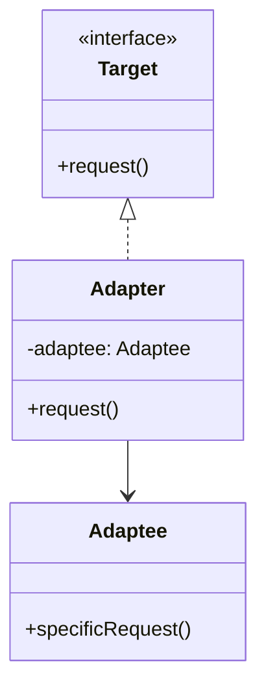

# 适配器模式（Adapter Pattern）

> 核心目标：把一个已有类的接口，转换成调用方期望的另一个接口，让原本不兼容的两个系统可以协同工作。

## 一、它解决了什么问题？

现实开发里，经常会遇到这种情况：

- 你手上有个老接口，但新模块不认它
- 你接入第三方 SDK，但它的 API 风格和你项目内部不一致
- 你拿到的是后端返回模型，但 UI 层需要的是另一种展示结构

本质问题是：

> 两边都没错，但接口对不上。

如果直接硬改原类，通常会有几个问题：

- 影响旧调用方
- 改动范围大
- 第三方 SDK 根本改不了

这时候就需要一个“翻译层”，这就是适配器模式。

它像什么？
像你去国外旅行时用的转换插头：

- 墙上插座没问题
- 你的充电器也没问题
- 问题只是两边接口不兼容

适配器做的事，不是发明新电，而是把接口接上。

## 二、核心思想

适配器模式里通常会有三个角色：

- **Target**：调用方期望的接口
- **Adaptee**：已有但接口不兼容的类
- **Adapter**：负责把 Adaptee 转成 Target



## 三、标准实现方案

### 1. 目标接口

```kotlin
interface ImageLoader {
    fun load(url: String)
}
```

### 2. 被适配者

```kotlin
class ThirdPartyImageSdk {
    fun displayImage(path: String) {
        println("第三方 SDK 加载图片: $path")
    }
}
```

### 3. 适配器

```kotlin
class ImageLoaderAdapter(
    private val sdk: ThirdPartyImageSdk
) : ImageLoader {
    override fun load(url: String) {
        sdk.displayImage(url)
    }
}
```

### 4. 调用方

```kotlin
class AvatarService(
    private val imageLoader: ImageLoader
) {
    fun showAvatar(url: String) {
        imageLoader.load(url)
    }
}
```

这样一来，业务层只依赖 `ImageLoader`，不用直接依赖第三方 SDK 的具体接口。

## 四、适配器模式的优势

### 1. 兼容旧系统和新系统

不用大改原有代码，就能把旧接口接进新体系。

### 2. 降低外部依赖污染

业务层可以依赖你自己的抽象接口，而不是直接绑死第三方 SDK。

### 3. 更利于替换实现

今天你接的是 Glide，明天换 Coil，只要适配器层处理好，业务层改动就会小很多。

## 五、代价和边界

### 1. 会增加一层间接调用

虽然影响通常不大，但结构上确实多了一层包装。

### 2. 如果适配过多，可能掩盖原始问题

有时候不是该“适配”，而是该重新设计抽象。  
如果看到哪都在写适配器，可能说明上层接口定义本身就不合理。

### 3. 不能解决语义根本不一致的问题

适配器适合“接口不兼容但能力相近”的场景。  
如果两个系统语义完全不同，光靠适配器很难优雅解决。

## 六、Android 中哪些地方特别常见？

### 1. `RecyclerView.Adapter`

这是 Android 开发里最经典的适配器案例之一。

为什么叫 Adapter？

因为 `RecyclerView` 并不直接认识你的业务数据，它只认识：

- 怎么创建 ViewHolder
- 怎么把数据绑定到 View 上
- 列表总共有多少项

而 Adapter 做的事，就是把“你的数据模型”适配成“RecyclerView 能理解的展示接口”。

```kotlin
class UserAdapter(
    private val data: List<User>
) : RecyclerView.Adapter<UserAdapter.UserViewHolder>() {

    class UserViewHolder(itemView: View) : RecyclerView.ViewHolder(itemView)

    override fun onCreateViewHolder(parent: ViewGroup, viewType: Int): UserViewHolder {
        val view = LayoutInflater.from(parent.context)
            .inflate(R.layout.item_user, parent, false)
        return UserViewHolder(view)
    }

    override fun onBindViewHolder(holder: UserViewHolder, position: Int) {
        val user = data[position]
        holder.itemView.findViewById<TextView>(R.id.nameText).text = user.name
    }

    override fun getItemCount(): Int = data.size
}
```

这里适配器做的不是“保存数据”，而是“翻译数据和视图之间的关系”。

### 2. 第三方 SDK 封装

比如图片加载、地图 SDK、推送 SDK、支付 SDK，你通常不希望业务代码到处直接调第三方接口。

更好的方式是：

- 项目内部定义统一接口
- 为每个第三方实现一个 Adapter
- 业务层只依赖自己的抽象

这样做的好处特别明显：

- 便于切换供应商
- 便于测试
- 便于控制外部依赖扩散

### 3. 数据模型转换

例如后端返回：

```json
{
  "nickname": "Tom",
  "avatar_url": "https://..."
}
```

但 UI 层需要的是：

- 用户名
- 头像
- 是否显示 VIP 标签

这时也常常会做一层“展示模型适配”。  
严格来说，这有时更接近转换器或 Mapper，但思想上依然有明显的适配意味。

## 七、Android 框架和常见库里的案例

### 1. `RecyclerView.Adapter`

这是最值得面试里拿出来讲的例子。  
它把业务数据适配成 `RecyclerView` 所需要的视图创建与绑定接口，是适配器模式在 Android 中最直观的体现。

### 2. `ListAdapter`

`ListAdapter` 在 `RecyclerView.Adapter` 基础上进一步封装了差分刷新能力。  
它本质上仍然是适配器思想，只是更现代、更适合实际项目。

### 3. `CursorAdapter`

虽然现在用得没以前多，但它是 Android 早期非常典型的适配器实现：把数据库查询结果 `Cursor` 适配成可展示的列表项。

### 4. 第三方库封装层

真实项目里，很多团队会自己定义：

- `ImageLoader`
- `Router`
- `AnalyticsTracker`
- `PushService`

然后把具体的 Glide、ARouter、Firebase、厂商推送都藏在适配器后面。  
这其实非常工程化，也很面试友好。

## 八、适配器模式和装饰器模式有什么区别？

这两个很容易混。

### 适配器模式

- 目的是“接口转换”
- 重点是把不兼容接口接起来

### 装饰器模式

- 目的是“增强功能”
- 重点是在不改原类的情况下扩展能力

一句话记忆：

> 适配器是“翻译官”，装饰器是“强化插件”。

## 九、实战里怎么判断该不该用适配器？

### 1. 两边能力相近，但接口不兼容

这是最标准的适配器场景。

### 2. 你不想让第三方 API 直接污染业务层

只要你想隔离外部依赖，适配器通常都是很好的选择。

### 3. 未来可能替换底层实现

如果你判断供应商、SDK、底层方案以后可能换，提前加一层适配非常值。

## 十、面试里怎么答？

### 标准回答模板

> 适配器模式的核心是把一个已有类的接口转换成调用方期望的另一个接口，让原本不兼容的两个系统可以协同工作。  
> 它特别适合旧接口兼容、第三方 SDK 封装、数据结构转换这类场景。  
> 在 Android 里最经典的例子就是 `RecyclerView.Adapter`，因为 RecyclerView 并不直接理解业务数据，而 Adapter 负责把数据适配成视图创建和绑定逻辑。  
> 另外，项目里如果要封装图片加载、埋点、推送等第三方能力，也很适合通过适配器模式隔离外部依赖。

### 面试高频追问

#### 1. 适配器模式和代理模式有什么区别？

适配器强调“接口转换”；代理强调“控制访问”。  
两者结构上可能都像包装一层，但目的不同。

#### 2. `RecyclerView.Adapter` 为什么算适配器？

因为它把你的业务数据转换成 RecyclerView 认识的展示接口，这是非常标准的“数据到视图接口适配”。

#### 3. 适配器模式会不会增加复杂度？

会增加一层封装，但如果它换来了接口统一、依赖隔离、实现可替换，通常是值得的。

## 十一、总结

适配器模式最本质的一句话就是：

> 不是谁错了，而是两边说的不是同一种“接口语言”，所以需要一个翻译层。

在 Android 里，这个模式特别值得掌握，因为你会反复碰到这些场景：

- `RecyclerView.Adapter`
- 第三方 SDK 接入
- 老模块兼容新接口
- 后端模型转 UI 模型

所以以后只要你看到“能力差不多，但接口对不上”，就可以优先想到适配器模式。

---
_本文档将持续更新，后续可继续补充类适配器/对象适配器区别，以及适配器与 Mapper、Facade 的边界分析_
