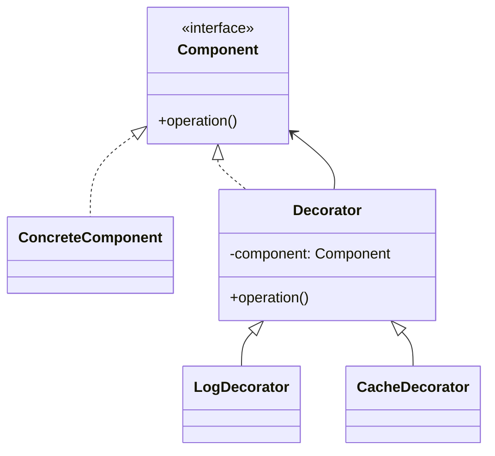

# 装饰器模式（Decorator Pattern）

> 核心目标：在不修改原对象代码的前提下，动态地给它增加新功能。

## 一、它解决了什么问题？

很多时候，我们不是想“重写一个类”，而是想在原有能力上再加一点东西：

- 给网络请求增加日志
- 给输入流增加缓冲
- 给页面 Context 增加主题包装
- 给某个能力加缓存、统计、权限判断

最直接的做法，很多人会想到继承。

但继承一旦用多了，问题会很快暴露：

- 类越来越多
- 功能组合会爆炸
- 一个类想同时拥有 A、B、C 增强能力时，继承层级会变得很难看

比如一个咖啡类：

- 原味咖啡
- 加奶咖啡
- 加糖咖啡
- 加奶加糖咖啡
- 加奶加糖加冰咖啡

如果全靠继承，很快就会写到崩溃。

装饰器模式的思路更聪明：

> 不去改原咖啡，而是在外面一层一层“包”功能。

这样你想加什么就包什么，组合会非常灵活。

## 二、核心思想

装饰器模式通常有这些角色：

- **Component**：统一抽象接口
- **ConcreteComponent**：原始对象
- **Decorator**：持有 Component 的包装类
- **ConcreteDecorator**：具体增强功能



## 三、标准实现方案

### 1. 抽象接口

```kotlin
interface DataSource {
    fun load(): String
}
```

### 2. 原始对象

```kotlin
class RemoteDataSource : DataSource {
    override fun load(): String {
        return "从网络获取数据"
    }
}
```

### 3. 装饰器基类

```kotlin
open class DataSourceDecorator(
    private val dataSource: DataSource
) : DataSource {
    override fun load(): String {
        return dataSource.load()
    }
}
```

### 4. 具体装饰器

```kotlin
class LogDecorator(
    dataSource: DataSource
) : DataSourceDecorator(dataSource) {
    override fun load(): String {
        println("开始加载数据")
        val result = super.load()
        println("加载结束: $result")
        return result
    }
}

class CacheDecorator(
    dataSource: DataSource
) : DataSourceDecorator(dataSource) {
    override fun load(): String {
        println("先查缓存，没有再走原逻辑")
        return super.load()
    }
}
```

### 5. 使用方式

```kotlin
val dataSource = LogDecorator(
    CacheDecorator(
        RemoteDataSource()
    )
)

println(dataSource.load())
```

这里最关键的点是：

- 原始对象不需要修改
- 增强功能可以一层层叠加
- 功能组合比继承灵活得多

## 四、装饰器模式的优势

### 1. 不改原类就能扩展能力

这符合开闭原则，也是装饰器模式最大的价值。

### 2. 组合比继承更灵活

你想加日志就包日志，想加缓存就包缓存，想两个都要就再包一层。

### 3. 功能可以按需叠加

不同场景下可以有不同的装饰组合，不需要为了每种组合都写一个子类。

## 五、代价和边界

### 1. 包装层多了以后阅读成本会上升

对象被包了几层，真实执行链有时需要顺着看。

### 2. 小场景下可能显得偏重

如果只是加一个特别简单的行为，直接写也许更省事。

### 3. 不要把装饰器写成“大杂烩”

每个装饰器最好只增强一种能力，否则就失去了职责清晰的优势。

## 六、Android 中哪些地方特别适合？

### 1. 数据加载增强

比如 Repository 原本只有“取数据”能力，你可能还想给它加：

- 日志
- 缓存
- 埋点
- 降级兜底

这些都非常适合用装饰器来叠加。

### 2. 图片加载 / 网络请求能力增强

一个基础请求能力上面，常见会再包：

- 日志统计
- 失败重试
- 缓存命中
- 鉴权补充

这些增强如果硬写在一个类里，很快会变肿；用装饰器或装饰器思想会优雅很多。

### 3. Context 包装

Android 里的 `ContextWrapper`、`ContextThemeWrapper`，本质上就很有装饰器味道。

它们不是重写整个 Context，而是在原 Context 基础上包一层，增加或改造部分行为。

## 七、Android 框架和常见库里的案例

### 1. Java I/O 体系

这是装饰器模式最经典的案例之一。

比如：

- `InputStream` 是抽象组件
- `FileInputStream` 是具体组件
- `BufferedInputStream` 是装饰器
- `DataInputStream` 也是装饰器

你可以这样层层包裹：

```kotlin
val input = DataInputStream(
    BufferedInputStream(
        FileInputStream(file)
    )
)
```

每包一层，就多一层能力：

- 文件读取
- 缓冲优化
- 数据类型读取支持

这就是装饰器模式教科书级案例。

### 2. `ContextWrapper` / `ContextThemeWrapper`

它们通过持有一个原始 `Context`，在外层加能力，而不是直接把 Context 的所有实现都重写一遍。

这很适合面试里讲，因为它非常贴近 Android 开发日常。

### 3. `OkHttp` 拦截器链里的增强思想

严格来说，`OkHttp` 更经典的主模式是责任链。  
但从“每一层都像给请求额外加了一层功能”这个角度，也能看出装饰器思想。

你在面试里可以这样说：

> `OkHttp` 以责任链为主，但每个拦截器对请求和响应的包装增强，也体现了装饰器式的设计味道。

## 八、装饰器模式和继承有什么区别？

这是最值得讲清楚的一点。

### 继承

- 在编译期确定能力
- 容易形成庞大继承树
- 多种功能组合时类数量容易爆炸

### 装饰器

- 在运行时灵活组合功能
- 更适合横向增强
- 不需要为每种组合单独写一个子类

一句话总结：

> 继承是“我本身就是这个更强的类”，装饰器是“我在外面给你包一层增强能力”。

## 九、实战里怎么判断该不该用装饰器？

### 1. 你是不是想增强原对象，而不是改造其核心职责？

如果是加日志、缓存、统计、权限这类附加能力，装饰器很合适。

### 2. 这些增强能力是否可能组合出现？

如果答案是是，那装饰器往往比继承更灵活。

### 3. 原对象是否不方便修改？

如果是第三方类、稳定基类，或者你不想破坏原有实现，装饰器尤其适合。

## 十、面试里怎么答？

### 标准回答模板

> 装饰器模式的核心是在不修改原对象代码的情况下，通过包装对象的方式动态增强功能。  
> 它特别适合日志、缓存、权限、统计这类附加能力的叠加。  
> 相比继承，装饰器的优势是组合更灵活，不会因为功能排列组合而产生大量子类。  
> 在 Android / Java 体系里很经典的案例有 `BufferedInputStream` 对 `FileInputStream` 的增强，以及 `ContextWrapper` 对 `Context` 的包装。

### 面试高频追问

#### 1. 装饰器模式和代理模式有什么区别？

装饰器偏向“增强功能”，代理偏向“控制访问”。  
结构上都像包一层，但意图不同。

#### 2. 装饰器模式一定比继承好吗？

不一定。  
如果能力固定、层次稳定，继承也很直接；但一旦涉及灵活组合，装饰器通常更合适。

#### 3. `BufferedInputStream` 为什么是装饰器？

因为它没有改变 `InputStream` 的抽象接口，而是在原读取能力外面包了一层缓冲增强。

## 十一、总结

装饰器模式最适合解决的问题是：

> 我想给一个对象加点能力，但我又不想改它，更不想为了功能组合写一堆子类。

在 Android 开发里，你可以优先在这些场景想到它：

- 日志、缓存、埋点等附加增强
- `Context` 包装
- I/O 流能力叠加
- 请求处理能力增强

当你把“增强功能”和“控制访问”区分清楚，再把它和继承方案做个对比，装饰器模式这道面试题基本就稳了。

---
_本文档将持续更新，后续可继续补充装饰器与 Kotlin 委托、组合优于继承的实践对比_
