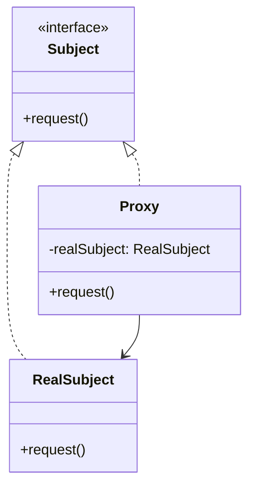

# 代理模式（Proxy Pattern）

> 核心目标：通过一个代理对象来控制对真实对象的访问，在访问前后增加额外逻辑，或者延迟真实对象的创建与调用。

## 一、它解决了什么问题？

有些对象不是“不能用”，而是“不适合直接用”：

- 真实对象创建成本很高
- 调用前需要做权限校验
- 调用时需要加日志、埋点、缓存
- 你不想让外部直接接触真实对象

这时候，直接把真实对象暴露出去，控制力就不够了。

代理模式的思路是：

> 先别直接接触真实对象，先经过我这一层。

它像什么？
像明星经纪人。

- 你不是直接找明星本人谈合作
- 你先联系经纪人
- 经纪人会先做筛选、安排、控制访问流程
- 需要时才真正把请求转给明星本人

这里经纪人就是代理。

## 二、核心思想

代理模式通常包含三个角色：

- **Subject**：抽象接口
- **RealSubject**：真实对象
- **Proxy**：代理对象，和真实对象实现同一接口



代理和真实对象对外暴露的是同一套接口，所以调用方通常感知不到底层到底拿到的是谁。

## 三、标准实现方案

### 1. 抽象接口

```kotlin
interface ImageLoader {
    fun display(url: String)
}
```

### 2. 真实对象

```kotlin
class RealImageLoader : ImageLoader {
    override fun display(url: String) {
        println("真正加载图片: $url")
    }
}
```

### 3. 代理对象

```kotlin
class ImageLoaderProxy : ImageLoader {
    private var realLoader: RealImageLoader? = null

    override fun display(url: String) {
        println("代理先做日志记录")

        if (realLoader == null) {
            println("真实对象很重，先懒加载创建")
            realLoader = RealImageLoader()
        }

        realLoader?.display(url)
    }
}
```

### 4. 使用方式

```kotlin
val imageLoader: ImageLoader = ImageLoaderProxy()
imageLoader.display("https://example.com/avatar.png")
```

这里代理对象做了两件事：

- 在访问前插入日志逻辑
- 延迟真实对象创建

## 四、代理模式的优势

### 1. 控制访问

你可以在代理里统一做：

- 权限校验
- 参数校验
- 日志记录
- 限流防抖

### 2. 支持懒加载

有些对象很重，没必要一开始就创建。  
代理可以把真实对象延迟到真正需要时再初始化。

### 3. 隔离真实实现

调用方看到的是统一接口，不需要直接依赖真实对象细节。

## 五、代价和边界

### 1. 增加一层间接调用

代码路径会多一层，需要额外维护代理逻辑。

### 2. 代理逻辑过多时容易变复杂

如果你把所有增强、校验、缓存、统计都堆在一个代理里，这个代理自己也会变得臃肿。

### 3. 要区分它和装饰器、适配器

这三个模式结构都可能像“包一层”，但目的完全不同。

## 六、常见代理类型

### 1. 静态代理

手写一个代理类，最直观，也最容易理解。

优点：

- 结构清晰
- 容易调试

缺点：

- 接口一多，代理类会很多

### 2. 动态代理

运行时自动生成代理对象，不需要你手写每个代理类。

Java / Android 面试里这类问题经常和：

- Retrofit
- AOP
- Hook
- 埋点增强

联系在一起。

### 3. 虚拟代理

核心是“先给你一个代理壳子，真实对象晚点再创建”。  
最典型场景就是懒加载。

### 4. 保护代理

访问前先做权限控制，不满足条件就不让你调用真实对象。

## 七、Android 中哪些地方特别适合？

### 1. 图片或大对象懒加载

比如页面一进来先显示占位，真正需要时再初始化复杂对象，这就是很典型的虚拟代理思想。

### 2. 权限校验封装

比如某些能力调用前必须先检查：

- 登录状态
- 会员权限
- 系统运行时权限

这些都可以放到代理层统一控制。

### 3. 埋点 / 日志增强

你不希望业务代码到处手写：

- 点击前埋点
- 调用前打日志
- 调用后统计耗时

代理层正好可以统一处理这类横切逻辑。

### 4. 网络层接口调用代理

这在 Android 面试里很常见，因为 `Retrofit` 就是很典型的动态代理案例。

## 八、Android 框架和常见库里的案例

### 1. `Retrofit`

这是代理模式最经典的 Android 框架案例之一。

你会定义一个接口：

```kotlin
interface UserApi {
    @GET("user/info")
    suspend fun getUserInfo(): User
}
```

然后通过：

```kotlin
val api = retrofit.create(UserApi::class.java)
```

拿到一个实现对象。

但你根本没有手写 `UserApi` 的实现类。  
为什么它还能工作？

因为 `Retrofit` 在运行时通过动态代理生成了接口实现：

- 拦截你的方法调用
- 解析注解
- 组装请求
- 发起网络调用
- 返回结果

这就是代理模式非常高级也非常实战的落地。

### 2. `Binder` 远程调用

从“本地像调普通对象一样，背后其实是跨进程通信”这个角度看，`Binder` 体系里也有明显的代理思想。

客户端拿到的很多时候并不是“真正远端对象本体”，而是它在本地的代理表示。

### 3. 懒加载封装

很多项目会封装：

- 懒初始化数据库
- 懒创建图片引擎
- 懒加载 WebView

这些都可以从虚拟代理角度理解。

## 九、代理模式和装饰器、适配器怎么区分？

这是面试里特别常见的一组对比题。

### 代理模式

- 重点是控制访问
- 关注“要不要给你访问、什么时候访问、访问前后做什么”

### 装饰器模式

- 重点是增强功能
- 关注“给原对象额外加能力”

### 适配器模式

- 重点是接口转换
- 关注“把不兼容接口接起来”

一句话记忆：

> 代理是“把门的人”，装饰器是“加装备的人”，适配器是“翻译的人”。

## 十、实战里怎么判断该不该用代理？

### 1. 是否需要统一访问控制？

如果调用前都要做一层校验或过滤，代理很适合。

### 2. 是否需要延迟真实对象创建？

如果真实对象很重、初始化代价高，虚拟代理很值。

### 3. 是否存在横切逻辑？

日志、埋点、耗时统计、鉴权，这些典型横切关注点都很适合放代理层。

## 十一、面试里怎么答？

### 标准回答模板

> 代理模式的核心是通过代理对象来控制对真实对象的访问。  
> 代理对象和真实对象实现同一接口，但会在调用前后增加额外逻辑，比如权限校验、懒加载、日志记录、远程访问封装。  
> 在 Android 里比较经典的案例是 `Retrofit` 的动态代理，它会在运行时生成接口实现，拦截方法调用并转成网络请求。  
> 另外像懒加载、权限控制、跨进程调用，也都能看到明显的代理思想。

### 面试高频追问

#### 1. 代理模式和装饰器模式有什么区别？

代理更强调控制访问，装饰器更强调增强能力。  
虽然都像包一层，但设计意图不同。

#### 2. `Retrofit` 为什么算代理？

因为你定义的接口本身没有实现类，`Retrofit` 在运行时动态生成代理对象来接管方法调用。

#### 3. 什么时候适合用动态代理？

当你要对很多接口统一织入逻辑，又不想手写大量代理类时，动态代理特别合适。

## 十二、总结

代理模式最值得记住的一句话是：

> 不是直接让你碰真实对象，而是先经过一个可控的中间层。

在 Android 开发里，它特别适合这些场景：

- 权限校验
- 懒加载
- 埋点和日志增强
- 动态代理网络接口
- 远程调用封装

当你能把 `Retrofit`、动态代理、访问控制和懒加载串起来讲，代理模式这道题基本就能答得很有层次。

---
_本文档将持续更新，后续可继续补充 Java 动态代理、AOP、Hook 与 Android 框架代理实践的联系_
