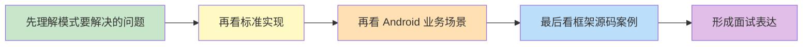

# Android 设计模式知识体系

> 不是为了背八股，而是为了看懂框架设计、写出更稳的业务代码、在面试里把“为什么这么设计”讲明白。

## 为什么 Android 开发要学设计模式？

很多人学设计模式时，最大的问题是：

- 书上例子太抽象，看完还是不知道项目里怎么用
- 只记住名字，碰到 `OkHttp`、`Glide`、`RecyclerView` 的源码还是看不懂
- 面试时只能背定义，答不出 Android 里的真实落地场景

站在 Android 开发的角度，设计模式的价值主要有三点：

1. **看懂框架源码**
   `OkHttp` 为什么这么好扩展？`Retrofit` 为什么 API 这么优雅？背后基本都是设计模式在支撑。
2. **提升代码可维护性**
   不是所有逻辑都该写在 `Activity` / `Fragment` 里。模式本质上是在解决“职责混乱、耦合过高、扩展困难”的问题。
3. **提升面试表达力**
   面试官真正想听的，通常不是定义，而是你能不能把“场景、方案、取舍、框架案例”串起来。

## 这一组文档怎么读？

## 第一阶段：高频模式

### [1-单例模式](1-单例模式.md)

**适合优先掌握的原因**：

- 面试出现频率极高
- Android 项目里经常用来管理全局共享对象
- 很容易被写错，尤其是线程安全和内存泄漏问题

**重点看什么**：

- 饿汉式、懒汉式、双重检查、Kotlin `object`
- Android 中哪些对象适合单例，哪些不适合
- `Room`、`Retrofit`、Repository 管理里的单例思想

### [2-工厂方法模式](2-工厂方法模式.md)

**适合优先掌握的原因**：

- 解决“对象创建逻辑散落各处”的问题
- 在 Android 系统服务、View 创建、组件封装里很常见
- 面试中经常和简单工厂、抽象工厂一起考

**重点看什么**：

- 工厂方法和简单工厂的区别
- 什么时候把创建逻辑放进工厂
- Android/框架里如何通过工厂做解耦和扩展

### [3-建造者模式](3-建造者模式.md)

**适合优先掌握的原因**：

- Android API 和三方框架大量使用
- 最容易和链式调用、可读性、参数校验联系起来
- 面试时能直接举出 `AlertDialog.Builder`、`Glide`、`Retrofit` 的例子

**重点看什么**：

- 为什么复杂对象适合 Builder
- 链式 API 背后解决了什么问题
- Builder 和 Kotlin 默认参数、DSL 的关系

### [4-观察者模式](4-观察者模式.md)

**适合优先掌握的原因**：

- Android 事件分发、状态通知、数据订阅里到处都是它
- 很适合和 `LiveData`、`Flow`、监听器机制结合着讲
- 面试里经常考“发布订阅”和它的区别

**重点看什么**：

- 一对多通知机制的本质
- 观察者模式和事件总线、发布订阅的区别
- Android 中状态更新、回调监听的真实案例

### [5-策略模式](5-策略模式.md)

**适合优先掌握的原因**：

- 特别适合讲“用组合替代 if-else”
- 支付、登录、排序、图片压缩策略都很常见
- 很适合结合业务代码优化来体现工程能力

**重点看什么**：

- 如何把不同算法封装成统一接口
- 策略模式和工厂模式如何配合
- Android 业务中常见的动态切换场景

### [6-责任链模式](6-责任链模式.md)

**适合优先掌握的原因**：

- `OkHttp` 拦截器是 Android 面试里的经典案例
- 能很好解释“请求为什么能被一层层处理”
- 很适合讲扩展性和解耦

**重点看什么**：

- 请求如何沿链路逐层传递
- 每一层节点如何决定“处理还是继续传下去”
- Android 和常见框架里哪些流程天然适合责任链

### [7-适配器模式](7-适配器模式.md)

**适合优先掌握的原因**：

- `RecyclerView.Adapter` 这个名字就把模式写脸上了
- 它是“把两个不兼容接口接起来”的经典方案
- 非常适合结合旧接口兼容、新 SDK 接入来讲

**重点看什么**：

- 适配器模式到底在“适配”什么
- `RecyclerView` 为什么天然符合适配器思想
- 实战里如何做第三方能力封装和接口兼容

### [8-装饰器模式](8-装饰器模式.md)

**适合优先掌握的原因**：

- 它非常适合讲“在不改原类的前提下增强功能”
- `OkHttp`、`InputStream`、`ContextWrapper` 这类案例都很经典
- 很适合和继承方案做对比，体现设计取舍

**重点看什么**：

- 装饰器和继承增强的区别
- 为什么“包一层再增强”比直接改原类更灵活
- Android / Java I/O 体系里的典型装饰器实现

### [9-代理模式](9-代理模式.md)

**适合优先掌握的原因**：

- 动态代理、AOP、懒加载、权限控制都能和它联系起来
- Android 里做代理封装的场景很多
- 面试里常和装饰器、适配器一起对比考察

**重点看什么**：

- 代理模式到底是在“控制什么”
- 静态代理和动态代理的区别
- Android 中懒加载、权限校验、埋点增强的代理思想

### [10-模板方法模式](10-模板方法模式.md)

**适合优先掌握的原因**：

- 很适合讲“固定流程 + 可变步骤”
- 自定义 View、基类封装、初始化流程里非常常见
- 面试里容易和策略模式放在一起比较

**重点看什么**：

- 什么叫算法骨架固定、局部步骤可变
- 模板方法和继承复用的关系
- Android 开发里哪些基类设计天然适合模板方法

### [11-外观模式](11-外观模式.md)

**适合优先掌握的原因**：

- 对业务开发很实用，尤其适合做模块封装
- 很适合讲“复杂系统对外只暴露一个简单入口”
- 能直接结合 SDK 封装、组件化门面层来讲

**重点看什么**：

- 外观模式到底在“简化”什么
- 它和中台 API、模块封装之间的关系
- Android 中如何用一个统一入口屏蔽复杂子系统

## 后续建议补充的模式

这批模式也非常适合继续扩展：

- 观察者模式 `Observer`
- 策略模式 `Strategy`
- 责任链模式 `Chain of Responsibility`
- 适配器模式 `Adapter`
- 装饰器模式 `Decorator`
- 代理模式 `Proxy`
- 模板方法模式 `Template Method`
- 外观模式 `Facade`

## 面试回答建议

讲设计模式时，不建议一上来背定义，最好按这个顺序答：

1. **先说它解决什么问题**
2. **再说核心实现思路**
3. **再说优点和代价**
4. **最后结合 Android 或某个框架举例**

比如回答单例模式时，不要只说“保证一个类只有一个实例”，而要继续补一句：

> 在 Android 里它常用于数据库、网络层、Repository 这类全局共享对象，但如果把 `Activity` Context 放进单例，就很容易造成内存泄漏，所以通常要持有 `Application` Context。

这句话一出来，面试官会更容易判断你是真的在项目里用过。

---
_本文档将持续更新，后续会继续补齐更多 Android 高频设计模式_
