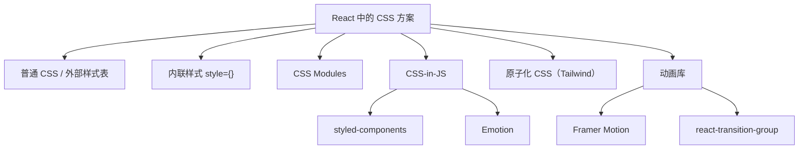

# CSS 在 React 中的使用实践 (CSS in React)

## 1. 解决什么问题？
> 掌握 React 项目中所有主流样式方案，根据项目需求做出正确选型

* **痛点**：React 没有内置样式隔离方案，社区方案众多（CSS Modules、styled-components、Emotion...），选择困难
* **作用**：系统梳理每种方案的写法、优缺点和适用场景，帮助快速决策

---

## 2. React 样式方案全景图



---

## 3. 普通 CSS / 外部样式表

最基础的方案：创建 `.css` 文件，通过 `import` 引入。

```css
/* UserCard.css */
.user-card {
  padding: 20px;
  border: 1px solid #e5e7eb;
  border-radius: 8px;
}
.user-card__name {
  font-size: 18px;
  font-weight: 600;
}
.user-card__email {
  color: #6b7280;
  font-size: 14px;
}
```

```jsx
// UserCard.jsx
import './UserCard.css'

function UserCard({ name, email }) {
  return (
    // React 中用 className 而非 class
    <div className="user-card">
      <h2 className="user-card__name">{name}</h2>
      <p className="user-card__email">{email}</p>
    </div>
  )
}
```

> **注意**：普通 CSS 是全局的，容易产生类名冲突。推荐使用 BEM 命名规范（`.block__element--modifier`）来缓解。

---

## 4. 内联样式 (Inline Style)

```jsx
function AlertBanner({ type, message }) {
  // 样式对象：属性名必须是驼峰命名
  const bannerStyle = {
    padding: '12px 20px',
    borderRadius: '8px',
    fontSize: '14px',
    // 根据 type 动态计算颜色
    backgroundColor: type === 'error' ? '#fef2f2' : '#f0fdf4',
    color: type === 'error' ? '#dc2626' : '#16a34a',
    border: `1px solid ${type === 'error' ? '#fecaca' : '#bbf7d0'}`
  }

  return <div style={bannerStyle}>{message}</div>
}
```

**内联样式的限制**：
- 不支持伪类（`:hover`）、伪元素（`::before`）
- 不支持媒体查询
- 不支持 keyframes 动画
- 性能：频繁创建对象会增加 GC 压力

> **适用场景**：只在需要根据 JS 状态动态计算的简单样式时使用（如位置、颜色），不建议作为主要方案。

---

## 5. CSS Modules

React 项目中 **最推荐的传统 CSS 方案**，类名自动编译为唯一 hash，彻底避免冲突。

### 5.1 基本用法

```css
/* ProductCard.module.css */
.card {
  padding: 16px;
  border: 1px solid #e5e7eb;
  border-radius: 8px;
  transition: box-shadow 0.2s;
}
.card:hover {
  box-shadow: 0 4px 12px rgba(0, 0, 0, 0.1);
}
.title {
  font-size: 16px;
  font-weight: 600;
  margin-bottom: 8px;
}
.price {
  color: #dc2626;
  font-size: 20px;
  font-weight: 700;
}
.tag {
  display: inline-block;
  padding: 2px 8px;
  background: #dbeafe;
  color: #2563eb;
  border-radius: 4px;
  font-size: 12px;
}
```

```jsx
// ProductCard.jsx
import styles from './ProductCard.module.css'

function ProductCard({ title, price, tag }) {
  return (
    // styles.card 实际值类似 "ProductCard_card_7x3k2"
    <div className={styles.card}>
      <h3 className={styles.title}>{title}</h3>
      <span className={styles.price}>¥{price}</span>
      {tag && <span className={styles.tag}>{tag}</span>}
    </div>
  )
}
```

### 5.2 组合多个类名

```jsx
import styles from './Button.module.css'

function Button({ variant, size, children }) {
  // 手动拼接类名
  const className = [
    styles.btn,
    styles[`btn--${variant}`],
    styles[`btn--${size}`]
  ].filter(Boolean).join(' ')

  return <button className={className}>{children}</button>
}
```

---

## 6. clsx / classnames — 动态类名工具

手动拼接类名容易出错，推荐使用 `clsx`（更轻量）或 `classnames` 库。

```jsx
import clsx from 'clsx'
import styles from './Button.module.css'

function Button({ variant, disabled, loading, children }) {
  return (
    <button
      className={clsx(
        styles.btn,
        // 条件类名
        styles[`btn--${variant}`],
        {
          [styles.disabled]: disabled,
          [styles.loading]: loading
        }
      )}
      disabled={disabled || loading}
    >
      {loading ? '加载中...' : children}
    </button>
  )
}
```

```bash
# 安装（二选一）
npm install clsx        # 更轻量，推荐
npm install classnames  # 老牌库，API 类似
```

---

## 7. CSS-in-JS

### 7.1 styled-components

用模板字符串写 CSS，生成带作用域的 React 组件。

```jsx
import styled from 'styled-components'

// 创建带样式的组件，支持 props 动态化
const Card = styled.div`
  padding: 20px;
  border-radius: 8px;
  background: ${props => props.$highlighted ? '#fffbeb' : '#ffffff'};
  border: 1px solid ${props => props.$highlighted ? '#fbbf24' : '#e5e7eb'};
  transition: all 0.2s;

  &:hover {
    box-shadow: 0 4px 12px rgba(0, 0, 0, 0.1);
  }
`

const Title = styled.h3`
  font-size: 18px;
  font-weight: 600;
  margin-bottom: 8px;
`

const Price = styled.span`
  color: #dc2626;
  font-size: 24px;
  font-weight: 700;
`

// 使用：就像普通组件一样
function ProductCard({ product }) {
  return (
    <Card $highlighted={product.isHot}>
      <Title>{product.name}</Title>
      <Price>¥{product.price}</Price>
    </Card>
  )
}
```

> **注意**：传递给 styled 组件的 props 前加 `$`（Transient Props），防止 prop 被透传到 DOM。

### 7.2 Emotion

提供两种 API 风格，灵活性更高。

```jsx
/** @jsxImportSource @emotion/react */
import { css } from '@emotion/react'
import styled from '@emotion/styled'

// 方式1：css prop（类似内联，但支持伪类/媒体查询）
function Badge({ count }) {
  return (
    <span
      css={css`
        display: inline-flex;
        align-items: center;
        justify-content: center;
        min-width: 20px;
        height: 20px;
        padding: 0 6px;
        background: #dc2626;
        color: white;
        border-radius: 10px;
        font-size: 12px;

        &:empty {
          display: none;
        }
      `}
    >
      {count > 99 ? '99+' : count}
    </span>
  )
}

// 方式2：styled API（与 styled-components 几乎一样）
const Tag = styled.span`
  padding: 2px 8px;
  border-radius: 4px;
  font-size: 12px;
  background: ${props => props.color || '#dbeafe'};
`
```

---

## 8. CSS 变量 + React 状态

不依赖任何库，通过 CSS 自定义属性实现动态主题。

```jsx
import { useState } from 'react'

function ThemeProvider({ children }) {
  const [theme, setTheme] = useState({
    primary: '#3b82f6',
    radius: '8px',
    bg: '#ffffff'
  })

  return (
    <div
      style={{
        // 通过内联样式设置 CSS 变量
        '--color-primary': theme.primary,
        '--radius': theme.radius,
        '--color-bg': theme.bg
      }}
    >
      {children}
      <button onClick={() => setTheme(prev => ({
        ...prev,
        primary: prev.primary === '#3b82f6' ? '#8b5cf6' : '#3b82f6'
      }))}>
        切换主题色
      </button>
    </div>
  )
}
```

```css
/* 组件 CSS 中直接使用变量 */
.card {
  background: var(--color-bg);
  border-radius: var(--radius);
}
.btn-primary {
  background: var(--color-primary);
}
```

> **优势**：零依赖、零运行时开销，适合实现暗色模式和主题切换。

---

## 9. React 动画方案

### 9.1 Framer Motion（推荐）

```jsx
import { motion, AnimatePresence } from 'framer-motion'

function TodoList({ items, onRemove }) {
  return (
    <AnimatePresence>
      {items.map(item => (
        <motion.div
          key={item.id}
          // 进入动画
          initial={{ opacity: 0, x: -20 }}
          animate={{ opacity: 1, x: 0 }}
          // 离开动画
          exit={{ opacity: 0, x: 20 }}
          transition={{ duration: 0.2 }}
          className="todo-item"
          onClick={() => onRemove(item.id)}
        >
          {item.text}
        </motion.div>
      ))}
    </AnimatePresence>
  )
}
```

### 9.2 纯 CSS + 状态控制

```jsx
import { useState } from 'react'
import styles from './Modal.module.css'
import clsx from 'clsx'

function Modal({ visible, onClose, children }) {
  return (
    <div
      className={clsx(styles.overlay, {
        [styles.visible]: visible
      })}
      onClick={onClose}
    >
      <div
        className={clsx(styles.content, {
          [styles.contentVisible]: visible
        })}
        onClick={e => e.stopPropagation()}
      >
        {children}
      </div>
    </div>
  )
}
```

```css
/* Modal.module.css */
.overlay {
  position: fixed;
  inset: 0;
  background: rgba(0, 0, 0, 0.5);
  opacity: 0;
  pointer-events: none;
  transition: opacity 0.3s;
}
.visible {
  opacity: 1;
  pointer-events: auto;
}
.content {
  position: fixed;
  top: 50%;
  left: 50%;
  transform: translate(-50%, -50%) scale(0.9);
  background: white;
  border-radius: 12px;
  padding: 24px;
  opacity: 0;
  transition: all 0.3s ease;
}
.contentVisible {
  opacity: 1;
  transform: translate(-50%, -50%) scale(1);
}
```

---

## 10. 方案对比与选型

| 方案 | 样式隔离 | 动态样式 | 伪类支持 | 运行时开销 | 学习成本 |
|------|----------|----------|----------|------------|----------|
| 普通 CSS | 无 | 不方便 | 支持 | 无 | 低 |
| CSS Modules | hash 类名 | 需配合 clsx | 支持 | 无 | 低 |
| styled-components | 自动作用域 | props 驱动 | 支持 | 有 | 中 |
| Emotion | 自动作用域 | props / css prop | 支持 | 有 | 中 |
| 内联样式 | 天然隔离 | JS 直接控制 | 不支持 | 无 | 低 |
| Tailwind CSS | 原子类 | 条件拼接 | 支持 | 无 | 中 |

### 推荐策略

- **新项目 / 团队协作**：CSS Modules + clsx（零运行时，简单可靠）
- **组件库 / Design System**：styled-components 或 Emotion（props 驱动，封装性好）
- **追求开发效率**：Tailwind CSS（原子化，写得快）
- **简单动态值**：CSS 变量 + style 属性（零依赖）
- **复杂动画**：Framer Motion（API 优雅，功能强大）

---

## 11. 常见错误与解决方案

```jsx
// 错误 1：用 class 而非 className
// React 中 class 是保留字
<div class="card">  // 错误：控制台警告
<div className="card">  // 正确

// 错误 2：内联样式用字符串
<div style="padding: 20px">  // 错误：React 要求对象
<div style={{ padding: '20px' }}>  // 正确

// 错误 3：CSS Modules 动态类名拼错
import styles from './Card.module.css'
<div className={styles[`card-${size}`]}>  // 注意：CSS 中用短横线命名
// 建议：CSS 中用驼峰或在 CSS 中用下划线

// 错误 4：styled-components props 透传到 DOM
const Box = styled.div`
  color: ${props => props.color};  // color 会被渲染到 DOM 上
`
// 正确：使用 $ 前缀（transient prop）
const Box = styled.div`
  color: ${props => props.$color};
`
<Box $color="red" />
```

---

## 12. 总结

- **日常首选** CSS Modules + clsx，简单、零运行时、样式隔离
- **组件封装** 场景选 styled-components 或 Emotion，props 驱动样式变化
- **动态值** 优先考虑 CSS 变量，通过 style 属性传递
- **动画** 简单的用 CSS transition，复杂的用 Framer Motion
- **不推荐** 大量使用内联样式，缺少伪类/媒体查询/复用能力

---

_本文档将持续更新，添加更多 React CSS 实践技巧_
