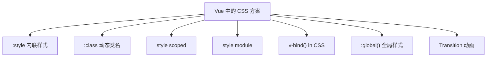

# CSS 在 Vue 中的使用实践 (CSS in Vue)

## 1. 解决什么问题？
> 掌握 Vue 项目中所有样式编写方式，用好 Vue 独有的 CSS 能力

* **痛点**：Vue 的 scoped、deep、v-bind in CSS 等特性各有适用场景，用错容易踩坑
* **作用**：系统梳理 Vue 中写 CSS 的每种方式，给出最佳实践和避坑指南

---

## 2. Vue 样式方案全景图



---

## 3. 动态 class 绑定

**在 Vue 中如何使用**：在模板里用 `:class` 绑定对象或数组，在 script 里用 `ref`/`computed` 控制条件；样式照常在 `<style>` 里写类名。

### 3.1 对象语法

- **CSS 里**：正常写 `.btn`、`.btn--primary` 等类。
- **Vue 里**：`:class="{ '类名': 布尔或表达式 }"`，类名在条件为真时生效。

```html
<template>
  <button
    :class="{
      'btn': true,
      'btn--primary': type === 'primary',
      'btn--disabled': disabled
    }"
    @click="handleClick"
  >
    {{ text }}
  </button>
</template>

<script setup>
import { ref } from 'vue'
const type = ref('primary')
const disabled = ref(false)
</script>

<style scoped>
.btn { padding: 8px 20px; border-radius: 6px; }
.btn--primary { background: #3b82f6; color: white; }
.btn--disabled { opacity: 0.5; cursor: not-allowed; }
</style>
```

### 3.2 数组语法

- **CSS 里**：写 `.card`、`card--large`、`card--active` 等类。
- **Vue 里**：`:class="['类名1', 变量或计算属性, { '类名': 条件 }]"`，可混用字符串和对象。

```html
<template>
  <div :class="['card', sizeClass, { 'card--active': isActive }]">
    {{ title }}
  </div>
</template>

<script setup>
import { ref, computed } from 'vue'
const isActive = ref(true)
const size = ref('large')
const sizeClass = computed(() => `card--${size.value}`)
</script>

<style scoped>
.card { padding: 16px; }
.card--large { font-size: 18px; }
.card--active { border-color: #3b82f6; }
</style>
```

---

## 4. 内联样式绑定 (:style)

**在 Vue 中如何使用**：不用在 CSS 里写这些样式，直接在模板用 `:style` 绑定对象或数组，属性来自 script 的 `ref`/`computed`；适合强动态、一次性的样式。

- **CSS 里**：不需要为这些动态样式单独写类。
- **Vue 里**：`:style="对象"` 或 `:style="[对象1, 对象2]"`，键用驼峰或 `'kebab-case'` 字符串。

```html
<template>
  <div :style="{
    backgroundColor: bgColor,
    fontSize: fontSize + 'px',
    'max-width': '600px'
  }">
    内容区域
  </div>
  <div :style="[baseStyle, activeStyle]">合并样式</div>
</template>

<script setup>
import { ref, computed } from 'vue'
const bgColor = ref('#f9fafb')
const fontSize = ref(16)
const baseStyle = { padding: '16px', borderRadius: '8px' }
const activeStyle = computed(() => ({
  color: bgColor.value === '#f9fafb' ? '#1f2937' : '#ffffff'
}))
</script>
```

> **注意**：Vue 会自动添加浏览器前缀（如 `-webkit-`），不需要手动处理。

---

## 5. Scoped 样式

**在 Vue 中如何使用**：在 SFC 的 `<style>` 上加上 `scoped` 即可，模板里正常写类名或不用类名（选中的是当前组件的元素），无需在 script 里做任何事。

- **CSS 里**：`<style scoped>` 内写的选择器只会作用到当前组件。
- **Vue 里**：模板照常写，例如 `<h1 class="title">标题</h1>`。

```html
<template>
  <h1 class="title">页面标题</h1>
  <p class="desc">这段只在当前组件生效</p>
</template>

<style scoped>
/* 编译后变成 .title[data-v-xxx] { ... }，只影响本组件 */
.title { font-size: 24px; color: #1f2937; }
.desc { color: #6b7280; }
</style>
```

**原理**：Vue 编译时给当前组件根及内部元素加唯一 `data-v-xxx`，并把选择器改成带该属性的形式，实现样式隔离。

### 5.2 Scoped 的局限性

```html
<!-- ParentComponent.vue -->
<template>
  <ChildComponent />
</template>

<style scoped>
/* 这样写不会影响 ChildComponent 内部的元素 */
/* 因为子组件的根元素虽然有父组件的 data-v，但内部元素没有 */
.child-title {
  color: red;  /* 不生效！ */
}
</style>
```

---

## 6. 深度选择器 (:deep)

**在 Vue 中如何使用**：父组件模板里正常引入子组件并加一个包裹类（如 `form-wrapper`），在**同一组件的** `<style scoped>` 里用 `:deep(子组件内部选择器)` 写样式，不要在其他 CSS 文件里写。

- **CSS 里**：在 scoped 的 style 中写 `父类 :deep(.子组件内部类) { ... }`。
- **Vue 里**：给包裹子组件的元素加类名，在 style 里用该类 + `:deep()`。

```html
<template>
  <div class="form-wrapper">
    <el-input v-model="name" placeholder="姓名" />
  </div>
</template>

<script setup>
import { ref } from 'vue'
const name = ref('')
</script>

<style scoped>
.form-wrapper :deep(.el-input__inner) {
  border-color: #3b82f6;
  border-radius: 8px;
}
</style>
```

**Vue 2 对比**：用 `::v-deep` 或 `>>>`，例如 `.form-wrapper ::v-deep .el-input__inner { ... }`。

> **最佳实践**：始终在 `:deep()` 前加父级选择器（如 `.form-wrapper`），避免影响全局。

---

## 7. CSS Modules

**在 Vue 中如何使用**：给 `<style>` 加上 `module`，模板里用 `$style.类名` 或自定义名（如 `classes.类名`）绑定到 `:class`；类名会编译成唯一 hash，不会和全局冲突。

- **CSS 里**：在 `<style module>` 里正常写类名（如 `.card`、`.title`）。
- **Vue 里**：`:class="$style.card"`，或 `:class="classes.wrapper"`（当使用 `module="classes"` 时）。

```html
<template>
  <div :class="$style.card">
    <h2 :class="$style.title">{{ name }}</h2>
    <p :class="$style.desc">{{ description }}</p>
  </div>
</template>

<script setup>
import { ref } from 'vue'
const name = ref('CSS Modules 演示')
const description = ref('类名会被编译成唯一 hash')
</script>

<style module>
.card { padding: 20px; border: 1px solid #e5e7eb; border-radius: 8px; }
.title { font-size: 20px; margin-bottom: 8px; }
.desc { color: #6b7280; }
</style>
```

### 7.2 自定义注入名称

```html
<template>
  <!-- 自定义名称，通过 classes 访问 -->
  <div :class="classes.wrapper">内容</div>
</template>

<style module="classes">
.wrapper {
  padding: 16px;
}
</style>
```

### 7.3 在 JS 中使用

在 script 里需要类名时（如动态拼接、传给子组件），用 `useCssModule()` 拿到映射对象：

```html
<script setup>
import { useCssModule } from 'vue'
const style = useCssModule()
// style.card 等为编译后的 hash 类名，可传给子组件或用在 h() 里
</script>

<template>
  <div :class="[style.card, style.rounded]">内容</div>
</template>

<style module>
.card { padding: 16px; }
.rounded { border-radius: 8px; }
</style>
```

---

## 8. v-bind() in CSS（Vue 3.2+）

**在 Vue 中如何使用**：在 script 里用 `ref` 定义变量，在 template 里可绑控件（如 `v-model`）改值，在**同一组件的** `<style scoped>` 里用 `v-bind(变量名)` 或 `v-bind(表达式)` 写进 CSS。

- **CSS 里**：在 scoped 的 style 中写 `属性: v-bind(变量)`，变量来自 script。
- **Vue 里**：script 定义 `ref`，template 可不用写 `:style`，样式全在 style 里。

```html
<template>
  <div class="theme-box">
    <p>主题颜色可动态切换</p>
    <input type="color" v-model="themeColor" />
    <input type="range" v-model="borderRadius" min="0" max="24" />
  </div>
</template>

<script setup>
import { ref } from 'vue'
const themeColor = ref('#3b82f6')
const borderRadius = ref(8)
</script>

<style scoped>
.theme-box {
  border: 2px solid v-bind(themeColor);
  border-radius: v-bind(borderRadius + 'px');
  padding: 20px;
  transition: all 0.3s ease;
}
</style>
```

**原理**：编译时 `v-bind()` 会变成 CSS 变量（`--xxx`），由 Vue 通过内联样式更新。
> **适用场景**：主题色、用户自定义颜色、动态尺寸等，比 `:style` 更集中好维护。

---

## 9. 插槽样式 (:slotted) 与全局样式 (:global)

### 9.1 :slotted() — 选中插槽内容

**在 Vue 中如何使用**：容器组件里用 `<slot />` 留空位，在使用处传入带**指定类名**的内容；样式在容器组件的 `<style scoped>` 里用 `:slotted(.类名)` 写。

- **CSS 里**：`:slotted(.card-title) { ... }` 只影响插槽里带有 `.card-title` 的节点。
- **Vue 里**：父组件传 `<template #default><h2 class="card-title">标题</h2></template>`，子组件里有 `<slot />` 和上述 scoped 样式。

```html
<!-- Card.vue -->
<template>
  <div class="card">
    <slot />
  </div>
</template>

<style scoped>
.card { padding: 20px; border: 1px solid #e5e7eb; }
:slotted(.card-title) { font-size: 18px; font-weight: 600; margin-bottom: 12px; }
</style>
```

```html
<!-- 使用 Card 的页面 -->
<template>
  <Card>
    <h2 class="card-title">我是标题</h2>
    <p>普通段落不会被 :slotted 命中</p>
  </Card>
</template>
```

### 9.2 :global() — 在 scoped 中写全局样式

**在 Vue 中如何使用**：需要影响全局时，在**本组件**的 `<style scoped>` 里用 `:global(.类名)` 写，其它规则仍受 scoped 限制。

- **CSS 里**：`:global(.page-loading) { ... }` 这条规则不带 data-v，全局生效。
- **Vue 里**：模板里可给某元素加 `class="page-loading"`，或由 JS 动态加，样式在本组件 style 里写即可。

```html
<template>
  <div class="wrapper">
    <div v-if="loading" class="page-loading">加载中...</div>
  </div>
</template>

<style scoped>
:global(.page-loading) { pointer-events: none; opacity: 0.6; }
.wrapper { padding: 20px; }
</style>
```

---

## 10. Vue 过渡动画与 CSS

**在 Vue 中如何使用**：用 `<Transition name="xxx">` 包住一个会随 `v-if`/`v-show` 显隐的**单根**元素，在 style 里写 `name-enter-from`、`name-leave-to`、`name-enter-active`、`name-leave-active` 等类；列表动画用 `<TransitionGroup>` + `v-for`，并设 `:key`。

### 10.1 Transition 组件

- **CSS 里**：按 `name` 写 `.fade-enter-from`、`.fade-leave-to`、`.fade-enter-active`、`.fade-leave-active` 等。
- **Vue 里**：`<Transition name="fade">` 包一个子元素，用 `v-if` 控制显示隐藏。

```html
<template>
  <button @click="show = !show">切换</button>
  <Transition name="fade">
    <div v-if="show" class="content">渐入渐出内容</div>
  </Transition>
</template>

<script setup>
import { ref } from 'vue'
const show = ref(true)
</script>

<style scoped>
.fade-enter-active,
.fade-leave-active { transition: opacity 0.3s ease, transform 0.3s ease; }
.fade-enter-from,
.fade-leave-to { opacity: 0; transform: translateY(-10px); }
</style>
```

### 10.2 TransitionGroup — 列表动画

- **CSS 里**：写 `name-enter-from`、`name-leave-to`、`name-enter-active`、`name-leave-active`，以及 `name-move`；列表项离开时常用 `position: absolute` 避免布局跳动。
- **Vue 里**：用 `<TransitionGroup name="list" tag="ul">` 包住 `v-for` 列表，每个项必须有 `:key`。

```html
<template>
  <TransitionGroup name="list" tag="ul" class="todo-list">
    <li v-for="item in items" :key="item.id" class="todo-item">{{ item.text }}</li>
  </TransitionGroup>
</template>

<script setup>
import { ref } from 'vue'
const items = ref([{ id: 1, text: '待办1' }, { id: 2, text: '待办2' }])
</script>

<style scoped>
.list-enter-active,
.list-leave-active { transition: all 0.3s ease; }
.list-enter-from,
.list-leave-to { opacity: 0; transform: translateX(-20px); }
.list-move { transition: transform 0.3s ease; }
.list-leave-active { position: absolute; }
</style>
```

---

## 11. 最佳实践

### 样式方案选择

| 场景 | 推荐方案 | 原因 |
|------|----------|------|
| 组件内样式 | `<style scoped>` | 默认隔离，最简单 |
| 覆盖第三方组件 | `:deep()` | 穿透 scoped 限制 |
| 需要严格隔离 | `<style module>` | hash 类名，零冲突 |
| 动态主题/颜色 | `v-bind() in CSS` | 响应式变量直接绑定 |
| 全局工具类/Reset | 单独 CSS 文件 | 不放在组件内 |
| 进入/离开动画 | `<Transition>` + CSS | Vue 内置方案，最简洁 |

### 常见错误

```html
<!-- 错误 1：scoped 中直接写子组件选择器 -->
<style scoped>
/* 不会生效！要用 :deep() */
.el-input__inner { border-color: red; }
</style>

<!-- 错误 2：v-bind() 忘了引号 -->
<style scoped>
/* 表达式需要完整，字符串拼接要加引号 */
.box {
  /* 错误写法 */
  width: v-bind(width + px);
  /* 正确写法 */
  width: v-bind(width + 'px');
}
</style>

<!-- 错误 3：Transition 下写了多个会同时存在的根元素 -->
<Transition name="fade">
  <div class="a">A</div>
  <div class="b">B</div>
</Transition>

<!-- 正确：同一时间只有一个直接子元素（用 v-if/v-else 或 v-if 单节点） -->
<Transition name="fade">
  <div v-if="show">A</div>
  <div v-else>B</div>
</Transition>
```

---

## 12. 总结

- **日常首选** `<style scoped>`，简单且够用
- **覆盖第三方** 用 `:deep()`，记得加父级选择器限定范围
- **动态值** 优先用 `v-bind() in CSS`，比 `:style` 更整洁
- **严格隔离** 用 `<style module>`，类名自动 hash
- **动画** 用 `<Transition>` + CSS，Vue 内置方案最省心

---

_本文档将持续更新，添加更多 Vue CSS 实践技巧_
