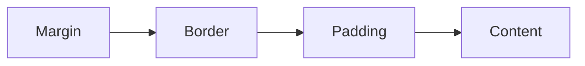

# CSS 基础场景与常用写法 (CSS Fundamentals & Common Patterns)

## 1. 解决什么问题？
> 掌握与框架无关的 CSS 核心能力，为 Vue / React 样式开发打下坚实基础

* **痛点**：CSS 属性繁多，实际开发中不知道该用哪种布局方式、怎么做响应式、动画怎么写
* **作用**：梳理最高频的 CSS 场景，给出可直接复用的代码片段

---

## 2. 盒模型 (Box Model)

### 核心概念

每个 HTML 元素都是一个矩形盒子，由 4 层构成：



### 关键属性

```css
/* 推荐全局设置 border-box，让 width/height 包含 padding 和 border */
*,
*::before,
*::after {
  box-sizing: border-box;
}

.card {
  width: 300px;         /* 内容区宽度（border-box 下包含 padding + border） */
  padding: 16px;        /* 内边距 */
  border: 1px solid #e5e7eb;
  margin: 0 auto;       /* 外边距，auto 实现水平居中 */
}
```

> **要点**：`box-sizing: border-box` 是现代 CSS 的第一条规则，几乎所有项目都会全局设置。

---

## 3. 布局 (Layout)

### 3.1 Flexbox — 一维布局利器

```css
/* 水平导航栏 */
.nav {
  display: flex;
  align-items: center;      /* 垂直居中 */
  justify-content: space-between; /* 两端对齐 */
  padding: 0 24px;
  height: 60px;
}

/* 垂直居中（最常用的居中方案） */
.center-box {
  display: flex;
  justify-content: center;  /* 水平居中 */
  align-items: center;      /* 垂直居中 */
  height: 100vh;
}
```

**常用属性速查**：

| 属性 | 作用 | 常用值 |
|------|------|--------|
| `flex-direction` | 主轴方向 | `row`(默认) / `column` |
| `justify-content` | 主轴对齐 | `center` / `space-between` / `space-around` |
| `align-items` | 交叉轴对齐 | `center` / `flex-start` / `stretch` |
| `flex-wrap` | 是否换行 | `nowrap`(默认) / `wrap` |
| `gap` | 子项间距 | `8px` / `16px` 等 |
| `flex` | 子项伸缩 | `1`(均分) / `0 0 200px`(固定宽度) |

### 3.2 Grid — 二维布局利器

```css
/* 商品列表：自适应列数，每列最小 240px */
.product-grid {
  display: grid;
  grid-template-columns: repeat(auto-fill, minmax(240px, 1fr));
  gap: 24px;
  padding: 24px;
}

/* 经典后台布局：侧边栏 + 主内容 */
.admin-layout {
  display: grid;
  grid-template-columns: 240px 1fr;   /* 左侧固定 240px，右侧自适应 */
  grid-template-rows: 60px 1fr 48px;  /* 顶栏 / 内容 / 底栏 */
  height: 100vh;
}
```

### 3.3 常见居中方案汇总

```css
/* 方案1：Flex 居中（推荐，最通用） */
.center-flex {
  display: flex;
  justify-content: center;
  align-items: center;
}

/* 方案2：Grid 居中（最简洁） */
.center-grid {
  display: grid;
  place-items: center;
}

/* 方案3：绝对定位 + transform（兼容老项目） */
.center-absolute {
  position: absolute;
  top: 50%;
  left: 50%;
  transform: translate(-50%, -50%);
}
```

---

## 4. 文字排版 (Typography)

### 4.1 字体与行高

```css
body {
  /* 系统字体栈：优先使用系统原生字体，加载速度最快 */
  font-family: -apple-system, BlinkMacSystemFont, "Segoe UI", Roboto,
    "Helvetica Neue", Arial, "PingFang SC", "Microsoft YaHei", sans-serif;
  font-size: 16px;        /* 基准字号 */
  line-height: 1.6;       /* 行高 1.5~1.8 适合中文阅读 */
  color: #1f2937;         /* 深灰而非纯黑，减少视觉疲劳 */
}
```

### 4.2 文本截断

```css
/* 单行省略 */
.text-ellipsis {
  white-space: nowrap;
  overflow: hidden;
  text-overflow: ellipsis;
}

/* 多行省略（2行） */
.text-clamp-2 {
  display: -webkit-box;
  -webkit-line-clamp: 2;
  -webkit-box-orient: vertical;
  overflow: hidden;
}
```

### 4.3 常用文字样式

```css
.title {
  font-size: 24px;
  font-weight: 700;          /* 粗体 */
  letter-spacing: -0.02em;   /* 标题字间距稍微收紧 */
}

.subtitle {
  font-size: 14px;
  color: #6b7280;            /* 次要文字用灰色 */
}

.link {
  color: #3b82f6;
  text-decoration: none;
  transition: color 0.2s;
}
.link:hover {
  color: #2563eb;
  text-decoration: underline;
}
```

---

## 5. 背景 (Background)

### 5.1 纯色与渐变

```css
/* 纯色背景 */
.bg-solid {
  background-color: #f9fafb;
}

/* 线性渐变 — 常用于按钮、Banner */
.bg-gradient {
  background: linear-gradient(135deg, #667eea 0%, #764ba2 100%);
}

/* 径向渐变 — 常用于聚光灯效果 */
.bg-radial {
  background: radial-gradient(circle at center, #fbbf24, #f59e0b);
}
```

### 5.2 背景图片

```css
.hero-banner {
  background-image: url('/images/banner.jpg');
  background-size: cover;       /* 填满容器，可能裁切 */
  background-position: center;  /* 居中显示 */
  background-repeat: no-repeat;
  height: 400px;
}

/* 背景图 + 半透明遮罩（提升文字可读性） */
.hero-overlay {
  position: relative;
}
.hero-overlay::after {
  content: '';
  position: absolute;
  inset: 0;                     /* 等价于 top:0; right:0; bottom:0; left:0 */
  background: rgba(0, 0, 0, 0.4);
}
```

---

## 6. 边框与阴影 (Border & Shadow)

```css
/* 基础边框 */
.card {
  border: 1px solid #e5e7eb;
  border-radius: 8px;           /* 圆角 */
}

/* 圆形头像 */
.avatar {
  width: 48px;
  height: 48px;
  border-radius: 50%;           /* 50% = 正圆 */
  object-fit: cover;            /* 图片裁切填满 */
}

/* 阴影层级体系 */
.shadow-sm { box-shadow: 0 1px 2px rgba(0, 0, 0, 0.05); }
.shadow    { box-shadow: 0 1px 3px rgba(0, 0, 0, 0.1), 0 1px 2px rgba(0, 0, 0, 0.06); }
.shadow-md { box-shadow: 0 4px 6px rgba(0, 0, 0, 0.1), 0 2px 4px rgba(0, 0, 0, 0.06); }
.shadow-lg { box-shadow: 0 10px 15px rgba(0, 0, 0, 0.1), 0 4px 6px rgba(0, 0, 0, 0.05); }

/* 悬浮提升效果 */
.card-hover {
  transition: box-shadow 0.2s, transform 0.2s;
}
.card-hover:hover {
  box-shadow: 0 10px 25px rgba(0, 0, 0, 0.15);
  transform: translateY(-2px);
}
```

---

## 7. 过渡与动画 (Transition & Animation)

### 7.1 Transition — 状态间平滑切换

```css
.btn {
  background-color: #3b82f6;
  color: white;
  padding: 8px 20px;
  border-radius: 6px;
  /* 过渡：属性 时长 缓动函数 */
  transition: background-color 0.2s ease, transform 0.15s ease;
}
.btn:hover {
  background-color: #2563eb;
  transform: scale(1.02);
}
.btn:active {
  transform: scale(0.98);       /* 点击时缩小，增强反馈感 */
}
```

### 7.2 Animation — 关键帧动画

```css
/* 加载旋转动画 */
@keyframes spin {
  from { transform: rotate(0deg); }
  to   { transform: rotate(360deg); }
}
.loading-spinner {
  width: 24px;
  height: 24px;
  border: 3px solid #e5e7eb;
  border-top-color: #3b82f6;
  border-radius: 50%;
  animation: spin 0.8s linear infinite;
}

/* 淡入动画 */
@keyframes fadeIn {
  from { opacity: 0; transform: translateY(10px); }
  to   { opacity: 1; transform: translateY(0); }
}
.fade-in {
  animation: fadeIn 0.3s ease-out forwards;
}

/* 骨架屏闪烁动画 */
@keyframes shimmer {
  0%   { background-position: -200% 0; }
  100% { background-position: 200% 0; }
}
.skeleton {
  background: linear-gradient(90deg, #f3f4f6 25%, #e5e7eb 50%, #f3f4f6 75%);
  background-size: 200% 100%;
  animation: shimmer 1.5s infinite;
  border-radius: 4px;
}
```

---

## 8. CSS 自定义属性 / 变量 (Custom Properties)

```css
/* 在 :root 中定义全局变量 */
:root {
  --color-primary: #3b82f6;
  --color-primary-hover: #2563eb;
  --color-text: #1f2937;
  --color-text-secondary: #6b7280;
  --color-bg: #ffffff;
  --color-border: #e5e7eb;
  --radius: 8px;
  --shadow: 0 1px 3px rgba(0, 0, 0, 0.1);
}

/* 深色模式：只需要覆盖变量值 */
@media (prefers-color-scheme: dark) {
  :root {
    --color-primary: #60a5fa;
    --color-text: #f9fafb;
    --color-text-secondary: #9ca3af;
    --color-bg: #111827;
    --color-border: #374151;
  }
}

/* 使用变量 */
.card {
  background: var(--color-bg);
  color: var(--color-text);
  border: 1px solid var(--color-border);
  border-radius: var(--radius);
  box-shadow: var(--shadow);
}

.btn-primary {
  background: var(--color-primary);
  transition: background 0.2s;
}
.btn-primary:hover {
  background: var(--color-primary-hover);
}
```

> **优势**：CSS 变量可以在运行时动态修改（通过 JS 或媒体查询），是实现主题切换的最佳方案。

---

## 9. 响应式设计 (Responsive Design)

### 9.1 媒体查询

```css
/* 移动优先（Mobile First）：默认写移动端样式，向上适配 */
.container {
  padding: 16px;
}

/* 平板 ≥ 768px */
@media (min-width: 768px) {
  .container {
    padding: 24px;
    max-width: 720px;
    margin: 0 auto;
  }
}

/* 桌面 ≥ 1024px */
@media (min-width: 1024px) {
  .container {
    max-width: 960px;
  }
}

/* 大屏 ≥ 1280px */
@media (min-width: 1280px) {
  .container {
    max-width: 1200px;
  }
}
```

### 9.2 常用单位

| 单位 | 说明 | 适用场景 |
|------|------|----------|
| `px` | 固定像素 | 边框、图标尺寸 |
| `rem` | 相对于根元素 font-size | 字号、间距（全局缩放） |
| `em` | 相对于父元素 font-size | 组件内部间距 |
| `vw / vh` | 视口宽度/高度的 1% | 全屏布局、Banner 高度 |
| `%` | 相对于父元素 | 宽度自适应 |
| `fr` | Grid 中的弹性单位 | Grid 列宽分配 |

### 9.3 实用响应式技巧

```css
/* 响应式图片：不超过容器宽度 */
img {
  max-width: 100%;
  height: auto;
}

/* 响应式文字：clamp(最小值, 首选值, 最大值) */
.responsive-title {
  font-size: clamp(1.5rem, 4vw, 3rem);
}

/* 容器查询（现代方案，根据父容器尺寸而非视口） */
.card-container {
  container-type: inline-size;
}
@container (min-width: 400px) {
  .card {
    display: flex;
    gap: 16px;
  }
}
```

---

## 10. 实用工具类速查

以下是日常开发中最常手写的辅助样式：

```css
/* 清除默认样式 */
.reset-btn {
  border: none;
  background: none;
  padding: 0;
  cursor: pointer;
  font: inherit;
}

/* 隐藏但可被屏幕阅读器访问（无障碍） */
.sr-only {
  position: absolute;
  width: 1px;
  height: 1px;
  padding: 0;
  margin: -1px;
  overflow: hidden;
  clip: rect(0, 0, 0, 0);
  white-space: nowrap;
  border: 0;
}

/* 滚动条美化（Webkit 浏览器） */
.custom-scrollbar::-webkit-scrollbar {
  width: 6px;
}
.custom-scrollbar::-webkit-scrollbar-thumb {
  background: #d1d5db;
  border-radius: 3px;
}
.custom-scrollbar::-webkit-scrollbar-thumb:hover {
  background: #9ca3af;
}
```

---

## 11. 总结

| 场景 | 推荐方案 |
|------|----------|
| 一维排列 | Flexbox |
| 二维网格 | Grid |
| 居中 | `display:flex` + `justify-content:center` + `align-items:center` |
| 文本截断 | `text-overflow: ellipsis` / `-webkit-line-clamp` |
| 主题/暗色模式 | CSS 自定义属性 + `prefers-color-scheme` |
| 响应式 | Mobile First + `min-width` 媒体查询 |
| 动画 | 简单用 `transition`，复杂用 `@keyframes` |
| 全局统一 | `box-sizing: border-box` + CSS Reset |

---

## 12. 常用选择器与写法（:、::、* 等）

日常写 CSS 时经常用到下面这些符号和组合，统一理解后不容易写错。

### 12.1 伪类 `:`（单冒号）

表示元素的**状态**，如悬停、焦点、第几个子元素等。

| 写法 | 含义 | 示例 |
|------|------|------|
| `:hover` | 鼠标悬停 | `a:hover { color: red; }` |
| `:focus` | 获得焦点 | `input:focus { outline: 2px solid blue; }` |
| `:active` | 按下未松开 | `button:active { transform: scale(0.98); }` |
| `:first-child` | 第一个子元素 | `li:first-child { font-weight: bold; }` |
| `:last-child` | 最后一个子元素 | `li:last-child { border-bottom: none; }` |
| `:nth-child(n)` | 第 n 个子元素 | `tr:nth-child(2n) { background: #f5f5f5; }` |
| `:not(选择器)` | 排除某选择器 | `p:not(.intro) { margin-top: 1em; }` |
| `:disabled` | 禁用状态 | `input:disabled { opacity: 0.6; }` |

### 12.2 伪元素 `::`（双冒号）

表示在元素**前后或内部**虚拟出来的“小盒子”，用来做装饰或布局，不占 DOM 节点。
规范要求伪元素用双冒号 `::`，旧写法单冒号 `:` 多数浏览器也支持，但建议统一用 `::`。

| 写法 | 含义 | 常见用途 |
|------|------|----------|
| `::before` | 元素内容前插入 | 图标、角标、装饰线 |
| `::after` | 元素内容后插入 | 清除浮动、箭头、装饰 |
| `::placeholder` | 占位符文本 | 自定义 `input` 占位样式 |
| `::selection` | 选中文本 | 自定义选中高亮颜色 |
| `::first-line` | 首行 | 首行加粗、变色 |
| `::first-letter` | 首字 | 首字下沉、放大 |

```css
/* 用 ::before / ::after 做装饰（必须配合 content） */
.card::before {
  content: "";
  position: absolute;
  top: 0;
  left: 0;
  width: 4px;
  height: 100%;
  background: var(--primary);
}

/* 选中文字样式 */
::selection {
  background: #b4d5fe;
  color: #111;
}

/* 占位符样式 */
input::placeholder {
  color: #9ca3af;
}
```

### 12.3 通配选择器 `*`

`*` 表示**所有元素**，常用于 Reset 或统一盒模型。

```css
/* 所有元素统一盒模型（常放在全局） */
*,
*::before,
*::after {
  box-sizing: border-box;
}

/* 仅对「所有元素」的伪元素也生效 */
*::before,
*::after {
  box-sizing: border-box;
}
```

注意：`*` 会匹配所有标签，在大型项目中若单独用 `* { margin: 0; padding: 0; }` 可能带来性能与覆盖问题，更推荐用正规的 Reset 或 Normalize。

### 12.4 常见组合写法速查

| 写法 | 含义 |
|------|------|
| `*` | 所有元素 |
| `*::before` | 所有元素的 ::before 伪元素 |
| `*::after` | 所有元素的 ::after 伪元素 |
| `div::before` | 仅 div 的 ::before |
| `ul > li:first-child` | ul 下第一个 li（子元素） |
| `input:focus::placeholder` | 聚焦时该 input 的占位符样式 |
| `.card:hover::after` | .card 悬停时的 ::after |

### 12.5 易混点小结

- **单冒号 `:`**：伪类，选的是元素在某种**状态**下的样子（如 hover、focus、第几个子元素）。
- **双冒号 `::`**：伪元素，选的是元素**虚拟出来的一块区域**（如 before/after、placeholder、首行）。
- **`*::before` / `*::after`**：给页面上**所有元素**的伪元素统一加样式，常用于全局 `box-sizing` 等。

---

_本文档将持续更新，添加更多 CSS 实用技巧_
