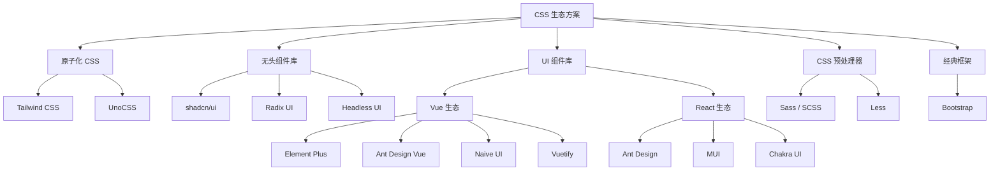
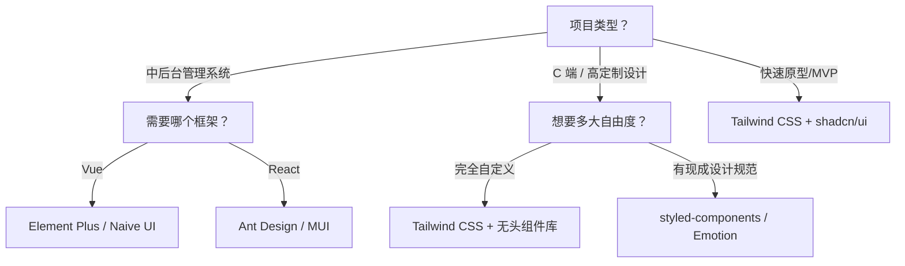

# 常见 CSS 框架与方案对比 (CSS Frameworks & Solutions Comparison)

## 1. 解决什么问题？
> 快速了解市面主流 CSS 方案的定位与优劣，帮助项目技术选型

* **痛点**：框架/库太多，每个都试一遍成本太高，不知道哪个适合自己的项目
* **作用**：按类别梳理主流方案，提供选型决策参考

---

## 2. 方案分类全景图



---

## 3. 原子化 CSS (Utility-First CSS)

### 3.1 Tailwind CSS

> **一句话定位**：最流行的原子化 CSS 框架，用预定义的工具类直接在 HTML 中写样式。

```html
<!-- Tailwind 写法示例：一个商品卡片 -->
<div class="rounded-lg border border-gray-200 p-4 shadow-sm hover:shadow-md transition-shadow">
  
  <h3 class="mt-3 text-lg font-semibold text-gray-900">商品名称</h3>
  <p class="mt-1 text-sm text-gray-500">商品描述</p>
  <span class="mt-2 inline-block text-xl font-bold text-red-600">¥99.00</span>
</div>
```

**核心特点**：
- 工具类优先，几乎不写自定义 CSS
- 高度可配置（`tailwind.config.js`）
- Tree-shaking 只打包用到的类，生产体积很小
- 内置响应式（`md:flex`）、暗色模式（`dark:bg-gray-900`）、状态（`hover:`、`focus:`）

| 优点 | 缺点 |
|------|------|
| 开发速度极快，不用起类名 | HTML 类名冗长，可读性降低 |
| 设计一致性好（间距、颜色系统） | 需要学习大量类名 |
| 零运行时，性能优秀 | 不适合高度自定义设计（需扩展配置） |
| 生态成熟，插件丰富 | 团队需要统一约定 |

**适用场景**：快速开发、中后台、营销页面、配合无头组件库使用。

---

### 3.2 UnoCSS

> **一句话定位**：按需生成的原子化 CSS 引擎，Tailwind 的高性能替代。

**核心特点**：
- 即时按需生成，构建速度比 Tailwind 快 5~100 倍
- 兼容 Tailwind 语法（通过 preset）
- 支持属性模式（`<div text-lg font-bold>`）
- 图标集成（`<div i-carbon-sun>`）
- 纯 CSS 图标方案

| 优点 | 缺点 |
|------|------|
| 极致性能，HMR 几乎无延迟 | 社区生态不如 Tailwind 成熟 |
| 高度灵活，可自定义规则 | 文档和教程相对少 |
| 兼容多种语法风格 | 部分 IDE 插件支持不如 Tailwind |
| 内置图标方案 | 需要配置 preset 才能用 Tailwind 语法 |

**适用场景**：对构建性能要求高、Vue 项目（Anthony Fu 生态）、需要自定义原子化规则。

---

## 4. 无头组件库 (Headless UI Libraries)

"无头"意味着：**只提供逻辑和可访问性，不提供样式**，你完全自己控制外观。

### 4.1 shadcn/ui

> **一句话定位**：基于 Radix UI + Tailwind CSS 的高质量组件集合，代码直接复制到项目中。

**核心特点**：
- **不是 npm 依赖**，而是通过 CLI 将组件代码复制到你的项目
- 基于 Radix UI 的无障碍基础
- 默认用 Tailwind CSS 编写样式
- 组件代码完全可控，可随意修改
- 提供精美的默认主题

| 优点 | 缺点 |
|------|------|
| 完全拥有代码，自由度最高 | 仅支持 React（Vue 有社区移植版） |
| 设计质感出色，开箱好看 | 组件更新需要手动同步 |
| 无障碍性好（基于 Radix） | 依赖 Tailwind CSS |
| 无版本锁定，不怕破坏性更新 | 组件数量不如传统 UI 库全 |

**适用场景**：React 项目、追求设计质感、想要完全控制组件代码。

### 4.2 Radix UI

> **一句话定位**：专注于可访问性的底层无头组件库，shadcn/ui 的基础。

| 优点 | 缺点 |
|------|------|
| 无障碍性极佳（WAI-ARIA） | 仅支持 React |
| 底层 API 灵活 | 需要自己写全部样式 |
| 无样式侵入 | 学习曲线较陡 |

### 4.3 Headless UI

> **一句话定位**：Tailwind Labs 出品的无头组件库，同时支持 React 和 Vue。

| 优点 | 缺点 |
|------|------|
| 同时支持 React 和 Vue | 组件数量较少（约 10 个） |
| 与 Tailwind CSS 天然配合 | 不如 Radix 全面 |
| 官方维护，质量稳定 | 复杂组件可能需要额外补充 |

---

## 5. UI 组件库

### 5.1 Vue 生态

#### Element Plus

> **一句话定位**：Vue 3 最流行的中后台 UI 组件库，Element UI 的升级版。

| 优点 | 缺点 |
|------|------|
| 组件最全面（70+），中后台场景覆盖广 | 设计风格偏传统，C 端项目不太适合 |
| 中文文档完善，国内社区活跃 | 自定义主题不够灵活 |
| TypeScript 支持好 | 包体积较大 |
| 按需导入支持 | 部分组件存在性能问题（如大数据表格） |

#### Ant Design Vue

> **一句话定位**：Ant Design 的 Vue 版本，企业级设计规范。

| 优点 | 缺点 |
|------|------|
| 设计规范成熟（Ant Design 体系） | 与 React 版更新有延迟 |
| 组件丰富，覆盖面广 | 包体积较大 |
| 企业级项目首选 | 样式定制相对复杂 |

#### Naive UI

> **一句话定位**：全量 TypeScript 编写的 Vue 3 组件库，API 设计现代。

| 优点 | 缺点 |
|------|------|
| TypeScript 原生，类型推导完美 | 社区规模不如 Element Plus |
| 主题定制强大（CSS-in-JS 方案） | 学习曲线略高 |
| 设计清爽现代 | 部分组件成熟度不如老牌库 |
| 性能好，Tree-shaking 友好 | 文档示例可以更丰富 |

#### Vuetify

> **一句话定位**：Material Design 风格的 Vue 组件库。

| 优点 | 缺点 |
|------|------|
| 严格遵循 Material Design | 风格强烈，定制成本高 |
| 组件丰富，内置布局系统 | 包体积较大 |
| 文档详细 | 不适合非 Material 风格项目 |

---

### 5.2 React 生态

#### Ant Design (antd)

> **一句话定位**：蚂蚁集团出品的企业级 React UI 组件库，国内使用率最高。

| 优点 | 缺点 |
|------|------|
| 组件数量最多（60+），覆盖面极广 | 包体积大，需配置按需导入 |
| 设计规范完善，配套设计资源丰富 | 定制主题配置较复杂 |
| 中文文档优秀，社区庞大 | 默认风格偏"蚂蚁"，辨识度高 |
| 企业级场景经验丰富 | v5 切换 CSS-in-JS 后有一定运行时开销 |

#### MUI (Material UI)

> **一句话定位**：全球最流行的 React UI 库，基于 Material Design。

| 优点 | 缺点 |
|------|------|
| 全球使用量最大，社区活跃 | Material 风格强烈 |
| 高度可定制（Theme / sx prop） | 学习曲线较陡 |
| 文档详尽，示例丰富 | 包体积大 |
| 提供 Joy UI 等替代主题 | CSS-in-JS 方案有运行时开销 |

#### Chakra UI

> **一句话定位**：注重开发体验的 React UI 库，API 简洁优雅。

| 优点 | 缺点 |
|------|------|
| API 设计极简（Style Props） | 组件数量不如 antd / MUI |
| 主题定制方便 | 社区生态相对小 |
| 暗色模式一流支持 | 有一定运行时开销 |
| 无障碍性好 | 大型企业项目可能不够用 |

---

## 6. CSS 预处理器

### 6.1 Sass / SCSS

> **一句话定位**：最成熟的 CSS 预处理器，支持变量、嵌套、Mixin、继承。

```scss
// 变量
$primary: #3b82f6;
$radius: 8px;

// Mixin
@mixin flex-center {
  display: flex;
  justify-content: center;
  align-items: center;
}

.card {
  border-radius: $radius;

  // 嵌套
  &__title {
    font-size: 18px;
    color: $primary;
  }

  &:hover {
    box-shadow: 0 4px 12px rgba(0, 0, 0, 0.1);
  }
}
```

| 优点 | 缺点 |
|------|------|
| 功能强大（变量、嵌套、Mixin、循环） | 需要编译，增加构建步骤 |
| 生态成熟，兼容性好 | 原生 CSS 变量已覆盖部分能力 |
| SCSS 语法兼容普通 CSS | 大型项目中嵌套层级容易失控 |

### 6.2 Less

> **一句话定位**：轻量级 CSS 预处理器，Ant Design 生态默认使用。

| 优点 | 缺点 |
|------|------|
| 语法简单，学习成本低 | 功能不如 Sass 丰富 |
| Ant Design 生态默认方案 | 社区活跃度不如 Sass |
| 可在浏览器端编译 | 使用场景越来越窄 |

> **趋势**：随着原生 CSS 能力增强（变量、嵌套、容器查询），预处理器的必要性在降低。新项目建议优先考虑原生 CSS + PostCSS。

---

## 7. 经典 CSS 框架

### Bootstrap

> **一句话定位**：老牌全能型 CSS 框架，内置响应式栅格 + 组件样式 + JS 交互。

| 优点 | 缺点 |
|------|------|
| 历史最悠久，文档/教程极多 | 设计风格"Bootstrap 味"明显 |
| 内置完整栅格系统 | 定制需覆盖大量默认样式 |
| 不绑定框架，HTML 项目可用 | 体积较大（完整引入） |
| Bootstrap 5 已去除 jQuery 依赖 | 现代项目中逐渐被 Tailwind 取代 |

---

## 8. 总结：选型决策树



### 速查表

| 需求 | 推荐方案 |
|------|----------|
| 写样式最快 | Tailwind CSS |
| Vue 中后台 | Element Plus（通用）/ Naive UI（现代） |
| React 中后台 | Ant Design（国内）/ MUI（国际） |
| 高定制 React 项目 | shadcn/ui + Tailwind |
| 高定制 Vue 项目 | Headless UI + Tailwind / Naive UI |
| 设计系统 / 组件库 | styled-components / Emotion |
| 极致构建性能 | UnoCSS |
| 老项目维护 | Bootstrap / Less |

---

_本文档将持续更新，跟进 CSS 生态最新发展_
