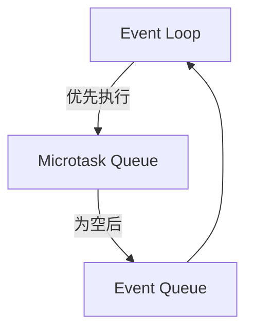
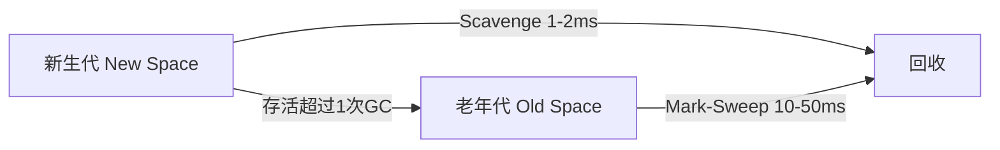

# Dart 高级特性与 Runtime 原理

> **结论先行**：Dart 不是 Flutter 的"配套脚本"，而是决定了 Flutter 渲染模型、状态管理和性能天花板的底层基石。真正掌握 Flutter，必须从 Dart 的运行时机制、内存模型和并发哲学开始。

---

## 1. 空安全：运行时的对象头契约

`String?` 和 `String` 在 Dart VM 中是不同的**对象头标记**，不是编译期语法糖。

| 类型 | 运行时表示 | 访问开销 |
|------|-----------|---------|
| `String` | 无 nullable tag | 直接解引用 |
| `String?` | 对象头含 tag 位 | 先验 tag，null 则抛 `TypeError` |

### 1.1 可空修饰符的位置决定语义

```dart
// 书架一定存在，但上面某些格子可以是空的
List<Widget?> mixedList = [Text('A'), null, Text('B')];

// 书架本身可能不存在，如果有则每格必须有书
List<Widget>? maybeList = null;
// maybeList.add(Text('C')); // ❌ 编译错误：书架可能不存在
```

**Flutter 源码中的体现**：

```dart
// framework.dart
abstract class RenderObject {
  RenderObject? get parent; // 可能未挂载，所以可空
}
```

### 1.2 `late`：开发者的初始化担保

`late` 不是把检查推迟到运行时，而是告诉编译器"我担保使用前一定赋值"。撒谎就抛 `LateInitializationError`。

```dart
class _MyPageState extends State<MyPage> {
  // 依赖 this，构造函数里无法初始化，用 late 推迟
  late final controller = AnimationController(vsync: this);

  // 运行时才注入（如测试 mock）
  late DatabaseService db;

  @override
  void initState() {
    db = context.read<DatabaseService>();
  }
}
```

**坑点**：`late final` 只执行一次初始化。如果初始化函数抛异常，再次访问仍会抛异常，不会重试——因为"已初始化"的标志位已被置位。

### 1.3 空断言 `!` 的运行时开销

```dart
String? maybe;
String sure = maybe!; // 运行时检查，null 则抛 TypeError

// 空感知运算符：?. 和 ??
int? length = maybe?.length;  // null 则整个表达式为 null
String display = maybe ?? 'default'; // null 则取右侧
```

`?.` 在 AOT 编译后只有一条**条件跳转指令**，开销极低。但 `!` 是运行时埋雷——Release 包一样会崩。

---

## 2. Mixin：Flutter 框架的组合胶水

Flutter 源码中 `State` 的定义：

```dart
abstract class State<T extends StatefulWidget> extends State<T>
  with DiagnosticableTreeMixin, WidgetsBindingObserver { ... }
```

**为什么不用继承？** 继承会把所有能力塞进一个 Base 类，90% 的 State 不需要生命周期监听，但必须承担这个重量。Mixin 像**手机壳**——按需组合，不修改本体。

### 2.1 `on` 关键字限定混入前提

```dart
// 只有 State 能用这个 Mixin，因为它内部依赖 State 的方法
mixin TickerProviderStateMixin on State {
  Ticker createTicker(TickerCallback onTick) => Ticker(onTick);
}
```

### 2.2 手写一个简化版 ChangeNotifier

```dart
mixin MyChangeNotifier {
  final List<VoidCallback> _listeners = [];

  void addListener(VoidCallback l) => _listeners.add(l);

  void notifyListeners() {
    // 复制列表避免回调里移除 listener 导致并发修改异常
    for (final l in List.of(_listeners)) {
      l();
    }
  }

  void dispose() => _listeners.clear();
}

class Counter with MyChangeNotifier {
  int _count = 0;
  int get count => _count;

  void increment() {
    _count++;
    notifyListeners(); // 触发所有订阅者重建
  }
}
```

**面试关联**：Mixin 和多重继承的区别？Mixin 是**线性化混入**，顺序明确（`with A, B` 就是先 A 后 B），不存在菱形继承问题，且可以持有字段。

---

## 3. Extension：零运行时开销的"假装继承"

Extension 在编译期**静态派发**，不创建包装对象，不修改 vtable。

```dart
extension StringExt on String {
  String capitalize() {
    if (isEmpty) return this;
    return '${this[0].toUpperCase()}${substring(1)}';
  }
}

void main() {
  print('flutter'.capitalize()); // 编译器转成 StringExt.capitalize('flutter')
}
```

**为什么优于工具类？** 链式调用不破坏表达流：

```dart
// ❌ 工具类打断链式
String result = StringUtils.capitalize(StringUtils.trim(input));

// ✅ Extension 像原生方法
String result = input.trim().capitalize();
```

**陷阱**：两个 Extension 给同一类型加了同名方法，调用时编译器无法决议，必须显式指定 `A('test').log()`。

---

## 4. Extension Type：零成本抽象（Dart 3.0+）

Extension Type 不是 Wrapper，编译后内存布局和原始类型**一模一样**，只是编译器在类型检查时把它们当不同类型。

```dart
extension type Pixels(int value) {}
extension type Points(int value) {}

void draw(Pixels width) {}

void main() {
  draw(Pixels(100));    // ✅
  // draw(Points(100)); // ❌ 编译错误：不同类型
}
```

**Flutter 场景**：防止单位灾难。

```dart
// 不用 Extension Type：传错参数编译器也发现不了
void layout(double width, double opacity);
layout(100.0, 50.0); // 把像素传成了百分比，静默错误

// ✅ 使用 Extension Type：编译器做单位校验
extension type Pixels(double v) implements double {}
extension type Percentage(double v) implements double {}

void layout({required Pixels width, required Percentage opacity});
layout(width: Pixels(100), opacity: Percentage(0.5)); // 类型安全
```

---

## 5. 异步模型：Event Loop 两条队列

Dart 代码跑在单个事件循环上，但这个循环分两条队列：



| 队列 | 典型来源 | 特点 |
|------|---------|------|
| Microtask | `Future.microtask`、`then` 回调 | 优先级高，阻塞帧 |
| Event | `Future`、`Timer`、I/O 完成 | 优先级低，允许穿插帧 |

### 5.1 执行时序验证

```dart
void main() {
  print('1: start');

  Future.microtask(() => print('2: microtask'));
  Future(() => print('3: event'));
  Future.sync(() => print('4: sync future'));

  print('5: end');
}

// 输出：1 → 4 → 5 → 2 → 3
```

**为什么 4 在 5 前面？** `Future.sync` 是同步执行，立刻打印。`microtask` 和 `event` 都是异步，要等当前同步代码跑完。

### 5.2 `async/await` 不是阻塞

```dart
Future<void> fetch() async {
  print('A');
  await Future.delayed(Duration(seconds: 1));
  print('B'); // 这行被编译器注册为回调，等 1 秒后推进 Event Queue
}
```

**关键点**：`await` 是**让出执行权**，不是阻塞线程。当前函数暂停，Event Loop 继续处理其他任务，等 Future 完成后再回来执行后续代码。

### 5.3 为什么 `then` 嵌套可能掉帧？

```dart
// ❌ 危险：每层 then 都推迟一次帧
fetchData()
  .then((_) => heavy1()) // 进 Event Queue
  .then((_) => heavy2()) // 再进 Event Queue
  .then((_) => heavy3()); // 再进 Event Queue

// ✅ 正确：一个 await 里顺序做完
await fetchData();
heavy1();
heavy2();
heavy3();
```

每层 `.then` 意味着代码至少**推迟一帧**执行。三层 then 赶上 VSync 前，可能连续跳过 3 帧（约 50ms 卡顿）。

---

## 6. Stream：发布-订阅与内存泄漏

Stream 是 Dart 的响应式基石，但 `StreamController` 不 `close()`，订阅者会永远被持有。

```dart
class DataBloc {
  final _controller = StreamController<List<Item>>();
  Stream<List<Item>> get items => _controller.stream;

  void load() async {
    _controller.add(await fetchItems());
  }

  void dispose() {
    _controller.close(); // 必须调用，否则 listener 泄漏
  }
}
```

| 类型 | 特点 | 适用场景 |
|------|------|---------|
| Single-Subscription | 只能 listen 一次 | HTTP 请求 |
| Broadcast | 允许多个订阅者 | UI 事件、点击、滚动 |

`TextEditingController` 内部就是 Broadcast Stream。

---

## 7. Isolate：独立的 Dart VM 沙盒

Isolate **不共享内存**，只能通过 `SendPort`/`ReceivePort` 传递**可序列化数据**。

```dart
import 'dart:isolate';

void main() async {
  final port = ReceivePort();
  await Isolate.spawn(heavyTask, port.sendPort);
  final result = await port.first as int;
  print(result);
}

void heavyTask(SendPort sendPort) {
  int sum = 0;
  for (int i = 0; i < 100000000; i++) sum += i;
  sendPort.send(sum); // 只能传基本类型、List、Map
}
```

### 7.1 `compute()` 的封装原理

Flutter 提供的 `compute()` 是对 Isolate 的简化：创建 Isolate → 执行任务 → 返回结果 → **立刻销毁 Isolate**（避免常驻占内存）。

```dart
// 内部实现简写
Future<R> compute<Q, R>(callback, Q message) async {
  final port = ReceivePort();
  final isolate = await Isolate.spawn(_spawn, ...);
  final result = await port.first;
  isolate.kill(); // 用完即走，不常驻
  return result as R;
}
```

**高频面试点**：为什么 `compute` 不能传闭包？因为闭包可能捕获了主 Isolate 的内存引用，而新 Isolate 没有这些内存，无法还原上下文。

```dart
// ❌ 闭包捕获了主 Isolate 变量，无法传递
final data = fetchHugeData();
await compute(() => process(data), null);

// ✅ 只传可序列化数据
await compute(process, data.toJson());
```

---

## 8. 内存模型与 GC：为什么 App 会突然卡顿？

Dart 使用**分代垃圾回收**：



| 代 | 算法 | 停顿时间 | 影响 |
|----|------|---------|------|
| 新生代 | Scavenge（复制算法） | ~1-2ms | 几乎无感知 |
| 老年代 | Mark-Sweep（标记清除） | ~10-50ms | 可能掉帧 |

**Dart GC 是单线程 Stop-The-World**，触发时 UI 线程暂停。高频创建短生命对象会导致 GC 抖动。

### 8.1 高频 GC 陷阱

```dart
// ❌ build 里每帧创建 100 个对象
Widget build(BuildContext context) {
  final items = List.generate(100, (i) => Item(i));
  return Column(children: items);
}

// ✅ 缓存到 State，只在初始化时创建
class _MyState extends State<MyPage> {
  late final items = List.generate(100, (i) => Item(i));

  @override
  Widget build(BuildContext context) => Column(children: items);
}
```

| 代码模式 | 后果 |
|---------|------|
| `List.generate` / `map().toList()` 在 build 里 | 每帧分配 O(N) 内存 |
| 闭包捕获大量局部变量 | 闭包对象 + 捕获变量都进堆 |
| String 拼接不用 `StringBuffer` | 大量中间 String 对象 |

### 8.2 `WeakReference`：不阻止 GC 的引用

```dart
class ImageCache {
  final _weakMap = <String, WeakReference<Image>>{};

  void put(String key, Image image) {
    _weakMap[key] = WeakReference(image);
    // 当 image 不再被其他地方强引用时，GC 会自动回收，
    // WeakReference.target 变为 null，不会阻止回收
  }
}
```

Flutter 的 `ImageCache` 使用类似机制，内存紧张时自动释放不在屏幕上的图片。

---

## 9. 面试自检题

### Q1: Dart 是单线程的，为什么不会阻塞 UI？

非阻塞 I/O（网络、文件）通过底层 C++ 线程池处理，结果通过 Port 送回 Event Queue。CPU 密集型任务需要手动创建 Isolate。

### Q2: `const` 和 `final` 的本质区别？

`const` 是编译期常量，存储在常量池，多次使用是同一对象（`identical`）。`final` 是运行期常量，只能赋值一次，但值运行时确定。

```dart
final a = DateTime.now(); // ✅
const b = DateTime.now(); // ❌ 编译错误
```

### Q3: Mixin 和多重继承有什么区别？

Mixin 是线性化混入，顺序明确，不存在菱形继承，可以持有字段。多重继承会产生冲突和层级混乱。

### Q4: `Future` 和 `Stream` 的本质区别？

Future 代表一次性异步结果（0 或 1 个值），内部是状态机。Stream 代表持续异步事件序列（0 到 N 个值），内部是发布-订阅系统。

### Q5: 什么情况下必须用 Isolate？

1. CPU 密集型（大量计算、JSON 解析、图片编解码）
2. 可能耗时 > 16ms（一帧时间）
3. 需要避免阻塞 Microtask Queue

普通 HTTP 请求不需要 Isolate，`dart:io` 的 socket 已经是底层异步 I/O。

---

## 10. 进阶阅读清单

| 主题 | 源码/命令 | 阅读重点 |
|------|----------|---------|
| Event Loop | `dart:async/schedule_microtask.dart` | `scheduleMicrotask` 的实现 |
| Future | `dart:async/future_impl.dart` | `_Future` 状态机转换 |
| Stream | `dart:async/stream_controller.dart` | 订阅管理 |
| GC 观察 | `flutter run --verbose-gc` | Scavenge / Mark-Sweep 频率 |
| Isolate | `dart:isolate/isolate.dart` | `Isolate.spawn` 底层调用 |
