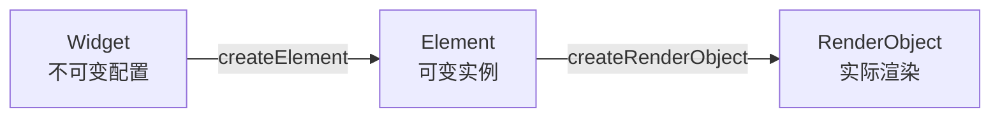
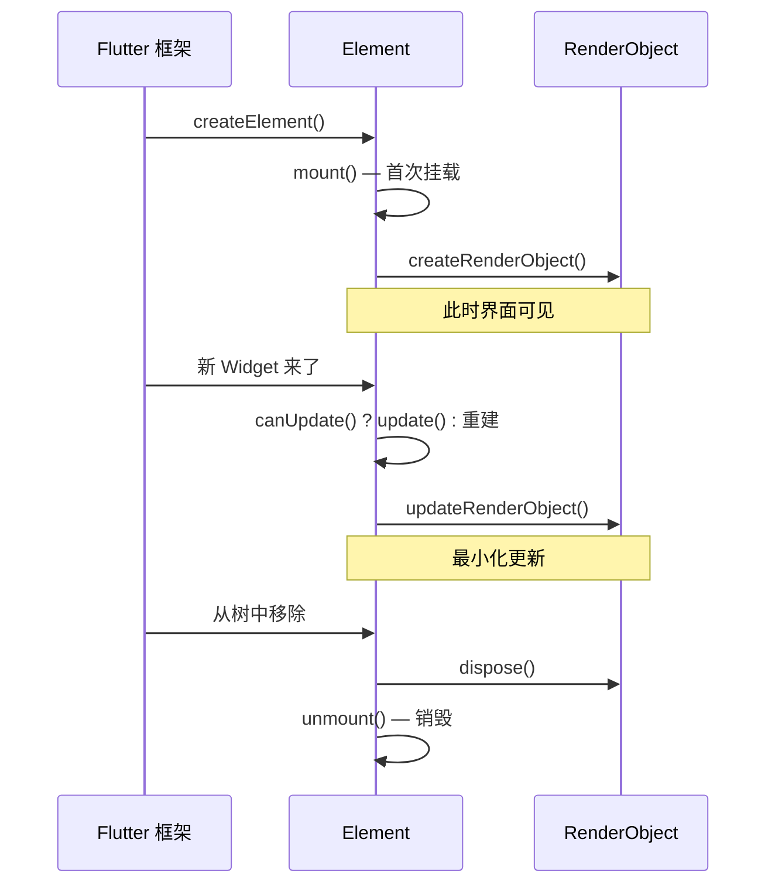
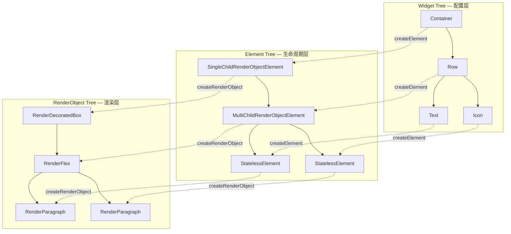
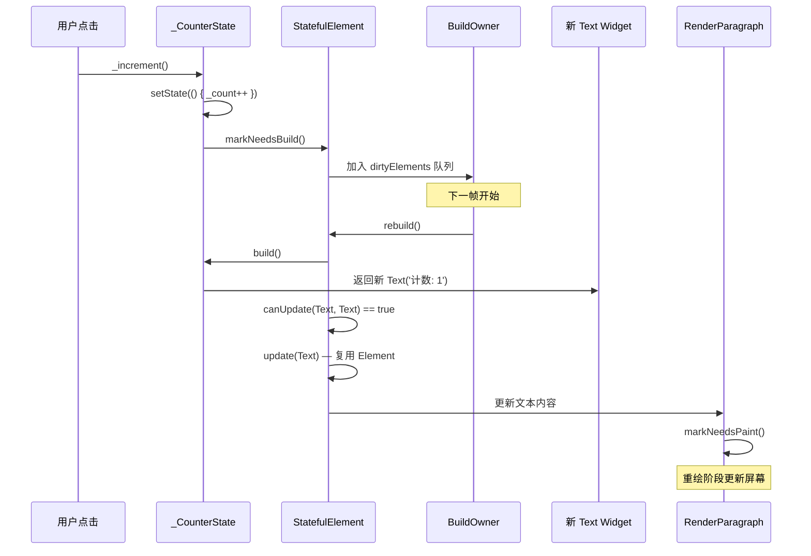
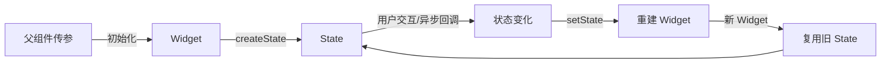
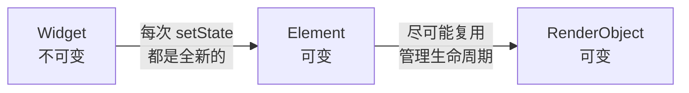

# Flutter Widget 原理篇

## 三棵树：Flutter 渲染的核心架构

### 生活类比：装修房子

想象你要装修一套房子：

- **设计图纸（Widget Tree）**：描述"客厅要放沙发、卧室要刷蓝色"——纯配置，随时可以重新画
- **施工队台账（Element Tree）**：记录哪个工人负责哪个房间、工期怎么安排——有生命周期的管理实体
- **实际装修（RenderObject Tree）**：墙刷了什么颜色、家具摆在哪儿——真正呈现在你眼前的东西

每次你想换个风格，设计师拿出**新图纸**，施工队对照新图纸和旧台账，判断"墙要重刷但地板不用动"，然后让工人执行**最小化改动**。

---

### 第一棵树：Widget Tree（配置层）

```dart
class MyApp extends StatelessWidget {
  @override
  Widget build(BuildContext context) {
    return Container(           // Widget
      child: Row(               // Widget
        children: [
          Text('Hello'),        // Widget
          Icon(Icons.star),     // Widget
        ],
      ),
    );
  }
}
```

**Widget 的核心特征**：

| 特性 | 说明 |
|------|------|
| **不可变（Immutable）** | 所有字段都是 `final`，创建后不能修改 |
| **轻量级** | 只是一个配置对象，创建成本极低 |
| **频繁重建** | 每次 `setState()` 都会生成全新的 Widget 树 |
| **不负责渲染** | 只描述"应该长什么样"，不直接操作屏幕 |

**Widget 的内存开销有多小？**

```dart
// 一个典型的 Widget 只有几个字段
class Text extends Widget {
  final String data;        // 文本内容
  final TextStyle? style;   // 样式配置
  // ... 其他配置
}
```

Widget 对象通常只有几十到几百字节。Flutter 鼓励你**大胆创建、频繁重建**——这不是性能问题，而是设计哲学。

---

### 第二棵树：Element Tree（生命周期层）

Element 是 Widget 的**实例化结果**，是连接 Widget 和 RenderObject 的桥梁。



**Element 的核心职责**：

1. **持有可变状态**：`State` 对象实际挂在 `StatefulElement` 上
2. **管理生命周期**：`mount` → `update` → `unmount`
3. **决定复用策略**：新 Widget 来了，是复用旧 Element 还是创建新的？

```dart
// Element 的核心方法（简化版）
abstract class Element {
  Widget get widget;                    // 关联的当前 Widget
  RenderObject? get renderObject;       // 关联的渲染对象

  void mount(Element? parent, dynamic newSlot);   // 首次挂载
  void update(covariant Widget newWidget);        // Widget 更新时
  void unmount();                                 // 从树中移除
}
```

**Element 的生命周期**：



---

### 第三棵树：RenderObject Tree（渲染层）

RenderObject 是真正负责**布局（Layout）**和**绘制（Paint）**的对象。

```dart
// RenderObject 的核心职责
abstract class RenderObject {
  void performLayout();     // 计算尺寸和位置
  void paint(PaintingContext context, Offset offset);  // 绘制到屏幕
  bool hitTest(BoxHitTestResult result, { required Offset position });  // 命中测试
}
```

**RenderObject 的特征**：

| 特性 | 说明 |
|------|------|
| **重量级** | 持有大量渲染状态（尺寸、位置、图层等） |
| **长生命周期** | 尽可能复用，避免频繁创建销毁 |
| **直接操作 GPU** | 最终生成绘制指令，提交给 Skia/Impeller |
| **可变** | 布局属性可以动态修改 |

**三棵树的完整关系**：



---

### 更新流程：三棵树如何协作

当 `setState()` 被调用时，发生了什么？

```dart
class Counter extends StatefulWidget {
  @override
  State<Counter> createState() => _CounterState();
}

class _CounterState extends State<Counter> {
  int _count = 0;

  void _increment() {
    setState(() {
      _count++;
    });
  }

  @override
  Widget build(BuildContext context) {
    return Text('计数: $_count');  // 新 Widget 树
  }
}
```

**完整更新流程**：



**关键点**：Widget 虽然全新创建，但 **Element 和 RenderObject 被复用了**！

这是 Flutter 高性能的核心秘密：
- Widget 层随意重建（对象很小）
- Element 层智能 diff（决定复用策略）
- RenderObject 层最小化更新（避免重复布局绘制）

---

## Widget 设计理念：为什么这样设计？

### 问题一：为什么 Widget 必须是不可变的？

**反直觉的设计**：在 Flutter 中，你"修改"一个 Widget 的唯一方式是**创建一个新的**。

```dart
// ❌ 如果 Widget 可变，你会想这样写
final text = Text('Hello');
text.data = 'World';  // 不行！data 是 final 的

// ✅ Flutter 要求这样
text = Text('World');  // 创建新对象
```

**设计原因**：

#### 1. 声明式 UI 的基石

```
命令式：textView.text = "A" → textView.text = "B" → textView.text = "C"
声明式：UI = f(State)，给定状态就有确定的 UI
```

不可变性让 "UI = f(State)" 成为数学意义上的**纯函数**：相同的输入永远产生相同的输出。这让代码更容易理解、测试和调试。

#### 2. 简单的 diff 算法

```dart
// Framework 判断 Widget 是否可以复用 Element
static bool canUpdate(Widget oldWidget, Widget newWidget) {
  return oldWidget.runtimeType == newWidget.runtimeType
      && oldWidget.key == newWidget.key;
}
```

只需要比较**运行时类型**和**Key**，不需要深度比较所有属性。如果 Widget 是可变的，框架就不知道"这个 Widget 变了没有"，需要逐字段对比，复杂度大增。

#### 3. 避免隐式副作用

```dart
// 如果 Widget 可变，这会是灾难
Widget build(BuildContext context) {
  final container = Container(color: Colors.red);
  if (someCondition) {
    container.color = Colors.blue;  // 副作用！
  }
  return container;
}
```

不可变性杜绝了这类问题：你不可能"不小心改了一个 Widget"。

#### 4. 支持 const 优化

```dart
// const Widget 在编译期就确定了，运行时不会重建
const Text('固定文本')
```

const 构造的前提是对象不可变，这让框架在编译期就能做大量优化。

---

### 问题二：为什么 StatefulWidget 要拆成 Widget 和 State？

这是一个让初学者困惑的设计：管理状态的是 `State`，但触发重建的却是 `StatefulWidget`。

```dart
class Counter extends StatefulWidget {    // ← 不可变的配置
  @override
  State<Counter> createState() => _CounterState();
}

class _CounterState extends State<Counter> {  // ← 可变的状态持有者
  int _count = 0;

  @override
  Widget build(BuildContext context) {
    return Text('$_count');
  }
}
```

**为什么要这样拆分？**

#### 1. 配置与状态分离

| | Widget | State |
|--|--------|-------|
| **性质** | 不可变配置 | 可变状态 |
| **生命周期** | 每次重建都是新的 | 长期存活，跨重建保留 |
| **职责** | 父组件传什么参数进来 | 内部状态怎么变化 |



父组件传了新参数 → Widget 变了 → 但 State 还是原来的，内部数据不会丢失。

#### 2. 允许框架"偷梁换柱"

```dart
// 假设父组件这样使用 Counter
Counter(key: ValueKey(1), initialValue: 0)

// 之后变成
Counter(key: ValueKey(1), initialValue: 100)
```

由于 Key 相同，Flutter 会：
1. **复用旧的 `_CounterState`**（用户当前计数不会丢失）
2. **更新 `widget` 引用**指向新的 Widget（可以通过 `widget.initialValue` 访问新参数）

如果 State 在 Widget 里面，这种复用就不可能了。

#### 3. 生命周期管理

```dart
class _CounterState extends State<Counter> {
  @override
  void initState() {
    super.initState();
    // 初始化：订阅、开定时器、请求数据
  }

  @override
  void didUpdateWidget(Counter oldWidget) {
    super.didUpdateWidget(oldWidget);
    // Widget 变了但 State 复用了：对比新旧参数，决定要不要刷新
  }

  @override
  void dispose() {
    // 清理：取消订阅、关定时器、释放资源
    super.dispose();
  }
}
```

State 有完整的生命周期回调，而 Widget 没有——Widget 太容易被销毁了。

---

### 问题三：为什么需要 Element 作为中间层？

既然 Widget 描述配置、RenderObject 负责渲染，为什么不能直接 Widget → RenderObject？

**答案：Element 解决了"不可变配置"和"可变实体"之间的矛盾。**



#### 1. Element 是可变的"粘合剂"

Widget 是不可变的，RenderObject 是昂贵的，中间需要一层可变的、轻量的对象来：
- 决定"新 Widget 能不能匹配到我"
- 持有变化中的状态（比如动画进度）
- 管理子树的 Element 集合

#### 2. Element 类型区分了渲染策略

```dart
// 不同的 Widget 创建不同类型的 Element
// 对应不同的子树管理方式

ComponentElement          // 组合型：管理 build 出来的子树
├── StatelessElement      // StatelessWidget 的 Element
└── StatefulElement       // StatefulWidget 的 Element，持有 State

RenderObjectElement       // 渲染型：管理 RenderObject
├── SingleChildRenderObjectElement   // 单孩子：Container、Padding
├── MultiChildRenderObjectElement    // 多孩子：Row、Column
└── LeafRenderObjectElement          // 叶子节点：Text、Image
```

#### 3. Element 支持 GlobalKey 的跨树复用

```dart
// GlobalKey 让 Element 可以在整棵树中唯一标识
final GlobalKey<_MyWidgetState> key = GlobalKey();

// 甚至可以跨路由复用！
Navigator.push(context, MaterialPageRoute(
  builder: (_) => MyWidget(key: key),  // 复用同一个 Element/State
));
```

没有 Element 层，这种精确的生命周期控制和跨树复用就无法实现。

---

### 问题四：为什么 build() 返回 Widget 而不是 RenderObject？

这是声明式 UI 和命令式 UI 最根本的区别。

```dart
// Flutter 的声明式方式
Widget build(BuildContext context) {
  return Container(           // 只声明配置
    child: Text('Hello'),
  );
}
```

如果直接操作 RenderObject：

```dart
// 假设的"命令式"方式（反模式）
RenderObject build() {
  final renderBox = RenderDecoratedBox();
  renderBox.child = RenderParagraph();
  return renderBox;
}
```

**为什么返回 Widget 更好？**

#### 1. 配置与渲染解耦

Widget 层只关心"是什么"，RenderObject 层只关心"怎么画"。开发者写 Widget，框架负责翻译成 RenderObject。这让框架可以在中间做大量优化：
- 合并相邻的 RenderObject
- 跳过不需要重绘的子树
- 复用没有变化的 RenderObject

#### 2. 便于框架做 diff

```dart
// 新旧 Widget 树对比很简单
// 因为 Widget 轻量且不可变
oldWidget.runtimeType == newWidget.runtimeType
```

如果直接操作 RenderObject，diff 会变得极其复杂——RenderObject 持有大量可变状态，难以判断"什么变了"。

#### 3. 支持平台抽象

```dart
// 同样的 Widget 代码
Text('Hello')

// 在不同平台生成不同的 RenderObject
// Android/iOS: 用 Skia/Impeller 绘制
// Web: 可以映射成 HTML 元素
```

Widget 是平台无关的配置层，RenderObject 可以针对不同平台有不同的实现。

---

## 核心原理总结

### 设计哲学一览

| 设计决策 | 解决的问题 |
|----------|-----------|
| **Widget 不可变** | 声明式 UI、简单 diff、无副作用、支持 const |
| **Widget / State 分离** | 配置与状态解耦、支持 State 复用、生命周期管理 |
| **引入 Element 层** | 连接不可变 Widget 和可变 RenderObject、管理复用策略 |
| **build 返回 Widget** | 配置与渲染解耦、便于框架优化、支持平台抽象 |

### 性能公式

```
高频操作（Widget 创建）→ 必须极轻量
中频操作（Element 更新）→ 智能 diff 决定复用
低频操作（RenderObject 变动）→ 最小化布局/重绘
```

这就是三棵树分工的本质：**把不同频率的操作分配到不同成本的层级上。**

### 面试常问

**Q: 为什么 setState() 后 Widget 重建了但 State 没丢？**
A: `setState()` 标记 Element 为 dirty，下一帧调用 `State.build()` 生成新 Widget。框架通过 `canUpdate()` 判断新 Widget 可以复用旧 Element，因此 State 对象继续存活。

**Q: Key 的作用是什么？**
A: Key 是 Widget 的身份标识，让框架能在子列表重新排序时正确识别"这是同一个 Widget"，从而复用对应的 Element 和 State。没有 Key，框架只能按位置对比，导致状态错位。

**Q: 为什么动画很流畅但 Widget 在疯狂重建？**
A: 动画更新的是 RenderObject 的属性（如 `offset`、`opacity`），不一定触发 Widget 重建。即使 Widget 重建，Element 和 RenderObject 大概率被复用，真正的布局/重绘开销很小。

---

## 下一步

- 学习 **性能优化篇**：深入布局约束、重绘边界、RepaintBoundary 与 RelayoutBoundary
