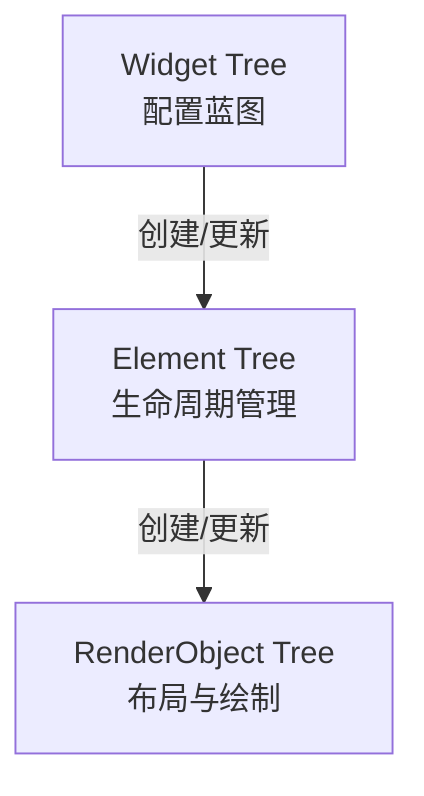
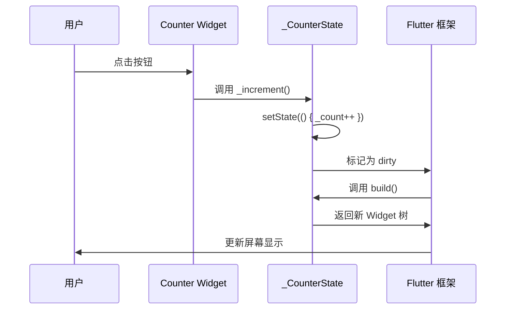

# Flutter Widget 基础使用篇

## 技术演进：从命令式到声明式的革命

### 历史痛点
在传统 Android/iOS 开发中，UI 更新是命令式的：
- **Android**：`textView.setText("新文本")` - 手动操作 View 对象
- **iOS**：`label.text = "新文本"` - 直接修改 UI 属性

这导致的问题：
1. **状态与 UI 分离**：需要手动同步数据和界面
2. **代码分散**：创建、更新、销毁逻辑散落各处
3. **难以追踪**：不知道 UI 当前状态是如何形成的

### Flutter 的解决方案
**声明式 UI**：UI = f(State)
- 不再"命令"UI 如何变化
- 而是"声明"UI 应该是什么样子
- 状态改变时，框架自动重建 UI

```dart
// 命令式（传统方式）
button.onClick(() {
  counter++;
  textView.setText(counter.toString()); // 手动更新
});

// 声明式（Flutter 方式）
Text('$counter') // 状态变化时自动重建
```

---

## 核心概念：Widget 是什么？

### 生活类比
**Widget 就像建筑蓝图**：
- 🏗️ **蓝图（Widget）**：描述房子应该长什么样
- 🏠 **实体房子（Element）**：根据蓝图建造的真实建筑
- 🎨 **装修效果（RenderObject）**：房子的实际渲染效果

每次状态变化，Flutter 不是"修理"旧房子，而是拿新蓝图重建。

### Widget 在 Flutter 中的地位



**Widget 树特点**：
- **不可变（Immutable）**：每次重建都是新对象
- **轻量级**：只是配置信息，创建成本极低
- **短生命周期**：随时可能被丢弃重建

---

## Widget 分类体系

### 1. 按功能分类

| 类型 | 作用 | 代表 Widget |
|------|------|-------------|
| **结构型** | 布局容器 | `Container`, `Row`, `Column`, `Stack` |
| **内容型** | 展示内容 | `Text`, `Image`, `Icon` |
| **交互型** | 响应用户操作 | `GestureDetector`, `InkWell`, `Button` |
| **状态型** | 管理状态 | `StatefulWidget`, `InheritedWidget` |
| **功能型** | 提供特定能力 | `Hero`, `AnimatedBuilder`, `FutureBuilder` |

### 2. 按状态分类

#### StatelessWidget（无状态组件）
**生活类比**：像一张照片，拍完就不会变了

```dart
class WelcomeCard extends StatelessWidget {
  final String userName;

  const WelcomeCard({required this.userName, super.key});

  @override
  Widget build(BuildContext context) {
    // 只依赖构造参数，不会自己改变
    return Card(
      child: Text('欢迎, $userName'),
    );
  }
}
```

**使用场景**：
- 纯展示内容（不需要交互）
- 配置型组件（只接收参数）
- 性能敏感场景（无状态更轻量）

#### StatefulWidget（有状态组件）
**生活类比**：像一个活人，会根据环境变化做出反应

```dart
class Counter extends StatefulWidget {
  const Counter({super.key});

  @override
  State<Counter> createState() => _CounterState();
}

class _CounterState extends State<Counter> {
  int _count = 0; // 内部状态

  void _increment() {
    setState(() { // 触发重建
      _count++;
    });
  }

  @override
  Widget build(BuildContext context) {
    return Column(
      children: [
        Text('计数: $_count'),
        ElevatedButton(
          onPressed: _increment,
          child: const Text('增加'),
        ),
      ],
    );
  }
}
```

**状态流转图**：



---

## 常用 Widget 详解

### 布局类 Widget

#### 1. Container（万能容器）
**作用**：集装饰、定位、尺寸约束于一体的瑞士军刀

```dart
Container(
  // 尺寸约束
  width: 200,
  height: 100,

  // 内边距
  padding: const EdgeInsets.all(16),

  // 外边距
  margin: const EdgeInsets.symmetric(vertical: 8),

  // 装饰（背景、边框、圆角）
  decoration: BoxDecoration(
    color: Colors.blue,
    borderRadius: BorderRadius.circular(12),
    boxShadow: [
      BoxShadow(
        color: Colors.black.withOpacity(0.1),
        blurRadius: 8,
        offset: const Offset(0, 2),
      ),
    ],
  ),

  // 子组件
  child: const Text('Hello'),
)
```

**布局法则体现**：
- **约束向下**：Container 接收父级约束，传递给 child
- **尺寸向上**：child 计算尺寸后，Container 加上 padding 返回
- **父级定位**：Container 的父级决定它在屏幕的位置

#### 2. Row & Column（线性布局）
**作用**：水平/垂直排列子组件

```dart
// 水平布局
Row(
  mainAxisAlignment: MainAxisAlignment.spaceBetween, // 主轴对齐
  crossAxisAlignment: CrossAxisAlignment.center,     // 交叉轴对齐
  children: [
    Icon(Icons.star),
    Text('评分'),
    Text('4.5'),
  ],
)

// 垂直布局
Column(
  mainAxisSize: MainAxisSize.min, // 最小化主轴尺寸
  children: [
    Text('标题'),
    Text('副标题'),
  ],
)
```

**避坑指南**：
```dart
// ❌ 错误：垂直列表嵌套无边界
Column(
  children: [
    ListView(...), // 报错：垂直方向无限高度
  ],
)

// ✅ 正确：限制高度
Column(
  children: [
    Expanded(
      child: ListView(...), // Expanded 提供约束
    ),
  ],
)
```

#### 3. Stack（层叠布局）
**作用**：子组件可以重叠摆放

```dart
Stack(
  children: [
    // 底层：背景图
    Image.network('https://example.com/bg.jpg'),

    // 中层：半透明遮罩
    Container(color: Colors.black.withOpacity(0.3)),

    // 顶层：定位文字
    Positioned(
      bottom: 16,
      left: 16,
      child: Text(
        '标题',
        style: TextStyle(color: Colors.white),
      ),
    ),
  ],
)
```

#### 4. Flex & Expanded（弹性布局）
**作用**：按比例分配空间

```dart
Row(
  children: [
    Expanded(
      flex: 2, // 占 2 份
      child: Container(color: Colors.red),
    ),
    Expanded(
      flex: 1, // 占 1 份
      child: Container(color: Colors.blue),
    ),
  ],
)
```

---

### 内容展示类 Widget

#### 1. Text（文本）
```dart
Text(
  '这是一段文本',
  style: TextStyle(
    fontSize: 16,
    fontWeight: FontWeight.bold,
    color: Colors.black87,
    height: 1.5, // 行高
  ),
  maxLines: 2,
  overflow: TextOverflow.ellipsis, // 超出显示省略号
)

// 富文本
Text.rich(
  TextSpan(
    text: '普通文本 ',
    children: [
      TextSpan(
        text: '高亮文本',
        style: TextStyle(color: Colors.red),
      ),
    ],
  ),
)
```

#### 2. Image（图片）
```dart
// 网络图片
Image.network(
  'https://example.com/image.jpg',
  fit: BoxFit.cover, // 填充模式
  loadingBuilder: (context, child, loadingProgress) {
    if (loadingProgress == null) return child;
    return CircularProgressIndicator(); // 加载中
  },
  errorBuilder: (context, error, stackTrace) {
    return Icon(Icons.error); // 加载失败
  },
)

// 本地资源图片
Image.asset('assets/logo.png')

// 内存图片
Image.memory(bytes)
```

**性能优化**：
```dart
// 使用 RepaintBoundary 隔离重绘
RepaintBoundary(
  child: Image.network('...'),
)

// 缓存网络图片（使用 cached_network_image 包）
CachedNetworkImage(
  imageUrl: 'https://example.com/image.jpg',
  placeholder: (context, url) => CircularProgressIndicator(),
  errorWidget: (context, url, error) => Icon(Icons.error),
)
```

#### 3. Icon（图标）
```dart
Icon(
  Icons.favorite,
  size: 24,
  color: Colors.red,
)

// 自定义图标字体
Icon(
  IconData(0xe800, fontFamily: 'CustomIcons'),
)
```

---

### 交互类 Widget

#### 1. GestureDetector（手势检测）
```dart
GestureDetector(
  onTap: () => print('单击'),
  onDoubleTap: () => print('双击'),
  onLongPress: () => print('长按'),
  onPanUpdate: (details) => print('拖动: ${details.delta}'),
  child: Container(
    width: 100,
    height: 100,
    color: Colors.blue,
  ),
)
```

#### 2. InkWell（水波纹点击效果）
```dart
InkWell(
  onTap: () {},
  borderRadius: BorderRadius.circular(8), // 圆角水波纹
  child: Padding(
    padding: const EdgeInsets.all(16),
    child: Text('点击我'),
  ),
)
```

**GestureDetector vs InkWell**：
- `GestureDetector`：纯手势识别，无视觉反馈
- `InkWell`：Material 风格，有水波纹效果

#### 3. Button 系列
```dart
// 凸起按钮
ElevatedButton(
  onPressed: () {},
  child: Text('提交'),
)

// 文本按钮
TextButton(
  onPressed: () {},
  child: Text('取消'),
)

// 轮廓按钮
OutlinedButton(
  onPressed: () {},
  child: Text('了解更多'),
)

// 图标按钮
IconButton(
  icon: Icon(Icons.add),
  onPressed: () {},
)
```

---

### 滚动类 Widget

#### 1. ListView（列表）
```dart
// 基础列表
ListView(
  children: [
    ListTile(title: Text('项目 1')),
    ListTile(title: Text('项目 2')),
  ],
)

// 构建器模式（性能优化）
ListView.builder(
  itemCount: 100,
  itemBuilder: (context, index) {
    return ListTile(title: Text('项目 $index'));
  },
)

// 分隔符列表
ListView.separated(
  itemCount: 100,
  itemBuilder: (context, index) => ListTile(title: Text('项目 $index')),
  separatorBuilder: (context, index) => Divider(),
)
```

#### 2. GridView（网格）
```dart
GridView.builder(
  gridDelegate: SliverGridDelegateWithFixedCrossAxisCount(
    crossAxisCount: 3, // 每行 3 个
    crossAxisSpacing: 8,
    mainAxisSpacing: 8,
  ),
  itemCount: 20,
  itemBuilder: (context, index) {
    return Container(
      color: Colors.blue,
      child: Center(child: Text('$index')),
    );
  },
)
```

#### 3. SingleChildScrollView（单子滚动）
```dart
SingleChildScrollView(
  child: Column(
    children: [
      // 长内容
    ],
  ),
)
```

**避坑指南**：
```dart
// ❌ 错误：嵌套滚动冲突
ListView(
  children: [
    ListView(...), // 内部 ListView 无法滚动
  ],
)

// ✅ 正确：使用 shrinkWrap
ListView(
  children: [
    ListView(
      shrinkWrap: true, // 适应内容高度
      physics: NeverScrollableScrollPhysics(), // 禁用滚动
      children: [...],
    ),
  ],
)
```

---

### 输入类 Widget

#### 1. TextField（文本输入）
```dart
TextField(
  controller: _controller, // 控制器
  decoration: InputDecoration(
    labelText: '用户名',
    hintText: '请输入用户名',
    prefixIcon: Icon(Icons.person),
    border: OutlineInputBorder(),
  ),
  keyboardType: TextInputType.emailAddress,
  obscureText: false, // 密码模式
  maxLength: 20,
  onChanged: (value) => print('输入: $value'),
  onSubmitted: (value) => print('提交: $value'),
)
```

#### 2. Checkbox & Switch
```dart
// 复选框
Checkbox(
  value: _checked,
  onChanged: (value) {
    setState(() => _checked = value!);
  },
)

// 开关
Switch(
  value: _enabled,
  onChanged: (value) {
    setState(() => _enabled = value);
  },
)
```

---

### 功能型 Widget

#### 1. FutureBuilder（异步数据）
```dart
FutureBuilder<String>(
  future: fetchData(), // 异步操作
  builder: (context, snapshot) {
    if (snapshot.connectionState == ConnectionState.waiting) {
      return CircularProgressIndicator(); // 加载中
    }

    if (snapshot.hasError) {
      return Text('错误: ${snapshot.error}'); // 错误
    }

    return Text('数据: ${snapshot.data}'); // 成功
  },
)
```

#### 2. StreamBuilder（流数据）
```dart
StreamBuilder<int>(
  stream: counterStream,
  initialData: 0,
  builder: (context, snapshot) {
    return Text('计数: ${snapshot.data}');
  },
)
```

#### 3. Hero（共享元素动画）
```dart
// 页面 A
Hero(
  tag: 'avatar',
  child: CircleAvatar(backgroundImage: NetworkImage('...')),
)

// 页面 B（相同 tag）
Hero(
  tag: 'avatar',
  child: Image.network('...'),
)
```

---

## 性能优化策略

### 1. 减少 Rebuild 范围

#### 使用 const 构造函数
```dart
// ❌ 每次都创建新对象
Widget build(BuildContext context) {
  return Text('固定文本');
}

// ✅ 编译时常量，不会重建
Widget build(BuildContext context) {
  return const Text('固定文本');
}
```

#### 提取子组件
```dart
// ❌ 整个页面重建
class MyPage extends StatefulWidget {
  @override
  State<MyPage> createState() => _MyPageState();
}

class _MyPageState extends State<MyPage> {
  int _counter = 0;

  @override
  Widget build(BuildContext context) {
    return Column(
      children: [
        Text('计数: $_counter'), // 需要更新
        ExpensiveWidget(),      // 不需要更新但被重建
      ],
    );
  }
}

// ✅ 只重建必要部分
class _MyPageState extends State<MyPage> {
  int _counter = 0;

  @override
  Widget build(BuildContext context) {
    return Column(
      children: [
        Text('计数: $_counter'),
        const _ExpensiveWidget(), // const 避免重建
      ],
    );
  }
}

class _ExpensiveWidget extends StatelessWidget {
  const _ExpensiveWidget();

  @override
  Widget build(BuildContext context) {
    return Container(/* 复杂内容 */);
  }
}
```

### 2. 使用 RepaintBoundary
```dart
// 隔离重绘区域
RepaintBoundary(
  child: AnimatedWidget(...), // 动画不影响其他区域
)
```

### 3. ListView 优化
```dart
ListView.builder(
  itemCount: 1000,
  // 预估高度，提升滚动性能
  itemExtent: 50,
  // 缓存区域
  cacheExtent: 100,
  itemBuilder: (context, index) {
    return ListTile(title: Text('项目 $index'));
  },
)
```

---

## 避坑 Checklist

### 常见错误及解决方案

| 错误 | 原因 | 解决方案 |
|------|------|----------|
| **Vertical viewport was given unbounded height** | Column 中嵌套 ListView | 使用 `Expanded` 或 `SizedBox` 限制高度 |
| **setState() called after dispose()** | 异步回调时组件已销毁 | 检查 `mounted` 属性 |
| **BuildContext 跨异步失效** | async 后 context 可能无效 | 在 async 前保存需要的值 |
| **RenderBox was not laid out** | 子组件未获得布局约束 | 检查父组件是否提供约束 |

#### BuildContext 跨异步问题
```dart
// ❌ 错误
Future<void> loadData() async {
  final data = await fetchData();
  Navigator.push(context, ...); // context 可能已失效
}

// ✅ 正确
Future<void> loadData() async {
  final data = await fetchData();
  if (!mounted) return; // 检查组件是否还存在
  Navigator.push(context, ...);
}
```

#### setState 后 dispose 问题
```dart
class _MyWidgetState extends State<MyWidget> {
  Timer? _timer;

  @override
  void initState() {
    super.initState();
    _timer = Timer.periodic(Duration(seconds: 1), (timer) {
      if (mounted) { // 检查是否已销毁
        setState(() {
          // 更新状态
        });
      }
    });
  }

  @override
  void dispose() {
    _timer?.cancel(); // 取消定时器
    super.dispose();
  }

  @override
  Widget build(BuildContext context) {
    return Container();
  }
}
```

---

## 多端差异警示

### iOS (Cupertino) 风格
```dart
// Material 风格（Android）
ElevatedButton(
  onPressed: () {},
  child: Text('按钮'),
)

// Cupertino 风格（iOS）
CupertinoButton(
  onPressed: () {},
  child: Text('按钮'),
)

// 自适应（根据平台自动选择）
import 'dart:io';

Widget buildButton() {
  if (Platform.isIOS) {
    return CupertinoButton(...);
  }
  return ElevatedButton(...);
}
```

### Web 平台差异
- **鼠标悬停**：Web 支持 `MouseRegion`，移动端无效
- **键盘快捷键**：Web 可用 `Shortcuts`，移动端无意义
- **滚动行为**：Web 默认使用浏览器滚动条

### Impeller 引擎（iOS）
Flutter 3.10+ 在 iOS 上默认使用 Impeller 引擎：
- **性能提升**：减少卡顿
- **兼容性**：部分自定义 Shader 可能不兼容

---

## 生态选型批判

### 常用第三方库评估

| 库名 | 用途 | 维护频率 | 平台兼容 | 替代成本 |
|------|------|----------|----------|----------|
| **cached_network_image** | 图片缓存 | ⭐⭐⭐⭐⭐ | 全平台 | 低（官方 Image 无缓存） |
| **flutter_svg** | SVG 支持 | ⭐⭐⭐⭐ | 全平台 | 中（可转 PNG） |
| **shimmer** | 骨架屏 | ⭐⭐⭐ | 全平台 | 低（可自己实现） |
| **flutter_staggered_grid_view** | 瀑布流 | ⭐⭐⭐ | 全平台 | 高（复杂布局） |

**选型建议**：
- 优先使用官方 Widget
- 第三方库需检查最近更新时间（6 个月内）
- 查看 GitHub Issues 数量和响应速度

---

## 面试通关（实战类）

### 1. 如何优化一个包含 1000 个图片的列表？
**答案**：
1. 使用 `ListView.builder` 而非 `ListView`（按需构建）
2. 图片使用 `cached_network_image` 缓存
3. 添加 `RepaintBoundary` 隔离每个 Item
4. 设置 `itemExtent` 固定高度
5. 使用 `AutomaticKeepAliveClientMixin` 保持滚动位置

### 2. StatelessWidget 和 StatefulWidget 如何选择？
**答案**：
- **StatelessWidget**：纯展示、配置型组件
- **StatefulWidget**：需要交互、动画、异步数据
- **原则**：能用 Stateless 就不用 Stateful（性能更好）

### 3. 为什么 ListView 嵌套 ListView 会报错？
**答案**：
- **原因**：内部 ListView 在垂直方向获得无限约束
- **解决**：
  - 使用 `shrinkWrap: true` + `physics: NeverScrollableScrollPhysics()`
  - 或使用 `CustomScrollView` + `SliverList`

### 4. 如何实现一个可展开/收起的列表项？
**答案**：
```dart
class ExpandableItem extends StatefulWidget {
  const ExpandableItem({super.key});

  @override
  State<ExpandableItem> createState() => _ExpandableItemState();
}

class _ExpandableItemState extends State<ExpandableItem> {
  bool _expanded = false;

  @override
  Widget build(BuildContext context) {
    return Column(
      children: [
        ListTile(
          title: const Text('标题'),
          trailing: Icon(_expanded ? Icons.expand_less : Icons.expand_more),
          onTap: () => setState(() => _expanded = !_expanded),
        ),
        if (_expanded)
          const Padding(
            padding: EdgeInsets.all(16),
            child: Text('详细内容'),
          ),
      ],
    );
  }
}
```

### 5. Container 和 SizedBox 有什么区别？
**答案**：
- **Container**：功能丰富（装饰、边距、对齐），但更重
- **SizedBox**：只控制尺寸，轻量级
- **选择**：只需要固定尺寸时用 `SizedBox`，需要装饰时用 `Container`

---

## 总结

### Widget 核心要点
1. **不可变性**：Widget 是配置，不是实体
2. **声明式**：描述 UI 应该是什么，而非如何变化
3. **组合优于继承**：通过组合小 Widget 构建复杂 UI
4. **性能优先**：使用 const、提取组件、RepaintBoundary

### 学习路径
1. **基础**：Container、Row、Column、Text、Image
2. **交互**：GestureDetector、Button、TextField
3. **滚动**：ListView、GridView、CustomScrollView
4. **状态**：StatefulWidget、InheritedWidget、Provider
5. **进阶**：自定义 Widget、动画、性能优化

### 下一步
- 学习 **Widget 原理篇**：深入三棵树、渲染管线


