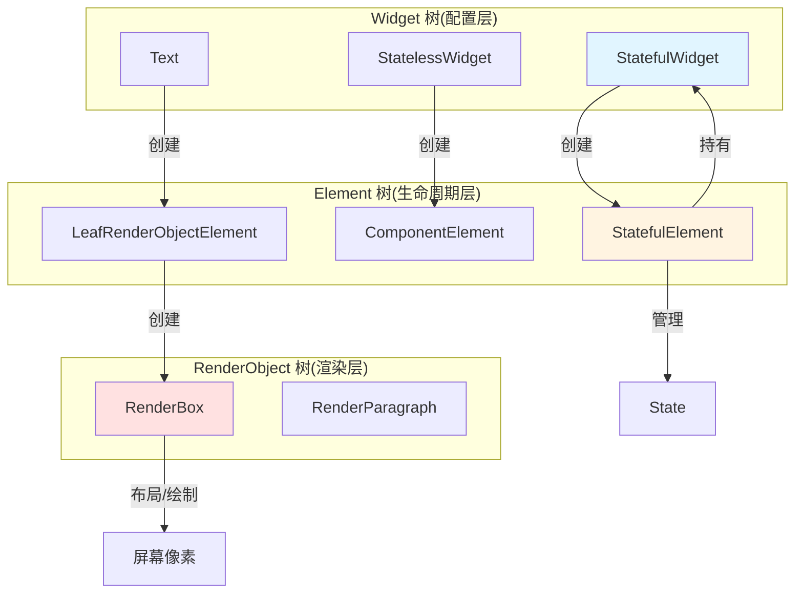
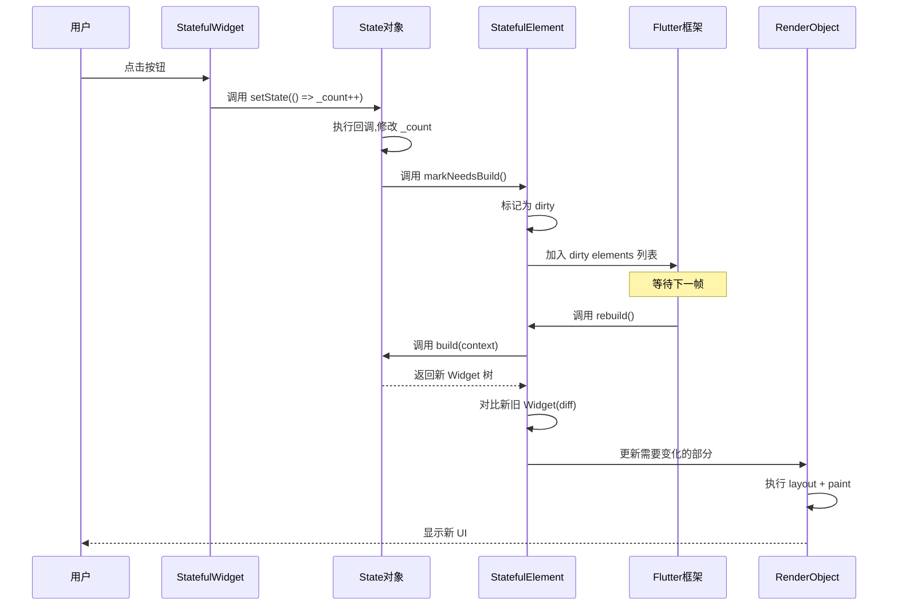
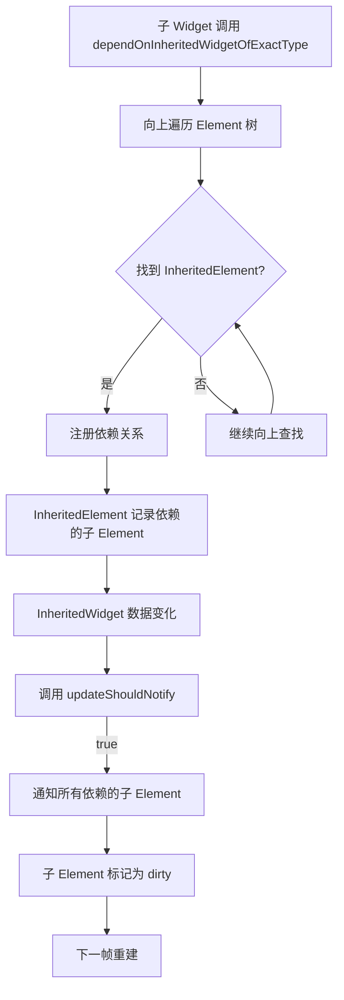
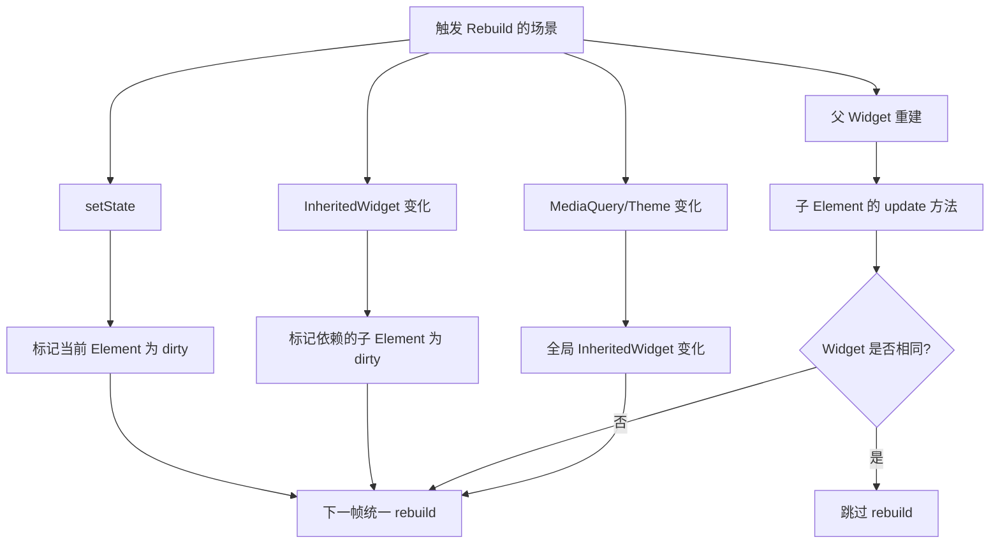
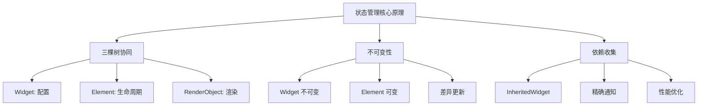

# Flutter 状态管理 - 原理讲解篇

## 设计思想

### 1. 不可变性哲学(Immutability)

**核心理念**:Widget 是不可变的配置对象,而非可变的 UI 实例。

**生活类比**:
- **传统 UI(Android View)**:像实体书,你可以在上面涂改(setText、setColor)
- **Flutter Widget**:像电子书阅读器,每次"翻页"都是重新渲染新内容,而非修改旧内容

**代码体现**:
```dart
class Text extends StatelessWidget {
  final String data; // final 关键字,创建后不可修改
  const Text(this.data); // const 构造函数,编译时常量
}
```

**为什么这样设计?**
1. **性能优化**:不可变对象可以安全地复用和缓存
2. **状态可预测**:UI = f(State),相同输入必然产生相同输出
3. **并发安全**:多线程访问不可变对象无需加锁

---

### 2. 组合优于继承(Composition over Inheritance)

Flutter 不鼓励通过继承扩展 Widget,而是通过组合小 Widget 构建复杂 UI。

**对比**:
```dart
// ❌ 继承方式(不推荐)
class MyButton extends ElevatedButton {
  MyButton() : super(
    onPressed: () {},
    child: Text('按钮'),
  );
}

// ✅ 组合方式(推荐)
Widget buildMyButton() {
  return ElevatedButton(
    onPressed: () {},
    child: const Text('按钮'),
  );
}
```

**优势**:
- 灵活性高,可以任意组合
- 避免深层继承链
- 符合 Flutter 的声明式风格

---

### 3. 声明式 UI 的本质

**命令式 vs 声明式**:
```dart
// 命令式(告诉计算机"怎么做")
if (isLoading) {
  showLoadingIndicator();
} else {
  hideLoadingIndicator();
  showContent();
}

// 声明式(告诉计算机"要什么")
Widget build(BuildContext context) {
  return isLoading ? LoadingIndicator() : Content();
}
```

**Flutter 的实现机制**:
1. 开发者描述 UI 应该是什么样子(Widget 树)
2. Flutter 框架负责计算差异并更新(Element 树 + RenderObject 树)
3. 开发者无需关心 UI 如何从状态 A 变为状态 B

---

## 核心流程图

### 1. 三棵树协同机制



**三棵树的职责**:
| 树 | 职责 | 生命周期 | 可变性 |
|----|------|---------|--------|
| **Widget 树** | 描述 UI 配置 | 短暂(每次 build 重建) | 不可变 |
| **Element 树** | 管理生命周期和状态 | 长期(复用) | 可变 |
| **RenderObject 树** | 执行布局和绘制 | 长期(复用) | 可变 |

**生活类比**:
- **Widget**:建筑设计图纸(每次修改都画新图)
- **Element**:施工队(长期存在,根据图纸施工)
- **RenderObject**:实际建筑(施工队建造的成果)

---

### 2. setState 完整流程



**关键点**:
1. **setState 不是立即重建**:只是标记 Element 为 dirty
2. **批量处理**:多次 setState 会合并到同一帧处理
3. **差异更新**:只更新变化的部分,而非整棵树

---

### 3. InheritedWidget 依赖收集原理



**核心机制**:
1. **依赖注册**:子组件通过 `dependOnInheritedWidgetOfExactType` 向上查找并注册依赖
2. **精确通知**:只通知真正依赖的子组件,而非所有子组件
3. **懒更新**:标记为 dirty 后等待下一帧统一重建

---

## 源码洞察

### 1. StatefulWidget 的 createElement

```dart
// flutter/lib/src/widgets/framework.dart
abstract class StatefulWidget extends Widget {
  const StatefulWidget({Key? key}) : super(key: key);

  @override
  StatefulElement createElement() => StatefulElement(this);

  // 子类必须实现,用于创建 State 对象
  @protected
  State createState();
}
```

**关键点**:
- `createElement` 创建 Element,而非 RenderObject
- Element 负责调用 `createState` 创建 State 对象
- Widget 和 State 通过 Element 桥接

---

### 2. State.setState 源码

```dart
// flutter/lib/src/widgets/framework.dart
abstract class State<T extends StatefulWidget> {
  StatefulElement? _element;

  @protected
  void setState(VoidCallback fn) {
    // 执行状态修改回调
    final dynamic result = fn() as dynamic;

    // 断言:setState 回调不应该返回 Future
    assert(() {
      if (result is Future) {
        throw FlutterError('setState() callback returned a Future');
      }
      return true;
    }());

    // 标记 Element 需要重建
    _element!.markNeedsBuild();
  }
}
```

**关键点**:
1. **同步执行**:fn() 立即执行,不能是异步函数
2. **标记机制**:通过 `markNeedsBuild` 标记,而非立即重建
3. **安全检查**:断言回调不返回 Future,避免异步陷阱

---

### 3. Element.markNeedsBuild

```dart
// flutter/lib/src/widgets/framework.dart
abstract class Element {
  bool _dirty = false;

  void markNeedsBuild() {
    if (_dirty) return; // 已经标记过,避免重复

    _dirty = true;
    owner!.scheduleBuildFor(this); // 加入待重建队列
  }

  void rebuild() {
    if (!_dirty && !_debugDoingBuild) return;

    performRebuild(); // 执行实际重建
  }
}
```

**关键点**:
1. **去重机制**:`_dirty` 标志避免重复标记
2. **延迟执行**:加入队列,等待下一帧统一处理
3. **批量优化**:多次 setState 只触发一次 rebuild

---

### 4. InheritedWidget 的 updateShouldNotify

```dart
// flutter/lib/src/widgets/framework.dart
abstract class InheritedWidget extends ProxyWidget {
  const InheritedWidget({Key? key, required Widget child})
      : super(key: key, child: child);

  @override
  InheritedElement createElement() => InheritedElement(this);

  // 子类必须实现,决定是否通知依赖的子组件
  @protected
  bool updateShouldNotify(covariant InheritedWidget oldWidget);
}

class InheritedElement extends ProxyElement {
  final Map<Element, Object?> _dependents = HashMap<Element, Object?>();

  @override
  void updated(InheritedWidget oldWidget) {
    if ((widget as InheritedWidget).updateShouldNotify(oldWidget)) {
      // 通知所有依赖的子 Element
      _dependents.forEach((dependent, _) {
        dependent.didChangeDependencies();
      });
    }
  }

  void _updateInheritance() {
    // 子组件通过这个方法注册依赖
    _dependents[dependent] = null;
  }
}
```

**关键点**:
1. **依赖追踪**:`_dependents` 记录所有依赖的子 Element
2. **精确通知**:只通知 `updateShouldNotify` 返回 true 时的依赖者
3. **性能优化**:避免不必要的重建

---

### 5. BuildContext 的本质

```dart
// flutter/lib/src/widgets/framework.dart
abstract class BuildContext {
  Widget get widget; // 当前 Element 对应的 Widget

  // 向上查找最近的指定类型的 InheritedWidget
  T? dependOnInheritedWidgetOfExactType<T extends InheritedWidget>({
    Object? aspect,
  });
}

// Element 实现了 BuildContext 接口
abstract class Element implements BuildContext {
  @override
  Widget get widget => _widget;

  @override
  T? dependOnInheritedWidgetOfExactType<T extends InheritedWidget>({
    Object? aspect,
  }) {
    // 向上遍历父 Element
    Element? ancestor = _parent;
    while (ancestor != null) {
      if (ancestor is InheritedElement && ancestor.widget is T) {
        // 注册依赖关系
        ancestor._updateInheritance(this);
        return ancestor.widget as T;
      }
      ancestor = ancestor._parent;
    }
    return null;
  }
}
```

**关键点**:
1. **BuildContext 就是 Element**:build 方法的 context 参数实际上是 Element 实例
2. **向上查找**:通过 `_parent` 指针向上遍历 Element 树
3. **自动注册**:查找过程中自动注册依赖关系

---

## 边界认知

### 1. StatefulWidget 的局限性

**不适用场景**:
- ❌ 跨页面状态共享(需要 InheritedWidget 或 Provider)
- ❌ 复杂状态逻辑(建议使用 Bloc 或 Riverpod)
- ❌ 需要状态持久化(需要配合 shared_preferences)

**典型问题**:
```dart
// ❌ 错误:状态在页面跳转后丢失
class PageA extends StatefulWidget {
  @override
  State<PageA> createState() => _PageAState();
}

class _PageAState extends State<PageA> {
  String _userInput = '';

  void _navigateToPageB() {
    Navigator.push(context, MaterialPageRoute(builder: (_) => PageB()));
    // 返回后 _userInput 仍然保留(因为 PageA 没有销毁)
  }
}

// ✅ 正确:使用全局状态管理
class PageA extends StatelessWidget {
  @override
  Widget build(BuildContext context) {
    final userModel = Provider.of<UserModel>(context);
    // userModel 在整个应用生命周期内存在
  }
}
```

---

### 2. InheritedWidget 的局限性

**不适用场景**:
- ❌ 状态需要频繁修改(每次修改都会重建所有依赖的子组件)
- ❌ 需要细粒度控制重建范围(建议使用 ValueNotifier)

**性能陷阱**:
```dart
// ❌ 错误:频繁修改导致大量重建
class CounterProvider extends InheritedWidget {
  final int counter;
  const CounterProvider({required this.counter, required super.child});

  @override
  bool updateShouldNotify(CounterProvider oldWidget) {
    return counter != oldWidget.counter; // 每次 counter 变化都通知
  }
}

// 如果有 100 个子组件依赖 CounterProvider,每次 counter++ 都会重建 100 个组件

// ✅ 正确:使用 ValueNotifier 精确控制
final counterNotifier = ValueNotifier<int>(0);

ValueListenableBuilder<int>(
  valueListenable: counterNotifier,
  builder: (context, value, child) => Text('$value'), // 只重建这一个 Widget
)
```

---

### 3. Provider 的局限性

**不适用场景**:
- ❌ 需要编译时类型安全(Riverpod 更好)
- ❌ 复杂的异步状态管理(Bloc 更好)

**常见错误**:
```dart
// ❌ 错误:在 build 方法外使用 Provider.of
class MyWidget extends StatelessWidget {
  @override
  Widget build(BuildContext context) {
    return ElevatedButton(
      onPressed: () {
        // 错误:这里的 context 是 ElevatedButton 的,可能找不到 Provider
        final model = Provider.of<MyModel>(context);
      },
      child: const Text('按钮'),
    );
  }
}

// ✅ 正确:使用 Builder 或提前获取
class MyWidget extends StatelessWidget {
  @override
  Widget build(BuildContext context) {
    final model = Provider.of<MyModel>(context, listen: false); // 提前获取
    return ElevatedButton(
      onPressed: () {
        model.doSomething(); // 直接使用
      },
      child: const Text('按钮'),
    );
  }
}
```

---

## 面试通关(原理类)

### Q1:为什么 Flutter 需要三棵树?直接用 Widget 树不行吗?

**结论**:不行。Widget 树不可变且频繁重建,无法承载状态和渲染逻辑。

**原理**:
1. **Widget 树**:不可变,每次 setState 都会创建新的 Widget 实例
2. **Element 树**:可变,长期存在,负责管理 State 和生命周期
3. **RenderObject 树**:可变,负责实际的布局和绘制

**举例**:
```dart
// 每次 setState,Text Widget 都是新实例
setState(() => _count++);
build(context) => Text('$_count'); // 新的 Text 实例

// 但 Element 和 RenderObject 会复用
Element.update(newWidget) {
  if (widget.runtimeType == newWidget.runtimeType) {
    _widget = newWidget; // 复用 Element,只更新 Widget 引用
    renderObject.markNeedsPaint(); // 复用 RenderObject,只标记需要重绘
  }
}
```

**为什么这样设计?**
- Widget 不可变 → 可以安全缓存和比较
- Element 可变 → 可以持有 State 和管理生命周期
- RenderObject 可变 → 可以执行昂贵的布局和绘制操作

---

### Q2:setState 为什么不能是异步函数?

**结论**:因为 setState 需要立即修改状态并标记重建,异步会导致时序混乱。

**原理**:
```dart
// ❌ 错误示例
setState(() async {
  final data = await fetchData(); // 异步操作
  _data = data; // 这行代码在未来某个时刻执行
}); // setState 立即返回,但状态还没修改

// 此时 Flutter 可能已经开始重建,但 _data 还是旧值
```

**正确做法**:
```dart
// ✅ 方案 1:在 setState 外执行异步
Future<void> _loadData() async {
  final data = await fetchData();
  if (!mounted) return;
  setState(() => _data = data); // 同步修改状态
}

// ✅ 方案 2:使用 FutureBuilder
FutureBuilder<String>(
  future: fetchData(),
  builder: (context, snapshot) {
    if (snapshot.hasData) return Text(snapshot.data!);
    return CircularProgressIndicator();
  },
)
```

---

### Q3:InheritedWidget 如何实现精确通知依赖的子组件?

**结论**:通过依赖注册机制,只通知调用过 `dependOnInheritedWidgetOfExactType` 的子组件。

**原理**:
1. **注册阶段**:子组件调用 `dependOnInheritedWidgetOfExactType` 时,InheritedElement 记录依赖关系
```dart
// Element.dependOnInheritedWidgetOfExactType 源码简化
T? dependOnInheritedWidgetOfExactType<T>() {
  final ancestor = _findAncestorInheritedElement<T>();
  if (ancestor != null) {
    ancestor._dependents[this] = null; // 注册依赖
  }
  return ancestor?.widget as T?;
}
```

2. **通知阶段**:InheritedWidget 更新时,遍历 `_dependents` 通知所有依赖者
```dart
// InheritedElement.updated 源码简化
void updated(InheritedWidget oldWidget) {
  if (widget.updateShouldNotify(oldWidget)) {
    _dependents.forEach((dependent, _) {
      dependent.didChangeDependencies(); // 标记为 dirty
    });
  }
}
```

**举例**:
```dart
// 假设有 3 个子组件
Widget build(BuildContext context) {
  return Column(
    children: [
      ChildA(), // 调用了 dependOnInheritedWidgetOfExactType
      ChildB(), // 没有调用
      ChildC(), // 调用了 dependOnInheritedWidgetOfExactType
    ],
  );
}

// InheritedWidget 更新时,只有 ChildA 和 ChildC 会重建,ChildB 不受影响
```

---

### Q4:为什么 const Widget 可以提升性能?

**结论**:const Widget 在编译时创建,运行时直接复用,跳过 Widget 对比和 Element 更新。

**原理**:
```dart
// 非 const Widget
Widget build(BuildContext context) {
  return Text('Hello'); // 每次 build 都创建新的 Text 实例
}

// const Widget
Widget build(BuildContext context) {
  return const Text('Hello'); // 编译时创建,运行时复用同一个实例
}
```

**Element 更新逻辑**:
```dart
// Element.update 源码简化
void update(Widget newWidget) {
  if (widget == newWidget) {
    return; // 同一个实例,直接跳过(const Widget 的情况)
  }

  // 不同实例,需要对比和更新
  _widget = newWidget;
  markNeedsBuild();
}
```

**举例**:
```dart
class ParentWidget extends StatefulWidget {
  @override
  State<ParentWidget> createState() => _ParentWidgetState();
}

class _ParentWidgetState extends State<ParentWidget> {
  int _counter = 0;

  @override
  Widget build(BuildContext context) {
    return Column(
      children: [
        const Text('标题'), // const,不会重建
        Text('计数: $_counter'), // 非 const,每次都重建
        ElevatedButton(
          onPressed: () => setState(() => _counter++),
          child: const Text('增加'), // const,不会重建
        ),
      ],
    );
  }
}
```

**性能对比**:
- 非 const:每次 setState 创建 3 个新 Widget 实例
- const:每次 setState 只创建 1 个新 Widget 实例(计数 Text)

---

### Q5:BuildContext 为什么能向上查找 InheritedWidget?

**结论**:因为 BuildContext 就是 Element,Element 通过 `_parent` 指针形成树结构。

**原理**:
```dart
// BuildContext 接口
abstract class BuildContext {
  T? dependOnInheritedWidgetOfExactType<T extends InheritedWidget>();
}

// Element 实现 BuildContext
abstract class Element implements BuildContext {
  Element? _parent; // 父 Element 指针

  @override
  T? dependOnInheritedWidgetOfExactType<T>() {
    Element? ancestor = _parent;
    // 向上遍历 Element 树
    while (ancestor != null) {
      if (ancestor.widget is T) {
        return ancestor.widget as T;
      }
      ancestor = ancestor._parent; // 继续向上
    }
    return null;
  }
}
```

**举例**:
```dart
// Widget 树结构
MaterialApp
  └─ MyInheritedWidget (数据: theme)
       └─ Scaffold
            └─ Column
                 └─ MyButton

// Element 树结构(每个 Element 都有 _parent 指针)
MaterialAppElement (_parent: null)
  └─ InheritedElement (_parent: MaterialAppElement)
       └─ ScaffoldElement (_parent: InheritedElement)
            └─ ColumnElement (_parent: ScaffoldElement)
                 └─ MyButtonElement (_parent: ColumnElement)

// MyButton 中调用
final theme = MyInheritedWidget.of(context);

// 实际执行流程
MyButtonElement.dependOnInheritedWidgetOfExactType()
  → 检查 ColumnElement (不是 InheritedElement)
  → 检查 ScaffoldElement (不是 InheritedElement)
  → 检查 InheritedElement (是!) → 返回 MyInheritedWidget
```

**为什么不能向下查找?**
- Element 只有 `_parent` 指针,没有 `_children` 指针
- 向下查找需要遍历所有子树,性能开销大
- 数据向下传递符合"单向数据流"设计原则

---

## 性能优化深度解析

### 1. Rebuild 的触发时机



**优化策略**:
1. **使用 const**:让 Widget 相同,跳过 rebuild
2. **缩小 setState 范围**:只标记必要的 Element
3. **使用 ValueListenableBuilder**:精确监听单个值

---

### 2. RepaintBoundary 的原理

**作用**:隔离重绘区域,避免父组件重绘时影响子组件。

**原理**:
```dart
// RepaintBoundary 创建独立的 Layer
class RepaintBoundary extends SingleChildRenderObjectWidget {
  @override
  RenderRepaintBoundary createRenderObject(BuildContext context) {
    return RenderRepaintBoundary();
  }
}

class RenderRepaintBoundary extends RenderProxyBox {
  @override
  bool get isRepaintBoundary => true; // 标记为重绘边界

  @override
  void paint(PaintingContext context, Offset offset) {
    // 创建新的 Layer,隔离绘制
    context.pushLayer(
      OffsetLayer()..offset = offset,
      super.paint,
      Offset.zero,
    );
  }
}
```

**使用场景**:
```dart
// ✅ 适用:复杂且独立的组件
ListView.builder(
  itemBuilder: (context, index) {
    return RepaintBoundary(
      child: ComplexListItem(data: items[index]),
    );
  },
)

// ❌ 不适用:简单组件(增加 Layer 开销)
RepaintBoundary(
  child: Text('Hello'), // 没必要
)
```

---

## 总结

### 核心原理图谱



### 关键认知

1. **Widget 是配置,不是 UI**:真正的 UI 是 RenderObject
2. **setState 不是立即重建**:只是标记,等待下一帧
3. **BuildContext 就是 Element**:通过它访问 Element 树
4. **const 是性能利器**:跳过 Widget 对比和 Element 更新
5. **InheritedWidget 是基石**:Provider、Theme、MediaQuery 都基于它

### 进阶学习路径

1. **渲染管线**:深入理解 Layout → Paint → Composite 流程
2. **Dart 事件循环**:理解 Microtask 和 Event Queue
3. **源码阅读**:flutter/packages/flutter/lib/src/widgets/framework.dart
4. **性能分析**:使用 Flutter DevTools 的 Performance 和 Timeline 工具

### 推荐资源

- **官方文档**:[Flutter architectural overview](https://docs.flutter.dev/resources/architectural-overview)
- **源码仓库**:[flutter/flutter](https://github.com/flutter/flutter)
- **深度文章**:《Flutter 渲染机制》、《深入理解 BuildContext》
