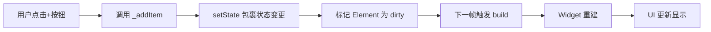
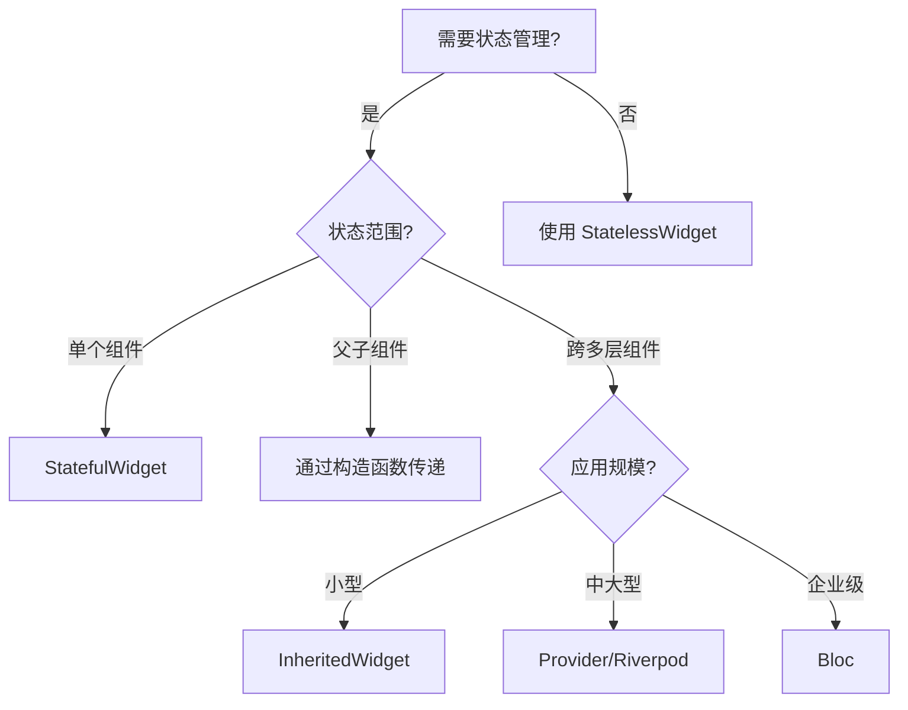

# Flutter 状态管理 - 基础使用篇

## 技术演进：为什么需要状态管理?

### 历史痛点
在传统命令式 UI 框架中(如 Android View 体系),开发者需要手动操作 UI 组件:
```java
// Android 命令式写法
textView.setText("新内容");
button.setEnabled(false);
```

这种方式存在三大问题:
1. **状态分散**:UI 状态散落在各个 View 实例中,难以追踪
2. **同步困难**:多处 UI 需要反映同一状态时,容易出现不一致
3. **代码冗余**:每次状态变化都要手动更新所有相关 UI

### Flutter 的声明式革命
Flutter 采用声明式 UI,核心理念是 **UI = f(State)**:
```dart
// Flutter 声明式写法
Widget build(BuildContext context) {
  return Text(isLoading ? '加载中...' : '已完成');
}
```

**生活类比**:就像餐厅点餐系统,你不需要告诉厨师"先切菜、再炒菜、最后装盘"(命令式),只需要说"我要一份宫保鸡丁"(声明式),厨师会根据菜谱(State)自动完成所有步骤。

---

## 核心概念

### 1. State(状态)
**定义**:影响 UI 展示的数据。

**在 Widget 树中的地位**:
```
MaterialApp (无状态)
  └─ HomePage (有状态)
       ├─ State 对象 (存储数据)
       └─ Widget 树 (根据 State 渲染)
```

**分类**:
| 类型 | 生命周期 | 典型场景 | 示例 |
|------|---------|---------|------|
| **临时状态** | 单个 Widget | 动画进度、表单输入 | `TextField` 的文本 |
| **应用状态** | 跨页面共享 | 用户信息、购物车 | 登录状态 |

### 2. StatefulWidget vs StatelessWidget

**StatelessWidget**:不可变的 Widget,像建筑蓝图,一旦绘制就不会改变。
```dart
class Logo extends StatelessWidget {
  final String imageUrl;
  const Logo({required this.imageUrl});

  @override
  Widget build(BuildContext context) => Image.network(imageUrl);
}
```

**StatefulWidget**:可变的 Widget,像电子显示屏,内容可以动态更新。
```dart
class Counter extends StatefulWidget {
  @override
  State<Counter> createState() => _CounterState();
}

class _CounterState extends State<Counter> {
  int _count = 0;

  @override
  Widget build(BuildContext context) {
    return Text('$_count');
  }
}
```

---

## 最佳实践示例

### 场景 1:局部状态管理(StatefulWidget)

**适用场景**:状态仅在单个页面或组件内使用。

```dart
import 'package:flutter/material.dart';

class ShoppingCartPage extends StatefulWidget {
  const ShoppingCartPage({super.key});

  @override
  State<ShoppingCartPage> createState() => _ShoppingCartPageState();
}

class _ShoppingCartPageState extends State<ShoppingCartPage> {
  // 使用 Dart 3.x Records 简化数据结构
  final List<({String name, int quantity, double price})> _items = [];

  void _addItem(String name, double price) {
    setState(() {
      // 为什么用 setState:通知 Flutter 框架数据已变化,需要重建 Widget
      _items.add((name: name, quantity: 1, price: price));
    });
  }

  void _updateQuantity(int index, int delta) {
    setState(() {
      final item = _items[index];
      final newQuantity = item.quantity + delta;
      if (newQuantity > 0) {
        _items[index] = (name: item.name, quantity: newQuantity, price: item.price);
      } else {
        _items.removeAt(index);
      }
    });
  }

  double get _totalPrice => _items.fold(0, (sum, item) => sum + item.price * item.quantity);

  @override
  Widget build(BuildContext context) {
    return Scaffold(
      appBar: AppBar(title: const Text('购物车')),
      body: Column(
        children: [
          Expanded(
            child: ListView.builder(
              itemCount: _items.length,
              itemBuilder: (context, index) {
                final item = _items[index];
                // 为什么用 RepaintBoundary:隔离重绘区域,避免整个列表重绘
                return RepaintBoundary(
                  child: ListTile(
                    title: Text(item.name),
                    subtitle: Text('¥${item.price.toStringAsFixed(2)}'),
                    trailing: Row(
                      mainAxisSize: MainAxisSize.min,
                      children: [
                        IconButton(
                          icon: const Icon(Icons.remove),
                          onPressed: () => _updateQuantity(index, -1),
                        ),
                        Text('${item.quantity}'),
                        IconButton(
                          icon: const Icon(Icons.add),
                          onPressed: () => _updateQuantity(index, 1),
                        ),
                      ],
                    ),
                  ),
                );
              },
            ),
          ),
          Container(
            padding: const EdgeInsets.all(16),
            color: Colors.grey[200],
            child: Row(
              mainAxisAlignment: MainAxisAlignment.spaceBetween,
              children: [
                Text('总计:', style: Theme.of(context).textTheme.titleLarge),
                Text('¥${_totalPrice.toStringAsFixed(2)}',
                     style: Theme.of(context).textTheme.titleLarge),
              ],
            ),
          ),
        ],
      ),
      floatingActionButton: FloatingActionButton(
        onPressed: () => _addItem('商品${_items.length + 1}', 99.9),
        child: const Icon(Icons.add),
      ),
    );
  }
}
```

**状态流转图**:


---

### 场景 2:跨组件状态共享(InheritedWidget)

**适用场景**:多个子组件需要访问同一状态,但不想层层传递参数。

```dart
import 'package:flutter/material.dart';

// 1. 定义状态数据模型
class ThemeConfig {
  final bool isDarkMode;
  final double fontSize;

  const ThemeConfig({required this.isDarkMode, required this.fontSize});

  ThemeConfig copyWith({bool? isDarkMode, double? fontSize}) {
    return ThemeConfig(
      isDarkMode: isDarkMode ?? this.isDarkMode,
      fontSize: fontSize ?? this.fontSize,
    );
  }
}

// 2. 创建 InheritedWidget(数据容器)
class ThemeProvider extends InheritedWidget {
  final ThemeConfig config;
  final void Function(ThemeConfig) updateConfig;

  const ThemeProvider({
    super.key,
    required this.config,
    required this.updateConfig,
    required super.child,
  });

  // 为什么需要这个方法:让子组件能快速获取最近的 ThemeProvider
  static ThemeProvider? of(BuildContext context) {
    return context.dependOnInheritedWidgetOfExactType<ThemeProvider>();
  }

  // 为什么重写这个方法:决定何时通知依赖的子组件重建
  @override
  bool updateShouldNotify(ThemeProvider oldWidget) {
    return config.isDarkMode != oldWidget.config.isDarkMode ||
           config.fontSize != oldWidget.config.fontSize;
  }
}

// 3. 创建有状态的包装器
class ThemeManager extends StatefulWidget {
  final Widget child;
  const ThemeManager({super.key, required this.child});

  @override
  State<ThemeManager> createState() => _ThemeManagerState();
}

class _ThemeManagerState extends State<ThemeManager> {
  ThemeConfig _config = const ThemeConfig(isDarkMode: false, fontSize: 16);

  void _updateConfig(ThemeConfig newConfig) {
    setState(() => _config = newConfig);
  }

  @override
  Widget build(BuildContext context) {
    return ThemeProvider(
      config: _config,
      updateConfig: _updateConfig,
      child: widget.child,
    );
  }
}

// 4. 子组件使用状态
class SettingsPage extends StatelessWidget {
  const SettingsPage({super.key});

  @override
  Widget build(BuildContext context) {
    // 为什么用 of 方法:通过 BuildContext 向上查找最近的 ThemeProvider
    final themeProvider = ThemeProvider.of(context)!;
    final config = themeProvider.config;

    return Scaffold(
      appBar: AppBar(title: const Text('设置')),
      body: Column(
        children: [
          SwitchListTile(
            title: const Text('深色模式'),
            value: config.isDarkMode,
            onChanged: (value) {
              themeProvider.updateConfig(
                config.copyWith(isDarkMode: value),
              );
            },
          ),
          ListTile(
            title: const Text('字体大小'),
            subtitle: Slider(
              value: config.fontSize,
              min: 12,
              max: 24,
              onChanged: (value) {
                themeProvider.updateConfig(
                  config.copyWith(fontSize: value),
                );
              },
            ),
          ),
        ],
      ),
    );
  }
}

// 5. 应用入口
void main() {
  runApp(
    ThemeManager(
      child: const MaterialApp(
        home: SettingsPage(),
      ),
    ),
  );
}
```

**BuildContext 的本质**:
> **生活类比**:BuildContext 就像你的家庭住址,通过它可以找到你的邻居(兄弟 Widget)、父母(父 Widget)、社区服务中心(InheritedWidget)。`dependOnInheritedWidgetOfExactType` 就是"向上查找最近的社区服务中心"。

---

### 场景 3:复杂应用状态(Provider 模式)

**适用场景**:大型应用,需要全局状态管理、依赖注入、状态持久化。

```dart
import 'package:flutter/material.dart';

// 1. 定义状态模型(使用 ChangeNotifier)
class UserModel extends ChangeNotifier {
  String? _username;
  bool _isLoggedIn = false;

  String? get username => _username;
  bool get isLoggedIn => _isLoggedIn;

  Future<void> login(String username, String password) async {
    // 模拟网络请求
    await Future.delayed(const Duration(seconds: 1));
    _username = username;
    _isLoggedIn = true;
    // 为什么调用 notifyListeners:通知所有监听者状态已变化
    notifyListeners();
  }

  void logout() {
    _username = null;
    _isLoggedIn = false;
    notifyListeners();
  }
}

// 2. 简化版 Provider 实现(生产环境建议用 provider 包)
class ChangeNotifierProvider<T extends ChangeNotifier> extends StatefulWidget {
  final T Function() create;
  final Widget child;

  const ChangeNotifierProvider({
    super.key,
    required this.create,
    required this.child,
  });

  @override
  State<ChangeNotifierProvider<T>> createState() => _ChangeNotifierProviderState<T>();

  static T of<T>(BuildContext context) {
    final provider = context.dependOnInheritedWidgetOfExactType<_InheritedProvider<T>>();
    return provider!.notifier;
  }
}

class _ChangeNotifierProviderState<T extends ChangeNotifier> extends State<ChangeNotifierProvider<T>> {
  late T _notifier;

  @override
  void initState() {
    super.initState();
    _notifier = widget.create();
    _notifier.addListener(_onNotifierChanged);
  }

  void _onNotifierChanged() {
    setState(() {}); // 触发重建
  }

  @override
  void dispose() {
    _notifier.removeListener(_onNotifierChanged);
    _notifier.dispose();
    super.dispose();
  }

  @override
  Widget build(BuildContext context) {
    return _InheritedProvider<T>(
      notifier: _notifier,
      child: widget.child,
    );
  }
}

class _InheritedProvider<T> extends InheritedWidget {
  final T notifier;

  const _InheritedProvider({
    required this.notifier,
    required super.child,
  });

  @override
  bool updateShouldNotify(_InheritedProvider<T> oldWidget) => true;
}

// 3. 使用示例
class LoginPage extends StatelessWidget {
  const LoginPage({super.key});

  @override
  Widget build(BuildContext context) {
    final userModel = ChangeNotifierProvider.of<UserModel>(context);

    return Scaffold(
      appBar: AppBar(title: const Text('登录')),
      body: Center(
        child: userModel.isLoggedIn
            ? Column(
                mainAxisAlignment: MainAxisAlignment.center,
                children: [
                  Text('欢迎, ${userModel.username}!'),
                  ElevatedButton(
                    onPressed: userModel.logout,
                    child: const Text('退出登录'),
                  ),
                ],
              )
            : ElevatedButton(
                onPressed: () async {
                  await userModel.login('张三', '123456');
                },
                child: const Text('登录'),
              ),
      ),
    );
  }
}

void main() {
  runApp(
    ChangeNotifierProvider(
      create: () => UserModel(),
      child: const MaterialApp(
        home: LoginPage(),
      ),
    ),
  );
}
```

---

## 性能/避坑策略

### 性能优化 Checklist

#### 1. 减少不必要的 Rebuild
```dart
// ❌ 错误:整个页面都会重建
class BadExample extends StatefulWidget {
  @override
  State<BadExample> createState() => _BadExampleState();
}

class _BadExampleState extends State<BadExample> {
  int _counter = 0;

  @override
  Widget build(BuildContext context) {
    return Column(
      children: [
        ExpensiveWidget(), // 每次 _counter 变化都会重建
        Text('$_counter'),
        ElevatedButton(
          onPressed: () => setState(() => _counter++),
          child: const Text('增加'),
        ),
      ],
    );
  }
}

// ✅ 正确:只重建必要部分
class GoodExample extends StatefulWidget {
  @override
  State<GoodExample> createState() => _GoodExampleState();
}

class _GoodExampleState extends State<GoodExample> {
  int _counter = 0;

  @override
  Widget build(BuildContext context) {
    return Column(
      children: [
        const ExpensiveWidget(), // const 构造函数,不会重建
        _CounterDisplay(counter: _counter), // 独立组件,精确控制重建范围
        ElevatedButton(
          onPressed: () => setState(() => _counter++),
          child: const Text('增加'),
        ),
      ],
    );
  }
}

class _CounterDisplay extends StatelessWidget {
  final int counter;
  const _CounterDisplay({required this.counter});

  @override
  Widget build(BuildContext context) => Text('$counter');
}
```

**原则**:
- 使用 `const` 构造函数标记不变的 Widget
- 将变化的部分提取为独立组件
- 使用 `RepaintBoundary` 隔离重绘区域

#### 2. 避免 BuildContext 跨异步失效
```dart
// ❌ 错误:异步操作后 context 可能已失效
void _loadData(BuildContext context) async {
  final data = await fetchData();
  Navigator.push(context, MaterialRoute(...)); // 可能崩溃
}

// ✅ 正确:检查 mounted 状态
void _loadData() async {
  final data = await fetchData();
  if (!mounted) return; // 组件已销毁,不执行后续操作
  if (context.mounted) { // Dart 3.x 新增的安全检查
    Navigator.push(context, MaterialRoute(...));
  }
}
```

#### 3. 列表性能优化
```dart
// ❌ 错误:无边界垂直列表嵌套
Column(
  children: [
    ListView.builder(...), // 会报错:Vertical viewport was given unbounded height
  ],
)

// ✅ 正确:使用 Expanded 或 ShrinkWrap
Column(
  children: [
    Expanded(
      child: ListView.builder(...), // 占据剩余空间
    ),
  ],
)

// 或者(小列表场景)
Column(
  children: [
    ListView.builder(
      shrinkWrap: true, // 根据内容自适应高度
      physics: const NeverScrollableScrollPhysics(), // 禁用滚动
      ...
    ),
  ],
)
```

### 常见错误 Checklist

| 错误现象 | 原因 | 解决方案 |
|---------|------|---------|
| `setState() called after dispose()` | 异步操作完成时组件已销毁 | 检查 `mounted` 状态 |
| `Vertical viewport unbounded height` | ListView 在 Column 中没有高度约束 | 使用 `Expanded` 或 `shrinkWrap: true` |
| 页面卡顿 | 过度重建或复杂布局 | 使用 `const`、`RepaintBoundary`、`ListView.builder` |
| `Looking up a deactivated widget's ancestor` | 在 `dispose` 后访问 context | 提前保存需要的数据 |

---

## 多端差异警示

| 平台 | 差异点 | 应对策略 |
|------|--------|---------|
| **iOS** | 返回手势会触发 `deactivate` | 在 `dispose` 中清理资源,而非 `deactivate` |
| **Web** | 浏览器刷新会丢失内存状态 | 使用 `shared_preferences` 或 `hive` 持久化关键状态 |
| **Impeller** | 渲染引擎优化了 `RepaintBoundary` | 在 iOS 17+ 上性能提升更明显 |

---

## 生态选型批判

### 主流状态管理方案对比

| 方案 | 适用场景 | 优势 | 劣势 | 维护状态 |
|------|---------|------|------|---------|
| **StatefulWidget** | 局部状态 | 零依赖,简单直接 | 跨组件共享困难 | ✅ 官方支持 |
| **InheritedWidget** | 中等规模应用 | 原生支持,性能好 | 手写代码多 | ✅ 官方支持 |
| **Provider** | 中大型应用 | 生态成熟,易测试 | 需要理解 ChangeNotifier | ✅ 官方推荐 |
| **Riverpod** | 大型应用 | 编译时安全,无 context | 学习曲线陡峭 | ✅ 活跃维护 |
| **Bloc** | 企业级应用 | 架构清晰,可预测 | 模板代码多 | ✅ 活跃维护 |
| **GetX** | 快速开发 | API 简洁,功能全 | 魔法过多,难调试 | ⚠️ 争议较大 |

**选型建议**:
1. **小项目**:StatefulWidget + InheritedWidget
2. **中型项目**:Provider(官方推荐,生态最好)
3. **大型项目**:Riverpod(类型安全)或 Bloc(架构严谨)
4. **不推荐 GetX**:虽然开发快,但过度依赖全局状态,难以维护和测试

---

## 面试通关(实战类)

### Q1:如何避免 setState 导致的性能问题?
**答案**:
1. **缩小重建范围**:将变化部分提取为独立 Widget
2. **使用 const**:标记不变的 Widget
3. **RepaintBoundary**:隔离重绘区域
4. **ValueNotifier + ValueListenableBuilder**:精确监听单个值变化

**示例**:
```dart
class OptimizedCounter extends StatefulWidget {
  @override
  State<OptimizedCounter> createState() => _OptimizedCounterState();
}

class _OptimizedCounterState extends State<OptimizedCounter> {
  final ValueNotifier<int> _counter = ValueNotifier(0);

  @override
  Widget build(BuildContext context) {
    return Column(
      children: [
        const ExpensiveWidget(), // 不会重建
        ValueListenableBuilder<int>(
          valueListenable: _counter,
          builder: (context, value, child) => Text('$value'), // 只重建这里
        ),
        ElevatedButton(
          onPressed: () => _counter.value++,
          child: const Text('增加'),
        ),
      ],
    );
  }

  @override
  void dispose() {
    _counter.dispose();
    super.dispose();
  }
}
```

---

### Q2:InheritedWidget 和 Provider 的区别?
**答案**:
- **InheritedWidget**:Flutter 原生机制,只负责数据传递,不负责状态变更通知
- **Provider**:基于 InheritedWidget 封装,增加了 ChangeNotifier 监听机制

**选型思路**:
- 数据只读(如主题配置) → InheritedWidget
- 数据需要修改并通知 → Provider

---

### Q3:如何在 StatefulWidget 中安全地执行异步操作?
**答案**:
```dart
class SafeAsyncWidget extends StatefulWidget {
  @override
  State<SafeAsyncWidget> createState() => _SafeAsyncWidgetState();
}

class _SafeAsyncWidgetState extends State<SafeAsyncWidget> {
  bool _isLoading = false;

  Future<void> _loadData() async {
    if (!mounted) return; // 第一次检查

    setState(() => _isLoading = true);

    try {
      await Future.delayed(const Duration(seconds: 2));

      if (!mounted) return; // 第二次检查(异步操作后)

      setState(() => _isLoading = false);
    } catch (e) {
      if (!mounted) return;
      setState(() => _isLoading = false);
    }
  }

  @override
  Widget build(BuildContext context) {
    return _isLoading
        ? const CircularProgressIndicator()
        : ElevatedButton(
            onPressed: _loadData,
            child: const Text('加载数据'),
          );
  }
}
```

**关键点**:
1. 异步操作前后都检查 `mounted`
2. 在 `setState` 前检查,避免 `setState() called after dispose()`

---

### Q4:如何实现跨页面的状态共享?
**答案**:三种方案

**方案 1:InheritedWidget(轻量级)**
```dart
// 在 MaterialApp 上层包裹
MaterialApp(
  home: MyInheritedWidget(
    data: sharedData,
    child: HomePage(),
  ),
)

// 任意子页面访问
final data = MyInheritedWidget.of(context).data;
```

**方案 2:Provider(推荐)**
```dart
// main.dart
MultiProvider(
  providers: [
    ChangeNotifierProvider(create: (_) => UserModel()),
    ChangeNotifierProvider(create: (_) => CartModel()),
  ],
  child: MaterialApp(...),
)

// 任意页面
final user = Provider.of<UserModel>(context);
```

**方案 3:单例模式(不推荐,难测试)**
```dart
class GlobalState {
  static final GlobalState _instance = GlobalState._internal();
  factory GlobalState() => _instance;
  GlobalState._internal();

  String username = '';
}
```

---

### Q5:如何调试状态管理问题?
**答案**:
1. **Flutter DevTools**:查看 Widget 树和 Rebuild 情况
2. **添加日志**:
```dart
@override
Widget build(BuildContext context) {
  debugPrint('${widget.runtimeType} build called'); // 追踪重建次数
  return ...;
}
```
3. **使用 debugPrintRebuildDirtyWidgets**:
```dart
void main() {
  debugPrintRebuildDirtyWidgets = true; // 打印所有重建的 Widget
  runApp(MyApp());
}
```
4. **Performance Overlay**:
```dart
MaterialApp(
  showPerformanceOverlay: true, // 显示性能图表
  ...
)
```

---

## 总结

### 状态管理决策树


### 核心原则
1. **最小化状态**:能用 StatelessWidget 就不用 StatefulWidget
2. **状态下沉**:状态应该放在最低的公共父组件
3. **单一数据源**:避免状态冗余和不一致
4. **性能优先**:使用 const、RepaintBoundary、精确重建

### 下一步学习
阅读《状态管理原理讲解篇》,深入理解:
- Widget/Element/RenderObject 三棵树协同机制
- setState 的底层实现
- InheritedWidget 的依赖收集原理
- Provider 的源码解析
