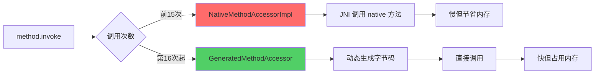
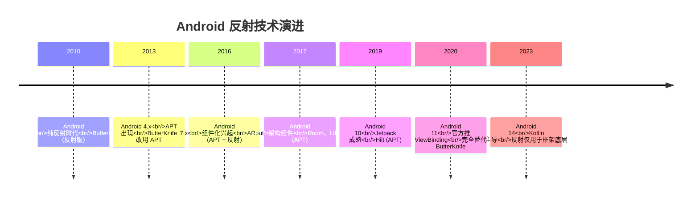

# 反射源码篇 - 底层原理与设计哲学

## Method.invoke 底层原理

### 一句话总结

`Method.invoke()` 的底层实现：**前 15 次用反射调用（慢但灵活），第 16 次起 JVM 动态生成字节码直接调用（快但有预热成本）**。

### JDK 反射的两阶段优化



### 源码分析（JDK 17）

**步骤 1：Method.invoke 入口**

```java
// java.lang.reflect.Method
public Object invoke(Object obj, Object... args) throws ... {
    // 1. 访问权限检查（如果没调用 setAccessible(true)）
    if (!override) {
        if (!Reflection.quickCheckMemberAccess(clazz, modifiers)) {
            throw new IllegalAccessException("权限不足");
        }
    }
    
    // 2. 委托给 MethodAccessor 执行
    MethodAccessor ma = methodAccessor;
    if (ma == null) {
        ma = acquireMethodAccessor();  // 懒加载
    }
    return ma.invoke(obj, args);  // 关键：委托调用
}
```

**步骤 2：初始化 MethodAccessor**

```java
private MethodAccessor acquireMethodAccessor() {
    MethodAccessor tmp = null;
    if (root != null) tmp = root.getMethodAccessor();
    if (tmp != null) {
        methodAccessor = tmp;
    } else {
        // 关键：创建 Accessor（默认是 NativeMethodAccessorImpl）
        tmp = reflectionFactory.newMethodAccessor(this);
    }
    return tmp;
}

// ReflectionFactory
public MethodAccessor newMethodAccessor(Method method) {
    // 先用 native 实现（DelegatingMethodAccessorImpl -> NativeMethodAccessorImpl）
    if (noInflation) {
        // 如果禁用 inflation，直接生成字节码
        return new MethodAccessorGenerator().generateMethod(...);
    } else {
        // 默认：先用 native 调用，等热点后再生成字节码（inflation 机制）
        NativeMethodAccessorImpl acc = new NativeMethodAccessorImpl(method);
        DelegatingMethodAccessorImpl res = new DelegatingMethodAccessorImpl(acc);
        return res;
    }
}
```

**步骤 3：前 15 次 - Native 调用**

```java
// NativeMethodAccessorImpl
class NativeMethodAccessorImpl extends MethodAccessorImpl {
    private Method method;
    private int numInvocations;  // 调用次数计数器

    public Object invoke(Object obj, Object[] args) throws ... {
        // 调用 JNI native 方法
        if (++numInvocations > ReflectionFactory.inflationThreshold()) {  // 默认阈值 15
            // 达到阈值，切换到字节码生成版本
            MethodAccessorImpl acc = (MethodAccessorImpl)
                new MethodAccessorGenerator().generateMethod(...);
            parent.setDelegate(acc);  // 替换委托对象
        }
        
        // 通过 JNI 调用 native 方法（慢）
        return invoke0(method, obj, args);
    }

    private static native Object invoke0(Method m, Object obj, Object[] args);
}
```

**步骤 4：第 16 次起 - 字节码生成**

```java
// 动态生成的类（简化示意）
// 实际类名：sun.reflect.GeneratedMethodAccessor1
class GeneratedMethodAccessor1 extends MethodAccessorImpl {
    public Object invoke(Object obj, Object[] args) throws ... {
        // 直接调用目标方法，等同于：obj.targetMethod(args)
        User user = (User) obj;
        return user.getName();  // 直接调用，性能接近普通调用
    }
}
```

### 设计哲学：为什么这样设计？

**权衡取舍**：
- **Native 调用**（前 15 次）
  - ✅ 优点：节省内存（不用生成字节码）、启动快
  - ❌ 缺点：慢（JNI 调用开销大）
  
- **字节码生成**（第 16 次起）
  - ✅ 优点：快（接近直接调用）
  - ❌ 缺点：占内存（每个方法生成一个类）、有预热成本

**JVM 的选择**：
- 大部分反射方法只调用几次（如框架初始化）→ 用 native 节省内存
- 少数热点方法调用很多次 → 动态生成字节码加速

**这就是 JVM 的智慧：Lazy Optimization（懒惰优化）**

### Android ART 的反射实现

**ART vs JVM 的差异**：

| 对比项 | JVM（HotSpot） | Android ART |
|-------|----------------|-------------|
| 实现方式 | Native + 动态生成字节码 | 纯 C++ 实现 |
| 优化策略 | 热点替换（15 次阈值） | 无优化，每次都走 C++ |
| 性能 | 热点后接近直接调用 | 始终比直接调用慢 5-10x |
| 内存占用 | 热点方法多时占内存 | 不占额外内存 |

**为什么 ART 不做优化？**
- 手机内存有限，不值得为每个反射方法生成代码
- Android 框架已经在用 APT 替代反射（如 ARouter、Room）

**源码位置**（AOSP）：
- `art/runtime/reflection.cc` - ART 反射实现
- `art/runtime/mirror/method.h` - Method 类定义

## Android 框架源码中的反射

### 案例 1：ARouter 路由加载流程

**核心问题**：ARouter 如何做到启动只需 10ms，而不是扫描所有类（耗时几百毫秒）？

**答案**：APT 预生成路由表 + 反射加载路由表类

```kotlin
// 步骤 1：编译时生成路由表（APT）
// 文件：build/generated/ap_generated_sources/.../ARouter$$Group$$user.java
public class ARouter$$Group$$user implements IRouteGroup {
    @Override
    public void loadInto(Map<String, RouteMeta> atlas) {
        atlas.put("/user/detail", 
            RouteMeta.build(RouteType.ACTIVITY, UserDetailActivity.class, "/user/detail")
        );
    }
}

// 步骤 2：运行时反射加载路由表（只加载一次）
// ARouter 源码：com/alibaba/android/arouter/core/Warehouse
class Warehouse {
    private static Map<String, Class<? extends IRouteGroup>> groupsIndex = new HashMap<>();
    private static Map<String, RouteMeta> routes = new HashMap<>();

    static void init() {
        // 扫描所有路由表类（编译时 APT 已经生成了类名列表）
        Set<String> routerMap = ClassUtils.getFileNameByPackageName(
            mContext, "com.alibaba.android.arouter.routes"
        );
        
        for (String className : routerMap) {
            if (className.startsWith("ARouter$$Group$$")) {
                // 反射加载路由表类（关键！）
                Class<?> clazz = Class.forName(className);
                IRouteGroup group = (IRouteGroup) clazz.getConstructor().newInstance();
                group.loadInto(routes);  // 填充路由表
            }
        }
    }
}

// 步骤 3：跳转时查表（不用反射，直接查 Map）
fun navigation(path: String) {
    val meta = routes[path] ?: return
    val intent = Intent(context, meta.destination)  // 已经是 Class 对象，不需要反射
    context.startActivity(intent)
}
```

**设计亮点**：
1. **分阶段优化**：
   - 编译时：APT 生成路由表（最耗时的扫描工作放到编译时）
   - 启动时：反射加载路由表类（只需加载几个类，很快）
   - 跳转时：直接查 Map（完全不用反射，最快）

2. **懒加载**：
   - 按模块分组（user、order、pay...）
   - 首次跳转某个模块时才加载该模块的路由表
   - 避免启动时加载所有模块

**性能对比**：

| 方案 | 启动耗时 | 首次跳转耗时 |
|-----|---------|------------|
| 纯反射扫描所有类 | 500-1000ms | 0ms |
| APT + 反射加载路由表 | 10-20ms | 5ms（懒加载） |
| **ARouter 方案** | **10-20ms** | **1ms**（查表） |

### 案例 2：EventBus 3.x 的索引优化

**背景**：EventBus 2.x 纯反射，注册时要扫描所有方法，慢

**优化**：EventBus 3.x 引入索引（APT + 反射）

```kotlin
// 步骤 1：编译时生成订阅者索引（APT）
// 自动生成类：MyEventBusIndex
public class MyEventBusIndex implements SubscriberInfoIndex {
    @Override
    public SubscriberInfo getSubscriberInfo(Class<?> subscriberClass) {
        if (subscriberClass == UserActivity.class) {
            return new SimpleSubscriberInfo(
                UserActivity.class,
                new SubscriberMethodInfo[] {
                    new SubscriberMethodInfo("onUserLogin", LoginEvent.class)
                }
            );
        }
        return null;
    }
}

// 步骤 2：EventBus 优先用索引，没有索引才降级到反射
class EventBus {
    fun register(subscriber: Any) {
        val info = subscriberInfoIndexes.getSubscriberInfo(subscriber.javaClass)
        if (info != null) {
            // 有索引：直接用（快）
            subscriberMethods = info.subscriberMethods
        } else {
            // 无索引：降级到反射扫描（慢）
            subscriberMethods = findUsingReflection(subscriber.javaClass)
        }
    }
}
```

**性能对比**：
- EventBus 2.x（纯反射）：register 耗时 **30-50ms**
- EventBus 3.x（有索引）：register 耗时 **1-2ms**
- EventBus 3.x（无索引）：降级到反射，仍是 30-50ms

### 案例 3：Gson 的类型适配器缓存

**核心问题**：Gson 如何避免每次序列化都反射扫描字段？

**答案**：TypeAdapter 缓存 + 反射字段缓存

```java
// Gson 源码：com.google.gson.internal.bind.ReflectiveTypeAdapterFactory
public final class ReflectiveTypeAdapterFactory implements TypeAdapterFactory {
    // 关键：缓存每个类的 TypeAdapter（包含字段信息）
    private final Map<Type, TypeAdapter<?>> typeAdapterCache = new ConcurrentHashMap<>();

    @Override
    public <T> TypeAdapter<T> create(Gson gson, TypeToken<T> type) {
        Class<? super T> raw = type.getRawType();
        
        // 从缓存取（第二次起就不用反射了）
        TypeAdapter<?> cached = typeAdapterCache.get(type.getType());
        if (cached != null) return (TypeAdapter<T>) cached;
        
        // 首次：反射扫描所有字段，生成 TypeAdapter
        Map<String, BoundField> boundFields = getBoundFields(gson, type, raw);
        TypeAdapter<T> adapter = new Adapter<>(boundFields);
        
        // 缓存起来
        typeAdapterCache.put(type.getType(), adapter);
        return adapter;
    }

    // 反射扫描字段（只执行一次）
    private Map<String, BoundField> getBoundFields(Gson gson, TypeToken<?> type, Class<?> raw) {
        Map<String, BoundField> result = new LinkedHashMap<>();
        
        // 反射获取所有字段
        for (Field field : raw.getDeclaredFields()) {
            field.setAccessible(true);  // 提前设置
            String name = field.getName();
            BoundField boundField = createBoundField(gson, field, name);
            result.put(name, boundField);
        }
        
        return result;
    }

    // BoundField 封装了对单个字段的读写（避免重复反射）
    abstract static class BoundField {
        final String name;
        final Field field;  // 缓存 Field 对象
        
        void write(JsonWriter writer, Object value) throws IOException {
            Object fieldValue = field.get(value);  // 反射读取，但 field 已缓存
            // ... 序列化 fieldValue
        }
    }
}
```

**设计亮点**：
1. **两级缓存**：
   - 第一级：TypeAdapter 缓存（避免重复扫描字段）
   - 第二级：Field 对象缓存（避免重复查找字段）

2. **延迟初始化**：
   - 只有真正序列化某个类时，才反射扫描它的字段
   - 避免启动时就反射所有类

**性能对比**：
- 无缓存：每次 toJson 耗时 **10ms**（重复反射）
- 有缓存：首次 **10ms**，后续 **0.5ms**（快 20 倍）

## 自己动手：实现简易 IoC 容器

**需求**：
- 支持 `@Component` 注解注册 Bean
- 支持 `@Autowired` 注解自动注入依赖
- 支持单例和原型（Prototype）模式

**完整实现**：

```kotlin
// 注解定义
@Target(AnnotationTarget.CLASS)
@Retention(AnnotationRetention.RUNTIME)
annotation class Component

@Target(AnnotationTarget.FIELD)
@Retention(AnnotationRetention.RUNTIME)
annotation class Autowired

enum class Scope { SINGLETON, PROTOTYPE }

// IoC 容器核心实现
class SimpleIoC {
    // 单例缓存
    private val singletonCache = mutableMapOf<Class<*>, Any>()
    
    // Bean 定义（类 -> 作用域）
    private val beanDefinitions = mutableMapOf<Class<*>, Scope>()

    // 扫描包，注册所有 @Component 类
    fun scan(packageName: String) {
        val classes = findClassesInPackage(packageName)
        classes.filter { it.isAnnotationPresent(Component::class.java) }
            .forEach { register(it, Scope.SINGLETON) }
    }

    // 注册 Bean
    fun register(clazz: Class<*>, scope: Scope = Scope.SINGLETON) {
        beanDefinitions[clazz] = scope
    }

    // 获取 Bean（核心方法）
    fun <T> getBean(clazz: Class<T>): T {
        val scope = beanDefinitions[clazz] ?: throw IllegalStateException("未注册 $clazz")
        
        return when (scope) {
            Scope.SINGLETON -> {
                // 单例：先查缓存
                singletonCache.getOrPut(clazz) {
                    createBean(clazz)
                } as T
            }
            Scope.PROTOTYPE -> {
                // 原型：每次创建新实例
                createBean(clazz)
            }
        }
    }

    // 创建 Bean 并注入依赖（核心逻辑）
    private fun <T> createBean(clazz: Class<T>): T {
        // 步骤 1：反射创建实例
        val constructor = clazz.getDeclaredConstructor()
        constructor.isAccessible = true
        val instance = constructor.newInstance()

        // 步骤 2：扫描所有 @Autowired 字段，注入依赖
        clazz.declaredFields
            .filter { it.isAnnotationPresent(Autowired::class.java) }
            .forEach { field ->
                field.isAccessible = true
                // 递归获取依赖（支持多级依赖）
                val dependency = getBean(field.type)
                field.set(instance, dependency)
            }

        // 步骤 3：返回完整的 Bean
        return instance
    }

    // 扫描包下所有类（简化实现，实际用 ClassGraph 库）
    private fun findClassesInPackage(packageName: String): List<Class<*>> {
        val path = packageName.replace('.', '/')
        val resources = ClassLoader.getSystemResources(path)
        val classes = mutableListOf<Class<*>>()
        
        resources.asIterator().forEach { url ->
            val dir = File(url.file)
            dir.walk()
                .filter { it.extension == "class" }
                .forEach { file ->
                    val className = file.relativeTo(dir)
                        .path
                        .replace('/', '.')
                        .removeSuffix(".class")
                    classes.add(Class.forName("$packageName.$className"))
                }
        }
        
        return classes
    }
}
```

**使用示例**：

```kotlin
// 业务代码
@Component
class UserRepository {
    fun getUser() = "张三"
}

@Component
class UserService {
    @Autowired
    lateinit var repository: UserRepository  // 自动注入
    
    fun getUserInfo() = repository.getUser()
}

// Application 初始化
class MyApp : Application() {
    companion object {
        val ioc = SimpleIoC()
    }

    override fun onCreate() {
        super.onCreate()
        // 扫描包，自动注册所有 @Component
        ioc.scan("com.example.app")
    }
}

// Activity 使用
class MainActivity : AppCompatActivity() {
    private val userService by lazy { MyApp.ioc.getBean(UserService::class.java) }

    override fun onCreate(savedInstanceState: Bundle?) {
        super.onCreate(savedInstanceState)
        println(userService.getUserInfo())  // 自动注入了 repository
    }
}
```

**设计对比**：

| IoC 容器 | 实现方式 | 性能 | 特点 |
|---------|---------|------|------|
| **我们的 SimpleIoC** | 运行时反射 | 中等 | 简单、灵活，适合小项目 |
| **Koin** | 运行时反射 + DSL | 中等 | Kotlin 友好，DSL 优雅 |
| **Dagger/Hilt** | 编译时 APT | 最快 | 适合大项目，学习曲线陡 |
| **Spring** | 运行时反射 + AOP | 慢 | 功能最强，但不适合 Android |

## 反射的演进：从反射到 APT

### 技术演进时间线



### 为什么业界都在"去反射化"？

**性能对比表**：

| 操作 | 直接调用 | APT 生成 | 反射（有缓存） | 反射（无缓存） |
|-----|---------|---------|--------------|--------------|
| 创建对象 | 1x | ~1x | 8x | 150x |
| 调用方法 | 1x | ~1x | 5x | 100x |
| 读写字段 | 1x | ~1x | 10x | 200x |

**大厂选择**：

| 框架 | 实现方式 | 为什么这样选 |
|-----|---------|------------|
| **ARouter** | APT + 反射 | 启动时反射一次加载路由表，跳转时查 Map（最佳平衡） |
| **Room** | 纯 APT | 数据库操作是高频操作，必须快 |
| **Hilt** | 纯 APT | 依赖注入在启动时执行，用 APT 避免影响启动速度 |
| **Retrofit** | 动态代理 | 网络请求本身慢，代理开销可忽略 |
| **Gson** | 纯反射 | 使用场景太灵活，APT 会导致包体积爆炸 |
| **Moshi** | 反射 + APT | Kotlin 类用 APT，Java 类降级反射 |

**结论**：
- **性能敏感**（启动、列表）→ APT
- **灵活性需求高**（JSON 解析）→ 反射
- **中间方案**（路由）→ APT + 反射混合

## 深度思考题

### 1. 如果让你设计 ARouter，会如何平衡性能和灵活性？

**专家级回答**：

**方案对比**：

| 方案 | 启动耗时 | 首次跳转 | 内存占用 | 优缺点 |
|-----|---------|---------|---------|--------|
| 纯反射 | 500ms | 0ms | 小 | 灵活但启动慢 |
| 纯 APT | 10ms | 1ms | 中 | 快但需重新编译 |
| **APT + 反射（ARouter）** | **10ms** | **1ms** | **小** | **最佳平衡** |

**我的设计**（和 ARouter 类似）：
1. **编译时**：APT 生成路由表类
2. **启动时**：反射加载路由表（懒加载，按模块分组）
3. **跳转时**：查 Map，不用反射

**进一步优化**：
- 路由表序列化到文件，避免反射加载
- 用 Kotlin inline class 减少装箱开销

### 2. Gson 为什么不用 APT？Moshi 又为什么用？

**答案**：

**Gson 的选择**：
- 使用场景太灵活（任意类都能序列化，包括第三方库的类）
- 如果用 APT，需要为每个可能序列化的类生成 Adapter → 包体积爆炸
- JSON 解析本身就不快（网络 IO 是瓶颈），反射开销占比不大

**Moshi 的选择**：
- Kotlin codegen（APT）：为 Kotlin data class 生成 Adapter，性能接近直接调用
- Java 类降级到反射
- 结果：Kotlin 项目中，Moshi 比 Gson 快 3-5 倍

### 3. Android 未来还需要反射吗？

**趋势分析**：

**反射应用场景变化**：

| 时期 | 反射用途 | 典型框架 |
|-----|---------|---------|
| **2010-2015** | 视图注入、事件绑定 | ButterKnife、EventBus |
| **2016-2020** | 路由、依赖注入 | ARouter、Dagger |
| **2021-现在** | 框架底层、JSON 解析 | Gson、Retrofit 内部 |
| **未来** | 更少使用 | APT、KSP 替代 |

**结论**：
- **业务代码**：基本不需要反射（有更好的替代方案）
- **框架底层**：仍需要反射（如 Gson、Retrofit 的灵活性需求）
- **新技术**：Kotlin KSP（比 APT 更快更强）逐渐替代反射

## 总结

### 核心设计原则

1. **Lazy Optimization**：JVM 的懒惰优化（前 15 次 native，后续字节码）
2. **分阶段优化**：编译时（APT）+ 启动时（反射一次）+ 运行时（查缓存）
3. **权衡取舍**：性能 vs 灵活性 vs 包体积

### Android 框架的反射智慧

| 框架 | 核心设计 | 值得学习的点 |
|-----|---------|------------|
| **ARouter** | APT + 反射 + 懒加载 | 最佳平衡点 |
| **EventBus 3.x** | 索引优化 | 降级策略 |
| **Gson** | TypeAdapter 缓存 | 两级缓存 |
| **Dagger** | 纯 APT | 极致性能 |

### 技术选型建议

**什么时候用反射**：
- 框架底层需要灵活性（Gson、Retrofit）
- 快速开发、原型验证
- 中小型项目（Koin）

**什么时候用 APT**：
- 性能敏感（启动优化、列表）
- 大型项目（ARouter、Hilt、Room）
- 编译时类型安全

**什么时候混合**：
- 平衡性能和灵活性（ARouter = APT 生成 + 反射加载）
- 降级策略（EventBus = 有索引用索引，无索引降级反射）

## 面试检验

### 1. Method.invoke 底层是如何实现的？

**答案**：
- **两阶段优化**：前 15 次用 native 调用（慢但省内存），第 16 次起动态生成字节码（快但占内存）
- **设计哲学**：大部分反射方法只调用几次，不值得生成字节码；少数热点方法才优化
- **Android 差异**：ART 没有这个优化，始终走 C++ 调用

### 2. ARouter 为什么不用纯反射？性能差多少？

**答案**：
- **纯反射**：启动时扫描所有类找 Activity，耗时 500-1000ms
- **ARouter 方案**：APT 预生成路由表，启动时反射加载路由表类，耗时 10-20ms
- **性能提升**：启动快 50-100 倍，跳转时完全不用反射（查 Map）

### 3. 对比分析：Gson vs Moshi 的实现差异

**答案**：

| 对比项 | Gson | Moshi |
|-------|------|-------|
| 实现方式 | 纯反射 | Kotlin: APT / Java: 反射 |
| 性能 | 中等 | Kotlin 快 3-5 倍 |
| 包体积 | 小 | 稍大（生成了 Adapter） |
| 适用场景 | 通用、第三方库类 | Kotlin 项目 |

### 4. EventBus 3.x 的索引优化原理

**答案**：
- **EventBus 2.x**：注册时反射扫描所有方法，耗时 30-50ms
- **EventBus 3.x**：编译时 APT 生成索引，注册时优先用索引（1-2ms），无索引才降级反射
- **设计亮点**：降级策略，兼容没有索引的情况

### 5. 如果让你从零实现一个 IoC 容器，如何设计？

**专家级回答**：

**小项目**：
- 用反射（类似我们的 SimpleIoC）
- 支持单例、原型、懒加载
- 启动时扫描 @Component，缓存 Bean 定义

**大项目**：
- 用 APT（类似 Dagger）
- 编译时生成依赖图，运行时直接调用
- 支持多模块、作用域

**关键设计点**：
- 循环依赖检测（A 依赖 B，B 依赖 A）
- 懒加载（用到时才创建）
- 生命周期管理（跟随 Activity 销毁）

---

**恭喜你！** 完成了 Java 反射技术的完整学习路线。

**下一步建议**：
1. 阅读 ARouter、EventBus 源码，看大厂如何用反射
2. 学习 Kotlin KSP，了解 APT 的下一代技术
3. 学习注解处理器（APT），实现自己的代码生成框架

_基于 JDK 17 和 Android 14 (API 34)_
