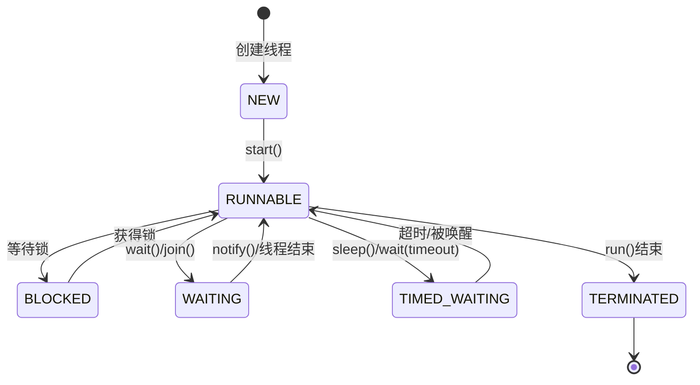

# 多线程基础篇

> **目标**：理解线程的核心概念，掌握线程创建、同步和通信的基本方式，知道在 Android 中哪里会用到。

## 一、为什么需要多线程？

### 技术演进：从单线程到多线程

想象一下你在餐厅点餐：

```
单线程餐厅 🍽️
├── 服务员接单 → 服务员做菜 → 服务员上菜 → 服务员收钱
├── 一个服务员干所有事，效率极低
└── 一个客人在等，其他客人全都得排队

多线程餐厅 🍽️🍽️🍽️
├── 服务员1：接单、上菜、收钱（IO 密集型）
├── 厨师1-3：专心做菜（CPU 密集型）
└── 多人协作，效率大大提升
```

在 Android 中，这个问题更加致命：

```kotlin
// ❌ 单线程的痛苦：在主线程做网络请求
class MainActivity : AppCompatActivity() {
    override fun onCreate(savedInstanceState: Bundle?) {
        super.onCreate(savedInstanceState)
        
        // 这行代码会导致 ANR（Application Not Responding）
        // Android 规定：主线程不能执行超过 5 秒的操作
        val data = URL("https://api.example.com/data").readText()  // 💥 卡死 UI！
        
        textView.text = data
    }
}
```

**为什么 Android 主线程不能做耗时操作？**

```
用户点击按钮 → 主线程处理点击 → 主线程在做网络请求...
                                    ↑
                                卡在这里！
                                    
用户再点击 → 没反应...
用户再点击 → 没反应...
5秒后 → ANR 弹窗："应用无响应"
```

所以 Android 强制要求：**耗时操作必须放到子线程**。

### Android 中的线程场景

| 场景 | 线程类型 | Android 实现方式 |
|-----|--------|-----------------|
| UI 更新 | 主线程 | 只有主线程能更新 UI |
| 网络请求 | 子线程 | OkHttp 内部线程池 |
| 数据库操作 | 子线程 | Room + 协程 |
| 文件读写 | 子线程 | 协程 Dispatchers.IO |
| 图片加载 | 子线程 | Glide 内部线程池 |
| 定时任务 | 子线程 | Handler + HandlerThread |

## 二、线程的创建方式

### 2.1 继承 Thread 类

```kotlin
// 方式1：继承 Thread（不推荐，Java 单继承限制）
class MyThread : Thread() {
    override fun run() {
        // 子线程执行的代码
        Log.d("Thread", "当前线程: ${currentThread().name}")
    }
}

// 使用
val thread = MyThread()
thread.start()  // 注意：是 start() 不是 run()
```

**为什么调用 start() 而不是 run()？**

```kotlin
// ❌ 错误：直接调用 run()
thread.run()  // 这只是普通方法调用，还是在主线程执行！

// ✅ 正确：调用 start()
thread.start()  // 这才会创建新线程，在新线程中执行 run()
```

### 2.2 实现 Runnable 接口

```kotlin
// 方式2：实现 Runnable（推荐）
class MyRunnable : Runnable {
    override fun run() {
        Log.d("Thread", "当前线程: ${Thread.currentThread().name}")
    }
}

// 使用
val thread = Thread(MyRunnable())
thread.start()

// Kotlin 简化写法（更常用）
Thread {
    Log.d("Thread", "当前线程: ${Thread.currentThread().name}")
}.start()
```

**为什么 Runnable 比继承 Thread 好？**

```kotlin
// 原因1：Runnable 可以避免单继承限制
class MyActivity : AppCompatActivity(), Runnable {  // ✅ 可以同时继承 Activity
    override fun run() { ... }
}

// 原因2：Runnable 可以被线程池复用
val executor = Executors.newFixedThreadPool(4)
executor.execute(MyRunnable())  // 同一个 Runnable 可以提交多次
executor.execute(MyRunnable())

// 原因3：更好的解耦，任务和线程分离
val task = Runnable { doSomething() }
Thread(task).start()        // 可以用新线程执行
executor.execute(task)      // 也可以用线程池执行
```

### 2.3 实现 Callable 接口（有返回值）

```kotlin
// 方式3：Callable + Future（需要返回结果时用）
class DownloadTask : Callable<String> {
    override fun call(): String {
        // 模拟下载
        Thread.sleep(2000)
        return "下载完成的数据"
    }
}

// 使用
val executor = Executors.newSingleThreadExecutor()
val future: Future<String> = executor.submit(DownloadTask())

// 获取结果（会阻塞当前线程）
val result = future.get()  // 等待任务完成，拿到返回值
Log.d("Thread", "结果: $result")

executor.shutdown()
```

**Runnable vs Callable**

| 特性 | Runnable | Callable |
|-----|----------|----------|
| 返回值 | 无 (void) | 有 (泛型 V) |
| 异常 | 只能内部处理 | 可以抛出异常 |
| 使用方式 | Thread、Executor | 只能用 Executor |
| 适用场景 | 不关心结果的任务 | 需要获取结果的任务 |

### 2.4 Android 中的最佳实践

```kotlin
// ❌ 不推荐：直接 new Thread（难以管理，可能导致内存泄漏）
Thread {
    val data = fetchData()
    runOnUiThread {
        textView.text = data
    }
}.start()

// ✅ 推荐：使用协程（现代 Android 开发标准）
class MainActivity : AppCompatActivity() {
    override fun onCreate(savedInstanceState: Bundle?) {
        super.onCreate(savedInstanceState)
        
        // lifecycleScope 会自动跟随 Activity 生命周期
        // Activity 销毁时自动取消，不会内存泄漏
        lifecycleScope.launch {
            val data = withContext(Dispatchers.IO) {
                fetchData()  // 在 IO 线程执行
            }
            textView.text = data  // 自动切回主线程更新 UI
        }
    }
}

// ✅ 也推荐：使用 ViewModel + 协程
class MyViewModel : ViewModel() {
    private val _data = MutableLiveData<String>()
    val data: LiveData<String> = _data
    
    fun loadData() {
        viewModelScope.launch {
            val result = withContext(Dispatchers.IO) {
                repository.fetchData()
            }
            _data.value = result
        }
    }
}
```

## 三、线程的生命周期

### 3.1 六种线程状态



**用大白话解释**：

| 状态 | 大白话 | Android 例子 |
|-----|-------|-------------|
| **NEW** | 刚创建，还没开始干活 | `Thread()` 刚 new 出来 |
| **RUNNABLE** | 在干活或者排队等 CPU | 正在执行网络请求 |
| **BLOCKED** | 想进门，但门被锁了 | 等待 synchronized 锁 |
| **WAITING** | 主动休息，等人叫我 | 调用了 wait() |
| **TIMED_WAITING** | 休息一会，定个闹钟 | 调用了 sleep(1000) |
| **TERMINATED** | 活干完了，退休了 | run() 方法执行完毕 |

### 3.2 状态转换示例

```kotlin
// 演示线程状态变化
fun demonstrateThreadStates() {
    val lock = Object()
    
    val thread = Thread {
        // 2. RUNNABLE：开始执行
        Log.d("State", "开始执行")
        
        synchronized(lock) {
            // 3. 如果锁被占用，会进入 BLOCKED
            try {
                // 4. WAITING：等待被唤醒
                lock.wait()
            } catch (e: InterruptedException) {
                e.printStackTrace()
            }
        }
        
        // 5. TIMED_WAITING：睡眠
        Thread.sleep(1000)
        
        // 6. TERMINATED：执行完毕
        Log.d("State", "执行完毕")
    }
    
    // 1. NEW：刚创建
    Log.d("State", "线程状态: ${thread.state}")  // NEW
    
    thread.start()
    
    Thread.sleep(100)  // 等一下让线程进入 wait
    Log.d("State", "线程状态: ${thread.state}")  // WAITING
    
    synchronized(lock) {
        lock.notify()  // 唤醒线程
    }
}
```

## 四、线程同步机制

### 4.1 为什么需要同步？

```kotlin
// ❌ 经典的线程安全问题
class Counter {
    var count = 0
    
    fun increment() {
        count++  // 这不是原子操作！
    }
}

// 问题演示
val counter = Counter()
val threads = List(100) {
    Thread {
        repeat(1000) {
            counter.increment()
        }
    }
}
threads.forEach { it.start() }
threads.forEach { it.join() }

// 期望结果：100000
// 实际结果：可能是 97856、98234... 每次都不一样！

// 为什么？count++ 其实是三步操作：
// 1. 读取 count 的值
// 2. 加 1
// 3. 写回 count
// 多线程同时执行时，这三步可能交叉，导致数据丢失
```

**用生活例子解释**：

```
两个人同时往银行账户存钱（账户余额 1000）：

线程A（存100）           线程B（存200）
读取余额：1000           读取余额：1000    ← 同时读到 1000
计算：1000+100=1100     计算：1000+200=1200
写入：1100               写入：1200        ← B 覆盖了 A 的结果

最终余额：1200（丢失了 100 块！）
正确应该是：1300
```

### 4.2 synchronized 关键字

```kotlin
// ✅ 使用 synchronized 解决线程安全问题
class SafeCounter {
    private var count = 0
    
    // 方式1：同步方法
    @Synchronized
    fun increment() {
        count++
    }
    
    // 方式2：同步代码块（更灵活）
    private val lock = Any()
    fun incrementWithBlock() {
        synchronized(lock) {
            count++
        }
    }
    
    fun getCount(): Int = count
}

// Android 实际场景：单例模式
object Singleton {
    // Kotlin 的 object 天然线程安全
    // 因为 Kotlin 编译器会用 synchronized 保证初始化
}

// 双重检查锁（DCL）单例 - 面试常问
class Singleton private constructor() {
    companion object {
        @Volatile  // 禁止指令重排序，保证可见性
        private var instance: Singleton? = null
        
        fun getInstance(): Singleton {
            if (instance == null) {  // 第一次检查，避免不必要的同步
                synchronized(this) {
                    if (instance == null) {  // 第二次检查，防止重复创建
                        instance = Singleton()
                    }
                }
            }
            return instance!!
        }
    }
}
```

**synchronized 的原理**（简化版）：

```
synchronized 就像厕所的门锁 🚪🔐

线程A 进入 synchronized：
1. 尝试获取锁 → 成功，把门锁上
2. 执行代码
3. 执行完毕，把门打开

线程B 进入 synchronized：
1. 尝试获取锁 → 失败，门锁着呢
2. 排队等待（BLOCKED 状态）
3. 线程A 开门后，线程B 获取锁，进去执行
```

### 4.3 volatile 关键字

```kotlin
// volatile 解决的问题：可见性
class VolatileDemo {
    // 没有 volatile，可能导致死循环
    // private var running = true
    
    // 有 volatile，保证一个线程的修改对其他线程可见
    @Volatile
    private var running = true
    
    fun start() {
        Thread {
            while (running) {
                // 如果 running 没有 volatile
                // 这个线程可能一直看到 running = true（从 CPU 缓存读取）
                // 即使主线程已经把它改成 false
            }
            Log.d("Demo", "线程停止")
        }.start()
    }
    
    fun stop() {
        running = false  // 主线程修改
    }
}
```

**volatile vs synchronized**

| 特性 | volatile | synchronized |
|-----|----------|--------------|
| 保证可见性 | ✅ | ✅ |
| 保证原子性 | ❌ | ✅ |
| 保证有序性 | ✅（禁止重排序） | ✅ |
| 性能 | 较好 | 较差 |
| 使用场景 | 状态标记、DCL | 临界区保护 |

```kotlin
// volatile 不能保证原子性的例子
@Volatile
var count = 0

// ❌ 这样还是线程不安全
fun increment() {
    count++  // volatile 不能保证 ++ 的原子性
}

// ✅ 需要用 AtomicInteger
val atomicCount = AtomicInteger(0)

fun safeIncrement() {
    atomicCount.incrementAndGet()  // 原子操作
}
```

### 4.4 Lock 接口（ReentrantLock）

```kotlin
// Lock 比 synchronized 更灵活
class LockDemo {
    private val lock = ReentrantLock()
    private var count = 0
    
    fun increment() {
        lock.lock()  // 获取锁
        try {
            count++
        } finally {
            lock.unlock()  // 一定要在 finally 中释放锁！
        }
    }
    
    // Lock 的优势1：可以尝试获取锁
    fun tryIncrement(): Boolean {
        if (lock.tryLock()) {  // 尝试获取，获取不到立即返回 false
            try {
                count++
                return true
            } finally {
                lock.unlock()
            }
        }
        return false
    }
    
    // Lock 的优势2：可以设置超时
    fun incrementWithTimeout(): Boolean {
        if (lock.tryLock(1, TimeUnit.SECONDS)) {  // 最多等 1 秒
            try {
                count++
                return true
            } finally {
                lock.unlock()
            }
        }
        return false
    }
    
    // Lock 的优势3：可中断的锁等待
    fun interruptibleIncrement() {
        try {
            lock.lockInterruptibly()  // 等待时可以被中断
            try {
                count++
            } finally {
                lock.unlock()
            }
        } catch (e: InterruptedException) {
            // 等待被中断
        }
    }
}
```

**synchronized vs Lock**

| 特性 | synchronized | Lock |
|-----|--------------|------|
| 获取锁 | 自动 | 手动 lock() |
| 释放锁 | 自动（出作用域） | 手动 unlock() |
| 可中断等待 | ❌ | ✅ lockInterruptibly() |
| 超时等待 | ❌ | ✅ tryLock(timeout) |
| 公平锁 | ❌ | ✅ new ReentrantLock(true) |
| 条件变量 | wait/notify | Condition |
| 性能 | JDK 6 后差不多 | 差不多 |
| **推荐** | 简单场景 | 复杂场景 |

## 五、线程通信

### 5.1 wait/notify 机制

```kotlin
// 生产者-消费者模式（经典线程通信场景）
class ProducerConsumer {
    private val queue = LinkedList<Int>()
    private val maxSize = 10
    private val lock = Object()
    
    // 生产者
    fun produce(item: Int) {
        synchronized(lock) {
            // 队列满了，等待消费者消费
            while (queue.size >= maxSize) {
                lock.wait()  // 释放锁，进入等待
            }
            queue.add(item)
            Log.d("Producer", "生产: $item, 队列大小: ${queue.size}")
            lock.notifyAll()  // 唤醒消费者
        }
    }
    
    // 消费者
    fun consume(): Int {
        synchronized(lock) {
            // 队列空了，等待生产者生产
            while (queue.isEmpty()) {
                lock.wait()  // 释放锁，进入等待
            }
            val item = queue.removeFirst()
            Log.d("Consumer", "消费: $item, 队列大小: ${queue.size}")
            lock.notifyAll()  // 唤醒生产者
            return item
        }
    }
}
```

**为什么用 while 而不是 if？**

```kotlin
// ❌ 错误：用 if
if (queue.isEmpty()) {
    lock.wait()
}
// 问题：被唤醒后不再检查条件，可能队列还是空的（虚假唤醒）

// ✅ 正确：用 while
while (queue.isEmpty()) {
    lock.wait()
}
// 被唤醒后会再次检查条件，确保条件真的满足
```

### 5.2 Android 中的 Handler 机制

```kotlin
// Handler 就是 Android 版的线程通信机制
// 子线程 → Handler → 主线程

class MainActivity : AppCompatActivity() {
    
    // 主线程的 Handler
    private val handler = Handler(Looper.getMainLooper()) { msg ->
        // 处理消息（在主线程执行）
        when (msg.what) {
            MSG_UPDATE_UI -> {
                val data = msg.obj as String
                textView.text = data
            }
        }
        true
    }
    
    override fun onCreate(savedInstanceState: Bundle?) {
        super.onCreate(savedInstanceState)
        
        // 在子线程执行耗时操作
        Thread {
            val data = fetchDataFromNetwork()  // 耗时操作
            
            // 通过 Handler 发送消息到主线程
            val msg = Message.obtain().apply {
                what = MSG_UPDATE_UI
                obj = data
            }
            handler.sendMessage(msg)
        }.start()
    }
    
    companion object {
        private const val MSG_UPDATE_UI = 1
    }
}

// Handler 的本质就是：
// 1. MessageQueue：消息队列（用 wait/notify 实现等待）
// 2. Looper：不断从队列取消息（无限循环）
// 3. Handler：发送消息、处理消息
```

### 5.3 join() 方法

```kotlin
// join：等待另一个线程执行完毕
fun demonstrateJoin() {
    val thread1 = Thread {
        Thread.sleep(2000)
        Log.d("Thread", "线程1 完成")
    }
    
    val thread2 = Thread {
        Thread.sleep(1000)
        Log.d("Thread", "线程2 完成")
    }
    
    thread1.start()
    thread2.start()
    
    // 等待两个线程都执行完
    thread1.join()  // 阻塞当前线程，直到 thread1 执行完
    thread2.join()
    
    Log.d("Thread", "所有线程都完成了")
}

// Android 实际场景：启动优化
// 等待多个初始化任务完成后再进入主界面
class SplashActivity : AppCompatActivity() {
    override fun onCreate(savedInstanceState: Bundle?) {
        super.onCreate(savedInstanceState)
        
        lifecycleScope.launch {
            // 并行执行多个初始化任务
            val jobs = listOf(
                async(Dispatchers.IO) { initDatabase() },
                async(Dispatchers.IO) { initNetwork() },
                async(Dispatchers.IO) { initCache() }
            )
            
            // 等待所有任务完成
            jobs.awaitAll()  // 协程版的 "join"
            
            // 跳转主界面
            startActivity(Intent(this@SplashActivity, MainActivity::class.java))
            finish()
        }
    }
}
```

## 六、ThreadLocal 详解

### 6.1 什么是 ThreadLocal？

```kotlin
// ThreadLocal：每个线程都有自己的变量副本
// 就像每个人都有自己的储物柜，互不影响

val threadLocal = ThreadLocal<String>()

fun demonstrateThreadLocal() {
    threadLocal.set("主线程的值")
    
    Thread {
        threadLocal.set("线程1的值")
        Log.d("ThreadLocal", "线程1: ${threadLocal.get()}")  // 线程1的值
    }.start()
    
    Thread {
        threadLocal.set("线程2的值")
        Log.d("ThreadLocal", "线程2: ${threadLocal.get()}")  // 线程2的值
    }.start()
    
    Thread.sleep(100)
    Log.d("ThreadLocal", "主线程: ${threadLocal.get()}")  // 主线程的值
    
    // 三个线程各自有各自的值，互不影响
}
```

### 6.2 Android 中的 ThreadLocal 应用

```kotlin
// Android 最经典的 ThreadLocal 应用：Looper
// 每个线程最多只有一个 Looper

// Looper 源码简化版
class Looper private constructor() {
    companion object {
        // ThreadLocal 存储每个线程的 Looper
        private val sThreadLocal = ThreadLocal<Looper>()
        
        fun prepare() {
            if (sThreadLocal.get() != null) {
                throw RuntimeException("每个线程只能有一个 Looper！")
            }
            sThreadLocal.set(Looper())
        }
        
        fun myLooper(): Looper? {
            return sThreadLocal.get()  // 获取当前线程的 Looper
        }
    }
}

// 为什么用 ThreadLocal？
// 1. 线程隔离：每个线程有自己的 Looper，互不干扰
// 2. 无需传参：任何地方都可以通过 Looper.myLooper() 获取当前线程的 Looper
// 3. 生命周期绑定：Looper 跟随线程生命周期
```

### 6.3 ThreadLocal 内存泄漏问题

```kotlin
// ThreadLocal 可能导致内存泄漏（在使用线程池时）

class ThreadLocalLeakDemo {
    // 线程池中的线程是复用的
    private val executor = Executors.newFixedThreadPool(2)
    private val threadLocal = ThreadLocal<ByteArray>()
    
    fun task() {
        executor.execute {
            // 存入一个大对象
            threadLocal.set(ByteArray(10 * 1024 * 1024))  // 10MB
            
            // ... 执行任务
            
            // ❌ 忘记清理！
            // 线程池的线程不会销毁，ThreadLocal 中的大对象一直存在
        }
    }
    
    fun safeTask() {
        executor.execute {
            try {
                threadLocal.set(ByteArray(10 * 1024 * 1024))
                // ... 执行任务
            } finally {
                // ✅ 一定要清理！
                threadLocal.remove()
            }
        }
    }
}

// 最佳实践：在 Android 中使用协程，避免直接使用 ThreadLocal
// 协程有 CoroutineContext，可以实现类似的线程隔离效果
```

## 七、面试检验

### 基础题

**Q1：创建线程有几种方式？**

> **结论**：3 种主要方式 + 线程池。
> 
> **原理**：
> - 继承 Thread：重写 run()，单继承限制
> - 实现 Runnable：更灵活，可配合线程池
> - 实现 Callable：有返回值，可抛异常
> - 线程池：实际开发推荐
> 
> **Android 实例**：现代 Android 开发推荐用协程，底层是线程池。OkHttp、Glide 都有自己的线程池。

**Q2：start() 和 run() 有什么区别？**

> **结论**：start() 创建新线程执行，run() 只是普通方法调用。
> 
> **原理**：
> - start()：JVM 创建新线程，新线程执行 run()
> - run()：当前线程执行，没有创建新线程
> 
> **Android 实例**：
> ```kotlin
> Thread { networkRequest() }.run()   // ❌ 在主线程执行，会 ANR
> Thread { networkRequest() }.start() // ✅ 在新线程执行
> ```

**Q3：synchronized 和 volatile 有什么区别？**

> **结论**：synchronized 保证原子性+可见性，volatile 只保证可见性。
> 
> **原理**：
> - synchronized：互斥锁，同一时刻只有一个线程能进入
> - volatile：强制从主内存读写，禁止指令重排序
> 
> **Android 实例**：DCL 单例模式需要 volatile + synchronized 配合：
> ```kotlin
> @Volatile
> private var instance: Singleton? = null
> 
> fun getInstance(): Singleton {
>     if (instance == null) {
>         synchronized(this) {
>             if (instance == null) {
>                 instance = Singleton()
>             }
>         }
>     }
>     return instance!!
> }
> ```

**Q4：为什么 wait/notify 要在 synchronized 块中调用？**

> **结论**：因为 wait/notify 操作的是对象的监视器锁（Monitor），必须先持有锁。
> 
> **原理**：
> - wait()：释放锁，进入等待队列
> - notify()：唤醒等待队列中的线程
> - 如果没有锁，这些操作无法执行
> 
> **Android 实例**：MessageQueue 的 next() 方法就是用 wait/notify 实现消息等待的。

**Q5：ThreadLocal 有什么作用？会导致内存泄漏吗？**

> **结论**：实现线程隔离；在线程池中使用如果不 remove() 会泄漏。
> 
> **原理**：
> - ThreadLocal 为每个线程维护一个变量副本
> - 线程池中线程会复用，如果不清理，数据会残留
> 
> **Android 实例**：
> - Looper 用 ThreadLocal 实现"一个线程一个 Looper"
> - 使用线程池时，务必在 finally 中调用 remove()

---

_下一篇：[2-进阶篇](./2-进阶篇.md) - 深入线程池，掌握并发工具类 →_
