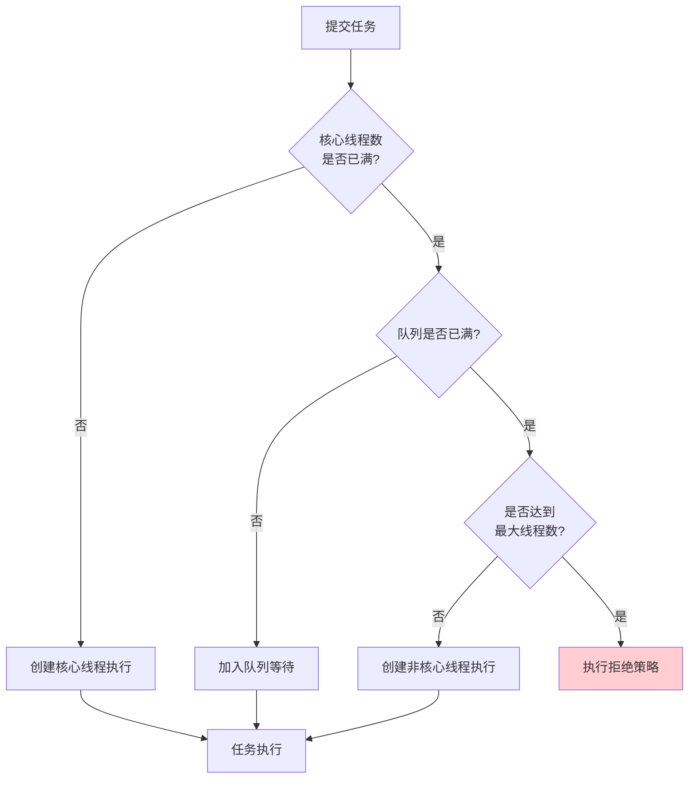

# 多线程进阶篇

> **目标**：深入理解线程池的设计原理，掌握并发工具类，了解在 Android 中的最佳实践。

## 一、为什么需要线程池？

### 直接 new Thread 的问题

```kotlin
// ❌ 不推荐：每次都 new Thread
class BadPractice {
    fun loadImages(urls: List<String>) {
        urls.forEach { url ->
            Thread {
                downloadImage(url)
            }.start()
        }
        // 问题1：100 个 URL 就创建 100 个线程，系统资源耗尽
        // 问题2：线程创建和销毁都有开销，频繁创建很慢
        // 问题3：无法统一管理，难以取消任务
        // 问题4：可能导致 OOM（OutOfMemoryError）
    }
}
```

**用生活例子解释**：

```
直接 new Thread 就像：
每来一个客人，就招聘一个新服务员，客人走了就辞退
→ 招聘成本高（线程创建开销）
→ 辞退成本高（线程销毁开销）
→ 人太多餐厅挤不下（内存不足）

线程池就像：
餐厅固定 10 个服务员，忙的时候排队，闲的时候待命
→ 无招聘/辞退成本（线程复用）
→ 人数可控（资源可控）
→ 统一管理（任务调度）
```

### 线程池的优势

```kotlin
// ✅ 推荐：使用线程池
class GoodPractice {
    // 创建一个固定大小的线程池
    private val executor = Executors.newFixedThreadPool(4)
    
    fun loadImages(urls: List<String>) {
        urls.forEach { url ->
            executor.execute {
                downloadImage(url)
            }
        }
        // 优势1：最多 4 个线程并发，不会资源耗尽
        // 优势2：线程复用，性能更好
        // 优势3：统一管理，方便取消
    }
    
    fun shutdown() {
        executor.shutdown()  // 优雅关闭
    }
}
```

## 二、线程池核心参数

### 2.1 ThreadPoolExecutor 构造函数

```kotlin
// 线程池的完整构造函数
val executor = ThreadPoolExecutor(
    corePoolSize,      // 核心线程数：常驻员工
    maximumPoolSize,   // 最大线程数：常驻 + 临时员工
    keepAliveTime,     // 空闲时间：临时员工的待命时间
    timeUnit,          // 时间单位
    workQueue,         // 任务队列：等候区
    threadFactory,     // 线程工厂：员工培训部门
    rejectedHandler    // 拒绝策略：客满时怎么办
)
```

**用餐厅类比理解参数**：

```
ThreadPoolExecutor 就像一个餐厅 🍽️

corePoolSize = 4        → 4 个正式服务员（不会辞退）
maximumPoolSize = 8     → 最多 8 个服务员（包含 4 个临时工）
keepAliveTime = 60s     → 临时工闲置 60 秒后辞退
workQueue = 容量 10     → 等候区最多 10 人排队
rejectedHandler         → 等候区满了怎么办（拒绝/让主管处理/丢弃最老的）
```

### 2.2 任务提交流程



```kotlin
// 用代码演示任务提交流程
fun demonstrateThreadPool() {
    val executor = ThreadPoolExecutor(
        2,      // 核心线程数
        4,      // 最大线程数
        60L, TimeUnit.SECONDS,
        LinkedBlockingQueue(2),  // 队列容量 2
        ThreadPoolExecutor.AbortPolicy()  // 拒绝策略
    )
    
    // 提交 6 个任务，观察流程
    repeat(6) { i ->
        try {
            executor.execute {
                Log.d("Pool", "任务 $i 开始，线程: ${Thread.currentThread().name}")
                Thread.sleep(2000)  // 模拟耗时
                Log.d("Pool", "任务 $i 结束")
            }
            Log.d("Pool", "任务 $i 提交成功，" +
                "活跃线程: ${executor.activeCount}，" +
                "队列大小: ${executor.queue.size}")
        } catch (e: RejectedExecutionException) {
            Log.e("Pool", "任务 $i 被拒绝！")
        }
    }
    
    // 执行流程：
    // 任务0：核心线程1执行
    // 任务1：核心线程2执行（核心线程满）
    // 任务2：加入队列（队列位置1）
    // 任务3：加入队列（队列位置2，队列满）
    // 任务4：创建非核心线程3执行
    // 任务5：创建非核心线程4执行（达到最大）
    // 任务6：被拒绝！
}
```

### 2.3 四种拒绝策略

```kotlin
// 当线程池和队列都满了，怎么处理新任务？

// 1. AbortPolicy：直接抛异常（默认）
ThreadPoolExecutor.AbortPolicy()
// "客满了，不好意思，您请回吧"

// 2. CallerRunsPolicy：让调用者自己执行
ThreadPoolExecutor.CallerRunsPolicy()
// "客满了，老板你自己上吧"（可能阻塞主线程！）

// 3. DiscardPolicy：默默丢弃，不抛异常
ThreadPoolExecutor.DiscardPolicy()
// "假装没看到这个客人"

// 4. DiscardOldestPolicy：丢弃队列最老的任务
ThreadPoolExecutor.DiscardOldestPolicy()
// "让等最久的那位客人走，新客人进来"

// Android 实际场景的选择
class ImageLoader {
    private val executor = ThreadPoolExecutor(
        4, 8,
        60L, TimeUnit.SECONDS,
        LinkedBlockingQueue(100),
        // 图片加载用 DiscardOldestPolicy
        // 因为用户滑动时，旧的图片请求可以丢弃
        ThreadPoolExecutor.DiscardOldestPolicy()
    )
}
```

## 三、四种常用线程池

### 3.1 FixedThreadPool（固定大小）

```kotlin
// 创建固定大小的线程池
val fixedPool = Executors.newFixedThreadPool(4)

// 等价于
val fixedPoolManual = ThreadPoolExecutor(
    4, 4,  // 核心 = 最大，不会创建临时线程
    0L, TimeUnit.MILLISECONDS,
    LinkedBlockingQueue()  // 无界队列！
)

// 特点：
// 1. 线程数固定，不会增减
// 2. 队列无界，可能导致 OOM
// 3. 适合负载稳定的场景

// Android 场景：后台数据同步
class DataSyncManager {
    // 固定 2 个线程做数据同步
    private val syncExecutor = Executors.newFixedThreadPool(2)
    
    fun syncData(data: Data) {
        syncExecutor.execute {
            // 同步到服务器
            api.uploadData(data)
        }
    }
}
```

### 3.2 CachedThreadPool（缓存线程池）

```kotlin
// 创建缓存线程池
val cachedPool = Executors.newCachedThreadPool()

// 等价于
val cachedPoolManual = ThreadPoolExecutor(
    0, Int.MAX_VALUE,  // 核心为 0，最大无限
    60L, TimeUnit.SECONDS,  // 空闲 60 秒回收
    SynchronousQueue()  // 不存储任务，直接交给线程
)

// 特点：
// 1. 来一个任务就创建一个线程
// 2. 空闲 60 秒后回收
// 3. 理论上可以无限创建线程，可能 OOM

// ⚠️ Android 中慎用！
// 大量任务会创建大量线程，导致 OOM
```

### 3.3 SingleThreadExecutor（单线程）

```kotlin
// 创建单线程池
val singlePool = Executors.newSingleThreadExecutor()

// 特点：
// 1. 只有一个线程，任务串行执行
// 2. 保证任务顺序执行
// 3. 线程挂了会创建新的

// Android 场景：数据库写操作
class DatabaseManager {
    // 数据库写操作用单线程，避免并发问题
    private val writeExecutor = Executors.newSingleThreadExecutor()
    
    fun insert(data: Data) {
        writeExecutor.execute {
            database.insert(data)  // 保证顺序执行
        }
    }
    
    fun update(data: Data) {
        writeExecutor.execute {
            database.update(data)  // 在 insert 之后执行
        }
    }
}
```

### 3.4 ScheduledThreadPool（定时任务）

```kotlin
// 创建定时任务线程池
val scheduledPool = Executors.newScheduledThreadPool(2)

// 延迟执行
scheduledPool.schedule({
    Log.d("Scheduled", "延迟 3 秒后执行")
}, 3, TimeUnit.SECONDS)

// 固定频率执行（上一个任务开始后，固定间隔启动下一个）
scheduledPool.scheduleAtFixedRate({
    Log.d("Scheduled", "每 5 秒执行一次")
}, 0, 5, TimeUnit.SECONDS)

// 固定延迟执行（上一个任务结束后，固定延迟启动下一个）
scheduledPool.scheduleWithFixedDelay({
    Log.d("Scheduled", "上一个结束后 5 秒再执行")
}, 0, 5, TimeUnit.SECONDS)

// Android 场景：心跳检测
class HeartbeatManager {
    private val scheduler = Executors.newScheduledThreadPool(1)
    
    fun startHeartbeat() {
        scheduler.scheduleAtFixedRate({
            sendHeartbeat()
        }, 0, 30, TimeUnit.SECONDS)  // 每 30 秒发一次心跳
    }
    
    fun stopHeartbeat() {
        scheduler.shutdown()
    }
}
```

### 线程池选择总结

| 线程池 | 核心线程 | 最大线程 | 队列 | 适用场景 |
|-------|---------|---------|-----|---------|
| **FixedThreadPool** | n | n | 无界 | CPU 密集型，负载稳定 |
| **CachedThreadPool** | 0 | ∞ | 无存储 | 大量短时任务（Android 慎用） |
| **SingleThreadExecutor** | 1 | 1 | 无界 | 顺序执行，如数据库写 |
| **ScheduledThreadPool** | n | ∞ | 无界 | 定时/周期任务 |

## 四、线程池参数如何设置？

### 4.1 CPU 密集型 vs IO 密集型

```kotlin
// CPU 密集型：计算为主，如图像处理、加密解密
// 线程数 = CPU 核心数 + 1
val cpuIntensivePool = ThreadPoolExecutor(
    Runtime.getRuntime().availableProcessors() + 1,
    Runtime.getRuntime().availableProcessors() + 1,
    0L, TimeUnit.MILLISECONDS,
    LinkedBlockingQueue()
)

// IO 密集型：等待为主，如网络请求、文件读写
// 线程数 = CPU 核心数 * 2（或更多）
val ioIntensivePool = ThreadPoolExecutor(
    Runtime.getRuntime().availableProcessors() * 2,
    Runtime.getRuntime().availableProcessors() * 2,
    60L, TimeUnit.SECONDS,
    LinkedBlockingQueue()
)

// 为什么这样设置？
// CPU 密集型：线程一直在计算，多了反而增加上下文切换开销
// IO 密集型：线程大部分时间在等待，多一些线程可以利用等待时间
```

### 4.2 Android 中的线程池配置

```kotlin
// OkHttp 的线程池配置
// 源码：okhttp3.Dispatcher
class Dispatcher {
    // 最大并发请求数
    var maxRequests = 64
    // 每个 host 最大并发数
    var maxRequestsPerHost = 5
    
    // 线程池：CachedThreadPool 变体
    private val executorService = ThreadPoolExecutor(
        0, Int.MAX_VALUE,
        60, TimeUnit.SECONDS,
        SynchronousQueue(),
        threadFactory("OkHttp Dispatcher", false)
    )
}

// Glide 的线程池配置
// 源码：GlideExecutor
class GlideExecutor {
    companion object {
        // 磁盘缓存线程池：1 个线程
        fun newDiskCacheExecutor(): GlideExecutor {
            return GlideExecutor(
                1,  // 核心线程
                1,  // 最大线程
                "disk-cache"
            )
        }
        
        // 图片加载线程池：CPU 核心数（最少 4 个）
        fun newSourceExecutor(): GlideExecutor {
            val cpuCount = Runtime.getRuntime().availableProcessors()
            val threadCount = max(4, cpuCount)
            return GlideExecutor(threadCount, threadCount, "source")
        }
    }
}

// 自己项目的推荐配置
object AppExecutors {
    // IO 操作：网络、文件
    val ioExecutor: ExecutorService = ThreadPoolExecutor(
        4,
        max(4, Runtime.getRuntime().availableProcessors()),
        60L, TimeUnit.SECONDS,
        LinkedBlockingQueue(128),
        ThreadFactory { r -> Thread(r, "io-pool") }
    )
    
    // CPU 密集型：图片处理、加密
    val computeExecutor: ExecutorService = ThreadPoolExecutor(
        Runtime.getRuntime().availableProcessors(),
        Runtime.getRuntime().availableProcessors(),
        0L, TimeUnit.MILLISECONDS,
        LinkedBlockingQueue(64),
        ThreadFactory { r -> Thread(r, "compute-pool") }
    )
    
    // 单线程：数据库、SharedPreferences
    val singleExecutor: ExecutorService = Executors.newSingleThreadExecutor {
        Thread(it, "single-pool")
    }
}
```

## 五、并发工具类

### 5.1 CountDownLatch（倒计时门闩）

```kotlin
// CountDownLatch：等待多个任务完成
// 就像跑步比赛，等所有人到终点才宣布结束

class StartupOptimization {
    // 需要等待 3 个初始化任务完成
    private val latch = CountDownLatch(3)
    
    fun init() {
        val executor = Executors.newFixedThreadPool(3)
        
        // 任务1：初始化数据库
        executor.execute {
            initDatabase()
            latch.countDown()  // 完成一个，计数 -1
            Log.d("Init", "数据库初始化完成")
        }
        
        // 任务2：初始化网络
        executor.execute {
            initNetwork()
            latch.countDown()
            Log.d("Init", "网络初始化完成")
        }
        
        // 任务3：初始化缓存
        executor.execute {
            initCache()
            latch.countDown()
            Log.d("Init", "缓存初始化完成")
        }
        
        // 等待所有任务完成（计数变为 0）
        latch.await()  // 阻塞，直到 countDown 3 次
        
        Log.d("Init", "所有初始化完成，启动主界面")
        startMainActivity()
    }
    
    // 带超时的等待
    fun initWithTimeout() {
        val completed = latch.await(5, TimeUnit.SECONDS)
        if (completed) {
            startMainActivity()
        } else {
            Log.e("Init", "初始化超时！")
            showErrorPage()
        }
    }
}

// Android 启动优化实战
class SplashActivity : AppCompatActivity() {
    override fun onCreate(savedInstanceState: Bundle?) {
        super.onCreate(savedInstanceState)
        
        lifecycleScope.launch {
            // 使用协程实现类似效果（更推荐）
            val jobs = listOf(
                async(Dispatchers.IO) { initDatabase() },
                async(Dispatchers.IO) { initNetwork() },
                async(Dispatchers.IO) { initCache() }
            )
            
            // 等待所有任务，最多 5 秒
            withTimeoutOrNull(5000) {
                jobs.awaitAll()
            } ?: run {
                Log.e("Init", "初始化超时")
            }
            
            startActivity(Intent(this@SplashActivity, MainActivity::class.java))
            finish()
        }
    }
}
```

### 5.2 CyclicBarrier（循环栅栏）

```kotlin
// CyclicBarrier：让一组线程互相等待，都到达后一起继续
// 就像旅游团，等所有人到齐才出发，而且可以多轮

class CyclicBarrierDemo {
    // 3 个线程都到达后，执行 barrierAction，然后一起继续
    private val barrier = CyclicBarrier(3) {
        Log.d("Barrier", "所有线程到达，准备下一轮！")
    }
    
    fun runTask(taskId: Int) {
        Thread {
            repeat(3) { round ->
                Log.d("Task$taskId", "第 $round 轮开始")
                
                // 模拟不同时长的工作
                Thread.sleep((Math.random() * 1000).toLong())
                
                Log.d("Task$taskId", "第 $round 轮到达栅栏，等待其他线程")
                barrier.await()  // 等待其他线程
                
                Log.d("Task$taskId", "第 $round 轮继续执行")
            }
        }.start()
    }
}

// CountDownLatch vs CyclicBarrier
// CountDownLatch：一次性，用完就没了
// CyclicBarrier：可重用，可以多轮
```

### 5.3 Semaphore（信号量）

```kotlin
// Semaphore：控制同时访问资源的线程数
// 就像停车场只有 3 个车位，最多同时停 3 辆车

class SemaphoreDemo {
    // 最多允许 3 个线程同时访问
    private val semaphore = Semaphore(3)
    
    fun accessResource(threadId: Int) {
        Thread {
            Log.d("Thread$threadId", "尝试获取许可...")
            
            semaphore.acquire()  // 获取许可（如果没有，阻塞等待）
            try {
                Log.d("Thread$threadId", "获取许可，开始访问资源")
                Thread.sleep(2000)  // 模拟使用资源
            } finally {
                semaphore.release()  // 释放许可
                Log.d("Thread$threadId", "释放许可")
            }
        }.start()
    }
}

// Android 场景：限制并发请求数
class NetworkManager {
    // 最多 5 个并发请求
    private val requestSemaphore = Semaphore(5)
    private val executor = Executors.newCachedThreadPool()
    
    fun request(url: String, callback: (String) -> Unit) {
        executor.execute {
            requestSemaphore.acquire()
            try {
                val result = doRequest(url)
                callback(result)
            } finally {
                requestSemaphore.release()
            }
        }
    }
}
```

### 5.4 ConcurrentHashMap（并发安全 Map）

```kotlin
// ConcurrentHashMap：线程安全的 HashMap
// 比 Collections.synchronizedMap 性能更好

class CacheManager {
    // 线程安全的缓存
    private val cache = ConcurrentHashMap<String, Any>()
    
    fun put(key: String, value: Any) {
        cache[key] = value  // 线程安全
    }
    
    fun get(key: String): Any? {
        return cache[key]  // 线程安全
    }
    
    // 原子操作：如果不存在才放入
    fun putIfAbsent(key: String, value: Any): Any? {
        return cache.putIfAbsent(key, value)
    }
    
    // 原子操作：计算并更新
    fun incrementCount(key: String) {
        cache.compute(key) { _, v ->
            ((v as? Int) ?: 0) + 1
        }
    }
}

// 为什么比 synchronizedMap 性能好？
// synchronizedMap：整个 Map 加一把锁，所有操作串行
// ConcurrentHashMap：分段锁（JDK 7）或 CAS + synchronized（JDK 8+）
//                    只锁部分数据，并发性更好
```

### 5.5 BlockingQueue（阻塞队列）

```kotlin
// BlockingQueue：线程安全的队列，支持阻塞等待
// 生产者-消费者模式的最佳实现

class MessageProcessor {
    // 容量为 100 的阻塞队列
    private val queue = LinkedBlockingQueue<Message>(100)
    private val running = AtomicBoolean(true)
    
    // 生产者：发送消息
    fun sendMessage(message: Message) {
        // put：队列满了会阻塞等待
        queue.put(message)
        
        // offer：队列满了返回 false，不阻塞
        // val success = queue.offer(message)
        
        // offer with timeout：最多等待指定时间
        // val success = queue.offer(message, 1, TimeUnit.SECONDS)
    }
    
    // 消费者：处理消息
    fun startProcessing() {
        Thread {
            while (running.get()) {
                // take：队列空了会阻塞等待
                val message = queue.take()
                processMessage(message)
                
                // poll：队列空了返回 null，不阻塞
                // val message = queue.poll()
            }
        }.start()
    }
    
    fun stop() {
        running.set(false)
    }
}

// Android Handler 的 MessageQueue 就是一个类似的阻塞队列
// Looper.loop() 会调用 queue.next()，没有消息时阻塞等待
```

## 六、原子类

### 6.1 AtomicInteger

```kotlin
// AtomicInteger：原子操作的整数
// 比 synchronized 更轻量，性能更好

class AtomicDemo {
    // ❌ 线程不安全
    private var unsafeCount = 0
    
    // ✅ 线程安全：使用 AtomicInteger
    private val atomicCount = AtomicInteger(0)
    
    fun increment() {
        // CAS 操作：Compare And Swap
        atomicCount.incrementAndGet()  // 原子性 +1
    }
    
    fun decrement() {
        atomicCount.decrementAndGet()  // 原子性 -1
    }
    
    fun addAndGet(delta: Int): Int {
        return atomicCount.addAndGet(delta)  // 原子性加法
    }
    
    // CAS 操作示例
    fun compareAndSet() {
        // 如果当前值是 10，就设置为 20
        val success = atomicCount.compareAndSet(10, 20)
        // 如果当前值不是 10，返回 false，不修改
    }
}

// 其他原子类
val atomicLong = AtomicLong(0L)
val atomicBoolean = AtomicBoolean(false)
val atomicReference = AtomicReference<User>(null)
```

### 6.2 LongAdder（高并发计数器）

```kotlin
// LongAdder：高并发场景下比 AtomicLong 性能更好
// 内部使用分段的方式减少竞争

class HighConcurrencyCounter {
    // AtomicLong：所有线程竞争同一个变量
    private val atomicCount = AtomicLong(0)
    
    // LongAdder：内部分成多个 cell，减少竞争
    private val adderCount = LongAdder()
    
    fun increment() {
        adderCount.increment()
    }
    
    fun getCount(): Long {
        return adderCount.sum()  // 汇总所有 cell
    }
}

// 什么时候用 LongAdder？
// - 高并发、频繁更新的计数场景
// - 最终一致性即可，不需要精确的实时值
// Android 场景：统计 APP 启动次数、接口调用次数等
```

## 七、线程池与协程对比

### 7.1 代码风格对比

```kotlin
// 场景：先请求用户信息，再请求用户订单

// 方式1：线程池 + 回调（回调地狱）
class CallbackHell {
    private val executor = Executors.newCachedThreadPool()
    
    fun loadUserData(userId: String, callback: (User, List<Order>) -> Unit) {
        executor.execute {
            // 请求用户信息
            val user = api.getUser(userId)
            
            // 再请求订单（嵌套回调）
            executor.execute {
                val orders = api.getOrders(userId)
                
                // 切回主线程
                mainHandler.post {
                    callback(user, orders)
                }
            }
        }
    }
}

// 方式2：协程（同步风格）
class CoroutineStyle {
    suspend fun loadUserData(userId: String): Pair<User, List<Order>> {
        // 看起来像同步代码，实际是异步执行
        val user = withContext(Dispatchers.IO) {
            api.getUser(userId)
        }
        val orders = withContext(Dispatchers.IO) {
            api.getOrders(userId)
        }
        return user to orders
    }
    
    // 或者并行请求
    suspend fun loadUserDataParallel(userId: String): Pair<User, List<Order>> {
        return coroutineScope {
            val userDeferred = async(Dispatchers.IO) { api.getUser(userId) }
            val ordersDeferred = async(Dispatchers.IO) { api.getOrders(userId) }
            
            userDeferred.await() to ordersDeferred.await()
        }
    }
}
```

### 7.2 取消机制对比

```kotlin
// 线程池：手动管理取消
class ThreadPoolCancellation {
    private val executor = Executors.newSingleThreadExecutor()
    private var future: Future<*>? = null
    
    fun start() {
        future = executor.submit {
            while (!Thread.currentThread().isInterrupted) {
                // 需要手动检查中断状态
                doWork()
            }
        }
    }
    
    fun cancel() {
        future?.cancel(true)  // 需要手动取消
    }
}

// 协程：结构化并发，自动取消
class CoroutineCancellation : ViewModel() {
    fun start() {
        viewModelScope.launch {
            // ViewModel 销毁时自动取消
            while (isActive) {  // 协程提供的取消检查
                doWork()
            }
        }
    }
    
    // 不需要手动取消！
    // viewModelScope 会跟随 ViewModel 生命周期自动管理
}
```

### 7.3 异常处理对比

```kotlin
// 线程池：异常处理麻烦
class ThreadPoolException {
    private val executor = Executors.newSingleThreadExecutor()
    
    fun start() {
        executor.execute {
            try {
                doWork()
            } catch (e: Exception) {
                // 需要手动 try-catch
                // 而且无法直接传递给调用者
                mainHandler.post {
                    showError(e)
                }
            }
        }
    }
}

// 协程：异常处理优雅
class CoroutineException : ViewModel() {
    fun start() {
        viewModelScope.launch {
            try {
                val result = withContext(Dispatchers.IO) {
                    doWork()  // 如果抛异常，会传播到这里
                }
                showResult(result)
            } catch (e: Exception) {
                // 可以直接 catch 子协程的异常
                showError(e)
            }
        }
    }
}
```

### 7.4 总结对比

| 特性 | 线程池 | Kotlin 协程 |
|-----|-------|------------|
| 代码风格 | 回调 | 同步风格 |
| 切换开销 | 重（内核态） | 轻（用户态） |
| 取消机制 | 手动管理 | 结构化并发 |
| 异常处理 | try-catch 回调 | 正常 try-catch |
| 内存占用 | 较大（每线程 1MB 栈） | 较小（协程很轻量） |
| 学习曲线 | 平缓 | 有一定学习成本 |
| **Android 推荐** | 理解原理 | 实际开发 |

## 八、面试检验

### 进阶题

**Q1：线程池的核心参数有哪些？任务提交流程是怎样的？**

> **结论**：7 个核心参数，提交流程是核心线程→队列→非核心线程→拒绝策略。
> 
> **原理**：
> - corePoolSize：核心线程数，即使空闲也不回收
> - maximumPoolSize：最大线程数
> - keepAliveTime：非核心线程空闲存活时间
> - workQueue：任务队列
> - threadFactory：线程工厂
> - handler：拒绝策略
> 
> **Android 实例**：OkHttp 用 CachedThreadPool 处理请求，Glide 用 FixedThreadPool 加载图片。

**Q2：四种线程池的区别？Android 中怎么选？**

> **结论**：
> - FixedThreadPool：固定大小，适合稳定负载
> - CachedThreadPool：按需创建，可能 OOM，Android 慎用
> - SingleThreadExecutor：单线程，保证顺序
> - ScheduledThreadPool：定时任务
> 
> **Android 实例**：
> - 数据库写操作用 SingleThread
> - 图片加载用 Fixed（CPU 核心数）
> - 网络请求可以用 Cached 但要限制并发数

**Q3：线程池参数如何设置？**

> **结论**：
> - CPU 密集型：核心数 + 1
> - IO 密集型：核心数 * 2
> 
> **原理**：
> - CPU 密集型线程一直在计算，多了增加切换开销
> - IO 密集型线程大部分时间在等待，多线程可以利用等待时间
> 
> **Android 实例**：
> ```kotlin
> val cpuCount = Runtime.getRuntime().availableProcessors()
> val ioPool = ThreadPoolExecutor(cpuCount * 2, ...)
> val cpuPool = ThreadPoolExecutor(cpuCount + 1, ...)
> ```

**Q4：ConcurrentHashMap 为什么比 synchronizedMap 性能好？**

> **结论**：因为锁的粒度更细。
> 
> **原理**：
> - synchronizedMap：整个 Map 一把锁，所有操作串行
> - ConcurrentHashMap (JDK 8)：只锁单个节点，使用 CAS + synchronized
> - 大部分操作不需要加锁，只有冲突时才加锁
> 
> **Android 实例**：图片缓存、网络请求缓存都可以用 ConcurrentHashMap。

**Q5：CountDownLatch 和 CyclicBarrier 的区别？**

> **结论**：
> - CountDownLatch：一次性，等待其他线程完成
> - CyclicBarrier：可重用，互相等待到齐后一起走
> 
> **Android 实例**：
> - 启动优化用 CountDownLatch：等待多个初始化完成
> - 游戏回合制用 CyclicBarrier：每回合等所有玩家操作完

---

_下一篇：[3-源码篇](./3-源码篇.md) - 深入线程池源码，理解设计哲学 →_
