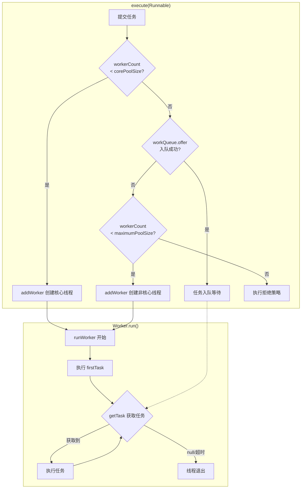
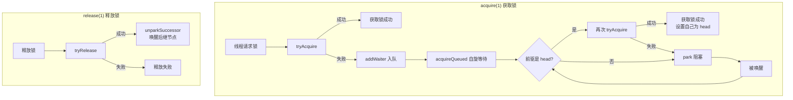
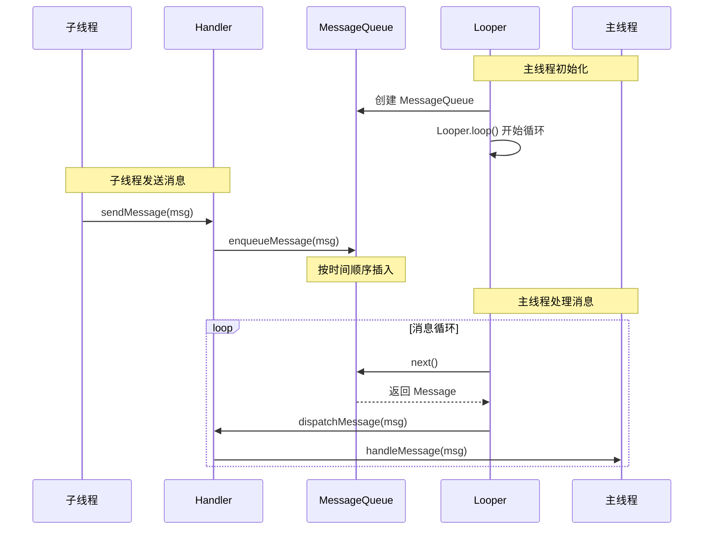

# 多线程源码篇

> **目标**：深入源码理解线程池的设计哲学，掌握 AQS 原理，对照 Android Handler 机制。

## 一、ThreadPoolExecutor 源码分析

### 1.1 一句话总结

**线程池的核心思想**：用有限的线程 + 任务队列，实现任务的复用调度，避免频繁创建销毁线程的开销。

### 1.2 设计哲学

```
线程池就像一个高效的餐厅管理系统：

1. 复用原则：服务员（线程）不会每服务完一个客人就辞职
   - 线程执行完任务后，继续从队列取任务，而不是销毁

2. 弹性伸缩：忙时加人，闲时减人
   - 任务多时创建非核心线程
   - 空闲超时后回收非核心线程

3. 有限资源：餐厅容量有限，不能无限加人
   - maximumPoolSize 限制最大线程数
   - 超出能力范围时执行拒绝策略

4. 任务排队：等候区让客人有序等待
   - BlockingQueue 缓冲任务
   - 避免瞬时大量任务压垮系统
```

### 1.3 核心流程图



### 1.4 关键源码解析

#### execute 方法

```java
// JDK 17 ThreadPoolExecutor.execute()
public void execute(Runnable command) {
    if (command == null)
        throw new NullPointerException();
    
    // ctl 是一个 AtomicInteger，高 3 位存状态，低 29 位存线程数
    int c = ctl.get();
    
    // 步骤1：线程数 < 核心线程数，直接创建核心线程
    if (workerCountOf(c) < corePoolSize) {
        if (addWorker(command, true))  // true 表示核心线程
            return;
        c = ctl.get();
    }
    
    // 步骤2：尝试入队
    if (isRunning(c) && workQueue.offer(command)) {
        int recheck = ctl.get();
        // 双重检查：入队后线程池可能已关闭
        if (!isRunning(recheck) && remove(command))
            reject(command);
        // 如果线程数为 0，创建一个线程来处理队列中的任务
        else if (workerCountOf(recheck) == 0)
            addWorker(null, false);
    }
    // 步骤3：队列满了，尝试创建非核心线程
    else if (!addWorker(command, false))  // false 表示非核心线程
        // 步骤4：失败则拒绝
        reject(command);
}
```

**设计亮点**：
- 使用 ctl 一个变量同时存储状态和线程数，减少锁竞争
- 双重检查机制，处理并发场景下的边界情况

#### addWorker 方法

```java
// 简化版 addWorker
private boolean addWorker(Runnable firstTask, boolean core) {
    retry:
    for (;;) {
        int c = ctl.get();
        int rs = runStateOf(c);
        
        // 检查线程池状态
        if (rs >= SHUTDOWN && 
            !(rs == SHUTDOWN && firstTask == null && !workQueue.isEmpty()))
            return false;
        
        for (;;) {
            int wc = workerCountOf(c);
            // 检查线程数限制
            if (wc >= CAPACITY ||
                wc >= (core ? corePoolSize : maximumPoolSize))
                return false;
            // CAS 增加线程计数
            if (compareAndIncrementWorkerCount(c))
                break retry;
            c = ctl.get();
            if (runStateOf(c) != rs)
                continue retry;
        }
    }
    
    // 创建 Worker（内部创建线程）
    Worker w = new Worker(firstTask);
    Thread t = w.thread;
    
    // 加锁，将 Worker 加入集合
    final ReentrantLock mainLock = this.mainLock;
    mainLock.lock();
    try {
        workers.add(w);
    } finally {
        mainLock.unlock();
    }
    
    // 启动线程
    t.start();
    return true;
}
```

**设计亮点**：
- 使用自旋 + CAS 减少锁竞争
- Worker 继承 AQS，本身就是一把锁，用于线程中断控制

#### runWorker 方法（线程复用的核心）

```java
// Worker 的核心执行方法
final void runWorker(Worker w) {
    Thread wt = Thread.currentThread();
    Runnable task = w.firstTask;
    w.firstTask = null;
    
    try {
        // 核心：循环获取任务执行
        // 这就是"线程复用"的关键！
        while (task != null || (task = getTask()) != null) {
            w.lock();  // Worker 本身是一把锁
            try {
                // 前置钩子
                beforeExecute(wt, task);
                try {
                    // 执行任务
                    task.run();
                } finally {
                    // 后置钩子
                    afterExecute(task, null);
                }
            } finally {
                task = null;  // 清空，准备获取下一个任务
                w.completedTasks++;
                w.unlock();
            }
        }
    } finally {
        // 线程退出
        processWorkerExit(w, completedAbruptly);
    }
}
```

**这就是线程复用的秘密**：
```
传统方式：一个任务一个线程
Thread1 → Task1 → 线程销毁
Thread2 → Task2 → 线程销毁

线程池方式：一个线程执行多个任务
Thread1 → Task1 → getTask() → Task2 → getTask() → Task3 → ...
         ↑                                              ↑
      firstTask                                    从队列获取
```

#### getTask 方法（阻塞获取任务）

```java
private Runnable getTask() {
    boolean timedOut = false;
    
    for (;;) {
        int c = ctl.get();
        int wc = workerCountOf(c);
        
        // 是否需要超时：非核心线程 或 allowCoreThreadTimeOut
        boolean timed = allowCoreThreadTimeOut || wc > corePoolSize;
        
        // 超时或线程数过多，返回 null（让线程退出）
        if ((wc > maximumPoolSize || (timed && timedOut))
            && (wc > 1 || workQueue.isEmpty())) {
            if (compareAndDecrementWorkerCount(c))
                return null;  // 返回 null，runWorker 会退出循环
            continue;
        }
        
        try {
            // 核心：从队列获取任务
            // poll：带超时的获取，超时返回 null
            // take：无限等待，直到有任务
            Runnable r = timed ?
                workQueue.poll(keepAliveTime, TimeUnit.NANOSECONDS) :
                workQueue.take();
            if (r != null)
                return r;
            timedOut = true;
        } catch (InterruptedException retry) {
            timedOut = false;
        }
    }
}
```

**设计亮点**：
- 使用 BlockingQueue 的阻塞特性实现"等待任务"
- 超时机制实现非核心线程的回收
- 核心线程可以选择是否超时（allowCoreThreadTimeOut）

### 1.5 延伸思考

**如果让你设计线程池，你会怎么做？**

```
1. 线程管理
   - 问题：如何高效管理线程的创建和销毁？
   - 方案：使用 Worker 封装线程，统一管理生命周期

2. 任务调度
   - 问题：任务来了怎么分配给线程？
   - 方案：使用 BlockingQueue 解耦生产者和消费者

3. 并发控制
   - 问题：多个地方修改线程数怎么办？
   - 方案：使用 AtomicInteger + CAS 实现无锁计数

4. 状态管理
   - 问题：如何优雅地关闭线程池？
   - 方案：使用状态机（RUNNING → SHUTDOWN → STOP → TIDYING → TERMINATED）
```

## 二、AQS 原理解析

### 2.1 一句话总结

**AQS（AbstractQueuedSynchronizer）**：Java 并发工具的基石，通过"状态 + 队列"实现各种同步器。

### 2.2 设计哲学

```
AQS 就像排队取号系统：

1. 状态（state）：当前服务窗口的状态
   - 0 表示空闲，可以服务
   - >0 表示被占用
   - ReentrantLock 用它记录重入次数

2. 队列（CLH Queue）：等候区
   - 获取锁失败的线程进入队列等待
   - 双向链表，方便取消和唤醒

3. 独占/共享模式
   - 独占：一次只能一个人用（ReentrantLock）
   - 共享：多个人可以同时用（Semaphore、CountDownLatch）
```

### 2.3 核心流程图



### 2.4 关键源码解析

#### acquire 方法（获取锁）

```java
// AQS.acquire()
public final void acquire(int arg) {
    // 1. tryAcquire：子类实现，尝试获取锁
    // 2. addWaiter：获取失败，加入等待队列
    // 3. acquireQueued：在队列中等待获取锁
    if (!tryAcquire(arg) &&
        acquireQueued(addWaiter(Node.EXCLUSIVE), arg))
        selfInterrupt();
}
```

#### ReentrantLock 的 tryAcquire（公平锁版本）

```java
// ReentrantLock.FairSync.tryAcquire()
protected final boolean tryAcquire(int acquires) {
    final Thread current = Thread.currentThread();
    int c = getState();
    
    if (c == 0) {
        // 公平锁：先检查队列中是否有等待的线程
        if (!hasQueuedPredecessors() &&
            compareAndSetState(0, acquires)) {
            setExclusiveOwnerThread(current);
            return true;
        }
    }
    // 重入：同一个线程再次获取锁
    else if (current == getExclusiveOwnerThread()) {
        int nextc = c + acquires;
        setState(nextc);  // 重入次数 +1
        return true;
    }
    return false;
}

// 非公平锁的区别：不检查队列，直接尝试 CAS
// 非公平锁性能更好，因为减少了线程切换
```

#### acquireQueued 方法（自旋等待）

```java
final boolean acquireQueued(final Node node, int arg) {
    try {
        boolean interrupted = false;
        for (;;) {  // 自旋
            final Node p = node.predecessor();
            
            // 只有前驱是 head 才能尝试获取锁
            // 这保证了 FIFO 顺序
            if (p == head && tryAcquire(arg)) {
                setHead(node);  // 获取成功，自己变成 head
                p.next = null;
                return interrupted;
            }
            
            // 获取失败，判断是否需要阻塞
            if (shouldParkAfterFailedAcquire(p, node) &&
                parkAndCheckInterrupt())  // LockSupport.park() 阻塞
                interrupted = true;
        }
    } catch (Throwable t) {
        cancelAcquire(node);
        throw t;
    }
}
```

**设计亮点**：
- 自旋 + 阻塞结合：短时间自旋，长时间阻塞
- 只有前驱是 head 才尝试获取，保证公平性

### 2.5 Android 中的应用

```kotlin
// Android 中没有直接使用 AQS，但思想类似

// Handler 机制中的等待唤醒
// MessageQueue.next() 类似 AQS 的 park
// Handler.sendMessage() 类似 AQS 的 unpark

// 简化的对应关系：
// AQS.acquire()     <->  MessageQueue.next()（获取消息，没有则等待）
// AQS.release()     <->  Handler.sendMessage()（发送消息，唤醒等待）
// CLH Queue         <->  MessageQueue（消息队列）
// LockSupport.park  <->  nativePollOnce（native 层阻塞）
```

## 三、Android Handler 机制源码

### 3.1 一句话总结

**Handler 机制**：Android 实现的线程间通信方案，基于消息队列 + 轮询，实现子线程向主线程安全传递消息。

### 3.2 设计哲学

```
Handler 机制解决的核心问题：
Android UI 只能在主线程更新，如何让子线程的结果显示到 UI 上？

设计选择：
1. 为什么不用回调？
   → 回调可能在任意线程执行，需要额外同步
   → Handler 保证 handleMessage 一定在目标线程执行

2. 为什么用消息队列？
   → 解耦发送方和接收方
   → 天然支持延迟消息、有序处理

3. 为什么每个线程只有一个 Looper？
   → 简化设计，避免多 Looper 的复杂同步
   → 用 ThreadLocal 实现线程隔离
```

### 3.3 核心流程图



### 3.4 关键源码解析

#### Looper.prepare() 和 ThreadLocal

```java
// Looper.java
public final class Looper {
    // ThreadLocal 存储每个线程的 Looper
    static final ThreadLocal<Looper> sThreadLocal = new ThreadLocal<>();
    
    private static void prepare(boolean quitAllowed) {
        if (sThreadLocal.get() != null) {
            // 每个线程只能有一个 Looper！
            throw new RuntimeException("Only one Looper may be created per thread");
        }
        sThreadLocal.set(new Looper(quitAllowed));
    }
    
    public static @Nullable Looper myLooper() {
        return sThreadLocal.get();
    }
    
    // 主线程的 Looper 在这里创建
    public static void prepareMainLooper() {
        prepare(false);  // 主线程的 Looper 不允许退出
        sMainLooper = myLooper();
    }
}
```

**为什么用 ThreadLocal？**
```
1. 线程隔离：每个线程有自己的 Looper，互不干扰
2. 方便获取：任何地方都可以 Looper.myLooper() 获取当前线程的 Looper
3. 生命周期：Looper 跟随线程生命周期
```

#### Looper.loop() 消息循环

```java
public static void loop() {
    final Looper me = myLooper();
    final MessageQueue queue = me.mQueue;
    
    for (;;) {  // 无限循环！
        // 可能阻塞：队列空时等待
        Message msg = queue.next();
        
        if (msg == null) {
            // 只有 Looper.quit() 时才返回 null
            return;
        }
        
        // 分发消息给 Handler 处理
        msg.target.dispatchMessage(msg);
        
        // 回收 Message 对象（对象池复用）
        msg.recycleUnchecked();
    }
}
```

**问题：loop() 是死循环，为什么不会卡死 UI？**

```
答案：因为没有消息时，loop() 会阻塞在 queue.next()

主线程的工作流程：
1. 用户点击屏幕 → 系统发送触摸事件 Message
2. Looper.loop() 从 next() 返回
3. Handler 处理事件，调用 View.onTouchEvent()
4. 处理完毕，继续 loop()，阻塞在 next()

所以主线程大部分时间其实是"睡眠"状态，只有有消息时才"工作"
这就是为什么主线程做耗时操作会 ANR：
阻塞在耗时操作 → 无法处理其他消息 → 系统认为无响应
```

#### MessageQueue.next() 阻塞机制

```java
Message next() {
    final long ptr = mPtr;  // native 层消息队列指针
    
    int nextPollTimeoutMillis = 0;
    for (;;) {
        // 关键：native 层阻塞
        // nextPollTimeoutMillis = -1 时无限等待
        // nextPollTimeoutMillis = 0 时立即返回
        // nextPollTimeoutMillis > 0 时等待指定时间
        nativePollOnce(ptr, nextPollTimeoutMillis);
        
        synchronized (this) {
            final long now = SystemClock.uptimeMillis();
            Message msg = mMessages;
            
            if (msg != null) {
                if (now < msg.when) {
                    // 消息还没到执行时间，计算等待时间
                    nextPollTimeoutMillis = (int) Math.min(msg.when - now, Integer.MAX_VALUE);
                } else {
                    // 取出消息返回
                    mMessages = msg.next;
                    return msg;
                }
            } else {
                // 没有消息，无限等待
                nextPollTimeoutMillis = -1;
            }
            
            // IdleHandler 处理（队列空闲时执行）
            // 这是一个很好的优化点！
            for (int i = 0; i < pendingIdleHandlerCount; i++) {
                final IdleHandler idler = mPendingIdleHandlers[i];
                idler.queueIdle();  // 执行空闲任务
            }
        }
    }
}
```

**nativePollOnce 的底层原理**：
```
Linux epoll 机制：
1. epoll_wait() 阻塞线程
2. 有事件（新消息入队）时通过 eventfd 唤醒
3. 这是高效的事件驱动模型，不是忙等待
```

#### Handler.sendMessage() 入队

```java
public boolean sendMessageAtTime(@NonNull Message msg, long uptimeMillis) {
    MessageQueue queue = mQueue;
    return enqueueMessage(queue, msg, uptimeMillis);
}

private boolean enqueueMessage(MessageQueue queue, Message msg, long uptimeMillis) {
    msg.target = this;  // 记录是哪个 Handler 发送的
    return queue.enqueueMessage(msg, uptimeMillis);
}

// MessageQueue.enqueueMessage()
boolean enqueueMessage(Message msg, long when) {
    synchronized (this) {
        msg.when = when;
        Message p = mMessages;
        
        // 按时间顺序插入链表
        if (p == null || when == 0 || when < p.when) {
            // 插入头部
            msg.next = p;
            mMessages = msg;
            needWake = true;
        } else {
            // 找到合适位置插入
            Message prev;
            for (;;) {
                prev = p;
                p = p.next;
                if (p == null || when < p.when) {
                    break;
                }
            }
            msg.next = p;
            prev.next = msg;
        }
        
        // 唤醒阻塞的 next()
        if (needWake) {
            nativeWake(mPtr);  // 通过 eventfd 唤醒
        }
    }
    return true;
}
```

### 3.5 与线程池的对比

| 维度 | Handler | ThreadPoolExecutor |
|-----|---------|-------------------|
| 核心思想 | 消息队列 + 轮询 | 线程复用 + 任务队列 |
| 等待机制 | epoll（高效） | BlockingQueue.take() |
| 任务顺序 | 按时间排序 | FIFO（默认） |
| 线程模型 | 单消费者 | 多消费者 |
| 适用场景 | 线程间通信 | 并发任务执行 |

### 3.6 Handler 内存泄漏问题

```kotlin
// ❌ 经典的内存泄漏场景
class LeakyActivity : AppCompatActivity() {
    // 非静态内部类持有外部类引用
    private val handler = object : Handler(Looper.getMainLooper()) {
        override fun handleMessage(msg: Message) {
            // this 隐式持有 LeakyActivity 引用
            // 如果有延迟消息，Activity 销毁后仍被 MessageQueue 引用
            updateUI()
        }
    }
    
    override fun onCreate(savedInstanceState: Bundle?) {
        super.onCreate(savedInstanceState)
        // 发送一个 10 秒后执行的消息
        handler.sendEmptyMessageDelayed(0, 10_000)
    }
    
    // Activity 销毁了，但消息还在队列里
    // MessageQueue → Message → Handler → Activity（泄漏！）
}

// ✅ 解决方案1：静态内部类 + 弱引用
class SafeActivity : AppCompatActivity() {
    private val handler = SafeHandler(this)
    
    private class SafeHandler(activity: SafeActivity) : Handler(Looper.getMainLooper()) {
        private val activityRef = WeakReference(activity)
        
        override fun handleMessage(msg: Message) {
            activityRef.get()?.updateUI()  // Activity 销毁后 get() 返回 null
        }
    }
    
    override fun onDestroy() {
        super.onDestroy()
        handler.removeCallbacksAndMessages(null)  // 移除所有消息
    }
}

// ✅ 解决方案2：使用协程（推荐）
class CoroutineActivity : AppCompatActivity() {
    override fun onCreate(savedInstanceState: Bundle?) {
        super.onCreate(savedInstanceState)
        
        // lifecycleScope 自动跟随 Activity 生命周期
        lifecycleScope.launch {
            delay(10_000)  // 等待 10 秒
            updateUI()    // Activity 销毁后，协程自动取消，不会执行
        }
    }
}
```

## 四、Kotlin 协程调度原理

### 4.1 一句话总结

**协程调度**：协程本质上还是运行在线程上，Dispatchers 就是不同的线程池。

### 4.2 Dispatchers 背后的线程池

```kotlin
// Dispatchers.IO 的实现
// 底层使用 LimitingDispatcher，基于共享线程池

// 源码简化版
object Dispatchers {
    // Default：CPU 密集型，核心数个线程
    val Default: CoroutineDispatcher = DefaultScheduler
    
    // IO：共享 Default 的线程池，但允许更多并发
    val IO: CoroutineDispatcher = DefaultScheduler.IO
    
    // Main：Android 主线程
    val Main: MainCoroutineDispatcher = MainDispatcherLoader.dispatcher
}

// DefaultScheduler 的线程池配置
internal object DefaultScheduler : ExperimentalCoroutineDispatcher() {
    // 核心线程数 = CPU 核心数（最少 2 个）
    val corePoolSize = max(2, Runtime.getRuntime().availableProcessors())
    
    // IO 使用同样的线程池，但允许更多任务排队
    val IO = LimitingDispatcher(this, 64)  // 最多 64 个并发
}
```

### 4.3 协程切换的本质

```kotlin
// 协程"切换线程"的本质就是：把后续代码提交到另一个线程池执行

suspend fun loadData() {
    // 当前在主线程
    val data = withContext(Dispatchers.IO) {
        // 这段代码被"打包"成 Continuation
        // 然后 post 到 IO 线程池执行
        fetchFromNetwork()
    }
    // fetchFromNetwork 完成后
    // 后续代码又被"打包"成 Continuation
    // post 回主线程执行
    updateUI(data)
}

// 大致等价于（伪代码）
fun loadData() {
    ioExecutor.execute {
        val data = fetchFromNetwork()
        mainHandler.post {
            updateUI(data)
        }
    }
}
```

### 4.4 与 Handler 的关系

```kotlin
// Dispatchers.Main 在 Android 上就是基于 Handler 实现的

// 源码简化
internal class HandlerContext(
    private val handler: Handler
) : CoroutineDispatcher() {
    
    override fun dispatch(context: CoroutineContext, block: Runnable) {
        // 本质就是 Handler.post()!
        handler.post(block)
    }
}

// 所以：
// Dispatchers.Main.launch { ... }
// 等价于：
// Handler(Looper.getMainLooper()).post { ... }
```

## 五、面试检验

### 源码级问题

**Q1：线程池是如何实现线程复用的？**

> **结论**：Worker 线程在 runWorker() 中循环调用 getTask() 获取任务执行。
> 
> **源码要点**：
> ```java
> while (task != null || (task = getTask()) != null) {
>     task.run();  // 执行任务
>     task = null; // 清空，继续获取下一个
> }
> ```
> 线程执行完一个任务后不会销毁，而是继续从队列获取下一个任务。

**Q2：AQS 是什么？ReentrantLock 如何实现？**

> **结论**：AQS 是 Java 并发工具的基础框架，通过 state + CLH 队列实现。
> 
> **原理**：
> - state = 0 表示锁空闲，>0 表示被占用
> - 获取锁失败的线程进入 CLH 队列排队
> - ReentrantLock 重入时 state++，释放时 state--
> - 公平锁先检查队列，非公平锁直接 CAS

**Q3：Handler 的 loop() 是死循环，为什么不会 ANR？**

> **结论**：因为没有消息时会阻塞在 MessageQueue.next()。
> 
> **原理**：
> - next() 内部调用 nativePollOnce()，基于 epoll 机制
> - 没有消息时线程阻塞（睡眠），不占用 CPU
> - 有新消息时通过 eventfd 唤醒
> - 所以主线程大部分时间是"睡眠"状态，只有处理消息时才"工作"

**Q4：为什么不推荐在主线程做耗时操作？从源码角度解释。**

> **结论**：因为主线程要在 Looper.loop() 中不断处理消息。
> 
> **源码分析**：
> ```java
> // Looper.loop()
> for (;;) {
>     Message msg = queue.next();     // 1. 获取消息
>     msg.target.dispatchMessage(msg); // 2. 处理消息（如果这里耗时5秒+）
>     // 3. 系统的触摸事件、绘制事件都无法处理 → ANR
> }
> ```

**Q5：协程的 Dispatchers.IO 和线程池什么关系？**

> **结论**：Dispatchers.IO 底层就是一个线程池。
> 
> **原理**：
> - Dispatchers.IO 是 LimitingDispatcher，限制最大并发 64
> - 共享 Dispatchers.Default 的线程池
> - withContext(Dispatchers.IO) 就是把代码提交到这个线程池执行
> - 协程切换的本质就是把 Continuation 提交到不同线程池

---

_本文档持续更新，添加更多源码分析内容_

← [返回目录](./README.md)
