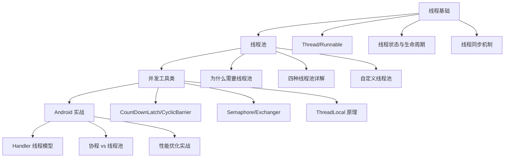

# Java 多线程与线程池

> 从 Android 开发者视角深入理解 Java 并发编程，掌握 Handler/Looper 的设计精髓

## 为什么要学这个？

作为 Android 开发者，理解多线程是**必修课**：

```
学 Java 线程 → 理解 Handler/Looper/MessageQueue 为什么这样设计
学线程池 → 理解为什么 OkHttp、Glide 都有自己的线程池
学并发工具 → 理解 CountDownLatch 在启动优化中的妙用
学线程安全 → 理解 synchronized/volatile 在 Android 源码中的应用
```

## Android 中的多线程应用

| Java 多线程技术 | Android 关联 | 学了能理解什么 |
|---------------|-------------|---------------|
| **Thread/Runnable** | Handler、HandlerThread | 为什么主线程不能做耗时操作 |
| **线程池** | AsyncTask、OkHttp、Glide | 为什么不直接 new Thread |
| **synchronized** | Collections.synchronizedList | 线程安全集合的实现原理 |
| **volatile** | DCL 单例模式 | 为什么单例要加 volatile |
| **wait/notify** | Looper.loop() 阻塞原理 | MessageQueue 如何实现等待消息 |
| **ThreadLocal** | Looper 存储机制 | 为什么一个线程只有一个 Looper |
| **CountDownLatch** | 启动优化 | 如何等待多个初始化任务完成 |
| **ConcurrentHashMap** | 并发缓存 | 线程安全的缓存如何实现 |

## 学习路线



## 核心问题预览

学完本系列，你应该能回答以下问题：

### 基础篇
- 创建线程有几种方式？Callable 和 Runnable 有什么区别？
- 线程有哪些状态？如何实现线程间通信？
- synchronized 和 Lock 有什么区别？
- volatile 能保证线程安全吗？

### 进阶篇
- 为什么不推荐直接 new Thread()？
- 四种线程池各自适用什么场景？
- 如何设置线程池的核心参数？有什么经验法则？
- ThreadLocal 会导致内存泄漏吗？如何避免？

### 源码篇
- 线程池是如何复用线程的？
- AQS 是什么？ReentrantLock 如何实现公平锁？
- Android Handler 的消息机制是如何实现的？
- Kotlin 协程是如何调度线程的？

## 文档导航

| 文档 | 内容 | 适合人群 |
|-----|------|---------|
| [1-基础篇](./1-基础篇.md) | 线程创建、状态、同步、通信 | 想打好并发基础的开发者 |
| [2-进阶篇](./2-进阶篇.md) | 线程池、并发工具、Android 实战 | 想深入理解线程池的开发者 |
| [3-源码篇](./3-源码篇.md) | 源码分析、设计哲学、深度解析 | 想理解底层原理的开发者 |

## 与 Kotlin 协程的关系

很多人问："有了协程，还需要学线程吗？"

**答案是肯定的**：

```kotlin
// 协程本质上还是运行在线程上
viewModelScope.launch(Dispatchers.IO) {
    // 这行代码底层还是用线程池执行的！
    // 理解线程池，才能理解 Dispatchers.IO 的设计
    val data = repository.fetchData()
}
```

| 维度 | 线程/线程池 | Kotlin 协程 |
|-----|-----------|------------|
| 抽象层级 | 底层 | 高层（基于线程池） |
| 切换开销 | 较大（内核态切换） | 较小（用户态切换） |
| 代码风格 | 回调地狱 | 同步风格 |
| 取消机制 | 需手动实现 | 结构化并发，自动取消 |
| Android 推荐 | 理解原理用 | 实际开发用 |

**学习建议**：先理解线程和线程池的原理，再学协程会更加透彻。就像学开车要先了解发动机原理一样。

---

_开始学习：[1-基础篇](./1-基础篇.md) - 线程基础知识入门 →_
